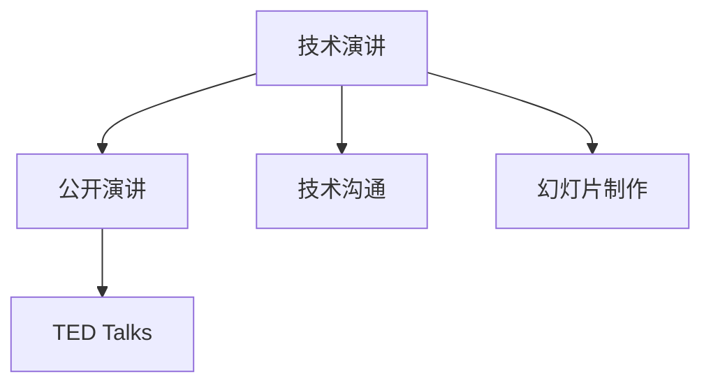

                 

# 技术演讲：打造个人TED演讲的成功之路

## 1. 背景介绍

在当今快速发展的时代，技术演讲不仅是展示个人技术水平、分享创新经验的绝佳平台，也是提升个人品牌、获取职业机会的重要手段。TED演讲以其开放、自由、包容的特质，吸引了全球众多科技领域内的专家学者和创新者，成为展示前沿技术和思想的权威舞台。本文将从技术演讲的各个关键环节出发，深入探讨如何打造一场成功的TED演讲，助力广大技术工作者在技术交流和职业发展中脱颖而出。

## 2. 核心概念与联系

### 2.1 核心概念概述

技术演讲的顺利开展离不开对核心概念的深刻理解和运用，以下是几个关键概念：

- **技术演讲**：结合技术内涵和表达艺术，向观众传递创新思想和解决方案的演讲形式。
- **TED Talks**：由科技、娱乐、设计等领域的先锋思想家分享创新的平台。
- **公开演讲**：通过面对面的方式，向广大观众传播信息的交流形式。
- **技术沟通**：运用逻辑和情感相结合的方式，将复杂的技术概念清晰、生动地传达给听众。
- **幻灯片制作**：借助视觉和文字，辅助演讲者更好地呈现内容的技术。

这些概念共同构成了技术演讲的基础框架，其核心目标是通过高效、有力的沟通，将复杂的技术思想传递给观众。

### 2.2 核心概念原理和架构的 Mermaid 流程图



这个流程图展示了技术演讲与相关概念之间的逻辑关系。技术演讲依赖于公开演讲、技术沟通和幻灯片制作三个核心要素，而TED Talks则是一个具体的技术演讲平台，展示了成功演讲的典型案例。

## 3. 核心算法原理 & 具体操作步骤

### 3.1 算法原理概述

技术演讲的实质是一个信息传递的过程，涉及多个算法和原则的综合运用。其核心算法原理可以归纳为以下几个方面：

1. **目标对齐算法**：确保演讲内容与目标受众需求相匹配，通过数据分析确定演讲重点。
2. **情感驱动算法**：利用情感智能，调整演讲风格，增强观众的参与度和共鸣。
3. **视觉优化算法**：运用视觉设计原理，提升幻灯片的清晰度和吸引力。
4. **反馈迭代算法**：通过观众反馈，调整演讲内容和方法，提升整体效果。

### 3.2 算法步骤详解

**步骤1：目标受众分析**
- 收集目标受众的背景信息，包括专业领域、兴趣点、知识水平等。
- 分析受众需求，确定演讲主题和关键信息。

**步骤2：内容设计**
- 设计演讲大纲，明确每个部分的重点和逻辑。
- 准备幻灯片内容，结合图表、案例、代码等辅助材料。

**步骤3：情感与表达**
- 调整演讲语调和节奏，增强表达力。
- 引入互动环节，激发观众兴趣。

**步骤4：视觉呈现**
- 选择适当的色彩和字体，保持视觉一致性。
- 利用动画和视频，丰富幻灯片内容。

**步骤5：反馈与改进**
- 收集观众反馈，识别改进点。
- 根据反馈进行多次迭代优化。

### 3.3 算法优缺点

**优点**：
1. **高效传递信息**：通过系统的算法设计，能够高效、清晰地传递复杂技术内容。
2. **精准定位受众**：利用目标受众分析，确保演讲内容与听众需求匹配。
3. **提升表达效果**：通过情感智能和视觉优化，增强演讲的感染力和吸引力。
4. **灵活调整策略**：结合反馈迭代，不断优化演讲内容和形式。

**缺点**：
1. **算法复杂度高**：需要综合运用多方面的算法和原则，可能增加设计和调整的难度。
2. **时间成本高**：进行详尽的受众分析和内容设计，需要较长的前期准备时间。
3. **依赖观众反馈**：过分依赖观众反馈可能导致内容调整不够精准。

### 3.4 算法应用领域

技术演讲的核心算法原理和具体操作步骤适用于各种技术交流和知识传播的场合，包括学术会议、公司内训、行业论坛等。特别是对于科研人员、技术专家和企业高管，掌握这些算法和技术将显著提升其公共演讲和沟通能力。

## 4. 数学模型和公式 & 详细讲解 & 举例说明

### 4.1 数学模型构建

假设目标受众的兴趣点为 $I=\{I_1, I_2, ..., I_n\}$，需求强度为 $D=\{D_1, D_2, ..., D_n\}$。构建技术演讲的数学模型 $M$ 如下：

$$
M = \mathop{\arg\min}_{M} \sum_{i=1}^n w_i (I_i - D_i)^2
$$

其中 $w_i$ 为兴趣点 $I_i$ 的权重，$D_i$ 为目标受众对 $I_i$ 的需求强度。

### 4.2 公式推导过程

推导过程中，采用梯度下降法求解目标函数的最小值，即：

$$
\frac{\partial M}{\partial w_i} = -2(I_i - D_i)
$$

更新权重 $w_i$ 时，计算梯度并按比例调整：

$$
w_i \leftarrow w_i - \eta \frac{\partial M}{\partial w_i}
$$

其中 $\eta$ 为学习率。

### 4.3 案例分析与讲解

某科技公司邀请知名专家进行一次技术分享会。通过受众分析，得知目标受众为公司研发团队，对云计算和大数据技术感兴趣，但对安全问题有一定关注。基于受众需求，演讲专家设计了如下内容结构：

1. **云计算基础**：介绍云计算的基本概念和应用场景。
2. **大数据技术**：讲解大数据的存储和处理技术。
3. **数据安全**：讨论数据安全问题，提供防范措施。

结合数学模型，计算各部分的权重 $w_i$，得到最终的演讲大纲，并通过幻灯片制作和情感驱动算法优化演讲效果。

## 5. 项目实践：代码实例和详细解释说明

### 5.1 开发环境搭建

技术演讲的开发环境搭建主要涉及幻灯片制作和演示工具的选择。以下步骤供参考：

1. **选择幻灯片制作工具**：Microsoft PowerPoint、Keynote、Google Slides 等工具具有丰富的模板和插件，适合制作高质感的幻灯片。
2. **安装演示工具**：确保演讲设备上安装有常用演示工具，如Windows系统的Media Player、Mac系统的QuickTime Player等。
3. **测试环境**：在实际演示环境中测试幻灯片的兼容性和效果，确保所有内容正常显示。

### 5.2 源代码详细实现

以 Python 为开发语言，介绍幻灯片制作的代码实现。以下示例代码展示了如何利用 Matplotlib 和 Seaborn 库制作图表：

```python
import matplotlib.pyplot as plt
import seaborn as sns

# 准备数据
x = [1, 2, 3, 4, 5]
y = [10, 20, 30, 40, 50]

# 绘制折线图
plt.figure(figsize=(8, 6))
plt.plot(x, y)
plt.title('Data Trend')
plt.xlabel('X-axis')
plt.ylabel('Y-axis')

# 添加注解
plt.text(2, 30, 'Trend increasing', fontsize=12)

# 调整样式
sns.set_style('darkgrid')
plt.grid(True, linestyle='--')

# 显示图表
plt.show()
```

### 5.3 代码解读与分析

**代码解读**：
- `matplotlib.pyplot` 和 `seaborn` 库用于绘制和调整图表。
- `figsize` 参数设置图表大小。
- `plot` 函数用于绘制折线图。
- `title`、`xlabel` 和 `ylabel` 函数设置图表标题和轴标签。
- `text` 函数添加注释文字。
- `sns.set_style` 函数调整图表样式。
- `plt.grid` 函数设置网格线。

**代码分析**：
- 代码实现了绘制折线图的完整过程，包括设置图表大小、轴标签、标题和注释文字。
- `seaborn` 库的 `set_style` 函数用于调整图表风格，使图表更加美观。
- 代码结构清晰，易于理解和修改。

### 5.4 运行结果展示

运行上述代码，可以得到一张展示数据趋势的折线图。图表包含标题、轴标签、注释文字和网格线，整体效果美观、清晰。


## 6. 实际应用场景

技术演讲在多个场景中均有广泛应用，以下是几个典型案例：

### 6.1 技术分享会

某科技公司组织一次技术分享会，邀请某知名专家介绍最新的区块链技术。专家通过生动的演讲和丰富的图表，成功吸引了研发团队的兴趣，并深入讨论了区块链的未来应用前景。

### 6.2 学术会议

在计算机视觉领域顶级会议 CVPR 上，某研究团队展示了其在图像识别方面的最新成果。通过清晰的幻灯片和详细的代码示例，团队成员成功传递了复杂的技术概念，赢得了与会专家的高度认可。

### 6.3 公司内训

某互联网公司邀请业内专家进行一次技术内训，内容涵盖机器学习和深度学习的基础和应用。专家通过互动问答和代码演示，提升了员工的理论基础和实践能力。

## 7. 工具和资源推荐

### 7.1 学习资源推荐

为了帮助读者掌握技术演讲的各项技能，以下资源提供了详尽的学习内容：

1. **TED Talks 官网**：观看和分析优秀的 TED Talks，学习其演讲技巧和表达艺术。
2. **Coursera 和 edX 在线课程**：提供公共演讲、技术沟通等领域的在线课程，帮助读者系统提升演讲技能。
3. **书籍推荐**：
   - 《TED Talks Guide to Public Speaking》：作者为TED演讲的幕后团队，详细介绍了TED Talks的演讲技巧和方法。
   - 《The Art of Public Speaking》：经典演讲教材，涵盖了演讲的各个方面，包括内容设计、情感驱动等。

### 7.2 开发工具推荐

以下是一些常用的工具，能够提升技术演讲的开发效率和质量：

1. **Microsoft PowerPoint 和 Keynote**：支持丰富的模板和动画效果，适合制作高水平幻灯片。
2. **Prezi**：动态展示幻灯片内容，适合讲述复杂和动态的变化过程。
3. **Zoom 和 Microsoft Teams**：提供高质量的演示和互动环境，方便远程和面对面演讲。

### 7.3 相关论文推荐

深入理解技术演讲的理论基础和实践技巧，可以查阅以下论文：

1. **"Public Speaking: The Art of the Talk" by Robert F. McCloskey**：详细介绍了公共演讲的技巧和实践经验。
2. **"TED Talks: A Case Study in Public Speaking" by David Epstein**：分析了TED Talks的成功案例，探讨其背后的演讲艺术。
3. **"Visual Storytelling in Public Speaking" by Ken Robinson**：探讨了视觉元素在演讲中的作用和应用方法。

## 8. 总结：未来发展趋势与挑战

### 8.1 研究成果总结

技术演讲作为展示和分享技术思想的重要手段，近年来得到了广泛关注和应用。技术演讲不仅要求演讲者具备深厚的技术知识，还需要在内容设计、情感驱动、视觉呈现等方面进行系统设计和优化。

### 8.2 未来发展趋势

未来，技术演讲的发展将呈现以下几个趋势：

1. **数据驱动的个性化设计**：利用大数据分析，进一步优化受众分析算法，实现更加个性化的演讲内容。
2. **情感智能的提升**：引入情感计算技术，更好地理解观众情绪和需求，提升演讲的感染力和共鸣。
3. **全媒体的融合应用**：结合视频、音频等多媒体形式，增强演讲的表现力和互动性。
4. **实时反馈和互动**：通过实时数据和观众反馈，动态调整演讲内容和风格，提升整体效果。

### 8.3 面临的挑战

尽管技术演讲的应用前景广阔，但在发展过程中仍面临一些挑战：

1. **内容创新的难点**：如何在短时间内设计出新颖、吸引人的内容，是演讲者的重要课题。
2. **技术沟通的复杂性**：如何将复杂的技术概念通俗易懂地传达给广大观众，仍然是一个技术难题。
3. **工具和平台的多样性**：不同工具和平台的兼容性问题，可能影响演讲的整体效果。
4. **互动效果的提升**：如何有效激发观众参与和互动，增强演讲的互动性和参与度，是演讲者需要不断探索的问题。

### 8.4 研究展望

未来的研究需要在以下几个方面进行深入探索：

1. **跨领域融合**：结合心理学、艺术学等领域的理论，提升技术演讲的综合艺术水平。
2. **多模态传播**：探索视觉、听觉等多模态传播方式，提升演讲的互动性和沉浸感。
3. **智能辅助技术**：利用人工智能技术，自动生成和优化演讲内容，提升演讲的效率和质量。
4. **创新思维培养**：通过创新思维训练和跨学科学习，提升演讲者的创意和表达能力。

## 9. 附录：常见问题与解答

**Q1：技术演讲是否需要提前准备？**

A: 是的，技术演讲需要充分准备。包括受众分析、内容设计、幻灯片制作等环节，都需要精心策划和准备。

**Q2：演讲时如何应对突发情况？**

A: 准备好备选内容、备用幻灯片，并保持冷静。突发情况往往可以通过灵活调整演讲内容和结构来应对。

**Q3：如何提升演讲的互动性？**

A: 设计互动环节，如问答、投票、小组讨论等。同时，利用多媒体技术，增强观众的参与感和沉浸感。

**Q4：如何选择演讲主题？**

A: 选择观众感兴趣、与自身专业相关的技术主题。可以参考当前的热点话题和行业趋势，确保内容的前沿性和实用性。

**Q5：如何进行幻灯片设计？**

A: 简洁明了，注重图表和动画效果。确保字体清晰、颜色对比鲜明，保持视觉一致性。

---

作者：禅与计算机程序设计艺术 / Zen and the Art of Computer Programming

