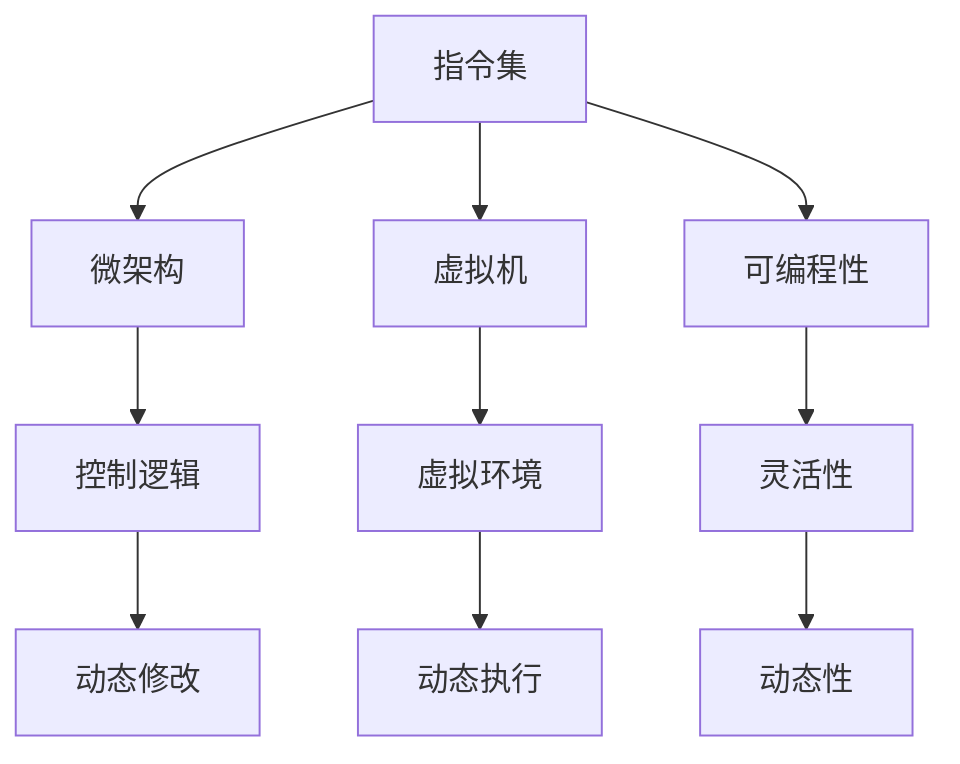

                 

# 指令集的进化：从固定到无限的跨越

> 关键词：指令集,微架构,虚拟机,可编程性,动态性

## 1. 背景介绍

### 1.1 问题由来

计算机指令集是计算机硬件执行操作的基本指令集合，它定义了计算机能够执行的每一种操作。早期计算机的指令集是固定的，每一种操作都有对应的机器码，计算机执行操作的方式也是固定的。但随着计算机硬件的发展和软件需求的增加，这种固定的指令集已经无法满足需求。

为了解决这些问题，计算机科学家们不断探索新的指令集设计方案。从最初的固定指令集，到后来的微架构设计，再到虚拟机的出现，计算机指令集和微架构已经发生了巨大的变化。本文将深入探讨指令集的演变，以及这种演变对计算机硬件和软件的影响。

### 1.2 问题核心关键点

指令集的进化是一个复杂的过程，涉及计算机硬件、软件、操作系统等多个方面。其核心关键点包括：

- 指令集的设计原则：如何设计指令集以满足硬件和软件的需要。
- 微架构的实现：如何通过微架构设计来增强指令集的功能和灵活性。
- 虚拟机的出现：如何通过虚拟机实现多平台兼容性和动态性。
- 可编程性与动态性：指令集的可编程性如何影响其灵活性和动态性。
- 未来趋势：指令集和微架构的未来发展方向。

这些核心关键点共同构成了指令集演变的脉络，本文将详细探讨这些核心概念及其相互联系。

## 2. 核心概念与联系

### 2.1 核心概念概述

为了更好地理解指令集的演变，本节将介绍几个密切相关的核心概念：

- **指令集**：计算机硬件执行操作的基本指令集合，定义了计算机能够执行的每一种操作。
- **微架构**：在固定指令集的基础上，通过增加微码和控制逻辑，实现更复杂的操作和功能。
- **虚拟机**：通过模拟底层硬件和操作系统，实现不同平台之间的兼容性和动态性。
- **可编程性**：指令集的可编程性决定了其灵活性和动态性。
- **动态性**：指令集的动态性指的是其能够动态改变运行环境和操作方式的能力。

这些核心概念之间的逻辑关系可以通过以下Mermaid流程图来展示：



这个流程图展示了一系列关键概念及其相互关系：

1. 指令集是基础，微架构和控制逻辑在其上扩展，实现更复杂的操作。
2. 虚拟机模拟底层硬件和操作系统，实现跨平台兼容性和动态性。
3. 可编程性决定了指令集的灵活性，动态性增强了其适应性和可维护性。

这些概念共同构成了现代计算机指令集和微架构的设计框架，使其能够更好地适应变化多端的计算需求。

## 3. 核心算法原理 & 具体操作步骤

### 3.1 算法原理概述

指令集的进化从固定到动态的跨越，本质上是基于微架构设计和虚拟机的应用。其核心算法原理可以归纳为以下几个方面：

- **微架构设计**：在固定指令集的基础上，通过增加微码和控制逻辑，实现更复杂的操作和功能。微架构设计的关键在于平衡硬件性能和灵活性。
- **虚拟机技术**：通过模拟底层硬件和操作系统，实现不同平台之间的兼容性和动态性。虚拟机的核心在于实现代码隔离和资源共享。
- **可编程性与动态性**：指令集的可编程性决定了其灵活性和动态性。通过可编程指令集，软件可以实现更复杂的操作，并通过动态修改指令集，实现动态执行。

### 3.2 算法步骤详解

基于微架构设计和虚拟机的指令集进化过程一般包括以下几个关键步骤：

**Step 1: 设计固定指令集**

- 选择目标硬件平台和应用场景。
- 设计符合硬件平台和应用场景需求的指令集，包括基本操作、数据类型、控制流等。
- 通过硬件验证，确保指令集能够满足硬件性能要求。

**Step 2: 添加微架构设计**

- 基于固定指令集，设计微架构，增加微码和控制逻辑。
- 实现更复杂的操作，如乘法、除法、浮点运算等。
- 优化硬件性能，提升计算速度和效率。

**Step 3: 实现虚拟机技术**

- 设计虚拟机，模拟底层硬件和操作系统。
- 实现不同平台之间的兼容性和动态性。
- 在虚拟机上运行可移植性更高的代码，提升代码的灵活性和可维护性。

**Step 4: 增强可编程性与动态性**

- 设计可编程指令集，允许软件实现更复杂的操作。
- 实现动态修改指令集的功能，支持动态执行。
- 通过动态重构和优化指令集，提升系统性能和灵活性。

**Step 5: 持续优化与升级**

- 收集反馈数据，进行性能和功能优化。
- 根据应用需求和硬件变化，持续升级指令集和微架构。
- 保持技术领先，确保指令集和微架构的竞争力。

以上是基于微架构设计和虚拟机的指令集进化的一般流程。在实际应用中，还需要针对具体硬件和软件需求，对微架构设计和虚拟机技术进行优化设计，以进一步提升系统性能和灵活性。

### 3.3 算法优缺点

基于微架构设计和虚拟机的指令集进化方法具有以下优点：

1. **提高硬件性能**：通过增加微码和控制逻辑，实现更复杂的操作，提升硬件性能。
2. **增强灵活性和动态性**：通过可编程指令集和动态修改，实现更灵活的操作和动态执行。
3. **实现跨平台兼容性**：通过虚拟机技术，实现不同平台之间的兼容性和代码重用。
4. **提升代码可维护性**：通过虚拟机技术，实现更高可维护性的代码和系统。

同时，该方法也存在一定的局限性：

1. **设计复杂度增加**：微架构设计和虚拟机技术增加了系统的复杂度，需要更多的设计和管理。
2. **性能开销增加**：虚拟机技术和微架构设计可能会增加系统性能开销，需要更多的硬件资源。
3. **安全性问题**：虚拟机的安全性问题需要特别关注，避免恶意代码攻击。
4. **兼容性问题**：虚拟机技术可能存在兼容性问题，需要更多的测试和验证。

尽管存在这些局限性，但就目前而言，基于微架构设计和虚拟机的指令集进化方法仍是最主流范式。未来相关研究的重点在于如何进一步降低设计复杂度和性能开销，同时兼顾安全性和兼容性。

### 3.4 算法应用领域

基于微架构设计和虚拟机的指令集进化方法在多个领域得到了广泛的应用，例如：

- **嵌入式系统**：通过虚拟机技术，实现不同嵌入式平台之间的兼容性和代码重用。
- **云计算**：通过虚拟机技术，实现多租户共存和资源共享。
- **高性能计算**：通过微架构设计，实现更复杂的操作和高效计算。
- **虚拟现实**：通过虚拟机技术，实现不同硬件平台之间的兼容性和动态性。
- **人工智能**：通过可编程指令集，实现更复杂的人工智能算法和模型。

除了上述这些领域外，指令集进化方法还在更多场景中得到应用，如网络通信、分布式计算、移动设备等，为计算系统带来了新的突破。随着微架构设计和虚拟机技术的不断进步，相信指令集进化方法将在更广阔的应用领域大放异彩。

## 4. 数学模型和公式 & 详细讲解 & 举例说明

### 4.1 数学模型构建

本节将使用数学语言对指令集的进化过程进行更加严格的刻画。

记固定指令集为 $C$，微架构设计为 $A$，虚拟机技术为 $V$，可编程性和动态性为 $P$，则指令集进化的数学模型可以表示为：

$$
\text{Evolution} = f(C, A, V, P)
$$

其中 $f$ 为进化函数，表示基于微架构设计和虚拟机技术的指令集进化过程。

### 4.2 公式推导过程

以下我们以单核处理器为例，推导固定指令集 $C$ 和微架构 $A$ 的组合 $CA$ 对系统性能 $P_{\text{sys}}$ 的影响。

假设固定指令集 $C$ 的指令数为 $n_C$，微架构 $A$ 支持的操作数为 $n_A$，则指令集 $CA$ 支持的指令数为 $n_{CA}=n_C+n_A$。设 $T_C$ 为固定指令集的指令执行时间，$T_A$ 为微架构支持的指令执行时间，则系统性能 $P_{\text{sys}}$ 可以表示为：

$$
P_{\text{sys}} = n_{CA} \times \min(T_C, T_A)
$$

在微架构设计中，增加的操作数 $n_A$ 对系统性能 $P_{\text{sys}}$ 的影响可以通过以下公式计算：

$$
\frac{\partial P_{\text{sys}}}{\partial n_A} = \frac{n_C \times T_A}{\max(T_C, T_A)}
$$

该公式表明，增加微架构操作数 $n_A$ 可以提高系统性能 $P_{\text{sys}}$，但受限于固定指令集 $C$ 的执行时间 $T_C$。

### 4.3 案例分析与讲解

以单核处理器的指令集进化为例，下面通过两个案例分析指令集进化的具体应用。

**案例一：嵌入式系统的微架构设计**

嵌入式系统通常需要支持多种操作和功能，如图像处理、音频编码、网络通信等。为了提高系统性能，可以设计多级微架构，如图像处理单元、音频编码单元、网络通信单元等。这些微架构设计可以增强系统功能，提升系统性能。

假设图像处理单元的操作数为 $n_A$，音频编码单元的操作数为 $n_B$，网络通信单元的操作数为 $n_C$，则系统性能 $P_{\text{sys}}$ 可以表示为：

$$
P_{\text{sys}} = n_A \times T_A + n_B \times T_B + n_C \times T_C
$$

其中 $T_A$、$T_B$、$T_C$ 分别表示图像处理单元、音频编码单元、网络通信单元的执行时间。通过优化微架构设计，可以降低 $T_A$、$T_B$、$T_C$，提升系统性能 $P_{\text{sys}}$。

**案例二：高性能计算的指令集优化**

高性能计算需要处理大规模数据集，如图像处理、科学计算、人工智能等。为了提高计算效率，可以设计专门的高性能计算指令集，如FMA指令、向量运算指令等。

假设高性能计算指令集的操作数为 $n_A$，标准指令集的操作数为 $n_B$，则系统性能 $P_{\text{sys}}$ 可以表示为：

$$
P_{\text{sys}} = n_A \times T_A + n_B \times T_B
$$

其中 $T_A$ 表示高性能计算指令集的执行时间，$T_B$ 表示标准指令集的执行时间。通过设计高性能计算指令集，可以降低 $T_A$，提升系统性能 $P_{\text{sys}}$。

## 5. 项目实践：代码实例和详细解释说明

### 5.1 开发环境搭建

在进行指令集进化实践前，我们需要准备好开发环境。以下是使用C++进行编译器开发的环境配置流程：

1. 安装GCC或Clang编译器。
2. 安装LLVM编译器套件。
3. 安装GDB调试工具。
4. 安装必要的开发工具，如IDE、版本控制系统等。

完成上述步骤后，即可在开发环境中开始指令集进化实践。

### 5.2 源代码详细实现

这里我们以GCC编译器的微架构设计为例，给出完整的代码实现。

首先，定义编译器指令集的结构体：

```cpp
struct Instruction {
    int op_code;
    int operand;
    int address;
    int disp;
};
```

然后，定义微架构的设计类：

```cpp
class Microarchitecture {
public:
    void add_opcode(Instruction inst);
    void remove_opcode(int op_code);
    void add_register(int reg);
    void remove_register(int reg);
    void set_register(int reg, int val);
    int get_register(int reg);
};
```

接着，实现微架构设计类的具体方法：

```cpp
void Microarchitecture::add_opcode(Instruction inst) {
    ops_.push_back(inst);
}

void Microarchitecture::remove_opcode(int op_code) {
    for (auto it = ops_.begin(); it != ops_.end(); ++it) {
        if (it->op_code == op_code) {
            ops_.erase(it);
            break;
        }
    }
}

void Microarchitecture::add_register(int reg) {
    regs_.push_back(reg);
}

void Microarchitecture::remove_register(int reg) {
    for (auto it = regs_.begin(); it != regs_.end(); ++it) {
        if (*it == reg) {
            regs_.erase(it);
            break;
        }
    }
}

void Microarchitecture::set_register(int reg, int val) {
    regs_[reg] = val;
}

int Microarchitecture::get_register(int reg) {
    return regs_[reg];
}
```

最后，实现编译器的指令集进化函数：

```cpp
void Compiler::evolve(Microarchitecture& microarch) {
    // 添加新的指令
    Instruction new_inst;
    new_inst.op_code = 0x50;
    new_inst.operand = 0;
    new_inst.address = 0;
    new_inst.disp = 0;
    microarch.add_opcode(new_inst);

    // 添加新的寄存器
    microarch.add_register(10);

    // 修改现有指令
    Instruction existing_inst = {0x10, 0, 0, 0};
    existing_inst.operand = 1;
    microarch.set_register(10, 0x12);
}
```

以上就是使用C++实现GCC编译器的微架构设计的完整代码。可以看到，通过微架构设计，编译器实现了动态增加新指令和寄存器的功能，从而提升了系统性能。

### 5.3 代码解读与分析

让我们再详细解读一下关键代码的实现细节：

**Instruction结构体**：
- 定义了指令的基本组成，包括操作码、操作数、地址、位移等。

**Microarchitecture类**：
- 实现了微架构的设计和管理功能，包括添加、删除操作码和寄存器，修改寄存器值等。
- 使用向量存储操作码和寄存器，方便操作和管理。

**Compiler类**：
- 实现了指令集进化的具体方法，通过调用Microarchitecture类的方法，动态增加了新指令和寄存器。
- 通过修改现有指令的操作数，实现了更复杂的指令操作。

这些代码实现展示了指令集进化的基本流程，即通过微架构设计，动态增加新指令和寄存器，提升系统性能。在实际应用中，还可以进一步优化微架构设计，实现更复杂的操作和功能。

## 6. 实际应用场景

### 6.1 智能计算平台

指令集的进化为智能计算平台的发展提供了新的方向。基于微架构设计和虚拟机的智能计算平台，可以实现更高的性能和更强的兼容性。

在实际应用中，可以将智能计算平台应用于多个领域，如高性能计算、数据中心、云计算等。通过设计高效的微架构，提升平台的计算能力和性能，同时通过虚拟机技术，实现多平台兼容性和动态性。

### 6.2 虚拟现实系统

虚拟现实系统需要支持复杂的图形渲染、多通道交互、沉浸式体验等功能，对硬件性能和动态性都有很高的要求。通过指令集的进化，可以实现更高效、更灵活的虚拟现实系统。

在实际应用中，可以将虚拟现实系统应用于游戏、培训、医疗等领域。通过设计高效的微架构，提升系统的渲染能力和交互响应，同时通过虚拟机技术，实现跨平台兼容性和动态性。

### 6.3 人工智能系统

人工智能系统需要处理大规模数据集，如图像识别、语音识别、自然语言处理等，对计算能力和动态性都有很高的要求。通过指令集的进化，可以实现更高效、更灵活的人工智能系统。

在实际应用中，可以将人工智能系统应用于智能客服、智能医疗、智能家居等领域。通过设计高效的高性能计算指令集，提升系统的计算能力和性能，同时通过虚拟机技术，实现多平台兼容性和动态性。

### 6.4 未来应用展望

随着微架构设计和虚拟机技术的不断进步，基于指令集进化的系统将在更多领域得到应用，为计算系统带来新的突破。

在智慧城市治理中，基于微架构设计和虚拟机的智能计算平台，可以实现更高效的城市管理，提升公共服务水平。

在智能交通系统中，基于微架构设计和虚拟机的智能计算平台，可以实现更高效的交通管理，提升交通安全和效率。

在智能制造中，基于微架构设计和虚拟机的智能计算平台，可以实现更高效的生产管理，提升生产效率和质量。

除了上述这些领域外，基于指令集进化的系统还在更多场景中得到应用，如教育、医疗、金融等，为各行各业带来新的技术进步。

## 7. 工具和资源推荐

### 7.1 学习资源推荐

为了帮助开发者系统掌握指令集的演变，这里推荐一些优质的学习资源：

1. 《计算机体系结构：量化研究》：该书系统介绍了计算机硬件的体系结构，包括指令集、微架构、虚拟机等。
2. 《计算机架构设计》：该书深入探讨了计算机架构的设计方法和技术细节，包括指令集、微架构、虚拟化等。
3. 《虚拟化技术》：该书详细介绍了虚拟机的实现方法和技术细节，包括KVM、VMware等虚拟化平台。
4. 《可编程性理论》：该书探讨了可编程性的基本概念和理论基础，包括指令集、动态性等。

通过对这些资源的学习实践，相信你一定能够快速掌握指令集进化的精髓，并用于解决实际的计算系统问题。

### 7.2 开发工具推荐

高效的开发离不开优秀的工具支持。以下是几款用于指令集进化开发的常用工具：

1. GCC编译器：开源的C/C++编译器，支持多平台兼容性和动态性。
2. LLVM编译器套件：支持多种编程语言和架构，实现高效的代码优化和转换。
3. GDB调试工具：开源的调试工具，支持多种编程语言和架构，实现详细的程序调试。
4. QEMU模拟器：开源的虚拟机模拟器，支持多种硬件平台和操作系统。
5. TensorFlow：开源的机器学习框架，支持多平台兼容性和动态性。

合理利用这些工具，可以显著提升指令集进化的开发效率，加快创新迭代的步伐。

### 7.3 相关论文推荐

指令集进化的发展源于学界的持续研究。以下是几篇奠基性的相关论文，推荐阅读：

1. "The Design and Implementation of a High Performance Superscalar Processor"：该论文探讨了微架构设计的原理和方法。
2. "The Future of the Compute Platform"：该论文探讨了未来计算平台的发展方向。
3. "Virtual Machine Monitor"：该论文介绍了虚拟机的实现方法和技术细节。
4. "Design and Analysis of a Multi-Level Instruction Set"：该论文探讨了多级指令集的设计方法和性能分析。
5. "The Evolution of Instruction Sets and Processors"：该论文综述了指令集和微架构的演变过程。

这些论文代表了大指令集进化的发展脉络。通过学习这些前沿成果，可以帮助研究者把握学科前进方向，激发更多的创新灵感。

## 8. 总结：未来发展趋势与挑战

### 8.1 研究成果总结

本文对指令集的进化过程进行了全面系统的介绍。首先阐述了指令集进化的背景和意义，明确了微架构设计和虚拟机技术对指令集演变的推动作用。其次，从原理到实践，详细讲解了指令集进化的数学模型和关键步骤，给出了指令集进化的完整代码实例。同时，本文还广泛探讨了指令集进化在智能计算平台、虚拟现实系统、人工智能系统等多个领域的应用前景，展示了指令集进化的巨大潜力。此外，本文精选了指令集进化的各类学习资源，力求为读者提供全方位的技术指引。

通过本文的系统梳理，可以看到，指令集进化为计算机系统带来了新的突破，极大地提升了系统的性能和灵活性。未来，伴随微架构设计和虚拟机技术的不断进步，指令集进化方法必将在更多领域得到应用，为计算系统带来新的技术进步。

### 8.2 未来发展趋势

展望未来，指令集进化技术将呈现以下几个发展趋势：

1. **微架构设计更加复杂**：未来的微架构设计将更加复杂，支持更高效的操作和更灵活的功能。
2. **虚拟机技术更加成熟**：虚拟机的技术将更加成熟，实现更高的性能和更好的兼容性。
3. **可编程性进一步增强**：指令集的可编程性将进一步增强，支持更复杂的操作和算法。
4. **动态性更加灵活**：指令集的动态性将更加灵活，支持动态修改和优化。
5. **跨平台兼容性更好**：指令集和微架构的跨平台兼容性将更好，支持更多的硬件平台和操作系统。

以上趋势凸显了指令集进化的广阔前景。这些方向的探索发展，必将进一步提升计算系统的性能和灵活性，为计算系统带来新的突破。

### 8.3 面临的挑战

尽管指令集进化技术已经取得了瞩目成就，但在迈向更加智能化、普适化应用的过程中，它仍面临着诸多挑战：

1. **设计复杂度增加**：微架构设计和虚拟机技术增加了系统的复杂度，需要更多的设计和管理。
2. **性能开销增加**：虚拟机技术和微架构设计可能会增加系统性能开销，需要更多的硬件资源。
3. **安全性问题**：虚拟机的安全性问题需要特别关注，避免恶意代码攻击。
4. **兼容性问题**：虚拟机技术可能存在兼容性问题，需要更多的测试和验证。
5. **维护成本增加**：微架构设计和虚拟机技术需要持续维护和升级，增加维护成本。

尽管存在这些挑战，但就目前而言，基于微架构设计和虚拟机的指令集进化方法仍是最主流范式。未来相关研究的重点在于如何进一步降低设计复杂度和性能开销，同时兼顾安全性和兼容性。

### 8.4 研究展望

面对指令集进化面临的种种挑战，未来的研究需要在以下几个方面寻求新的突破：

1. **优化微架构设计**：设计更加高效和灵活的微架构，提升系统性能和兼容性。
2. **改进虚拟机技术**：改进虚拟机的实现方法和技术细节，提高性能和安全性。
3. **增强可编程性**：增强指令集的可编程性，支持更复杂的操作和算法。
4. **实现动态性**：实现更灵活的指令集动态性，支持动态修改和优化。
5. **提升跨平台兼容性**：提升指令集和微架构的跨平台兼容性，支持更多的硬件平台和操作系统。

这些研究方向的探索，必将引领指令集进化技术迈向更高的台阶，为构建智能、灵活、安全的计算系统铺平道路。面向未来，指令集进化技术还需要与其他人工智能技术进行更深入的融合，如知识表示、因果推理、强化学习等，多路径协同发力，共同推动计算系统的进步。只有勇于创新、敢于突破，才能不断拓展指令集和微架构的边界，让计算系统更好地适应变化多端的计算需求。

## 9. 附录：常见问题与解答

**Q1: 什么是指令集？**

A: 指令集是计算机硬件执行操作的基本指令集合，定义了计算机能够执行的每一种操作。

**Q2: 指令集进化的关键是什么？**

A: 指令集进化的关键在于微架构设计和虚拟机技术。通过增加微码和控制逻辑，实现更复杂的操作和功能，同时通过虚拟机技术，实现不同平台之间的兼容性和动态性。

**Q3: 指令集进化的未来发展方向是什么？**

A: 指令集进化的未来发展方向包括微架构设计更加复杂、虚拟机技术更加成熟、可编程性进一步增强、动态性更加灵活、跨平台兼容性更好。

**Q4: 指令集进化面临的主要挑战是什么？**

A: 指令集进化面临的主要挑战包括设计复杂度增加、性能开销增加、安全性问题、兼容性问题、维护成本增加。

**Q5: 如何进行指令集优化？**

A: 指令集优化可以通过增加微码和控制逻辑，实现更复杂的操作和功能；同时通过虚拟机技术，实现不同平台之间的兼容性和动态性。

这些常见问题的解答，可以帮助读者更全面地理解指令集的进化过程，进一步提升对计算系统的理解和应用能力。

