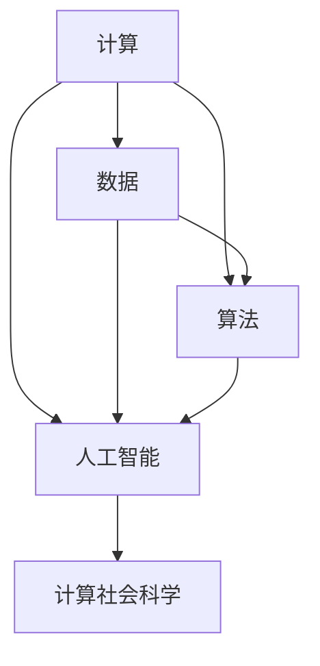

                 

# 推动社会进步的动力：人类计算的积极影响

## 1. 背景介绍

在当今这个数字化时代，计算技术已成为推动社会进步的重要动力。从计算到数据再到算法，这一切都在无形中影响着我们的生活和工作。计算技术的进步不仅推动了科技的发展，也深刻改变了社会的方方面面。本文将探讨人类计算的积极影响，以及未来可能的发展方向。

## 2. 核心概念与联系

### 2.1 核心概念概述

人类计算的核心概念可以概括为以下几个方面：

- **计算（Computation）**：指通过算法和数据处理任务，将输入数据转换为输出结果的过程。计算不仅涉及硬件设备的物理操作，还包括软件算法的设计与实现。
- **数据（Data）**：指用于计算过程的信息，包括结构化与非结构化数据。大数据技术的发展使得数据成为推动计算进步的关键要素。
- **算法（Algorithms）**：指用于解决问题的具体方法或步骤序列。算法的选择直接影响计算的效率和结果的准确性。
- **人工智能（AI）**：指通过模拟人类智能行为，使计算机具备自主学习、推理、感知等能力。AI的发展离不开计算技术的支持。
- **计算社会科学（Computational Social Science）**：指利用计算方法和数据处理技术，研究人类社会行为与结构。

这些概念之间相互关联，共同构成了人类计算的完整框架。

### 2.2 核心概念原理和架构的 Mermaid 流程图



此流程图展示了计算、数据、算法、人工智能和计算社会科学之间的联系。数据通过算法转化为计算结果，而人工智能则依赖于计算和算法实现。计算社会科学则是利用人工智能和技术手段，研究人类社会行为。

## 3. 核心算法原理 & 具体操作步骤

### 3.1 算法原理概述

人类计算的算法原理主要涉及以下几个方面：

- **结构化算法**：指基于明确步骤和逻辑流程的算法，如排序、查找等。
- **非结构化算法**：指基于模式识别和学习的算法，如机器学习、深度学习等。
- **并行算法**：指通过分布式计算和并行处理，提高算法执行效率的算法。
- **优化算法**：指通过数学模型和算法优化，提升算法性能的算法。

这些算法原理在不同领域的应用，推动了人类计算技术的进步。

### 3.2 算法步骤详解

一个典型的算法步骤包括以下几个阶段：

1. **输入定义**：定义算法需要处理的输入数据类型和范围。
2. **算法设计**：设计算法的具体步骤和方法。
3. **数据处理**：根据算法要求，处理输入数据，如去重、归一化等。
4. **算法执行**：按照设计步骤执行算法，得到输出结果。
5. **结果分析**：对算法输出结果进行分析，判断是否满足预期。

例如，一个简单的排序算法步骤如下：

1. 输入定义：定义排序的数据类型和范围。
2. 算法设计：设计排序算法，如冒泡排序、快速排序等。
3. 数据处理：将输入数据进行去重、归一化等预处理。
4. 算法执行：按照排序算法步骤，对数据进行排序。
5. 结果分析：输出排序结果，判断是否符合预期。

### 3.3 算法优缺点

人类计算的算法优点包括：

- **高效性**：通过优化算法，提高计算效率。
- **准确性**：通过结构化算法和数学模型，提升计算精度。
- **可扩展性**：通过并行算法，实现大规模计算。

算法缺点包括：

- **复杂性**：算法设计复杂，需要深厚的专业知识。
- **资源消耗**：大规模计算需要大量硬件资源，如CPU、GPU等。
- **数据依赖性**：算法结果依赖于输入数据的质量和规模。

### 3.4 算法应用领域

人类计算的算法广泛应用于以下几个领域：

- **科学研究**：通过模拟和计算，研究物理、化学、生物等科学问题。
- **工程设计**：通过计算和模拟，优化产品设计和制造工艺。
- **金融分析**：通过算法和数据处理，分析市场趋势，做出投资决策。
- **医疗健康**：通过计算医学图像和基因数据，诊断疾病和治疗方案。
- **社会治理**：通过计算社会科学数据，研究社会行为和结构，优化政策决策。

## 4. 数学模型和公式 & 详细讲解 & 举例说明

### 4.1 数学模型构建

计算的核心是数学模型的构建。数学模型通常包括以下几个要素：

- **自变量和因变量**：定义输入数据和输出结果的关系。
- **数学公式**：用数学语言描述自变量和因变量之间的关系。
- **边界条件**：定义模型适用的数据范围和条件。

例如，最简单的线性回归模型可以表示为：

$$ y = w_0 + w_1x_1 + w_2x_2 + \cdots + w_nx_n $$

其中，$y$ 为因变量，$x_1, x_2, \cdots, x_n$ 为自变量，$w_0, w_1, \cdots, w_n$ 为模型参数。

### 4.2 公式推导过程

数学模型的推导过程通常包括以下几个步骤：

1. **假设设定**：定义问题的数学模型和假设条件。
2. **模型建立**：根据假设条件，构建数学模型。
3. **求解过程**：通过数学推导，求解模型参数。
4. **结果验证**：将模型结果与实际数据进行对比，验证模型的准确性。

以线性回归模型为例，其推导过程如下：

1. 假设数据符合线性关系，即存在常数$w_0, w_1, \cdots, w_n$，使得$y = w_0 + w_1x_1 + w_2x_2 + \cdots + w_nx_n$。
2. 将数据带入模型，得到方程组：
$$
\begin{cases}
y_1 = w_0 + w_1x_{11} + w_2x_{12} + \cdots + w_nx_{1n} \\
y_2 = w_0 + w_1x_{21} + w_2x_{22} + \cdots + w_nx_{2n} \\
\cdots \\
y_m = w_0 + w_1x_{m1} + w_2x_{m2} + \cdots + w_nx_{mn}
\end{cases}
$$
3. 通过求解方程组，得到模型参数$w_0, w_1, \cdots, w_n$。
4. 将模型参数带入新数据，得到预测结果，验证模型准确性。

### 4.3 案例分析与讲解

以机器学习中的支持向量机（SVM）为例，其推导过程如下：

1. 假设数据符合线性可分，即存在超平面$w_1x_1 + w_2x_2 + \cdots + w_nx_n + b = 0$，将数据分为两类。
2. 将数据带入模型，得到方程组：
$$
\begin{cases}
w_1x_{11} + w_2x_{12} + \cdots + w_nx_{1n} + b = y_1 \\
w_1x_{21} + w_2x_{22} + \cdots + w_nx_{2n} + b = y_2 \\
\cdots \\
w_1x_{m1} + w_2x_{m2} + \cdots + w_nx_{mn} + b = y_m
\end{cases}
$$
3. 通过求解方程组，得到模型参数$w_1, w_2, \cdots, w_n, b$。
4. 将模型参数带入新数据，得到分类结果，验证模型准确性。

## 5. 项目实践：代码实例和详细解释说明

### 5.1 开发环境搭建

在进行项目实践前，我们需要准备好开发环境。以下是使用Python进行机器学习开发的典型环境配置流程：

1. 安装Anaconda：从官网下载并安装Anaconda，用于创建独立的Python环境。
2. 创建并激活虚拟环境：
```bash
conda create -n myenv python=3.8 
conda activate myenv
```
3. 安装必要的Python库：
```bash
pip install numpy scipy scikit-learn pandas matplotlib seaborn jupyter notebook ipython
```

完成上述步骤后，即可在`myenv`环境中开始项目实践。

### 5.2 源代码详细实现

以下是一个简单的机器学习项目，使用线性回归模型预测房价：

```python
import pandas as pd
import numpy as np
from sklearn.linear_model import LinearRegression
from sklearn.metrics import mean_squared_error, r2_score

# 读取数据集
data = pd.read_csv('housing.csv')

# 定义特征和目标变量
X = data[['age', 'median_income', 'housing_median_age', 'num_room', 'num_bedroom', 'population', 'bedroom_per_room', 'pupilTeacher_ratio', 'median_house_value']]
y = data['median_house_value']

# 拆分数据集为训练集和测试集
from sklearn.model_selection import train_test_split
X_train, X_test, y_train, y_test = train_test_split(X, y, test_size=0.2, random_state=42)

# 训练模型
model = LinearRegression()
model.fit(X_train, y_train)

# 预测和评估
y_pred = model.predict(X_test)
mse = mean_squared_error(y_test, y_pred)
r2 = r2_score(y_test, y_pred)
print(f'MSE: {mse:.2f}, R^2: {r2:.2f}')
```

### 5.3 代码解读与分析

让我们再详细解读一下关键代码的实现细节：

**数据处理**：
- `pd.read_csv`：使用pandas库读取CSV格式的数据集。
- `X`和`y`：定义特征和目标变量，用于训练模型。

**模型训练**：
- `train_test_split`：使用scikit-learn库拆分数据集为训练集和测试集。
- `LinearRegression`：使用scikit-learn库定义线性回归模型。
- `fit`：使用训练集训练模型。

**预测和评估**：
- `predict`：使用测试集进行预测。
- `mean_squared_error`和`r2_score`：使用scikit-learn库评估模型的预测精度。

可以看到，通过上述代码，我们成功使用线性回归模型对房价数据进行了预测和评估，展示了机器学习的基本流程。

## 6. 实际应用场景

### 6.1 智能推荐系统

智能推荐系统已经成为各大电商和社交平台的核心功能之一。通过计算用户行为和偏好，推荐系统能够提供个性化的商品和内容，提升用户体验和平台黏性。

在技术实现上，可以收集用户浏览、点击、购买等行为数据，构建用户-商品关联矩阵。通过矩阵分解和协同过滤等算法，对数据进行降维和聚类，得到用户和商品的潜在特征。将潜在特征作为输入，训练推荐模型，输出推荐结果。

### 6.2 医疗健康诊断

医疗健康领域一直是计算技术的重要应用场景。通过计算医学影像和基因数据，诊断系统能够快速准确地诊断疾病，制定治疗方案。

在技术实现上，可以收集病人的医学影像和基因数据，构建医学影像和基因特征向量。通过深度学习模型，对数据进行特征提取和分类，得到疾病诊断结果。将诊断结果与实际数据进行对比，验证模型的准确性。

### 6.3 金融风险管理

金融行业面临着复杂多变的市场环境和风险因素。通过计算金融数据和市场信息，风险管理平台能够实时监测市场趋势，识别风险点，制定风险应对策略。

在技术实现上，可以收集金融市场数据和公司财务数据，构建金融数据特征向量。通过机器学习模型，对数据进行特征分析和预测，得到风险评估结果。将风险评估结果与实际风险事件进行对比，验证模型的准确性。

## 7. 工具和资源推荐

### 7.1 学习资源推荐

为了帮助开发者系统掌握计算技术，这里推荐一些优质的学习资源：

1. Coursera《机器学习》课程：由斯坦福大学教授Andrew Ng开设，系统讲解机器学习的基础理论和常用算法。
2. DeepLearning.AI《深度学习》课程：由吴恩达教授主讲，涵盖深度学习的基本概念和实践技术。
3. Udacity《Python for Data Science》课程：使用Python进行数据科学和机器学习开发的入门教程。
4. Kaggle机器学习竞赛：参与实际数据集上的竞赛，提升实战能力。
5. GitHub开源项目：使用GitHub平台搜索相关开源项目，学习和借鉴他人的代码实现。

通过对这些资源的学习实践，相信你一定能够快速掌握计算技术的精髓，并用于解决实际的业务问题。

### 7.2 开发工具推荐

高效的开发离不开优秀的工具支持。以下是几款用于机器学习开发的常用工具：

1. Jupyter Notebook：轻量级、交互式的数据分析和模型训练工具。
2. PyTorch：基于Python的开源深度学习框架，灵活动态的计算图，适合快速迭代研究。
3. TensorFlow：由Google主导开发的开源深度学习框架，生产部署方便，适合大规模工程应用。
4. Scikit-learn：基于Python的机器学习库，提供了多种经典的机器学习算法和工具。
5. Matplotlib：Python的绘图库，用于可视化数据和模型结果。

合理利用这些工具，可以显著提升机器学习任务的开发效率，加快创新迭代的步伐。

### 7.3 相关论文推荐

计算技术的快速发展离不开学界的持续研究。以下是几篇奠基性的相关论文，推荐阅读：

1. Coursera《机器学习》课程笔记：吴恩达教授的课程笔记，详细讲解了机器学习的基本概念和常用算法。
2. TensorFlow官方文档：TensorFlow框架的官方文档，提供了丰富的算法和工具介绍。
3. DeepLearning.AI《深度学习》课程笔记：吴恩达教授的课程笔记，详细讲解了深度学习的基本概念和实践技术。
4. Scikit-learn官方文档：Scikit-learn库的官方文档，提供了多种经典机器学习算法和工具的详细说明。
5. Kaggle机器学习竞赛论文：参与实际数据集上的竞赛，发布的优秀论文，展示了前沿的机器学习技术。

这些论文代表了大计算技术的发展脉络。通过学习这些前沿成果，可以帮助研究者把握学科前进方向，激发更多的创新灵感。

## 8. 总结：未来发展趋势与挑战

### 8.1 总结

本文对计算技术的积极影响进行了全面系统的介绍。首先阐述了计算技术在科学研究、工程设计、金融分析、医疗健康、社会治理等多个领域的重要应用，明确了计算技术在推动社会进步中的重要作用。其次，从原理到实践，详细讲解了计算技术的数学模型和算法实现，给出了计算技术应用的完整代码实例。同时，本文还探讨了计算技术在智能推荐、医疗诊断、金融风险管理等实际应用场景中的具体实现方法。

通过本文的系统梳理，可以看到，计算技术在多个领域的应用已经取得了显著的成果。未来，伴随计算技术的不断进步，更多领域将受到计算技术的积极影响，共同推动社会向更加智能化、高效化的方向发展。

### 8.2 未来发展趋势

展望未来，计算技术的发展将呈现以下几个趋势：

1. **深度学习技术进一步提升**：深度学习技术的进步将推动计算技术在更多领域的应用，如自然语言处理、计算机视觉等。
2. **大数据技术不断突破**：大数据技术的进步将使计算技术能够处理更多复杂的数据类型和规模。
3. **云计算和分布式计算普及**：云计算和分布式计算技术的应用将使计算资源更加易得，推动计算技术的普及和应用。
4. **人工智能与计算技术结合**：人工智能与计算技术的结合将使计算技术能够更好地理解和模拟人类智能行为。
5. **计算技术与物联网融合**：计算技术与物联网的结合将使计算技术能够实时处理海量数据，提升物联网系统的智能化水平。

这些趋势将进一步推动计算技术的广泛应用，提升各领域的工作效率和决策质量，为社会进步提供更强有力的技术支撑。

### 8.3 面临的挑战

尽管计算技术已经取得了瞩目成就，但在迈向更加智能化、普适化应用的过程中，它仍面临着诸多挑战：

1. **数据隐私和安全**：计算技术在处理大量数据时，需要保证数据隐私和安全。如何保护用户数据，防止数据泄露和滥用，是一个亟待解决的问题。
2. **算法偏见和公平性**：计算技术在处理数据时，可能会引入算法偏见。如何避免偏见，保证算法的公平性和透明性，是计算技术应用的重要挑战。
3. **计算资源限制**：计算技术需要大量硬件资源，如GPU、TPU等。如何在有限的计算资源下，高效地实现计算任务，是一个重要的研究方向。
4. **模型可解释性**：计算模型往往被视为“黑盒”，难以解释其内部工作机制和决策逻辑。如何赋予计算模型更强的可解释性，是计算技术应用的重要方向。
5. **技术落地应用**：计算技术的理论研究与实际应用之间存在差距，如何将理论成果转化为实际应用，是计算技术发展的重要任务。

正视计算技术面临的这些挑战，积极应对并寻求突破，将使计算技术在推动社会进步的过程中，发挥更大的作用。

### 8.4 研究展望

未来的计算技术研究需要在以下几个方面寻求新的突破：

1. **数据隐私保护技术**：研究如何保护数据隐私和安全，防止数据泄露和滥用。
2. **公平性和透明性**：研究如何避免算法偏见，保证算法的公平性和透明性。
3. **高效计算方法**：研究如何在有限的计算资源下，高效地实现计算任务。
4. **模型可解释性**：研究如何赋予计算模型更强的可解释性，增强其应用的可信度。
5. **跨领域融合**：研究计算技术与其他领域的融合应用，如计算社会科学、计算生物学等，提升计算技术的应用范围和深度。

这些研究方向将引领计算技术迈向更加智能化、普适化和可控化的方向，推动社会向更加智能化、高效化的方向发展。总之，计算技术的发展离不开学界和产业界的共同努力，只有不断创新、不断突破，才能实现计算技术的广泛应用和应用价值最大化。

## 9. 附录：常见问题与解答

**Q1：计算技术在推动社会进步中有哪些具体应用？**

A: 计算技术在推动社会进步中有许多具体应用，包括但不限于以下几个方面：

- **科学研究**：计算技术能够模拟和分析复杂物理、化学、生物等科学问题，加速科学发现和创新。
- **工程设计**：计算技术能够优化产品设计和制造工艺，提升产品性能和生产效率。
- **金融分析**：计算技术能够分析和预测金融市场趋势，制定投资策略和风险管理方案。
- **医疗健康**：计算技术能够诊断疾病和治疗方案，提升医疗服务的质量和效率。
- **社会治理**：计算技术能够研究社会行为和结构，优化政策决策和公共服务。

这些应用展示了计算技术在各个领域的重要作用，推动了社会的全面进步。

**Q2：计算技术在实际应用中需要考虑哪些因素？**

A: 计算技术在实际应用中需要考虑以下几个因素：

- **数据质量**：计算技术的性能依赖于数据质量，需要保证数据完整、准确和一致。
- **算法选择**：选择合适的算法能够提高计算效率和结果准确性，需要根据实际问题选择合适的算法。
- **计算资源**：计算任务需要大量计算资源，需要合理分配和利用计算资源。
- **隐私和安全**：计算技术处理大量数据时，需要保证数据隐私和安全，防止数据泄露和滥用。
- **模型可解释性**：计算模型往往被视为“黑盒”，需要赋予模型更强的可解释性，增强其应用的可信度。

这些因素需要综合考虑，才能使计算技术在实际应用中发挥最大的价值。

**Q3：如何提高计算技术的可解释性？**

A: 提高计算技术的可解释性可以通过以下几个方法：

- **模型简化**：通过简化模型结构，降低计算复杂度，使模型更易于解释。
- **可视化技术**：使用可视化技术展示模型内部工作机制和决策过程，增强模型的可理解性。
- **特征重要性分析**：分析模型中各个特征的重要程度，揭示模型决策的依据。
- **解释模型**：开发专门用于解释计算模型的工具和方法，提供模型结果的详细解释。

这些方法可以帮助提高计算技术的可解释性，使其更加透明和可信。

**Q4：如何保护数据隐私和安全？**

A: 保护数据隐私和安全可以通过以下几个方法：

- **数据加密**：使用加密技术保护数据传输和存储的安全性，防止数据泄露和篡改。
- **访问控制**：使用访问控制技术限制数据访问权限，防止未经授权的访问。
- **匿名化处理**：对数据进行匿名化处理，保护用户隐私。
- **安全审计**：定期进行安全审计，发现和修复数据安全漏洞。

这些方法可以保护数据隐私和安全，防止数据泄露和滥用。

**Q5：如何实现高效计算？**

A: 实现高效计算可以通过以下几个方法：

- **算法优化**：优化算法结构，减少计算复杂度，提高计算效率。
- **并行计算**：使用并行计算技术，利用多核处理器和分布式计算资源，提高计算速度。
- **数据压缩**：使用数据压缩技术，减少数据存储和传输的资源消耗。
- **模型压缩**：使用模型压缩技术，减小模型参数规模，提高计算效率。

这些方法可以在有限的计算资源下，高效地实现计算任务。

---

作者：禅与计算机程序设计艺术 / Zen and the Art of Computer Programming

