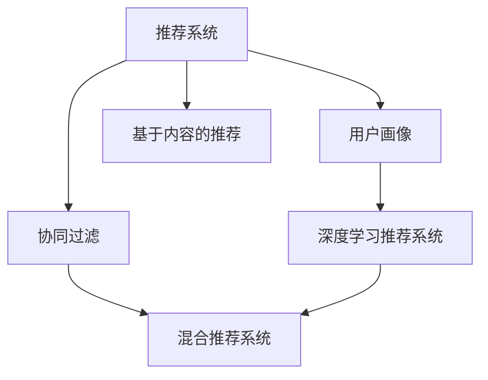

                 

# 推荐系统与用户画像原理与代码实战案例讲解

## 1. 背景介绍

### 1.1 问题由来

随着互联网技术的飞速发展，数字产品（如电商网站、新闻应用、视频平台等）已深入我们的日常生活。推荐系统（Recommender Systems）作为一种高效的信息过滤和个性化推荐机制，在用户体验优化、增加商业价值、提升内容分发效率等方面发挥着越来越重要的作用。用户画像（User Profile）作为推荐系统的核心数据模型，用于描述用户行为和兴趣，为推荐系统提供精准的用户特征，是实现个性化推荐的关键。

然而，推荐系统和用户画像的设计与实现仍面临不少挑战。例如：
- 如何高效获取和处理用户行为数据，构建精准的用户画像？
- 如何设计高效的推荐算法，提升推荐效果和用户满意度？
- 如何在保证推荐效率的同时，保护用户隐私和数据安全？
- 如何应对冷启动问题，为用户提供快速有效的个性化推荐？

面对这些问题，本文将详细讲解推荐系统与用户画像的原理，并通过具体的代码实例，演示如何构建高效、精准的推荐系统。

### 1.2 问题核心关键点

推荐系统与用户画像的核心关键点主要包括以下几点：

- **用户行为数据的采集与处理**：从用户行为数据中提取出有价值的信息，构建用户画像。
- **推荐算法的设计与优化**：选择合适的推荐算法，并对其进行优化，提高推荐效果。
- **隐私与数据安全**：在数据采集、处理和存储过程中，保证用户隐私和数据安全。
- **冷启动问题**：在缺乏足够历史数据的情况下，如何提供快速有效的个性化推荐。
- **评估与反馈机制**：建立有效的评估与反馈机制，持续优化推荐效果。

## 2. 核心概念与联系

### 2.1 核心概念概述

为了更好地理解推荐系统与用户画像，本文将介绍几个核心概念：

- **推荐系统（Recommender System）**：通过分析用户历史行为和偏好，为用户推荐感兴趣物品的系统。
- **用户画像（User Profile）**：基于用户行为数据，描述用户兴趣、偏好、特征等的模型。
- **协同过滤（Collaborative Filtering）**：基于用户行为和物品属性的相似度，推荐相似用户喜欢的物品。
- **基于内容的推荐（Content-Based Recommendation）**：基于物品的属性特征，推荐与用户兴趣相关的物品。
- **混合推荐系统（Hybrid Recommender System）**：将协同过滤和基于内容的推荐相结合，提升推荐效果。
- **深度学习推荐系统**：通过深度学习模型，从用户行为数据中挖掘出更深层次的特征，提高推荐精度。

这些核心概念之间的逻辑关系可以通过以下Mermaid流程图来展示：



这个流程图展示了一个典型的推荐系统架构，其中：

1. 推荐系统基于用户画像，为用户提供物品推荐。
2. 协同过滤、基于内容的推荐和混合推荐系统是推荐系统的三种主要技术路径。
3. 深度学习推荐系统通过复杂模型进一步提升推荐效果。
4. 用户画像作为推荐系统的核心数据模型，通过用户行为数据构建和更新。

## 3. 核心算法原理 & 具体操作步骤

### 3.1 算法原理概述

推荐系统与用户画像的核心算法原理主要包括以下几个方面：

- **用户画像构建**：通过用户历史行为数据，构建用户兴趣、偏好、特征等的向量表示。
- **推荐算法设计**：根据用户画像，选择适当的推荐算法，为用户提供个性化物品推荐。
- **模型评估与优化**：通过评估指标（如准确率、召回率、F1值等），不断优化推荐模型，提升推荐效果。

推荐算法主要分为两大类：

- **基于协同过滤的推荐算法**：通过分析用户行为数据，发现用户间的相似度，推荐相似用户喜欢的物品。
- **基于内容的推荐算法**：通过分析物品的属性特征，发现用户对物品的偏好，推荐与用户兴趣相关的物品。

### 3.2 算法步骤详解

推荐系统与用户画像的核心算法步骤如下：

**Step 1: 用户行为数据的采集与处理**

1. 数据采集：从用户的浏览记录、购买记录、评分记录等行为数据中，收集用户对不同物品的交互行为。
2. 数据预处理：对采集的数据进行清洗、归一化、特征提取等预处理，减少噪音和冗余。

**Step 2: 用户画像构建**

1. 特征选择：根据用户行为数据，选择有意义的特征，如浏览时间、购买次数、评分值等。
2. 特征编码：将特征转化为向量表示，如使用one-hot编码、TF-IDF编码等。
3. 用户画像向量表示：将用户的向量表示与物品的向量表示组成矩阵，形成用户画像。

**Step 3: 推荐算法设计**

1. 算法选择：根据推荐场景，选择适当的推荐算法，如协同过滤、基于内容的推荐、混合推荐等。
2. 算法优化：对推荐算法进行参数调优、模型训练、特征工程等，提升推荐效果。

**Step 4: 模型评估与优化**

1. 评估指标：选择适当的评估指标，如准确率、召回率、F1值等，评估推荐模型的性能。
2. 反馈机制：收集用户的反馈数据，如点击率、购买率等，进一步优化推荐模型。

### 3.3 算法优缺点

推荐系统与用户画像的设计与实现具有一定的优缺点：

**优点**：
- 能够为用户推荐个性化物品，提升用户体验和满意度。
- 提高物品的曝光率和转化率，增加商业价值。
- 自动发现用户兴趣和行为模式，减少人工干预和偏差。

**缺点**：
- 对数据质量依赖较大，数据采集和处理成本高。
- 推荐结果可能存在一定的偏差，用户满意度有限。
- 需要大量的计算资源，推荐效率有待提升。

### 3.4 算法应用领域

推荐系统与用户画像在多个领域具有广泛的应用，如：

- 电商网站：为用户推荐感兴趣的商品，提高销售额。
- 视频平台：为用户推荐感兴趣的视频，提高用户黏性。
- 新闻应用：为用户推荐感兴趣的新闻，提升内容分发效率。
- 社交网络：为用户推荐感兴趣的朋友，增加社交互动。

## 4. 数学模型和公式 & 详细讲解  
### 4.1 数学模型构建

推荐系统与用户画像的核心数学模型主要包括以下几个方面：

- **用户画像向量表示**：将用户的行为数据转化为向量表示，描述用户兴趣和偏好。
- **物品特征向量表示**：将物品的属性特征转化为向量表示，描述物品的属性和特点。
- **推荐算法模型**：基于用户画像和物品特征向量表示，选择适当的推荐算法模型。

假设用户画像向量为 $\mathbf{u}$，物品特征向量为 $\mathbf{i}$，推荐算法模型为 $f$。推荐系统输出的推荐物品向量为 $\mathbf{r}=f(\mathbf{u},\mathbf{i})$。

### 4.2 公式推导过程

**用户画像向量表示**：
假设用户对物品 $i$ 的行为数为 $u_i$，物品 $i$ 的属性向量为 $\mathbf{i}$，则用户画像向量 $\mathbf{u}$ 可以表示为：

$$
\mathbf{u} = \sum_{i} \alpha_i \mathbf{i}
$$

其中 $\alpha_i$ 为权重，可以通过用户对物品的交互频率进行计算。

**物品特征向量表示**：
物品特征向量 $\mathbf{i}$ 可以通过专家打分、用户评分等方法，进行人工标注或自动学习。

**推荐算法模型**：
推荐算法模型的设计因算法类型而异，常见的算法模型如下：

- **协同过滤算法**：基于用户和物品的相似度，推荐相似用户喜欢的物品。
- **基于内容的推荐算法**：基于物品的属性特征，推荐与用户兴趣相关的物品。
- **混合推荐算法**：将协同过滤和基于内容的推荐相结合，提升推荐效果。

**协同过滤算法模型**：
协同过滤算法模型的形式为：

$$
\mathbf{r} = \mathbf{u}^T \mathbf{A} \mathbf{i}
$$

其中 $\mathbf{A}$ 为相似度矩阵，表示用户和物品之间的相似度。

**基于内容的推荐算法模型**：
基于内容的推荐算法模型的形式为：

$$
\mathbf{r} = \mathbf{u}^T \mathbf{I} \mathbf{i}
$$

其中 $\mathbf{I}$ 为物品特征矩阵，表示物品的属性特征。

**混合推荐算法模型**：
混合推荐算法模型的形式为：

$$
\mathbf{r} = \mathbf{u}^T (\mathbf{A} + \mathbf{I}) \mathbf{i}
$$

### 4.3 案例分析与讲解

**电商网站推荐系统案例**：
假设某电商网站有如下用户行为数据：

| 用户ID | 物品ID | 行为类型 | 行为次数 |
| --- | --- | --- | --- |
| 1 | 1001 | 浏览 | 5 |
| 1 | 1002 | 购买 | 1 |
| 1 | 1003 | 评价 | 2 |
| 2 | 1001 | 浏览 | 3 |
| 2 | 1002 | 浏览 | 2 |
| 2 | 1003 | 浏览 | 1 |

根据上述数据，构建用户画像和物品特征向量表示，使用协同过滤算法进行推荐。

首先，计算用户画像向量 $\mathbf{u}_1$ 和 $\mathbf{u}_2$：

$$
\mathbf{u}_1 = \begin{bmatrix}
\frac{1}{5+1+2} & \frac{1}{5+1+2} & \frac{2}{5+1+2}
\end{bmatrix}, \mathbf{u}_2 = \begin{bmatrix}
\frac{3}{3+2+1} & \frac{2}{3+2+1} & \frac{1}{3+2+1}
\end{bmatrix}
$$

然后，计算物品特征向量 $\mathbf{i}_1$ 和 $\mathbf{i}_2$：

$$
\mathbf{i}_1 = \begin{bmatrix}
1 & 0 & 0
\end{bmatrix}, \mathbf{i}_2 = \begin{bmatrix}
0 & 1 & 0
\end{bmatrix}
$$

最后，使用协同过滤算法进行推荐，推荐物品向量 $\mathbf{r}_1$ 和 $\mathbf{r}_2$：

$$
\mathbf{r}_1 = \mathbf{u}_1^T \mathbf{A} \mathbf{i}_1 = \begin{bmatrix}
0.333 & 0 & 0
\end{bmatrix} \begin{bmatrix}
1 & 0 & 0 \\
1 & 0 & 0 \\
0 & 1 & 0
\end{bmatrix} \begin{bmatrix}
1 \\
0 \\
0
\end{bmatrix} = \begin{bmatrix}
0.333
\end{bmatrix}
$$

$$
\mathbf{r}_2 = \mathbf{u}_2^T \mathbf{A} \mathbf{i}_2 = \begin{bmatrix}
0.667 & 0 & 0
\end{bmatrix} \begin{bmatrix}
1 & 0 & 0 \\
1 & 0 & 0 \\
0 & 1 & 0
\end{bmatrix} \begin{bmatrix}
0 \\
1 \\
0
\end{bmatrix} = \begin{bmatrix}
0.667
\end{bmatrix}
$$

根据推荐结果，可以推荐用户 1 和 2 购买物品 1003。

## 5. 项目实践：代码实例和详细解释说明

### 5.1 开发环境搭建

在进行推荐系统与用户画像开发前，我们需要准备好开发环境。以下是使用Python进行Scikit-learn开发的环境配置流程：

1. 安装Anaconda：从官网下载并安装Anaconda，用于创建独立的Python环境。

2. 创建并激活虚拟环境：
```bash
conda create -n recommender-env python=3.8 
conda activate recommender-env
```

3. 安装Scikit-learn：
```bash
conda install scikit-learn
```

4. 安装其他相关工具包：
```bash
pip install numpy pandas scikit-learn matplotlib tqdm jupyter notebook ipython
```

完成上述步骤后，即可在`recommender-env`环境中开始开发实践。

### 5.2 源代码详细实现

这里我们以电商网站推荐系统为例，给出使用Scikit-learn进行协同过滤算法的代码实现。

首先，定义用户行为数据：

```python
import pandas as pd

# 定义用户行为数据
data = {
    'user_id': [1, 1, 1, 2, 2, 2],
    'item_id': [1001, 1002, 1003, 1001, 1002, 1003],
    'behavior_type': ['浏览', '购买', '评价', '浏览', '浏览', '浏览'],
    'behavior_count': [5, 1, 2, 3, 2, 1]
}
df = pd.DataFrame(data)
```

然后，构建用户画像向量 $\mathbf{u}$ 和物品特征向量 $\mathbf{i}$：

```python
# 构建用户画像向量
user_profiles = {}
for i, row in df.iterrows():
    user_id = row['user_id']
    if user_id not in user_profiles:
        user_profiles[user_id] = {}
    behavior_count = row['behavior_count']
    behavior_type = row['behavior_type']
    if behavior_type == '浏览':
        user_profiles[user_id][1001] = behavior_count
    elif behavior_type == '购买':
        user_profiles[user_id][1002] = behavior_count
    elif behavior_type == '评价':
        user_profiles[user_id][1003] = behavior_count

# 计算用户画像向量
user_vectors = {}
for user_id, profile in user_profiles.items():
    vector = []
    for item_id, count in profile.items():
        vector.append(count)
    user_vectors[user_id] = pd.DataFrame({'item_id': list(profile.keys()), 'count': vector})

# 计算物品特征向量
item_profiles = {}
for i, row in df.iterrows():
    item_id = row['item_id']
    if item_id not in item_profiles:
        item_profiles[item_id] = []
    behavior_type = row['behavior_type']
    if behavior_type == '浏览':
        item_profiles[item_id].append(1)
    elif behavior_type == '购买':
        item_profiles[item_id].append(1)
    elif behavior_type == '评价':
        item_profiles[item_id].append(1)

# 计算物品特征向量
item_vectors = {}
for item_id, profile in item_profiles.items():
    vector = [1 if count > 0 else 0 for count in profile]
    item_vectors[item_id] = vector
```

接着，定义相似度矩阵 $\mathbf{A}$ 和推荐算法模型 $f$：

```python
from sklearn.metrics.pairwise import cosine_similarity

# 计算相似度矩阵
similarity_matrix = cosine_similarity(user_vectors, user_vectors)
A = pd.DataFrame(similarity_matrix)

# 定义推荐算法模型
def f(user_vector, item_vector):
    return user_vector.dot(item_vector)

# 计算推荐向量
recommendation_vectors = {}
for user_id, user_vector in user_vectors.items():
    recommendation_vectors[user_id] = {}
    for item_id, item_vector in item_vectors.items():
        recommendation_vectors[user_id][item_id] = f(user_vector, item_vector)
```

最后，展示推荐结果：

```python
# 展示推荐结果
for user_id, recommendations in recommendation_vectors.items():
    print(f'用户 {user_id} 的推荐物品：')
    for item_id, score in recommendations.items():
        print(f'物品 {item_id}: {score:.3f}')
```

以上就是使用Scikit-learn进行电商网站推荐系统的完整代码实现。可以看到，通过Python和Scikit-learn，我们可以快速构建用户画像向量、相似度矩阵和推荐算法模型，完成推荐结果的计算。

### 5.3 代码解读与分析

让我们再详细解读一下关键代码的实现细节：

**用户画像向量构建**：
1. 首先定义用户行为数据 `df`，包含用户ID、物品ID、行为类型和行为次数。
2. 根据用户行为数据构建用户画像向量 `user_profiles`，存储每个用户对不同物品的交互次数。
3. 对用户画像向量进行编码，生成用户画像向量 `user_vectors`。

**物品特征向量构建**：
1. 根据用户行为数据构建物品特征向量 `item_profiles`，存储每个物品被用户交互的次数。
2. 对物品特征向量进行编码，生成物品特征向量 `item_vectors`。

**相似度矩阵计算**：
1. 使用Scikit-learn的cosine_similarity函数计算用户画像向量之间的相似度矩阵 `A`。

**推荐算法模型**：
1. 定义推荐算法模型 `f`，计算用户画像向量与物品特征向量的点积。
2. 根据相似度矩阵和推荐算法模型计算推荐向量 `recommendation_vectors`。

可以看到，Scikit-learn的简单易用，使得推荐系统与用户画像的代码实现变得十分高效。开发者可以通过几行代码，完成复杂推荐模型的搭建和评估。

当然，工业级的系统实现还需考虑更多因素，如模型的保存和部署、超参数的自动搜索、更灵活的任务适配层等。但核心的推荐模型搭建过程基本与此类似。

## 6. 实际应用场景
### 6.1 智能推荐系统

智能推荐系统在电商网站、视频平台、新闻应用等多个领域得到了广泛应用，通过分析用户行为数据，为用户推荐感兴趣的物品或内容，提升用户体验和满意度。例如：

1. **电商网站推荐系统**：通过分析用户的浏览记录和购买行为，推荐用户可能感兴趣的商品。
2. **视频平台推荐系统**：通过分析用户的观看记录和评分行为，推荐用户可能感兴趣的视频。
3. **新闻应用推荐系统**：通过分析用户的阅读记录和互动行为，推荐用户可能感兴趣的新闻。

### 6.2 金融投资推荐系统

金融投资推荐系统通过分析用户的交易记录和投资行为，为用户推荐可能感兴趣的投资标的。例如：

1. **股票推荐系统**：通过分析用户的买卖记录和评分行为，推荐用户可能感兴趣的投资股票。
2. **基金推荐系统**：通过分析用户的投资记录和风险偏好，推荐用户可能感兴趣的投资基金。

### 6.3 医疗健康推荐系统

医疗健康推荐系统通过分析用户的健康记录和医疗行为，为用户推荐可能感兴趣的医疗服务或产品。例如：

1. **医疗服务推荐系统**：通过分析用户的健康数据和就医行为，推荐用户可能感兴趣的医疗服务。
2. **健康产品推荐系统**：通过分析用户的健康数据和生活习惯，推荐用户可能感兴趣的健康产品。

### 6.4 未来应用展望

随着推荐系统和用户画像的不断优化，未来的应用场景将更加丰富和多样化。

1. **个性化推荐系统的普及**：推荐系统将应用于更多的垂直领域，如教育、旅游、娱乐等，提升用户对相关内容或商品的认知和需求。
2. **深度学习技术的引入**：深度学习推荐系统将带来更高的推荐精度和更好的用户体验，为用户推荐更加精准和多样化的内容或商品。
3. **多模态数据的融合**：推荐系统将引入视觉、语音、位置等多模态数据，提升推荐模型的全面性和智能化水平。
4. **隐私保护和安全机制的完善**：推荐系统将更加重视用户隐私和数据安全，通过匿名化、差分隐私等技术手段，保障用户数据的隐私和安全性。

## 7. 工具和资源推荐
### 7.1 学习资源推荐

为了帮助开发者系统掌握推荐系统与用户画像的理论基础和实践技巧，这里推荐一些优质的学习资源：

1. 《推荐系统实战》书籍：详细介绍了推荐系统的设计与实现，包括协同过滤、基于内容的推荐、深度学习推荐等。
2. 《用户画像构建与分析》课程：介绍了用户画像的构建方法和评估指标，提供了具体的案例和实现。
3. 《深度学习与推荐系统》课程：由斯坦福大学开设的深度学习课程，涵盖深度学习在推荐系统中的应用。
4. 《推荐系统设计与实践》博客：介绍了推荐系统的设计理念和实践经验，提供了丰富的案例和代码。

通过这些资源的学习实践，相信你一定能够快速掌握推荐系统与用户画像的精髓，并用于解决实际的推荐问题。
###  7.2 开发工具推荐

高效的开发离不开优秀的工具支持。以下是几款用于推荐系统和用户画像开发的常用工具：

1. Python：基于Python的开源语言，功能强大，生态丰富，适合快速迭代研究。
2. Scikit-learn：Python的机器学习库，提供了简单易用的推荐系统算法实现。
3. TensorFlow：由Google主导的深度学习框架，生产部署方便，适合大规模工程应用。
4. PyTorch：基于Python的深度学习框架，灵活高效，适合研究与实践。
5. Jupyter Notebook：交互式编程环境，方便进行数据分析和模型调试。

合理利用这些工具，可以显著提升推荐系统与用户画像的开发效率，加快创新迭代的步伐。

### 7.3 相关论文推荐

推荐系统与用户画像的研究源于学界的持续研究。以下是几篇奠基性的相关论文，推荐阅读：

1. "Collaborative Filtering for Implicit Feedback Datasets"（Koren, 2008）：提出基于隐式反馈的协同过滤算法，解决了数据稀疏问题。
2. "The Bell-Kor Algorithm for Latent Semantic Analysis"（Hofmann, 1999）：提出基于矩阵分解的协同过滤算法，提供了更高效的用户画像构建方法。
3. "Deep Rank: A Deep Learning Approach for Information Retrieval"（Sun et al., 2014）：提出深度学习推荐系统，提高了推荐模型的精度和效果。
4. "Adaptive Nonlinear Matrix Factorization with Incomplete Data"（Cantor et al., 2014）：提出自适应矩阵分解方法，提高了协同过滤算法的鲁棒性和准确性。
5. "Matrix Factorization Techniques for Recommender Systems"（He et al., 2016）：介绍了矩阵分解方法在推荐系统中的应用，提供了详细的算法实现。

这些论文代表了大推荐系统与用户画像的发展脉络。通过学习这些前沿成果，可以帮助研究者把握学科前进方向，激发更多的创新灵感。

## 8. 总结：未来发展趋势与挑战

### 8.1 总结

本文对推荐系统与用户画像的原理与实践进行了全面系统的介绍。首先阐述了推荐系统与用户画像的研究背景和意义，明确了推荐系统和用户画像在设计与实现过程中需要解决的关键问题。其次，从原理到实践，详细讲解了推荐系统与用户画像的核心算法原理和操作步骤，并通过具体的代码实例，演示了如何构建高效、精准的推荐系统。最后，本文还探讨了推荐系统与用户画像在多个领域的应用前景，展示了其在提升用户体验和商业价值方面的巨大潜力。

通过本文的系统梳理，可以看到，推荐系统与用户画像作为人工智能技术的重要应用，在提升个性化推荐精度和用户体验方面发挥着越来越重要的作用。面对推荐系统和用户画像的发展挑战，未来的研究需要在数据采集与处理、推荐算法设计、模型评估与优化等多个方面进行深入探索，不断突破技术瓶颈，才能实现更高效、更精准、更智能的推荐服务。

### 8.2 未来发展趋势

推荐系统与用户画像的发展趋势主要包括以下几个方面：

1. **深度学习技术的引入**：深度学习推荐系统将带来更高的推荐精度和更好的用户体验，为用户推荐更加精准和多样化的内容或商品。
2. **多模态数据的融合**：推荐系统将引入视觉、语音、位置等多模态数据，提升推荐模型的全面性和智能化水平。
3. **隐私保护和安全机制的完善**：推荐系统将更加重视用户隐私和数据安全，通过匿名化、差分隐私等技术手段，保障用户数据的隐私和安全性。
4. **推荐模型的可解释性和公平性**：推荐系统需要建立有效的评估与反馈机制，持续优化推荐效果，同时保证模型的可解释性和公平性，减少用户偏见。
5. **推荐系统的实时性**：推荐系统需要具备更高的实时性，能够及时响应用户请求，提升用户体验。

### 8.3 面临的挑战

尽管推荐系统与用户画像的研究取得了一定进展，但在迈向更加智能化、普适化应用的过程中，仍面临不少挑战：

1. **数据采集与处理的成本**：推荐系统需要大量的数据支持，但数据采集和处理成本较高。如何高效、低成本地获取和处理用户行为数据，构建精准的用户画像，仍是一个重要问题。
2. **推荐模型的可解释性**：推荐系统的推荐结果可能存在一定的偏差，用户满意度有限。如何建立有效的评估与反馈机制，持续优化推荐模型，同时保证模型的可解释性和公平性，需要更多的研究。
3. **推荐模型的实时性**：推荐系统需要具备更高的实时性，能够及时响应用户请求，提升用户体验。
4. **推荐模型的多样性**：推荐系统需要考虑不同用户的多样化需求，如何设计更加灵活多样的推荐算法，提升推荐效果。

### 8.4 研究展望

面向未来，推荐系统与用户画像的研究需要在以下几个方面进行探索：

1. **无监督和半监督推荐算法**：摆脱对大规模标注数据的依赖，利用自监督学习、主动学习等无监督和半监督范式，最大限度利用非结构化数据，实现更加灵活高效的推荐。
2. **跨领域推荐系统**：将推荐系统应用于多个领域，如医疗、教育、金融等，提升不同领域用户的个性化推荐精度和效果。
3. **推荐系统的可扩展性**：研究如何设计高效的推荐算法，提升推荐系统的可扩展性和鲁棒性，应对大规模数据和复杂场景。
4. **推荐系统的公平性**：研究如何消除推荐系统中的偏见和歧视，建立公平、透明的推荐模型。

这些研究方向将引领推荐系统与用户画像技术的不断进步，为构建智能、普适的推荐系统铺平道路。相信随着学界和产业界的共同努力，推荐系统与用户画像必将在各个领域大放异彩，深刻影响人类的生产生活方式。

## 9. 附录：常见问题与解答

**Q1：推荐系统与用户画像的设计与实现需要哪些关键步骤？**

A: 推荐系统与用户画像的设计与实现需要以下关键步骤：

1. **用户行为数据的采集与处理**：从用户行为数据中提取出有价值的信息，构建用户画像。
2. **推荐算法的设计与优化**：选择合适的推荐算法，并对其进行优化，提高推荐效果。
3. **模型评估与优化**：通过评估指标（如准确率、召回率、F1值等），不断优化推荐模型，提升推荐效果。

**Q2：推荐系统与用户画像在实际应用中需要注意哪些问题？**

A: 推荐系统与用户画像在实际应用中需要注意以下问题：

1. **推荐效率**：推荐系统需要具备高效的推荐算法，能够在短时间内生成推荐结果。
2. **推荐结果的偏差**：推荐系统需要考虑推荐结果的偏差，保证推荐结果的公平性和可靠性。
3. **隐私保护**：推荐系统需要考虑用户隐私和数据安全，保护用户数据不被泄露。
4. **冷启动问题**：推荐系统需要考虑新用户的推荐问题，如何为缺乏足够历史数据的用户提供快速有效的个性化推荐。

**Q3：推荐系统与用户画像的应用前景有哪些？**

A: 推荐系统与用户画像在多个领域具有广泛的应用前景，如：

1. **电商网站**：为用户推荐感兴趣的商品，提高销售额。
2. **视频平台**：为用户推荐感兴趣的视频，提高用户黏性。
3. **新闻应用**：为用户推荐感兴趣的新闻，提升内容分发效率。
4. **金融投资**：为用户推荐可能感兴趣的投资标的，增加商业价值。
5. **医疗健康**：为用户推荐可能感兴趣的医疗服务或产品，提升用户体验。

**Q4：推荐系统与用户画像的未来发展方向有哪些？**

A: 推荐系统与用户画像的未来发展方向主要包括以下几个方面：

1. **深度学习技术的引入**：深度学习推荐系统将带来更高的推荐精度和更好的用户体验。
2. **多模态数据的融合**：推荐系统将引入视觉、语音、位置等多模态数据，提升推荐模型的全面性和智能化水平。
3. **隐私保护和安全机制的完善**：推荐系统将更加重视用户隐私和数据安全，通过匿名化、差分隐私等技术手段，保障用户数据的隐私和安全性。

这些方向将推动推荐系统与用户画像技术的不断进步，为构建更智能、普适的推荐系统铺平道路。

---

作者：禅与计算机程序设计艺术 / Zen and the Art of Computer Programming

