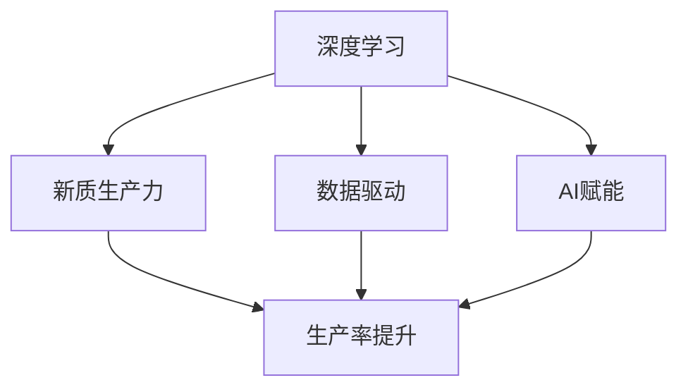

                 

# 提升核心竞争力的新质生产力

## 1. 背景介绍

在数字化转型的浪潮下，企业需要不断提升自身的核心竞争力，以在激烈的市场竞争中占据优势。而提升核心竞争力的关键，在于利用新技术打造新的生产力工具，促进业务创新与升级。在这一过程中，人工智能（AI）技术，尤其是深度学习和数据分析，扮演了至关重要的角色。本文将深入探讨如何利用AI技术，特别是深度学习，构建新质生产力，助力企业提升竞争力。

## 2. 核心概念与联系

### 2.1 核心概念概述

为了更好地理解如何利用AI技术构建新质生产力，本节将介绍几个关键概念及其相互联系：

- **深度学习（Deep Learning）**：一种基于神经网络的人工智能技术，通过多层次的特征提取和表达，实现了对复杂数据的深度建模和处理。深度学习广泛应用于图像识别、自然语言处理、语音识别等领域。

- **生产率（Productivity）**：指在单位时间内完成的工作量，或者单位成本所能完成的工作量。生产力的提升有助于企业降低成本、提高效率，从而增强竞争力。

- **新质生产力（Qualitative Productivity）**：指通过引入新技术、新方法，显著提高生产效率和质量，带来全新价值创造的方式。新质生产力不限于传统生产力的提升，更强调创新和转型。

- **AI赋能（AI-Enabling）**：指将AI技术应用于生产流程、业务决策、客户服务等多个环节，实现自动化、智能化和个性化，提升企业整体效率和竞争力。

- **数据驱动（Data-Driven）**：以数据为中心，利用数据分析和挖掘技术，洞察业务规律和用户需求，制定科学决策，推动业务创新和优化。

这些核心概念通过深度学习技术进行联接和转化，形成了提升核心竞争力的新质生产力框架。

### 2.2 核心概念原理和架构的 Mermaid 流程图



## 3. 核心算法原理 & 具体操作步骤

### 3.1 算法原理概述

构建新质生产力的关键在于利用深度学习技术，实现数据的深度分析和挖掘。深度学习模型通过多层次的非线性变换，能够从原始数据中自动学习到高级的特征表示，从而实现复杂问题的建模和解决。这一过程涉及以下几个关键步骤：

1. **数据收集与预处理**：从企业内部和外部数据源收集海量数据，并进行清洗、标注和标准化处理。
2. **模型训练与优化**：选择合适的深度学习模型，利用标注数据进行训练，并通过反向传播算法进行参数优化。
3. **特征提取与表达**：通过模型的前向传播，将输入数据映射到高维特征空间，实现特征的自动提取和表达。
4. **模型应用与评估**：将训练好的模型应用于生产流程、业务决策等场景，通过性能评估不断优化和迭代。

### 3.2 算法步骤详解

#### 3.2.1 数据收集与预处理

数据是深度学习的基石，因此首先需要进行有效的数据收集与预处理。具体步骤如下：

1. **数据来源**：从企业内部系统（如CRM、ERP、电商交易数据）和外部数据源（如社交媒体、公共数据集）收集相关数据。
2. **数据清洗**：去除缺失、异常、重复等低质量数据，确保数据的完整性和一致性。
3. **数据标注**：对数据进行标注，生成训练样本，标注方式包括分类、回归、序列标注等。
4. **数据标准化**：将数据转换为模型所需的格式，如归一化、标准化、分词等。

#### 3.2.2 模型训练与优化

在准备好数据后，进行模型训练与优化，具体步骤如下：

1. **选择模型**：根据任务类型（如图像识别、自然语言处理、语音识别）选择合适的深度学习模型，如卷积神经网络（CNN）、循环神经网络（RNN）、Transformer等。
2. **搭建网络**：利用深度学习框架（如TensorFlow、PyTorch）搭建模型网络，包括输入层、隐藏层、输出层等。
3. **初始化参数**：随机初始化模型参数，准备进入训练阶段。
4. **前向传播**：将输入数据通过模型进行正向传播，计算中间特征表示。
5. **反向传播**：计算预测值与真实值之间的误差，利用反向传播算法（如梯度下降）更新模型参数。
6. **模型评估**：在验证集上评估模型性能，监控损失函数和准确率等指标。
7. **超参数调优**：通过网格搜索或随机搜索等方法调整模型超参数，如学习率、批大小、正则化系数等，以获得最佳模型效果。

#### 3.2.3 特征提取与表达

模型训练完成后，进行特征提取与表达，具体步骤如下：

1. **模型推理**：将新数据输入训练好的模型，通过前向传播计算特征表示。
2. **特征选择**：根据模型输出特征的重要性，选择最有用的特征进行进一步分析。
3. **特征降维**：利用降维技术（如PCA、LDA）将高维特征映射到低维空间，便于后续分析和应用。
4. **特征融合**：将不同来源的特征进行融合，生成更加全面和准确的特征表示。

#### 3.2.4 模型应用与评估

模型训练完成后，应用于生产流程、业务决策等场景，具体步骤如下：

1. **模型部署**：将训练好的模型部署到生产环境中，如服务器、云平台等。
2. **业务集成**：将模型集成到现有业务系统（如CRM、ERP）中，实现自动化和智能化。
3. **实时监测**：实时监测模型性能，确保其稳定运行。
4. **用户反馈**：收集用户反馈，不断优化模型和业务流程。

### 3.3 算法优缺点

深度学习在提升新质生产力方面具有以下优点：

1. **高效自动化**：深度学习能够自动化完成数据处理、特征提取和建模等复杂任务，大幅提升生产效率。
2. **高度灵活**：深度学习模型可以根据具体任务需求进行灵活设计，适用于各种复杂问题。
3. **持续优化**：深度学习模型可以通过在线学习、增量学习等技术，不断优化和更新。

然而，深度学习也存在一些缺点：

1. **数据依赖性强**：深度学习模型的性能高度依赖于标注数据的质量和数量，标注成本较高。
2. **模型复杂度高**：深度学习模型参数量巨大，训练和推理过程中需要大量计算资源。
3. **可解释性差**：深度学习模型通常是"黑盒"系统，难以解释其内部工作机制和决策逻辑。
4. **泛化能力弱**：深度学习模型容易发生过拟合，面对新数据和新场景表现不稳定。

### 3.4 算法应用领域

深度学习技术在多个领域中已展现出巨大潜力，以下是一些典型应用：

1. **金融风控**：利用深度学习进行信用评分、欺诈检测、风险评估等，提升金融风控能力。
2. **医疗健康**：利用深度学习进行疾病预测、影像诊断、个性化治疗等，改善医疗服务质量。
3. **零售电商**：利用深度学习进行用户行为分析、推荐系统、库存管理等，优化用户体验和运营效率。
4. **制造业**：利用深度学习进行智能制造、质量检测、故障预测等，提升生产效率和产品质量。
5. **智慧城市**：利用深度学习进行交通管理、环境监测、公共安全等，提升城市管理智能化水平。
6. **能源环保**：利用深度学习进行能源优化、环境监测、智能调度等，推动绿色低碳发展。

## 4. 数学模型和公式 & 详细讲解 & 举例说明

### 4.1 数学模型构建

深度学习模型的构建通常包括以下几个步骤：

1. **输入层**：接收原始数据，并将其转换为模型所需的格式。
2. **隐藏层**：通过非线性变换，将输入数据映射到高维特征空间。
3. **输出层**：根据任务类型，输出预测结果或分类标签。

以一个简单的全连接神经网络为例，其数学模型构建如下：

- **输入层**：假设输入数据的维度为 $n$，表示为 $\mathbf{x} \in \mathbb{R}^n$。
- **隐藏层**：包含 $m$ 个神经元，每个神经元的输出表示为 $h_i$，通过线性变换和激活函数得到。
- **输出层**：包含 $o$ 个神经元，每个神经元的输出表示为 $y_i$，根据任务需求进行线性变换或激活函数。

数学模型可以表示为：

$$
h_i = \sigma(\mathbf{w}_i^T\mathbf{x} + b_i)
$$

$$
y_i = \sigma(\mathbf{v}_i^T\mathbf{h} + c_i)
$$

其中 $\sigma$ 为激活函数，$\mathbf{w}_i$ 和 $\mathbf{v}_i$ 为权重矩阵，$b_i$ 和 $c_i$ 为偏置项。

### 4.2 公式推导过程

以一个简单的二分类问题为例，其损失函数为交叉熵损失：

$$
\mathcal{L}(\theta) = -\frac{1}{N}\sum_{i=1}^N [y_i\log \hat{y}_i + (1-y_i)\log (1-\hat{y}_i)]
$$

其中 $y_i$ 为真实标签，$\hat{y}_i$ 为模型预测概率，$\theta$ 为模型参数。

利用梯度下降等优化算法，求解最小化损失函数，更新模型参数：

$$
\theta \leftarrow \theta - \eta \nabla_{\theta}\mathcal{L}(\theta)
$$

其中 $\eta$ 为学习率，$\nabla_{\theta}\mathcal{L}(\theta)$ 为损失函数对模型参数的梯度。

### 4.3 案例分析与讲解

以一个图像分类任务为例，其数据预处理和模型训练过程如下：

1. **数据预处理**：
   - **数据来源**：从图像库中收集训练数据。
   - **数据清洗**：去除低质量图像，确保数据集中不包含噪声。
   - **数据标注**：对图像进行分类标注，生成训练样本。
   - **数据标准化**：将图像像素值标准化，归一化到 $[0,1]$ 范围内。

2. **模型训练**：
   - **选择模型**：选择卷积神经网络（CNN）作为图像分类模型。
   - **搭建网络**：设计包含卷积层、池化层、全连接层的CNN网络结构。
   - **初始化参数**：随机初始化模型权重和偏置。
   - **前向传播**：将图像数据输入模型，计算中间特征表示。
   - **反向传播**：计算预测值与真实值之间的误差，利用梯度下降更新模型参数。
   - **模型评估**：在验证集上评估模型性能，监控损失函数和准确率等指标。
   - **超参数调优**：通过网格搜索或随机搜索等方法调整模型超参数，如学习率、批大小、正则化系数等。

3. **特征提取与表达**：
   - **模型推理**：将新图像数据输入训练好的模型，通过前向传播计算特征表示。
   - **特征选择**：根据模型输出特征的重要性，选择最有用的特征进行进一步分析。
   - **特征降维**：利用PCA等降维技术将高维特征映射到低维空间。
   - **特征融合**：将不同来源的特征进行融合，生成更加全面和准确的特征表示。

4. **模型应用与评估**：
   - **模型部署**：将训练好的模型部署到生产环境中，如服务器、云平台等。
   - **业务集成**：将模型集成到现有业务系统（如电商平台）中，实现自动化和智能化。
   - **实时监测**：实时监测模型性能，确保其稳定运行。
   - **用户反馈**：收集用户反馈，不断优化模型和业务流程。

## 5. 项目实践：代码实例和详细解释说明

### 5.1 开发环境搭建

在进行深度学习项目开发前，需要准备好开发环境。以下是使用Python进行PyTorch开发的环境配置流程：

1. 安装Anaconda：从官网下载并安装Anaconda，用于创建独立的Python环境。

2. 创建并激活虚拟环境：
```bash
conda create -n pytorch-env python=3.8 
conda activate pytorch-env
```

3. 安装PyTorch：根据CUDA版本，从官网获取对应的安装命令。例如：
```bash
conda install pytorch torchvision torchaudio cudatoolkit=11.1 -c pytorch -c conda-forge
```

4. 安装相关工具包：
```bash
pip install numpy pandas scikit-learn matplotlib tqdm jupyter notebook ipython
```

完成上述步骤后，即可在`pytorch-env`环境中开始深度学习项目开发。

### 5.2 源代码详细实现

下面以一个简单的图像分类任务为例，给出使用PyTorch进行深度学习项目开发的PyTorch代码实现。

```python
import torch
import torch.nn as nn
import torch.optim as optim
import torchvision
import torchvision.transforms as transforms
from torch.utils.data import DataLoader

# 定义模型结构
class Net(nn.Module):
    def __init__(self):
        super(Net, self).__init__()
        self.conv1 = nn.Conv2d(3, 6, 5)
        self.pool = nn.MaxPool2d(2, 2)
        self.conv2 = nn.Conv2d(6, 16, 5)
        self.fc1 = nn.Linear(16 * 5 * 5, 120)
        self.fc2 = nn.Linear(120, 84)
        self.fc3 = nn.Linear(84, 10)

    def forward(self, x):
        x = self.pool(torch.relu(self.conv1(x)))
        x = self.pool(torch.relu(self.conv2(x)))
        x = x.view(-1, 16 * 5 * 5)
        x = torch.relu(self.fc1(x))
        x = torch.relu(self.fc2(x))
        x = self.fc3(x)
        return x

# 加载数据集
transform = transforms.Compose(
    [transforms.ToTensor(),
     transforms.Normalize((0.5, 0.5, 0.5), (0.5, 0.5, 0.5))])

trainset = torchvision.datasets.CIFAR10(root='./data', train=True,
                                        download=True, transform=transform)
trainloader = torch.utils.data.DataLoader(trainset, batch_size=4,
                                          shuffle=True, num_workers=2)

testset = torchvision.datasets.CIFAR10(root='./data', train=False,
                                       download=True, transform=transform)
testloader = torch.utils.data.DataLoader(testset, batch_size=4,
                                        shuffle=False, num_workers=2)

# 定义模型和优化器
model = Net()
criterion = nn.CrossEntropyLoss()
optimizer = optim.SGD(model.parameters(), lr=0.001, momentum=0.9)

# 训练模型
for epoch in range(2):  # 多次循环训练数据集
    running_loss = 0.0
    for i, data in enumerate(trainloader, 0):
        inputs, labels = data
        optimizer.zero_grad()
        outputs = model(inputs)
        loss = criterion(outputs, labels)
        loss.backward()
        optimizer.step()

        running_loss += loss.item()
        if i % 2000 == 1999:    # 每2000个小批量数据，打印一次损失信息
            print('[%d, %5d] loss: %.3f' %
                  (epoch + 1, i + 1, running_loss / 2000))
            running_loss = 0.0

print('Finished Training')
```

### 5.3 代码解读与分析

让我们再详细解读一下关键代码的实现细节：

**Net类**：
- `__init__`方法：定义模型的网络结构，包括卷积层、池化层、全连接层等。
- `forward`方法：定义模型的前向传播过程，将输入数据通过网络结构计算输出。

**trainset和testset**：
- `CIFAR10`类：从CIFAR-10数据集中加载图像数据，并进行数据预处理。
- `transform`：定义数据增强和标准化操作，包括归一化和数据标准化。

**criterion和optimizer**：
- `CrossEntropyLoss`：定义交叉熵损失函数，用于计算分类任务的损失。
- `SGD`：定义随机梯度下降优化器，用于更新模型参数。

**模型训练**：
- 在每个epoch内，对训练集进行迭代，计算损失函数并更新模型参数。
- 每2000个小批量数据打印一次损失信息，以监控训练过程。
- 训练完成后，输出"Finished Training"提示信息。

通过上述代码，我们可以看到，使用PyTorch进行深度学习项目开发的过程大致分为数据加载、模型定义、优化器定义和模型训练等几个步骤。开发者可以基于此框架，进行进一步的扩展和优化，以适应不同的深度学习任务。

## 6. 实际应用场景

### 6.1 智能制造

深度学习技术在智能制造中有着广泛应用，如设备状态监测、故障预测、生产调度等。通过深度学习模型，企业可以实现生产流程的自动化和智能化，提升生产效率和产品质量。

**案例**：某制造企业通过深度学习模型对生产线进行状态监测和故障预测，实现设备故障的早期预警和维修，避免了大量非计划性停机，提高了生产线的稳定性和可靠性。

### 6.2 金融风控

在金融领域，深度学习模型可以用于信用评分、欺诈检测、风险评估等任务，提升金融机构的风险控制能力。

**案例**：某银行利用深度学习模型进行用户信用评分，通过分析用户行为数据和信用记录，准确预测用户的还款能力，有效降低不良贷款率。

### 6.3 智慧医疗

深度学习在医疗领域的应用也日益广泛，如疾病预测、影像诊断、个性化治疗等。通过深度学习模型，医疗机构可以实现更精准的诊断和治疗，改善医疗服务质量。

**案例**：某医院利用深度学习模型对医学影像进行自动分析和诊断，提高了诊断效率和准确性，减少了医生的工作负担。

### 6.4 自动驾驶

自动驾驶技术需要深度学习模型对复杂环境进行理解和决策。通过深度学习模型，车辆可以实现实时环境感知、路径规划和行为控制，提升驾驶安全和效率。

**案例**：某自动驾驶公司利用深度学习模型对交通场景进行实时感知和决策，实现了高级驾驶辅助系统（ADAS）的智能驾驶功能，提升了车辆安全性。

## 7. 工具和资源推荐

### 7.1 学习资源推荐

为了帮助开发者系统掌握深度学习理论基础和实践技巧，这里推荐一些优质的学习资源：

1. 《深度学习》（周志华）：介绍了深度学习的基本原理和应用，适合初学者入门。
2. CS231n《卷积神经网络》课程：斯坦福大学开设的计算机视觉经典课程，有Lecture视频和配套作业，讲解深度学习在图像识别中的应用。
3. 《动手学深度学习》（李沐等）：动手实践的深度学习教材，包括理论和实践两部分，适合深入学习。
4. Coursera深度学习专业课程：由Andrew Ng等知名教授主讲，覆盖深度学习的多个重要领域，包括神经网络、优化算法等。
5. TensorFlow官方文档：详细介绍了TensorFlow框架的使用方法和最佳实践，适合开发者学习。

### 7.2 开发工具推荐

高效的深度学习开发离不开优秀的工具支持。以下是几款常用的深度学习开发工具：

1. PyTorch：基于Python的开源深度学习框架，支持动态图和静态图两种计算图模式，灵活易用。
2. TensorFlow：由Google主导开发的深度学习框架，具有强大的计算图和分布式训练能力，适合大规模工程应用。
3. Keras：高层次的深度学习框架，提供简单易用的API，可以快速搭建深度学习模型。
4. MXNet：由Apache开发的深度学习框架，支持多种编程语言，灵活高效。
5. Caffe：Facebook开发的深度学习框架，适合卷积神经网络的开发和优化。

### 7.3 相关论文推荐

深度学习技术的发展离不开学术界的持续研究。以下是几篇奠基性的相关论文，推荐阅读：

1. ImageNet Classification with Deep Convolutional Neural Networks（AlexNet论文）：提出卷积神经网络（CNN），并利用AlexNet模型在ImageNet数据集上取得优异表现。
2. Deep Residual Learning for Image Recognition（ResNet论文）：提出残差网络（ResNet），解决了深度网络训练过程中的梯度消失问题，显著提升了深度学习模型的性能。
3. Natural Language Processing (almost) from Scratch（GPT-2论文）：提出基于Transformer的预训练语言模型，利用自监督学习任务进行预训练，显著提升了语言处理模型的性能。
4. Generative Adversarial Nets（GAN论文）：提出生成对抗网络（GAN），利用对抗样本生成高质量的图像、视频等。
5. AlphaGo Zero：提出AlphaGo Zero，利用深度强化学习技术，在围棋等复杂游戏中取得优异表现。

这些论文代表了大规模深度学习技术的发展脉络，是深度学习理论和技术发展的基石。通过学习这些前沿成果，可以帮助研究者把握学科前进方向，激发更多的创新灵感。

## 8. 总结：未来发展趋势与挑战

### 8.1 总结

本文对深度学习技术在提升新质生产力方面的应用进行了全面系统的介绍。首先阐述了深度学习技术的核心概念和其与新质生产力的联系，明确了深度学习技术在提升企业竞争力中的重要作用。其次，从原理到实践，详细讲解了深度学习模型的构建和训练过程，给出了深度学习项目开发的完整代码实例。同时，本文还广泛探讨了深度学习技术在智能制造、金融风控、智慧医疗等多个行业领域的应用前景，展示了深度学习技术的巨大潜力。最后，本文精选了深度学习技术的各类学习资源，力求为读者提供全方位的技术指引。

通过本文的系统梳理，可以看到，深度学习技术在提升新质生产力方面具有广阔的前景。未来，随着深度学习模型的不断优化和应用场景的不断拓展，深度学习技术必将在更多领域大放异彩，深刻影响各行各业的数字化转型和升级。

### 8.2 未来发展趋势

展望未来，深度学习技术在提升新质生产力方面将呈现以下几个发展趋势：

1. **模型规模持续增大**：随着算力成本的下降和数据规模的扩张，深度学习模型的参数量还将持续增长，超大规模模型有望带来更强的泛化能力和性能提升。
2. **模型结构更加灵活**：未来深度学习模型将更加注重灵活性，通过模型结构的创新和优化，提升模型的适应性和可扩展性。
3. **计算效率不断提升**：随着硬件设备的更新和优化，深度学习模型的计算效率将不断提升，支持更大规模的实时推理和优化。
4. **数据驱动更加深入**：深度学习模型将更加依赖数据，通过数据驱动的方式不断优化和更新模型，提升模型的性能和泛化能力。
5. **多模态融合更加广泛**：未来深度学习模型将更加注重多模态数据的融合，通过视觉、语音、文本等多种信息的协同处理，提升模型的应用能力。
6. **模型应用更加普及**：深度学习模型将在更多领域得到应用，推动各行各业的数字化转型和升级。

### 8.3 面临的挑战

尽管深度学习技术在提升新质生产力方面已经取得了显著进展，但在迈向更高效、更灵活、更普适的道路上，仍面临诸多挑战：

1. **数据依赖性较强**：深度学习模型高度依赖于标注数据的质量和数量，标注成本较高，如何高效获取高质量标注数据仍是一大难题。
2. **模型复杂度较高**：深度学习模型参数量巨大，训练和推理过程中需要大量计算资源，如何降低模型复杂度，提高计算效率，是未来需要解决的重要问题。
3. **模型可解释性差**：深度学习模型通常是"黑盒"系统，难以解释其内部工作机制和决策逻辑，如何在保证模型性能的同时，提高模型可解释性，是未来需要突破的方向。
4. **模型泛化能力弱**：深度学习模型容易发生过拟合，面对新数据和新场景表现不稳定，如何提高模型的泛化能力和鲁棒性，是未来需要解决的重要问题。
5. **伦理道德约束**：深度学习模型可能学习到有偏见、有害的信息，如何从数据和算法层面消除模型偏见，确保模型输出的安全性和合法性，是未来需要解决的重要问题。

### 8.4 未来突破

面对深度学习技术在提升新质生产力方面面临的挑战，未来的研究需要在以下几个方面寻求新的突破：

1. **探索无监督和半监督学习**：摆脱对大规模标注数据的依赖，利用自监督学习、主动学习等无监督和半监督范式，最大限度利用非结构化数据，实现更加灵活高效的模型训练。
2. **研究参数高效和计算高效的模型**：开发更加参数高效的模型，在固定大部分预训练参数的同时，只更新极少量的任务相关参数。同时优化模型的计算图，减少前向传播和反向传播的资源消耗，实现更加轻量级、实时性的部署。
3. **引入因果分析和博弈论工具**：将因果分析方法引入深度学习模型，识别出模型决策的关键特征，增强输出解释的因果性和逻辑性。借助博弈论工具刻画人机交互过程，主动探索并规避模型的脆弱点，提高系统稳定性。
4. **结合知识图谱和逻辑规则**：将符号化的先验知识，如知识图谱、逻辑规则等，与神经网络模型进行巧妙融合，引导模型学习更准确、合理的特征表示。同时加强不同模态数据的整合，实现视觉、语音等多模态信息与文本信息的协同建模。
5. **纳入伦理道德约束**：在模型训练目标中引入伦理导向的评估指标，过滤和惩罚有偏见、有害的输出倾向。同时加强人工干预和审核，建立模型行为的监管机制，确保模型输出的安全性。

这些研究方向的探索，必将引领深度学习技术迈向更高的台阶，为构建安全、可靠、可解释、可控的智能系统铺平道路。面向未来，深度学习技术还需要与其他人工智能技术进行更深入的融合，如知识表示、因果推理、强化学习等，多路径协同发力，共同推动深度学习技术的进步。只有勇于创新、敢于突破，才能不断拓展深度学习模型的边界，让智能技术更好地造福人类社会。

## 9. 附录：常见问题与解答

**Q1：深度学习技术是否适用于所有行业？**

A: 深度学习技术在数据密集型行业，如金融、医疗、电商等，已经展现出强大的应用潜力。但对于一些对数据依赖性较低的行业，如传统制造、农业等，可能面临数据获取和标注的挑战。因此，需要根据行业特点，选择合适的深度学习应用场景。

**Q2：如何高效获取高质量标注数据？**

A: 获取高质量标注数据是深度学习模型训练的关键。以下是一些高效获取标注数据的策略：

1. **数据众包平台**：利用数据众包平台（如Amazon Mechanical Turk）获取标注数据。
2. **数据标注工具**：使用开源标注工具（如Labelbox），方便标注数据的管理和标注。
3. **数据标注团队**：组建专业的数据标注团队，确保标注数据的一致性和质量。
4. **数据合成**：利用数据合成技术（如GAN生成数据），生成高质量的标注数据。
5. **多源数据融合**：将多个数据源的数据进行融合，提高数据的质量和多样性。

**Q3：如何提高深度学习模型的泛化能力？**

A: 提高深度学习模型的泛化能力，需要从以下几个方面进行改进：

1. **数据增强**：通过数据增强技术（如翻转、旋转、裁剪等）扩充训练集，提高模型的泛化能力。
2. **正则化**：使用L2正则、Dropout等正则化技术，防止模型过拟合。
3. **模型集成**：通过模型集成（如Bagging、Boosting等）提高模型的泛化能力。
4. **迁移学习**：利用预训练模型在小规模数据上进行微调，提升模型的泛化能力。
5. **多任务学习**：通过多任务学习，同时训练多个相关任务，提高模型的泛化能力。

**Q4：如何降低深度学习模型的计算成本？**

A: 降低深度学习模型的计算成本，需要从以下几个方面进行优化：

1. **模型剪枝**：通过模型剪枝技术（如Pruning），减少模型参数量，降低计算成本。
2. **量化压缩**：利用量化技术（如FP16、INT8）压缩模型参数和计算量，降低计算成本。
3. **分布式训练**：利用分布式训练技术（如TensorFlow分布式训练），提高训练效率，降低计算成本。
4. **算法优化**：优化算法（如梯度累积、混合精度训练等），降低计算成本。
5. **硬件加速**：利用GPU、TPU等硬件加速设备，提高计算效率，降低计算成本。

**Q5：如何提高深度学习模型的可解释性？**

A: 提高深度学习模型的可解释性，需要从以下几个方面进行改进：

1. **可视化工具**：利用可视化工具（如TensorBoard、Caffe2等），帮助理解模型的内部工作机制。
2. **可解释模型**：设计可解释的模型架构（如LIME、SHAP等），解释模型的决策过程。
3. **模型解释**：通过特征重要性分析、决策路径分析等方法，解释模型的输出。
4. **用户反馈**：收集用户反馈，不断优化模型的解释性和可解释性。
5. **模型验证**：通过验证数据和人工验证，确保模型的解释性和准确性。

通过上述代码，我们可以看到，使用PyTorch进行深度学习项目开发的过程大致分为数据加载、模型定义、优化器定义和模型训练等几个步骤。开发者可以基于此框架，进行进一步的扩展和优化，以适应不同的深度学习任务。

通过本文的系统梳理，可以看到，深度学习技术在提升新质生产力方面具有广阔的前景。未来，随着深度学习模型的不断优化和应用场景的不断拓展，深度学习技术必将在更多领域大放异彩，深刻影响各行各业的数字化转型和升级。

总之，深度学习技术通过自动化的数据处理、特征提取和建模，极大地提升了企业的数据处理能力和业务决策能力，推动了新质生产力的发展。未来，随着深度学习技术的不断进步，深度学习技术必将在更多领域得到应用，为企业带来更多的创新和机遇。

---

作者：禅与计算机程序设计艺术 / Zen and the Art of Computer Programming

