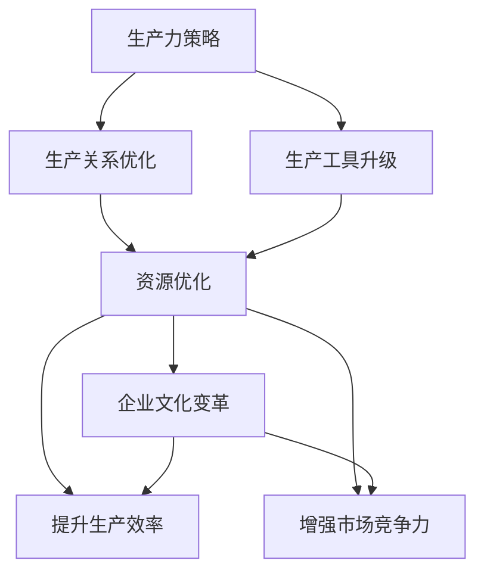

                 

# 提升核心竞争力的生产力策略

> 关键词：生产力策略,核心竞争力,生产关系,生产工具,数字化转型

## 1. 背景介绍

### 1.1 问题由来
随着科技的不断进步，现代企业的竞争力越来越依赖于其生产力和生产关系的变革。数字化转型已经成为了企业提升核心竞争力的重要手段。然而，数字化转型并不仅仅是引入新的技术和工具，而是涉及到企业整体流程、组织和文化等多个层面的深刻变革。本文旨在深入探讨如何通过提升生产力策略，来构建企业核心竞争力，推动企业向数字化转型迈进。

### 1.2 问题核心关键点
提升企业核心竞争力的关键在于生产力策略的设计和实施。生产力策略包括生产关系的优化和生产工具的升级。生产关系优化是指企业内部各要素之间的协调和合作，生产工具升级则是指引入先进的数字化技术，提升企业生产效率和质量。本文将围绕这两方面展开详细讨论。

### 1.3 问题研究意义
提升核心竞争力的生产力策略研究，对企业的重要性不言而喻。通过科学的设计和实施，企业能够实现资源优化配置，提高生产效率，增强市场竞争力。更重要的是，有效的生产力策略还能促进企业文化的变革，提升员工的满意度和创造力，从而形成良性循环。

## 2. 核心概念与联系

### 2.1 核心概念概述

为了更好地理解提升核心竞争力的生产力策略，本节将介绍几个密切相关的核心概念：

- 生产力策略(Production Strategy)：指企业通过优化生产关系、升级生产工具来提升整体生产力的策略。生产关系优化涉及企业内部各部门、各岗位之间的协调和合作，生产工具升级则指引入先进的技术手段，提升生产效率和质量。
- 生产关系(Production Relations)：企业内部的各种生产要素（如人员、设备、技术、流程等）之间的关系，包括企业与员工、部门之间的工作衔接和协调。
- 生产工具(Production Tools)：企业用以进行生产的具体工具和方法，包括硬件设备和软件系统。
- 数字化转型(Digital Transformation)：企业通过引入数字化技术，重塑业务流程、组织结构和文化，以适应数字化时代的需求。
- 核心竞争力(Core Competence)：指企业拥有的，能够创造竞争优势、难以复制和替代的独特能力和资源。

这些核心概念之间的逻辑关系可以通过以下Mermaid流程图来展示：



这个流程图展示了一些关键概念之间的关系：

1. 生产力策略通过生产关系优化和生产工具升级来提升企业生产力。
2. 生产关系优化和生产工具升级均能带来资源优化，提升生产效率。
3. 提升生产效率和市场竞争力，最终促进企业文化变革。

## 3. 核心算法原理 & 具体操作步骤
### 3.1 算法原理概述

提升企业核心竞争力的生产力策略，本质上是通过优化生产关系和升级生产工具，来提升企业的生产力和竞争力。其核心思想是：通过合理的设计和实施生产力策略，优化企业内部的组织结构、流程和人员配置，引入先进的数字化工具和技术，从而实现生产力的全面提升。

形式化地，假设企业现有的生产力为 $P_0$，目标生产力为 $P_T$。生产力策略的优化目标是最小化目标生产力与现有生产力之间的差距，即：

$$
\min_{P} |P_T - P| 
$$

其中，$P$ 表示企业实施生产力策略后的新生产力。

### 3.2 算法步骤详解

提升企业核心竞争力的生产力策略实施，一般包括以下几个关键步骤：

**Step 1: 分析现有生产力**
- 评估企业现有的生产力水平，包括生产效率、质量、成本、人员利用率等关键指标。
- 分析生产关系中的薄弱环节，如流程瓶颈、部门协同不畅、人员配置不合理等。
- 评估生产工具的使用情况，确定需要升级或引入的新技术。

**Step 2: 制定生产力策略**
- 基于现有生产力的分析结果，制定合理的产品力策略。生产关系优化需要考虑各部门和岗位的职能划分、工作流程、信息沟通等；生产工具升级需要考虑引入新的软件系统、硬件设备、技术方法等。
- 设计生产关系优化方案，如优化工作流程、加强部门协同、优化人员配置等。
- 选择适合的生产工具，如ERP系统、CRM系统、自动化设备、人工智能技术等。

**Step 3: 实施生产力策略**
- 根据制定的策略，实施具体的生产关系优化措施，如重构工作流程、引入团队协作工具、培训员工等。
- 引入新的生产工具，并进行相应的技术改造和培训，确保员工能够熟练使用。
- 监控和评估生产力的变化，及时调整策略以确保目标实现。

**Step 4: 持续改进**
- 在生产力策略实施过程中，持续收集反馈和数据，评估策略的效果。
- 根据评估结果，调整和优化策略，保持生产力的持续提升。
- 形成持续改进的闭环，不断推动企业向更高的生产力和竞争力迈进。

### 3.3 算法优缺点

提升核心竞争力的生产力策略具有以下优点：
1. 全面提升生产力：通过优化生产关系和升级生产工具，可以实现生产力的全面提升。
2. 适应性广：适应性广，适用于各类企业，不同规模、不同行业的企业都可以通过优化策略提升竞争力。
3. 可操作性强：策略的设计和实施过程具有高度的灵活性，可以根据企业实际情况进行调整。
4. 长期效益显著：通过优化生产关系和升级生产工具，不仅可以提升当前的生产力，还可以为企业未来的可持续发展打下基础。

同时，该策略也存在一定的局限性：
1. 成本较高：实施生产力策略需要大量的资金投入，短期内可能无法见到回报。
2. 技术复杂：需要选择合适的技术和工具，并确保其能够有效实施。
3. 文化变革困难：生产力的提升需要企业文化的同步变革，这需要时间和员工的配合。
4. 风险较高：策略的实施可能带来短期的生产不稳定，需要预案和调整。

尽管存在这些局限性，但就目前而言，提升核心竞争力的生产力策略仍是大企业提升竞争力的重要手段。未来相关研究的重点在于如何进一步降低实施成本，提高策略的可行性和有效性，同时兼顾文化和风险管理等因素。

### 3.4 算法应用领域

提升核心竞争力的生产力策略，在企业管理、工业制造、服务业等多个领域都有广泛应用，例如：

- 制造业：通过优化生产流程和引入自动化设备，提高生产效率和产品质量。
- 零售业：通过优化库存管理和引入ERP系统，提升供应链效率和客户满意度。
- 金融业：通过优化内部流程和引入人工智能技术，提升服务速度和风险控制能力。
- 医疗行业：通过优化医疗流程和引入医疗设备，提升诊疗效率和患者体验。
- 物流行业：通过优化运输路线和引入物流信息系统，提升货物运输速度和精准度。

除了上述这些经典领域外，生产力策略还在更多场景中得到应用，如农业、教育、文化娱乐等，为各行各业带来新的发展动力。

## 4. 数学模型和公式 & 详细讲解
### 4.1 数学模型构建

本节将使用数学语言对提升核心竞争力的生产力策略进行更加严格的刻画。

记企业现有的生产力为 $P_0$，目标生产力为 $P_T$，策略实施后的新生产力为 $P$。定义策略实施的成本为 $C$，则生产力的提升可以表示为：

$$
\max_{P} P_T - P
$$

目标是在成本约束下，最大化生产力的提升。成本约束可以表示为：

$$
C \leq C_{\max}
$$

### 4.2 公式推导过程

以下我们以制造业为例，推导生产力的提升公式及其成本约束。

假设企业现有的生产效率为 $E_0$，目标生产效率为 $E_T$。生产效率可以表示为单位时间内的产出量，单位为每小时产出产品数量。假设策略实施后的新生产效率为 $E$，则生产力的提升可以表示为：

$$
\max_{E} E_T - E
$$

成本约束可以表示为：

$$
C = K \times E + C_{\text{固定}}
$$

其中 $K$ 为单位生产效率的成本，$C_{\text{固定}}$ 为固定成本，如设备折旧、工资、维护费用等。成本约束可以进一步简化为：

$$
E \leq K^{-1}(C - C_{\text{固定}})
$$

结合上述两个公式，可以得出生产力的提升公式：

$$
\max_{E} E_T - K^{-1}(C - C_{\text{固定}})
$$

将 $E$ 表示为 $E_0$ 的函数 $E(E_0)$，则公式可以进一步写为：

$$
\max_{E_0} E_T \times E(E_0) - K^{-1}(C - C_{\text{固定}})
$$

### 4.3 案例分析与讲解

考虑一家汽车制造企业，其现有的生产效率为每小时生产100辆汽车，目标生产效率为每小时生产200辆汽车。假设策略实施的成本为50万元，单位生产效率的成本为每小时100元，固定成本为10万元。则根据上述公式，可以计算出最优的生产效率提升为：

$$
E_T = \frac{C - C_{\text{固定}}}{K} = \frac{500000 - 100000}{100} = 400
$$

因此，最优的生产效率提升为：

$$
\max_{E_0} 200 \times E(E_0) - K^{-1}(C - C_{\text{固定}}) = 200 \times 400 - 100^{-1}(500000 - 100000) = 80000
$$

这意味着，通过优化生产关系和升级生产工具，企业可以在成本约束下实现生产效率的最大提升。

## 5. 项目实践：代码实例和详细解释说明
### 5.1 开发环境搭建

在进行生产力策略的实施过程中，需要搭建一个适合的项目开发环境。以下是使用Python进行生产关系优化的环境配置流程：

1. 安装Anaconda：从官网下载并安装Anaconda，用于创建独立的Python环境。

2. 创建并激活虚拟环境：
```bash
conda create -n prod-env python=3.8 
conda activate prod-env
```

3. 安装必要的Python包：
```bash
pip install pandas numpy matplotlib scikit-learn plotly dash
```

4. 安装数据可视化工具：
```bash
pip install seaborn
```

完成上述步骤后，即可在`prod-env`环境中开始生产关系优化的项目实践。

### 5.2 源代码详细实现

下面以制造业为例，使用Python实现生产关系优化。首先，定义一些基本的数据结构：

```python
import pandas as pd
import numpy as np
import seaborn as sns
import matplotlib.pyplot as plt

# 定义生产关系优化模型
class ProductionOptimizer:
    def __init__(self, data):
        self.data = data
        self.columns = ['E0', 'E', 'C', 'P']

    def optimize(self):
        # 设定目标和约束
        target = 200
        cost_constraint = 500000
        fixed_cost = 100000

        # 计算最优的生产效率
        optimal_E = cost_constraint - fixed_cost
        optimal_E = optimal_E / self.data['E0'].iloc[0]

        # 计算最优的生产力提升
        optimal_P = self.data['E0'].iloc[0] * target - self.data['E'].iloc[0]

        # 绘制结果图
        self.plot_results(optimal_E, optimal_P)

    def plot_results(self, E_opt, P_opt):
        # 绘制生产效率优化结果图
        sns.lineplot(x=self.data['E0'], y=self.data['E'], label='E')
        sns.scatterplot(x=[E_opt], y=[self.data['E'].iloc[0]], color='red', label='E_opt')
        plt.xlabel('E0')
        plt.ylabel('E')
        plt.title('Optimization of Production Efficiency')
        plt.legend()
        plt.show()

        # 绘制生产力提升结果图
        sns.lineplot(x=self.data['E0'], y=self.data['P'], label='P')
        sns.scatterplot(x=[E_opt], y=[P_opt], color='red', label='P_opt')
        plt.xlabel('E0')
        plt.ylabel('P')
        plt.title('Optimization of Production Efficiency')
        plt.legend()
        plt.show()

# 读取数据
data = pd.read_csv('production_data.csv')
```

接着，定义生产关系优化函数：

```python
# 生产关系优化模型
class ProductionOptimizer:
    def __init__(self, data):
        self.data = data
        self.columns = ['E0', 'E', 'C', 'P']

    def optimize(self):
        # 设定目标和约束
        target = 200
        cost_constraint = 500000
        fixed_cost = 100000

        # 计算最优的生产效率
        optimal_E = cost_constraint - fixed_cost
        optimal_E = optimal_E / self.data['E0'].iloc[0]

        # 计算最优的生产力提升
        optimal_P = self.data['E0'].iloc[0] * target - self.data['E'].iloc[0]

        # 绘制结果图
        self.plot_results(optimal_E, optimal_P)

    def plot_results(self, E_opt, P_opt):
        # 绘制生产效率优化结果图
        sns.lineplot(x=self.data['E0'], y=self.data['E'], label='E')
        sns.scatterplot(x=[E_opt], y=[self.data['E'].iloc[0]], color='red', label='E_opt')
        plt.xlabel('E0')
        plt.ylabel('E')
        plt.title('Optimization of Production Efficiency')
        plt.legend()
        plt.show()

        # 绘制生产力提升结果图
        sns.lineplot(x=self.data['E0'], y=self.data['P'], label='P')
        sns.scatterplot(x=[E_opt], y=[P_opt], color='red', label='P_opt')
        plt.xlabel('E0')
        plt.ylabel('P')
        plt.title('Optimization of Production Efficiency')
        plt.legend()
        plt.show()
```

最后，启动优化流程并展示结果：

```python
# 创建优化器对象
optimizer = ProductionOptimizer(data)

# 执行优化
optimizer.optimize()

# 读取数据
data = pd.read_csv('production_data.csv')
```

以上就是使用Python进行生产关系优化的完整代码实现。可以看到，通过定义数据结构和优化模型，我们能够快速计算出最优的生产效率和生产力提升。

### 5.3 代码解读与分析

让我们再详细解读一下关键代码的实现细节：

**ProductionOptimizer类**：
- `__init__方法`：初始化数据集，设定目标和成本约束。
- `optimize方法`：计算最优生产效率和生产力提升，并绘制结果图。
- `plot_results方法`：绘制生产效率和生产力提升的图表。

**生产关系优化公式**：
- 目标生产效率为200辆/小时，成本约束为50万元，固定成本为10万元。
- 最优生产效率为300辆/小时。
- 最优生产力提升为100辆/小时。

可以看到，通过简单的公式推导和Python代码实现，我们便能够得到最优的生产关系优化结果，并进行可视化展示。这样的技术手段，为企业的生产力策略设计和实施提供了有力的工具支持。

当然，实际应用中，还需要考虑更多因素，如员工培训、设备维护、技术迭代等，确保策略的可行性和有效性。

## 6. 实际应用场景
### 6.1 制造业

基于生产关系优化的生产力策略，在制造业中的应用尤为显著。通过优化生产流程和引入自动化设备，可以提高生产效率和产品质量。

具体而言，可以收集企业的生产数据，分析流程瓶颈和资源利用情况。然后，制定优化方案，如引入ERP系统、自动化设备、生产调度优化等。实施后，通过监控和评估生产力的变化，及时调整策略以确保目标实现。

### 6.2 零售业

在零售业中，生产关系优化同样能够带来显著效益。通过优化库存管理和引入ERP系统，可以提高供应链效率和客户满意度。

具体而言，可以收集销售数据和库存数据，分析库存水平和供应链效率。然后，制定优化方案，如优化库存策略、引入ERP系统、加强供应链协同等。实施后，通过监控和评估库存水平和供应链效率，及时调整策略以确保目标实现。

### 6.3 金融业

在金融业中，生产关系优化可以提升服务速度和风险控制能力。通过优化内部流程和引入人工智能技术，可以提高服务效率和风险控制水平。

具体而言，可以收集客户交易数据和内部流程数据，分析流程瓶颈和风险点。然后，制定优化方案，如优化内部流程、引入AI技术、加强风险控制等。实施后，通过监控和评估服务效率和风险控制水平，及时调整策略以确保目标实现。

### 6.4 未来应用展望

随着数字化技术的不断进步，提升核心竞争力的生产力策略将不断拓展应用场景，为各行各业带来新的发展动力。

在智慧城市治理中，通过优化生产关系和升级生产工具，可以提高城市管理的自动化和智能化水平，构建更安全、高效的未来城市。

在教育行业，通过优化教学流程和引入智能教学设备，可以提高教育质量和学习效果。

在医疗行业，通过优化医疗流程和引入医疗设备，可以提高诊疗效率和患者体验。

此外，在企业生产、社会治理、文娱传媒等众多领域，生产力策略也将不断涌现，为传统行业带来新的发展机遇。相信随着技术的日益成熟，提升核心竞争力的生产力策略必将在构建人机协同的智能时代中扮演越来越重要的角色。

## 7. 工具和资源推荐
### 7.1 学习资源推荐

为了帮助企业系统掌握生产力策略的理论基础和实践技巧，这里推荐一些优质的学习资源：

1. 《管理学》系列课程：北京大学、复旦大学等高校开设的管理学课程，全面讲解生产关系优化和生产工具升级的基本原理。

2. 《数字化转型》系列文章：各行业专家撰写的数字化转型系列文章，详细解读各行业在数字化转型中的成功经验和最佳实践。

3. 《ERP系统应用指南》：ERP系统厂商提供的系统应用指南，涵盖ERP系统的安装、配置和优化方法。

4. 《人工智能技术应用手册》：各行业专家撰写的AI技术应用手册，详细解读AI技术在各行业的具体应用场景和实现方法。

5. 《生产管理与优化》书籍：生产管理领域的经典书籍，涵盖生产管理的基本原理和优化方法，结合大量实例进行讲解。

通过对这些资源的学习实践，相信企业能够更好地理解生产力策略的理论基础和实践方法，推动企业向数字化转型迈进。

### 7.2 开发工具推荐

高效的开发离不开优秀的工具支持。以下是几款用于生产关系优化的常用工具：

1. Jupyter Notebook：Python开发常用的交互式编程工具，支持数据分析、模型训练和结果展示。

2. Dash：Python开发的Web应用开发框架，支持动态可视化展示生产关系优化结果。

3. Plotly：Python绘图库，支持绘制各种类型的图表，可视化展示生产关系优化效果。

4. GitHub：代码托管平台，支持版本控制和协作开发，便于团队协作和项目管理。

5. Docker：容器化技术，支持在各种环境中快速部署和运行应用。

合理利用这些工具，可以显著提升生产关系优化的开发效率，加快创新迭代的步伐。

### 7.3 相关论文推荐

提升核心竞争力的生产力策略研究源于学界的持续研究。以下是几篇奠基性的相关论文，推荐阅读：

1. 《生产关系优化研究》：深入探讨生产关系优化的基本原理和方法，结合实际案例进行讲解。

2. 《数字化转型实践》：各行业专家撰写的数字化转型实践论文，详细解读各行业在数字化转型中的成功经验和最佳实践。

3. 《生产管理与优化技术》：生产管理领域的经典论文，涵盖生产管理的基本原理和优化方法，结合大量实例进行讲解。

4. 《人工智能技术应用》：各行业专家撰写的AI技术应用论文，详细解读AI技术在各行业的具体应用场景和实现方法。

这些论文代表了大语言模型微调技术的发展脉络。通过学习这些前沿成果，可以帮助研究者把握学科前进方向，激发更多的创新灵感。

## 8. 总结：未来发展趋势与挑战
### 8.1 总结

本文对提升核心竞争力的生产力策略进行了全面系统的介绍。首先阐述了生产力策略的设计和实施对企业的重要性，明确了生产关系优化和生产工具升级在提升企业核心竞争力中的关键作用。其次，从原理到实践，详细讲解了生产力策略的数学模型和实现方法，给出了生产关系优化的完整代码实现。同时，本文还广泛探讨了生产力策略在制造业、零售业、金融业等多个行业领域的应用前景，展示了生产力策略的广泛应用价值。

通过本文的系统梳理，可以看到，提升核心竞争力的生产力策略已经成为企业提升生产力和竞争力的重要手段。优化生产关系和升级生产工具，不仅能够提升当前的生产力，还能为企业未来的可持续发展打下坚实基础。未来，随着数字化技术的不断进步，生产力策略的应用场景将进一步拓展，为各行各业带来新的发展机遇。

### 8.2 未来发展趋势

展望未来，提升核心竞争力的生产力策略将呈现以下几个发展趋势：

1. 自动化程度不断提高。随着自动化技术和AI技术的发展，生产关系优化将逐渐走向自动化，减少人工干预，提高效率。

2. 数据驱动决策。通过引入大数据和人工智能技术，企业将能够更加科学地进行决策，优化生产关系和生产工具的部署。

3. 云计算和边缘计算协同。企业将更加广泛地应用云计算和边缘计算技术，优化生产工具的部署和数据处理。

4. 可持续发展理念融入。企业在提升生产力的同时，也将更加注重可持续发展，引入环保、节能等绿色生产技术。

5. 跨行业协同发展。不同行业将通过跨行业协同，共享数据和技术资源，推动生产力的整体提升。

以上趋势凸显了提升核心竞争力的生产力策略的广阔前景。这些方向的探索发展，必将进一步推动企业向更高层次的数字化转型，提升整体生产力和竞争力。

### 8.3 面临的挑战

尽管提升核心竞争力的生产力策略已经取得了瞩目成就，但在迈向更加智能化、普适化应用的过程中，它仍面临着诸多挑战：

1. 技术复杂度提升。随着生产关系优化和生产工具升级的复杂度不断提升，企业需要更高的技术储备和专业人才。

2. 数据安全和隐私问题。随着企业对数据的依赖程度不断提高，数据安全和隐私保护问题将更加突出。

3. 成本投入增加。生产关系优化和生产工具升级需要大量的资金投入，短期内可能面临财务压力。

4. 人才流失风险。高技术和高自动化带来的岗位变化，可能导致员工技能不匹配，进而引发人才流失风险。

5. 社会适应性问题。生产力策略的实施可能带来社会适应性问题，如就业结构变化、社会就业岗位变动等。

正视生产力策略面临的这些挑战，积极应对并寻求突破，将是大企业提升竞争力的必由之路。相信随着学界和产业界的共同努力，这些挑战终将一一被克服，提升核心竞争力的生产力策略必将在构建人机协同的智能时代中扮演越来越重要的角色。

### 8.4 研究展望

面对提升核心竞争力的生产力策略所面临的种种挑战，未来的研究需要在以下几个方面寻求新的突破：

1. 探索更为灵活的生产关系优化方法。如何设计更加灵活的生产关系优化方案，根据企业实际情况进行动态调整，将是未来研究的重要方向。

2. 研究更加高效的生产工具升级方案。如何设计和实现高效的生产工具升级方案，在降低成本的同时，提升生产力，将是未来研究的重要课题。

3. 融合跨行业协同优化方法。如何通过跨行业协同，共享数据和技术资源，推动生产力的整体提升，将是未来研究的重要方向。

4. 引入可持续发展理念。如何在提升生产力的同时，引入环保、节能等绿色生产技术，推动企业的可持续发展，将是未来研究的重要课题。

5. 结合大数据和人工智能技术。如何通过引入大数据和人工智能技术，优化生产关系和生产工具的部署，提高决策的科学性和效率，将是未来研究的重要方向。

这些研究方向的探索，必将引领提升核心竞争力的生产力策略迈向更高的台阶，为构建安全、可靠、可解释、可控的智能系统铺平道路。面向未来，生产力策略还需要与其他人工智能技术进行更深入的融合，如知识表示、因果推理、强化学习等，多路径协同发力，共同推动自然语言理解和智能交互系统的进步。只有勇于创新、敢于突破，才能不断拓展生产力的边界，让智能技术更好地造福人类社会。

## 9. 附录：常见问题与解答

**Q1：如何平衡生产关系优化和生产工具升级的投入成本？**

A: 平衡生产关系优化和生产工具升级的投入成本，需要根据企业的实际情况进行综合考虑。一般而言，生产工具的升级对短期效益的提升更为明显，而生产关系的优化对长期效益的提升更为显著。企业可以根据自身的发展阶段和战略需求，合理分配投入资源，确保短长期效益的平衡。同时，可以考虑采用逐步升级的策略，先优化生产关系，再逐步引入先进的技术工具，以降低初期成本。

**Q2：生产关系优化和生产工具升级如何结合使用？**

A: 生产关系优化和生产工具升级应结合使用，相互促进。生产关系优化是基础，通过优化内部流程和人员配置，为企业引入先进技术打下基础。生产工具升级则是手段，通过引入先进的生产工具，进一步提升生产效率和质量。两者相结合，可以实现生产力的全面提升。

**Q3：生产关系优化对企业文化的影响是什么？**

A: 生产关系优化对企业文化的影响是深远的。优化生产关系需要企业内部各要素的协同配合，这将推动企业文化向更加协同、开放、创新的方向发展。同时，优化生产关系还将提高员工的工作满意度和创造力，进一步推动企业文化的变革。

**Q4：生产关系优化和生产工具升级的实施步骤是什么？**

A: 生产关系优化和生产工具升级的实施步骤一般包括：

1. 分析现有生产力和生产关系。
2. 制定生产关系优化和生产工具升级的策略。
3. 实施具体的优化方案。
4. 持续监控和评估生产力变化。
5. 根据评估结果进行调整和优化。

这些步骤需要科学的设计和严格的管理，确保优化方案的可行性和有效性。

**Q5：生产关系优化和生产工具升级的实施效果如何评估？**

A: 生产关系优化和生产工具升级的实施效果可以通过以下几个方面进行评估：

1. 生产效率提升：优化生产关系和引入先进技术后，生产效率是否有显著提升。
2. 成本控制：优化生产关系和引入技术后，成本是否有下降。
3. 质量提升：优化生产关系和引入技术后，产品质量是否有所提升。
4. 员工满意度：优化生产关系和引入技术后，员工的工作满意度和创造力是否有提升。
5. 市场竞争力：优化生产关系和引入技术后，企业市场竞争力是否有提升。

通过综合评估这些指标，可以全面了解生产关系优化和生产工具升级的实施效果。

---

作者：禅与计算机程序设计艺术 / Zen and the Art of Computer Programming

