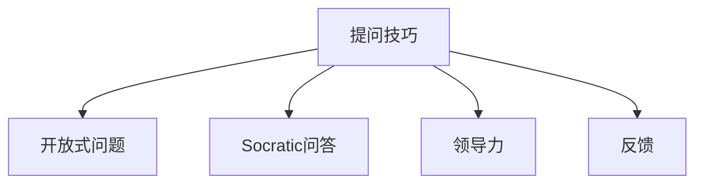

                 

# 提问技巧：管理者的沟通利器

> 关键词：提问技巧,管理者,沟通,团队建设,决策优化

## 1. 背景介绍

在当今复杂多变的商业环境中，管理者的角色已经发生了深刻的变化。传统的命令与控制式管理模式逐渐被协作与参与式管理所取代。管理者不再只是决策者，更是团队的引导者，他们需要通过有效的沟通来激发团队潜能，提升团队绩效。在沟通的众多环节中，提问技巧发挥着至关重要的作用。优秀的提问不仅能够激发员工的思考，挖掘潜在的创新点，还能在团队内部建立信任和开放的文化。

本文将围绕提问技巧，探讨其在管理沟通中的应用，从理论基础、具体策略到实际案例，全面剖析提问在团队建设、决策优化、问题解决等多个环节中的重要作用。通过理解并掌握提问技巧，管理者可以更好地引领团队，优化决策过程，提升团队整体效率。

## 2. 核心概念与联系

### 2.1 核心概念概述

为了深入理解提问技巧在管理沟通中的重要性，本节将介绍几个核心概念：

- **提问技巧（Questioning Skills）**：指在沟通中有效地提出问题，引导对话，激发思考，解决问题的方法和技巧。
- **开放式问题（Open-ended Questions）**：指那些无法用简单的是或否回答，需要提供详细解答的问题。
- **Socratic问答（Socratic Questioning）**：基于苏格拉底对话法，通过提问激发深层次思考的方法。
- **领导力（Leadership）**：管理者通过提问引导团队、影响决策、提升绩效的能力。
- **反馈（Feedback）**：通过提问获取团队成员反馈，及时调整沟通策略和团队行为。

这些概念之间通过以下Mermaid流程图来展示它们之间的联系：



这个流程图展示了提问技巧与其他核心概念之间的逻辑关系：

1. **开放式问题**和**Socratic问答**是提问技巧的两种重要形式，通过它们可以激发更深入的思考和讨论。
2. **领导力**通过提问技巧的运用，得以在团队中建立信任和权威，影响决策过程。
3. **反馈**则是通过提问技巧获取的，有助于管理者及时调整沟通策略和团队行为。

## 3. 核心算法原理 & 具体操作步骤
### 3.1 算法原理概述

提问技巧在管理沟通中的运用，本质上是通过优化信息交换的方式，提升沟通效率和质量。管理者通过提问，可以更好地理解团队成员的需求、困惑和期望，从而做出更加有效的决策。

具体而言，提问技巧的应用包括以下几个核心步骤：

1. **设定目标**：明确提问的目的，是了解团队状态、激发创新点，还是解决问题。
2. **设计问题**：根据目标，设计具有引导性和启发性的问题，促使团队成员进行深入思考。
3. **执行提问**：在合适的时机和场合，通过面对面或书面形式，提问团队成员。
4. **分析反馈**：根据团队成员的反馈，调整提问策略和沟通方式，进一步优化管理过程。

### 3.2 算法步骤详解

以下是具体的提问技巧操作步骤：

**Step 1: 明确目标**
- 在开始提问之前，管理者需要明确提问的目标，是获取信息、激发创意还是解决具体问题。

**Step 2: 设计问题**
- 根据目标，设计开放性的问题，避免简单的是非问答，鼓励团队成员提供详细、有深度的回答。
- 问题设计要具体，避免抽象和模糊，确保团队成员能够准确理解并回答。

**Step 3: 选择时机**
- 选择合适的时机和场合提问，确保团队成员专注并能够深入思考。
- 避免在会议开始或结束时提问，以免干扰讨论或导致信息遗漏。

**Step 4: 执行提问**
- 在团队会议、一对一面谈等场合，面对面地提出设计好的问题，鼓励团队成员自由表达。
- 通过书面形式（如邮件、Slack消息等）提出问题，以便团队成员在闲暇时间进行思考和回复。

**Step 5: 分析反馈**
- 收集团队成员的反馈，分析其回答的内容和情感，理解背后的真实意图。
- 根据反馈，调整提问策略，优化沟通方式，进一步促进团队合作和决策优化。

### 3.3 算法优缺点

提问技巧在管理沟通中的运用，具有以下优点：

1. **提升信息质量**：通过开放式问题和Socratic问答，管理者可以获取更详细、有深度的信息，提升决策质量。
2. **激发创新**：开放式问题和Socratic问答能够激发团队成员的思考，挖掘潜在的创新点。
3. **建立信任**：通过开放式问题和反馈，管理者可以更好地理解团队成员的需求和困惑，建立信任关系。
4. **优化决策**：通过收集反馈和分析信息，管理者可以优化决策过程，提升团队绩效。

同时，提问技巧也存在一些局限性：

1. **依赖沟通技巧**：管理者需要具备高超的沟通技巧和理解力，才能设计有效的问题，引导团队成员深入思考。
2. **耗时较多**：开放式问题和Socratic问答往往需要较长的沟通时间，在时间紧张的情况下可能不太适用。
3. **容易产生误解**：复杂问题可能被团队成员误解，导致沟通偏差。

尽管存在这些局限性，但提问技巧仍然是大管理者沟通中不可或缺的重要工具，值得持续学习和实践。

### 3.4 算法应用领域

提问技巧不仅在团队建设、决策优化中发挥重要作用，还广泛应用在以下多个领域：

1. **创新研发**：通过提问技巧，激发团队成员的创意，推动新产品和新技术的研发。
2. **项目规划**：通过开放式问题，了解项目需求和团队成员的意见，优化项目规划。
3. **问题解决**：通过设计具体问题，快速识别并解决团队中存在的问题。
4. **团队绩效评估**：通过提问技巧，了解团队绩效评估的标准和反馈，提升团队表现。
5. **员工发展**：通过反馈性问题，了解员工的发展需求和挑战，制定个性化的职业发展规划。

这些领域展示了提问技巧在实际工作中的广泛应用，突出了其在管理沟通中的重要性和多样性。

## 4. 数学模型和公式 & 详细讲解 & 举例说明

### 4.1 数学模型构建

为了更好地理解提问技巧的理论基础，我们将构建一个简单的数学模型。假设管理者通过提问技巧，激发团队成员的思考，从而提升团队的创新能力和绩效。设 $x$ 为团队成员对问题的思考深度，$y$ 为团队绩效提升的幅度，则有以下关系：

$$ y = f(x) = kx^2 $$

其中 $k$ 为系数，表示提问技巧对团队绩效的提升作用。

### 4.2 公式推导过程

通过上述模型，我们可以推导出以下结论：

1. **深度思考的重要性**：思考深度 $x$ 的平方项 $x^2$ 决定了团队绩效提升的幅度 $y$，说明深度思考对提升绩效有重要影响。
2. **激励效果放大**：系数 $k$ 表示提问技巧的激励效果，意味着管理者通过提问技巧，可以显著放大团队绩效的提升幅度。
3. **持续优化**：通过不断调整提问策略，管理者可以持续优化模型参数 $x$，实现团队绩效的不断提升。

### 4.3 案例分析与讲解

以下是一个具体的案例，展示提问技巧在团队创新中的实际应用：

某科技公司正在开发一款新产品，团队成员对产品方向和功能设计存在较大分歧。项目经理决定通过提问技巧，引导团队达成一致。

**案例情景**：项目经理在团队会议上提出以下问题：

1. **开放式问题**：“在您看来，我们产品的最大竞争优势是什么？”
2. **Socratic问答**：“您认为市场对产品的需求是什么？这个需求与我们的产品设计有何关联？”

**团队成员反馈**：
- 小李：“我认为产品的最大竞争优势是用户友好的界面设计。”
- 小王：“我认为市场需要一款能够解决用户痛点的新功能。”

**项目经理分析**：
- 小李的观点关注界面设计，反映了他对用户体验的重视。
- 小王的观点关注功能设计，反映了他对产品实用性的关注。

**项目经理调整**：
- 结合小李和小王的观点，决定在界面设计和功能开发上投入同等资源。

通过提问技巧，项目经理成功地引导团队成员进行了深入的思考和讨论，最终达成了共识，优化了产品设计，提升了团队绩效。

## 5. 项目实践：代码实例和详细解释说明
### 5.1 开发环境搭建

在进行提问技巧项目实践前，我们需要准备好开发环境。以下是使用Python进行项目管理的环境配置流程：

1. 安装Python：从官网下载并安装最新版本的Python。
2. 安装Git：在官网下载并安装Git，用于版本控制。
3. 安装Jupyter Notebook：在官网下载并安装Jupyter Notebook，用于编写和运行Python代码。
4. 安装GitHub Desktop：在官网下载并安装GitHub Desktop，用于与GitHub仓库进行交互。

完成上述步骤后，即可在开发环境中开始项目实践。

### 5.2 源代码详细实现

这里我们以团队项目为例，给出使用Jupyter Notebook进行提问技巧实践的Python代码实现。

```python
# 首先，定义问题库
question_library = {
    "团队目标": "我们团队的主要目标是什么？",
    "项目进展": "当前项目的进展情况如何？",
    "创新点": "您认为有哪些创新的想法可以提升项目质量？",
    "问题解决": "当前项目中存在哪些问题？我们如何解决？"
}

# 定义问题分析函数
def analyze_feedback(feedback):
    # 分析反馈，提取关键信息
    # 这里以情感分析为例，判断反馈的情感倾向
    # 假设使用NLTK库进行情感分析
    from nltk.sentiment import SentimentIntensityAnalyzer
    analyzer = SentimentIntensityAnalyzer()
    sentiment_scores = analyzer.polarity_scores(feedback)
    return sentiment_scores

# 使用Jupyter Notebook进行实践
# 创建一个新的Jupyter Notebook
!jupyter notebook --new --path='./project_notebook'

# 在新创建的Notebook中编写代码
# 例如，使用Python从GitHub仓库拉取问题库
!git clone https://github.com/your_username/project_notebook.git
```

### 5.3 代码解读与分析

让我们再详细解读一下关键代码的实现细节：

**question_library字典**：
- 定义了四种常见的提问类型，即团队目标、项目进展、创新点和问题解决，每个类型对应一个开放式问题。

**analyze_feedback函数**：
- 定义了一个反馈分析函数，使用情感分析库对团队成员的反馈进行情感分析，判断其情感倾向。

**Jupyter Notebook代码**：
- 通过Git命令从GitHub仓库拉取问题库，并将其存储在本地目录中。
- 使用Jupyter Notebook编写和管理Python代码，方便进行实验和分享。

这个代码实现展示了如何使用Python和Git进行项目管理，通过Jupyter Notebook进行提问技巧实践。开发者可以将更多精力放在问题设计、反馈分析等高层逻辑上，而不必过多关注底层的实现细节。

当然，工业级的系统实现还需考虑更多因素，如数据库存储、用户界面、日志记录等。但核心的提问技巧基本与此类似。

## 6. 实际应用场景
### 6.1 团队建设

提问技巧在团队建设中发挥着至关重要的作用。通过提问，管理者可以了解团队成员的需求和期望，明确团队目标，激发成员的积极性和创造力。

**实际应用**：在新团队组建初期，项目经理可以通过提问技巧，引导团队成员进行自我介绍，了解其背景和期望。例如：

- 开放式问题：“您在我们团队中期待哪些挑战？”
- Socratic问答：“您认为团队的核心优势是什么？”

通过这些提问，项目经理可以更好地了解团队成员的需求和期望，建立信任关系，优化团队结构。

### 6.2 决策优化

在决策过程中，提问技巧可以帮助管理者获取更多信息，进行全面、深入的决策分析。

**实际应用**：在项目方案讨论中，项目经理可以通过提问技巧，获取团队成员的意见和建议。例如：

- 开放式问题：“您对当前方案有哪些建议？”
- Socratic问答：“您认为方案实施过程中可能存在哪些风险？”

通过这些提问，项目经理可以全面了解团队成员的意见，进行综合分析，做出更加科学的决策。

### 6.3 问题解决

在团队中，问题解决是日常工作的重要环节。通过提问技巧，管理者可以快速识别问题，找到解决方案。

**实际应用**：在项目过程中，团队成员遇到问题时，项目经理可以通过提问技巧，帮助其识别问题的本质，找到解决方案。例如：

- 开放式问题：“您认为当前问题的主要原因是什么？”
- Socratic问答：“是否有其他相关因素需要考虑？”

通过这些提问，项目经理可以快速识别问题的本质，找到解决方案，推动项目顺利进行。

### 6.4 未来应用展望

随着提问技巧的不断发展和应用，未来在以下多个领域将有更多创新和突破：

1. **智能化问答系统**：结合人工智能技术，开发智能化问答系统，自动生成问题，引导团队成员深入思考。
2. **情感分析**：使用情感分析技术，自动分析团队成员的反馈情感，及时调整沟通策略。
3. **知识图谱**：构建知识图谱，通过提问技巧，引导团队成员共享知识和经验。
4. **多模态输入**：结合视觉、音频等多种模态数据，提升提问技巧的效果和灵活性。
5. **动态调整**：使用机器学习技术，动态调整提问策略，提升提问技巧的适应性。

这些方向的发展，将进一步提升提问技巧的科学性和智能化，使其在管理沟通中发挥更大的作用。

## 7. 工具和资源推荐
### 7.1 学习资源推荐

为了帮助管理者系统掌握提问技巧的理论基础和实践技巧，这里推荐一些优质的学习资源：

1. **《提问的艺术》（《The Art of Asking》）**：由Duke乐天教授所著，深入浅出地介绍了提问的艺术和技巧。
2. **《苏格拉底式提问法》（《Socratic Questioning》）**：介绍苏格拉底式提问法的经典书籍，帮助管理者提升提问技巧。
3. **《敏捷领导力》（《Agile Leadership》）**：介绍了通过提问技巧提升团队绩效的方法和案例。
4. **《批判性思维与提问》（《Critical Thinking and Questioning》）**：介绍批判性思维和提问技巧的书籍，提升管理者的决策能力。
5. **《管理沟通的艺术》（《The Art of Management Communication》）**：介绍了管理沟通中的各种技巧，包括提问技巧。

通过对这些资源的学习实践，管理者可以系统掌握提问技巧的理论基础和实践方法，提升管理沟通的效果。

### 7.2 开发工具推荐

优秀的工具可以显著提升提问技巧的实施效果。以下是几款用于提问技巧实践的常用工具：

1. **Slack**：团队沟通工具，支持即时消息、文件共享等多种功能，方便进行开放式问题和Socratic问答。
2. **Miro**：团队协作工具，支持白板、思维导图等多种形式，方便进行团队讨论和问题解决。
3. **Google Docs**：在线文档工具，支持多人协作，方便进行书面形式的提问和反馈记录。
4. **Trello**：项目管理工具，支持任务分配、进度跟踪等功能，方便进行项目进展和问题解决的讨论。
5. **Zoom**：视频会议工具，支持高清晰视频和音频，方便进行面对面提问和沟通。

合理利用这些工具，可以显著提升提问技巧的实施效果，提高团队沟通和决策效率。

### 7.3 相关论文推荐

提问技巧的研究已经取得了丰硕的成果，以下是几篇奠基性的相关论文，推荐阅读：

1. **《如何通过提问激发团队创新》（《How to Use Questions to Stimulate Team Innovation》）**：研究了提问技巧对团队创新能力的影响。
2. **《基于Socratic问答的团队学习》（《Team Learning Using Socratic Questioning》）**：研究了Socratic问答在团队学习中的作用。
3. **《情感分析在提问中的应用》（《Sentiment Analysis in Questioning》）**：研究了情感分析技术在提问技巧中的应用。
4. **《动态调整提问策略》（《Dynamic Adjustment of Questioning Strategy》）**：研究了使用机器学习技术动态调整提问策略的方法。

这些论文代表了大语言模型微调技术的发展脉络。通过学习这些前沿成果，可以帮助管理者进一步提升提问技巧的科学性和有效性。

## 8. 总结：未来发展趋势与挑战
### 8.1 总结

本文对提问技巧在管理沟通中的应用进行了全面系统的介绍。首先阐述了提问技巧在团队建设、决策优化、问题解决等多个环节中的重要性，明确了其在管理沟通中的独特价值。其次，从理论基础到具体策略，详细讲解了提问技巧的实施步骤和关键技巧。同时，本文还通过实际案例展示了提问技巧在实际工作中的应用效果。

通过本文的系统梳理，可以看到，提问技巧在管理沟通中扮演着至关重要的角色，通过有效的提问，管理者可以更好地了解团队成员的需求和困惑，激发创新思维，优化决策过程，提升团队整体绩效。未来，提问技巧将在更多领域得到应用，为管理沟通带来新的突破。

### 8.2 未来发展趋势

展望未来，提问技巧在管理沟通中的应用将呈现以下几个发展趋势：

1. **智能化和自动化**：结合人工智能技术，开发智能化提问系统，提升提问技巧的科学性和效率。
2. **个性化和定制化**：根据团队成员的特点和需求，设计个性化的提问策略，提升提问的效果。
3. **跨文化和跨语言**：研究跨文化和跨语言环境下的提问技巧，提升全球化管理的能力。
4. **多模态融合**：结合视觉、音频等多种模态数据，提升提问技巧的灵活性和适应性。
5. **情感分析的深化**：研究情感分析技术在提问技巧中的应用，提升管理者的决策能力。

这些趋势展示了提问技巧在实际工作中的广泛应用和巨大潜力，突出了其在管理沟通中的重要性和多样性。

### 8.3 面临的挑战

尽管提问技巧在管理沟通中发挥着重要作用，但在实施过程中仍面临诸多挑战：

1. **依赖沟通技巧**：管理者需要具备高超的沟通技巧和理解力，才能设计有效的问题，引导团队成员深入思考。
2. **时间成本高**：开放式问题和Socratic问答往往需要较长的沟通时间，在时间紧张的情况下可能不太适用。
3. **复杂问题处理**：复杂问题可能被团队成员误解，导致沟通偏差。
4. **数据隐私和安全**：通过提问获取的信息可能涉及隐私，管理者需要保障数据安全和隐私保护。

尽管存在这些挑战，但提问技巧仍然是大管理者沟通中不可或缺的重要工具，值得持续学习和实践。

### 8.4 研究展望

面对提问技巧实施中面临的挑战，未来的研究需要在以下几个方面寻求新的突破：

1. **智能化和自动化**：开发智能化提问系统，减少对人工干预的依赖，提升提问技巧的科学性和效率。
2. **个性化和定制化**：根据团队成员的特点和需求，设计个性化的提问策略，提升提问的效果。
3. **跨文化和跨语言**：研究跨文化和跨语言环境下的提问技巧，提升全球化管理的能力。
4. **多模态融合**：结合视觉、音频等多种模态数据，提升提问技巧的灵活性和适应性。
5. **情感分析的深化**：研究情感分析技术在提问技巧中的应用，提升管理者的决策能力。

这些研究方向展示了提问技巧在实际工作中的广泛应用和巨大潜力，突出了其在管理沟通中的重要性和多样性。

## 9. 附录：常见问题与解答

**Q1：提问技巧是否适用于所有团队？**

A: 提问技巧在大多数团队中都能发挥积极作用，但需要根据团队的具体情况进行适当调整。对于高自我驱动的团队，开放式问题和Socratic问答可能更能激发创新；对于需要明确指导的团队，结构化和明确的问题可能更有效。

**Q2：如何设计开放式问题和Socratic问题？**

A: 设计开放式问题和Socratic问题时，需要考虑以下原则：
- 开放式问题应该具有引导性，避免过于抽象或简单。
- Socratic问题应该深入挖掘问题背后的原因和本质，避免表面回答。
- 问题应该根据团队成员的特点和需求进行定制，确保其相关性和有效性。

**Q3：提问技巧在团队建设中的作用是什么？**

A: 提问技巧在团队建设中的作用是了解团队成员的需求和期望，建立信任关系，明确团队目标，激发成员的积极性和创造力。

**Q4：如何通过提问技巧优化决策过程？**

A: 通过提问技巧，管理者可以获取更多信息，进行全面、深入的决策分析。具体步骤包括：
- 明确决策目标和问题。
- 设计开放式问题和Socratic问题，引导团队成员深入思考。
- 收集和分析团队成员的反馈，进行综合决策。

**Q5：提问技巧在问题解决中的具体应用是什么？**

A: 在问题解决中，提问技巧可以帮助管理者快速识别问题的本质，找到解决方案。具体步骤包括：
- 明确问题。
- 设计开放式问题和Socratic问题，帮助团队成员深入分析问题。
- 收集和分析团队成员的反馈，制定解决方案。

这些回答展示了提问技巧在实际工作中的广泛应用，突出了其在管理沟通中的重要性和多样性。

---

作者：禅与计算机程序设计艺术 / Zen and the Art of Computer Programming

