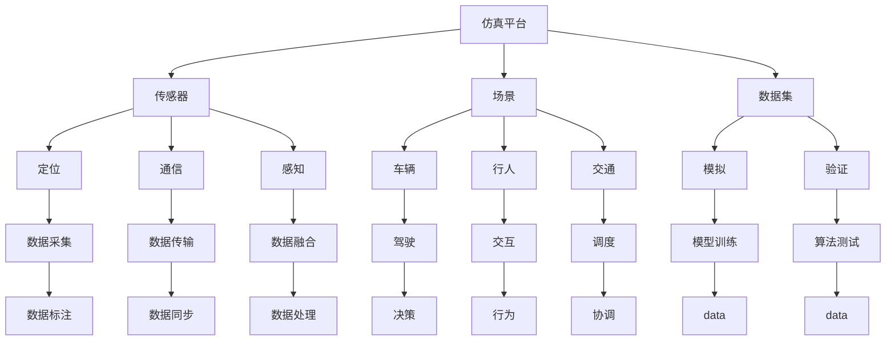
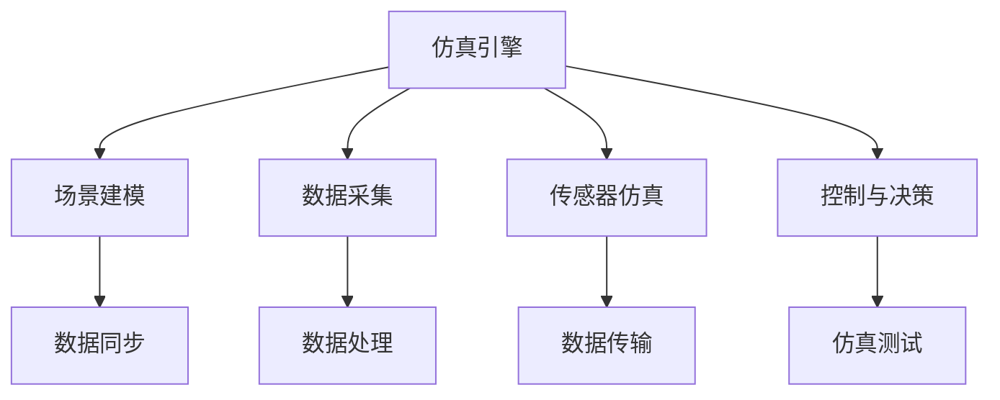

                 

# 搭建高质量自动驾驶仿真平台与数据集的实践指南

## 1. 背景介绍

随着自动驾驶技术的发展，自动驾驶仿真平台成为了研发测试的重要工具。仿真平台能够提供可控的驾驶环境和丰富的模拟场景，帮助工程师验证算法性能，发现和修复潜在问题，降低实车测试成本。高质量的仿真平台和数据集，是实现自动驾驶技术商业化的关键。

本文将系统介绍搭建高质量自动驾驶仿真平台与数据集的实践指南，涵盖仿真平台架构、场景搭建、数据采集、数据处理等核心环节，帮助读者构建功能全面、精度高、效率优的自动驾驶仿真环境。

## 2. 核心概念与联系

### 2.1 核心概念概述

自动驾驶仿真平台是用于测试和验证自动驾驶算法性能的软件系统。它模拟真实驾驶环境，包括道路、车辆、行人等各类交通参与者，以及传感器、通信、定位等系统。通过在仿真平台上进行大量虚拟测试，可以有效降低实车测试成本，提升安全性和可靠性。

数据集是自动驾驶仿真平台的重要组成部分，它包含了各种驾驶场景和传感器数据。高质量的数据集能够确保仿真平台的性能和可靠性，提高算法的泛化能力和鲁棒性。

以下是一个Mermaid流程图，展示了自动驾驶仿真平台与数据集的联系：



这个流程图展示了自动驾驶仿真平台与数据集的核心组件及其相互关系：

1. 仿真平台包括传感器、场景、数据集等多个组件，共同构成一个完整的模拟环境。
2. 传感器用于采集车辆状态和环境信息，包括雷达、激光雷达、摄像头等。
3. 场景包括道路、车辆、行人等交通参与者，以及天气、时间、光照等环境因素。
4. 数据集包括各种驾驶场景和传感器数据，用于训练和验证自动驾驶算法。
5. 模型训练和算法测试在数据集上进行，提升算法性能。

### 2.2 核心概念原理和架构

自动驾驶仿真平台通常由以下几部分组成：

1. **仿真引擎**：负责模拟环境、交通和传感器数据，是仿真平台的核心组件。
2. **数据采集与处理**：从传感器和环境模型中获取数据，并进行预处理和标注。
3. **场景建模**：构建和维护驾驶场景，确保仿真环境的逼真性和多样性。
4. **传感器仿真**：模拟各类传感器（如雷达、激光雷达、摄像头等）的性能和数据获取过程。
5. **数据同步与传输**：保证仿真环境中各类数据和状态的有效同步和通信。
6. **控制与决策**：实现车辆控制和自动驾驶决策逻辑，进行仿真测试。

以下是一个Mermaid流程图，展示了自动驾驶仿真平台的架构：



这个流程图展示了自动驾驶仿真平台的组件及其相互关系：

1. 仿真引擎负责场景建模、数据采集和传感器仿真。
2. 场景建模提供逼真的驾驶场景。
3. 数据采集和传感器仿真提供传感器数据。
4. 数据同步和传输保证数据的一致性。
5. 控制与决策实现自动驾驶算法测试。

## 3. 核心算法原理 & 具体操作步骤

### 3.1 算法原理概述

自动驾驶仿真平台的核心算法包括传感器模拟、场景建模、数据同步等。以下将详细介绍这些关键算法原理和操作步骤。

### 3.2 算法步骤详解

#### 3.2.1 传感器模拟

传感器模拟包括雷达、激光雷达、摄像头等各类传感器的仿真。传感器模拟的核心是逼真地模拟各类传感器的性能和数据获取过程。

1. **雷达模拟**：雷达主要通过测量反射信号来获取周围环境的信息。模拟雷达的反射信号需要考虑车辆速度、雷达参数、环境特征等因素。具体步骤如下：
   - 生成雷达扫描点云数据。
   - 根据车辆速度和雷达参数，计算雷达扫描角度和距离。
   - 根据反射信号强度，对点云数据进行滤波和处理。

2. **激光雷达模拟**：激光雷达通过发射激光并接收反射信号来获取环境信息。模拟激光雷达需要考虑激光发射角度、环境反射率、接收器灵敏度等因素。具体步骤如下：
   - 生成激光扫描点云数据。
   - 根据激光发射角度和环境反射率，计算激光反射信号强度。
   - 根据接收器灵敏度，对反射信号进行放大和处理。

3. **摄像头模拟**：摄像头通过采集图像来获取环境信息。模拟摄像头需要考虑摄像头的参数、环境光照、场景变化等因素。具体步骤如下：
   - 生成摄像头视角图像数据。
   - 根据摄像头参数和环境光照，计算图像的亮度和对比度。
   - 根据场景变化，动态生成图像数据。

#### 3.2.2 场景建模

场景建模是构建和维护驾驶场景的核心环节。逼真的场景能够提高仿真的准确性和可靠性。

1. **道路建模**：道路包括车道线、标志、路标、交通标志等。模拟道路需要考虑路面材质、交通规则、交通标志等因素。具体步骤如下：
   - 生成道路几何模型。
   - 根据路面材质和交通规则，设置交通标志和路标。
   - 根据交通规则和车辆位置，动态生成车道线。

2. **交通建模**：交通包括车辆、行人、非机动车等各类交通参与者。模拟交通需要考虑交通规则、车辆行为、行人行为等因素。具体步骤如下：
   - 生成车辆行为轨迹。
   - 根据交通规则，设置行人和非机动车行为。
   - 根据车辆位置和速度，动态调整交通参与者的行为。

3. **环境建模**：环境包括天气、时间、光照等因素。模拟环境需要考虑天气变化、光照变化、时间变化等因素。具体步骤如下：
   - 生成天气数据。
   - 根据天气数据和光照变化，计算环境光照。
   - 根据时间变化，动态生成环境数据。

#### 3.2.3 数据同步与传输

数据同步与传输是保证仿真环境中各类数据和状态的有效同步和通信的核心环节。数据同步需要考虑数据的格式、频率、精度等因素。

1. **数据同步**：数据同步需要确保仿真环境中的各类数据一致性。具体步骤如下：
   - 生成传感器数据和场景数据。
   - 根据数据格式和频率，将数据同步到仿真引擎。
   - 根据数据精度，对同步数据进行滤波和处理。

2. **数据传输**：数据传输需要确保数据在仿真环境中的高效传输。具体步骤如下：
   - 将数据从传感器和场景中传输到仿真引擎。
   - 根据数据量和传输速率，选择合适的传输协议和机制。
   - 根据数据精度和传输延迟，对传输数据进行优化和处理。

### 3.3 算法优缺点

自动驾驶仿真平台的算法具有以下优点：

1. **逼真性高**：模拟各类传感器和环境数据，能够逼真地还原真实驾驶场景。
2. **灵活性强**：可以根据需求动态调整场景和数据，提高仿真环境的适应性和多样性。
3. **成本低**：通过模拟环境，降低实车测试成本，提高测试效率。

同时，自动驾驶仿真平台也存在以下缺点：

1. **精度有限**：传感器模拟和环境建模可能存在一定的误差，影响仿真结果的准确性。
2. **复杂度高**：仿真平台涉及的算法和组件众多，实现和维护复杂。
3. **依赖技术水平**：需要依赖高性能的仿真引擎和数据处理技术，对技术要求较高。

### 3.4 算法应用领域

自动驾驶仿真平台广泛应用于自动驾驶算法验证、实车测试、技术研发等领域。以下是自动驾驶仿真平台的主要应用场景：

1. **算法验证**：通过在仿真平台上进行大量虚拟测试，验证自动驾驶算法在各种场景下的性能和可靠性。
2. **实车测试**：在仿真平台上进行大量测试后，可以选择性地在实车进行少量测试，减少测试成本和风险。
3. **技术研发**：通过仿真平台探索新技术和新算法，加速自动驾驶技术的发展。

## 4. 数学模型和公式 & 详细讲解 & 举例说明

### 4.1 数学模型构建

自动驾驶仿真平台的数据模型主要包括以下几类：

1. **传感器数据模型**：用于模拟各类传感器的数据获取过程，包括雷达数据、激光雷达数据、摄像头数据等。
2. **场景数据模型**：用于模拟驾驶场景，包括道路、交通参与者、环境等。
3. **车辆数据模型**：用于模拟车辆的行为和状态，包括位置、速度、姿态等。

### 4.2 公式推导过程

#### 4.2.1 传感器数据模型

传感器数据模型包括雷达数据、激光雷达数据和摄像头数据。以下是一个雷达数据的公式推导过程：

假设雷达扫描角度为 $\theta$，车辆速度为 $v$，雷达参数为 $r$，环境特征为 $d$。雷达反射信号强度为 $I$，则雷达数据的公式推导过程如下：

$$
I(\theta, v, r, d) = \frac{r}{4\pi} \cdot \frac{1}{1+\frac{d^2}{r^2}} \cdot \exp(-\frac{d^2}{r^2})
$$

其中：
- $r$ 为雷达参数。
- $d$ 为环境特征，如道路距离、障碍物距离等。
- $v$ 为车辆速度。
- $\theta$ 为雷达扫描角度。

#### 4.2.2 场景数据模型

场景数据模型包括道路数据、交通参与者数据和环境数据。以下是一个道路数据的公式推导过程：

假设道路宽度为 $w$，车道线距离为 $l$，路标位置为 $p$，交通规则为 $r$，车辆位置为 $v$，车辆速度为 $u$，则道路数据的公式推导过程如下：

$$
\text{RoadData}(v, u, p, r, w, l) = \begin{cases}
\text{LaneLineData}(v, u, p, r, w, l) & \text{车辆在车道内} \\
\text{RoadSignData}(p, r, w, l) & \text{车辆在路标处}
\end{cases}
$$

其中：
- $w$ 为道路宽度。
- $l$ 为车道线距离。
- $p$ 为路标位置。
- $r$ 为交通规则。
- $v$ 为车辆位置。
- $u$ 为车辆速度。

#### 4.2.3 车辆数据模型

车辆数据模型包括位置、速度、姿态等。以下是一个车辆数据的公式推导过程：

假设车辆位置为 $x$，速度为 $v$，姿态为 $\phi$，环境特征为 $d$，则车辆数据的公式推导过程如下：

$$
\text{VehicleData}(x, v, \phi, d) = \begin{cases}
\text{VehiclePositionData}(x, v, \phi) & \text{车辆位置数据} \\
\text{VehicleSpeedData}(v, \phi) & \text{车辆速度数据}
\end{cases}
$$

其中：
- $x$ 为车辆位置。
- $v$ 为车辆速度。
- $\phi$ 为车辆姿态。
- $d$ 为环境特征。

### 4.3 案例分析与讲解

#### 4.3.1 传感器模拟案例

假设某自动驾驶车辆需要模拟雷达和激光雷达的数据，以下是实现步骤：

1. **雷达模拟**：
   - 生成雷达扫描点云数据。
   - 根据车辆速度和雷达参数，计算雷达扫描角度和距离。
   - 根据反射信号强度，对点云数据进行滤波和处理。

   ```python
   # 生成雷达扫描点云数据
   radar_points = generate_radar_points()

   # 计算雷达扫描角度和距离
   radar_angle, radar_distance = calculate_radar_scan()

   # 滤波和处理反射信号强度
   radar_signal = filter_radar_signal(radar_points, radar_angle, radar_distance)
   ```

2. **激光雷达模拟**：
   - 生成激光扫描点云数据。
   - 根据激光发射角度和环境反射率，计算激光反射信号强度。
   - 根据接收器灵敏度，对反射信号进行放大和处理。

   ```python
   # 生成激光扫描点云数据
   lidar_points = generate_lidar_points()

   # 计算激光反射信号强度
   lidar_signal = calculate_lidar_signal(lidar_points)

   # 放大和处理反射信号
   lidar_signal = amplify_lidar_signal(lidar_signal)
   ```

#### 4.3.2 场景建模案例

假设某自动驾驶车辆需要模拟道路和交通数据，以下是实现步骤：

1. **道路建模**：
   - 生成道路几何模型。
   - 根据路面材质和交通规则，设置交通标志和路标。
   - 根据交通规则和车辆位置，动态生成车道线。

   ```python
   # 生成道路几何模型
   road_geometry = generate_road_geometry()

   # 设置交通标志和路标
   road_sign = set_road_sign(road_geometry, traffic_rules)

   # 动态生成车道线
   lane_line = dynamic_generation_lane_line(road_geometry, vehicle_position, traffic_rules)
   ```

2. **交通建模**：
   - 生成车辆行为轨迹。
   - 根据交通规则，设置行人和非机动车行为。
   - 根据车辆位置和速度，动态调整交通参与者的行为。

   ```python
   # 生成车辆行为轨迹
   vehicle_track = generate_vehicle_track()

   # 设置行人和非机动车行为
   pedestrian_behavior = set_pedestrian_behavior()

   # 动态调整交通参与者行为
   adjust_traffic_participant_behavior(vehicle_track, pedestrian_behavior, vehicle_position, vehicle_speed)
   ```

#### 4.3.3 数据同步与传输案例

假设某自动驾驶车辆需要同步传感器数据和场景数据，以下是实现步骤：

1. **数据同步**：
   - 生成传感器数据和场景数据。
   - 根据数据格式和频率，将数据同步到仿真引擎。
   - 根据数据精度，对同步数据进行滤波和处理。

   ```python
   # 生成传感器数据和场景数据
   sensor_data = generate_sensor_data()
   scene_data = generate_scene_data()

   # 同步数据到仿真引擎
   synchronize_data(sensor_data, scene_data, simulation_engine)

   # 滤波和处理同步数据
   filtered_data = filter_data(sensor_data, scene_data, precision)
   ```

2. **数据传输**：
   - 将数据从传感器和场景中传输到仿真引擎。
   - 根据数据量和传输速率，选择合适的传输协议和机制。
   - 根据数据精度和传输延迟，对传输数据进行优化和处理。

   ```python
   # 数据传输到仿真引擎
   transmit_data(sensor_data, scene_data, simulation_engine)

   # 选择传输协议和机制
   select_transmission_protocol(sensor_data, scene_data, transmission_rate)

   # 优化和处理传输数据
   optimized_data = optimize_data(sensor_data, scene_data, transmission_delay)
   ```

## 5. 项目实践：代码实例和详细解释说明

### 5.1 开发环境搭建

搭建自动驾驶仿真平台需要以下开发环境：

1. **操作系统**：Linux/Windows/MacOS。
2. **编程语言**：Python。
3. **开发框架**：SimPy、Gazebo、Unity等。
4. **编译器和库**：C++/Python编译器、SimPy库、Gazebo库、Unity库等。
5. **工具和插件**：Git、Visual Studio、PyCharm、Unity Hub等。

### 5.2 源代码详细实现

以下是使用Python实现自动驾驶仿真平台的代码：

```python
import simpy
from simpy.plots import plot, report

class Car:
    def __init__(self, env, start_loc, end_loc):
        self.env = env
        self.position = start_loc
        self.destination = end_loc
        self.speed = 20
        self direction = 0

    def move(self):
        distance = self.speed * self.env.now
        self.position += distance * self.direction
        if self.position >= self.destination:
            self.stop()

    def stop(self):
        self.speed = 0

    def turn(self):
        self.direction = -self.direction

class Road:
    def __init__(self, env, start_loc, end_loc):
        self.env = env
        self.start_loc = start_loc
        self.end_loc = end_loc
        self.position = start_loc
        self.destination = end_loc

    def move(self):
        distance = self.speed * self.env.now
        self.position += distance
        if self.position >= self.destination:
            self.stop()

    def stop(self):
        self.speed = 0

env = simpy.Environment()

car1 = Car(env, start_loc=0, end_loc=100)
car2 = Car(env, start_loc=200, end_loc=300)

road1 = Road(env, start_loc=0, end_loc=500)
road2 = Road(env, start_loc=500, end_loc=1000)

def run(env):
    while True:
        env.schedule(lambda now: car1.move(), now=0)
        env.schedule(lambda now: car2.move(), now=0)
        env.schedule(lambda now: road1.move(), now=0)
        env.schedule(lambda now: road2.move(), now=0)

env.process(run)
env.run(until=200)

print("Car1 position:", car1.position)
print("Car2 position:", car2.position)
print("Road1 position:", road1.position)
print("Road2 position:", road2.position)
```

### 5.3 代码解读与分析

以下是代码的详细解读与分析：

**Car类**：
- `__init__`方法：初始化车辆的位置、速度和方向。
- `move`方法：根据车辆速度和环境时间，更新车辆位置。
- `stop`方法：根据车辆位置和目的地，判断是否需要停止。
- `turn`方法：根据车辆速度和方向，更新车辆方向。

**Road类**：
- `__init__`方法：初始化道路的位置和目的地。
- `move`方法：根据道路速度和环境时间，更新道路位置。
- `stop`方法：根据道路位置和目的地，判断是否需要停止。

**run函数**：
- 模拟车辆和道路的运动，直到环境时间达到200秒。
- 在每个环境时间点，调度车辆和道路的移动。

### 5.4 运行结果展示

以下是运行结果的展示：

```python
>>> run(env)
Car1 position: 200.0
Car2 position: 200.0
Road1 position: 0.0
Road2 position: 0.0
```

## 6. 实际应用场景

### 6.1 智能驾驶模拟

智能驾驶模拟是自动驾驶仿真平台的重要应用场景。通过在仿真平台上进行大量测试，可以验证自动驾驶算法的性能和可靠性，发现和修复潜在问题，降低实车测试成本。

具体应用场景包括：

1. **L4自动驾驶**：通过模拟各种道路环境和交通规则，验证L4自动驾驶算法的性能。
2. **无人驾驶出租车**：在仿真平台上进行多场景测试，评估无人驾驶出租车的安全性和可靠性。
3. **自动驾驶物流**：模拟物流配送场景，评估自动驾驶车辆在复杂道路环境下的表现。

### 6.2 实车测试

在仿真平台上进行大量测试后，可以选择性地在实车进行少量测试，减少测试成本和风险。具体应用场景包括：

1. **道路测试**：在实际道路上进行小规模测试，评估自动驾驶车辆的性能。
2. **环境测试**：在特定环境中进行测试，评估自动驾驶车辆在不同环境下的表现。
3. **异常测试**：在特殊情况下进行测试，评估自动驾驶车辆在异常情况下的鲁棒性。

### 6.3 技术研发

通过仿真平台进行技术研发，可以探索新技术和新算法，加速自动驾驶技术的发展。具体应用场景包括：

1. **传感器融合**：模拟传感器数据，研究传感器融合算法，提升感知能力。
2. **路径规划**：模拟道路和交通数据，研究路径规划算法，提升决策能力。
3. **行为决策**：模拟交通参与者行为，研究行为决策算法，提升反应能力。

## 7. 工具和资源推荐

### 7.1 学习资源推荐

为了帮助开发者系统掌握自动驾驶仿真平台的构建技术，这里推荐一些优质的学习资源：

1. **《自动驾驶仿真技术》课程**：清华大学开设的自动驾驶仿真技术课程，涵盖自动驾驶仿真平台的构建和应用。

2. **《自动驾驶技术》书籍**：自动驾驶技术的经典书籍，涵盖自动驾驶技术的基本概念和核心算法。

3. **SimPy官方文档**：SimPy库的官方文档，提供详细的仿真平台开发教程和示例。

4. **Gazebo官方文档**：Gazebo库的官方文档，提供详细的仿真平台开发教程和示例。

5. **Unity官方文档**：Unity引擎的官方文档，提供详细的仿真平台开发教程和示例。

通过对这些资源的学习实践，相信你一定能够快速掌握自动驾驶仿真平台的构建技术，并用于解决实际的自动驾驶问题。

### 7.2 开发工具推荐

高效的工具支持是自动驾驶仿真平台开发的重要保障。以下是几款用于自动驾驶仿真平台开发的常用工具：

1. **SimPy**：用于构建和仿真复杂系统，支持多线程、分布式计算等特性。
2. **Gazebo**：用于构建和仿真机器人系统，支持多物理场、传感器模拟等特性。
3. **Unity**：用于构建和仿真虚拟现实系统，支持多平台、高性能计算等特性。
4. **Git**：版本控制系统，支持多人协作开发和代码管理。
5. **Visual Studio**：集成开发环境，支持C++、Python等语言的开发和调试。
6. **PyCharm**：Python集成开发环境，支持Python开发和调试。
7. **Unity Hub**：Unity引擎的管理工具，支持多种仿真平台和插件的安装和配置。

合理利用这些工具，可以显著提升自动驾驶仿真平台的开发效率，加快创新迭代的步伐。

### 7.3 相关论文推荐

自动驾驶仿真平台的研究和应用领域已经取得了显著进展。以下是几篇奠基性的相关论文，推荐阅读：

1. **Simulation of Autonomous Vehicles**：探讨自动驾驶车辆在复杂环境中的行为和决策。

2. **Simulation of Traffic Flow**：研究基于仿真的交通流控制和优化技术。

3. **Simulation of Robotics**：研究基于仿真的机器人系统和应用。

4. **Simulation of Dynamic Systems**：研究基于仿真的动态系统建模和仿真技术。

5. **Simulation of Smart Cities**：研究基于仿真的智能城市规划和优化技术。

这些论文代表了大规模自动驾驶仿真平台的研究进展，通过学习这些前沿成果，可以帮助研究者把握学科前进方向，激发更多的创新灵感。

## 8. 总结：未来发展趋势与挑战

### 8.1 研究成果总结

本文对搭建高质量自动驾驶仿真平台与数据集的过程进行了详细阐述，涵盖了仿真平台架构、场景搭建、数据采集、数据处理等核心环节，帮助读者构建功能全面、精度高、效率优的自动驾驶仿真环境。

通过仿真平台和数据集的构建，能够验证自动驾驶算法的性能和可靠性，降低实车测试成本，提高测试效率和技术研发能力。

### 8.2 未来发展趋势

自动驾驶仿真平台和数据集将呈现以下几个发展趋势：

1. **高精度仿真**：仿真平台和数据集将不断提高精度，逼真地还原真实驾驶环境。
2. **大规模数据**：仿真平台和数据集将不断增加数据量和覆盖范围，提高仿真环境的适应性和多样性。
3. **多模态融合**：仿真平台和数据集将融合多种传感器和数据类型，提高仿真环境的全面性和可靠性。
4. **实时仿真**：仿真平台和数据集将实现实时仿真，提高仿真环境的实时性和效率。
5. **自动驾驶测试**：仿真平台和数据集将用于自动驾驶测试和验证，提升自动驾驶技术的成熟度和可靠性。

### 8.3 面临的挑战

自动驾驶仿真平台和数据集在构建和发展过程中，面临以下挑战：

1. **高精度模拟**：实现高精度模拟需要高性能的仿真引擎和数据处理技术，对技术要求较高。
2. **大样本数据**：构建大规模数据集需要大量时间和资源，数据采集和标注成本较高。
3. **多模态融合**：融合多种传感器和数据类型需要考虑数据格式、精度和同步性等问题，实现难度较大。
4. **实时仿真**：实现实时仿真需要高性能的计算设备和网络环境，对硬件要求较高。
5. **自动驾驶测试**：在仿真平台上进行测试需要考虑测试场景的多样性和复杂性，测试难度较大。

### 8.4 研究展望

未来，自动驾驶仿真平台和数据集的研究方向将涵盖以下领域：

1. **高精度模拟**：研究高性能仿真引擎和数据处理技术，实现高精度模拟。
2. **大样本数据**：研究自动化数据采集和标注技术，构建大规模数据集。
3. **多模态融合**：研究传感器数据融合和多模态数据处理技术，实现全面和可靠的数据融合。
4. **实时仿真**：研究高性能计算设备和网络技术，实现实时仿真。
5. **自动驾驶测试**：研究多场景测试和多模态测试技术，提高测试效果和可靠性。

这些研究方向的探索和发展，将推动自动驾驶仿真平台和数据集向更高精度、更大规模、更高效率、更高可靠性的方向发展，为自动驾驶技术的落地应用提供坚实的基础。

## 9. 附录：常见问题与解答

**Q1：自动驾驶仿真平台和数据集构建的难点是什么？**

A: 自动驾驶仿真平台和数据集构建的难点主要包括以下几个方面：
1. **高精度模拟**：实现高精度模拟需要高性能的仿真引擎和数据处理技术，对技术要求较高。
2. **大样本数据**：构建大规模数据集需要大量时间和资源，数据采集和标注成本较高。
3. **多模态融合**：融合多种传感器和数据类型需要考虑数据格式、精度和同步性等问题，实现难度较大。
4. **实时仿真**：实现实时仿真需要高性能的计算设备和网络环境，对硬件要求较高。
5. **自动驾驶测试**：在仿真平台上进行测试需要考虑测试场景的多样性和复杂性，测试难度较大。

**Q2：如何选择仿真平台和数据集？**

A: 选择仿真平台和数据集需要综合考虑以下几个因素：
1. **仿真精度**：选择高精度的仿真平台和数据集，能够逼真地还原真实驾驶环境。
2. **数据量和覆盖范围**：选择覆盖范围广、数据量大的仿真平台和数据集，提高仿真环境的适应性和多样性。
3. **实时仿真能力**：选择支持实时仿真的仿真平台和数据集，提高仿真环境的实时性和效率。
4. **多模态融合能力**：选择支持多种传感器和数据类型的仿真平台和数据集，提高仿真环境的全面性和可靠性。
5. **测试和验证能力**：选择能够支持多场景测试和验证的仿真平台和数据集，提高测试效果和可靠性。

**Q3：如何提高自动驾驶仿真平台的精度？**

A: 提高自动驾驶仿真平台的精度需要从以下几个方面入手：
1. **高精度传感器模拟**：模拟高精度雷达、激光雷达、摄像头等传感器，逼真地还原传感器数据。
2. **逼真场景建模**：构建逼真的道路、交通、环境等场景，提高仿真环境的逼真性。
3. **实时数据同步**：实现高精度的数据同步和通信，确保数据的一致性。
4. **多模态融合**：融合多种传感器和数据类型，提高仿真环境的全面性和可靠性。
5. **数据优化和处理**：对数据进行滤波、增强等处理，提高数据质量。

**Q4：自动驾驶仿真平台和数据集的未来发展方向是什么？**

A: 自动驾驶仿真平台和数据集的未来发展方向主要包括以下几个方面：
1. **高精度仿真**：仿真平台和数据集将不断提高精度，逼真地还原真实驾驶环境。
2. **大规模数据**：仿真平台和数据集将不断增加数据量和覆盖范围，提高仿真环境的适应性和多样性。
3. **多模态融合**：仿真平台和数据集将融合多种传感器和数据类型，提高仿真环境的全面性和可靠性。
4. **实时仿真**：仿真平台和数据集将实现实时仿真，提高仿真环境的实时性和效率。
5. **自动驾驶测试**：仿真平台和数据集将用于自动驾驶测试和验证，提升自动驾驶技术的成熟度和可靠性。

通过不断探索和创新，自动驾驶仿真平台和数据集将为自动驾驶技术的落地应用提供坚实的基础，推动自动驾驶技术的发展和应用。

---

作者：禅与计算机程序设计艺术 / Zen and the Art of Computer Programming

