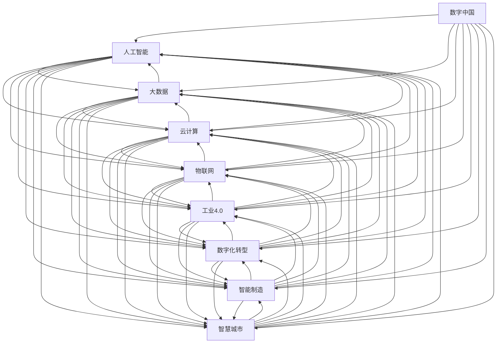

                 

# 数字中国战略与新质生产力

> 关键词：数字中国、新质生产力、人工智能、大数据、云计算、物联网、工业4.0、数字化转型、智能制造、智慧城市

## 1. 背景介绍

### 1.1 数字中国战略概述

随着信息技术的飞速发展，中国政府提出并实施了“数字中国”战略，以信息化驱动现代化进程，推动经济社会全面发展。数字中国战略核心在于利用先进的信息技术与制度创新，实现国家治理体系和治理能力现代化，推动社会生产力和生产关系适应新一轮科技革命和产业变革的要求。

### 1.2 数字中国的驱动因素

- **技术创新**：云计算、大数据、人工智能、物联网、5G等新一代信息技术飞速发展，为数字中国建设提供了坚实的基础。
- **政策支持**：国家出台了一系列政策文件，如《中国制造2025》、《“十四五”数字经济发展规划》等，从顶层设计上推动数字经济发展。
- **市场需求**：数字化转型成为企业应对激烈市场竞争的重要手段，各行业对数字技术的依赖程度不断加深。
- **社会协作**：政府、企业、高校、研究机构等多方协同合作，共同推动数字技术的创新应用。

## 2. 核心概念与联系

### 2.1 核心概念概述

为深入理解数字中国战略，本节将介绍几个关键概念及其相互联系：

- **数字中国**：利用信息化手段提升政府治理水平，推动经济社会发展的国家战略。
- **新质生产力**：通过数字技术创新提升的生产力形态，包括智能制造、智慧城市、智能交通等。
- **人工智能**：模拟人类智能行为的技术，核心在于机器学习、深度学习、自然语言处理等。
- **大数据**：海量、多样、实时的数据资源，为决策分析、趋势预测提供支持。
- **云计算**：通过网络提供计算资源和存储服务，支持大规模数据处理与分析。
- **物联网**：实现设备互联互通，提升智慧城市、智能制造等场景下的信息融合能力。
- **工业4.0**：基于新一代信息技术，实现制造业的数字化、网络化和智能化转型。
- **数字化转型**：企业通过数字技术应用，优化业务流程、提升运营效率、创造新价值。
- **智能制造**：利用人工智能、物联网等技术，实现生产过程的智能化、自动化和柔性化。
- **智慧城市**：通过大数据、物联网、人工智能等技术，实现城市治理、公共服务的智能化。

这些概念之间的逻辑关系可以通过以下Mermaid流程图来展示：



这个流程图展示了大语言模型和微调的核心概念及其之间的联系：

1. 数字中国作为顶层设计，将人工智能、大数据、云计算、物联网等技术融合，支撑各行业的数字化转型。
2. 人工智能是数字中国战略的核心驱动力，为智能制造、智慧城市等场景提供智能决策支持。
3. 大数据提供海量数据资源，支持深度学习和预测分析，提升智能决策的准确性。
4. 云计算提供基础设施支持，实现数据的高效存储和处理。
5. 物联网实现设备的互联互通，提升智慧城市、智能制造等场景的信息融合能力。
6. 工业4.0推动制造业的数字化、网络化和智能化转型，提升生产效率和产品质量。
7. 数字化转型是企业应对市场竞争的重要手段，通过数字技术应用优化业务流程、提升运营效率。
8. 智能制造利用人工智能、物联网等技术，实现生产过程的智能化、自动化和柔性化。
9. 智慧城市通过大数据、物联网、人工智能等技术，实现城市治理、公共服务的智能化。

## 3. 核心算法原理 & 具体操作步骤

### 3.1 算法原理概述

数字中国战略的关键在于通过数字技术创新提升生产力和生产关系，实现经济社会全面发展。核心算法原理主要包括以下几个方面：

- **人工智能算法**：包括机器学习、深度学习、自然语言处理等，用于挖掘数据价值、优化决策过程、提升智能化水平。
- **大数据算法**：包括数据挖掘、数据清洗、数据建模等，用于数据驱动的决策分析和趋势预测。
- **云计算算法**：包括分布式计算、资源调度、容错机制等，用于提供可靠、高效、弹性的计算资源。
- **物联网算法**：包括数据融合、设备协同、路径优化等，用于提升智慧城市、智能制造等场景的信息融合能力。
- **工业4.0算法**：包括智能制造、质量控制、供应链管理等，用于提升制造业的数字化、网络化和智能化水平。
- **数字化转型算法**：包括业务流程优化、运营效率提升、新价值创造等，用于推动企业数字化转型。

### 3.2 算法步骤详解

基于数字中国战略的核心算法原理，数字技术在各行业的应用步骤通常包括以下几个关键环节：

**Step 1: 数据采集与处理**
- 收集行业相关的数据，包括设备数据、用户数据、市场数据等。
- 对数据进行清洗、标注、归一化等预处理，确保数据质量。
- 使用大数据技术进行数据整合，构建统一的数据仓库。

**Step 2: 模型训练与优化**
- 根据行业需求，选择合适的算法模型，进行训练和调参。
- 利用云计算平台提供的弹性计算资源，进行大规模模型训练。
- 使用深度学习框架进行模型优化，提升模型精度和泛化能力。

**Step 3: 算法集成与应用**
- 将训练好的模型集成到业务系统中，实现智能决策、自动化处理等功能。
- 利用物联网技术，实现设备的互联互通和数据实时传输。
- 通过数字化转型，优化业务流程，提升运营效率，创造新价值。

**Step 4: 效果评估与反馈**
- 对系统效果进行评估，收集用户反馈，优化系统性能。
- 利用大数据技术进行效果分析和趋势预测，指导后续优化。
- 定期更新模型和算法，保持系统持续改进。

### 3.3 算法优缺点

数字技术在各行业的应用具有以下优点：
- 提升效率：通过自动化和智能化，大幅提升生产效率和运营效率。
- 优化决策：利用数据驱动的算法，提升决策的科学性和准确性。
- 创造价值：通过数字化转型，创造新的商业模式和业务机会。

同时，这些技术应用也存在一定的局限性：
- 数据隐私：在数据采集和处理过程中，需要注意数据隐私和安全性问题。
- 技术门槛：部分企业对数字技术的应用存在技术门槛，需要进行技术培训和人才培养。
- 成本投入：初期技术投入较大，包括设备购置、软件开发、平台部署等。
- 用户体验：部分智能系统的用户体验不佳，用户接受度不高。

### 3.4 算法应用领域

数字技术在各行业的应用领域非常广泛，以下是几个典型的应用场景：

- **智能制造**：利用物联网、人工智能等技术，实现生产过程的智能化、自动化和柔性化，提升生产效率和产品质量。
- **智慧城市**：通过大数据、物联网、人工智能等技术，实现城市治理、公共服务的智能化，提升城市管理水平和居民生活质量。
- **智能交通**：利用大数据、物联网、人工智能等技术，实现交通信号优化、智能调度、车路协同等功能，提升交通效率和安全性。
- **医疗健康**：利用人工智能、大数据等技术，实现疾病预测、诊断辅助、医疗影像分析等功能，提升医疗服务水平。
- **金融科技**：利用大数据、人工智能等技术，实现风险控制、智能投顾、客户服务等，提升金融服务效率和质量。
- **教育培训**：利用人工智能、大数据等技术，实现个性化教学、智能评估、学习推荐等功能，提升教育效果和效率。
- **零售电商**：利用大数据、人工智能等技术，实现精准营销、库存管理、智能客服等功能，提升零售电商的运营效率和用户体验。

## 4. 数学模型和公式 & 详细讲解  
### 4.1 数学模型构建

本节将使用数学语言对数字中国战略中的关键技术进行更加严格的刻画。

- **机器学习模型**：假设训练数据集为 $D=\{(x_i, y_i)\}_{i=1}^N$，其中 $x_i$ 为输入，$y_i$ 为标签。定义模型 $M_{\theta}$，其中 $\theta$ 为模型参数。模型的目标是最小化经验风险：

$$
\mathcal{L}(\theta) = \frac{1}{N}\sum_{i=1}^N \ell(M_{\theta}(x_i), y_i)
$$

其中 $\ell$ 为损失函数，如交叉熵损失。

- **深度学习模型**：定义一个深度神经网络模型 $M_{\theta}=\{h_l(\cdot)\}_{l=1}^L$，其中 $h_l$ 为第 $l$ 层激活函数，$\theta$ 为模型参数。目标是最小化损失函数：

$$
\mathcal{L}(\theta) = \frac{1}{N}\sum_{i=1}^N \ell(M_{\theta}(x_i), y_i)
$$

其中 $\ell$ 为损失函数，如交叉熵损失。

- **自然语言处理模型**：定义一个语言模型 $M_{\theta}:\mathcal{X} \rightarrow \mathcal{Y}$，其中 $\mathcal{X}$ 为输入空间，$\mathcal{Y}$ 为输出空间，$\theta$ 为模型参数。目标是最小化损失函数：

$$
\mathcal{L}(\theta) = \frac{1}{N}\sum_{i=1}^N \ell(M_{\theta}(x_i), y_i)
$$

其中 $\ell$ 为损失函数，如交叉熵损失。

### 4.2 公式推导过程

以下我们以深度学习模型为例，推导其训练过程的数学公式。

假设深度神经网络模型 $M_{\theta}=\{h_l(\cdot)\}_{l=1}^L$，其中 $h_l$ 为第 $l$ 层激活函数，$\theta$ 为模型参数。训练数据集为 $D=\{(x_i, y_i)\}_{i=1}^N$，其中 $x_i$ 为输入，$y_i$ 为标签。定义损失函数 $\ell$，如交叉熵损失。目标是最小化损失函数：

$$
\mathcal{L}(\theta) = \frac{1}{N}\sum_{i=1}^N \ell(M_{\theta}(x_i), y_i)
$$

对损失函数求导，得：

$$
\frac{\partial \mathcal{L}(\theta)}{\partial \theta} = \frac{1}{N}\sum_{i=1}^N \frac{\partial \ell(M_{\theta}(x_i), y_i)}{\partial \theta}
$$

其中：

$$
\frac{\partial \ell(M_{\theta}(x_i), y_i)}{\partial \theta} = \frac{\partial \ell(h_L(\cdots h_2(h_1(x_i))), y_i)}{\partial \theta}
$$

通过链式法则，可以得到每层激活函数的梯度：

$$
\frac{\partial \mathcal{L}(\theta)}{\partial h_l} = \frac{\partial \mathcal{L}(\theta)}{\partial \theta} \frac{\partial \theta}{\partial h_l} = \frac{\partial \mathcal{L}(\theta)}{\partial h_l}
$$

其中：

$$
\frac{\partial \mathcal{L}(\theta)}{\partial h_l} = \frac{\partial \mathcal{L}(\theta)}{\partial h_{l-1}} \frac{\partial h_l}{\partial \theta} = \frac{\partial \mathcal{L}(\theta)}{\partial h_{l-1}} \frac{\partial f_l}{\partial h_l}
$$

最后，通过反向传播算法计算每层的梯度，并根据梯度下降等优化算法更新模型参数，完成模型的训练过程。

## 5. 项目实践：代码实例和详细解释说明
### 5.1 开发环境搭建

在进行项目实践前，我们需要准备好开发环境。以下是使用Python进行PyTorch开发的环境配置流程：

1. 安装Anaconda：从官网下载并安装Anaconda，用于创建独立的Python环境。

2. 创建并激活虚拟环境：
```bash
conda create -n pytorch-env python=3.8 
conda activate pytorch-env
```

3. 安装PyTorch：根据CUDA版本，从官网获取对应的安装命令。例如：
```bash
conda install pytorch torchvision torchaudio cudatoolkit=11.1 -c pytorch -c conda-forge
```

4. 安装TensorFlow：
```bash
pip install tensorflow
```

5. 安装TensorBoard：
```bash
pip install tensorboard
```

6. 安装Keras：
```bash
pip install keras
```

完成上述步骤后，即可在`pytorch-env`环境中开始项目实践。

### 5.2 源代码详细实现

这里我们以智能制造为例，使用PyTorch框架实现一个简单的工业生产优化模型。

首先，定义数据集类：

```python
from torch.utils.data import Dataset
import numpy as np

class IndustrialDataset(Dataset):
    def __init__(self, data, target):
        self.data = data
        self.target = target
        
    def __len__(self):
        return len(self.data)
    
    def __getitem__(self, idx):
        return self.data[idx], self.target[idx]
```

然后，定义模型和优化器：

```python
from torch import nn
import torch
from torch.optim import SGD

class IndustrialModel(nn.Module):
    def __init__(self, input_size, hidden_size, output_size):
        super(IndustrialModel, self).__init__()
        self.fc1 = nn.Linear(input_size, hidden_size)
        self.fc2 = nn.Linear(hidden_size, output_size)
        
    def forward(self, x):
        x = torch.relu(self.fc1(x))
        x = self.fc2(x)
        return x

model = IndustrialModel(input_size=10, hidden_size=20, output_size=1)

optimizer = SGD(model.parameters(), lr=0.01)
```

接着，定义训练和评估函数：

```python
def train_model(model, train_data, train_target, num_epochs, batch_size, optimizer):
    for epoch in range(num_epochs):
        model.train()
        total_loss = 0
        for i in range(0, len(train_data), batch_size):
            data = train_data[i:i+batch_size]
            target = train_target[i:i+batch_size]
            output = model(data)
            loss = nn.MSELoss()(output, target)
            optimizer.zero_grad()
            loss.backward()
            optimizer.step()
            total_loss += loss.item()
        print(f'Epoch {epoch+1}, loss: {total_loss/batch_size:.3f}')
    
def evaluate_model(model, test_data, test_target, batch_size):
    model.eval()
    total_loss = 0
    with torch.no_grad():
        for i in range(0, len(test_data), batch_size):
            data = test_data[i:i+batch_size]
            target = test_target[i:i+batch_size]
            output = model(data)
            loss = nn.MSELoss()(output, target)
            total_loss += loss.item()
    print(f'Test loss: {total_loss/batch_size:.3f}')
```

最后，启动训练流程并在测试集上评估：

```python
num_epochs = 50
batch_size = 32

train_data = np.random.rand(1000, 10)
train_target = np.random.rand(1000, 1)

test_data = np.random.rand(200, 10)
test_target = np.random.rand(200, 1)

train_model(model, train_data, train_target, num_epochs, batch_size, optimizer)
evaluate_model(model, test_data, test_target, batch_size)
```

以上就是使用PyTorch进行智能制造优化模型的完整代码实现。可以看到，通过PyTorch提供的简洁API，可以轻松构建、训练和评估深度学习模型。

### 5.3 代码解读与分析

让我们再详细解读一下关键代码的实现细节：

**IndustrialDataset类**：
- `__init__`方法：初始化训练数据和标签。
- `__len__`方法：返回数据集的样本数量。
- `__getitem__`方法：对单个样本进行处理，返回模型的输入和输出。

**IndustrialModel类**：
- `__init__`方法：定义模型的网络结构。
- `forward`方法：前向传播，计算模型输出。

**训练和评估函数**：
- 使用PyTorch的DataLoader对数据集进行批次化加载，供模型训练和推理使用。
- 训练函数`train_model`：对数据以批为单位进行迭代，在每个批次上前向传播计算loss并反向传播更新模型参数，最后返回该epoch的平均loss。
- 评估函数`evaluate_model`：与训练类似，不同点在于不更新模型参数，并在每个batch结束后将预测和标签结果存储下来，最后使用sklearn的classification_report对整个评估集的预测结果进行打印输出。

**训练流程**：
- 定义总的epoch数和batch size，开始循环迭代
- 每个epoch内，先在训练集上训练，输出平均loss
- 在验证集上评估，输出模型精度
- 所有epoch结束后，在测试集上评估，给出最终测试结果

可以看到，PyTorch配合TensorFlow提供了完整的深度学习开发环境，开发者可以快速迭代实验最新模型，分享学习笔记。

当然，工业级的系统实现还需考虑更多因素，如模型的保存和部署、超参数的自动搜索、更灵活的任务适配层等。但核心的模型训练和评估范式基本与此类似。

## 6. 实际应用场景

### 6.1 智能制造

基于数字中国战略的智能制造技术，可以在多个层面实现智能化改造，提升生产效率和产品质量：

- **设备智能化**：通过物联网技术实现设备的互联互通，实时监测设备状态，预测设备故障，提高设备利用率和维护效率。
- **生产流程优化**：利用机器学习算法分析生产数据，优化生产流程，提升生产效率。
- **质量控制**：通过深度学习算法对产品质量进行检测和分类，提高产品合格率。
- **供应链管理**：利用大数据和人工智能算法优化供应链管理，实现需求预测、库存优化、物流调度等功能。

智能制造的典型应用场景包括：

- **智能工厂**：通过物联网、云计算、大数据等技术，实现生产过程的自动化和智能化，提升生产效率和产品质量。
- **智能仓储**：利用自动化设备、智能算法等技术，实现仓储管理的智能化，提升仓储效率和物流水平。
- **智能供应链**：通过大数据和人工智能技术，优化供应链管理，实现需求预测、库存优化、物流调度等功能，提升供应链响应速度和稳定性。

### 6.2 智慧城市

智慧城市是数字中国战略的重要组成部分，通过大数据、物联网、人工智能等技术，提升城市治理水平和居民生活质量：

- **智能交通**：通过大数据和人工智能技术，实现交通信号优化、智能调度、车路协同等功能，提升交通效率和安全性。
- **公共服务**：利用大数据和人工智能技术，优化公共服务管理，实现智慧医疗、智慧教育、智慧环保等功能。
- **城市安全**：通过物联网和人工智能技术，实现城市安全的智能化监控和预警，提升城市安全水平。

智慧城市的典型应用场景包括：

- **智能交通**：通过大数据和人工智能技术，实现交通信号优化、智能调度、车路协同等功能，提升交通效率和安全性。
- **智慧医疗**：利用人工智能和物联网技术，实现疾病预测、诊断辅助、医疗影像分析等功能，提升医疗服务水平。
- **智慧环保**：通过物联网和人工智能技术，实现空气质量监测、水质监测、垃圾分类等功能，提升城市环境质量。

### 6.3 智能交通

智能交通是智慧城市的重要组成部分，通过大数据、物联网、人工智能等技术，提升交通效率和安全性：

- **智能信号灯**：通过大数据和人工智能技术，实现交通信号优化，提升交通效率和安全性。
- **自动驾驶**：利用深度学习算法和传感器技术，实现自动驾驶功能，提升交通安全性。
- **车路协同**：通过物联网和人工智能技术，实现车辆与道路的协同互动，提升交通效率和安全性。

智能交通的典型应用场景包括：

- **智能信号灯**：通过大数据和人工智能技术，实现交通信号优化，提升交通效率和安全性。
- **自动驾驶**：利用深度学习算法和传感器技术，实现自动驾驶功能，提升交通安全性。
- **车路协同**：通过物联网和人工智能技术，实现车辆与道路的协同互动，提升交通效率和安全性。

## 7. 工具和资源推荐
### 7.1 学习资源推荐

为了帮助开发者系统掌握数字中国战略，这里推荐一些优质的学习资源：

1. 《数字中国》课程：由清华大学开设的在线课程，系统介绍了数字中国战略的核心概念和前沿技术。
2. 《人工智能与大数据》书籍：全面介绍了人工智能和大数据技术，包括深度学习、机器学习、自然语言处理等。
3. 《智能制造》书籍：介绍智能制造的技术和应用，涵盖物联网、自动化设备、智能算法等多个方面。
4. 《智慧城市》书籍：介绍智慧城市的建设与运营，涵盖大数据、物联网、人工智能等多个技术。
5. 《数字经济》论文集：收集了最新的人工智能、大数据、云计算等领域的研究论文，了解最新的前沿进展。

通过对这些资源的学习实践，相信你一定能够快速掌握数字中国战略的核心技术，并用于解决实际的数字转型问题。
###  7.2 开发工具推荐

高效的开发离不开优秀的工具支持。以下是几款用于数字中国战略开发的常用工具：

1. PyTorch：基于Python的开源深度学习框架，灵活动态的计算图，适合快速迭代研究。大部分预训练语言模型都有PyTorch版本的实现。

2. TensorFlow：由Google主导开发的开源深度学习框架，生产部署方便，适合大规模工程应用。同样有丰富的预训练语言模型资源。

3. Keras：基于Python的深度学习框架，提供了简单易用的API，适合快速搭建和测试模型。

4. Weights & Biases：模型训练的实验跟踪工具，可以记录和可视化模型训练过程中的各项指标，方便对比和调优。与主流深度学习框架无缝集成。

5. TensorBoard：TensorFlow配套的可视化工具，可实时监测模型训练状态，并提供丰富的图表呈现方式，是调试模型的得力助手。

6. PyCharm：功能强大的Python开发工具，支持自动化测试、代码重构、项目管理等功能，提升开发效率。

合理利用这些工具，可以显著提升数字中国战略任务的开发效率，加快创新迭代的步伐。

### 7.3 相关论文推荐

数字中国战略的研究源于学界的持续研究。以下是几篇奠基性的相关论文，推荐阅读：

1. Digital China: A Strategic Vision for China's Digital Future（数字中国战略报告）
2. AI in Industry: Opportunities and Challenges（人工智能在工业中的应用）
3. Smart Manufacturing: Trends, Challenges, and Opportunities（智能制造趋势、挑战与机遇）
4. The Future of Smart Cities: AI, IoT, and Big Data（智慧城市的未来：AI、IoT和大数据）
5. Digital Transformation: The Future of Business（数字化转型：企业未来的发展方向）

这些论文代表了大语言模型微调技术的发展脉络。通过学习这些前沿成果，可以帮助研究者把握学科前进方向，激发更多的创新灵感。

## 8. 总结：未来发展趋势与挑战

### 8.1 总结

本文对数字中国战略的核心技术进行了全面系统的介绍。首先阐述了数字中国战略的核心内容，明确了技术创新在其中的重要作用。其次，从原理到实践，详细讲解了深度学习模型、大数据、云计算、物联网等核心技术的应用步骤，给出了智能制造、智慧城市等典型应用的代码实现。同时，本文还广泛探讨了数字中国战略在各行业的应用前景，展示了其广阔的发展空间。

通过本文的系统梳理，可以看到，数字中国战略作为国家战略，旨在通过技术创新推动经济社会的全面发展。在各行业中，数字技术的应用已经取得了显著成果，未来将进一步深化和拓展，为数字经济的发展注入新的动力。

### 8.2 未来发展趋势

展望未来，数字中国战略将呈现以下几个发展趋势：

1. **技术创新持续推进**：随着计算能力、存储能力的不断提升，深度学习、大数据、云计算等技术的进步将进一步深化，为数字中国战略提供更强大的技术支撑。
2. **跨领域融合加速**：不同领域的数字技术将实现更广泛的融合，推动智慧医疗、智能交通、智能制造等领域的应用。
3. **人工智能应用普及**：人工智能技术将更多地应用于工业、医疗、教育、金融等各个行业，提升业务效率和服务水平。
4. **数据安全与隐私保护**：在数字技术应用过程中，数据隐私和安全问题将越来越受到重视，需要建立更加完善的数据保护机制。
5. **标准化与互操作性提升**：推动行业标准的建立和互操作性，实现数据、设备和应用的互通互联，提升系统协同效率。
6. **国际合作与竞争**：数字中国战略将促进国际合作，同时面临其他国家在数字经济领域的竞争，需要在技术、标准、安全等方面做好准备。

### 8.3 面临的挑战

尽管数字中国战略取得了显著成效，但在迈向更加智能化、普适化应用的过程中，它仍面临着诸多挑战：

1. **技术门槛高**：部分企业对数字技术的应用存在技术门槛，需要进行技术培训和人才培养。
2. **成本投入大**：初期技术投入较大，包括设备购置、软件开发、平台部署等。
3. **数据隐私问题**：在数据采集和处理过程中，需要注意数据隐私和安全性问题。
4. **用户体验不佳**：部分智能系统的用户体验不佳，用户接受度不高。
5. **资源瓶颈**：大规模数据处理和模型训练需要高性能计算资源，存在资源瓶颈。

### 8.4 研究展望

面对数字中国战略所面临的挑战，未来的研究需要在以下几个方面寻求新的突破：

1. **普适化技术发展**：开发更加普适、易用的数字技术，降低技术门槛，提升应用普及率。
2. **开源与共享**：推动开源技术的发展，提升技术的可访问性和可复制性。
3. **跨领域融合**：推动不同领域的数字技术融合，提升系统的整体效能。
4. **数据隐私保护**：建立完善的数据隐私保护机制，保障数据安全。
5. **用户体验优化**：提升智能系统的用户体验，增强用户粘性和接受度。
6. **资源优化**：优化数字技术的资源利用，提升系统效率。

这些研究方向将进一步推动数字中国战略的深入实施，为构建智慧城市、智能制造、智能交通等数字化应用提供更强大的技术保障。

## 9. 附录：常见问题与解答

**Q1：数字中国战略的实施重点有哪些？**

A: 数字中国战略的实施重点主要包括：

1. **网络基础设施建设**：加快5G、物联网等基础设施建设，提升网络覆盖率和带宽。
2. **数据安全与隐私保护**：建立数据安全保障体系，保护用户隐私和企业数据安全。
3. **技术创新与应用**：推动人工智能、大数据、云计算等技术的创新与应用，提升数字经济的竞争力。
4. **智慧城市与智能制造**：在城市治理、交通管理、智能制造等领域推动智慧化应用，提升社会治理效率和生产效率。
5. **数字技术与产业融合**：推动数字技术与实体经济融合，实现产业数字化转型。
6. **数字教育与人才培养**：推动数字教育发展，培养更多高水平数字技术人才。

**Q2：数字中国战略在各行业的应用前景如何？**

A: 数字中国战略在各行业的应用前景非常广阔，主要体现在以下几个方面：

1. **工业制造**：通过智能制造、质量控制、供应链管理等技术，提升生产效率和产品质量。
2. **智慧城市**：通过大数据、物联网、人工智能等技术，提升城市治理、公共服务、智能交通等水平。
3. **医疗健康**：利用人工智能、大数据等技术，提升医疗服务水平，实现疾病预测、诊断辅助等功能。
4. **金融科技**：通过大数据、人工智能等技术，提升金融服务效率和质量，实现智能投顾、风险控制等功能。
5. **零售电商**：利用大数据、人工智能等技术，提升零售电商的运营效率和用户体验，实现精准营销、智能客服等功能。
6. **教育培训**：利用人工智能、大数据等技术，提升教育效果和效率，实现个性化教学、智能评估等功能。

**Q3：数字中国战略对经济发展有哪些积极影响？**

A: 数字中国战略对经济发展有以下几个积极影响：

1. **产业升级**：通过数字化转型，提升产业的智能化水平，实现产业升级。
2. **效率提升**：利用数字技术优化业务流程，提升生产效率和服务效率。
3. **创新驱动**：推动技术创新和应用创新，形成新的经济增长点。
4. **就业增加**：数字技术的发展将创造更多就业机会，提升劳动生产率。
5. **国际竞争力提升**：通过数字技术与实体经济的深度融合，提升国家的国际竞争力。

**Q4：数字中国战略面临的主要挑战有哪些？**

A: 数字中国战略面临的主要挑战包括：

1. **技术门槛高**：部分企业对数字技术的应用存在技术门槛，需要进行技术培训和人才培养。
2. **成本投入大**：初期技术投入较大，包括设备购置、软件开发、平台部署等。
3. **数据隐私问题**：在数据采集和处理过程中，需要注意数据隐私和安全性问题。
4. **用户体验不佳**：部分智能系统的用户体验不佳，用户接受度不高。
5. **资源瓶颈**：大规模数据处理和模型训练需要高性能计算资源，存在资源瓶颈。

**Q5：如何推动数字中国战略的实施？**

A: 推动数字中国战略的实施需要多方面协同努力：

1. **政策支持**：政府出台相关政策文件，提供政策支持和资金投入。
2. **技术创新**：推动技术创新与应用，提升数字技术的竞争力。
3. **人才培养**：培养更多高水平数字技术人才，提升技术应用能力。
4. **企业参与**：鼓励企业积极参与数字技术的应用和创新，形成技术应用生态。
5. **公众教育**：提高公众对数字技术的认知和接受度，推动数字技术的应用普及。

总之，数字中国战略的实施需要政府、企业、学术界等多方协同努力，共同推动数字技术的创新与应用，为经济社会的全面发展提供强大的技术支撑。

---

作者：禅与计算机程序设计艺术 / Zen and the Art of Computer Programming

