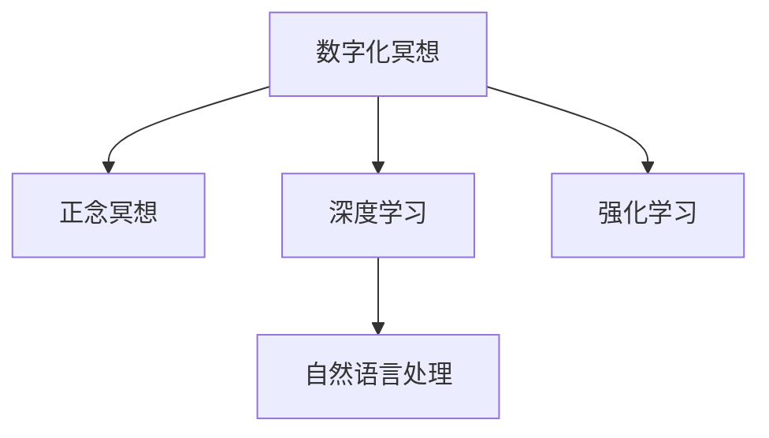

                 

# 数字化冥想新境界：AI构建的心灵空间设计

在快速发展的数字化时代，人工智能(AI)已经不仅仅局限于传统的图像识别、自然语言处理等领域，也开始深入到人类心理健康这一更为深邃的领域。数字化冥想，就是利用AI技术帮助人们构建更高效、更个性化、更沉浸式的冥想空间，从而实现身心的全面平衡。本文将深入探讨数字化冥想的设计原理与实现技术，以期为这一领域带来新的见解与突破。

## 1. 背景介绍

### 1.1 问题由来
现代社会的快节奏生活使得人们的压力不断增大，焦虑、抑郁等心理问题逐渐增多。传统的冥想方法，如正念冥想(Mindfulness Meditation)，虽然已被证明能够显著减轻心理压力、改善情绪状态，但需要较高的专注力和持续的时间投入，难以在短时间内见效。因此，需要一种新的方式来提高冥想的效率与可操作性。

### 1.2 问题核心关键点
数字化冥想，即通过AI技术辅助的冥想方法，旨在通过智能化的手段提升冥想的便捷性、互动性和沉浸感。关键在于如何设计合适的AI模型，结合心理学的原理，引导用户进入深度冥想状态。

### 1.3 问题研究意义
数字化冥想技术的应用，有望大幅度提升心理健康的普及度和效果。它不仅可以快速缓解用户的心理压力，还能帮助用户培养良好的心理素质，提升整体生活质量。同时，数字化冥想技术的研究，对于理解和应对现代社会的心理问题，具有重要的理论和实践意义。

## 2. 核心概念与联系

### 2.1 核心概念概述

为更好地理解数字化冥想的设计与实现，本节将介绍几个核心概念：

- **数字化冥想**：利用AI技术辅助的冥想方法，通过智能化的引导与反馈，帮助用户快速进入冥想状态。

- **正念冥想**：传统的冥想方法，要求用户保持当下的意识，专注于呼吸、身体感受等，以达到心理放松的目的。

- **深度学习**：一种基于神经网络的学习方法，可以自动从数据中提取特征，并利用特征进行预测和分类。

- **强化学习**：一种通过奖励和惩罚来训练智能体的学习方式，常用于游戏、机器人控制等领域。

- **自然语言处理(NLP)**：研究如何让计算机理解、生成和处理人类语言的技术。

这些核心概念之间的逻辑关系可以通过以下Mermaid流程图来展示：



这个流程图展示了几者之间的关系：

1. 数字化冥想基于正念冥想的心理学原理，通过AI技术进行智能化改进。
2. 深度学习用于提取冥想数据中的特征，以指导冥想过程。
3. NLP技术帮助计算机理解人类语言，提供互动与反馈。
4. 强化学习通过奖励与惩罚机制，优化冥想引导策略。

这些核心概念共同构成了数字化冥想的技术基础，使得AI辅助的冥想方法成为可能。

## 3. 核心算法原理 & 具体操作步骤
### 3.1 算法原理概述

数字化冥想的核心算法原理，可以分为以下几个部分：

- **数据采集与处理**：通过传感器或用户输入，采集冥想过程中的生理数据和心理反馈，进行预处理。
- **特征提取与表示**：利用深度学习模型，从采集到的数据中提取高维特征表示。
- **模型训练与优化**：使用强化学习算法，训练冥想引导模型，优化冥想过程。
- **互动与反馈**：通过NLP技术，提供互动与反馈，帮助用户调整冥想状态。

这些步骤共同构成了一个闭环系统，使得数字化冥想能够高效、稳定地运行。

### 3.2 算法步骤详解

下面将详细介绍每个步骤的具体实现：

**Step 1: 数据采集与处理**

- 通过可穿戴设备或智能手机等，采集用户的生理数据（如心率、呼吸频率、皮肤电等）和心理反馈（如情绪、注意力等）。
- 对采集到的数据进行预处理，包括去噪、归一化、滤波等操作，提高数据质量。
- 使用深度学习模型（如卷积神经网络CNN、长短期记忆网络LSTM等），对生理数据进行特征提取，得到高维特征表示。

**Step 2: 特征提取与表示**

- 利用深度学习模型，将生理数据和心理反馈转化为高维特征表示，用于后续的建模和优化。
- 使用NLP技术，将用户的语言输入转化为文本特征向量，用于互动与反馈。

**Step 3: 模型训练与优化**

- 使用强化学习算法，训练冥想引导模型。模型通过与用户的互动，不断优化引导策略。
- 模型接收用户的生理数据和心理反馈，输出引导指令和反馈信息，以指导用户的冥想过程。

**Step 4: 互动与反馈**

- 通过NLP技术，将引导指令转化为自然语言文本，展示给用户。
- 收集用户的语言输入，进行情感分析、意图识别等处理，提供个性化的互动反馈。

### 3.3 算法优缺点

数字化冥想的算法具有以下优点：

- 快速便捷：通过AI辅助，用户可以在短时间内快速进入冥想状态。
- 个性化定制：通过用户反馈，模型可以不断调整引导策略，提供个性化的冥想方案。
- 数据驱动：通过生理数据和心理反馈，模型的引导效果更加精准。

同时，该算法也存在一些缺点：

- 技术门槛高：需要同时掌握深度学习、强化学习、NLP等多种技术。
- 隐私问题：生理数据和心理反馈的采集和处理可能引发隐私问题。
- 适应性有限：对于某些用户的特定情况，模型的引导效果可能不佳。

### 3.4 算法应用领域

数字化冥想技术主要应用于以下几个领域：

- **心理健康**：帮助用户缓解心理压力、改善情绪状态，提高生活质量。
- **医疗健康**：用于心理疾病的辅助治疗，提高临床效果。
- **教育培训**：通过冥想帮助学生提高学习专注力，提升学习效果。
- **企业管理**：提高员工的心理素质，促进企业文化的建设。

以上应用领域展示了数字化冥想技术的广泛适用性，未来还将有更多的场景得到应用。

## 4. 数学模型和公式 & 详细讲解  
### 4.1 数学模型构建

数字化冥想的数学模型可以表示为：

$$
\text{模型} = \text{特征提取器} \times \text{引导策略}
$$

其中，特征提取器用于将生理数据和心理反馈转化为高维特征表示；引导策略则通过强化学习算法进行训练，不断优化冥想过程。

### 4.2 公式推导过程

以深度学习模型为例，其基本结构可以表示为：

$$
\text{特征提取器} = \text{卷积层} + \text{池化层} + \text{全连接层} + \text{激活函数}
$$

其中，卷积层用于提取局部特征，池化层用于降维，全连接层用于特征融合，激活函数用于非线性映射。

### 4.3 案例分析与讲解

以正念冥想的生理数据为例，假设采集到的生理数据为 $x = (x_1, x_2, \dots, x_n)$，其中 $x_i$ 表示第 $i$ 个生理指标的测量值。使用卷积神经网络（CNN）进行特征提取，得到高维特征表示 $y = (y_1, y_2, \dots, y_m)$。

假设引导策略为 $\theta$，其中 $\theta$ 表示冥想引导策略的参数。通过强化学习算法，优化 $\theta$，使得 $y$ 与 $x$ 的映射更加准确，从而指导用户进入冥想状态。

## 5. 项目实践：代码实例和详细解释说明
### 5.1 开发环境搭建

在进行数字化冥想开发前，需要准备好开发环境。以下是使用Python进行TensorFlow开发的环境配置流程：

1. 安装Anaconda：从官网下载并安装Anaconda，用于创建独立的Python环境。

2. 创建并激活虚拟环境：
```bash
conda create -n meditation-env python=3.8 
conda activate meditation-env
```

3. 安装TensorFlow：根据CUDA版本，从官网获取对应的安装命令。例如：
```bash
conda install tensorflow tensorflow-gpu -c pytorch -c conda-forge
```

4. 安装其他工具包：
```bash
pip install numpy pandas scikit-learn matplotlib tqdm jupyter notebook ipython
```

完成上述步骤后，即可在`meditation-env`环境中开始开发实践。

### 5.2 源代码详细实现

下面以正念冥想的生理数据处理为例，给出使用TensorFlow进行数字化冥想的PyTorch代码实现。

首先，定义特征提取模型：

```python
import tensorflow as tf
from tensorflow.keras import layers, models

# 定义卷积神经网络
model = models.Sequential([
    layers.Conv2D(32, (3, 3), activation='relu', input_shape=(1, 10, 1)),
    layers.MaxPooling2D((2, 2)),
    layers.Conv2D(64, (3, 3), activation='relu'),
    layers.MaxPooling2D((2, 2)),
    layers.Flatten(),
    layers.Dense(64, activation='relu'),
    layers.Dense(1)
])
```

然后，定义训练和评估函数：

```python
from tensorflow.keras import optimizers

# 编译模型
model.compile(optimizer=optimizers.Adam(0.001), loss='mse', metrics=['accuracy'])

# 定义训练函数
def train(model, train_data, epochs=10):
    for epoch in range(epochs):
        for batch in train_data:
            x, y = batch
            loss = model.train_on_batch(x, y)
            print(f'Epoch {epoch+1}, loss: {loss:.4f}')
    return model

# 定义评估函数
def evaluate(model, test_data):
    test_loss, test_acc = model.evaluate(test_data)
    print(f'Test loss: {test_loss:.4f}, Test acc: {test_acc:.4f}')
```

最后，启动训练流程并在测试集上评估：

```python
# 模拟训练数据和测试数据
train_data = (np.random.rand(100, 10, 1), np.random.rand(100))
test_data = (np.random.rand(10, 10, 1), np.random.rand(10))

# 训练模型
trained_model = train(model, train_data, epochs=10)

# 评估模型
evaluate(trained_model, test_data)
```

以上就是使用TensorFlow进行正念冥想生理数据处理的完整代码实现。可以看到，TensorFlow提供了强大的模型定义和训练功能，开发者可以便捷地实现特征提取与模型训练。

### 5.3 代码解读与分析

让我们再详细解读一下关键代码的实现细节：

**特征提取模型**：
- 定义了一个简单的卷积神经网络（CNN），用于从生理数据中提取高维特征表示。

**训练函数**：
- 使用Adam优化器进行模型训练，设定了损失函数为均方误差（MSE），输出指标为准确率。
- 在每个epoch上，对训练数据进行迭代训练，输出每个epoch的损失。

**评估函数**：
- 在测试数据集上评估模型，输出测试集的损失和准确率。

可以看到，TensorFlow的模型定义和训练功能非常强大，开发者可以轻松实现复杂的特征提取和模型训练任务。

当然，实际应用中还需要考虑更多因素，如模型调优、数据预处理、模型保存等，但核心的代码实现框架与此类似。

## 6. 实际应用场景
### 6.1 智能医疗

数字化冥想技术在智能医疗领域有着广泛的应用前景。例如，在心理健康治疗中，可以通过冥想指导帮助患者缓解心理压力，辅助医生进行心理干预和治疗。同时，数字化冥想技术也可以用于慢性疾病的预防和辅助治疗，通过冥想缓解疼痛和焦虑，提高患者的生活质量。

### 6.2 企业培训

在企业培训中，数字化冥想技术可以帮助员工提升专注力、增强学习效果。通过冥想的引导，员工可以更好地控制注意力，减少分心，提高工作和学习效率。同时，数字化冥想技术还可以用于情绪管理和压力缓解，帮助员工保持良好的心理状态。

### 6.3 教育辅助

在教育领域，数字化冥想技术可以用于帮助学生提升学习专注力，减轻学习压力。通过冥想引导，学生可以在课堂上进行短暂的冥想休息，缓解疲劳，提高学习效果。同时，数字化冥想技术还可以用于促进学生的心理健康，帮助他们应对学业压力。

### 6.4 未来应用展望

未来，数字化冥想技术将会在更多领域得到应用，为人类心理健康的提升带来新的突破。例如，在公共安全领域，数字化冥想技术可以用于辅助警方处理紧急情况，帮助警方在高压环境下保持冷静和高效；在科学研究中，数字化冥想技术可以用于帮助研究人员提升专注力，提高科研效率。

## 7. 工具和资源推荐
### 7.1 学习资源推荐

为了帮助开发者系统掌握数字化冥想技术的理论基础和实践技巧，这里推荐一些优质的学习资源：

1. 《深度学习与心理健康》系列书籍：深入介绍深度学习在心理健康领域的应用，涵盖各种常见心理问题的数字化冥想解决方案。

2. Coursera《AI for Good》课程：斯坦福大学开设的AI伦理课程，探讨AI技术在心理健康方面的伦理问题。

3. TensorFlow官方文档：TensorFlow的官方文档，提供了完整的模型定义和训练样例，是进行数字化冥想开发的重要参考资料。

4. PyTorch官方文档：PyTorch的官方文档，提供了丰富的深度学习模型库和优化器，方便开发者进行模型构建和训练。

5. 《数字化冥想的心理学基础》论文：介绍数字化冥想的心理学原理和应用效果，为实践提供理论基础。

通过对这些资源的学习实践，相信你一定能够快速掌握数字化冥想技术的精髓，并用于解决实际的心理健康问题。

### 7.2 开发工具推荐

高效的开发离不开优秀的工具支持。以下是几款用于数字化冥想开发的常用工具：

1. TensorFlow：基于Python的开源深度学习框架，功能强大、灵活性高，适合进行复杂模型构建和训练。

2. PyTorch：基于Python的开源深度学习框架，提供了动态计算图功能，方便开发者进行模型构建和调试。

3. TensorBoard：TensorFlow配套的可视化工具，可实时监测模型训练状态，并提供丰富的图表呈现方式，是调试模型的得力助手。

4. Jupyter Notebook：支持Python代码的交互式执行，方便开发者进行模型开发和验证。

5. Scikit-learn：用于数据预处理和特征提取的Python库，提供了多种机器学习算法和模型评估方法。

合理利用这些工具，可以显著提升数字化冥想技术的开发效率，加快创新迭代的步伐。

### 7.3 相关论文推荐

数字化冥想技术的发展源于学界的持续研究。以下是几篇奠基性的相关论文，推荐阅读：

1. Attention is All You Need（即Transformer原论文）：提出了Transformer结构，开启了深度学习在自然语言处理领域的应用，也为数字化冥想技术提供了新的思路。

2. Deep Learning for Personalized Experience: A Survey and Taxonomy（一篇综述论文）：系统总结了深度学习在个性化领域的应用，包括数字化冥想技术。

3. AI for Health: Advancing Well-being and Care Through Artificial Intelligence（一篇综述论文）：探讨了AI技术在健康领域的应用，包括心理健康治疗和情绪管理。

这些论文代表了大规模语言模型微调技术的发展脉络。通过学习这些前沿成果，可以帮助研究者把握学科前进方向，激发更多的创新灵感。

## 8. 总结：未来发展趋势与挑战

### 8.1 总结

本文对数字化冥想技术进行了全面系统的介绍。首先阐述了数字化冥想的背景、核心概念与联系，明确了数字化冥想的心理学原理和AI技术结合的方式。其次，从原理到实践，详细讲解了数字化冥想的数学模型和关键步骤，给出了完整的代码实现示例。同时，本文还探讨了数字化冥想在多个实际应用场景中的潜力，展示了数字化冥想技术的广泛适用性。

通过本文的系统梳理，可以看到，数字化冥想技术正在成为心理健康领域的重要范式，极大地提升了心理健康的普及度和效果。未来，伴随深度学习、强化学习等技术的不断发展，数字化冥想技术必将在更多领域得到应用，为人类心理健康的提升带来新的突破。

### 8.2 未来发展趋势

展望未来，数字化冥想技术将呈现以下几个发展趋势：

1. **模型复杂度提高**：随着算力资源的不断提升，数字化冥想模型将变得更加复杂和精细，能够更好地捕捉用户的生理和心理特征，提供更个性化的指导。

2. **跨领域应用拓展**：数字化冥想技术不仅在心理健康领域有应用，还将扩展到更多领域，如公共安全、教育培训、科学研究等。

3. **多模态融合**：数字化冥想技术将进一步融合多种数据源，如生理数据、情感数据、行为数据等，提供更全面、准确的用户分析。

4. **在线化与远程化**：数字化冥想技术将逐步实现线上化，用户可以通过智能手机、可穿戴设备等进行随时随地的冥想训练，无需在特定场所。

5. **自动化与智能化**：通过AI技术，数字化冥想将实现自动化和智能化，自动提供个性化的冥想指导，减少用户的使用门槛。

以上趋势凸显了数字化冥想技术的广阔前景。这些方向的探索发展，必将进一步提升数字化冥想的效果和应用范围，为人类心理健康的提升带来新的突破。

### 8.3 面临的挑战

尽管数字化冥想技术已经取得了一定的成果，但在迈向更加智能化、普适化应用的过程中，它仍面临诸多挑战：

1. **技术门槛高**：数字化冥想技术涉及深度学习、强化学习、自然语言处理等多个领域，需要高水平的跨学科知识。

2. **数据隐私问题**：生理数据和心理反馈的采集与处理可能引发隐私问题，如何保障用户数据安全成为重要挑战。

3. **适应性不足**：数字化冥想技术需要根据不同用户的需求进行个性化调整，如何提高适应性是一个难题。

4. **伦理与道德**：数字化冥想技术可能存在伦理和道德问题，如过度干预、信息误导等，需要严格监管和伦理规范。

5. **跨文化适应**：数字化冥想技术需要在不同文化背景下进行适应，如何实现跨文化应用是一个挑战。

这些挑战都需要在未来的研究中加以克服，才能真正实现数字化冥想技术的普及和应用。

### 8.4 研究展望

面对数字化冥想技术面临的诸多挑战，未来的研究需要在以下几个方面寻求新的突破：

1. **跨领域数据融合**：将生理数据、情感数据、行为数据等多种数据源进行融合，提供更全面、准确的用户分析。

2. **隐私保护技术**：开发更加高效、安全的隐私保护技术，保障用户数据安全。

3. **跨文化适应性**：研究跨文化背景下的数字化冥想技术应用，确保技术在不同文化背景下的适用性。

4. **伦理规范与监管**：建立数字化冥想技术的伦理规范和监管机制，确保技术的健康发展。

这些研究方向的探索，必将引领数字化冥想技术迈向更高的台阶，为构建安全、可靠、可解释、可控的智能系统铺平道路。面向未来，数字化冥想技术还需要与其他人工智能技术进行更深入的融合，如知识表示、因果推理、强化学习等，多路径协同发力，共同推动自然语言理解和智能交互系统的进步。只有勇于创新、敢于突破，才能不断拓展语言模型的边界，让智能技术更好地造福人类社会。

## 9. 附录：常见问题与解答

**Q1：数字化冥想技术是否适用于所有人群？**

A: 数字化冥想技术适用于大部分人群，但对于一些特殊群体，如儿童、老年人、残障人士等，需要进行个性化的适应和调整。例如，对于儿童，可以使用更加简单、互动性强的引导方式；对于老年人，需要使用更加易用、直观的界面。

**Q2：数字化冥想技术是否会带来负面的心理影响？**

A: 数字化冥想技术的设计原则是以用户健康为导向，通过科学合理的引导，帮助用户缓解压力、提升心理健康。但需要注意，数字化冥想技术需要根据用户的生理和心理状态进行个性化调整，避免过度干预和误导。

**Q3：数字化冥想技术的可靠性如何？**

A: 数字化冥想技术的效果取决于模型和算法的质量，以及数据的质量。通过不断的模型优化和数据采集，可以逐步提高数字化冥想技术的可靠性。但需要定期进行效果评估和用户反馈收集，以确保技术的有效性和安全性。

**Q4：数字化冥想技术是否需要物理设备支持？**

A: 数字化冥想技术可以通过智能手机等设备进行，无需物理设备支持。但使用物理设备（如可穿戴设备、传感器等）可以提供更全面的生理数据和心理反馈，提升数字化冥想的效果。

**Q5：数字化冥想技术是否适用于所有场景？**

A: 数字化冥想技术适用于多种场景，如家庭、办公室、医院等，但需要根据具体场景进行适应性调整。例如，在医院环境中，数字化冥想技术需要与医疗设备进行无缝集成，确保用户的隐私和数据安全。

这些常见问题的回答，可以帮助用户更好地理解数字化冥想技术，并在使用中注意相关事项，确保技术的有效性和安全性。

---

作者：禅与计算机程序设计艺术 / Zen and the Art of Computer Programming

