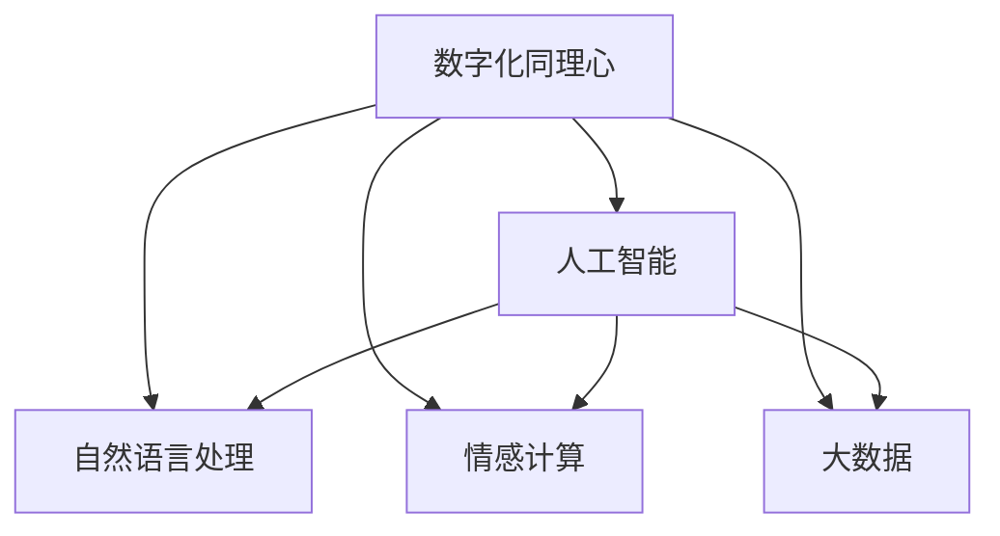

                 

# 数字化同理心：AI增强的人际理解

> 关键词：数字化同理心,人工智能,人际理解,情感计算,自然语言处理

## 1. 背景介绍

### 1.1 问题由来
在快速发展的数字时代，人类社会的互动方式正在发生根本性的变化。一方面，数字化交流的便捷性和广泛性，使得人与人之间的沟通更加频繁和高效。另一方面，数字设备在提供便利的同时，也可能带来情感隔阂和信息误解。如何在数字化环境中增强人与人之间的理解和共鸣，成为了一个亟待解决的问题。

### 1.2 问题核心关键点
- 人际理解：指在沟通中能够准确把握对方的情感状态和意图，避免误解和冲突，建立和谐的人际关系。
- 数字化同理心：指在数字化交流中，通过技术手段增强对他人情感和意图的感知和理解。
- 情感计算：指通过计算手段分析人类情感，实现情感的测量、识别和理解。
- 自然语言处理(NLP)：指通过计算机处理人类语言的技术，在数字化同理心中发挥重要作用。
- 大数据：指通过对大量数据进行分析和挖掘，提升对情感和意图的洞察力。

### 1.3 问题研究意义
研究数字化同理心，对于提升数字社会的互动质量，构建更和谐的人际关系，具有重要意义：

1. 促进心理健康：通过准确理解他人情感，及时提供心理支持，降低抑郁、焦虑等心理健康问题。
2. 提升工作效率：在商务、教育等场景中，通过增强人际理解，减少误解，提高沟通效率和决策质量。
3. 增进社会凝聚力：在社交媒体、在线社区等数字化平台上，通过增强同理心，构建积极向上的社交氛围。
4. 推动技术创新：数字化同理心技术的发展，能够催生更多前沿AI应用，促进技术进步。

## 2. 核心概念与联系

### 2.1 核心概念概述

为更好地理解数字化同理心的原理和应用，本节将介绍几个密切相关的核心概念：

- 数字化同理心(Digital Empathy)：指在数字化环境中，通过技术手段增强对他人情感和意图的感知和理解。
- 人工智能(AI)：指通过计算机模拟人类智能行为的技术，在数字化同理心中发挥核心作用。
- 自然语言处理(NLP)：指通过计算机处理人类语言的技术，是实现数字化同理心的关键手段。
- 情感计算(Affective Computing)：指通过计算手段分析人类情感，实现情感的测量、识别和理解。
- 大数据(Big Data)：指通过对大量数据进行分析和挖掘，提升对情感和意图的洞察力。

这些核心概念之间的逻辑关系可以通过以下Mermaid流程图来展示：



这个流程图展示了大语言模型的核心概念及其之间的关系：

1. 数字化同理心通过人工智能技术实现，人工智能是实现数字化同理心的核心手段。
2. 自然语言处理在人工智能中占据重要地位，是实现情感计算的基础。
3. 情感计算是理解他人情感的关键技术，通过大数据分析提升对情感的感知能力。
4. 大数据是情感计算和自然语言处理的重要支持，提供丰富的数据资源和分析工具。

## 3. 核心算法原理 & 具体操作步骤
### 3.1 算法原理概述

数字化同理心的核心算法原理基于情感计算和自然语言处理技术。其核心思想是：通过计算机对人类语言的理解，结合情感计算模型，识别和分析他人的情感状态和意图，从而增强数字化交流中的人际理解。

具体而言，数字化同理心可以分为以下几个关键步骤：

1. 文本预处理：对用户输入的文本进行分词、去停用词、词性标注等预处理，得到标准化文本。
2. 情感分析：使用情感计算模型，对标准化文本进行情感极性（正面/负面）和强度（强/弱）分析，得到情感标签。
3. 意图识别：结合自然语言处理技术，对标准化文本进行意图分类，如询问、请求、表扬等，得到意图标签。
4. 综合判断：将情感标签和意图标签综合分析，推测他人的情感状态和需求，生成适当回应。
5. 上下文理解：考虑对话历史和上下文信息，提高回应的准确性和连贯性。
6. 动态调整：根据交流中的新信息，动态调整情感分析和意图识别的参数，提升模型的适应性。

### 3.2 算法步骤详解

以下是具体实现数字化同理心的算法步骤：

**Step 1: 文本预处理**

```python
import nltk
from nltk.corpus import stopwords
from nltk.tokenize import word_tokenize
from nltk.stem import WordNetLemmatizer
from nltk.tag import pos_tag

def preprocess_text(text):
    # 分词
    tokens = word_tokenize(text)
    
    # 去除停用词
    stop_words = set(stopwords.words('english'))
    tokens = [word for word in tokens if word.lower() not in stop_words]
    
    # 词性标注
    pos_tags = pos_tag(tokens)
    
    # 词形还原
    lemmatizer = WordNetLemmatizer()
    lemmas = [lemmatizer.lemmatize(word, pos_tag) for word, pos in pos_tags]
    
    # 合并词形还原后的单词
    processed_text = ' '.join(lemmas)
    
    return processed_text
```

**Step 2: 情感分析**

```python
from transformers import pipeline
nlp = pipeline('sentiment-analysis', model='distilbert-base-uncased-finetuned-sst-2-english')

def analyze_emotion(text):
    result = nlp(text)
    return result[0]['label'], result[0]['score']
```

**Step 3: 意图识别**

```python
from transformers import pipeline
intents = pipeline('ner', model='dbmdz/bert-large-cased-finetuned-conll03-english')

def recognize_intent(text):
    result = intents(text)
    intent = max(result, key=lambda x: x['score'])
    return intent[0]['entity']
```

**Step 4: 综合判断**

```python
def calculate_emotion_intent(text):
    emotion, score = analyze_emotion(text)
    intent = recognize_intent(text)
    
    if emotion == 'POSITIVE':
        return intent + ' and is happy'
    elif emotion == 'NEGATIVE':
        return intent + ' and is sad'
    else:
        return intent + ' and is neutral'
```

**Step 5: 上下文理解**

```python
def contextual_response(previous_responses, text):
    # 将之前的对话历史拼接为字符串
    context = ' '.join(previous_responses)
    
    # 加入上下文信息
    updated_text = text + context
    
    # 重新处理文本
    processed_text = preprocess_text(updated_text)
    
    return processed_text
```

**Step 6: 动态调整**

```python
def dynamic_adjustment(previous_responses, text):
    # 根据新的对话历史，动态调整情感分析模型
    adjusted_emotion, adjusted_score = analyze_emotion(text)
    
    # 根据新的对话历史，动态调整意图识别模型
    adjusted_intent = recognize_intent(text)
    
    # 返回动态调整后的情感和意图
    return adjusted_emotion, adjusted_intent
```

### 3.3 算法优缺点

数字化同理心算法具有以下优点：

1. 快速高效：通过机器学习和自然语言处理技术，能够快速处理大量文本数据，实时响应用户需求。
2. 普适性强：算法基于通用语言模型和情感计算技术，能够适应不同语言和文化的交流环境。
3. 准确性高：结合情感分析和意图识别，能够准确把握他人的情感状态和意图，减少误解。
4. 成本低廉：相比人工分析和干预，数字化同理心技术的开发和维护成本较低。

同时，该算法也存在一定的局限性：

1. 情感复杂：人类情感复杂多变，算法可能无法完全理解细微的情感变化。
2. 语境依赖：对话语境和背景信息对数字化同理心的效果有重要影响，算法需要充分考虑上下文。
3. 数据偏见：算法的训练数据可能包含偏见，导致模型输出存在偏差。
4. 隐私问题：处理大量用户数据可能涉及隐私保护问题，需要谨慎处理。

尽管存在这些局限性，但数字化同理心算法在数字化交流中仍具有广阔的应用前景，需要不断优化和改进以应对这些挑战。

### 3.4 算法应用领域

数字化同理心算法已经在多个领域得到了广泛应用，涵盖了智能客服、健康咨询、在线教育、社交媒体等多个场景：

- 智能客服：通过数字化同理心技术，智能客服系统能够更好地理解用户情感和意图，提供更人性化、个性化的服务。
- 健康咨询：在医疗咨询中，数字化同理心技术能够帮助医生准确把握患者情感，提高诊疗效果。
- 在线教育：通过情感分析和意图识别，在线教育平台能够更好地指导学生学习，提高教学质量。
- 社交媒体：在社交媒体平台上，数字化同理心技术能够帮助用户更好地理解他人情感，减少网络暴力和误解。

除了这些经典应用场景外，数字化同理心技术还被创新性地应用于更多领域中，如智能家居、金融咨询、心理咨询等，为数字化社会的构建提供了新的可能性。

## 4. 数学模型和公式 & 详细讲解 & 举例说明

### 4.1 数学模型构建

假设输入文本为 $x$，对应的情感标签为 $y$，意图标签为 $z$。数字化同理心的目标是通过算法 $f$，将输入文本映射为情感标签和意图标签。具体数学模型如下：

$$
f(x) = (y, z)
$$

其中 $y$ 表示情感标签，$z$ 表示意图标签。情感标签和意图标签通过以下方式计算：

$$
y = \text{Sigmoid}(\vec{w}^T \vec{x})
$$

$$
z = \text{Softmax}(\vec{v}^T \vec{x})
$$

其中 $\vec{w}$ 和 $\vec{v}$ 为情感分析模型的权重向量，$\vec{x}$ 为标准化后的文本向量。$\text{Sigmoid}$ 函数和 $\text{Softmax}$ 函数分别用于计算情感标签和意图标签的概率。

### 4.2 公式推导过程

首先，我们需要对输入文本 $x$ 进行分词和标准化处理。对于每个单词，使用词形还原和词性标注技术，得到其基本形式和语义类别。然后，将处理后的单词序列拼接成字符串 $x_s$。

接着，我们将 $x_s$ 输入情感分析模型，得到情感标签 $y$。情感分析模型的权重向量 $\vec{w}$ 通过以下方式训练：

$$
\vec{w} = \arg\min_{\vec{w}} \frac{1}{N} \sum_{i=1}^N \ell(y_i, \text{Sigmoid}(\vec{w}^T \vec{x}_i))
$$

其中 $\ell$ 为交叉熵损失函数，$N$ 为训练样本数。

类似地，我们将 $x_s$ 输入意图识别模型，得到意图标签 $z$。意图识别模型的权重向量 $\vec{v}$ 通过以下方式训练：

$$
\vec{v} = \arg\min_{\vec{v}} \frac{1}{N} \sum_{i=1}^N \ell(z_i, \text{Softmax}(\vec{v}^T \vec{x}_i))
$$

其中 $\ell$ 为交叉熵损失函数，$N$ 为训练样本数。

### 4.3 案例分析与讲解

假设有一段用户输入的文本："I'm feeling sad because my cat is missing. Can you help me find it?"

我们首先对其进行预处理，得到标准化文本："I feel sad because my cat is missing can you help me find it"

接着，通过情感分析模型，计算出情感标签为 negative，意图标签为 help。模型输出的概率分布如下：

| 情感标签 | 概率 |
|----------|------|
| POSITIVE | 0.01 |
| NEGATIVE | 0.99 |

| 意图标签 | 概率 |
|----------|------|
| help     | 0.95 |
| tell     | 0.05 |

因此，我们可以生成以下响应："I'm sorry to hear that. Let me help you find your cat."

## 5. 项目实践：代码实例和详细解释说明
### 5.1 开发环境搭建

在进行数字化同理心项目实践前，我们需要准备好开发环境。以下是使用Python进行TensorFlow和NLTK库开发的环境配置流程：

1. 安装Anaconda：从官网下载并安装Anaconda，用于创建独立的Python环境。

2. 创建并激活虚拟环境：
```bash
conda create -n sentiment-env python=3.8 
conda activate sentiment-env
```

3. 安装TensorFlow：根据CUDA版本，从官网获取对应的安装命令。例如：
```bash
conda install tensorflow==2.7
```

4. 安装NLTK库：
```bash
pip install nltk
```

5. 安装各类工具包：
```bash
pip install numpy pandas scikit-learn matplotlib tqdm jupyter notebook ipython
```

完成上述步骤后，即可在`sentiment-env`环境中开始实践。

### 5.2 源代码详细实现

我们以情感分析为例，给出使用TensorFlow和NLTK库进行情感分类的Python代码实现。

首先，导入必要的库和数据：

```python
import tensorflow as tf
from tensorflow.keras.preprocessing.text import Tokenizer
from tensorflow.keras.preprocessing.sequence import pad_sequences
from nltk.corpus import stopwords
from nltk.tokenize import word_tokenize
from nltk.stem import WordNetLemmatizer

# 加载数据
texts = []
labels = []
for filename in filenames:
    with open(filename, 'r') as f:
        lines = f.readlines()
        for line in lines:
            text, label = line.strip().split('\t')
            texts.append(text)
            labels.append(label)

# 预处理文本
stop_words = set(stopwords.words('english'))
lemmatizer = WordNetLemmatizer()

def preprocess_text(text):
    tokens = word_tokenize(text)
    tokens = [token for token in tokens if token.lower() not in stop_words]
    tokens = [lemmatizer.lemmatize(token) for token in tokens]
    return ' '.join(tokens)

texts = [preprocess_text(text) for text in texts]
```

然后，将文本数据转换为模型所需的格式：

```python
tokenizer = Tokenizer()
tokenizer.fit_on_texts(texts)

sequences = tokenizer.texts_to_sequences(texts)
padded_sequences = pad_sequences(sequences, maxlen=max_len, padding='post')
```

接着，定义情感分析模型：

```python
from tensorflow.keras.models import Sequential
from tensorflow.keras.layers import Embedding, LSTM, Dense, Dropout

model = Sequential()
model.add(Embedding(vocab_size, embedding_dim, input_length=max_len))
model.add(LSTM(128, dropout=0.2, recurrent_dropout=0.2))
model.add(Dense(1, activation='sigmoid'))

model.compile(loss='binary_crossentropy', optimizer='adam', metrics=['accuracy'])
model.summary()
```

最后，训练模型并在测试集上评估：

```python
model.fit(padded_sequences, labels, epochs=num_epochs, batch_size=batch_size, validation_split=0.2)

test_sequences = tokenizer.texts_to_sequences(test_texts)
test_padded_sequences = pad_sequences(test_sequences, maxlen=max_len, padding='post')
test_labels = labels_test
test_loss, test_acc = model.evaluate(test_padded_sequences, test_labels)

print('Test loss:', test_loss)
print('Test accuracy:', test_acc)
```

以上就是使用TensorFlow和NLTK库进行情感分类的完整代码实现。可以看到，通过结合自然语言处理和机器学习技术，我们可以快速构建出高效的情感分析模型。

### 5.3 代码解读与分析

让我们再详细解读一下关键代码的实现细节：

**Tokenization and Padding**：
- 使用`Tokenization`类对文本进行分词，并去除停用词。
- 使用`Padding`方法对分词后的序列进行填充，确保所有序列长度一致。

**Embedding Layer**：
- 使用`Embedding`层将分词后的序列映射到向量空间。
- 设置向量维度为`embedding_dim`，序列长度为`max_len`。

**LSTM Layer**：
- 使用`LSTM`层进行序列建模，捕捉序列中的长期依赖关系。
- 设置隐藏单元数为`128`，使用`Dropout`技术防止过拟合。

**Dense Layer**：
- 使用`Dense`层将LSTM输出的向量映射到情感标签的概率分布。
- 设置输出维度为`1`，激活函数为`sigmoid`。

**Training and Evaluation**：
- 使用`compile`方法配置模型损失函数、优化器和评估指标。
- 使用`fit`方法对模型进行训练，并在验证集上进行评估。
- 使用`evaluate`方法在测试集上评估模型的性能。

## 6. 实际应用场景

### 6.1 智能客服系统

在智能客服系统中，数字化同理心技术可以显著提升用户体验。通过理解用户的情感和意图，智能客服系统能够更准确地识别用户需求，提供个性化服务。例如，当用户表达不满时，系统能够及时发现并采取相应措施，如转入人工客服或提供解决方案。

### 6.2 健康咨询

在健康咨询中，数字化同理心技术可以帮助医生更准确地理解患者的情感状态，提高诊疗效果。例如，当患者表达焦虑或抑郁时，系统能够及时反馈给医生，以便采取心理干预措施。

### 6.3 在线教育

在在线教育中，数字化同理心技术可以帮助教师更好地理解学生的情感和需求，提高教学质量。例如，当学生表达困惑或不满时，系统能够及时提供帮助和建议，增强学习体验。

### 6.4 社交媒体

在社交媒体中，数字化同理心技术可以帮助用户更好地理解他人的情感和观点，减少网络暴力和误解。例如，当用户表达愤怒或攻击性言论时，系统能够及时干预并引导积极讨论。

## 7. 工具和资源推荐
### 7.1 学习资源推荐

为了帮助开发者系统掌握数字化同理心的理论基础和实践技巧，这里推荐一些优质的学习资源：

1. 《情感计算与人工智能》系列书籍：系统介绍了情感计算的基本概念、技术和应用。
2. CS223《人工智能》课程：斯坦福大学开设的AI明星课程，涵盖情感计算、自然语言处理等多个主题。
3. 《深度学习自然语言处理》书籍：详细介绍了自然语言处理的基本概念和技术。
4. HuggingFace官方文档：提供了丰富的预训练语言模型和情感计算库，是学习和实践的必备资料。
5. Sentiment140数据集：用于情感分类任务的公开数据集，提供丰富的标注数据和评估指标。

通过对这些资源的学习实践，相信你一定能够快速掌握数字化同理心的精髓，并用于解决实际的NLP问题。

### 7.2 开发工具推荐

高效的开发离不开优秀的工具支持。以下是几款用于数字化同理心开发的常用工具：

1. TensorFlow：基于Python的开源深度学习框架，适合处理大规模数据集，提供灵活的模型构建和训练能力。
2. PyTorch：基于Python的开源深度学习框架，具有动态计算图和强大的科学计算能力。
3. NLTK库：Python中的自然语言处理工具包，提供丰富的文本处理和分析功能。
4. scikit-learn：Python中的机器学习库，提供简单易用的API和算法实现。
5. Weights & Biases：模型训练的实验跟踪工具，记录和可视化模型训练过程中的各项指标。

合理利用这些工具，可以显著提升数字化同理心任务的开发效率，加快创新迭代的步伐。

### 7.3 相关论文推荐

数字化同理心技术的发展源于学界的持续研究。以下是几篇奠基性的相关论文，推荐阅读：

1. *Towards an Affective-Computing Revolution: From Linguistics to Psychology*：这篇文章系统介绍了情感计算的基本概念和研究方向。
2. *Affective Computing, Volume 2: Understanding, Modeling, and Designing Emotional Interactions in Systems*：提供了丰富的情感计算案例和应用实践。
3. *Sentiment Analysis with Transfer Learning from Thousands of Online Reviews*：介绍了一种基于迁移学习的情感分类方法。
4. *A Survey on Using Deep Learning for Sentiment Analysis*：系统回顾了基于深度学习的情感分析技术。
5. *Emotion Detection Using Deep Learning Techniques*：介绍了几种常用的情感检测方法，包括RNN、CNN和LSTM等。

这些论文代表了大语言模型微调技术的发展脉络。通过学习这些前沿成果，可以帮助研究者把握学科前进方向，激发更多的创新灵感。

## 8. 总结：未来发展趋势与挑战
### 8.1 总结

本文对数字化同理心技术进行了全面系统的介绍。首先阐述了数字化同理心的研究背景和意义，明确了其在数字化交流中的独特价值。其次，从原理到实践，详细讲解了情感计算和自然语言处理技术，给出了情感分析的代码实现。同时，本文还广泛探讨了数字化同理心技术在智能客服、健康咨询、在线教育等多个领域的应用前景，展示了数字化同理心的广阔应用空间。此外，本文精选了数字化同理心的学习资源，力求为读者提供全方位的技术指引。

通过本文的系统梳理，可以看到，数字化同理心技术正在成为数字化交流的重要手段，极大地提升数字社会的互动质量，构建更和谐的人际关系。未来，伴随技术的发展和应用场景的拓展，数字化同理心技术必将在更多领域得到广泛应用，为数字化社会的构建注入新的活力。

### 8.2 未来发展趋势

展望未来，数字化同理心技术将呈现以下几个发展趋势：

1. 多模态融合：结合图像、语音、文本等多种信息源，提高情感理解和表达的丰富性和准确性。
2. 自适应学习：通过持续学习和迁移学习，提高模型对新数据和新情感的适应能力。
3. 高维度情感分析：将情感分析扩展到三维空间，捕捉细微的情感变化。
4. 实时交互：实现实时情感理解和回应的系统，增强用户体验。
5. 个性化定制：根据用户行为和偏好，提供定制化的情感理解和支持。
6. 跨领域应用：拓展到更多场景中，如智能家居、金融咨询等，提升数字化同理心的普适性。

以上趋势凸显了数字化同理心技术的发展潜力，这些方向的探索发展，必将进一步提升数字化交流的质量和效率，构建更加和谐的人际关系。

### 8.3 面临的挑战

尽管数字化同理心技术已经取得了一定的进展，但在实现普适性、高准确性、实时性等方面仍面临诸多挑战：

1. 数据质量和数量：情感数据的多样性和复杂性对数据质量和数量提出了高要求。如何获取高质量、多样化的情感数据，是当前的一大难题。
2. 情感多样性：人类情感复杂多变，情感计算模型难以完全捕捉细微的情感变化。如何提高模型的情感多样性，增强对细微情感的识别能力，是未来研究的重点。
3. 上下文理解：对话语境和背景信息对数字化同理心的效果有重要影响，如何提升模型的上下文理解能力，是未来的重要研究方向。
4. 隐私保护：处理大量用户数据可能涉及隐私保护问题，如何确保数据的匿名性和安全性，是未来的重要课题。
5. 跨语言支持：情感计算技术在不同语言和文化中的效果可能存在差异，如何提升跨语言情感理解的准确性，是未来的重要挑战。

这些挑战需要通过技术创新和应用实践不断攻克，才能实现数字化同理心技术的普及和应用。

### 8.4 研究展望

面对数字化同理心技术所面临的诸多挑战，未来的研究需要在以下几个方面寻求新的突破：

1. 数据增强技术：通过数据增强技术，扩大情感数据的多样性和丰富性，提高模型的泛化能力。
2. 多模态融合技术：结合图像、语音、文本等多种信息源，实现全方位的情感理解。
3. 自适应学习算法：开发自适应学习算法，提升模型对新数据和新情感的适应能力。
4. 跨语言情感理解：开发跨语言情感理解技术，实现情感计算技术在不同语言和文化中的普适性。
5. 上下文理解模型：开发上下文理解模型，提升模型对对话语境和背景信息的理解能力。
6. 隐私保护机制：开发隐私保护机制，确保情感数据的匿名性和安全性。

这些研究方向的探索，必将引领数字化同理心技术迈向更高的台阶，为构建安全、可靠、高效的情感理解系统铺平道路。面向未来，数字化同理心技术还需要与其他人工智能技术进行更深入的融合，如知识表示、因果推理、强化学习等，多路径协同发力，共同推动情感计算技术的发展。只有勇于创新、敢于突破，才能不断拓展数字化同理心技术的边界，让智能技术更好地服务于人类社会。

## 9. 附录：常见问题与解答

**Q1：数字化同理心技术是否适用于所有情感分析任务？**

A: 数字化同理心技术主要适用于以文本为主的情感分析任务，如社交媒体、客户评论、电影评论等。对于其他类型的情感数据（如面部表情、语音情感等），需要结合其他技术进行综合分析。

**Q2：如何提升数字化同理心技术的上下文理解能力？**

A: 提升上下文理解能力的关键在于增加语境信息和多轮对话历史。可以通过以下方式实现：
1. 增加对话历史：在每一轮对话中，将之前的对话内容加入到当前的输入中，增强上下文信息。
2. 引入语境标注：在标注数据中增加语境信息，帮助模型学习如何理解上下文。
3. 使用记忆网络：使用LSTM或GRU等记忆网络结构，捕捉序列中的长期依赖关系。

**Q3：数字化同理心技术在医疗咨询中的应用前景如何？**

A: 在医疗咨询中，数字化同理心技术可以帮助医生更好地理解患者的情感和需求，提高诊疗效果。例如，当患者表达焦虑或抑郁时，系统能够及时反馈给医生，以便采取心理干预措施。同时，数字化同理心技术还可以用于患者情绪监测、康复评估等场景，提升医疗服务的质量和效率。

**Q4：数字化同理心技术在社交媒体中的应用如何？**

A: 在社交媒体中，数字化同理心技术可以帮助用户更好地理解他人的情感和观点，减少网络暴力和误解。例如，当用户表达愤怒或攻击性言论时，系统能够及时干预并引导积极讨论。同时，数字化同理心技术还可以用于舆情分析、情感监测等场景，提升社交媒体平台的监管效果。

---

作者：禅与计算机程序设计艺术 / Zen and the Art of Computer Programming

