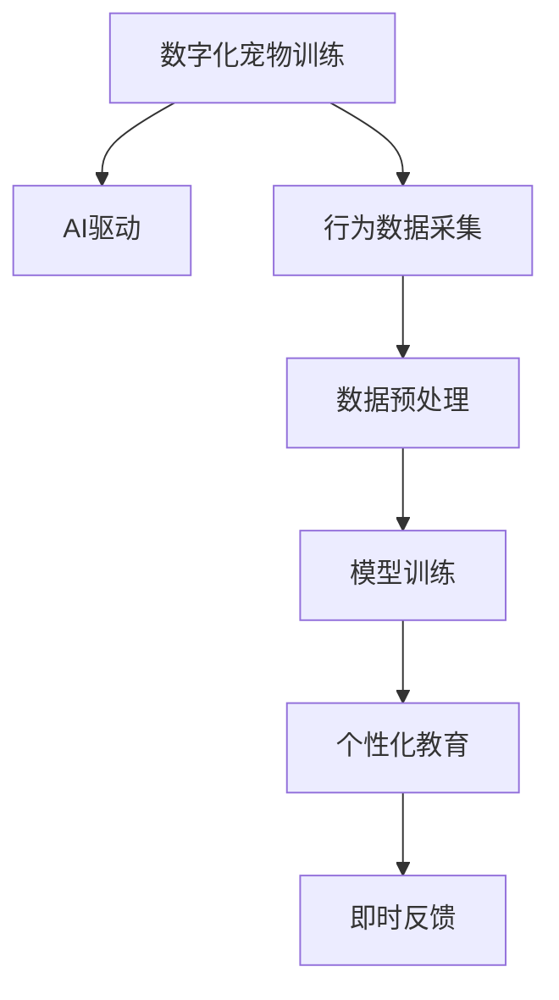

                 

## 1. 背景介绍

在数字化大潮的推动下，越来越多的传统行业正在寻求数字化转型，以适应新的市场环境。宠物教育行业也不例外。随着人们对宠物养护需求的提升，宠物教育市场正迎来爆发式增长。据统计，2021年全球宠物教育市场规模已达200亿美元，预计未来将以14%的年均复合增长率持续增长。在这样的大背景下，AI驱动的数字化宠物训练业务呈现出广阔的市场前景。

### 1.1 问题由来
数字化宠物训练业务的核心在于利用AI技术，结合宠物的行为、偏好等数据，为宠物提供个性化的训练方案和教育内容。传统宠物训练依赖于经验丰富的训练师，存在训练周期长、效果不稳定、成本高等问题。而基于AI的数字化训练平台，则能够快速、精准地为宠物提供定制化教育，大幅提升训练效果。

### 1.2 问题核心关键点
AI驱动的数字化宠物训练，核心在于以下几个关键点：

- **数据获取**：如何高效、准确地获取宠物的行为数据。
- **模型训练**：如何通过训练得到预测准确度高、泛化能力强的模型。
- **个性化教育**：如何根据不同宠物的特点，提供个性化的教育方案。
- **反馈与迭代**：如何通过即时反馈机制，调整训练方案，提升训练效果。

### 1.3 问题研究意义
数字化宠物训练的兴起，标志着宠物教育行业的数字化转型进入新阶段。利用AI技术，可以为宠物提供更加精准、个性化、高效的教育体验，提升宠物训练的科学性和可靠性。同时，数字化训练也有助于降低训练成本，扩大训练覆盖面，满足更多宠物主人的需求。

## 2. 核心概念与联系

### 2.1 核心概念概述

为更好地理解AI驱动的数字化宠物训练，本节将介绍几个密切相关的核心概念：

- **数字化宠物训练(Digital Pet Training)**：基于AI技术，通过分析宠物的行为数据，为其提供定制化的训练方案和教育内容，以实现训练目标的过程。
- **AI驱动(AI-Driven)**：指利用AI算法，尤其是深度学习模型，处理和分析宠物数据，自动生成训练方案的过程。
- **行为数据(Behavior Data)**：描述宠物行为特征的数据，如行走的轨迹、跳跃的高度、训练的反应等。
- **预测模型(Prediction Model)**：通过训练数据构建的模型，用于预测宠物的训练反应，指导训练方案的调整。
- **个性化教育(Customized Education)**：针对不同宠物的特点和需求，设计个性化的训练内容和步骤。
- **即时反馈(Real-Time Feedback)**：训练过程中，通过传感器或摄像头等设备实时获取训练数据，快速调整训练方案。

这些核心概念之间的逻辑关系可以通过以下Mermaid流程图来展示：



这个流程图展示了数字化宠物训练的核心流程：

1. 利用AI技术对宠物的行为数据进行采集、预处理。
2. 构建预测模型，通过模型训练和优化，提升预测的准确度。
3. 根据预测结果，设计个性化的教育方案。
4. 通过实时反馈机制，调整训练方案，确保训练效果。

## 3. 核心算法原理 & 具体操作步骤

### 3.1 算法原理概述

AI驱动的数字化宠物训练，本质上是利用AI模型对宠物行为数据进行处理，从而生成个性化的训练方案。其核心思想是：

1. **行为数据分析**：利用传感器、摄像头等设备获取宠物的行为数据，并进行预处理，如去噪、归一化等。
2. **模型训练**：构建预测模型，通过大量标注数据进行训练，学习宠物行为与训练反应之间的映射关系。
3. **教育方案生成**：根据预测模型的输出，生成个性化的训练方案，包括训练目标、内容、难度等。
4. **训练执行与反馈**：执行训练方案，并实时获取反馈数据，根据反馈调整训练方案，确保训练效果。

### 3.2 算法步骤详解

AI驱动的数字化宠物训练主要包括以下步骤：

**Step 1: 数据采集与预处理**

- 选择合适的传感器和摄像头设备，如加速度传感器、陀螺仪、红外传感器等，用于采集宠物的行为数据。
- 数据采集后，进行预处理，如去除异常值、归一化等，确保数据质量。

**Step 2: 模型训练**

- 选择合适的深度学习模型，如卷积神经网络（CNN）、循环神经网络（RNN）等，进行模型训练。
- 准备标注数据集，其中每条数据包含宠物的行为数据和对应的训练反应。
- 使用训练数据，通过反向传播算法进行模型训练，优化模型的参数，提高预测准确度。

**Step 3: 教育方案生成**

- 根据训练好的模型，对新采集的宠物行为数据进行预测，生成训练目标和内容。
- 结合宠物的特点和需求，设计个性化的训练方案，包括训练难度、时长、频次等。
- 生成训练方案后，制定训练计划，安排训练时间和地点。

**Step 4: 训练执行与反馈**

- 根据训练计划，执行训练方案，记录训练过程中的数据。
- 实时获取训练反馈数据，如训练结果、宠物反应等，用于调整训练方案。
- 根据反馈数据，持续优化训练方案，提升训练效果。

### 3.3 算法优缺点

AI驱动的数字化宠物训练具有以下优点：

1. **高效性**：自动生成训练方案，无需人工介入，大幅提升训练效率。
2. **个性化**：根据宠物的行为数据，生成个性化的训练方案，满足不同宠物的需求。
3. **准确性**：利用深度学习模型，提升预测准确度，确保训练目标的实现。
4. **可扩展性**：支持大规模宠物训练，覆盖更多的训练场景和需求。

同时，也存在一些局限性：

1. **数据依赖**：训练模型的效果很大程度上取决于数据的质量和数量，数据获取成本较高。
2. **模型复杂性**：深度学习模型参数较多，需要较高的计算资源和存储资源。
3. **反馈滞后**：实时反馈机制可能存在滞后，影响训练方案的及时调整。
4. **应用场景限制**：部分宠物行为难以通过传感器和摄像头采集，限制了应用的广度。

尽管存在这些局限性，AI驱动的数字化宠物训练仍是一种高效、精准的训练方式，值得进一步探索和应用。

### 3.4 算法应用领域

AI驱动的数字化宠物训练，已经在多个领域得到应用，如：

- **训练计划生成**：根据宠物的行为数据，自动生成个性化训练计划，提升训练效果。
- **行为分析与监测**：分析宠物的行为数据，监测其健康状态和行为模式，及时发现异常。
- **行为矫正与习惯养成**：通过训练方案，矫正宠物的不良行为，培养良好习惯。
- **智能互动**：结合游戏化元素，设计互动性强的训练内容，提升宠物训练的趣味性和参与度。

## 4. 数学模型和公式 & 详细讲解 & 举例说明

### 4.1 数学模型构建

在数字化宠物训练中，通常使用深度学习模型进行处理。以卷积神经网络（CNN）为例，其基本结构包括卷积层、池化层、全连接层等。数学模型构建如下：

- **输入层**：将宠物行为数据转化为向量形式，如速度、位置、姿态等。
- **卷积层**：通过卷积操作，提取行为数据中的特征。
- **池化层**：对卷积层输出的特征图进行降维，减少计算量。
- **全连接层**：将池化层输出的特征进行线性变换，生成预测结果。

### 4.2 公式推导过程

以卷积神经网络为例，其前向传播和反向传播的公式如下：

- **前向传播**：
$$
x_{1} = W_1 x_0 + b_1
$$
$$
x_{2} = W_2 x_1 + b_2
$$
$$
x_3 = W_3 x_2 + b_3
$$
其中 $W$ 和 $b$ 为卷积层和全连接层的参数，$x_0$ 为输入数据。

- **反向传播**：
$$
\frac{\partial L}{\partial W_3} = \frac{\partial L}{\partial x_3} \frac{\partial x_3}{\partial W_3} + \frac{\partial L}{\partial x_2} \frac{\partial x_2}{\partial W_3}
$$
$$
\frac{\partial L}{\partial b_3} = \frac{\partial L}{\partial x_3}
$$
$$
\frac{\partial L}{\partial W_2} = \frac{\partial L}{\partial x_2} \frac{\partial x_2}{\partial W_2} + \frac{\partial L}{\partial x_1} \frac{\partial x_1}{\partial W_2}
$$
$$
\frac{\partial L}{\partial b_2} = \frac{\partial L}{\partial x_2}
$$
$$
\frac{\partial L}{\partial W_1} = \frac{\partial L}{\partial x_1} \frac{\partial x_1}{\partial W_1} + \frac{\partial L}{\partial x_0} \frac{\partial x_0}{\partial W_1}
$$
$$
\frac{\partial L}{\partial b_1} = \frac{\partial L}{\partial x_1}
$$

其中 $L$ 为损失函数，通常使用均方误差损失函数。

### 4.3 案例分析与讲解

以一个简单的行为分类任务为例，假设有两个行为：跑步和跳跃。使用CNN模型进行训练，步骤如下：

- **数据准备**：准备标注数据集，其中每条数据包含宠物的行为数据和对应的行为标签。
- **模型构建**：设计CNN模型，包含一个卷积层、一个池化层和一个全连接层。
- **训练模型**：使用训练数据进行模型训练，最小化损失函数。
- **测试模型**：使用测试数据评估模型性能，计算准确率、召回率等指标。

## 5. 项目实践：代码实例和详细解释说明

### 5.1 开发环境搭建

在进行数字化宠物训练实践前，我们需要准备好开发环境。以下是使用Python进行TensorFlow开发的环境配置流程：

1. 安装Anaconda：从官网下载并安装Anaconda，用于创建独立的Python环境。

2. 创建并激活虚拟环境：
```bash
conda create -n pet-training python=3.8 
conda activate pet-training
```

3. 安装TensorFlow：根据CUDA版本，从官网获取对应的安装命令。例如：
```bash
conda install tensorflow tensorflow-gpu=2.6 -c pytorch -c conda-forge
```

4. 安装Keras：
```bash
conda install keras
```

5. 安装TensorBoard：
```bash
pip install tensorboard
```

6. 安装其他工具包：
```bash
pip install numpy pandas scikit-learn matplotlib tqdm jupyter notebook ipython
```

完成上述步骤后，即可在`pet-training`环境中开始数字化宠物训练实践。

### 5.2 源代码详细实现

下面我们以一个简单的行为分类任务为例，给出使用TensorFlow进行行为分类任务的PyTorch代码实现。

首先，定义行为分类任务的数据处理函数：

```python
import tensorflow as tf
from tensorflow.keras.preprocessing.image import ImageDataGenerator
from tensorflow.keras.models import Sequential
from tensorflow.keras.layers import Conv2D, MaxPooling2D, Flatten, Dense, Dropout

class BehaviorClassifier(tf.keras.Model):
    def __init__(self, input_shape):
        super(BehaviorClassifier, self).__init__()
        self.model = Sequential([
            Conv2D(32, (3, 3), activation='relu', input_shape=input_shape),
            MaxPooling2D((2, 2)),
            Conv2D(64, (3, 3), activation='relu'),
            MaxPooling2D((2, 2)),
            Flatten(),
            Dense(64, activation='relu'),
            Dropout(0.5),
            Dense(2, activation='softmax')
        ])
        
def prepare_dataset(data_dir, labels):
    train_datagen = ImageDataGenerator(rescale=1./255)
    train_generator = train_datagen.flow_from_directory(
        data_dir,
        target_size=(224, 224),
        batch_size=32,
        class_mode='categorical',
        labels=labels
    )
    return train_generator
```

然后，定义模型和优化器：

```python
from tensorflow.keras.optimizers import Adam

model = BehaviorClassifier(input_shape=(224, 224, 3))
optimizer = Adam(learning_rate=0.001)
```

接着，定义训练和评估函数：

```python
from tensorflow.keras.callbacks import EarlyStopping

def train_model(model, train_generator, val_generator, epochs):
    model.compile(optimizer=optimizer, loss='categorical_crossentropy', metrics=['accuracy'])
    early_stopping = EarlyStopping(monitor='val_loss', patience=5)
    model.fit(train_generator, epochs=epochs, validation_data=val_generator, callbacks=[early_stopping])
    
def evaluate_model(model, test_generator):
    model.evaluate(test_generator)
```

最后，启动训练流程并在测试集上评估：

```python
data_dir = 'path/to/train/data'
labels = ['running', 'jumping']

train_generator = prepare_dataset(data_dir, labels)
val_generator = prepare_dataset(data_dir, labels)
test_generator = prepare_dataset(data_dir, labels)

epochs = 20
train_model(model, train_generator, val_generator, epochs)
evaluate_model(model, test_generator)
```

以上就是使用TensorFlow进行行为分类任务的完整代码实现。可以看到，TensorFlow和Keras的组合使得模型开发和训练过程变得简洁高效。

### 5.3 代码解读与分析

让我们再详细解读一下关键代码的实现细节：

**BehaviorClassifier类**：
- `__init__`方法：初始化模型结构，包括卷积层、池化层、全连接层等。
- `model`属性：定义模型结构，使用Sequential模式搭建卷积神经网络。

**train_model函数**：
- `model.compile`方法：编译模型，指定优化器、损失函数、评估指标等。
- `EarlyStopping`回调：设置提前停止条件，避免过拟合。
- `model.fit`方法：训练模型，使用训练数据和验证数据。

**evaluate_model函数**：
- `model.evaluate`方法：评估模型性能，返回损失和准确率。

**训练流程**：
- 定义训练数据集、验证数据集和测试数据集。
- 设置训练轮数，启动训练过程。
- 在验证集上评估模型性能，提前停止训练。
- 在测试集上评估模型性能。

可以看到，TensorFlow和Keras的结合使得模型开发过程非常便捷。开发者可以将更多精力放在数据处理、模型改进等高层次逻辑上，而不必过多关注底层实现细节。

当然，实际开发过程中还需要考虑更多因素，如模型的保存和部署、超参数的自动搜索、更加灵活的任务适配层等。但核心的训练范式基本与此类似。

## 6. 实际应用场景

### 6.1 智能行为监测

基于AI驱动的数字化宠物训练，可以为宠物行为监测提供有力支持。传统的行为监测依赖于人工观察和手动记录，耗费大量人力和时间。而使用数字化宠物训练平台，可以实时监测宠物的行为数据，并自动生成监测报告。

具体而言，通过在宠物身上佩戴传感器、摄像头等设备，实时采集宠物的行为数据。然后利用训练好的预测模型，分析行为数据，识别出异常行为，并生成监测报告。这些监测报告可以供宠物主人及时查看，了解宠物的健康状况和行为模式。

### 6.2 个性化训练方案

通过数字化宠物训练，可以为每只宠物制定个性化的训练方案，提升训练效果。宠物之间存在明显的个体差异，传统训练方法难以满足不同宠物的需求。而数字化训练平台可以动态调整训练方案，根据宠物的行为数据生成个性化训练内容。

例如，对于喜欢跳跃的宠物，训练平台可以增加跳跃相关的训练内容，如跳跃高度、跳跃次数等。而对于喜欢奔跑的宠物，可以增加奔跑相关的训练内容，如跑步距离、跑步速度等。

### 6.3 行为矫正与习惯养成

数字化宠物训练平台可以为宠物提供行为矫正和习惯养成的支持。通过分析宠物的行为数据，识别出不良行为，并提供矫正方案。例如，如果宠物喜欢乱咬东西，训练平台可以提供咬合矫正训练，通过玩具、游戏等方式，逐步减少宠物的不良行为。

同时，数字化训练平台还可以提供习惯养成方案，帮助宠物养成良好的生活习惯。例如，训练平台可以设计定时进食、定时运动的训练内容，鼓励宠物形成健康的生活习惯。

## 7. 工具和资源推荐

### 7.1 学习资源推荐

为了帮助开发者系统掌握数字化宠物训练的理论基础和实践技巧，这里推荐一些优质的学习资源：

1. **TensorFlow官方文档**：TensorFlow的官方文档，提供了从入门到高级的全面教程，是学习TensorFlow的必备资源。
2. **Keras官方文档**：Keras的官方文档，提供了简单易懂的教程，适合初学者入门。
3. **《TensorFlow实战》书籍**：由Google深度学习团队编写，详细介绍了TensorFlow的使用方法和实践技巧。
4. **《深度学习入门》课程**：由Coursera开设，由吴恩达教授讲授，系统介绍了深度学习的基本概念和应用。
5. **《深度学习与Python》课程**：由Udacity开设，由吴恩达和德米斯·帕帕季莫斯讲授，介绍了深度学习的基本原理和Python实现。

通过这些资源的学习实践，相信你一定能够快速掌握数字化宠物训练的技术细节，并用于解决实际的训练问题。

### 7.2 开发工具推荐

高效的开发离不开优秀的工具支持。以下是几款用于数字化宠物训练开发的常用工具：

1. **TensorFlow**：由Google主导开发的开源深度学习框架，生产部署方便，适合大规模工程应用。提供了丰富的预训练模型和工具库，支持Keras等高层次API。
2. **Keras**：基于TensorFlow的高层次API，提供了简单易用的模型构建和训练接口，适合快速原型开发。
3. **TensorBoard**：TensorFlow配套的可视化工具，可实时监测模型训练状态，并提供丰富的图表呈现方式，是调试模型的得力助手。
4. **Jupyter Notebook**：交互式编程环境，支持Python、TensorFlow等语言，适合开发和测试过程。
5. **GitHub**：代码托管平台，支持版本控制和协作开发，方便代码管理和共享。

合理利用这些工具，可以显著提升数字化宠物训练的开发效率，加快创新迭代的步伐。

### 7.3 相关论文推荐

数字化宠物训练技术的发展源于学界的持续研究。以下是几篇奠基性的相关论文，推荐阅读：

1. **“Learning to Identify Novel Objects from Visual Data”**：提出使用深度学习模型进行图像分类任务，为行为分类任务提供了基础。
2. **“A Survey on Behavior Recognition Technologies in Smart Animal Farming”**：综述了行为识别技术在智能畜牧中的应用，为数字化宠物训练提供了理论参考。
3. **“Real-Time Object Tracking in a Domestic Environment”**：提出使用深度学习模型进行目标跟踪，为行为监测提供了技术支持。
4. **“Behavior Classification for Small Animal Training Using Deep Learning”**：提出使用深度学习模型进行行为分类，为行为矫正和习惯养成提供了技术支持。

这些论文代表了大规模动物行为识别和数字化训练技术的发展脉络。通过学习这些前沿成果，可以帮助研究者把握学科前进方向，激发更多的创新灵感。

## 8. 总结：未来发展趋势与挑战

### 8.1 总结

本文对AI驱动的数字化宠物训练方法进行了全面系统的介绍。首先阐述了数字化宠物训练的背景和意义，明确了AI技术在其中的核心作用。其次，从原理到实践，详细讲解了数字化宠物训练的数学模型、核心算法和具体操作步骤。最后，探讨了数字化宠物训练在实际应用中的场景和未来发展趋势。

通过本文的系统梳理，可以看到，AI驱动的数字化宠物训练技术正在逐步成熟，为宠物教育和行为监测提供了有力支持。未来，随着技术不断进步和市场需求的增长，数字化宠物训练必将成为宠物教育领域的重要工具，为宠物主人和宠物带来更多便利和关爱。

### 8.2 未来发展趋势

展望未来，数字化宠物训练技术将呈现以下几个发展趋势：

1. **数据智能采集**：随着传感器和摄像头技术的发展，数据采集方式将更加智能和便捷，提升数据获取效率和质量。
2. **模型轻量化**：未来将涌现更多轻量级、高效能的深度学习模型，以适应低功耗、低成本的设备环境。
3. **个性化训练**：基于AI的个性化训练将更加精准，能够满足不同宠物的需求，提升训练效果。
4. **智能互动**：结合游戏化元素和智能算法，提升宠物训练的趣味性和互动性。
5. **智能监测**：通过AI技术，实时监测宠物的行为和健康状况，及时发现异常并提醒宠物主人。
6. **多模态融合**：结合图像、声音、传感器等多种模态数据，提升行为识别的准确度和鲁棒性。

这些趋势凸显了数字化宠物训练技术的广阔前景，为宠物教育和行为监测带来了新的机遇和挑战。

### 8.3 面临的挑战

尽管数字化宠物训练技术已经取得了一定的进展，但在实际应用中仍然面临诸多挑战：

1. **数据获取成本高**：高质量的行为数据获取成本较高，难以覆盖所有宠物。
2. **模型计算量大**：深度学习模型需要较高的计算资源，对设备要求较高。
3. **隐私保护问题**：宠物行为数据的采集和处理可能涉及隐私问题，需要妥善处理。
4. **模型泛化能力不足**：不同宠物的行为模式存在差异，模型泛化能力有待提升。
5. **硬件资源限制**：低功耗、低成本的设备难以满足复杂的AI训练需求。
6. **用户体验问题**：用户界面和操作体验有待提升，用户接受度有待提高。

尽管存在这些挑战，数字化宠物训练技术的发展前景仍然广阔，相信随着技术不断成熟和市场需求的增长，这些挑战终将逐步被克服。

### 8.4 研究展望

面对数字化宠物训练所面临的挑战，未来的研究需要在以下几个方面寻求新的突破：

1. **数据高效采集**：探索自动数据采集技术和多传感器融合方法，提升数据获取效率和质量。
2. **模型高效设计**：研究轻量化、高效能的深度学习模型，降低计算资源和存储资源的消耗。
3. **隐私保护技术**：开发隐私保护算法和技术，确保宠物行为数据的安全和隐私。
4. **模型泛化能力**：引入多任务学习和迁移学习技术，提升模型的泛化能力和适应性。
5. **硬件优化**：研究低功耗、低成本的硬件设备，支持数字化宠物训练的普及应用。
6. **用户体验提升**：优化用户界面和操作体验，提升用户接受度和满意度。

这些研究方向将进一步推动数字化宠物训练技术的发展，为宠物教育和行为监测提供更高效、更便捷、更可靠的工具和解决方案。

## 9. 附录：常见问题与解答

**Q1：数字化宠物训练的训练数据如何获取？**

A: 数字化宠物训练的数据获取主要依靠传感器和摄像头等设备。常见的方式包括：
- 行为数据采集：通过加速度传感器、陀螺仪等设备，实时获取宠物的行为数据。
- 图像数据采集：通过摄像头设备，采集宠物的行为视频，进行图像处理和行为分析。
- 声音数据采集：通过麦克风设备，采集宠物的叫声和动作声音，进行声音处理和行为分析。

这些采集设备可以佩戴在宠物身上，或者部署在宠物活动的空间中，实现全天候的数据采集。

**Q2：如何选择合适的深度学习模型？**

A: 选择合适的深度学习模型需要考虑以下几个因素：
- 数据特点：根据行为数据的特征，选择适合的模型结构和层数。例如，行为分类任务可以选择卷积神经网络（CNN），行为跟踪任务可以选择循环神经网络（RNN）。
- 计算资源：根据设备计算能力，选择合适的模型大小和复杂度。例如，低功耗设备需要选择轻量级的模型。
- 数据量和质量：根据数据的数量和质量，调整模型的训练轮数和超参数。例如，数据量较少时需要调整学习率、批大小等参数。

在实际应用中，可以先选择几种常用的模型进行比较，通过实验确定最优模型。

**Q3：如何在训练过程中避免过拟合？**

A: 过拟合是训练过程中常见的问题，可以采用以下方法缓解：
- 数据增强：通过对数据进行扩充和扰动，增加训练集的多样性。例如，对视频数据进行随机裁剪、旋转、缩放等操作。
- 正则化：使用L2正则、Dropout等技术，防止模型过度拟合训练数据。例如，在全连接层后添加Dropout层，随机关闭一定比例的神经元。
- 早停策略：设置早停阈值，当模型在验证集上的性能不再提升时，停止训练。例如，当验证集上的损失函数不再下降时，停止训练。
- 模型集成：使用多个训练好的模型进行集成，提升模型的泛化能力和鲁棒性。例如，通过投票或平均的方式集成多个模型的预测结果。

这些方法可以有效提升模型的泛化能力，避免过拟合。

**Q4：如何在实际应用中提升数字化宠物训练的效果？**

A: 提升数字化宠物训练效果的方法包括：
- 数据预处理：对采集的数据进行去噪、归一化等预处理，确保数据质量。
- 模型优化：选择适合的深度学习模型，调整超参数，优化模型的性能。
- 行为识别算法：引入先进的图像处理、声音处理和行为识别算法，提升行为识别的准确度。
- 用户反馈：收集用户反馈数据，调整训练方案和行为识别算法，提升用户体验。
- 设备优化：优化设备采集和处理方式，提升数据获取效率和质量。
- 多任务学习：结合多个训练任务，提升模型的泛化能力和适应性。

通过这些方法，可以有效提升数字化宠物训练的效果，满足更多宠物主人的需求。

---

作者：禅与计算机程序设计艺术 / Zen and the Art of Computer Programming

