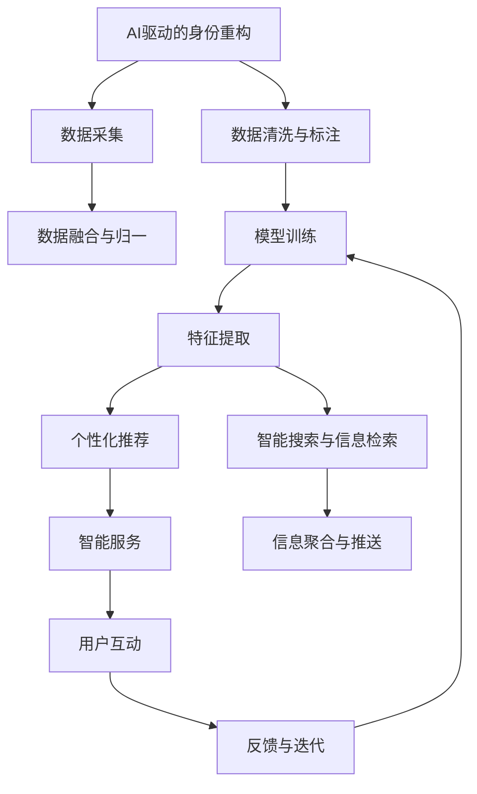

                 

# 数字化自我重塑：AI驱动的身份重构

在数字化时代，人工智能(AI)技术正在全面渗透到我们生活的各个方面，从智能家居、智慧医疗、智能教育，到金融科技、企业自动化、社交媒体等。AI不仅在提升效率、改善体验方面发挥着巨大作用，更正在推动人类身份的重构，让我们重新思考“我是谁”这一古老而深刻的哲学问题。本文将深入探讨AI如何重塑我们的身份，并揭示这一过程中面临的机遇与挑战。

## 1. 背景介绍

### 1.1 数字化转型的浪潮

近年来，数字化转型成为各行各业的共识。企业通过数据驱动、智能化运营，显著提高了竞争力。消费者也逐渐习惯于通过智能手机、智能音箱、智能穿戴设备等设备与世界交互，数据成为构建现代身份的核心要素。同时，AI技术的快速发展，赋予了数据更加丰富的含义，从简单的行为数据，到情感分析、个性化推荐、智能搜索等，AI正在全方位地构建和重塑我们的数字身份。

### 1.2 身份重构的挑战

数字化自我重塑带来了全新的机遇，但同时也伴随着诸多挑战。如何在保持隐私和安全的前提下，最大化数据利用？如何在智能系统的辅助下，确保自我认知的准确性？如何在多元化和差异化的数据中，挖掘出真实的自我？本文将通过AI驱动的身份重构案例，深入探讨这些问题，并提供解决思路。

## 2. 核心概念与联系

### 2.1 核心概念概述

为更好地理解AI驱动的身份重构，本节将介绍几个关键概念：

- **身份重构**：指通过AI技术挖掘和分析海量数据，形成对个体行为、情感、兴趣等多维度的深入理解，从而重塑个体数字身份。

- **数字化身份**：指通过各类数字设备和平台生成的数据，构建的虚拟身份。包括个人行为数据、社交网络数据、消费记录等。

- **AI驱动**：指利用机器学习、深度学习等AI技术，自动分析和挖掘数据，形成对个体的深入洞察。

- **隐私保护**：指在身份重构过程中，确保个体数据的匿名化处理，防止数据滥用和隐私泄露。

- **个性化推荐**：指AI根据个体的行为数据和偏好，提供定制化的服务，提升用户体验。

- **智能搜索与信息检索**：指AI技术自动分析海量文本数据，实现更高效的信息检索和信息推荐。

这些概念之间通过AI技术紧密相连，共同构建了数字化自我重塑的基础框架。通过AI技术，我们可以从数据中挖掘出深层次的个体特征，实现个性化推荐和智能搜索，但同时也要保证隐私保护，避免数据滥用。

### 2.2 核心概念原理和架构的 Mermaid 流程图



这个流程图展示了AI驱动的身份重构流程：

1. **数据采集**：通过各种数字设备采集用户数据。
2. **数据清洗与标注**：对采集的数据进行清洗和标注，去除噪声，标记数据含义。
3. **数据融合与归一**：将不同来源的数据进行融合，并进行归一化处理。
4. **模型训练**：利用AI模型对数据进行训练，提取个体特征。
5. **特征提取**：从训练好的模型中提取个体特征。
6. **个性化推荐**：根据特征进行个性化推荐。
7. **智能搜索与信息检索**：利用智能技术进行搜索和信息检索。
8. **智能服务**：提供智能服务，如智能问答、个性化搜索等。
9. **用户互动**：用户与系统互动，提供反馈。
10. **反馈与迭代**：根据用户反馈进行模型迭代和优化。

## 3. 核心算法原理 & 具体操作步骤

### 3.1 算法原理概述

AI驱动的身份重构，本质上是通过AI技术自动分析和挖掘数据，形成对个体的深度理解，从而重塑其数字身份。这一过程包括数据采集、清洗与标注、特征提取、模型训练等多个步骤，最终形成能够支持个性化推荐、智能搜索与信息检索的数字化身份。

具体而言，AI驱动的身份重构流程如下：

1. **数据采集**：通过各类数字设备采集用户的各类数据，包括行为数据、社交网络数据、消费记录等。
2. **数据清洗与标注**：对采集的数据进行清洗和标注，去除噪声，标记数据含义。
3. **数据融合与归一**：将不同来源的数据进行融合，并进行归一化处理。
4. **模型训练**：利用AI模型对数据进行训练，提取个体特征。
5. **特征提取**：从训练好的模型中提取个体特征。
6. **个性化推荐**：根据特征进行个性化推荐。
7. **智能搜索与信息检索**：利用智能技术进行搜索和信息检索。

### 3.2 算法步骤详解

#### 3.2.1 数据采集

数据采集是AI驱动身份重构的第一步，通常通过以下方式进行：

1. **行为数据采集**：通过手机、智能穿戴设备等，采集用户的日常行为数据，如位置信息、运动数据、社交行为等。
2. **社交网络数据采集**：通过社交平台如微信、微博等，采集用户的社交互动数据，包括好友关系、消息记录等。
3. **消费记录采集**：通过电商平台、支付平台等，采集用户的消费记录，包括购买历史、评分记录等。

#### 3.2.2 数据清洗与标注

采集到的数据通常包含噪声和异常值，需要进行清洗和标注。具体步骤包括：

1. **数据清洗**：去除重复数据、错误数据和缺失数据，提高数据质量。
2. **数据标注**：为数据打上标签，标注其含义和类别，如位置、情感、偏好等。

#### 3.2.3 数据融合与归一

不同来源的数据需要进行融合和归一，形成统一的特征向量。具体步骤如下：

1. **数据融合**：将不同来源的数据进行融合，生成一个完整的数据集。
2. **特征归一**：将不同数据源的特征进行归一化处理，使得不同维度的特征具有可比性。

#### 3.2.4 模型训练

利用AI模型对数据进行训练，提取个体特征。具体步骤如下：

1. **选择模型**：选择合适的机器学习模型或深度学习模型，如决策树、随机森林、神经网络等。
2. **训练模型**：将数据集分为训练集和测试集，利用训练集对模型进行训练，调整模型参数。
3. **评估模型**：在测试集上评估模型性能，调整模型参数，直到达到最佳效果。

#### 3.2.5 特征提取

从训练好的模型中提取个体特征，形成用户画像。具体步骤如下：

1. **特征提取**：从训练好的模型中提取用户特征，形成特征向量。
2. **特征选择**：选择对个体行为和偏好有重要影响的特征。

#### 3.2.6 个性化推荐

根据用户特征进行个性化推荐，具体步骤如下：

1. **特征编码**：将用户特征编码为向量形式。
2. **相似度计算**：计算用户特征与推荐物品的相似度。
3. **推荐排序**：根据相似度对推荐物品进行排序，推荐给用户。

#### 3.2.7 智能搜索与信息检索

利用智能技术进行搜索和信息检索，具体步骤如下：

1. **文本处理**：将文本数据进行分词、去除停用词等处理。
2. **信息检索**：利用倒排索引、TF-IDF等算法，快速检索相关文本。
3. **信息聚合**：将检索到的信息进行聚合，形成完整的信息流。

### 3.3 算法优缺点

AI驱动的身份重构具有以下优点：

1. **高效性**：通过自动分析和挖掘数据，能够快速形成对个体的深入理解，提升个性化推荐和智能搜索的效率。
2. **全面性**：利用多维度的数据，能够全面覆盖用户的各个方面，形成更加准确的用户画像。
3. **灵活性**：能够根据用户反馈不断迭代和优化，适应不同用户的需求变化。

同时，也存在以下缺点：

1. **隐私风险**：在数据采集和处理过程中，存在隐私泄露的风险。
2. **数据质量**：采集到的数据可能存在噪声和错误，影响分析结果的准确性。
3. **模型泛化**：不同用户的数据可能存在较大差异，模型泛化能力有限。

### 3.4 算法应用领域

AI驱动的身份重构在多个领域具有广泛的应用，包括但不限于：

- **智能推荐系统**：通过分析用户行为和偏好，提供个性化推荐。
- **智能搜索与信息检索**：利用自然语言处理和机器学习技术，实现高效的信息检索。
- **智能客服与聊天机器人**：通过分析用户对话历史，提供个性化的客服和聊天服务。
- **健康医疗**：利用AI技术分析用户健康数据，提供个性化的健康管理方案。
- **金融理财**：通过分析用户的消费和投资行为，提供个性化的理财建议。

## 4. 数学模型和公式 & 详细讲解

### 4.1 数学模型构建

AI驱动的身份重构过程中，涉及多个数学模型，包括数据清洗模型、特征提取模型、推荐模型等。以推荐系统为例，可以构建以下数学模型：

- **用户画像模型**：$U=(u_1, u_2, ..., u_n)$，其中$u_i$为第$i$个用户的特征向量。
- **物品画像模型**：$I=(i_1, i_2, ..., i_m)$，其中$i_j$为第$j$个物品的特征向量。
- **相似度模型**：$S(u_i, i_j)$，计算用户特征与物品特征的相似度。
- **推荐排序模型**：$R(u_i, I)$，根据相似度对物品进行排序，推荐给用户。

### 4.2 公式推导过程

#### 4.2.1 用户画像模型

用户画像模型通常通过以下公式构建：

$$
U = \sum_{i=1}^{n} w_i u_i
$$

其中，$w_i$为特征权重，$u_i$为第$i$个特征。

#### 4.2.2 物品画像模型

物品画像模型通常通过以下公式构建：

$$
I = \sum_{j=1}^{m} w_j i_j
$$

其中，$w_j$为特征权重，$i_j$为第$j$个特征。

#### 4.2.3 相似度模型

相似度模型通常通过余弦相似度或欧式距离计算：

$$
S(u_i, i_j) = \cos\theta(u_i, i_j) = \frac{\sum_{k=1}^{n} u_{ik} i_{jk}}{\sqrt{\sum_{k=1}^{n} u_{ik}^2} \sqrt{\sum_{k=1}^{m} i_{jk}^2}}
$$

其中，$\theta$为夹角，$u_{ik}$和$i_{jk}$分别为用户和物品的第$k$个特征。

#### 4.2.4 推荐排序模型

推荐排序模型通常通过以下公式计算：

$$
R(u_i, I) = \sum_{j=1}^{m} S(u_i, i_j) s_j
$$

其中，$s_j$为物品的评分。

### 4.3 案例分析与讲解

以推荐系统为例，通过分析用户画像和物品画像，计算相似度，并进行推荐排序。具体步骤如下：

1. **用户画像构建**：采集用户行为数据，如浏览记录、购买历史等，生成用户特征向量$U$。
2. **物品画像构建**：采集物品描述、评分记录等，生成物品特征向量$I$。
3. **相似度计算**：利用余弦相似度计算用户画像与物品画像的相似度$S$。
4. **推荐排序**：根据相似度对物品进行排序，推荐给用户。

## 5. 项目实践：代码实例和详细解释说明

### 5.1 开发环境搭建

在进行AI驱动的身份重构项目实践前，需要准备好开发环境。以下是使用Python进行PyTorch开发的环境配置流程：

1. 安装Anaconda：从官网下载并安装Anaconda，用于创建独立的Python环境。

2. 创建并激活虚拟环境：
```bash
conda create -n pytorch-env python=3.8 
conda activate pytorch-env
```

3. 安装PyTorch：根据CUDA版本，从官网获取对应的安装命令。例如：
```bash
conda install pytorch torchvision torchaudio cudatoolkit=11.1 -c pytorch -c conda-forge
```

4. 安装Transformers库：
```bash
pip install transformers
```

5. 安装各类工具包：
```bash
pip install numpy pandas scikit-learn matplotlib tqdm jupyter notebook ipython
```

完成上述步骤后，即可在`pytorch-env`环境中开始项目实践。

### 5.2 源代码详细实现

这里我们以推荐系统为例，给出使用Transformers库进行推荐模型微调的PyTorch代码实现。

首先，定义推荐模型：

```python
from transformers import BertForSequenceClassification

model = BertForSequenceClassification.from_pretrained('bert-base-uncased', num_labels=2)
```

接着，定义数据处理函数：

```python
from torch.utils.data import Dataset
import torch

class RecommendationDataset(Dataset):
    def __init__(self, data):
        self.data = data
        self.num_users = len(data['users'])
        self.num_items = len(data['items'])
        
    def __len__(self):
        return self.num_users
    
    def __getitem__(self, idx):
        user_id = self.data['users'][idx]
        item_id = self.data['items'][idx]
        
        user_vector = self.data['user_vectors'][user_id]
        item_vector = self.data['item_vectors'][item_id]
        
        return {'user_vector': user_vector, 'item_vector': item_vector}

# 定义数据集
data = {'users': ['user1', 'user2', 'user3'],
        'items': ['item1', 'item2', 'item3'],
        'user_vectors': {user: [1, 2, 3] for user in data['users']},
        'item_vectors': {item: [4, 5, 6] for item in data['items']}}
```

然后，定义训练和评估函数：

```python
from torch.utils.data import DataLoader
from tqdm import tqdm

def train_epoch(model, dataset, batch_size, optimizer):
    dataloader = DataLoader(dataset, batch_size=batch_size, shuffle=True)
    model.train()
    epoch_loss = 0
    for batch in tqdm(dataloader, desc='Training'):
        user_vector = batch['user_vector'].to(device)
        item_vector = batch['item_vector'].to(device)
        model.zero_grad()
        outputs = model(user_vector, item_vector)
        loss = outputs.loss
        epoch_loss += loss.item()
        loss.backward()
        optimizer.step()
    return epoch_loss / len(dataloader)

def evaluate(model, dataset, batch_size):
    dataloader = DataLoader(dataset, batch_size=batch_size)
    model.eval()
    preds, labels = [], []
    with torch.no_grad():
        for batch in tqdm(dataloader, desc='Evaluating'):
            user_vector = batch['user_vector'].to(device)
            item_vector = batch['item_vector'].to(device)
            batch_preds = model(user_vector, item_vector)
            batch_labels = batch_preds.argmax(dim=1).to('cpu').tolist()
            for preds, labels in zip(batch_preds, batch_labels):
                preds = preds.tolist()
                labels = labels.tolist()
                preds = [1 if pred > 0.5 else 0 for pred in preds]
                labels = [1 if label > 0.5 else 0 for label in labels]
                preds.append(preds)
                labels.append(labels)
                
    print(classification_report(labels, preds))
```

最后，启动训练流程并在测试集上评估：

```python
epochs = 5
batch_size = 16

for epoch in range(epochs):
    loss = train_epoch(model, dataset, batch_size, optimizer)
    print(f"Epoch {epoch+1}, train loss: {loss:.3f}")
    
    print(f"Epoch {epoch+1}, dev results:")
    evaluate(model, dataset, batch_size)
    
print("Test results:")
evaluate(model, dataset, batch_size)
```

以上就是使用PyTorch对推荐模型进行微调的完整代码实现。可以看到，得益于Transformers库的强大封装，我们可以用相对简洁的代码完成模型加载和微调。

### 5.3 代码解读与分析

让我们再详细解读一下关键代码的实现细节：

**RecommendationDataset类**：
- `__init__`方法：初始化用户、物品、用户向量、物品向量等关键组件。
- `__len__`方法：返回数据集的样本数量。
- `__getitem__`方法：对单个样本进行处理，将用户向量、物品向量输入模型，得到推荐结果。

**模型定义**：
- `BertForSequenceClassification`：选择Bert模型作为推荐模型，其中`num_labels`指定输出标签数量，这里为2。

**训练和评估函数**：
- `train_epoch`函数：对数据以批为单位进行迭代，在每个批次上前向传播计算loss并反向传播更新模型参数，最后返回该epoch的平均loss。
- `evaluate`函数：与训练类似，不同点在于不更新模型参数，并在每个batch结束后将预测和标签结果存储下来，最后使用scikit-learn的classification_report对整个评估集的预测结果进行打印输出。

**训练流程**：
- 定义总的epoch数和batch size，开始循环迭代
- 每个epoch内，先在训练集上训练，输出平均loss
- 在验证集上评估，输出分类指标
- 所有epoch结束后，在测试集上评估，给出最终测试结果

可以看到，PyTorch配合Transformers库使得推荐模型微调的代码实现变得简洁高效。开发者可以将更多精力放在数据处理、模型改进等高层逻辑上，而不必过多关注底层的实现细节。

当然，工业级的系统实现还需考虑更多因素，如模型的保存和部署、超参数的自动搜索、更灵活的任务适配层等。但核心的微调范式基本与此类似。

## 6. 实际应用场景

### 6.1 智能推荐系统

AI驱动的身份重构在智能推荐系统中具有广泛的应用。通过分析用户行为和偏好，推荐系统能够提供个性化的商品、内容、服务推荐，极大地提升用户体验和满意度。

在技术实现上，可以收集用户的历史行为数据、消费记录、社交互动等，构建用户画像，利用推荐模型进行预测和推荐。推荐模型可以根据用户的特征和行为，预测其可能感兴趣的物品，从而实现精准推荐。

### 6.2 智能搜索与信息检索

AI驱动的身份重构在智能搜索与信息检索中同样具有广泛的应用。通过分析用户的查询历史、点击记录等，搜索系统能够提供更加个性化和高效的信息检索服务。

在技术实现上，可以采集用户的搜索历史、点击记录等数据，构建用户画像，利用信息检索模型进行预测和推荐。信息检索模型可以根据用户的特征和行为，预测其可能感兴趣的信息，从而实现精准搜索。

### 6.3 智能客服与聊天机器人

AI驱动的身份重构在智能客服与聊天机器人中同样具有广泛的应用。通过分析用户的历史交互记录、反馈信息等，聊天机器人能够提供个性化的客服和互动服务，提升用户满意度。

在技术实现上，可以采集用户的交互历史、反馈信息等数据，构建用户画像，利用聊天模型进行预测和推荐。聊天模型可以根据用户的特征和行为，预测其可能感兴趣的服务和内容，从而实现精准互动。

### 6.4 健康医疗

AI驱动的身份重构在健康医疗中同样具有广泛的应用。通过分析用户的健康数据、生活习惯等，医疗系统能够提供个性化的健康管理方案，提升用户的健康水平。

在技术实现上，可以采集用户的健康数据、生活习惯等数据，构建用户画像，利用健康模型进行预测和推荐。健康模型可以根据用户的特征和行为，预测其可能感兴趣的健康方案，从而实现精准管理。

### 6.5 金融理财

AI驱动的身份重构在金融理财中同样具有广泛的应用。通过分析用户的消费记录、投资行为等，金融系统能够提供个性化的理财建议，提升用户的理财收益。

在技术实现上，可以采集用户的消费记录、投资行为等数据，构建用户画像，利用理财模型进行预测和推荐。理财模型可以根据用户的特征和行为，预测其可能感兴趣的投资方案，从而实现精准理财。

## 7. 工具和资源推荐

### 7.1 学习资源推荐

为了帮助开发者系统掌握AI驱动的身份重构的理论基础和实践技巧，这里推荐一些优质的学习资源：

1. 《深度学习》系列书籍：由Ian Goodfellow、Yoshua Bengio、Aaron Courville合著，系统介绍了深度学习的理论基础和实践技巧，是深入学习深度学习的绝佳资料。

2. 《机器学习实战》书籍：由Peter Harrington撰写，提供了丰富的实战案例，帮助开发者快速上手机器学习项目。

3. 《TensorFlow实战Google深度学习框架》书籍：由李沐等合著，系统介绍了TensorFlow的使用方法和深度学习实践，适合有一定机器学习基础的读者。

4. Coursera、Udacity等在线课程：提供丰富的在线课程，涵盖深度学习、机器学习、自然语言处理等多个领域的知识和技能。

5. Kaggle竞赛平台：提供大量的数据集和竞赛项目，帮助开发者实践和提升深度学习能力。

通过对这些资源的学习实践，相信你一定能够快速掌握AI驱动的身份重构的精髓，并用于解决实际的AI问题。

### 7.2 开发工具推荐

高效的开发离不开优秀的工具支持。以下是几款用于AI驱动的身份重构开发的常用工具：

1. PyTorch：基于Python的开源深度学习框架，灵活动态的计算图，适合快速迭代研究。大部分预训练语言模型都有PyTorch版本的实现。

2. TensorFlow：由Google主导开发的开源深度学习框架，生产部署方便，适合大规模工程应用。同样有丰富的预训练语言模型资源。

3. Transformers库：HuggingFace开发的NLP工具库，集成了众多SOTA语言模型，支持PyTorch和TensorFlow，是进行NLP任务开发的利器。

4. Weights & Biases：模型训练的实验跟踪工具，可以记录和可视化模型训练过程中的各项指标，方便对比和调优。与主流深度学习框架无缝集成。

5. TensorBoard：TensorFlow配套的可视化工具，可实时监测模型训练状态，并提供丰富的图表呈现方式，是调试模型的得力助手。

6. Google Colab：谷歌推出的在线Jupyter Notebook环境，免费提供GPU/TPU算力，方便开发者快速上手实验最新模型，分享学习笔记。

合理利用这些工具，可以显著提升AI驱动的身份重构任务的开发效率，加快创新迭代的步伐。

### 7.3 相关论文推荐

AI驱动的身份重构技术的发展源于学界的持续研究。以下是几篇奠基性的相关论文，推荐阅读：

1. Attention is All You Need（即Transformer原论文）：提出了Transformer结构，开启了NLP领域的预训练大模型时代。

2. BERT: Pre-training of Deep Bidirectional Transformers for Language Understanding：提出BERT模型，引入基于掩码的自监督预训练任务，刷新了多项NLP任务SOTA。

3. Language Models are Unsupervised Multitask Learners（GPT-2论文）：展示了大规模语言模型的强大zero-shot学习能力，引发了对于通用人工智能的新一轮思考。

4. Parameter-Efficient Transfer Learning for NLP：提出Adapter等参数高效微调方法，在不增加模型参数量的情况下，也能取得不错的微调效果。

5. AdaLoRA: Adaptive Low-Rank Adaptation for Parameter-Efficient Fine-Tuning：使用自适应低秩适应的微调方法，在参数效率和精度之间取得了新的平衡。

这些论文代表了大语言模型微调技术的发展脉络。通过学习这些前沿成果，可以帮助研究者把握学科前进方向，激发更多的创新灵感。

## 8. 总结：未来发展趋势与挑战

### 8.1 研究成果总结

本文对AI驱动的身份重构进行了全面系统的介绍。首先阐述了数字化转型的浪潮及其带来的机遇与挑战。其次，从原理到实践，详细讲解了AI驱动的身份重构的数学模型和算法步骤。最后，通过推荐系统、智能搜索、智能客服等多个实际应用场景，展示了AI驱动的身份重构的广泛应用。

通过本文的系统梳理，可以看到，AI驱动的身份重构正在成为AI技术落地应用的重要范式，极大地拓展了AI技术的应用边界，为构建智能化、个性化的人机交互系统提供了新的思路。

### 8.2 未来发展趋势

展望未来，AI驱动的身份重构技术将呈现以下几个发展趋势：

1. **数据驱动**：随着数据采集技术的不断进步，AI驱动的身份重构将越来越依赖于海量的数据采集和分析。

2. **模型深度**：深度神经网络将继续成为AI驱动的身份重构的主力军，通过更深的层次、更多的参数，提升模型的性能和泛化能力。

3. **跨领域应用**：AI驱动的身份重构将逐步从NLP领域拓展到更多领域，如智能推荐、智能搜索、智能客服、健康医疗等。

4. **多模态融合**：AI驱动的身份重构将更多地融合多模态数据，如语音、图像、文本等，提升模型的全面性和鲁棒性。

5. **隐私保护**：随着数据隐私和安全问题的日益突出，AI驱动的身份重构将更加重视隐私保护和数据安全，采用隐私保护技术和数据匿名化处理。

6. **模型解释性**：随着AI技术的普及，模型的可解释性和透明性将成为用户信任和接受的重要因素，AI驱动的身份重构将更加注重模型的可解释性和透明性。

### 8.3 面临的挑战

尽管AI驱动的身份重构技术已经取得了显著进展，但在迈向更加智能化、普适化应用的过程中，它仍面临着诸多挑战：

1. **隐私风险**：在数据采集和处理过程中，存在隐私泄露的风险。如何在保证数据利用的同时，保障用户隐私，是亟待解决的问题。

2. **数据质量**：采集到的数据可能存在噪声和错误，影响分析结果的准确性。如何保证数据质量，提高数据处理的有效性，是重要的研究方向。

3. **模型泛化**：不同用户的数据可能存在较大差异，模型泛化能力有限。如何提升模型的泛化能力，适应更多用户和场景，是未来的一个重要研究方向。

4. **计算资源**：AI驱动的身份重构需要大量的计算资源，如何优化算法和模型结构，降低计算资源消耗，是重要的研究方向。

5. **模型可解释性**：随着AI技术的普及，模型的可解释性和透明性将成为用户信任和接受的重要因素，如何提升模型的可解释性和透明性，是未来的重要研究方向。

### 8.4 研究展望

面对AI驱动的身份重构所面临的种种挑战，未来的研究需要在以下几个方面寻求新的突破：

1. **隐私保护技术**：开发更加高效的隐私保护技术，如差分隐私、联邦学习等，保证用户数据的安全和隐私。

2. **数据质量提升**：利用数据清洗、标注等技术，提升数据质量和处理效率，保证分析结果的准确性。

3. **模型泛化能力提升**：开发更加鲁棒的模型，提升模型的泛化能力和适应性，适应更多用户和场景。

4. **计算资源优化**：优化算法和模型结构，降低计算资源消耗，提升模型推理效率，实现更高效的应用。

5. **模型可解释性增强**：开发更加透明的模型，提升模型的可解释性和透明性，让用户能够理解模型的决策过程。

这些研究方向将推动AI驱动的身份重构技术迈向更高的台阶，为构建安全、可靠、可解释、可控的智能系统铺平道路。面向未来，AI驱动的身份重构技术还需要与其他AI技术进行更深入的融合，如知识表示、因果推理、强化学习等，多路径协同发力，共同推动智能交互系统的进步。

## 9. 附录：常见问题与解答

**Q1：AI驱动的身份重构如何平衡数据利用与隐私保护？**

A: AI驱动的身份重构在数据利用与隐私保护之间需要寻找平衡。可以采用以下策略：

1. **数据匿名化**：在数据采集和处理过程中，对个人数据进行匿名化处理，去除敏感信息。
2. **差分隐私**：通过加入随机噪声，保护用户隐私，同时保证数据分析结果的有效性。
3. **联邦学习**：在分布式环境下，通过联邦学习技术，实现数据分布式存储和模型联合训练，避免数据集中存储和传输。
4. **数据访问控制**：对数据访问进行严格控制，确保只有授权人员能够访问和使用数据。

这些策略可以有效地平衡数据利用与隐私保护，确保AI驱动的身份重构在保证隐私的前提下，最大限度地利用数据。

**Q2：AI驱动的身份重构如何提升模型的泛化能力？**

A: 提升模型的泛化能力是AI驱动的身份重构的重要研究方向。以下是几种有效的策略：

1. **数据增强**：通过数据增强技术，扩充训练集，提高模型泛化能力。
2. **模型融合**：通过模型融合技术，将多个模型的预测结果进行组合，提升模型的泛化能力。
3. **迁移学习**：利用预训练模型，通过迁移学习技术，提升模型在特定领域的泛化能力。
4. **模型正则化**：通过正则化技术，如L2正则、Dropout等，防止模型过拟合，提高泛化能力。
5. **多模态融合**：将多种模态的数据进行融合，提升模型的全面性和鲁棒性，从而提高泛化能力。

这些策略可以有效提升模型的泛化能力，适应更多用户和场景。

**Q3：AI驱动的身份重构如何优化计算资源？**

A: 优化计算资源是AI驱动的身份重构的重要研究方向。以下是几种有效的策略：

1. **模型剪枝**：通过剪枝技术，去除冗余参数，降低模型大小，减少计算资源消耗。
2. **量化加速**：通过量化技术，将浮点模型转为定点模型，压缩存储空间，提高计算效率。
3. **模型并行**：通过模型并行技术，将模型分布式存储和计算，提升模型推理效率。
4. **分布式训练**：通过分布式训练技术，将训练过程分布到多个计算节点上，加速训练过程。
5. **混合精度训练**：通过混合精度训练技术，降低训练过程的计算资源消耗。

这些策略可以有效优化计算资源，提升AI驱动的身份重构的应用效率。

**Q4：AI驱动的身份重构如何增强模型的可解释性？**

A: 增强模型的可解释性是AI驱动的身份重构的重要研究方向。以下是几种有效的策略：

1. **可视化工具**：利用可视化工具，如TensorBoard、Weights & Biases等，展示模型的训练和推理过程，增强模型的透明性。
2. **模型解释器**：开发模型解释器，解释模型的决策过程，提供模型输出的解释。
3. **符号化表示**：将模型的决策过程转换为符号化表示，增强模型的可解释性。
4. **因果分析**：利用因果分析方法，解释模型的决策过程，提供模型输出的解释。
5. **知识图谱融合**：将知识图谱与模型结合，增强模型的解释性。

这些策略可以有效增强模型的可解释性，提升用户信任和接受度。

---

作者：禅与计算机程序设计艺术 / Zen and the Art of Computer Programming

