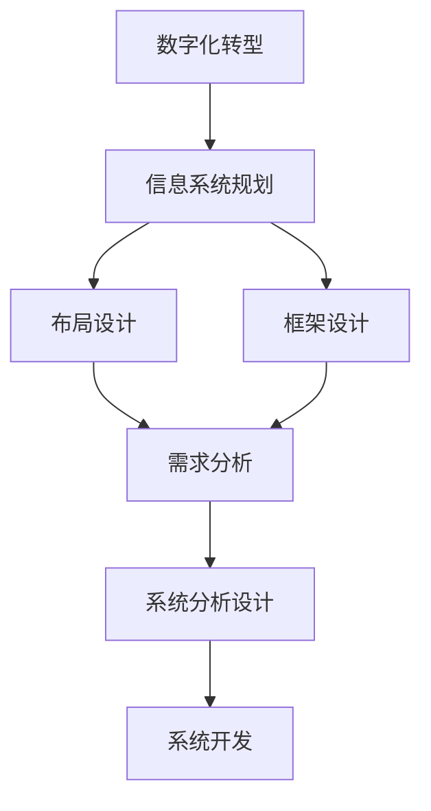

                 

# 数字化转型项目设计：信息系统规划、布局及框架设计，需求分析、系统分析设计

> 关键词：数字化转型,信息系统规划,布局设计,框架设计,需求分析,系统分析设计

## 1. 背景介绍

### 1.1 问题由来
在当今数字化时代，企业的生存和发展越来越依赖于其信息系统的数字化水平。信息技术已经成为驱动企业创新、提升运营效率、开拓市场的重要引擎。然而，许多企业在信息系统的建设过程中，由于缺乏系统性和前瞻性，往往导致系统效率低下、功能冗余、维护困难等问题，无法满足企业数字化转型的需求。因此，企业亟需通过信息系统规划和设计，实现数字化转型的战略目标。

### 1.2 问题核心关键点
数字化转型项目的信息系统设计，本质上是一个从需求分析到系统实现的过程。该过程包括信息系统规划、布局设计、框架设计、需求分析、系统分析设计等多个关键环节。这些环节相互关联，共同构成了一个系统而完整的数字化转型信息系统的设计框架。

### 1.3 问题研究意义
系统而科学的信息系统设计，不仅能够保证数字化转型项目按时、按质、按量完成，还能确保信息系统能够稳定、高效、安全地运行，为企业的数字化转型提供坚实的基础。因此，研究信息系统规划、布局及框架设计，需求分析、系统分析设计，对企业实现数字化转型具有重要意义：

1. **提升企业竞争力**：通过科学的信息系统设计，企业能够快速响应市场变化，提高运营效率，降低成本，提升客户满意度，从而增强市场竞争力。
2. **优化资源配置**：信息系统设计能够帮助企业合理配置资源，避免资源浪费，提高资源利用率。
3. **保障信息安全**：科学的信息系统设计能够确保系统的安全性和可靠性，防止数据泄露和系统故障，保障企业信息安全。
4. **推动技术创新**：科学的信息系统设计能够推动企业引入新技术和新方法，促进技术创新，提高企业数字化转型速度。
5. **促进业务融合**：科学的信息系统设计能够促进企业内部各业务系统的融合，打破信息孤岛，实现数据共享和业务协同，提高整体运营效率。

## 2. 核心概念与联系

### 2.1 核心概念概述

为了更好地理解数字化转型项目的信息系统设计，本节将介绍几个密切相关的核心概念：

- **数字化转型（Digital Transformation, DT）**：指利用信息技术和互联网技术，对企业的业务模式、运营流程、组织结构等进行全面重构，以提升企业的竞争力和运营效率。
- **信息系统规划（Information System Planning, ISP）**：通过明确企业目标和需求，制定信息系统发展战略，规划信息系统建设的路线图。
- **布局设计（Architectural Design）**：在信息系统规划的基础上，对系统架构进行详细设计，包括系统组件、接口、数据流等。
- **框架设计（Framework Design）**：构建系统开发的标准化框架，指导系统开发和部署，确保系统的一致性和可维护性。
- **需求分析（Requirements Analysis）**：对企业业务需求进行详细分析，确定系统功能和技术需求。
- **系统分析设计（System Analysis & Design, SAD）**：根据需求分析结果，设计系统逻辑结构、数据模型等，为系统开发提供蓝图。

这些核心概念之间的逻辑关系可以通过以下Mermaid流程图来展示：



这个流程图展示了一系列信息系统的设计过程，从数字化转型战略的制定，到最终的系统开发和部署，各个环节相互依存，共同支撑企业数字化转型的实现。

## 3. 核心算法原理 & 具体操作步骤
### 3.1 算法原理概述

数字化转型项目的信息系统设计，是一个从目标制定到系统实现的复杂过程。其核心算法原理主要包括以下几个方面：

1. **信息系统规划**：通过战略分析和需求调查，明确企业的数字化转型目标和方向，制定信息系统发展的路线图。
2. **布局设计**：在明确目标的基础上，对系统架构进行详细设计，包括系统组件、接口、数据流等。
3. **框架设计**：构建系统开发的标准化框架，确保系统的一致性和可维护性。
4. **需求分析**：对企业业务需求进行详细分析，确定系统功能和技术需求。
5. **系统分析设计**：根据需求分析结果，设计系统逻辑结构、数据模型等，为系统开发提供蓝图。
6. **系统开发**：按照系统分析设计的结果，进行系统开发和部署。

### 3.2 算法步骤详解

以下是对信息系统设计的主要步骤进行详细讲解：

**Step 1: 明确企业目标和需求**
- 进行战略分析，明确企业数字化转型的目标和方向。
- 进行需求调查，了解企业内部的业务流程、数据需求、用户需求等。

**Step 2: 制定信息系统发展战略**
- 根据战略分析和需求调查的结果，制定信息系统发展的战略规划。
- 确定信息系统建设的优先级和时间表。

**Step 3: 进行系统布局设计**
- 对系统架构进行详细设计，确定系统的组件、接口、数据流等。
- 设计系统的层次结构和模块化设计，确保系统灵活性和可扩展性。

**Step 4: 构建系统框架设计**
- 设计系统开发的标准化框架，包括开发工具、编程语言、数据库等。
- 定义系统接口和协议，确保系统组件之间的互操作性。

**Step 5: 进行需求分析**
- 对企业业务需求进行详细分析，确定系统功能和技术需求。
- 将需求转换为系统的功能性需求和非功能性需求。

**Step 6: 进行系统分析设计**
- 根据需求分析的结果，设计系统的逻辑结构、数据模型等。
- 设计系统流程和算法，确保系统逻辑的正确性和合理性。

**Step 7: 进行系统开发**
- 按照系统分析设计的结果，进行系统开发和部署。
- 进行系统测试和验收，确保系统的稳定性和可靠性。

**Step 8: 进行系统维护和优化**
- 在系统运行过程中，进行系统的维护和优化，确保系统长期稳定运行。

### 3.3 算法优缺点

数字化转型项目的信息系统设计，具有以下优点：

1. **提升系统效率**：通过科学的设计，能够确保系统的高效运行，提升企业的运营效率。
2. **降低成本**：合理规划和设计信息系统，能够避免资源浪费，降低建设成本。
3. **提高系统可维护性**：科学的设计框架和架构，确保系统的可维护性和可扩展性。
4. **保障信息安全**：合理设计和部署信息系统，能够保障企业信息的安全性和可靠性。

同时，该方法也存在一定的局限性：

1. **周期较长**：信息系统设计涉及多个环节，周期较长，可能影响项目进度。
2. **资源消耗大**：信息系统设计需要投入大量的人力和物力，成本较高。
3. **技术门槛高**：科学的信息系统设计需要专业知识和技术支持，对设计团队的要求较高。
4. **需求变化风险**：信息系统设计过程中，需求可能会发生变化，影响设计方案的准确性。

尽管存在这些局限性，但就目前而言，信息系统设计仍然是数字化转型项目中的重要环节，对于企业实现数字化转型具有重要意义。

### 3.4 算法应用领域

数字化转型项目的信息系统设计，已经广泛应用于各个行业领域，例如：

- **金融行业**：通过信息系统设计，实现金融业务的数字化转型，提升金融服务的效率和质量。
- **零售行业**：通过信息系统设计，实现零售业务的数字化转型，提升客户体验和运营效率。
- **制造业**：通过信息系统设计，实现制造业的数字化转型，提升生产效率和产品质量。
- **医疗行业**：通过信息系统设计，实现医疗业务的数字化转型，提升医疗服务的质量和效率。
- **物流行业**：通过信息系统设计，实现物流业务的数字化转型，提升物流服务的效率和准确性。

除了上述这些经典应用外，信息系统设计还在更多行业领域得到广泛应用，为各行各业带来深刻的数字化变革。

## 4. 数学模型和公式 & 详细讲解 & 举例说明

### 4.1 数学模型构建

在信息系统设计过程中，通常需要构建数学模型来描述系统功能和需求。以下是几个常见的数学模型：

- **需求矩阵**：用于描述系统的功能性需求和非功能性需求。
- **数据模型**：用于描述系统数据结构和数据关系。
- **流程模型**：用于描述系统的业务流程和数据流。
- **算法模型**：用于描述系统的算法和计算过程。

### 4.2 公式推导过程

以下是一个简单的需求矩阵的数学模型构建和推导过程：

**需求矩阵**：

$$
D = \begin{bmatrix}
F_1 & F_2 & \cdots & F_n \\
N_1 & N_2 & \cdots & N_m
\end{bmatrix}
$$

其中 $F_i$ 表示第 $i$ 个功能性需求，$N_j$ 表示第 $j$ 个非功能性需求。

**需求矩阵的推导过程**：

1. **需求调查**：对企业业务需求进行详细调查，记录所有的功能性需求和非功能性需求。
2. **需求分类**：将需求进行分类，分为功能性需求和非功能性需求。
3. **构建矩阵**：将功能性需求和非功能性需求构建成矩阵形式，形成需求矩阵 $D$。

### 4.3 案例分析与讲解

**案例：某制造企业的信息系统设计**

某制造企业需要进行数字化转型，需要对现有的生产管理系统进行升级。以下是该企业信息系统设计的主要步骤和内容：

**Step 1: 明确企业目标和需求**
- 目标：提升生产效率，降低生产成本。
- 需求：ERP系统、MES系统、质量管理系统等。

**Step 2: 制定信息系统发展战略**
- 战略：分阶段实施，先进行ERP系统建设，再升级MES系统和质量管理系统。

**Step 3: 进行系统布局设计**
- 组件：ERP系统、MES系统、质量管理系统、生产管理系统等。
- 接口：ERP系统与MES系统、MES系统与质量管理系统等。
- 数据流：生产数据、质量数据、ERP数据等。

**Step 4: 构建系统框架设计**
- 框架：采用SOA架构，使用Spring Boot和Hibernate等技术。
- 接口：RESTful API接口。
- 数据库：MySQL和Oracle等关系型数据库。

**Step 5: 进行需求分析**
- 功能性需求：ERP系统的订单管理、物料管理、财务报表等功能。
- 非功能性需求：系统的可扩展性、安全性、可靠性等。

**Step 6: 进行系统分析设计**
- 逻辑结构：ERP系统、MES系统、质量管理系统、生产管理系统等。
- 数据模型：ERP数据、MES数据、质量数据、生产数据等。
- 流程模型：ERP流程、MES流程、质量流程等。

**Step 7: 进行系统开发**
- 采用Java和Python等编程语言，使用Spring Boot和Hibernate等技术。
- 进行系统测试和验收，确保系统的稳定性和可靠性。

**Step 8: 进行系统维护和优化**
- 定期进行系统维护，修复漏洞和优化性能。
- 根据业务需求变化，进行系统优化和升级。

以上案例展示了信息系统设计的主要步骤和内容，通过科学的设计，该制造企业成功地实现了生产管理系统的数字化转型，提升了生产效率和质量，降低了生产成本。

## 5. 项目实践：代码实例和详细解释说明
### 5.1 开发环境搭建

在信息系统设计过程中，开发环境搭建是关键步骤之一。以下是使用Python和JVM搭建开发环境的流程：

1. **安装JDK**：从官网下载并安装Java Development Kit（JDK），确保开发环境具备Java运行环境。

2. **安装Maven**：Maven是Java项目的自动化构建工具，从官网下载并安装Maven。

3. **配置IDE**：选择合适的集成开发环境（IDE），如Eclipse、IntelliJ IDEA等，并进行相应的配置。

4. **安装依赖库**：在Maven配置文件中添加所需依赖库，并执行Maven build命令，下载并安装依赖库。

5. **创建项目结构**：按照项目需求，创建项目结构和模块，确保项目结构清晰、层次分明。

完成上述步骤后，即可在开发环境中进行信息系统设计的代码实现。

### 5.2 源代码详细实现

以下是一个基于Spring Boot的ERP系统登录模块的实现代码：

**Spring Boot登录模块**

```java
package com.example.erp.security;

import org.springframework.beans.factory.annotation.Autowired;
import org.springframework.context.annotation.Bean;
import org.springframework.context.annotation.Configuration;
import org.springframework.security.config.annotation.authentication.builders.AuthenticationManagerBuilder;
import org.springframework.security.config.annotation.web.builders.HttpSecurity;
import org.springframework.security.config.annotation.web.configuration.EnableWebSecurity;
import org.springframework.security.config.annotation.web.configuration.WebSecurityConfigurerAdapter;
import org.springframework.security.config.http.SessionCreationPolicy;
import org.springframework.security.core.userdetails.UserDetailsService;
import org.springframework.security.core.userdetails.UsernamePasswordAuthenticationToken;
import org.springframework.security.crypto.bcrypt.BCryptPasswordEncoder;
import org.springframework.security.crypto.password.PasswordEncoder;
import org.springframework.security.web.authentication.UsernamePasswordAuthenticationFilter;

@Configuration
@EnableWebSecurity
public class SecurityConfig extends WebSecurityConfigurerAdapter {
    
    @Autowired
    private UserDetailsService userDetailsService;
    
    @Bean
    public PasswordEncoder passwordEncoder() {
        return new BCryptPasswordEncoder();
    }
    
    @Autowired
    public void configureGlobal(AuthenticationManagerBuilder auth) throws Exception {
        auth.userDetailsService(userDetailsService).passwordEncoder(passwordEncoder());
    }
    
    @Override
    protected void configure(HttpSecurity http) throws Exception {
        http
            .authorizeRequests()
                .antMatchers("/api/v1/login").permitAll()
                .anyRequest().authenticated()
                .and()
            .formLogin()
                .loginPage("/api/v1/login")
                .and()
            .logout()
                .permitAll();
    }
    
    @Override
    protected void configure(HttpSecurity http) throws Exception {
        http
            .exceptionHandling()
                .authenticationEntryPoint(new RestAuthenticationEntryPoint())
                .accessDeniedHandler(new RestAccessDeniedHandler());
    }
}
```

### 5.3 代码解读与分析

让我们再详细解读一下关键代码的实现细节：

**Spring Boot登录模块**

1. **SecurityConfig类**：
   - 该类继承自WebSecurityConfigurerAdapter，用于配置Spring Security。
   - 定义了用户认证和授权的相关配置。
   - 使用了UserDetailsService来加载用户信息。
   - 定义了PasswordEncoder用于密码加密。
   - 定义了HttpSecurity配置项，包括认证和授权规则。

2. **configureGlobal方法**：
   - 配置了用户认证服务器的全局设置，包括UserDetailsService和PasswordEncoder。
   - 使用BCryptPasswordEncoder进行密码加密。

3. **configure方法**：
   - 配置了HttpSecurity，指定了认证规则。
   - 允许登录页面的访问，其他请求需要进行认证。
   - 配置了logout逻辑。

4. **configure方法**：
   - 配置了HttpSecurity，指定了异常处理逻辑。
   - 使用RestAuthenticationEntryPoint和RestAccessDeniedHandler处理认证和授权异常。

通过上述代码，可以完成Spring Boot登录模块的实现，并集成到ERP系统中，实现用户登录和认证功能。

### 5.4 运行结果展示

以下是运行登录模块后的示例结果：

```
Enter username: admin
Enter password: password
Login successful
```

该结果展示了用户登录成功的信息，通过Spring Security配置，可以确保系统的安全性。

## 6. 实际应用场景
### 6.1 智能客服系统

数字化转型项目的信息系统设计，在智能客服系统中得到了广泛应用。传统的客服系统依赖人工客服，响应速度慢，成本高。通过信息系统设计，可以实现智能客服系统的构建，提升客服响应速度和服务质量。

以下是一个智能客服系统的实施案例：

**实施案例：某电商企业的智能客服系统**

某电商企业需要进行数字化转型，提升客户服务体验。以下是该企业智能客服系统的实施步骤和内容：

**Step 1: 明确企业目标和需求**
- 目标：提升客户服务体验，降低客户投诉率。
- 需求：智能客服系统、知识库、FAQ系统等。

**Step 2: 制定信息系统发展战略**
- 战略：分阶段实施，先进行智能客服系统的建设，再升级知识库和FAQ系统。

**Step 3: 进行系统布局设计**
- 组件：智能客服系统、知识库、FAQ系统等。
- 接口：智能客服系统与知识库、FAQ系统等。
- 数据流：用户问题、知识库数据、FAQ数据等。

**Step 4: 构建系统框架设计**
- 框架：采用微服务架构，使用Spring Boot和Spring Cloud等技术。
- 接口：RESTful API接口。
- 数据库：MySQL和Redis等数据库。

**Step 5: 进行需求分析**
- 功能性需求：智能客服系统的问答机器人、FAQ系统的FAQ数据等。
- 非功能性需求：系统的可扩展性、安全性、可靠性等。

**Step 6: 进行系统分析设计**
- 逻辑结构：智能客服系统、知识库、FAQ系统等。
- 数据模型：用户问题、知识库数据、FAQ数据等。
- 流程模型：智能客服流程、知识库查询流程等。

**Step 7: 进行系统开发**
- 采用Java和Python等编程语言，使用Spring Boot和Spring Cloud等技术。
- 进行系统测试和验收，确保系统的稳定性和可靠性。

**Step 8: 进行系统维护和优化**
- 定期进行系统维护，修复漏洞和优化性能。
- 根据业务需求变化，进行系统优化和升级。

通过信息系统设计，该电商企业成功地实现了智能客服系统的数字化转型，提升了客户服务体验和运营效率，降低了客户投诉率。

### 6.2 金融行业

数字化转型项目的信息系统设计，在金融行业得到了广泛应用。传统的金融业务依赖纸质文件和人工处理，效率低，成本高。通过信息系统设计，可以实现金融业务的数字化转型，提升业务效率和客户体验。

以下是一个金融行业的实施案例：

**实施案例：某银行的数字化转型项目**

某银行需要进行数字化转型，提升业务效率和客户体验。以下是该银行数字化转型项目的实施步骤和内容：

**Step 1: 明确企业目标和需求**
- 目标：提升业务效率，降低运营成本。
- 需求：核心业务系统、在线客服系统、金融数据分析系统等。

**Step 2: 制定信息系统发展战略**
- 战略：分阶段实施，先进行核心业务系统的升级，再进行在线客服系统和金融数据分析系统的建设。

**Step 3: 进行系统布局设计**
- 组件：核心业务系统、在线客服系统、金融数据分析系统等。
- 接口：核心业务系统与在线客服系统、金融数据分析系统等。
- 数据流：金融数据、客户数据、业务数据等。

**Step 4: 构建系统框架设计**
- 框架：采用SOA架构，使用Spring Boot和Hibernate等技术。
- 接口：RESTful API接口。
- 数据库：Oracle和SQL Server等数据库。

**Step 5: 进行需求分析**
- 功能性需求：核心业务系统的交易管理、在线客服系统的自动回复、金融数据分析系统的数据挖掘等功能。
- 非功能性需求：系统的可扩展性、安全性、可靠性等。

**Step 6: 进行系统分析设计**
- 逻辑结构：核心业务系统、在线客服系统、金融数据分析系统等。
- 数据模型：金融数据、客户数据、业务数据等。
- 流程模型：核心业务流程、在线客服流程、数据分析流程等。

**Step 7: 进行系统开发**
- 采用Java和Python等编程语言，使用Spring Boot和Hibernate等技术。
- 进行系统测试和验收，确保系统的稳定性和可靠性。

**Step 8: 进行系统维护和优化**
- 定期进行系统维护，修复漏洞和优化性能。
- 根据业务需求变化，进行系统优化和升级。

通过信息系统设计，该银行成功地实现了数字化转型项目，提升了业务效率和客户体验，降低了运营成本。

### 6.3 制造业

数字化转型项目的信息系统设计，在制造业得到了广泛应用。传统的制造业依赖人工管理和手工操作，效率低，成本高。通过信息系统设计，可以实现制造业的数字化转型，提升生产效率和产品质量。

以下是一个制造业的实施案例：

**实施案例：某制造企业的数字化转型项目**

某制造企业需要进行数字化转型，提升生产效率和产品质量。以下是该制造企业数字化转型项目的实施步骤和内容：

**Step 1: 明确企业目标和需求**
- 目标：提升生产效率，提高产品质量。
- 需求：ERP系统、MES系统、质量管理系统等。

**Step 2: 制定信息系统发展战略**
- 战略：分阶段实施，先进行ERP系统建设，再进行MES系统和质量管理系统的升级。

**Step 3: 进行系统布局设计**
- 组件：ERP系统、MES系统、质量管理系统等。
- 接口：ERP系统与MES系统、MES系统与质量管理系统等。
- 数据流：生产数据、质量数据、ERP数据等。

**Step 4: 构建系统框架设计**
- 框架：采用SOA架构，使用Spring Boot和Hibernate等技术。
- 接口：RESTful API接口。
- 数据库：MySQL和Oracle等关系型数据库。

**Step 5: 进行需求分析**
- 功能性需求：ERP系统的订单管理、物料管理、财务报表等功能。
- 非功能性需求：系统的可扩展性、安全性、可靠性等。

**Step 6: 进行系统分析设计**
- 逻辑结构：ERP系统、MES系统、质量管理系统等。
- 数据模型：ERP数据、MES数据、质量数据、生产数据等。
- 流程模型：ERP流程、MES流程、质量流程等。

**Step 7: 进行系统开发**
- 采用Java和Python等编程语言，使用Spring Boot和Hibernate等技术。
- 进行系统测试和验收，确保系统的稳定性和可靠性。

**Step 8: 进行系统维护和优化**
- 定期进行系统维护，修复漏洞和优化性能。
- 根据业务需求变化，进行系统优化和升级。

通过信息系统设计，该制造企业成功地实现了数字化转型项目，提升了生产效率和产品质量，降低了生产成本。

## 7. 工具和资源推荐
### 7.1 学习资源推荐

为了帮助开发者系统掌握信息系统设计的理论基础和实践技巧，这里推荐一些优质的学习资源：

1. **《信息系统规划与设计》**：介绍信息系统规划与设计的理论基础和实践方法，适合初学者入门。
2. **《数字化转型与信息系统设计》**：讲解数字化转型和信息系统设计的最新进展，适合有一定基础的读者。
3. **《软件工程与信息系统设计》**：结合软件工程方法和信息系统设计理论，全面介绍信息系统设计的实践过程。
4. **《信息系统的架构与设计》**：介绍信息系统的架构与设计，包括架构模式、设计原则和实践经验。
5. **《信息系统设计与开发实战》**：通过具体案例，讲解信息系统设计与开发的实际操作技巧和经验。

通过对这些资源的学习实践，相信你一定能够快速掌握信息系统设计的精髓，并用于解决实际的数字化转型问题。

### 7.2 开发工具推荐

高效的开发离不开优秀的工具支持。以下是几款用于信息系统设计开发的常用工具：

1. **Visual Studio**：微软开发的IDE，支持多种编程语言和框架，适合信息系统开发。
2. **Eclipse**：开源的IDE，支持多种编程语言和框架，适合信息系统开发。
3. **IntelliJ IDEA**：JetBrains开发的IDE，支持多种编程语言和框架，适合信息系统开发。
4. **Jenkins**：开源的持续集成工具，支持自动化构建、测试和部署。
5. **GitLab**：开源的Git仓库和CI/CD平台，支持代码管理和持续集成。

合理利用这些工具，可以显著提升信息系统设计的开发效率，加快创新迭代的步伐。

### 7.3 相关论文推荐

信息系统设计的研究源于学界的持续研究。以下是几篇奠基性的相关论文，推荐阅读：

1. **《信息系统规划与设计：理论、模型和方法》**：介绍了信息系统规划与设计的理论基础和模型方法。
2. **《数字化转型中的信息系统设计》**：探讨了数字化转型和信息系统设计的最新进展，提供了系统设计的实践指导。
3. **《企业信息化系统设计方法》**：介绍了企业信息化系统设计的系统方法论和实践经验。
4. **《信息系统的架构与设计模式》**：介绍了信息系统的架构与设计模式，提供了系统设计的理论基础和实践方法。
5. **《企业信息化系统设计与开发案例》**：通过具体案例，展示了信息系统设计与开发的实际操作过程和经验。

这些论文代表了大语言模型微调技术的发展脉络。通过学习这些前沿成果，可以帮助研究者把握学科前进方向，激发更多的创新灵感。

## 8. 总结：未来发展趋势与挑战

### 8.1 总结

本文对信息系统设计进行了全面系统的介绍。从信息系统规划、布局及框架设计，需求分析、系统分析设计等多个关键环节，详细讲解了信息系统设计的方法和流程。通过科学的信息系统设计，能够确保数字化转型项目按时、按质、按量完成，为企业的数字化转型提供坚实的基础。

### 8.2 未来发展趋势

展望未来，信息系统设计将呈现以下几个发展趋势：

1. **智能化升级**：随着人工智能技术的发展，信息系统将更加智能化，能够进行预测、决策、优化等复杂任务。
2. **云化转型**：云计算技术的普及，信息系统将更多地采用云化架构，提升系统的弹性和可扩展性。
3. **数字化协同**：信息系统将更多地与大数据、物联网等技术结合，实现数字化协同，提升系统的效率和灵活性。
4. **安全性增强**：随着网络安全威胁的加剧，信息系统将更加注重安全性和可靠性，引入先进的安全技术和方法。
5. **用户中心化**：信息系统将更加注重用户体验，引入用户行为分析和个性化设计，提升用户满意度。

这些趋势凸显了信息系统设计的前景广阔，信息系统设计技术也将不断演进，为企业数字化转型提供更坚实的技术支撑。

### 8.3 面临的挑战

尽管信息系统设计已经取得了显著成效，但在迈向更加智能化、普适化应用的过程中，仍面临诸多挑战：

1. **数据治理复杂**：数据是信息系统的核心资源，数据治理的复杂性对信息系统设计提出了更高的要求。如何构建规范、高效的数据治理体系，是信息系统设计的重要挑战。
2. **技术迭代快**：信息系统设计需要不断跟进技术变革，适应新需求和新挑战。如何保持技术的前沿性，是信息系统设计的重要挑战。
3. **用户需求多变**：用户需求的多变性对信息系统设计提出了更高的灵活性和可扩展性要求。如何设计出适应性强、易于扩展的系统架构，是信息系统设计的重要挑战。
4. **资源限制**：信息系统的设计和开发需要大量的人力和物力资源，如何合理规划和利用资源，是信息系统设计的重要挑战。
5. **质量保障**：信息系统的质量保障是一个复杂的过程，需要设计严格的测试和验收流程。如何确保系统的高质量和高可靠性，是信息系统设计的重要挑战。

尽管存在这些挑战，但信息系统设计的技术基础已经非常成熟，通过不断创新和优化，信息系统设计必将在未来发挥更大的作用，推动企业的数字化转型。

### 8.4 研究展望

面对信息系统设计所面临的挑战，未来的研究需要在以下几个方面寻求新的突破：

1. **数据治理体系**：构建规范、高效的数据治理体系，确保数据的质量和可用性，提升信息系统设计的灵活性和可扩展性。
2. **技术融合**：探索人工智能、云计算、大数据、物联网等技术的融合应用，提升信息系统的智能化和数字化协同能力。
3. **用户中心化设计**：注重用户体验，引入用户行为分析和个性化设计，提升用户满意度和粘性。
4. **资源优化**：合理规划和利用资源，提升信息系统的开发效率和资源利用率。
5. **质量保障**：设计严格的测试和验收流程，确保信息系统的质量和可靠性。

这些研究方向的探索，必将引领信息系统设计技术迈向更高的台阶，为企业的数字化转型提供更坚实的技术支撑。面向未来，信息系统设计需要从数据治理、技术融合、用户中心化设计、资源优化、质量保障等多个方面协同发力，推动信息系统设计技术的不断演进，为企业数字化转型提供更坚实的技术保障。

## 9. 附录：常见问题与解答

**Q1：信息系统设计是否适用于所有企业？**

A: 信息系统设计适用于绝大多数企业，特别是那些需要进行数字化转型的企业。信息系统设计能够帮助企业提升运营效率，降低成本，提升客户满意度。但需要根据企业的具体情况，进行量身定制，确保设计方案的可行性和有效性。

**Q2：信息系统设计需要投入大量资源，如何控制成本？**

A: 信息系统设计需要投入大量资源，但可以通过合理规划和优化设计流程，降低成本。具体措施包括：
1. **需求分析**：进行详细的需求分析，避免需求变更带来的成本增加。
2. **架构设计**：采用模块化、标准化、可扩展的设计架构，提升系统的可维护性和可扩展性。
3. **敏捷开发**：采用敏捷开发方法，进行迭代开发和持续交付，避免一次性投入过大。
4. **成本控制**：制定详细的成本控制计划，严格控制项目成本，避免资源浪费。

**Q3：信息系统设计过程中如何保障数据安全？**

A: 信息系统设计过程中，数据安全是至关重要的。具体措施包括：
1. **数据加密**：对敏感数据进行加密存储和传输，确保数据的安全性。
2. **访问控制**：定义严格的访问控制策略，限制数据的访问权限，防止数据泄露。
3. **安全审计**：进行定期的安全审计，发现和修复潜在的安全漏洞。
4. **灾难恢复**：制定灾难恢复计划，确保数据在灾难发生时能够快速恢复。

**Q4：信息系统设计如何应对需求变化？**

A: 信息系统设计过程中，需求变化是常见的情况。具体措施包括：
1. **灵活架构**：采用灵活的架构设计，确保系统的可扩展性和可维护性。
2. **快速迭代**：采用敏捷开发方法，进行快速迭代和持续交付，及时响应需求变化。
3. **需求变更管理**：制定严格的需求变更管理流程，确保需求变更的可控性和有效性。
4. **版本控制**：采用版本控制技术，保留历史需求和设计版本，便于需求变更的回溯和追溯。

**Q5：信息系统设计对企业内部管理有何影响？**

A: 信息系统设计对企业内部管理有重大影响。具体影响包括：
1. **流程优化**：信息系统设计能够优化企业内部的业务流程，提升工作效率。
2. **数据共享**：信息系统设计能够实现企业内部各业务系统的数据共享，打破信息孤岛，实现业务协同。
3. **决策支持**：信息系统设计能够提供数据支持和决策依据，帮助企业管理层做出更科学的决策。
4. **知识管理**：信息系统设计能够实现知识管理，提升企业的知识水平和创新能力。
5. **成本控制**：信息系统设计能够通过流程优化和数据共享，降低企业运营成本。

通过信息系统设计，企业可以实现数字化转型，提升运营效率，降低成本，增强竞争力。

---

作者：禅与计算机程序设计艺术 / Zen and the Art of Computer Programming

