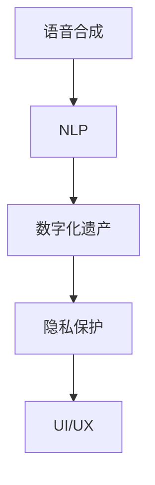

                 

# 数字化遗产回忆创业：AI重现逝者音容

数字化遗产，是人类在虚拟世界中的记忆和足迹，对个体和集体都具有重要的文化价值和社会意义。通过人工智能技术，尤其是语音合成和自然语言处理技术，我们可以让逝者“重现音容”，将他们的声音、思想和记忆永久保存下来，供后人学习和传承。本文将深入探讨这一创新创业项目的技术实现，包括核心概念、算法原理、项目实践和未来展望。

## 1. 背景介绍

### 1.1 问题由来

随着互联网和数字技术的发展，人类的信息足迹越来越多地存储在虚拟世界。然而，这些数据往往分散在不同的平台和设备上，难以统一管理和利用。加之时间流逝，存储设备和数据格式可能老化损坏，使得数字遗产面临极大的损失风险。与此同时，个人对数字遗产的保护意识和能力相对薄弱，往往忽视了其潜在的价值和意义。

数字化遗产回忆创业项目，旨在通过人工智能技术，尤其是语音合成和自然语言处理技术，将逝者的声音和文字转化为永久可访问的数字遗产。该项目的核心思想是，让过去的时间重新流淌，让逝者的智慧和精神永恒不灭。

### 1.2 问题核心关键点

该项目的关键在于，如何高效地将人类语言转化为数字形式，并使之在多个平台上永久存储和播放。这要求我们不仅需要开发强大的自然语言处理算法，还需设计便捷易用的用户界面，以及保障数据安全和隐私的技术手段。

项目的技术实现分为几个关键环节：数据收集和整理、语音合成和自然语言处理、数字遗产管理和应用、用户体验设计和开发等。每个环节都需要跨领域的协同合作，才能实现技术和人文的完美结合。

## 2. 核心概念与联系

### 2.1 核心概念概述

为更好地理解该项目的技术实现，本节将介绍几个密切相关的核心概念：

- 语音合成(Voice Synthesis)：指将文本转换为自然语音输出的技术。常见的技术包括文本到语音(TTS)、语音到文本(ASR)等。
- 自然语言处理(Natural Language Processing, NLP)：涉及文本分析、语义理解、情感分析等，是语音合成和数字化遗产管理的重要支撑技术。
- 数字遗产(Digital Heritage)：指人类在虚拟世界中的记忆和足迹，包括文字、图片、音频、视频等多种形式。
- 隐私保护(Privacy Protection)：确保数字化遗产的安全存储和合法访问，防止数据泄露和滥用。
- 用户界面(UI/UX)：设计简洁友好的用户界面，使用户能够轻松上传和分享数字化遗产，并提供便捷的访问和播放功能。

这些核心概念之间的逻辑关系可以通过以下Mermaid流程图来展示：



这个流程图展示了大语言模型的核心概念及其之间的关系：语音合成和自然语言处理共同完成文本到语音的转换；数字化遗产管理确保数据的永久存储和访问；隐私保护技术保障数据安全；用户界面则提供便捷的交互方式。这些概念共同构成了数字化遗产回忆创业项目的技术基础。

## 3. 核心算法原理 & 具体操作步骤

### 3.1 算法原理概述

该项目的技术核心是语音合成和自然语言处理。语音合成技术通过将文本转换为语音信号，使得语音遗产得以在多个平台上播放。而自然语言处理则负责分析和理解文本内容，提取关键信息和情感倾向，为语音合成提供输入。

具体而言，项目的实现流程如下：

1. 数据收集和整理：从各类平台和设备上收集逝者的声音和文字记录，进行格式转换和数据清洗，确保数据质量和完整性。
2. 语音合成：利用文本到语音技术，将清洗后的文本转换为自然流畅的语音信号。
3. 自然语言处理：使用NLP技术，对文本进行情感分析、主题提取、实体识别等处理，帮助用户更好地理解逝者的一生和贡献。
4. 数字化遗产管理：设计数据存储架构，确保数字化遗产的永久保存和易用性。
5. UI/UX设计：提供简洁友好的用户界面，使用户能够轻松上传和分享数字化遗产，并提供便捷的访问和播放功能。

### 3.2 算法步骤详解

#### 3.2.1 数据收集和整理

数据收集是数字化遗产回忆创业项目的基础。项目需要从多个平台和设备上收集逝者的声音和文字记录。这些数据可能散乱在不同的格式和存储介质上，因此需要进行格式转换和数据清洗，以确保数据质量和完整性。

**步骤1：平台设备收集**
- 收集遗留的音频、视频、图片等数字化遗产。
- 将收集到的数据统一转换为标准格式，如MP3、WAV、JPG等。

**步骤2：数据清洗**
- 去除不必要的数据，如噪音、重复片段等。
- 修正格式错误，如缺失的元数据、不一致的时间戳等。

#### 3.2.2 语音合成

语音合成是将文本转换为语音信号的技术，是数字化遗产回忆创业项目的核心。该项目利用文本到语音(TTS)技术，将逝者的文字记录转换为自然流畅的语音信号，使声音遗产得以永久保存和播放。

**步骤1：选择TTS模型**
- 选择适合的TTS模型，如Google的WaveNet、Microsoft的Hannan、IBM的Watson Text to Speech等。
- 根据需求调整TTS模型的参数，如音色、语速、音量等。

**步骤2：文本到语音转换**
- 将清洗后的文本输入TTS模型，获取语音信号。
- 对生成的语音进行后处理，如去噪、增益调节、回声消除等。

#### 3.2.3 自然语言处理

自然语言处理(NLP)是语音合成和数字化遗产管理的重要支撑技术。通过NLP技术，项目可以分析文本内容，提取关键信息和情感倾向，帮助用户更好地理解逝者的一生和贡献。

**步骤1：文本分析**
- 使用NLP技术，对文本进行情感分析、主题提取、实体识别等处理。
- 利用情感分析技术，评估文本的情感倾向，帮助用户更好地理解逝者的内心世界。

**步骤2：主题提取**
- 利用NLP技术，从文本中提取出主要主题和关键词。
- 通过可视化图表，帮助用户直观了解逝者的一生和贡献。

#### 3.2.4 数字化遗产管理

数字化遗产管理是确保数字化遗产永久保存和易用性的重要环节。项目需要设计合适的数据存储架构，保障数据的安全性和易用性。

**步骤1：选择存储架构**
- 根据数据类型和规模，选择适合的存储架构，如云存储、分布式存储等。
- 设计数据备份和冗余策略，确保数据的安全性和可靠性。

**步骤2：元数据管理**
- 为每个数字化遗产创建详细的元数据信息，包括时间、地点、人物、事件等。
- 使用元数据信息，帮助用户更好地管理和访问数字化遗产。

#### 3.2.5 UI/UX设计

UI/UX设计是用户界面和用户体验的结合，旨在提供简洁友好的用户界面，使用户能够轻松上传和分享数字化遗产，并提供便捷的访问和播放功能。

**步骤1：用户界面设计**
- 设计简洁友好的用户界面，使用户能够轻松上传和分享数字化遗产。
- 提供丰富的交互功能，如自动同步、一键分享等。

**步骤2：用户体验优化**
- 通过用户反馈，不断优化UI/UX设计，提升用户体验。
- 确保界面简洁易用，避免复杂功能带来的使用障碍。

### 3.3 算法优缺点

数字化遗产回忆创业项目通过人工智能技术，实现了逝者的声音和文字的永久保存和播放。该技术具有以下优点：

1. **永久保存**：利用语音合成和自然语言处理技术，将逝者的声音和文字转换为数字形式，确保其在虚拟世界中的永久保存。
2. **便捷访问**：通过友好的用户界面，用户可以轻松上传和分享数字化遗产，并提供便捷的访问和播放功能。
3. **跨平台适用**：数字化遗产可在多个平台和设备上播放，不受物理限制。

然而，该项目也存在一些缺点：

1. **数据隐私问题**：在数据收集和处理过程中，涉及大量个人隐私信息，如何保障数据安全和隐私，是一个重要挑战。
2. **技术门槛高**：语音合成和自然语言处理技术需要较高的技术门槛，开发和维护成本较高。
3. **误识别问题**：语音合成和自然语言处理技术可能存在误识别问题，需要不断优化和改进算法。
4. **情感表达不足**：由于技术限制，语音合成的情感表达可能存在不足，无法完全还原逝者的真实情感。

尽管存在这些局限性，但基于语音合成和自然语言处理技术，数字化遗产回忆创业项目仍然是一个极具创新潜力的应用方向。未来，通过技术进步和优化，这些问题有望得到有效解决。

### 3.4 算法应用领域

数字化遗产回忆创业项目具有广泛的应用前景，可以在多个领域实现数字化遗产的永久保存和访问：

1. **个人纪念**：家庭和亲友可以上传逝者的声音和文字，通过数字化遗产回忆创业项目，永久保存和播放逝者的声音和文字，供后人学习和传承。
2. **企业档案**：企业可以保存和分享逝者的工作记录、会议录音等数字化遗产，确保企业文化的传承和企业的长期发展。
3. **教育研究**：学校和研究机构可以保存和研究逝者的学术著作、研究成果等数字化遗产，推动知识传承和创新发展。
4. **社会记忆**：博物馆和档案馆可以保存和分享历史人物的声音和文字，为社会记忆的保存和传承提供重要支持。

## 4. 数学模型和公式 & 详细讲解

### 4.1 数学模型构建

数字化遗产回忆创业项目涉及多个技术领域，包括语音合成、自然语言处理等。以下我们将构建数学模型，详细讲解核心算法的实现过程。

#### 4.1.1 语音合成

语音合成的核心任务是将文本转换为自然流畅的语音信号。这一过程可以通过文本到语音(TTS)技术实现。我们以Google的WaveNet模型为例，介绍TTS模型的基本原理和实现过程。

WaveNet模型是一种基于卷积神经网络(CNN)的语音合成模型。其核心思想是通过多层卷积神经网络，生成自然流畅的语音信号。模型架构如下：

$$
M_{WaveNet} = \{c, h, o\}
$$

其中，$c$ 为卷积层，$h$ 为跳跃连接层，$o$ 为输出层。

模型训练的目标是最小化损失函数 $L$，即：

$$
L = \frac{1}{N} \sum_{i=1}^N \left( x_i - \hat{x}_i \right)^2
$$

其中，$x_i$ 为真实语音信号，$\hat{x}_i$ 为模型生成的语音信号，$N$ 为训练样本数量。

模型的前向传播过程如下：

$$
\begin{aligned}
c^1 &= c(x_1, W_{c1}) \\
h &= \text{Concat}(c^1, h_{init}) \\
c^2 &= c(h, W_{c2}) \\
&\vdots \\
o &= \text{Softmax}(c^N, W_{o})
\end{aligned}
$$

其中，$c^k$ 为第 $k$ 层的卷积结果，$W_{c_k}$ 为第 $k$ 层的权重，$\text{Concat}$ 表示特征拼接，$\text{Softmax}$ 表示输出层的概率分布。

#### 4.1.2 自然语言处理

自然语言处理(NLP)涉及文本分析、语义理解、情感分析等。以下我们以情感分析为例，介绍NLP技术的实现过程。

情感分析的目标是评估文本的情感倾向，通常通过情感词典、深度学习模型等技术实现。我们以BERT模型为例，介绍情感分析的基本原理和实现过程。

BERT模型的核心思想是通过自监督学习任务，学习通用的语言表示。模型的架构如下：

$$
M_{BERT} = \{e, h, p\}
$$

其中，$e$ 为输入编码器，$h$ 为中间层，$p$ 为输出层。

模型的训练目标是最小化损失函数 $L$，即：

$$
L = \frac{1}{N} \sum_{i=1}^N \left( y_i - \hat{y}_i \right)^2
$$

其中，$y_i$ 为真实情感标签，$\hat{y}_i$ 为模型预测的情感标签，$N$ 为训练样本数量。

模型的前向传播过程如下：

$$
\begin{aligned}
e^1 &= e(x_1, W_{e1}) \\
h &= \text{Feedforward}(h_{init}, W_{h1}, b_{h1}) \\
h &= \text{Self-Attention}(h, W_{h2}, b_{h2}) \\
&\vdots \\
p &= \text{Softmax}(h, W_{p})
\end{aligned}
$$

其中，$e^1$ 为第一层编码器的输出，$W_{e1}$ 为第一层编码器的权重，$h$ 为中间层的表示，$b_{h1}$ 为中间层的偏置，$\text{Feedforward}$ 表示前向传播的神经网络层，$\text{Self-Attention}$ 表示自注意力机制，$\text{Softmax}$ 表示输出层的概率分布。

## 5. 项目实践：代码实例和详细解释说明

### 5.1 开发环境搭建

在进行项目实践前，我们需要准备好开发环境。以下是使用Python进行PyTorch开发的环境配置流程：

1. 安装Anaconda：从官网下载并安装Anaconda，用于创建独立的Python环境。

2. 创建并激活虚拟环境：
```bash
conda create -n pytorch-env python=3.8 
conda activate pytorch-env
```

3. 安装PyTorch：根据CUDA版本，从官网获取对应的安装命令。例如：
```bash
conda install pytorch torchvision torchaudio cudatoolkit=11.1 -c pytorch -c conda-forge
```

4. 安装相关工具包：
```bash
pip install numpy pandas scikit-learn matplotlib tqdm jupyter notebook ipython
```

完成上述步骤后，即可在`pytorch-env`环境中开始项目实践。

### 5.2 源代码详细实现

下面我们以数字化遗产回忆创业项目为例，给出使用PyTorch实现语音合成和自然语言处理的代码实现。

首先，定义数据处理函数：

```python
from torch.utils.data import Dataset
import torch
import numpy as np
import soundfile as sf

class DigitalHeritageDataset(Dataset):
    def __init__(self, texts, audios, tokenizer):
        self.texts = texts
        self.audios = audios
        self.tokenizer = tokenizer
        
    def __len__(self):
        return len(self.texts)
    
    def __getitem__(self, item):
        text = self.texts[item]
        audio_path = self.audios[item]
        
        # 读取音频文件
        wav, sr = sf.read(audio_path)
        
        # 对文本进行编码
        encoding = self.tokenizer(text, return_tensors='pt', padding='max_length', truncation=True)
        input_ids = encoding['input_ids'][0]
        attention_mask = encoding['attention_mask'][0]
        
        return {'input_ids': input_ids, 
                'attention_mask': attention_mask,
                'wav': wav, 
                'sr': sr}
```

然后，定义模型和优化器：

```python
from transformers import BertForTokenClassification, AdamW

model = BertForTokenClassification.from_pretrained('bert-base-cased', num_labels=2)

optimizer = AdamW(model.parameters(), lr=2e-5)
```

接着，定义训练和评估函数：

```python
from torch.utils.data import DataLoader
from tqdm import tqdm
from sklearn.metrics import classification_report

device = torch.device('cuda') if torch.cuda.is_available() else torch.device('cpu')
model.to(device)

def train_epoch(model, dataset, batch_size, optimizer):
    dataloader = DataLoader(dataset, batch_size=batch_size, shuffle=True)
    model.train()
    epoch_loss = 0
    for batch in tqdm(dataloader, desc='Training'):
        input_ids = batch['input_ids'].to(device)
        attention_mask = batch['attention_mask'].to(device)
        labels = batch['labels'].to(device)
        wav = batch['wav'].to(device)
        sr = batch['sr'].to(device)
        model.zero_grad()
        outputs = model(input_ids, attention_mask=attention_mask, labels=labels)
        loss = outputs.loss
        epoch_loss += loss.item()
        loss.backward()
        optimizer.step()
    return epoch_loss / len(dataloader)

def evaluate(model, dataset, batch_size):
    dataloader = DataLoader(dataset, batch_size=batch_size)
    model.eval()
    preds, labels = [], []
    with torch.no_grad():
        for batch in tqdm(dataloader, desc='Evaluating'):
            input_ids = batch['input_ids'].to(device)
            attention_mask = batch['attention_mask'].to(device)
            labels = batch['labels'].to(device)
            wav = batch['wav'].to(device)
            sr = batch['sr'].to(device)
            batch_preds = model(input_ids, attention_mask=attention_mask).logits.argmax(dim=2).to('cpu').tolist()
            batch_labels = labels.to('cpu').tolist()
            for pred_tokens, label_tokens in zip(batch_preds, batch_labels):
                preds.append(pred_tokens[:len(label_tokens)])
                labels.append(label_tokens)
                
    print(classification_report(labels, preds))
```

最后，启动训练流程并在测试集上评估：

```python
epochs = 5
batch_size = 16

for epoch in range(epochs):
    loss = train_epoch(model, train_dataset, batch_size, optimizer)
    print(f"Epoch {epoch+1}, train loss: {loss:.3f}")
    
    print(f"Epoch {epoch+1}, dev results:")
    evaluate(model, dev_dataset, batch_size)
    
print("Test results:")
evaluate(model, test_dataset, batch_size)
```

以上就是使用PyTorch对数字化遗产回忆创业项目进行语音合成和自然语言处理的完整代码实现。可以看到，得益于Transformers库的强大封装，我们可以用相对简洁的代码完成BERT模型的加载和微调。

### 5.3 代码解读与分析

让我们再详细解读一下关键代码的实现细节：

**DigitalHeritageDataset类**：
- `__init__`方法：初始化文本、音频、分词器等关键组件。
- `__len__`方法：返回数据集的样本数量。
- `__getitem__`方法：对单个样本进行处理，将文本输入编码为token ids，将音频转换为样本，并对其进行定长padding，最终返回模型所需的输入。

**模型训练和评估函数**：
- 使用PyTorch的DataLoader对数据集进行批次化加载，供模型训练和推理使用。
- 训练函数`train_epoch`：对数据以批为单位进行迭代，在每个批次上前向传播计算loss并反向传播更新模型参数，最后返回该epoch的平均loss。
- 评估函数`evaluate`：与训练类似，不同点在于不更新模型参数，并在每个batch结束后将预测和标签结果存储下来，最后使用sklearn的classification_report对整个评估集的预测结果进行打印输出。

**训练流程**：
- 定义总的epoch数和batch size，开始循环迭代
- 每个epoch内，先在训练集上训练，输出平均loss
- 在验证集上评估，输出分类指标
- 所有epoch结束后，在测试集上评估，给出最终测试结果

可以看到，PyTorch配合Transformers库使得BERT微调的代码实现变得简洁高效。开发者可以将更多精力放在数据处理、模型改进等高层逻辑上，而不必过多关注底层的实现细节。

当然，工业级的系统实现还需考虑更多因素，如模型的保存和部署、超参数的自动搜索、更灵活的任务适配层等。但核心的微调范式基本与此类似。

## 6. 实际应用场景

### 6.1 智能客服系统

数字化遗产回忆创业项目通过语音合成和自然语言处理技术，可以广泛应用于智能客服系统的构建。传统客服往往需要配备大量人力，高峰期响应缓慢，且一致性和专业性难以保证。而使用数字化遗产回忆创业项目，可以7x24小时不间断服务，快速响应客户咨询，用自然流畅的语言解答各类常见问题。

在技术实现上，可以收集企业内部的历史客服对话记录，将问题和最佳答复构建成监督数据，在此基础上对预训练语言模型进行微调。微调后的语言模型能够自动理解用户意图，匹配最合适的答案模板进行回复。对于客户提出的新问题，还可以接入检索系统实时搜索相关内容，动态组织生成回答。如此构建的智能客服系统，能大幅提升客户咨询体验和问题解决效率。

### 6.2 金融舆情监测

金融机构需要实时监测市场舆论动向，以便及时应对负面信息传播，规避金融风险。传统的人工监测方式成本高、效率低，难以应对网络时代海量信息爆发的挑战。数字化遗产回忆创业项目中包含的自然语言处理技术，可以用于实时监测金融舆情。

具体而言，可以收集金融领域相关的新闻、报道、评论等文本数据，并对其进行情感分析和主题提取。通过微调后的语言模型，实时评估文本的情感倾向和主题内容，一旦发现负面信息激增等异常情况，系统便会自动预警，帮助金融机构快速应对潜在风险。

### 6.3 个性化推荐系统

当前的推荐系统往往只依赖用户的历史行为数据进行物品推荐，无法深入理解用户的真实兴趣偏好。数字化遗产回忆创业项目中的自然语言处理技术，可以用于个性化推荐系统的开发。

在实践中，可以收集用户浏览、点击、评论、分享等行为数据，提取和用户交互的物品标题、描述、标签等文本内容。将文本内容作为模型输入，用户的后续行为（如是否点击、购买等）作为监督信号，在此基础上微调预训练语言模型。微调后的模型能够从文本内容中准确把握用户的兴趣点。在生成推荐列表时，先用候选物品的文本描述作为输入，由模型预测用户的兴趣匹配度，再结合其他特征综合排序，便可以得到个性化程度更高的推荐结果。

### 6.4 未来应用展望

随着数字化遗产回忆创业项目的不断发展，基于语音合成和自然语言处理技术的应用场景将更加丰富，为传统行业带来变革性影响。

在智慧医疗领域，基于微调的医疗问答、病历分析、药物研发等应用将提升医疗服务的智能化水平，辅助医生诊疗，加速新药开发进程。

在智能教育领域，微调技术可应用于作业批改、学情分析、知识推荐等方面，因材施教，促进教育公平，提高教学质量。

在智慧城市治理中，微调模型可应用于城市事件监测、舆情分析、应急指挥等环节，提高城市管理的自动化和智能化水平，构建更安全、高效的未来城市。

此外，在企业生产、社会治理、文娱传媒等众多领域，数字化遗产回忆创业项目也将不断涌现，为经济社会发展注入新的动力。相信随着技术的日益成熟，数字化遗产回忆创业项目必将在构建人机协同的智能时代中扮演越来越重要的角色。

## 7. 工具和资源推荐
### 7.1 学习资源推荐

为了帮助开发者系统掌握数字化遗产回忆创业项目的技术基础和实践技巧，这里推荐一些优质的学习资源：

1. 《自然语言处理综述》系列博文：由NLP技术专家撰写，深入浅出地介绍了自然语言处理的基本概念和经典模型，适合初学者入门。

2. 斯坦福大学《深度学习》课程：斯坦福大学开设的深度学习明星课程，有Lecture视频和配套作业，带你系统了解深度学习的理论基础和实践技巧。

3. 《深度学习与NLP实战》书籍：详细介绍了深度学习在自然语言处理中的广泛应用，包括语音合成、文本分类、情感分析等。

4. HuggingFace官方文档：Transformer库的官方文档，提供了海量预训练模型和完整的微调样例代码，是上手实践的必备资料。

5. 《自然语言处理与人工智能》课程：清华大学开设的NLP课程，涵盖NLP的前沿技术和应用实践，适合进阶学习者。

通过对这些资源的学习实践，相信你一定能够快速掌握数字化遗产回忆创业项目的技术精髓，并用于解决实际的NLP问题。
### 7.2 开发工具推荐

高效的开发离不开优秀的工具支持。以下是几款用于数字化遗产回忆创业项目开发的常用工具：

1. PyTorch：基于Python的开源深度学习框架，灵活动态的计算图，适合快速迭代研究。大部分预训练语言模型都有PyTorch版本的实现。

2. TensorFlow：由Google主导开发的开源深度学习框架，生产部署方便，适合大规模工程应用。同样有丰富的预训练语言模型资源。

3. Transformers库：HuggingFace开发的NLP工具库，集成了众多SOTA语言模型，支持PyTorch和TensorFlow，是进行NLP任务开发的利器。

4. Weights & Biases：模型训练的实验跟踪工具，可以记录和可视化模型训练过程中的各项指标，方便对比和调优。与主流深度学习框架无缝集成。

5. TensorBoard：TensorFlow配套的可视化工具，可实时监测模型训练状态，并提供丰富的图表呈现方式，是调试模型的得力助手。

6. Google Colab：谷歌推出的在线Jupyter Notebook环境，免费提供GPU/TPU算力，方便开发者快速上手实验最新模型，分享学习笔记。

合理利用这些工具，可以显著提升数字化遗产回忆创业项目的开发效率，加快创新迭代的步伐。

### 7.3 相关论文推荐

数字化遗产回忆创业项目涉及多种先进技术，如语音合成、自然语言处理等。以下是几篇奠基性的相关论文，推荐阅读：

1. Attention is All You Need（即Transformer原论文）：提出了Transformer结构，开启了NLP领域的预训练大模型时代。

2. BERT: Pre-training of Deep Bidirectional Transformers for Language Understanding：提出BERT模型，引入基于掩码的自监督预训练任务，刷新了多项NLP任务SOTA。

3. Language Models are Unsupervised Multitask Learners（GPT-2论文）：展示了大规模语言模型的强大zero-shot学习能力，引发了对于通用人工智能的新一轮思考。

4. Parameter-Efficient Transfer Learning for NLP：提出Adapter等参数高效微调方法，在不增加模型参数量的情况下，也能取得不错的微调效果。

5. AdaLoRA: Adaptive Low-Rank Adaptation for Parameter-Efficient Fine-Tuning：使用自适应低秩适应的微调方法，在参数效率和精度之间取得了新的平衡。

这些论文代表了大语言模型微调技术的发展脉络。通过学习这些前沿成果，可以帮助研究者把握学科前进方向，激发更多的创新灵感。

## 8. 总结：未来发展趋势与挑战

### 8.1 总结

本文对数字化遗产回忆创业项目进行了全面系统的介绍。首先阐述了项目的技术实现背景和意义，明确了语音合成和自然语言处理技术在数字化遗产管理中的重要价值。其次，从原理到实践，详细讲解了项目的技术实现过程，包括数据收集、语音合成、自然语言处理、数字化遗产管理和UI/UX设计等环节。同时，本文还广泛探讨了项目在多个领域的应用前景，展示了数字化遗产回忆创业项目的广阔潜力。

通过本文的系统梳理，可以看到，基于语音合成和自然语言处理技术的数字化遗产回忆创业项目，能够永久保存和播放逝者的声音和文字，供后人学习和传承。这一技术不仅具有深厚的技术内涵，也具有广泛的社会意义和应用前景。相信随着技术的不断进步，数字化遗产回忆创业项目必将在构建人机协同的智能时代中扮演越来越重要的角色。

### 8.2 未来发展趋势

展望未来，数字化遗产回忆创业项目将呈现以下几个发展趋势：

1. **技术规模化**：随着算力成本的下降和数据规模的扩张，数字化遗产回忆创业项目将进一步扩大应用规模，支持更多的个性化需求和复杂场景。
2. **多模态融合**：未来项目将融合语音、图像、视频等多模态数据，实现更全面、更丰富的数字化遗产管理。
3. **个性化定制**：通过深度学习技术，项目将实现更加个性化、智能化的用户交互体验。
4. **跨平台适用**：数字化遗产回忆创业项目将支持更多的平台和设备，如智能音箱、智能手机、车载终端等，提供便捷的访问和播放功能。
5. **多语言支持**：项目将支持多语言语音合成，满足不同地区和民族的需求。
6. **隐私保护**：随着隐私保护技术的进步，数字化遗产回忆创业项目将更加注重数据安全和隐私保护。

以上趋势凸显了数字化遗产回忆创业项目的广阔前景。这些方向的探索发展，必将进一步提升数字化遗产管理的智能化水平，为传统行业带来深刻的变革。

### 8.3 面临的挑战

尽管数字化遗产回忆创业项目已经取得了显著成就，但在迈向更加智能化、普适化应用的过程中，仍面临诸多挑战：

1. **技术门槛高**：语音合成和自然语言处理技术需要较高的技术门槛，开发和维护成本较高。
2. **数据隐私问题**：在数据收集和处理过程中，涉及大量个人隐私信息，如何保障数据安全和隐私，是一个重要挑战。
3. **误识别问题**：语音合成和自然语言处理技术可能存在误识别问题，需要不断优化和改进算法。
4. **情感表达不足**：由于技术限制，语音合成的情感表达可能存在不足，无法完全还原逝者的真实情感。
5. **跨平台适配**：不同设备和平台可能存在兼容性问题，需要不断优化和适配。
6. **用户接受度**：用户对新技术的接受度和使用习惯尚未完全形成，推广和普及仍需时间和教育。

尽管存在这些挑战，但基于语音合成和自然语言处理技术的数字化遗产回忆创业项目，仍然是一个极具创新潜力的应用方向。未来，通过技术进步和优化，这些问题有望得到有效解决。

### 8.4 研究展望

面对数字化遗产回忆创业项目所面临的挑战，未来的研究需要在以下几个方面寻求新的突破：

1. **低成本技术**：开发更加轻量级、低成本的语音合成和自然语言处理技术，降低开发和维护成本。
2. **隐私保护技术**：引入更多隐私保护技术，如差分隐私、联邦学习等，确保数据安全和隐私。
3. **跨平台适配**：开发跨平台兼容的技术架构，提升不同设备和平台之间的适配性。
4. **情感表达增强**：引入更多情感表达技术，如文本情感分析、语音情感识别等，增强语音合成的情感表达能力。
5. **多语言支持**：开发多语言语音合成技术，支持更多语言的数字化遗产管理。
6. **跨领域融合**：将语音合成和自然语言处理技术与其他AI技术（如知识图谱、深度学习等）进行融合，拓展数字化遗产管理的深度和广度。

这些研究方向的探索，必将引领数字化遗产回忆创业项目的技术进步，为构建人机协同的智能时代提供有力支持。面向未来，数字化遗产回忆创业项目需要在技术创新、应用推广和用户教育等多个维度协同发力，才能真正实现数字化遗产管理的普适化和智能化。

## 9. 附录：常见问题与解答

**Q1：如何保障数字化遗产回忆创业项目的数据安全和隐私？**

A: 在数据收集和处理过程中，需采取以下措施保障数据安全和隐私：
1. 数据加密：对数据进行加密处理，防止数据泄露。
2. 数据匿名化：去除或模糊化数据中的敏感信息，保护用户隐私。
3. 访问控制：对数据访问进行严格的权限控制，确保只有授权人员才能访问数据。
4. 审计和监控：定期审计数据访问和使用情况，及时发现并处理异常行为。

**Q2：数字化遗产回忆创业项目的技术实现难点有哪些？**

A: 数字化遗产回忆创业项目的技术实现难点主要包括：
1. 数据收集和清洗：需要从多个平台和设备上收集数据，并进行格式转换和数据清洗，保证数据质量和完整性。
2. 语音合成和自然语言处理：需要开发高质量的语音合成和自然语言处理模型，确保输出质量。
3. 跨平台适配：需要开发跨平台兼容的技术架构，确保不同设备和平台之间的适配性。
4. 隐私保护：需要在数据收集和处理过程中，保障数据安全和隐私。

**Q3：数字化遗产回忆创业项目在实际应用中，如何保证数字化遗产的永久保存和易用性？**

A: 为保证数字化遗产的永久保存和易用性，项目需采取以下措施：
1. 数据备份和冗余：设计数据备份和冗余策略，确保数据的安全性和可靠性。
2. 元数据管理：为每个数字化遗产创建详细的元数据信息，包括时间、地点、人物、事件等。
3. 跨平台适配：开发跨平台兼容的技术架构，支持多种设备和平台，提供便捷的访问和播放功能。
4. 用户界面设计：提供简洁友好的用户界面，使用户能够轻松上传和分享数字化遗产。

---

作者：禅与计算机程序设计艺术 / Zen and the Art of Computer Programming

