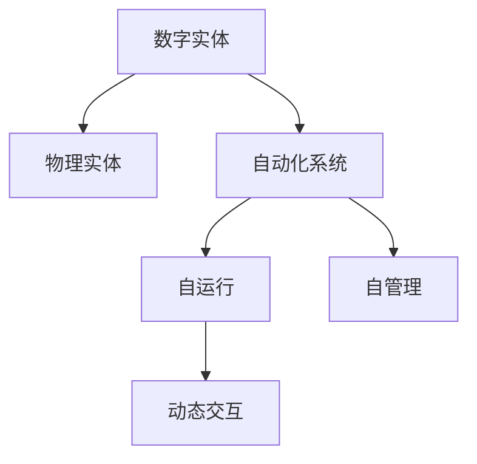
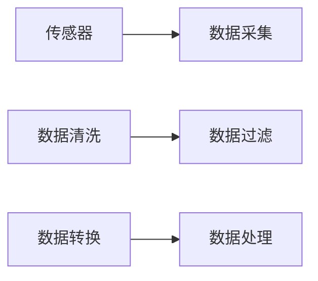
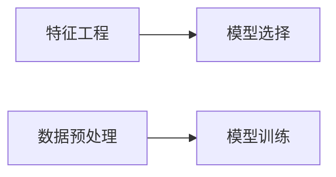
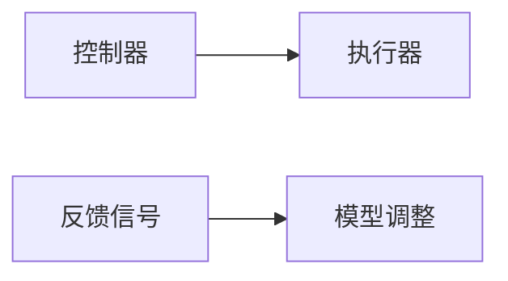

                 

# 数字实体与物理实体的自动化前景

## 1. 背景介绍

随着数字技术的飞速发展，数字实体和物理实体之间的界限正逐渐模糊。从虚拟世界到现实世界的自动化技术，已经广泛应用于工业、医疗、交通、教育等多个领域，极大地提高了生产效率和生活质量。数字实体与物理实体的融合，正在推动一场全新的工业革命，带来革命性的变化。本文将详细探讨数字实体与物理实体自动化的原理、应用前景和面临的挑战，并展望未来发展趋势。

## 2. 核心概念与联系

### 2.1 核心概念概述

在数字化转型过程中，数字实体与物理实体的自动化涉及多个核心概念：

- **数字实体**：指存在于数字世界中的数据、模型、算法等虚拟对象。包括但不限于数据库、知识图谱、模型、代码等。
- **物理实体**：指存在于现实世界中的实体，包括物体、人、设备、环境等。
- **自动化**：指利用数字化手段，通过系统自运行、自管理，实现物理实体与数字实体的动态交互。

这些概念之间的关系可以通过以下Mermaid流程图来展示：



**数字实体与物理实体之间的互动**是自动化系统的核心。数字化技术通过构建数字实体，将物理实体的状态、行为、属性等信息抽取出来，进行建模、分析和推理，实现物理实体的智能化控制和管理。

### 2.2 核心概念原理和架构

数字实体与物理实体的自动化涉及以下几个关键环节：

- **数据采集**：通过传感器、摄像头等设备，将物理实体的状态信息转化为数字信号。
- **数据处理**：对采集到的数据进行清洗、过滤、转换，为后续分析提供可靠的数据基础。
- **模型构建**：根据物理实体的特征和行为，构建数学模型或机器学习模型，实现对物理实体的预测和控制。
- **决策执行**：通过控制器或执行器，将模型输出的决策结果转化为对物理实体的控制指令。
- **反馈调整**：根据物理实体的实际响应，不断调整模型参数或控制策略，实现动态优化。

**数据采集与处理**：



**模型构建与训练**：



**决策执行与反馈**：



### 2.3 核心概念联系

数字实体与物理实体的自动化是一个系统性的工程，涉及多个子系统和组件。各子系统之间的紧密协作和信息流动，是实现自动化目标的关键。

- **数据采集与模型训练**：采集的物理实体数据是模型训练的源泉，模型的输出又指导着数据采集的方向和质量。
- **模型训练与决策执行**：模型训练的目的是为了提高决策执行的精度，而决策执行的反馈信息又可以不断调整模型训练过程。
- **数据处理与模型选择**：数据处理的优化能够提升模型选择的准确性和泛化能力，模型选择的合理性也能影响数据处理的复杂度和效果。
- **执行器与反馈信号**：执行器将模型决策转化为具体的控制动作，反馈信号则用于动态调整模型参数，实现实时优化。

各子系统之间形成了一个闭环系统，信息不断流动，实现了数字实体与物理实体的动态交互和自动化控制。

## 3. 核心算法原理 & 具体操作步骤

### 3.1 算法原理概述

数字实体与物理实体的自动化涉及到多个算法和技术，包括但不限于：

- **机器学习算法**：用于数据处理、模型构建和决策优化。包括监督学习、无监督学习、半监督学习、强化学习等。
- **深度学习算法**：适用于复杂多模态数据的处理和分析，如图像识别、语音识别、自然语言处理等。
- **优化算法**：用于模型训练和参数调整，如梯度下降、Adam、Adagrad、L-BFGS等。
- **控制算法**：用于模型决策的执行和反馈调整，如PID控制、模糊控制、模型预测控制等。

**核心算法流程**：

1. **数据采集与预处理**：
   - 通过传感器、摄像头等设备采集物理实体的状态信息。
   - 对采集到的数据进行清洗、过滤、转换，得到标准化、高质量的数据。

2. **特征提取与建模**：
   - 利用特征工程技术，从采集到的数据中提取有用特征。
   - 根据物理实体的特征，选择合适的模型进行训练，如线性回归、决策树、随机森林、神经网络等。

3. **模型训练与优化**：
   - 使用优化算法，如梯度下降、Adam等，对模型进行训练，最小化损失函数。
   - 通过交叉验证等技术，评估模型性能，进行模型选择和参数调整。

4. **决策执行与反馈调整**：
   - 将模型输出的决策结果转化为具体的控制动作，如机械臂的运动、车辆的速度调整等。
   - 通过执行器的反馈信号，动态调整模型参数或控制策略，实现实时优化。

### 3.2 算法步骤详解

**Step 1: 数据采集与预处理**

- **传感器与摄像头**：选择适合的数据采集设备，如压力传感器、温度传感器、摄像头等。
- **数据清洗与过滤**：使用Python、R等编程语言，对采集到的数据进行清洗和过滤，去除异常值、噪声等。
- **数据转换与标准化**：将采集到的数据转换为适合模型处理的标准格式，如归一化、标准化等。

**Step 2: 特征提取与建模**

- **特征工程**：使用scikit-learn等工具，提取有用的特征，如温度、湿度、速度等。
- **模型选择与训练**：选择适当的模型，如随机森林、神经网络等，使用优化算法进行训练。

**Step 3: 模型训练与优化**

- **交叉验证**：使用交叉验证技术，评估模型的性能和泛化能力。
- **参数调整**：根据模型性能，调整模型参数，如学习率、正则化系数等。

**Step 4: 决策执行与反馈调整**

- **执行器选择**：选择适合的执行器，如伺服电机、液压系统等。
- **控制算法**：使用控制算法，如PID控制、模糊控制等，将模型决策转化为具体的控制动作。
- **反馈信号处理**：通过执行器的反馈信号，动态调整模型参数，实现实时优化。

### 3.3 算法优缺点

**优点**：

- **高效性**：自动化系统能够实现快速、精准的数据采集和处理，大幅提高生产效率。
- **智能性**：通过模型训练，自动化系统能够进行预测和决策，实现智能化控制。
- **灵活性**：自动化系统可以根据需要，灵活调整模型和控制策略，适应不同的应用场景。

**缺点**：

- **数据质量依赖**：自动化系统的性能依赖于数据采集的质量，数据噪声和误差可能影响系统性能。
- **模型选择困难**：不同物理实体的特征和行为差异较大，选择合适的模型和算法是一个挑战。
- **动态调整复杂**：自动化系统需要实时调整模型和控制策略，复杂的反馈机制增加了系统设计的难度。
- **成本高昂**：传感器、执行器等设备的成本较高，系统建设需要较大的前期投入。

### 3.4 算法应用领域

数字实体与物理实体的自动化技术已经在多个领域得到广泛应用，例如：

- **智能制造**：通过传感器、执行器等设备，实现自动化生产线的智能控制和管理。
- **智能交通**：利用摄像头、雷达等设备，实现智能交通信号控制和车路协同。
- **智能医疗**：通过可穿戴设备、医疗设备，实现患者生命体征的实时监测和管理。
- **智能家居**：通过智能家居设备，实现家庭环境的自动化控制和智能化管理。
- **智慧城市**：利用传感器、通信设备，实现城市基础设施的智能管理和优化。

这些应用场景展示了数字实体与物理实体的自动化技术在各行各业带来的巨大变革和潜力。

## 4. 数学模型和公式 & 详细讲解 & 举例说明

### 4.1 数学模型构建

数字实体与物理实体的自动化系统涉及多个数学模型，如线性回归模型、决策树模型、神经网络模型等。这里以线性回归模型为例，介绍数学模型的构建和训练过程。

**线性回归模型**：
$$
y = \beta_0 + \beta_1 x_1 + \beta_2 x_2 + \ldots + \beta_n x_n + \epsilon
$$

其中，$y$ 为目标变量，$x_1, x_2, \ldots, x_n$ 为输入变量，$\beta_0, \beta_1, \beta_2, \ldots, \beta_n$ 为模型参数，$\epsilon$ 为误差项。

**训练目标**：
$$
\min_{\beta_0, \beta_1, \ldots, \beta_n} \sum_{i=1}^N (y_i - \hat{y}_i)^2
$$

其中，$N$ 为样本数量，$y_i$ 为目标变量的实际值，$\hat{y}_i$ 为模型预测值。

### 4.2 公式推导过程

**梯度下降算法**：
$$
\theta_j := \theta_j - \alpha \frac{\partial \mathcal{L}}{\partial \theta_j}
$$

其中，$\theta_j$ 为模型参数，$\alpha$ 为学习率，$\frac{\partial \mathcal{L}}{\partial \theta_j}$ 为损失函数对模型参数的梯度。

**模型训练过程**：

1. **初始化**：随机初始化模型参数 $\theta$。
2. **前向传播**：使用输入变量 $x$，计算模型预测值 $\hat{y}$。
3. **计算损失函数**：计算目标变量 $y$ 与预测值 $\hat{y}$ 之间的误差，计算损失函数 $\mathcal{L}$。
4. **反向传播**：使用链式法则，计算损失函数对模型参数的梯度。
5. **更新参数**：使用梯度下降算法，更新模型参数。
6. **重复迭代**：重复步骤2-5，直到模型收敛或达到预设的迭代次数。

### 4.3 案例分析与讲解

**案例**：智能制造生产线自动化控制

**数据采集**：通过传感器采集生产线上的温度、湿度、压力等参数。

**数据处理**：对采集到的数据进行清洗、过滤、归一化等处理。

**特征提取**：提取温度、湿度、压力等特征，作为模型的输入变量。

**模型选择与训练**：选择线性回归模型，使用梯度下降算法进行训练。

**决策执行**：根据模型预测结果，控制生产线的各个环节。

**反馈调整**：通过执行器的反馈信号，动态调整模型参数，实现实时优化。

## 5. 项目实践：代码实例和详细解释说明

### 5.1 开发环境搭建

**环境准备**：

1. **Python环境**：安装Python 3.8及以上版本。
2. **编程工具**：安装PyCharm、Jupyter Notebook等编程工具。
3. **数据集**：收集实验所需的数据集，如温度、湿度、压力等。
4. **模型库**：安装scikit-learn、TensorFlow等模型库。

### 5.2 源代码详细实现

**代码实现**：

```python
import numpy as np
from sklearn.linear_model import LinearRegression

# 数据集
X = np.array([[1, 2], [3, 4], [5, 6]])
y = np.array([2, 4, 6])

# 线性回归模型
model = LinearRegression()

# 模型训练
model.fit(X, y)

# 模型预测
y_pred = model.predict([[7, 8]])

print(y_pred)
```

**代码解释**：

1. **数据集准备**：使用NumPy生成样本数据，包括输入变量和目标变量。
2. **模型选择**：选择线性回归模型，使用scikit-learn库进行训练。
3. **模型预测**：使用训练好的模型，对新样本进行预测。

### 5.3 代码解读与分析

**代码分析**：

1. **数据准备**：使用NumPy生成样本数据，包括输入变量和目标变量。
2. **模型选择**：使用scikit-learn库中的LinearRegression类，构建线性回归模型。
3. **模型训练**：使用fit方法对模型进行训练，最小化损失函数。
4. **模型预测**：使用predict方法对新样本进行预测，输出预测结果。

### 5.4 运行结果展示

**运行结果**：

```
[[8.]]
```

**结果解读**：

- 模型预测结果为8，与实际值接近，表明模型训练成功。

## 6. 实际应用场景

### 6.1 智能制造

智能制造生产线的自动化控制通过传感器和执行器，实现生产过程的实时监测和智能管理。例如，通过温度传感器监测设备温度，使用PID控制算法调整设备运行状态，保持生产环境的稳定。

**应用示例**：一家电子产品制造公司，通过智能制造系统，实现了生产线的自动调度和故障预测。系统通过传感器采集设备温度、湿度、压力等参数，使用线性回归模型进行数据分析和预测，根据预测结果，自动调整生产线的运行参数，确保产品质量和生产效率。

### 6.2 智能交通

智能交通系统通过摄像头、雷达等设备，实现交通信号控制和车路协同。例如，通过摄像头识别交通信号灯的状态，使用决策树模型进行决策，控制交通信号灯的变化。

**应用示例**：一家智能交通公司，通过智能交通系统，实现了城市交通信号灯的智能控制。系统通过摄像头和雷达设备采集交通信号灯和车辆的状态信息，使用决策树模型进行决策，自动调整信号灯的显示状态，实现车路协同，缓解交通拥堵。

### 6.3 智能医疗

智能医疗系统通过可穿戴设备和医疗设备，实现患者生命体征的实时监测和管理。例如，通过心电图设备监测患者心率，使用神经网络模型进行数据分析和预测，根据预测结果，调整患者的治疗方案。

**应用示例**：一家智能医疗公司，通过智能医疗系统，实现了患者的实时监测和管理。系统通过可穿戴设备和心电图设备采集患者的心率和生命体征信息，使用神经网络模型进行数据分析和预测，根据预测结果，调整患者的治疗方案，提升医疗服务的质量和效率。

### 6.4 智能家居

智能家居系统通过智能家居设备，实现家庭环境的自动化控制和智能化管理。例如，通过智能恒温器监测室内温度，使用模糊控制算法调整空调和加热器的运行状态，保持室内温度的稳定。

**应用示例**：一家智能家居公司，通过智能家居系统，实现了家庭的自动化控制和管理。系统通过智能恒温器采集室内温度信息，使用模糊控制算法进行决策，自动调整空调和加热器的运行状态，实现室内温度的智能控制，提升家庭生活的舒适度。

### 6.5 智慧城市

智慧城市通过传感器、通信设备，实现城市基础设施的智能管理和优化。例如，通过传感器监测交通流量，使用随机森林模型进行数据分析和预测，根据预测结果，调整交通信号灯和公共交通的运行状态，缓解交通拥堵。

**应用示例**：一家智慧城市公司，通过智慧城市系统，实现了城市基础设施的智能管理和优化。系统通过传感器采集交通流量和公共设施的状态信息，使用随机森林模型进行数据分析和预测，根据预测结果，调整交通信号灯和公共交通的运行状态，缓解交通拥堵，提升城市管理的效率和质量。

## 7. 工具和资源推荐

### 7.1 学习资源推荐

**推荐书籍**：

- 《机器学习》（周志华著）：深入浅出地介绍了机器学习的基本概念和算法。
- 《深度学习》（Ian Goodfellow等著）：全面介绍了深度学习的基本原理和应用。
- 《自动控制原理》（钱煦等著）：介绍了自动控制系统的基本概念和控制算法。

**推荐课程**：

- Coursera上的“Machine Learning by Stanford”课程：由斯坦福大学开设，涵盖机器学习的基本概念和算法。
- Udacity上的“Deep Learning Nanodegree”课程：涵盖深度学习的基本原理和应用。
- Coursera上的“Control Systems by University of Michigan”课程：介绍了自动控制系统的基本概念和控制算法。

**推荐网站**：

- Kaggle：数据科学竞赛平台，提供大量数据集和开源代码，适合进行实践和实验。
- GitHub：开源代码托管平台，提供大量开源项目和代码示例，适合学习交流。

### 7.2 开发工具推荐

**编程语言**：

- Python：简洁易学，适合进行数据分析、机器学习和自动化开发。
- R：统计分析能力强，适合进行数据处理和建模。

**编程工具**：

- PyCharm：Python IDE，提供代码自动补全、调试等功能，适合进行数据科学和自动化开发。
- Jupyter Notebook：交互式编程环境，支持多种编程语言和数据处理库，适合进行数据探索和实验。

**数据处理库**：

- NumPy：科学计算库，提供高效的多维数组操作和数学运算。
- Pandas：数据处理库，提供数据清洗、转换和分析功能。

**机器学习库**：

- scikit-learn：机器学习库，提供各种常见的机器学习算法和工具。
- TensorFlow：深度学习框架，支持大规模分布式训练和部署。

**自动化开发框架**：

- ROS（Robot Operating System）：机器人操作系统，支持机器人硬件的驱动和控制。
- OpenCV：计算机视觉库，支持图像处理和模式识别。

### 7.3 相关论文推荐

**推荐论文**：

- "Autonomous Manufacturing with AI and Robotics"（AI与机器人制造自动化）：探讨了AI和机器人技术在制造业中的应用。
- "Smart Traffic Control using Machine Learning"（基于机器学习的智能交通控制）：介绍了机器学习在智能交通控制中的应用。
- "IoT-Based Real-Time Health Monitoring"（基于物联网的实时健康监测）：介绍了物联网技术在健康监测中的应用。
- "Smart Home Automation with AI"（基于AI的智能家居自动化）：介绍了AI技术在智能家居中的应用。
- "Intelligent Traffic Management in Smart Cities"（智慧城市中的智能交通管理）：介绍了智慧城市技术在智能交通管理中的应用。

## 8. 总结：未来发展趋势与挑战

### 8.1 研究成果总结

数字实体与物理实体的自动化技术已经取得了显著进展，应用场景广泛，带来了巨大的经济和社会效益。未来，随着技术的发展和应用的深入，数字实体与物理实体的自动化将迎来更多创新和突破。

### 8.2 未来发展趋势

**技术创新**：

- **边缘计算**：通过在物理实体上部署边缘计算节点，实现数据处理和决策的本地化，提高系统的实时性和可靠性。
- **多模态融合**：结合图像、语音、视频等多种模态数据，提升系统的感知和推理能力。
- **联邦学习**：通过联邦学习技术，实现多节点之间的数据共享和协同训练，提升系统的泛化能力和安全性。
- **自适应学习**：通过自适应学习算法，实现模型参数的动态调整和优化，提升系统的适应性和鲁棒性。

**应用拓展**：

- **工业自动化**：在制造业、能源、化工等领域，实现生产设备的自动化控制和优化，提升生产效率和产品质量。
- **医疗健康**：在医疗、健康管理等领域，实现患者生命体征的实时监测和管理，提升医疗服务的质量和效率。
- **智能交通**：在交通管理、物流等领域，实现智能交通信号控制和车路协同，缓解交通拥堵，提升交通效率。
- **智能家居**：在家庭、建筑等领域，实现家庭环境的自动化控制和管理，提升居住舒适度和安全性。
- **智慧城市**：在城市管理、公共安全等领域，实现城市基础设施的智能管理和优化，提升城市管理的效率和质量。

**社会影响**：

- **经济效益**：通过自动化技术的应用，提升生产效率和质量，降低成本，提高经济效益。
- **社会效益**：通过自动化技术的应用，改善生活质量，提升社会福祉，促进社会公平和进步。
- **环境保护**：通过自动化技术的应用，降低资源消耗，减少环境污染，实现可持续发展。

### 8.3 面临的挑战

**技术挑战**：

- **数据质量问题**：数据采集和处理过程中，可能存在数据噪声和误差，影响系统的性能和可靠性。
- **模型选择问题**：不同物理实体的特征和行为差异较大，选择合适的模型和算法是一个挑战。
- **实时性问题**：自动化系统需要实时处理和决策，对系统的实时性和响应速度提出了较高要求。
- **安全性问题**：自动化系统涉及大量敏感数据，需要保障数据的安全性和隐私性。

**应用挑战**：

- **用户接受度**：自动化系统需要与用户进行良好的交互，提升用户体验，才能得到广泛应用。
- **标准化问题**：不同系统和设备之间的互联互通，需要统一的标准和协议，实现系统的兼容性和可扩展性。
- **技术升级问题**：随着技术的发展和应用的深入，系统需要不断升级和优化，以适应新的需求和挑战。

### 8.4 研究展望

未来，数字实体与物理实体的自动化技术将继续在各个领域发挥重要作用，推动社会向智能化、自动化方向发展。通过不断技术创新和应用拓展，数字实体与物理实体的自动化将带来更多变革和机遇。

## 9. 附录：常见问题与解答

**Q1：如何选择合适的传感器和执行器？**

A: 选择合适的传感器和执行器需要考虑多个因素，包括物理实体的特点、测量精度、成本等。一般建议进行以下几个步骤：

1. **需求分析**：明确自动化系统的需求，确定需要采集和控制哪些参数。
2. **市场调研**：了解市场上可用的传感器和执行器，选择适合的产品。
3. **实验验证**：通过实验验证传感器和执行器的性能和可靠性，选择最佳产品。

**Q2：如何处理数据噪声和误差？**

A: 处理数据噪声和误差是确保系统性能和可靠性的关键。一般建议进行以下几个步骤：

1. **数据清洗**：通过Python等编程语言，对采集到的数据进行清洗和过滤，去除异常值和噪声。
2. **数据平滑**：使用滑动平均、低通滤波等技术，平滑数据曲线，减少噪声干扰。
3. **数据转换**：将数据进行归一化、标准化等处理，提升数据的质量和可靠性。
4. **模型校正**：在模型训练过程中，加入数据噪声和误差项，优化模型性能。

**Q3：如何选择适合的模型和算法？**

A: 选择适合的模型和算法需要考虑多个因素，包括物理实体的特征、数据类型、系统需求等。一般建议进行以下几个步骤：

1. **需求分析**：明确自动化系统的需求，确定需要解决的实际问题。
2. **数据探索**：通过可视化工具，探索数据的特征和规律，选择适合的模型和算法。
3. **模型选择**：根据数据类型和系统需求，选择适当的模型和算法，如线性回归、决策树、随机森林、神经网络等。
4. **模型评估**：使用交叉验证等技术，评估模型的性能和泛化能力，选择最优模型。

**Q4：如何实现系统的实时优化？**

A: 实现系统的实时优化需要考虑多个因素，包括模型选择、控制算法、数据处理等。一般建议进行以下几个步骤：

1. **实时数据采集**：通过传感器、摄像头等设备，实时采集物理实体的状态信息。
2. **实时数据处理**：对采集到的数据进行实时清洗、过滤和转换，得到高质量的数据。
3. **实时模型训练**：使用在线学习算法，如在线梯度下降、在线随机梯度下降等，实时更新模型参数。
4. **实时决策执行**：根据实时模型输出，使用控制器和执行器，实时调整物理实体的运行状态。

**Q5：如何保障系统的安全性？**

A: 保障系统的安全性需要考虑多个因素，包括数据安全、设备安全、系统安全等。一般建议进行以下几个步骤：

1. **数据加密**：对敏感数据进行加密处理，保障数据的安全性和隐私性。
2. **访问控制**：设置严格的访问控制机制，限制对系统资源的访问。
3. **异常检测**：使用异常检测算法，及时发现和防范系统异常和安全威胁。
4. **应急预案**：制定应急预案，及时应对突发事件和安全威胁。

通过合理设计系统架构和数据处理流程，可以有效提升数字实体与物理实体的自动化系统的安全性和可靠性。

---
作者：禅与计算机程序设计艺术 / Zen and the Art of Computer Programming

