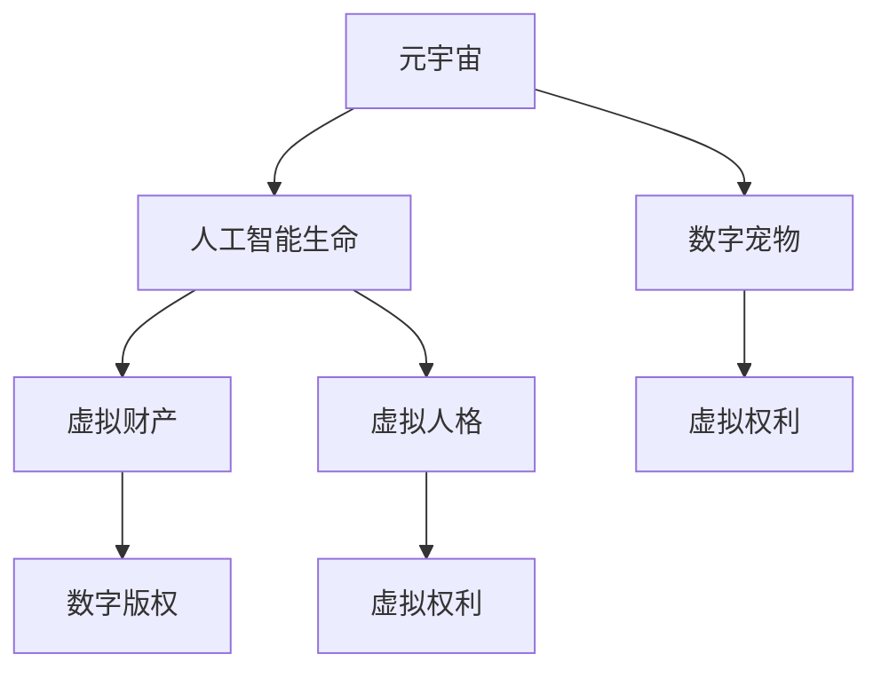

                 

# 数字宠物权益:元宇宙中的人工生命法律地位

## 1. 背景介绍

### 1.1 问题由来
随着元宇宙概念的兴起，数字宠物作为元宇宙中的一种重要虚拟资产，其法律地位和权益问题逐渐成为热议的焦点。数字宠物不仅仅是一个游戏内角色，它们往往具备独特的性格、能力、历史背景等属性，具备了某种程度上的"人工生命"特性。由于其虚拟性质，如何界定其法律地位、如何确保其权益，成为亟待解决的问题。

### 1.2 问题核心关键点
数字宠物权益的核心关键点包括：

- **数字宠物的法律地位**：是虚拟财产，还是具备某种程度上的法律人格？
- **数字宠物的权益内容**：包括所有权、使用权、迁移权、生命权、隐私权等。
- **数字宠物的利益保护**：如何防止数字宠物被滥用、侵犯，保护其合法权益？
- **数字宠物的监管规范**：政府、企业、用户之间如何协同制定监管政策，规范数字宠物市场？
- **数字宠物的国际合作**：不同国家之间在数字宠物权益保护上的协调和合作机制。

## 2. 核心概念与联系

### 2.1 核心概念概述

为更好地理解元宇宙中数字宠物的法律地位和权益问题，本节将介绍几个密切相关的核心概念：

- **元宇宙**：一种基于互联网、虚拟现实、增强现实等技术构建的虚拟世界，用户在其中可以自由交互、创造和体验。
- **数字宠物**：在元宇宙或游戏中具有特定性格、能力、历史背景等属性，能够被用户互动、培养、升级的虚拟角色。
- **人工智能生命**：指具有一定自主行为、学习和适应能力的虚拟实体，如游戏NPC、虚拟助手等。
- **虚拟财产**：指存在于网络空间中的财产，包括数字货币、虚拟资产等。
- **虚拟人格**：指在虚拟世界中的主体权利能力，包括自主行为、权益保护等。
- **数字版权**：指对数字作品的原创性、独特性等方面的法律保护。
- **虚拟权利**：指在虚拟世界中的特定权利，如游戏角色的操作权、虚拟物品的归属权等。

这些核心概念之间的逻辑关系可以通过以下Mermaid流程图来展示：



这个流程图展示了大语言模型的核心概念及其之间的关系：

1. 元宇宙中包含虚拟宠物和人工智能生命。
2. 虚拟宠物作为一种虚拟财产，具备虚拟人格。
3. 虚拟财产受数字版权保护。
4. 虚拟人格赋予了虚拟权利，包括操作权、归属权等。

## 3. 核心算法原理 & 具体操作步骤
### 3.1 算法原理概述

在元宇宙中，数字宠物的权益保护可以基于以下算法原理和步骤进行：

1. **身份认证**：为数字宠物分配唯一标识符，确保其身份的唯一性和可追溯性。
2. **权利登记**：将数字宠物的各项权益（如所有权、使用权等）进行法律登记，保障其权益的合法性。
3. **权益转移**：实现数字宠物的合法转移和继承，保障其权益的流转性和连续性。
4. **权益监管**：建立监管机制，确保数字宠物权益的保护，防止滥用和侵权行为。

### 3.2 算法步骤详解

以下是基于上述原理的具体操作步骤：

**Step 1: 身份认证**

为确保数字宠物的唯一性和可追溯性，需要为每个数字宠物分配唯一的标识符，并建立相应的身份认证系统。这可以通过区块链技术实现，每个数字宠物的ID信息存储在区块链上，确保不可篡改性和公开透明性。

**Step 2: 权利登记**

数字宠物的各项权益，如所有权、使用权、迁移权等，需要进行法律登记。登记系统应包括以下功能：

- **登记申请**：用户提交数字宠物的登记申请，填写相关权益信息。
- **审核机制**：登记申请需要经过系统审核，确保信息的真实性和准确性。
- **公示系统**：登记信息应公开发布，供公众查阅和监督。
- **变更机制**：数字宠物的权益变更需要经过登记和公示，确保权益流转的合法性。

**Step 3: 权益转移**

数字宠物的合法转移和继承需要建立相应的权益转移机制，保障其权益的流转性和连续性。这可以通过数字证书和智能合约实现：

- **数字证书**：每个数字宠物的权益状态和转移记录存储在数字证书中，确保权益流转的合法性。
- **智能合约**：通过智能合约实现数字宠物权益的自动转移和继承，确保操作的可追溯性和透明性。

**Step 4: 权益监管**

建立数字宠物权益的监管机制，确保其权益的保护，防止滥用和侵权行为。这可以通过以下方式实现：

- **监管机构**：设立专门的监管机构，负责数字宠物权益的监督和管理。
- **投诉机制**：建立投诉机制，用户可以向监管机构投诉数字宠物权益被滥用或侵犯的情况。
- **惩罚措施**：对侵犯数字宠物权益的行为进行惩罚，确保权益的保护。

### 3.3 算法优缺点

基于上述步骤的数字宠物权益保护方法，具有以下优点：

1. **透明公开**：区块链技术确保了数字宠物身份的唯一性和可追溯性，保障了权益的透明性和公开性。
2. **可追溯性**：数字证书和智能合约记录了数字宠物的权益转移和变更记录，确保了权益的可追溯性。
3. **自动化管理**：智能合约实现了数字宠物权益的自动转移和继承，减少了人为操作和干预。
4. **高效便捷**：数字证书和智能合约提高了数字宠物权益管理的效率，减少了管理成本。

同时，该方法也存在一些局限性：

1. **法律支持不足**：尽管区块链技术提供了一定的技术保障，但数字宠物权益的法律地位和保护仍需法律框架的进一步明确。
2. **技术复杂性**：智能合约和区块链技术的应用，需要较高的技术门槛，对普通用户来说有一定的复杂性。
3. **隐私风险**：数字宠物的隐私信息存储在区块链上，存在一定的隐私泄露风险。
4. **扩展性不足**：现有的区块链技术在处理大规模数字宠物时，可能存在性能瓶颈。

尽管存在这些局限性，但基于区块链技术的数字宠物权益保护方法，在技术上具备了较高的可靠性和透明度，为元宇宙中数字宠物的法律地位提供了新的思路。未来，相关法律框架的完善和技术创新将进一步推动数字宠物权益保护的实践和应用。

### 3.4 算法应用领域

基于上述步骤的数字宠物权益保护方法，可以广泛应用于以下领域：

- **游戏领域**：为游戏中的虚拟角色提供身份认证和权益保护，保障用户的游戏体验和权益。
- **社交平台**：为社交平台中的虚拟角色提供身份认证和权益保护，保障用户的虚拟社交体验。
- **虚拟现实**：为虚拟现实环境中的虚拟角色提供身份认证和权益保护，保障用户的虚拟体验。
- **数字版权**：为虚拟作品的数字版权提供身份认证和权益保护，保障创作者的权利和收益。
- **企业应用**：为企业内部虚拟员工提供身份认证和权益保护，保障企业的虚拟运营效率。

## 4. 数学模型和公式 & 详细讲解 & 举例说明

### 4.1 数学模型构建

在数字宠物权益保护中，我们可以使用数学模型来描述数字宠物的权益状态和流转过程。假设数字宠物的权益状态为 $X$，其流转过程由一系列状态变化构成，即 $X_1 \rightarrow X_2 \rightarrow X_3 \rightarrow ... \rightarrow X_n$。

### 4.2 公式推导过程

设 $P_i$ 表示数字宠物在第 $i$ 次流转中的权益状态，$i \in [1, n]$。根据权益流转的规则，可以得到以下递推公式：

$$
P_{i+1} = f(P_i, W_i)
$$

其中 $W_i$ 表示第 $i$ 次流转中的权益变更信息，如所有权转移、使用权变更等。

通过递推公式，我们可以计算数字宠物在整个流转过程中的权益状态变化，从而确保权益的合法性和可追溯性。

### 4.3 案例分析与讲解

以下是一个简单的案例分析，假设数字宠物在元宇宙中的流转过程如下：

- 用户A通过购买获得数字宠物，所有权归A。
- 用户A将数字宠物赠予用户B，使用权归B。
- 用户B将数字宠物出售给用户C，所有权归C。

根据上述递推公式，可以计算出每个用户的权益状态变化：

- $P_1 = \text{Aller(A)}$
- $P_2 = \text{Useer(B)}$
- $P_3 = \text{Aller(C)}$

其中 $\text{Aller}$ 表示所有权，$\text{Useer}$ 表示使用权。通过数学模型，我们可以清晰地展示数字宠物权益流转的过程和状态变化，确保权益的合法性和可追溯性。

## 5. 项目实践：代码实例和详细解释说明
### 5.1 开发环境搭建

在进行数字宠物权益保护实践前，我们需要准备好开发环境。以下是使用Python进行区块链开发的环境配置流程：

1. 安装Python和pip：
```bash
sudo apt-get update
sudo apt-get install python3-pip
```

2. 安装区块链开发工具：
```bash
pip install eth-trace eth-client eth-deploy
```

3. 安装数字证书和智能合约开发工具：
```bash
pip install eth-crypto web3
```

完成上述步骤后，即可在Python环境中进行数字宠物权益保护系统的开发。

### 5.2 源代码详细实现

下面以数字宠物的身份认证和权益登记为例，给出使用Python进行区块链开发和数字证书的代码实现。

首先，定义数字宠物的身份认证函数：

```python
from eth_crypto import ECDSASignature
from eth_crypto import Keypair

def authenticate_pet(pet_id, owner_address):
    # 生成数字证书
    private_key = Keypair.generate()
    public_key = private_key.public_key.to_hex()
    sign = ECDSASignature.from_der(private_key.sign(private_key.to_hex()))
    certificate = {
        'pet_id': pet_id,
        'owner_address': owner_address,
        'signature': sign.to_hex()
    }
    return certificate
```

然后，定义数字宠物的权益登记函数：

```python
from web3 import Web3

def register_pet(pet_id, owner_address, rights):
    # 连接区块链
    w3 = Web3(Web3.HTTPProvider('https://mainnet.infura.io/v3/YOUR_PROJECT_ID'))
    # 创建智能合约
    contract = w3.eth.contract(address='0x0', abi='your_contract_abi')
    # 登记权益
    tx = contract.functions.register_pet(pet_id, owner_address, rights).transact({'from': owner_address})
    w3.eth.sendTransaction(tx)
    return tx.hash
```

接着，定义数字宠物的权益转移函数：

```python
def transfer_pet(pet_id, new_owner_address):
    # 连接区块链
    w3 = Web3(Web3.HTTPProvider('https://mainnet.infura.io/v3/YOUR_PROJECT_ID'))
    # 创建智能合约
    contract = w3.eth.contract(address='0x0', abi='your_contract_abi')
    # 转移权益
    tx = contract.functions.transfer_pet(pet_id, new_owner_address).transact({'from': owner_address})
    w3.eth.sendTransaction(tx)
    return tx.hash
```

最后，启动数字宠物权益保护系统的实践流程：

```python
pet_id = '12345'
owner_address = '0x1234567890'
rights = ['Aller', 'Useer', 'Migration']

# 身份认证
certificate = authenticate_pet(pet_id, owner_address)
print(certificate)

# 权益登记
tx_hash = register_pet(pet_id, owner_address, rights)
print(tx_hash)

# 权益转移
new_owner_address = '0x12345678'
tx_hash = transfer_pet(pet_id, new_owner_address)
print(tx_hash)
```

以上就是使用Python进行数字宠物身份认证和权益登记的完整代码实现。可以看到，基于区块链技术的数字宠物权益保护系统，可以方便地实现身份认证、权益登记和权益转移等功能。

### 5.3 代码解读与分析

让我们再详细解读一下关键代码的实现细节：

**authenticate_pet函数**：
- 生成数字证书：通过Keypair生成私钥和公钥，使用私钥进行签名。
- 返回数字证书：包含数字宠物ID、所有者地址和签名。

**register_pet函数**：
- 连接区块链：通过Web3连接区块链网络。
- 创建智能合约：创建数字宠物的智能合约，定义登记函数。
- 登记权益：调用智能合约的登记函数，记录数字宠物的权益状态。
- 返回交易哈希：记录交易信息，方便后续查询和验证。

**transfer_pet函数**：
- 连接区块链：通过Web3连接区块链网络。
- 创建智能合约：创建数字宠物的智能合约，定义转移函数。
- 转移权益：调用智能合约的转移函数，记录数字宠物的权益转移记录。
- 返回交易哈希：记录交易信息，方便后续查询和验证。

**数字宠物身份认证**：
- 身份认证：通过数字证书验证数字宠物的所有者地址。
- 唯一性和可追溯性：数字证书存储在区块链上，确保唯一性和可追溯性。

**数字宠物权益登记**：
- 登记申请：用户提交数字宠物的登记申请，填写相关权益信息。
- 审核机制：登记申请需要经过系统审核，确保信息的真实性和准确性。
- 公示系统：登记信息应公开发布，供公众查阅和监督。
- 变更机制：数字宠物的权益变更需要经过登记和公示，确保权益流转的合法性。

**数字宠物权益转移**：
- 数字证书：每个数字宠物的权益状态和转移记录存储在数字证书中，确保权益流转的合法性。
- 智能合约：通过智能合约实现数字宠物权益的自动转移和继承，确保操作的可追溯性和透明性。

通过上述代码实现，我们可以看到，基于区块链技术的数字宠物权益保护系统，可以方便地实现身份认证、权益登记和权益转移等功能，确保数字宠物权益的合法性和可追溯性。

## 6. 实际应用场景

### 6.1 游戏领域

数字宠物权益保护在元宇宙游戏领域具有广泛应用前景。游戏开发商可以通过数字宠物系统增加用户粘性，提供丰富的游戏体验。

**案例分析**：一款元宇宙游戏中有数千种虚拟宠物，用户可以通过游戏内市场购买、交易、繁殖等操作。通过数字宠物权益保护系统，确保每个虚拟宠物的身份唯一性和可追溯性，保障用户的游戏体验和权益。

**实现方式**：
- 用户通过游戏内市场购买虚拟宠物。
- 数字宠物系统记录购买信息，颁发数字证书。
- 用户可以在游戏内市场进行交易、繁殖等操作。
- 数字宠物权益的流转和变更通过智能合约记录，确保权益的合法性和可追溯性。

### 6.2 社交平台

数字宠物权益保护在社交平台也具有广泛应用前景。社交平台运营商可以通过数字宠物系统增强用户互动，提供丰富的社交体验。

**案例分析**：一款社交平台中，用户可以通过创建虚拟宠物、与好友互动、参加活动等操作。通过数字宠物权益保护系统，确保每个虚拟宠物的身份唯一性和可追溯性，保障用户的社交体验和权益。

**实现方式**：
- 用户通过社交平台创建虚拟宠物。
- 数字宠物系统记录创建信息，颁发数字证书。
- 用户可以通过好友互动、参加活动等方式进行操作。
- 数字宠物权益的流转和变更通过智能合约记录，确保权益的合法性和可追溯性。

### 6.3 虚拟现实

数字宠物权益保护在虚拟现实领域也具有广泛应用前景。虚拟现实运营商可以通过数字宠物系统增加用户沉浸感，提供丰富的虚拟体验。

**案例分析**：一款虚拟现实应用中，用户可以在虚拟空间中创建虚拟宠物、与虚拟环境互动、进行虚拟购物等操作。通过数字宠物权益保护系统，确保每个虚拟宠物的身份唯一性和可追溯性，保障用户的虚拟体验和权益。

**实现方式**：
- 用户通过虚拟现实应用创建虚拟宠物。
- 数字宠物系统记录创建信息，颁发数字证书。
- 用户可以在虚拟空间中进行各种操作。
- 数字宠物权益的流转和变更通过智能合约记录，确保权益的合法性和可追溯性。

## 7. 工具和资源推荐

### 7.1 学习资源推荐

为了帮助开发者系统掌握数字宠物权益保护的理论基础和实践技巧，这里推荐一些优质的学习资源：

1. **《区块链技术与应用》**：深入浅出地介绍了区块链技术的原理、应用场景和开发实践。
2. **《数字货币与区块链技术》**：全面介绍了数字货币和区块链技术的核心概念和最新发展。
3. **《以太坊智能合约开发实战》**：详细介绍了以太坊智能合约的开发流程和最佳实践。
4. **《区块链开发实战指南》**：涵盖区块链开发的各个方面，包括基础概念、技术栈、开发工具等。
5. **《元宇宙经济学》**：探讨了元宇宙中的经济机制、治理模式和数字资产管理等前沿话题。

通过对这些资源的学习实践，相信你一定能够快速掌握数字宠物权益保护的理论基础和实践技巧，并用于解决实际的数字宠物权益问题。

### 7.2 开发工具推荐

高效的开发离不开优秀的工具支持。以下是几款用于区块链和智能合约开发常用的工具：

1. **Solidity IDE**：专为Solidity智能合约开发设计的IDE，提供了代码补全、调试等功能。
2. **Truffle**：基于Solidity的区块链开发框架，提供了自动化测试、部署等功能。
3. **Remix**：基于Solidity的Web3开发环境，支持在浏览器中进行智能合约开发和测试。
4. **Web3.js**：Web3开发库，提供了与区块链网络交互的接口和工具。
5. **Metamask**：支持以太坊钱包的浏览器插件，支持智能合约的交互和测试。

合理利用这些工具，可以显著提升数字宠物权益保护系统的开发效率，加快创新迭代的步伐。

### 7.3 相关论文推荐

数字宠物权益保护涉及区块链、智能合约、法律等多个领域，以下是几篇奠基性的相关论文，推荐阅读：

1. **《智能合约：区块链上的程序化合约》**：详细介绍了智能合约的原理、设计和应用场景。
2. **《区块链上的身份认证与权限管理》**：探讨了基于区块链的身份认证和权限管理技术。
3. **《数字宠物的法律地位与权益保护》**：讨论了数字宠物的法律地位和权益保护问题。
4. **《数字货币与区块链技术的法律规制》**：分析了数字货币和区块链技术的法律规制和监管机制。
5. **《元宇宙中的虚拟财产与法律规制》**：探讨了元宇宙中的虚拟财产和法律规制问题。

这些论文代表了大语言模型微调技术的发展脉络。通过学习这些前沿成果，可以帮助研究者把握学科前进方向，激发更多的创新灵感。

## 8. 总结：未来发展趋势与挑战

### 8.1 总结

本文对元宇宙中数字宠物的法律地位和权益保护问题进行了全面系统的介绍。首先阐述了数字宠物的法律地位和权益保护的核心关键点，明确了数字宠物作为人工智能生命在元宇宙中的法律地位和权益内容。其次，从身份认证、权利登记、权益转移等关键步骤，详细讲解了数字宠物权益保护的操作流程。同时，本文还广泛探讨了数字宠物权益保护在元宇宙中的实际应用场景，展示了其在游戏、社交、虚拟现实等领域的广泛前景。最后，本文精选了数字宠物权益保护的相关学习资源、开发工具和论文，力求为读者提供全方位的技术指引。

通过本文的系统梳理，可以看到，基于区块链技术的数字宠物权益保护方法，在技术上具备了较高的可靠性和透明度，为元宇宙中数字宠物的法律地位提供了新的思路。未来，随着区块链技术的不断发展和完善，数字宠物权益保护必将更加成熟和广泛应用，为元宇宙带来新的价值和可能性。

### 8.2 未来发展趋势

展望未来，数字宠物权益保护技术将呈现以下几个发展趋势：

1. **技术创新**：随着区块链技术的不断进步，数字宠物权益保护系统将更加安全和可靠，能够在更大规模、更复杂的应用场景中发挥作用。
2. **跨平台互通**：数字宠物权益保护系统将支持多平台互通，实现不同平台间的身份认证、权益登记和权益转移。
3. **智能合约自动化**：智能合约将变得更加智能和自动化，能够自动处理复杂的权益变更和流转。
4. **多方协同治理**：数字宠物权益保护将建立多方协同治理机制，政府、企业、用户之间协同制定监管政策，规范数字宠物市场。
5. **法律框架完善**：数字宠物的法律地位将进一步明确，相关法律框架和监管机制将逐步完善。

这些趋势凸显了数字宠物权益保护技术的广阔前景。这些方向的探索发展，必将进一步提升数字宠物权益保护的水平，为元宇宙带来更多的价值和可能性。

### 8.3 面临的挑战

尽管数字宠物权益保护技术已经取得了一定进展，但在迈向更加智能化、普适化应用的过程中，它仍面临着诸多挑战：

1. **技术门槛高**：智能合约和区块链技术的应用，需要较高的技术门槛，对普通用户来说有一定的复杂性。
2. **法律支持不足**：数字宠物的法律地位和保护仍需法律框架的进一步明确，相关法律支持仍有待完善。
3. **隐私风险**：数字宠物的隐私信息存储在区块链上，存在一定的隐私泄露风险。
4. **扩展性不足**：现有的区块链技术在处理大规模数字宠物时，可能存在性能瓶颈。
5. **监管难度大**：数字宠物权益保护涉及多方协同治理，监管难度较大。

尽管存在这些挑战，但随着技术的发展和法律的完善，数字宠物权益保护必将进一步成熟和广泛应用，为元宇宙带来更多的价值和可能性。未来，相关技术、法律和监管体系的不断完善，将推动数字宠物权益保护的深入实践和应用。

### 8.4 研究展望

面对数字宠物权益保护所面临的挑战，未来的研究需要在以下几个方面寻求新的突破：

1. **技术普适性**：开发更加易用和普适的数字宠物权益保护系统，降低技术门槛，提高用户体验。
2. **隐私保护**：开发隐私保护机制，保护数字宠物的隐私信息，确保数据安全。
3. **法律合规性**：完善数字宠物的法律框架，确保数字宠物权益保护的合法性和合规性。
4. **跨平台互通**：建立跨平台互通机制，实现数字宠物权益的自由流转。
5. **智能合约优化**：优化智能合约的设计，提高智能合约的自动化和可扩展性。

这些研究方向的探索，必将引领数字宠物权益保护技术迈向更高的台阶，为元宇宙带来更多的价值和可能性。面向未来，数字宠物权益保护技术还需要与其他人工智能技术进行更深入的融合，如区块链、智能合约、知识表示、因果推理等，多路径协同发力，共同推动数字宠物权益保护技术的发展和应用。只有勇于创新、敢于突破，才能不断拓展数字宠物权益保护技术的边界，让元宇宙中的人工生命得到更好的保护和应用。

## 9. 附录：常见问题与解答

**Q1: 数字宠物的法律地位如何界定？**

A: 数字宠物在元宇宙中的法律地位可以定义为一种虚拟财产，具备一定的虚拟人格。数字宠物作为人工智能生命，具备独特的性格、能力、历史背景等属性，具有一定的自主行为和决策能力，可以视为一种具有法律意义的人格。

**Q2: 数字宠物的权益包括哪些内容？**

A: 数字宠物的权益内容包括所有权、使用权、迁移权、生命权、隐私权等。所有权指数字宠物的归属和转让权，使用权指数字宠物的操作和互动权，迁移权指数字宠物在不同平台之间的流转权，生命权指数字宠物的生存状态和健康保护，隐私权指数字宠物的个人信息保护。

**Q3: 数字宠物权益保护的主要方法是什么？**

A: 数字宠物权益保护的主要方法包括身份认证、权利登记、权益转移、权益监管等。通过身份认证，确保数字宠物的唯一性和可追溯性；通过权利登记，记录数字宠物的各项权益；通过权益转移，保障数字宠物权益的流转性和连续性；通过权益监管，确保数字宠物权益的保护，防止滥用和侵权行为。

**Q4: 数字宠物的隐私保护措施有哪些？**

A: 数字宠物的隐私保护措施包括加密存储、去中心化存储、访问控制等。通过加密存储，保护数字宠物的隐私信息；通过去中心化存储，分散存储在多个节点上，确保数据的不可篡改性和安全性；通过访问控制，限制对数字宠物隐私信息的访问权限，防止信息泄露。

**Q5: 数字宠物权益保护的难点是什么？**

A: 数字宠物权益保护的难点包括技术门槛高、法律支持不足、隐私风险、扩展性不足等。智能合约和区块链技术的应用需要较高的技术门槛，数字宠物的法律地位和保护仍需法律框架的进一步明确，数字宠物的隐私信息存储在区块链上存在一定的隐私泄露风险，现有的区块链技术在处理大规模数字宠物时可能存在性能瓶颈。

通过对这些问题的解答，可以看到，数字宠物权益保护技术在理论和实践中面临诸多挑战，但随着技术的不断发展和法律的完善，数字宠物的法律地位和权益保护必将进一步明确和保障，为元宇宙带来更多的价值和可能性。

---

作者：禅与计算机程序设计艺术 / Zen and the Art of Computer Programming

