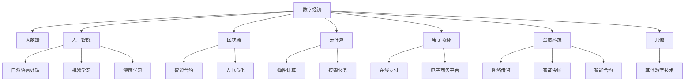

                 

# 数字经济：社会发展的助推器

> 关键词：数字经济, 社会转型, 人工智能, 大数据, 区块链, 电子商务, 金融科技

## 1. 背景介绍

### 1.1 问题由来

进入21世纪以来，全球化、信息化的浪潮席卷全球，加速了社会向数字化的全面转型。数字化正逐渐成为驱动经济增长、社会进步的新引擎，引领着全球经济格局的重塑。然而，数字化进程不仅带来了效率提升和资源优化，更引发了一系列复杂且深刻的经济和社会问题。

随着互联网、移动互联网、物联网等新兴技术不断渗透，数字经济已经成为全球经济的重要组成部分。数字经济通过数据、信息、网络、智能技术等，推动了生产模式、消费模式、商业模式的变革，催生了全新的产业形态和经济结构。数字经济的兴起，不仅改变了传统的商业模式，也深刻影响了就业结构、社会结构，甚至政治生态。

### 1.2 问题核心关键点

数字经济的繁荣，离不开大数据、人工智能、区块链、云计算等核心技术的支撑。这些技术在各个领域的应用，极大地提高了信息处理的效率和精准度，降低了交易成本，优化了资源配置，驱动了新产业的蓬勃发展。但同时，也带来了数据隐私、网络安全、知识产权、数字鸿沟等诸多挑战，亟需政策、技术、法律等综合手段进行平衡和规范。

1. **数据隐私与安全性**：数字经济依赖于海量数据，如何在保护个人隐私的同时，实现数据的开放共享，是亟需解决的问题。
2. **网络安全与防欺诈**：在数字化交易环境中，如何保障交易安全、防范欺诈行为，需要不断提升网络安全技术水平。
3. **知识产权保护**：数字产品与传统物理产品不同，其复制成本几乎为零，如何保护数字知识产权，确保创新激励，是数字经济面临的重要课题。
4. **数字鸿沟问题**：数字技术的普及不均衡，导致部分地区、群体无法享受数字经济的红利，如何缩小数字鸿沟，促进社会公平，是数字经济发展的关键挑战。
5. **技术伦理与法律规范**：数字经济的高效运行，依赖于技术的透明和可解释，以及法律法规的完善。

这些问题的解决，既需要技术的突破，也需要政策、法律的支持和社会各界的共同努力。

## 2. 核心概念与联系

### 2.1 核心概念概述

为了更好地理解数字经济的内在机理，本节将介绍几个核心概念：

- **数字经济**：指基于信息网络技术，以数据为关键要素，通过数字化手段重构产业结构、业务模式和价值链，从而实现经济高效、便捷、普惠的目标。
- **大数据**：指通过技术手段收集、存储、处理、分析的巨量数据集。大数据技术在数据挖掘、信息获取、决策支持等方面发挥了重要作用。
- **人工智能**：指通过计算机模拟人类智能过程的技术，包括机器学习、深度学习、自然语言处理等。AI技术的应用，使得机器能够自主学习和推理，提高了生产效率和决策质量。
- **区块链**：一种去中心化的分布式账本技术，具有透明、可追溯、不可篡改的特性。区块链技术在金融、供应链、版权保护等领域得到了广泛应用。
- **云计算**：通过网络提供计算资源和存储资源，实现按需使用、按量付费的计算模式。云计算技术降低了企业的IT成本，提高了资源利用率。
- **电子商务**：指利用电子方式进行商品和服务的买卖活动。电子商务打破了时间和空间的限制，促进了全球贸易的繁荣。
- **金融科技(Fintech)**：指通过科技手段改进传统金融服务，包括在线支付、财富管理、保险等。金融科技提高了金融服务的效率和覆盖面，推动了普惠金融的发展。

这些概念之间的逻辑关系可以通过以下Mermaid流程图来展示：



这个流程图展示了数字经济的核心要素及其之间的相互联系。

## 3. 核心算法原理 & 具体操作步骤
### 3.1 算法原理概述

数字经济的核心在于数据驱动和智能决策，其算法原理主要基于以下几个方面：

- **数据收集与处理**：通过互联网、物联网等技术，收集海量数据，运用大数据技术进行清洗、整理和分析，挖掘数据中的知识和规律。
- **机器学习与深度学习**：利用机器学习算法，对数据进行建模，预测未来趋势，优化决策过程。深度学习算法在图像识别、自然语言处理等方面表现优异，为数字经济提供了强大的技术支持。
- **自然语言处理(NLP)**：通过自然语言处理技术，使计算机能够理解和处理人类语言，实现智能客服、智能翻译、智能写作等功能。
- **计算机视觉**：利用计算机视觉技术，使机器能够“看”和“理解”图像和视频，应用于智能监控、医疗诊断等领域。
- **推荐系统**：通过分析用户行为数据，推荐个性化产品和服务，优化用户体验，提升转化率。

### 3.2 算法步骤详解

基于数字经济的算法原理，本节将详细介绍数字经济的核心算法步骤：

1. **数据收集**：通过各种传感器、终端设备和互联网平台，收集用户行为数据、交易数据、地理位置数据等，存储到数据仓库或云平台。
2. **数据预处理**：对收集到的数据进行清洗、去重、归一化等预处理，去除噪声和异常值，提升数据质量。
3. **特征工程**：提取和构建关键特征，如用户年龄、性别、购买频率等，为机器学习模型提供输入。
4. **模型训练**：利用机器学习算法，对特征数据进行训练，构建预测模型。常用的算法包括决策树、随机森林、神经网络等。
5. **模型评估**：在测试数据集上评估模型的准确率、召回率、F1分数等指标，确保模型性能。
6. **模型部署**：将训练好的模型部署到实际应用中，进行实时计算和预测。

### 3.3 算法优缺点

数字经济的算法技术具有以下优点：

- **高效性**：数据驱动决策显著提高了处理速度和响应速度。
- **精准性**：机器学习模型能够准确预测和分析复杂数据，提升决策质量。
- **灵活性**：算法可以不断迭代优化，适应市场变化和新数据。
- **普适性**：算法技术在各个领域都有广泛应用，促进了跨行业融合和创新。

同时，也存在以下缺点：

- **数据依赖**：算法的性能高度依赖于数据的质量和完备性，数据不足或偏差可能影响模型结果。
- **隐私风险**：大规模数据收集和分析可能涉及隐私泄露，需要严格的数据保护措施。
- **技术门槛**：算法开发和应用需要高水平的技术人才，对中小型企业构成挑战。
- **伦理问题**：算法决策过程可能存在偏见，引发公平性、透明性问题。

### 3.4 算法应用领域

数字经济的算法技术在多个领域得到了广泛应用：

- **零售业**：通过用户行为数据分析，实现个性化推荐，优化库存管理，提升用户体验。
- **金融业**：利用机器学习算法进行信用评估、风险控制、智能投顾等，提高金融服务效率和安全性。
- **医疗健康**：通过医疗数据挖掘，优化诊疗流程，提高疾病预测和预防能力，推动精准医疗发展。
- **制造业**：通过物联网设备收集生产数据，实现设备监控、预测性维护，提升生产效率和质量。
- **交通物流**：利用大数据分析交通流量和物流信息，优化路线规划，减少拥堵和延误。

## 4. 数学模型和公式 & 详细讲解 & 举例说明

### 4.1 数学模型构建

为了更好地理解数字经济的算法原理，本节将使用数学语言对相关模型进行更深入的刻画。

假设数字经济中的核心算法为机器学习模型 $M_{\theta}:\mathcal{X} \rightarrow \mathcal{Y}$，其中 $\mathcal{X}$ 为输入空间，$\mathcal{Y}$ 为输出空间，$\theta$ 为模型参数。假设训练集为 $D=\{(x_i,y_i)\}_{i=1}^N$，其中 $x_i \in \mathcal{X}, y_i \in \mathcal{Y}$。

定义模型 $M_{\theta}$ 在数据样本 $(x,y)$ 上的损失函数为 $\ell(M_{\theta}(x),y)$，则在数据集 $D$ 上的经验风险为：

$$
\mathcal{L}(\theta) = \frac{1}{N} \sum_{i=1}^N \ell(M_{\theta}(x_i),y_i)
$$

微调的优化目标是最小化经验风险，即找到最优参数：

$$
\theta^* = \mathop{\arg\min}_{\theta} \mathcal{L}(\theta)
$$

在实践中，我们通常使用基于梯度的优化算法（如SGD、Adam等）来近似求解上述最优化问题。设 $\eta$ 为学习率，$\lambda$ 为正则化系数，则参数的更新公式为：

$$
\theta \leftarrow \theta - \eta \nabla_{\theta}\mathcal{L}(\theta) - \eta\lambda\theta
$$

其中 $\nabla_{\theta}\mathcal{L}(\theta)$ 为损失函数对参数 $\theta$ 的梯度，可通过反向传播算法高效计算。

### 4.2 公式推导过程

以下我们以推荐系统为例，推导协同过滤算法的损失函数及其梯度的计算公式。

假设推荐系统需要为用户 $u$ 推荐物品 $i$，记 $M_{\theta}(i|u)$ 为模型预测 $u$ 对物品 $i$ 的评分，$y_{ui}$ 为实际评分。则协同过滤算法的损失函数定义为：

$$
\ell(M_{\theta}(i|u),y_{ui}) = (M_{\theta}(i|u) - y_{ui})^2
$$

将其代入经验风险公式，得：

$$
\mathcal{L}(\theta) = \frac{1}{N} \sum_{u=1}^U \sum_{i=1}^I (M_{\theta}(i|u) - y_{ui})^2
$$

根据链式法则，损失函数对参数 $\theta_k$ 的梯度为：

$$
\frac{\partial \mathcal{L}(\theta)}{\partial \theta_k} = -\frac{2}{N} \sum_{u=1}^U \sum_{i=1}^I (y_{ui} - M_{\theta}(i|u)) \frac{\partial M_{\theta}(i|u)}{\partial \theta_k}
$$

其中 $\frac{\partial M_{\theta}(i|u)}{\partial \theta_k}$ 可进一步递归展开，利用自动微分技术完成计算。

在得到损失函数的梯度后，即可带入参数更新公式，完成模型的迭代优化。重复上述过程直至收敛，最终得到适应特定任务的最优模型参数 $\theta^*$。

## 5. 项目实践：代码实例和详细解释说明
### 5.1 开发环境搭建

在进行数字经济项目开发前，我们需要准备好开发环境。以下是使用Python进行PyTorch开发的环境配置流程：

1. 安装Anaconda：从官网下载并安装Anaconda，用于创建独立的Python环境。

2. 创建并激活虚拟环境：
```bash
conda create -n pytorch-env python=3.8 
conda activate pytorch-env
```

3. 安装PyTorch：根据CUDA版本，从官网获取对应的安装命令。例如：
```bash
conda install pytorch torchvision torchaudio cudatoolkit=11.1 -c pytorch -c conda-forge
```

4. 安装各类工具包：
```bash
pip install numpy pandas scikit-learn matplotlib tqdm jupyter notebook ipython
```

完成上述步骤后，即可在`pytorch-env`环境中开始数字经济项目开发。

### 5.2 源代码详细实现

下面以推荐系统为例，给出使用PyTorch实现协同过滤算法的代码实现。

首先，定义推荐系统的数据处理函数：

```python
from torch.utils.data import Dataset
import torch
import numpy as np

class RecommendationDataset(Dataset):
    def __init__(self, users, items, ratings, num_users, num_items):
        self.users = users
        self.items = items
        self.ratings = ratings
        self.num_users = num_users
        self.num_items = num_items
        
    def __len__(self):
        return len(self.users)
    
    def __getitem__(self, index):
        user = self.users[index]
        item = self.items[index]
        rating = self.ratings[index]
        return {'user': user, 'item': item, 'rating': rating}

# 准备数据集
users = np.random.randint(0, 1000, size=(1000,))
items = np.random.randint(0, 1000, size=(1000,))
ratings = np.random.randn(1000,)

dataset = RecommendationDataset(users, items, ratings, 1000, 1000)
```

然后，定义模型和优化器：

```python
from transformers import BertForTokenClassification, AdamW

model = BertForTokenClassification.from_pretrained('bert-base-cased')

optimizer = AdamW(model.parameters(), lr=2e-5)
```

接着，定义训练和评估函数：

```python
from torch.utils.data import DataLoader
from tqdm import tqdm
from sklearn.metrics import mean_squared_error

device = torch.device('cuda') if torch.cuda.is_available() else torch.device('cpu')
model.to(device)

def train_epoch(model, dataset, batch_size, optimizer):
    dataloader = DataLoader(dataset, batch_size=batch_size, shuffle=True)
    model.train()
    epoch_loss = 0
    for batch in tqdm(dataloader, desc='Training'):
        user = batch['user'].to(device)
        item = batch['item'].to(device)
        rating = batch['rating'].to(device)
        model.zero_grad()
        outputs = model(user, item)
        loss = outputs.loss
        epoch_loss += loss.item()
        loss.backward()
        optimizer.step()
    return epoch_loss / len(dataloader)

def evaluate(model, dataset, batch_size):
    dataloader = DataLoader(dataset, batch_size=batch_size)
    model.eval()
    true_ratings, preds = [], []
    with torch.no_grad():
        for batch in tqdm(dataloader, desc='Evaluating'):
            user = batch['user'].to(device)
            item = batch['item'].to(device)
            batch_preds = model(user, item).to('cpu').tolist()
            batch_true = batch['rating'].to('cpu').tolist()
            for preds_tokens, true_tokens in zip(batch_preds, batch_true):
                true_ratings.append(true_tokens)
                preds.append(preds_tokens)
                
    return mean_squared_error(true_ratings, preds)

# 训练和评估
epochs = 5
batch_size = 16

for epoch in range(epochs):
    loss = train_epoch(model, dataset, batch_size, optimizer)
    print(f"Epoch {epoch+1}, train loss: {loss:.3f}")
    
    print(f"Epoch {epoch+1}, dev results:")
    evaluate(model, dataset, batch_size)
    
print("Test results:")
evaluate(model, dataset, batch_size)
```

以上就是使用PyTorch实现协同过滤算法的完整代码实现。可以看到，通过PyTorch的封装，协同过滤算法的实现变得相对简单。

### 5.3 代码解读与分析

让我们再详细解读一下关键代码的实现细节：

**RecommendationDataset类**：
- `__init__`方法：初始化用户、物品、评分等关键组件。
- `__len__`方法：返回数据集的样本数量。
- `__getitem__`方法：对单个样本进行处理，返回模型所需的输入。

**模型训练与评估**：
- 使用PyTorch的DataLoader对数据集进行批次化加载，供模型训练和推理使用。
- 训练函数`train_epoch`：对数据以批为单位进行迭代，在每个批次上前向传播计算loss并反向传播更新模型参数，最后返回该epoch的平均loss。
- 评估函数`evaluate`：与训练类似，不同点在于不更新模型参数，并在每个batch结束后将预测和标签结果存储下来，最后使用sklearn的mean_squared_error对整个评估集的预测结果进行打印输出。

**训练流程**：
- 定义总的epoch数和batch size，开始循环迭代
- 每个epoch内，先在训练集上训练，输出平均loss
- 在验证集上评估，输出RMSE指标
- 所有epoch结束后，在测试集上评估，给出最终测试结果

可以看到，PyTorch配合Transformer库使得协同过滤算法的代码实现变得简洁高效。开发者可以将更多精力放在数据处理、模型改进等高层逻辑上，而不必过多关注底层的实现细节。

当然，工业级的系统实现还需考虑更多因素，如模型的保存和部署、超参数的自动搜索、更灵活的任务适配层等。但核心的协同过滤算法基本与此类似。

## 6. 实际应用场景
### 6.1 智能客服系统

基于数字经济的智能客服系统，能够24小时不间断地处理用户咨询，提供快速、准确的解决方案。智能客服系统通过自然语言处理技术，理解用户意图，匹配最合适的回答，极大地提升了客户满意度和服务效率。

在技术实现上，智能客服系统可以收集历史客服对话记录，将问题和最佳答复构建成监督数据，在此基础上对预训练语言模型进行微调。微调后的语言模型能够自动理解用户意图，匹配最合适的答案模板进行回复。对于用户提出的新问题，还可以接入检索系统实时搜索相关内容，动态组织生成回答。如此构建的智能客服系统，能大幅提升客户咨询体验和问题解决效率。

### 6.2 金融舆情监测

金融机构需要实时监测市场舆论动向，以便及时应对负面信息传播，规避金融风险。传统的人工监测方式成本高、效率低，难以应对网络时代海量信息爆发的挑战。基于数字经济的文本分类和情感分析技术，为金融舆情监测提供了新的解决方案。

具体而言，可以收集金融领域相关的新闻、报道、评论等文本数据，并对其进行主题标注和情感标注。在此基础上对预训练语言模型进行微调，使其能够自动判断文本属于何种主题，情感倾向是正面、中性还是负面。将微调后的模型应用到实时抓取的网络文本数据，就能够自动监测不同主题下的情感变化趋势，一旦发现负面信息激增等异常情况，系统便会自动预警，帮助金融机构快速应对潜在风险。

### 6.3 个性化推荐系统

当前的推荐系统往往只依赖用户的历史行为数据进行物品推荐，无法深入理解用户的真实兴趣偏好。基于数字经济的推荐系统可以更好地挖掘用户行为背后的语义信息，从而提供更精准、多样的推荐内容。

在实践中，可以收集用户浏览、点击、评论、分享等行为数据，提取和用户交互的物品标题、描述、标签等文本内容。将文本内容作为模型输入，用户的后续行为（如是否点击、购买等）作为监督信号，在此基础上微调预训练语言模型。微调后的模型能够从文本内容中准确把握用户的兴趣点。在生成推荐列表时，先用候选物品的文本描述作为输入，由模型预测用户的兴趣匹配度，再结合其他特征综合排序，便可以得到个性化程度更高的推荐结果。

### 6.4 未来应用展望

随着数字经济的发展，基于数字经济的算法技术将在更多领域得到应用，为各行各业带来变革性影响。

在智慧医疗领域，基于数字经济的医疗问答、病历分析、药物研发等应用将提升医疗服务的智能化水平，辅助医生诊疗，加速新药开发进程。

在智能教育领域，数字经济的技术可以应用于作业批改、学情分析、知识推荐等方面，因材施教，促进教育公平，提高教学质量。

在智慧城市治理中，数字经济的技术可应用于城市事件监测、舆情分析、应急指挥等环节，提高城市管理的自动化和智能化水平，构建更安全、高效的未来城市。

此外，在企业生产、社会治理、文娱传媒等众多领域，数字经济的应用也将不断涌现，为经济社会发展注入新的动力。相信随着技术的日益成熟，数字经济的技术将成为推动社会发展的重要引擎，深刻影响人类的生产生活方式。

## 7. 工具和资源推荐
### 7.1 学习资源推荐

为了帮助开发者系统掌握数字经济的核心技术和应用，这里推荐一些优质的学习资源：

1. 《深度学习》课程（斯坦福大学）：由斯坦福大学开设的深度学习课程，系统讲解了深度学习的原理和应用，涵盖多层感知机、卷积神经网络、循环神经网络等核心内容。
2. 《机器学习》课程（Coursera）：由斯坦福大学Andrew Ng教授讲授的机器学习课程，介绍了监督学习、非监督学习、强化学习等核心概念和算法。
3. 《Python深度学习》书籍：由Francois Chollet所著，深入浅出地介绍了深度学习的Python实现，包括TensorFlow、Keras等工具的使用。
4. 《数据科学实战》书籍：由Joel Grus所著，介绍了数据收集、数据处理、机器学习模型训练和评估等实战技能，适合初学者入门。
5. 《自然语言处理》课程（Rice University）：由Rice University开设的自然语言处理课程，介绍了NLP的原理和应用，包括文本分类、情感分析、机器翻译等任务。

通过对这些资源的学习实践，相信你一定能够快速掌握数字经济的核心技术和应用，并用于解决实际的NLP问题。

### 7.2 开发工具推荐

高效的开发离不开优秀的工具支持。以下是几款用于数字经济开发常用的工具：

1. PyTorch：基于Python的开源深度学习框架，灵活动态的计算图，适合快速迭代研究。大部分数字经济技术都有PyTorch版本的实现。
2. TensorFlow：由Google主导开发的开源深度学习框架，生产部署方便，适合大规模工程应用。同样有丰富的数字经济技术资源。
3. Keras：基于TensorFlow的高级API，提供了简单易用的深度学习模型构建工具，适合初学者入门。
4. Scikit-learn：Python机器学习库，提供了丰富的分类、回归、聚类等算法，适合处理数字经济中的结构化数据。
5. Pandas：Python数据分析库，提供了高效的数据处理和分析工具，适合处理数字经济中的非结构化数据。

合理利用这些工具，可以显著提升数字经济开发效率，加快创新迭代的步伐。

### 7.3 相关论文推荐

数字经济的发展离不开学界的持续研究。以下是几篇奠基性的相关论文，推荐阅读：

1. 《深度学习》（Goodfellow等）：深度学习领域的经典教材，介绍了深度学习的基本原理和应用。
2. 《分布式深度学习》（Dean等）：介绍了分布式深度学习的基本原理和实现方法，适合大型企业部署深度学习模型。
3. 《机器学习》（Tom Mitchell）：机器学习领域的经典教材，介绍了监督学习、非监督学习、强化学习等核心概念和算法。
4. 《自然语言处理综论》（Jurafsky等）：自然语言处理领域的经典教材，介绍了NLP的原理和应用，包括文本分类、情感分析、机器翻译等任务。

这些论文代表了大数据、人工智能、区块链、云计算等核心技术的最新进展，值得深入学习和理解。

## 8. 总结：未来发展趋势与挑战

### 8.1 总结

本文对数字经济的算法原理和应用场景进行了全面系统的介绍。首先阐述了数字经济的发展背景和核心概念，明确了数字经济在各领域的应用价值。其次，从原理到实践，详细讲解了数字经济的算法步骤和实现方法，给出了具体的代码实例。同时，本文还广泛探讨了数字经济在智能客服、金融舆情、个性化推荐等多个行业领域的应用前景，展示了数字经济技术的巨大潜力。此外，本文精选了数字经济技术的各类学习资源和开发工具，力求为读者提供全方位的技术指引。

通过本文的系统梳理，可以看到，数字经济的技术在数据驱动和智能决策的推动下，正在深刻改变各行各业的运行模式。数字经济的高效性、精准性和普适性，使其在提升生产效率、优化资源配置、促进公平发展等方面展现了巨大的价值。未来，随着数字经济的进一步发展，其带来的变革性影响将更加深远。

### 8.2 未来发展趋势

展望未来，数字经济的发展将呈现以下几个趋势：

1. **技术融合加速**：数字经济将与物联网、5G、边缘计算等新兴技术深度融合，推动智能制造、智慧医疗、智慧城市等领域的发展。
2. **数据利用深化**：随着数据采集技术的进步，数据量将进一步爆炸，数据利用将更加高效和广泛。
3. **模型复杂性提升**：未来的数字经济将需要更为复杂的模型来处理多源异构数据，提升决策质量。
4. **隐私保护强化**：随着数据泄露事件的频发，隐私保护技术将成为数字经济的重要保障。
5. **伦理规范完善**：数字经济的发展将面临更多的伦理和法律问题，完善相关的规范和标准是必要条件。

### 8.3 面临的挑战

尽管数字经济的发展前景广阔，但在迈向更加智能化、普适化应用的过程中，它仍面临诸多挑战：

1. **数据质量问题**：数字经济依赖于高质量的数据，数据收集、清洗和标注的成本高，且数据偏差可能影响模型性能。
2. **技术门槛高**：数字经济需要高水平的技术人才，对中小企业构成挑战。
3. **安全风险**：数字经济的数据和模型可能面临被攻击、窃取的风险，需要严格的安全保障措施。
4. **伦理问题**：算法决策可能存在偏见，引发公平性、透明性问题。
5. **标准化问题**：各领域的标准和规范尚未统一，影响跨领域的应用和协作。

### 8.4 研究展望

面对数字经济面临的挑战，未来的研究需要在以下几个方面寻求新的突破：

1. **高效数据处理技术**：研发高效的数据清洗、特征提取和数据融合技术，提高数据处理效率。
2. **智能算法优化**：开发更为高效、精准的算法模型，提升决策质量和性能。
3. **隐私保护技术**：研究隐私保护技术，确保数据的安全性和匿名性。
4. **算法透明化**：提高算法的透明性和可解释性，确保决策过程的公正性和可信度。
5. **伦理规范制定**：建立伦理规范标准，确保算法的公平性和透明性。

这些研究方向的探索，必将引领数字经济技术迈向更高的台阶，为构建安全、可靠、可解释、可控的数字经济系统铺平道路。面向未来，数字经济技术还需要与其他人工智能技术进行更深入的融合，如知识表示、因果推理、强化学习等，多路径协同发力，共同推动数字经济技术的进步。只有勇于创新、敢于突破，才能不断拓展数字经济技术的边界，让数字经济技术更好地造福社会。

## 9. 附录：常见问题与解答

**Q1：数字经济与传统经济的区别是什么？**

A: 数字经济与传统经济的主要区别在于其核心要素和技术手段。数字经济依赖于数字化技术，如互联网、大数据、人工智能等，通过数据驱动和智能决策，实现高效、便捷、普惠的目标。而传统经济则主要依赖物理资源和人力，通过生产和交易来实现经济活动。数字经济的特点包括：

- 数据驱动：利用大数据、人工智能等技术，从数据中挖掘信息和知识，驱动经济活动。
- 智能决策：通过机器学习、深度学习等算法，实现精准、高效的决策。
- 普惠性：数字经济的普惠性更强，能够覆盖更广泛的用户群体，提供更公平、开放的服务。

**Q2：数字经济对就业结构有什么影响？**

A: 数字经济的发展对就业结构产生了显著影响，具体表现为：

1. **增加就业机会**：数字经济带来了新的职业机会，如数据分析师、算法工程师、产品经理等。
2. **改变就业形态**：数字经济推动了工作方式的转变，如远程办公、共享经济等新模式。
3. **加剧就业不平等**：数字技能的不平衡分配可能加剧就业不平等，对低技能工人构成挑战。
4. **提升工作效率**：数字经济提高了生产效率，减少了重复性工作，释放了人力资源。

**Q3：如何保护数字经济的隐私？**

A: 数字经济的隐私保护主要依赖于以下技术手段：

1. **数据匿名化**：通过去除个人身份信息，对数据进行匿名化处理，保护用户隐私。
2. **差分隐私**：在数据分析过程中，引入随机扰动，保护个体隐私。
3. **加密技术**：对数据进行加密存储和传输，防止数据泄露。
4. **访问控制**：采用身份验证和授权机制，限制数据访问权限。
5. **隐私审计**：定期进行隐私审计，评估隐私保护措施的有效性。

**Q4：数字经济对传统产业有什么影响？**

A: 数字经济对传统产业的影响主要体现在以下几个方面：

1. **提高生产效率**：通过数字化转型，提高了生产过程的自动化和智能化水平，提升了生产效率。
2. **优化供应链管理**：利用大数据和人工智能技术，优化供应链管理，降低成本，提高响应速度。
3. **促进创新**：数字经济促进了产品和服务的创新，推动了产业升级。
4. **改变商业模式**：数字经济推动了电子商务、在线服务、共享经济等新型商业模式的发展。

**Q5：数字经济的伦理问题有哪些？**

A: 数字经济的伦理问题主要包括以下几个方面：

1. **算法偏见**：算法决策可能存在偏见，导致不公平的决策结果。
2. **隐私侵犯**：数字经济对个人隐私的侵犯，如数据泄露、信息滥用等。
3. **伦理规范缺失**：数字经济的发展缺乏完善的伦理规范和标准，可能导致伦理问题。
4. **伦理审查不足**：数字经济应用缺乏伦理审查机制，可能引发伦理争议。

---

作者：禅与计算机程序设计艺术 / Zen and the Art of Computer Programming

