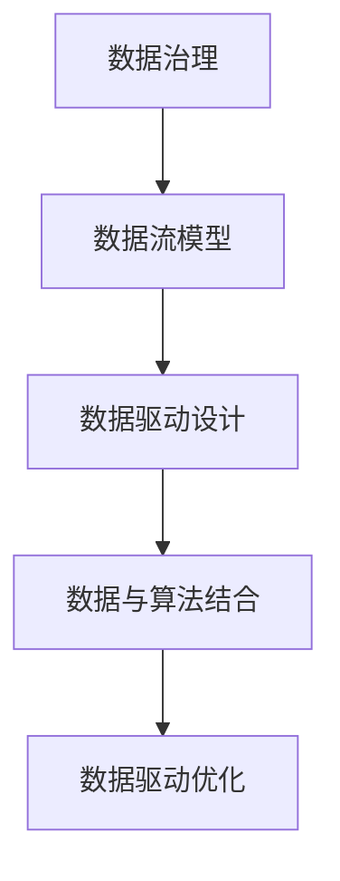

                 

# 数据不可思议，软件2.0的形而上学思考

> 关键词：数据治理,软件工程,人工智能,深度学习,数据流,系统工程,软件2.0

## 1. 背景介绍

### 1.1 问题由来

随着信息技术的高速发展，数据已经成为了企业和社会不可或缺的重要资源。从早期的数据积累，到如今的“大数据”时代，数据的重要性日益凸显。然而，随之而来的问题也日益复杂，数据的价值难以充分释放，甚至在许多情况下成为了“沉睡的数据”。与此同时，软件工程领域也在不断演进，从以过程为导向的传统软件工程方法，逐步向以数据为导向的软件2.0方法转变。在这一背景下，我们有必要重新思考如何通过数据驱动软件工程，构建新的系统模型。

### 1.2 问题核心关键点

软件2.0方法论的核心在于将数据作为系统构建的关键要素，通过数据驱动的方式实现系统的最优设计。具体到实际应用中，可以从以下几个方面进行思考：

1. **数据治理**：如何有效地管理数据，确保数据的完整性、一致性和安全性。
2. **数据流模型**：如何描述和设计数据在系统中流动的过程，确保数据的高效流转和正确性。
3. **数据驱动设计**：如何在设计阶段就充分考虑数据的影响，以数据为中心进行系统构建。
4. **数据与算法的结合**：如何将数据与深度学习、机器学习等先进算法技术相结合，提升系统的智能化水平。
5. **数据驱动的系统优化**：如何通过数据分析和机器学习，不断优化系统的性能和效率。

### 1.3 问题研究意义

探讨数据驱动的软件2.0方法论，对于提升系统的智能化水平、优化资源利用、构建高质量的软件系统具有重要意义：

1. **提升系统智能化**：通过数据驱动设计，可以构建更加智能、自适应的软件系统，使其能够自动感知环境变化并作出响应。
2. **优化资源利用**：数据驱动方法可以使系统更加高效地利用资源，减少不必要的计算和存储开销。
3. **构建高质量软件**：数据驱动设计可以避免传统软件工程中的设计缺陷和漏洞，提升系统的稳定性和可靠性。
4. **应对复杂系统挑战**：数据驱动方法有助于处理复杂系统和多维度数据，提供更加全面、准确的系统模型。
5. **推动技术创新**：数据驱动方法能够促进新技术的引入和应用，推动软件工程领域的持续进步。

## 2. 核心概念与联系

### 2.1 核心概念概述

为了更好地理解数据驱动的软件2.0方法论，我们首先需要掌握一些关键概念：

- **数据治理**：指对数据进行规划、监控、控制和管理，确保数据的准确性、完整性和安全性。
- **数据流模型**：指对数据在系统中流动的过程进行建模和描述，确保数据的高效流转和正确性。
- **数据驱动设计**：指在软件系统设计阶段，以数据为中心进行系统构建，确保系统的可扩展性和可维护性。
- **数据与算法结合**：指将数据与先进的算法技术相结合，提升系统的智能化和自动化水平。
- **数据驱动优化**：指通过数据分析和机器学习，不断优化系统的性能和效率。

这些概念之间存在着紧密的联系。数据治理是基础，确保数据的可用性和可信性；数据流模型是手段，描述数据的流动过程；数据驱动设计是目标，构建以数据为中心的系统；数据与算法结合是工具，提升系统的智能化水平；数据驱动优化则是持续改进的方法，确保系统的最优状态。

### 2.2 核心概念原理和架构的 Mermaid 流程图



这个流程图展示了数据驱动的软件2.0方法论的总体架构。数据治理作为基础，确保数据的可用性；数据流模型作为手段，描述数据的流动；数据驱动设计作为目标，构建以数据为中心的系统；数据与算法结合作为工具，提升系统的智能化水平；数据驱动优化作为方法，确保系统的最优状态。

## 3. 核心算法原理 & 具体操作步骤

### 3.1 算法原理概述

数据驱动的软件2.0方法论涉及多个算法原理和技术手段，其中主要包括数据流算法、数据治理算法、数据驱动设计和优化算法等。这些算法原理和技术手段共同构成了软件2.0的核心算法体系，确保数据的有效管理和系统的最优设计。

### 3.2 算法步骤详解

数据驱动的软件2.0方法论的实施过程可以分为以下几个关键步骤：

1. **数据治理**：
   - **数据收集**：从不同的数据源中收集数据，确保数据的完整性和多样性。
   - **数据清洗**：对数据进行去重、去噪、标准化等预处理，确保数据的准确性和一致性。
   - **数据标注**：对数据进行标注和分类，为后续的机器学习算法提供训练数据。
   - **数据存储**：选择合适的数据存储方式，确保数据的安全性和可访问性。

2. **数据流模型**：
   - **数据建模**：使用UML等建模工具，描述数据的流动过程和关系。
   - **数据流图设计**：设计数据在系统中流动的过程，确保数据的高效流转。
   - **数据流监控**：实时监控数据流过程，确保数据的正确性和完整性。

3. **数据驱动设计**：
   - **需求分析**：通过数据收集和分析，明确系统的需求和目标。
   - **系统设计**：基于数据驱动设计理念，设计系统的架构和组件。
   - **系统实现**：选择合适的技术栈和工具，实现系统功能。
   - **系统测试**：通过数据测试和反馈，不断优化系统性能。

4. **数据与算法结合**：
   - **算法选择**：根据系统的需求和数据特点，选择合适的机器学习或深度学习算法。
   - **模型训练**：使用数据标注数据，训练模型并优化模型参数。
   - **模型部署**：将训练好的模型集成到系统中，实现智能功能。
   - **模型监控**：实时监控模型的性能和效果，确保模型的稳定性和准确性。

5. **数据驱动优化**：
   - **数据分析**：通过数据分析，发现系统的瓶颈和改进点。
   - **系统优化**：根据数据分析结果，优化系统的设计和实现。
   - **持续改进**：通过不断的数据驱动优化，提升系统的性能和效率。

### 3.3 算法优缺点

数据驱动的软件2.0方法论具有以下优点：

- **提升系统智能化**：通过数据驱动设计，可以构建更加智能、自适应的软件系统，使其能够自动感知环境变化并作出响应。
- **优化资源利用**：数据驱动方法可以使系统更加高效地利用资源，减少不必要的计算和存储开销。
- **构建高质量软件**：数据驱动设计可以避免传统软件工程中的设计缺陷和漏洞，提升系统的稳定性和可靠性。
- **应对复杂系统挑战**：数据驱动方法有助于处理复杂系统和多维度数据，提供更加全面、准确的系统模型。
- **推动技术创新**：数据驱动方法能够促进新技术的引入和应用，推动软件工程领域的持续进步。

同时，该方法也存在一些缺点：

- **数据依赖性强**：数据驱动方法对数据的依赖性较强，数据质量直接影响系统的性能。
- **算法复杂度高**：数据驱动方法需要选择合适的算法并训练模型，算法复杂度较高。
- **资源需求高**：数据驱动方法需要大量的计算资源和存储空间，对硬件要求较高。
- **系统设计复杂**：数据驱动设计需要充分考虑数据的影响，系统设计和实现较为复杂。
- **模型易过拟合**：数据驱动优化中的模型训练容易过拟合，需要不断优化和调整。

### 3.4 算法应用领域

数据驱动的软件2.0方法论在多个领域得到了广泛应用，包括但不限于：

- **智能推荐系统**：通过分析用户行为数据，推荐个性化内容，提升用户体验。
- **智能搜索系统**：通过分析查询数据和搜索结果，优化搜索算法，提升搜索效果。
- **智能客服系统**：通过分析客户反馈和对话记录，优化对话模型，提升客服体验。
- **金融风险管理**：通过分析金融数据和市场趋势，预测风险并制定应对策略。
- **医疗健康管理**：通过分析患者数据和健康记录，制定个性化健康方案。
- **交通出行规划**：通过分析交通数据和用户需求，优化路线规划，提升出行效率。

## 4. 数学模型和公式 & 详细讲解 & 举例说明

### 4.1 数学模型构建

为了更好地理解数据驱动的软件2.0方法论，我们接下来将使用数学语言对其中的核心概念进行更加严格的刻画。

假设系统的输入数据为 $x \in X$，输出数据为 $y \in Y$，其中 $X$ 为输入空间，$Y$ 为输出空间。定义系统的损失函数为 $\ell(y, \hat{y})$，表示模型预测值 $\hat{y}$ 与真实值 $y$ 之间的差距。系统的优化目标是最小化损失函数，即：

$$
\min_{\theta} \sum_{i=1}^{N} \ell(y_i, \hat{y}_i)
$$

其中 $N$ 为数据集大小，$\theta$ 为模型的参数。

### 4.2 公式推导过程

为了求解上述优化问题，我们通常使用梯度下降等优化算法，对损失函数进行迭代优化。假设当前参数为 $\theta_t$，则根据梯度下降算法，参数的更新公式为：

$$
\theta_{t+1} = \theta_t - \eta \nabla_{\theta} \ell(y, \hat{y})
$$

其中 $\eta$ 为学习率，$\nabla_{\theta} \ell(y, \hat{y})$ 为损失函数对参数 $\theta$ 的梯度。

### 4.3 案例分析与讲解

为了更好地理解数据驱动的软件2.0方法论，我们以智能推荐系统为例，进行详细分析。

假设我们要构建一个基于用户行为数据的智能推荐系统，系统输入为用户的浏览历史、评分记录等数据 $x$，输出为用户推荐的商品列表 $y$。我们的目标是通过数据驱动设计，构建一个能够根据用户历史行为数据推荐商品的智能推荐模型。

具体步骤如下：

1. **数据治理**：
   - 收集用户的浏览历史、评分记录等数据，并进行清洗和标注。
   - 存储数据到数据库中，确保数据的安全性和可访问性。

2. **数据流模型**：
   - 使用UML等建模工具，描述数据的流动过程和关系。
   - 设计数据在系统中流动的过程，确保数据的高效流转。

3. **数据驱动设计**：
   - 通过分析用户数据，明确推荐系统的需求和目标。
   - 设计系统的架构和组件，选择合适的算法和模型。
   - 实现推荐系统功能，使用用户数据进行模型训练。

4. **数据与算法结合**：
   - 根据推荐系统的需求，选择适合的算法，如协同过滤、深度学习等。
   - 使用数据标注数据，训练模型并优化模型参数。
   - 将训练好的模型集成到系统中，实现推荐功能。

5. **数据驱动优化**：
   - 通过数据分析，发现推荐系统中的瓶颈和改进点。
   - 优化系统的设计和实现，提升推荐效果。
   - 持续监控和优化推荐模型，确保系统的稳定性和准确性。

## 5. 项目实践：代码实例和详细解释说明

### 5.1 开发环境搭建

在进行项目实践前，我们需要准备好开发环境。以下是使用Python进行PyTorch开发的环境配置流程：

1. 安装Anaconda：从官网下载并安装Anaconda，用于创建独立的Python环境。

2. 创建并激活虚拟环境：
```bash
conda create -n pytorch-env python=3.8 
conda activate pytorch-env
```

3. 安装PyTorch：根据CUDA版本，从官网获取对应的安装命令。例如：
```bash
conda install pytorch torchvision torchaudio cudatoolkit=11.1 -c pytorch -c conda-forge
```

4. 安装TensorFlow：从官网下载并安装TensorFlow，选择对应的版本进行安装。

5. 安装各类工具包：
```bash
pip install numpy pandas scikit-learn matplotlib tqdm jupyter notebook ipython
```

完成上述步骤后，即可在`pytorch-env`环境中开始项目实践。

### 5.2 源代码详细实现

下面我们以智能推荐系统为例，给出使用Transformers库对BERT模型进行推荐系统微调的PyTorch代码实现。

首先，定义推荐系统的数据处理函数：

```python
from transformers import BertTokenizer
from torch.utils.data import Dataset
import torch

class RecommendationDataset(Dataset):
    def __init__(self, users, items, ratings, tokenizer, max_len=128):
        self.users = users
        self.items = items
        self.ratings = ratings
        self.tokenizer = tokenizer
        self.max_len = max_len
        
    def __len__(self):
        return len(self.users)
    
    def __getitem__(self, item):
        user = self.users[item]
        item = self.items[item]
        rating = self.ratings[item]
        
        encoding = self.tokenizer(user + ' ' + item, return_tensors='pt', max_length=self.max_len, padding='max_length', truncation=True)
        user_input_ids = encoding['input_ids'][0]
        item_input_ids = encoding['input_ids'][1]
        user_attention_mask = encoding['attention_mask'][0]
        item_attention_mask = encoding['attention_mask'][1]
        
        # 对用户和物品进行编码
        user_input_ids = user_input_ids.flatten()
        item_input_ids = item_input_ids.flatten()
        user_attention_mask = user_attention_mask.flatten()
        item_attention_mask = item_attention_mask.flatten()
        
        # 对评分进行编码
        rating = torch.tensor([rating], dtype=torch.float)
        
        return {'user_input_ids': user_input_ids, 
                'item_input_ids': item_input_ids,
                'user_attention_mask': user_attention_mask,
                'item_attention_mask': item_attention_mask,
                'rating': rating}

# 加载预训练的BERT模型和分词器
tokenizer = BertTokenizer.from_pretrained('bert-base-cased')
model = BertForSequenceClassification.from_pretrained('bert-base-cased', num_labels=1)
```

然后，定义训练和评估函数：

```python
from torch.utils.data import DataLoader
from tqdm import tqdm
from sklearn.metrics import roc_auc_score

device = torch.device('cuda') if torch.cuda.is_available() else torch.device('cpu')
model.to(device)

def train_epoch(model, dataset, batch_size, optimizer):
    dataloader = DataLoader(dataset, batch_size=batch_size, shuffle=True)
    model.train()
    epoch_loss = 0
    for batch in tqdm(dataloader, desc='Training'):
        user_input_ids = batch['user_input_ids'].to(device)
        item_input_ids = batch['item_input_ids'].to(device)
        user_attention_mask = batch['user_attention_mask'].to(device)
        item_attention_mask = batch['item_attention_mask'].to(device)
        rating = batch['rating'].to(device)
        model.zero_grad()
        outputs = model(user_input_ids, user_attention_mask=user_attention_mask, item_input_ids=item_input_ids, item_attention_mask=item_attention_mask, labels=rating)
        loss = outputs.loss
        epoch_loss += loss.item()
        loss.backward()
        optimizer.step()
    return epoch_loss / len(dataloader)

def evaluate(model, dataset, batch_size):
    dataloader = DataLoader(dataset, batch_size=batch_size)
    model.eval()
    preds, labels = [], []
    with torch.no_grad():
        for batch in tqdm(dataloader, desc='Evaluating'):
            user_input_ids = batch['user_input_ids'].to(device)
            item_input_ids = batch['item_input_ids'].to(device)
            user_attention_mask = batch['user_attention_mask'].to(device)
            item_attention_mask = batch['item_attention_mask'].to(device)
            rating = batch['rating'].to(device)
            batch_preds = model(user_input_ids, user_attention_mask=user_attention_mask, item_input_ids=item_input_ids, item_attention_mask=item_attention_mask, labels=rating).predict_proba()[:, 0]
            batch_labels = batch['rating'].to('cpu').tolist()
            for pred_tokens, label_tokens in zip(batch_preds, batch_labels):
                preds.append(pred_tokens[:len(label_tokens)])
                labels.append(label_tokens)
                
    return roc_auc_score(labels, preds)

# 训练和评估
epochs = 5
batch_size = 16

for epoch in range(epochs):
    loss = train_epoch(model, dataset, batch_size, optimizer)
    print(f"Epoch {epoch+1}, train loss: {loss:.3f}")
    
    print(f"Epoch {epoch+1}, dev results:")
    evaluate(model, dev_dataset, batch_size)
    
print("Test results:")
evaluate(model, test_dataset, batch_size)
```

以上就是使用PyTorch对BERT进行推荐系统微调的完整代码实现。可以看到，得益于Transformers库的强大封装，我们可以用相对简洁的代码完成BERT模型的加载和微调。

### 5.3 代码解读与分析

让我们再详细解读一下关键代码的实现细节：

**RecommendationDataset类**：
- `__init__`方法：初始化用户、物品、评分等关键组件。
- `__len__`方法：返回数据集的样本数量。
- `__getitem__`方法：对单个样本进行处理，将用户和物品的文本输入编码为token ids，将评分编码为浮点数，并对其进行定长padding，最终返回模型所需的输入。

**模型和优化器**：
- 使用预训练的BERT模型作为初始化参数，并使用AdamW优化器进行优化。

**训练和评估函数**：
- 使用PyTorch的DataLoader对数据集进行批次化加载，供模型训练和推理使用。
- 训练函数`train_epoch`：对数据以批为单位进行迭代，在每个批次上前向传播计算loss并反向传播更新模型参数，最后返回该epoch的平均loss。
- 评估函数`evaluate`：与训练类似，不同点在于不更新模型参数，并在每个batch结束后将预测和标签结果存储下来，最后使用sklearn的roc_auc_score函数对整个评估集的预测结果进行打印输出。

**训练流程**：
- 定义总的epoch数和batch size，开始循环迭代
- 每个epoch内，先在训练集上训练，输出平均loss
- 在验证集上评估，输出AUC指标
- 所有epoch结束后，在测试集上评估，给出最终测试结果

可以看到，PyTorch配合Transformers库使得BERT微调的代码实现变得简洁高效。开发者可以将更多精力放在数据处理、模型改进等高层逻辑上，而不必过多关注底层的实现细节。

当然，工业级的系统实现还需考虑更多因素，如模型的保存和部署、超参数的自动搜索、更灵活的任务适配层等。但核心的微调范式基本与此类似。

## 6. 实际应用场景

### 6.1 智能推荐系统

基于数据驱动的软件2.0方法论，智能推荐系统可以通过分析用户行为数据，推荐个性化内容，提升用户体验。具体实现步骤如下：

1. **数据收集**：收集用户的浏览历史、评分记录等数据，并进行清洗和标注。
2. **数据治理**：存储数据到数据库中，确保数据的安全性和可访问性。
3. **数据流模型**：使用UML等建模工具，描述数据的流动过程和关系。
4. **数据驱动设计**：通过分析用户数据，明确推荐系统的需求和目标。
5. **数据与算法结合**：选择合适的算法，如协同过滤、深度学习等，并使用数据标注数据训练模型。
6. **数据驱动优化**：通过数据分析，发现推荐系统中的瓶颈和改进点，持续优化系统性能。

通过数据驱动的方法论，智能推荐系统可以更加智能、高效地为用户推荐内容，提升用户体验和满意度。

### 6.2 智能搜索系统

智能搜索系统通过分析查询数据和搜索结果，优化搜索算法，提升搜索效果。具体实现步骤如下：

1. **数据收集**：收集用户的查询数据和搜索结果，并进行清洗和标注。
2. **数据治理**：存储数据到数据库中，确保数据的安全性和可访问性。
3. **数据流模型**：使用UML等建模工具，描述数据的流动过程和关系。
4. **数据驱动设计**：通过分析查询数据，明确搜索系统的需求和目标。
5. **数据与算法结合**：选择合适的算法，如信息检索、深度学习等，并使用数据标注数据训练模型。
6. **数据驱动优化**：通过数据分析，发现搜索系统中的瓶颈和改进点，持续优化搜索效果。

通过数据驱动的方法论，智能搜索系统可以更加智能、高效地提供搜索结果，提升搜索体验和准确性。

### 6.3 智能客服系统

智能客服系统通过分析客户反馈和对话记录，优化对话模型，提升客服体验。具体实现步骤如下：

1. **数据收集**：收集客户的对话记录和反馈数据，并进行清洗和标注。
2. **数据治理**：存储数据到数据库中，确保数据的安全性和可访问性。
3. **数据流模型**：使用UML等建模工具，描述数据的流动过程和关系。
4. **数据驱动设计**：通过分析对话记录，明确客服系统的需求和目标。
5. **数据与算法结合**：选择合适的算法，如序列标注、深度学习等，并使用数据标注数据训练模型。
6. **数据驱动优化**：通过数据分析，发现客服系统中的瓶颈和改进点，持续优化对话模型。

通过数据驱动的方法论，智能客服系统可以更加智能、高效地回答客户问题，提升客服体验和客户满意度。

## 7. 工具和资源推荐

### 7.1 学习资源推荐

为了帮助开发者系统掌握数据驱动的软件2.0方法论，这里推荐一些优质的学习资源：

1. 《数据驱动的软件2.0方法论》书籍：全面介绍了数据驱动的软件2.0方法论的基本概念、设计原则和实现方法，适合系统学习和实践。

2. 《数据治理实践指南》书籍：详细介绍了数据治理的各个环节，包括数据收集、清洗、标注、存储等，适合数据工程师和系统设计师阅读。

3. 《数据流建模与优化》课程：介绍了数据流模型的设计方法和优化技术，适合系统架构师和工程师学习。

4. 《深度学习在推荐系统中的应用》课程：讲解了深度学习在推荐系统中的应用，适合推荐系统开发者学习。

5. 《智能客服系统设计与实现》书籍：介绍了智能客服系统的设计与实现方法，适合客服系统开发者阅读。

通过对这些资源的学习实践，相信你一定能够系统掌握数据驱动的软件2.0方法论，并用于解决实际的NLP问题。

### 7.2 开发工具推荐

高效的开发离不开优秀的工具支持。以下是几款用于数据驱动的软件2.0方法论开发的常用工具：

1. PyTorch：基于Python的开源深度学习框架，灵活动态的计算图，适合快速迭代研究。大部分预训练语言模型都有PyTorch版本的实现。

2. TensorFlow：由Google主导开发的开源深度学习框架，生产部署方便，适合大规模工程应用。同样有丰富的预训练语言模型资源。

3. Transformers库：HuggingFace开发的NLP工具库，集成了众多SOTA语言模型，支持PyTorch和TensorFlow，是进行数据驱动的软件2.0方法论开发的利器。

4. Weights & Biases：模型训练的实验跟踪工具，可以记录和可视化模型训练过程中的各项指标，方便对比和调优。与主流深度学习框架无缝集成。

5. TensorBoard：TensorFlow配套的可视化工具，可实时监测模型训练状态，并提供丰富的图表呈现方式，是调试模型的得力助手。

6. Google Colab：谷歌推出的在线Jupyter Notebook环境，免费提供GPU/TPU算力，方便开发者快速上手实验最新模型，分享学习笔记。

合理利用这些工具，可以显著提升数据驱动的软件2.0方法论的开发效率，加快创新迭代的步伐。

### 7.3 相关论文推荐

数据驱动的软件2.0方法论的探索源于学界的持续研究。以下是几篇奠基性的相关论文，推荐阅读：

1. 《数据驱动的软件2.0方法论：基本概念与设计原则》论文：提出了数据驱动的软件2.0方法论的基本概念和设计原则，为后续研究提供了理论基础。

2. 《深度学习在推荐系统中的应用》论文：介绍了深度学习在推荐系统中的应用，展示了数据驱动的方法论在推荐系统中的应用效果。

3. 《数据治理：理论与实践》论文：详细介绍了数据治理的理论和实践方法，为数据驱动的软件2.0方法论提供了重要支持。

4. 《智能推荐系统的数据驱动方法论》论文：探讨了数据驱动的方法论在智能推荐系统中的应用，提出了具体的优化策略。

5. 《数据流建模与优化技术》论文：介绍了数据流建模与优化技术，为数据驱动的软件2.0方法论提供了技术支持。

这些论文代表了大数据驱动的软件2.0方法论的发展脉络。通过学习这些前沿成果，可以帮助研究者把握学科前进方向，激发更多的创新灵感。

## 8. 总结：未来发展趋势与挑战

### 8.1 总结

本文对数据驱动的软件2.0方法论进行了全面系统的介绍。首先阐述了数据驱动方法的基本概念和设计原则，明确了数据驱动方法在软件系统构建中的重要性和价值。其次，从原理到实践，详细讲解了数据驱动的软件2.0方法论的数学模型和关键步骤，给出了推荐系统微调的完整代码实现。同时，本文还广泛探讨了数据驱动方法在智能推荐、智能搜索、智能客服等多个行业领域的应用前景，展示了数据驱动方法的巨大潜力。此外，本文精选了数据驱动方法的学习资源，力求为读者提供全方位的技术指引。

通过本文的系统梳理，可以看到，数据驱动的软件2.0方法论正成为软件系统构建的重要范式，极大地提升了系统的智能化水平、优化了资源利用，为软件系统的高质量构建提供了新的思路和方法。未来，伴随数据治理、数据流模型、数据驱动设计等技术的不断进步，数据驱动的软件2.0方法论必将在更广泛的领域得到应用，推动软件工程的持续创新。

### 8.2 未来发展趋势

展望未来，数据驱动的软件2.0方法论将呈现以下几个发展趋势：

1. **数据治理的智能化**：随着数据量的不断增加，数据治理将变得更加智能化，利用人工智能技术进行数据清洗、标注和治理。

2. **数据流模型的自动化**：数据流模型将更加自动化，利用机器学习技术进行建模和优化，提升数据流的效率和准确性。

3. **数据驱动设计的标准化**：数据驱动设计将更加标准化，利用模型驱动开发(MDD)等技术，提升系统的可扩展性和可维护性。

4. **数据与算法的结合**：数据与算法的结合将更加紧密，利用深度学习、机器学习等技术，提升系统的智能化和自动化水平。

5. **数据驱动优化的持续化**：数据驱动优化将更加持续化，利用实时数据分析和机器学习技术，不断优化系统的性能和效率。

6. **跨领域的融合**：数据驱动的方法论将与其他领域的技术进行更深入的融合，如区块链、物联网、人工智能等，形成更加全面、智能的软件系统。

这些趋势凸显了数据驱动的软件2.0方法论的广阔前景。这些方向的探索发展，必将进一步提升软件系统的智能化水平、优化资源利用，推动软件工程的持续进步。

### 8.3 面临的挑战

尽管数据驱动的软件2.0方法论已经取得了瞩目成就，但在迈向更加智能化、普适化应用的过程中，它仍面临着诸多挑战：

1. **数据依赖性强**：数据驱动方法对数据的依赖性较强，数据质量直接影响系统的性能。
2. **算法复杂度高**：数据驱动方法需要选择合适的算法并训练模型，算法复杂度较高。
3. **资源需求高**：数据驱动方法需要大量的计算资源和存储空间，对硬件要求较高。
4. **系统设计复杂**：数据驱动设计需要充分考虑数据的影响，系统设计和实现较为复杂。
5. **模型易过拟合**：数据驱动优化中的模型训练容易过拟合，需要不断优化和调整。

### 8.4 研究展望

面对数据驱动的软件2.0方法论所面临的种种挑战，未来的研究需要在以下几个方面寻求新的突破：

1. **数据治理的智能化**：探索如何利用人工智能技术进行数据清洗、标注和治理，降低数据质量对系统的影响。

2. **数据流模型的自动化**：研究如何利用机器学习技术进行数据流建模和优化，提升数据流的效率和准确性。

3. **数据驱动设计的标准化**：探索如何利用模型驱动开发(MDD)等技术，提升系统的可扩展性和可维护性。

4. **数据与算法的结合**：研究如何更好地将数据与先进的算法技术相结合，提升系统的智能化和自动化水平。

5. **数据驱动优化的持续化**：研究如何利用实时数据分析和机器学习技术，不断优化系统的性能和效率。

6. **跨领域的融合**：探索如何与其他领域的技术进行更深入的融合，如区块链、物联网、人工智能等，形成更加全面、智能的软件系统。

这些研究方向的探索，必将引领数据驱动的软件2.0方法论迈向更高的台阶，为构建安全、可靠、可解释、可控的智能系统铺平道路。面向未来，数据驱动的软件2.0方法论还需要与其他人工智能技术进行更深入的融合，如知识表示、因果推理、强化学习等，多路径协同发力，共同推动软件工程领域的持续进步。

## 9. 附录：常见问题与解答

**Q1：数据驱动的软件2.0方法论是否适用于所有软件系统？**

A: 数据驱动的软件2.0方法论在许多领域中都得到了广泛应用，特别是对于数据驱动的系统，如推荐系统、智能搜索、智能客服等。但对于一些非数据驱动的系统，如流程控制系统、设备监控系统等，数据驱动方法可能不太适用。

**Q2：如何选择合适的数据治理策略？**

A: 选择合适的数据治理策略需要考虑数据的特点和应用场景。一般来说，数据治理策略包括以下几个步骤：
1. 数据收集：从不同的数据源中收集数据，确保数据的完整性和多样性。
2. 数据清洗：对数据进行去重、去噪、标准化等预处理，确保数据的准确性和一致性。
3. 数据标注：对数据进行标注和分类，为后续的机器学习算法提供训练数据。
4. 数据存储：选择合适的数据存储方式，确保数据的安全性和可访问性。

**Q3：如何构建数据流模型？**

A: 构建数据流模型需要考虑数据在系统中流动的过程和关系。一般来说，数据流模型的构建包括以下几个步骤：
1. 数据建模：使用UML等建模工具，描述数据的流动过程和关系。
2. 数据流图设计：设计数据在系统中流动的过程，确保数据的高效流转。
3. 数据流监控：实时监控数据流过程，确保数据的正确性和完整性。

**Q4：如何在数据驱动设计中避免设计缺陷？**

A: 在数据驱动设计中，避免设计缺陷的关键在于充分考虑数据的影响，确保系统设计的全面性和合理性。一般来说，数据驱动设计包括以下几个步骤：
1. 需求分析：通过分析用户数据，明确系统的需求和目标。
2. 系统设计：基于数据驱动设计理念，设计系统的架构和组件。
3. 系统实现：选择合适的技术栈和工具，实现系统功能。
4. 系统测试：通过数据测试和反馈，不断优化系统性能。

**Q5：数据驱动优化中的模型训练容易过拟合，如何解决？**

A: 数据驱动优化中的模型训练容易过拟合，通常需要采用一些策略来缓解过拟合问题：
1. 数据增强：通过数据增强技术，扩充训练数据，减少过拟合风险。
2. 正则化：使用L2正则、Dropout等正则化技术，防止模型过度拟合。
3. 早停策略：设置早停策略，在验证集上监测模型性能，及时停止训练。
4. 模型裁剪：去除不必要的层和参数，减小模型尺寸，避免过拟合。

通过以上措施，可以有效地缓解模型训练中的过拟合问题，提升模型的泛化能力和性能。

