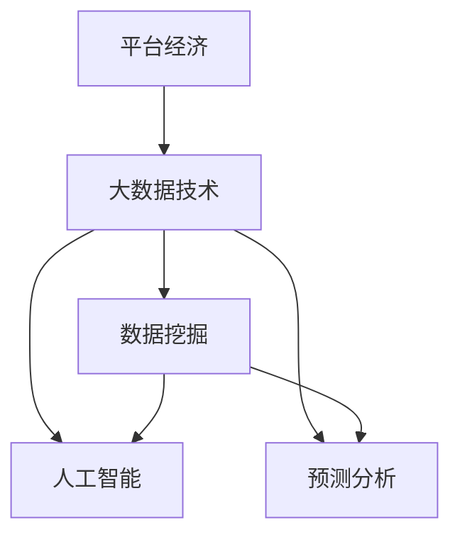

                 

# 数据分析在平台经济中的应用研究：如何深入研究数据应用？

> 关键词：数据驱动, 平台经济, 大数据技术, 数据挖掘, 人工智能, 预测分析

## 1. 背景介绍

### 1.1 问题由来

随着互联网和信息技术的飞速发展，平台经济正在成为全球经济增长的新引擎。平台经济的核心在于数据驱动，即通过分析海量数据，发现用户行为规律，优化资源配置，提升用户体验和运营效率。大数据技术在平台经济中扮演着至关重要的角色，企业能够从中挖掘出有价值的信息，从而制定有效的经营策略和决策。

### 1.2 问题核心关键点

平台经济中的数据分析主要涉及以下几个关键点：
1. **数据获取与存储**：收集用户行为数据、交易数据、社交网络数据等。
2. **数据预处理与清洗**：对数据进行缺失值处理、异常值检测、数据归一化等操作，保证数据质量。
3. **数据挖掘与建模**：使用机器学习、深度学习等算法对数据进行建模，发现潜在关联和模式。
4. **预测分析与决策支持**：利用模型预测用户行为、市场趋势，为业务决策提供依据。

### 1.3 问题研究意义

深入研究平台经济中的数据分析方法，对于提升平台运营效率、优化用户体验、降低运营成本具有重要意义。通过数据分析，企业可以：
- 精准定位用户需求，制定个性化营销策略。
- 实时监控业务动态，及时调整运营策略。
- 预测市场趋势，提前布局市场机会。
- 增强决策支持，降低决策风险。

本文旨在系统介绍平台经济中的数据分析方法，帮助读者理解数据驱动的商业模式，掌握数据分析的关键技术。

## 2. 核心概念与联系

### 2.1 核心概念概述

要深入研究平台经济中的数据分析，首先需要理解以下几个核心概念：

- **平台经济**：基于互联网技术，通过连接供给方和需求方，提供信息匹配、资源调配等服务的经济形态。典型例子包括电商平台、社交平台、金融平台等。
- **大数据技术**：指对海量数据进行存储、处理、分析和利用的技术。大数据技术包括数据获取、数据预处理、数据建模、数据可视化等环节。
- **数据挖掘**：从大数据中自动发现模式、提取知识的过程。数据挖掘技术包括分类、聚类、关联规则挖掘等。
- **人工智能**：利用机器学习、深度学习等算法，使计算机模拟人类智能过程，实现自主学习和决策。
- **预测分析**：使用历史数据和统计模型，对未来事件进行预测和决策。

这些概念之间的关系可以通过以下Mermaid流程图来展示：



这个流程图展示了平台经济与大数据技术之间的联系，以及数据分析的关键环节。

## 3. 核心算法原理 & 具体操作步骤

### 3.1 算法原理概述

平台经济中的数据分析，主要通过以下算法原理来实现：

- **数据预处理**：对原始数据进行清洗、归一化、特征工程等操作，提高数据质量。
- **数据建模**：使用机器学习、深度学习等算法，对数据进行建模，发现潜在关联和模式。
- **预测分析**：利用历史数据和统计模型，对未来事件进行预测和决策。

### 3.2 算法步骤详解

以下是一个典型的数据分析流程，包括数据获取、预处理、建模、预测和应用等多个环节：

1. **数据获取**：通过爬虫、API接口等方式获取用户行为数据、交易数据、社交网络数据等。
   
2. **数据预处理**：对数据进行清洗、归一化、特征工程等操作，生成用于建模的数据集。
   
3. **数据建模**：选择合适的算法（如分类、聚类、回归等）进行模型训练，得到初步的模型结果。
   
4. **模型评估与优化**：使用交叉验证、ROC曲线、AUC等指标评估模型性能，并进行参数调整、特征选择等优化操作。
   
5. **预测分析**：使用优化后的模型对新数据进行预测，支持业务决策。

### 3.3 算法优缺点

平台经济中的数据分析方法具有以下优点：
- **高效性**：通过自动化处理大量数据，能够快速发现用户行为规律和市场趋势。
- **准确性**：使用机器学习和深度学习算法，能够发现复杂模式和关联关系。
- **可扩展性**：大数据技术支持海量数据的存储和处理，能够应对不断增长的数据需求。

同时，也存在以下缺点：
- **数据隐私问题**：大量数据的收集和分析可能涉及用户隐私，需遵守相关法律法规。
- **计算资源需求高**：大数据分析需要高性能计算资源，对硬件设施要求较高。
- **模型复杂性**：复杂的数据模型可能难以理解和解释，需要专业的技术支持。

### 3.4 算法应用领域

平台经济中的数据分析广泛应用于以下几个领域：

- **推荐系统**：通过分析用户行为数据，为用户推荐个性化商品和服务。
- **风险管理**：利用交易数据和预测模型，评估和控制金融风险。
- **用户行为分析**：通过社交网络数据，分析用户兴趣和行为，进行精准营销。
- **市场分析**：利用市场数据和预测模型，进行市场趋势预测和业务布局。
- **客户服务**：通过用户反馈数据，优化客户服务和产品体验。

## 4. 数学模型和公式 & 详细讲解 & 举例说明

### 4.1 数学模型构建

平台经济中的数据分析主要涉及以下几个数学模型：

- **回归模型**：用于分析变量之间的关系，如线性回归、岭回归等。
- **分类模型**：用于将数据分为不同类别，如决策树、随机森林等。
- **聚类模型**：用于发现数据中的群体和结构，如K-means、层次聚类等。
- **神经网络模型**：用于处理复杂的非线性问题，如卷积神经网络、循环神经网络等。

### 4.2 公式推导过程

以线性回归模型为例，其公式推导过程如下：

假设自变量为 $X$，因变量为 $Y$，线性回归模型的目标是找到一条直线 $y = \hat{y} = \beta_0 + \beta_1 x$，使得 $Y$ 的预测值 $\hat{Y}$ 与实际值 $Y$ 的误差最小化。最小化误差的过程可以表示为：

$$
\min_{\beta_0, \beta_1} \sum_{i=1}^n (y_i - (\beta_0 + \beta_1 x_i))^2
$$

通过求解上述优化问题，可以得到 $\beta_0$ 和 $\beta_1$ 的估计值。

### 4.3 案例分析与讲解

以电商平台的推荐系统为例，分析推荐算法的基本原理：

- **用户行为数据**：收集用户浏览、点击、购买等行为数据。
- **商品数据**：收集商品特征、价格、销量等数据。
- **推荐模型**：使用协同过滤、基于内容的推荐等算法，将用户和商品进行关联。
- **推荐策略**：根据用户行为和商品特征，生成个性化推荐列表。

## 5. 项目实践：代码实例和详细解释说明

### 5.1 开发环境搭建

在开始数据分析项目前，需要准备以下开发环境：

- **Python环境**：安装Python 3.x版本，建议使用Anaconda或Virtualenv。
- **数据集**：获取平台经济相关的数据集，如用户行为数据、交易数据、社交网络数据等。
- **工具包**：安装必要的Python库，如NumPy、Pandas、Scikit-learn、TensorFlow等。

### 5.2 源代码详细实现

以下是一个简单的电商推荐系统的代码实现，包括数据加载、预处理、模型训练和预测等多个步骤：

```python
import pandas as pd
from sklearn.model_selection import train_test_split
from sklearn.feature_extraction.text import TfidfVectorizer
from sklearn.linear_model import LogisticRegression
from sklearn.metrics import accuracy_score

# 数据加载
df = pd.read_csv('user_behavior_data.csv')

# 数据预处理
X = df[['item_id', 'category', 'price']]
y = df['clicked']

# 特征工程
vectorizer = TfidfVectorizer()
X = vectorizer.fit_transform(X)

# 模型训练
X_train, X_test, y_train, y_test = train_test_split(X, y, test_size=0.2)
model = LogisticRegression()
model.fit(X_train, y_train)

# 模型评估
y_pred = model.predict(X_test)
accuracy = accuracy_score(y_test, y_pred)
print('Accuracy:', accuracy)

# 推荐系统应用
user_data = pd.read_csv('user_data.csv')
user_id = user_data['id']
user_items = user_data[['item_id', 'clicked']]
user_items = vectorizer.transform(user_items)
user_items = user_items.toarray()
recommend_items = model.predict_proba(user_items)
print('Recommended Items:', recommend_items)
```

### 5.3 代码解读与分析

上述代码实现了基本的电商推荐系统，包含以下关键步骤：

- **数据加载**：从CSV文件中加载用户行为数据。
- **数据预处理**：将用户行为数据转换为模型可处理的数值型特征。
- **特征工程**：使用TF-IDF向量化方法，将文本特征转换为数值型特征。
- **模型训练**：使用逻辑回归模型训练推荐系统。
- **模型评估**：计算模型在测试集上的准确率。
- **推荐系统应用**：根据用户行为数据，预测并推荐商品。

## 6. 实际应用场景

### 6.1 电商平台推荐

电商平台通过数据分析，能够实现个性化推荐，提升用户购物体验。数据分析方法包括：
- **用户行为分析**：分析用户浏览、点击、购买等行为，发现用户兴趣和偏好。
- **商品特征分析**：提取商品特征，如价格、销量、评论等。
- **推荐算法**：使用协同过滤、基于内容的推荐等算法，生成个性化推荐列表。

### 6.2 金融风险管理

金融机构通过数据分析，能够进行风险评估和管理。数据分析方法包括：
- **交易数据分析**：分析交易数据，发现异常交易行为。
- **信用评分建模**：使用分类模型预测用户信用评分。
- **欺诈检测**：使用异常检测算法识别欺诈行为。

### 6.3 社交网络分析

社交网络通过数据分析，能够发现用户兴趣和行为规律。数据分析方法包括：
- **社交网络分析**：分析用户好友关系、兴趣标签等。
- **用户行为分析**：分析用户发布内容、评论等行为。
- **内容推荐**：根据用户兴趣，推荐相关内容。

### 6.4 未来应用展望

未来，平台经济中的数据分析将呈现以下几个发展趋势：

1. **人工智能技术**：利用深度学习、强化学习等算法，提升数据分析的精度和效率。
2. **大数据技术**：通过分布式计算、数据湖等技术，处理海量数据。
3. **实时分析**：使用流式计算、实时数据处理技术，实现数据实时分析。
4. **多模态数据融合**：结合文本、图像、视频等多种数据，提升数据分析的全面性和准确性。
5. **隐私保护**：采用差分隐私、联邦学习等技术，保护用户隐私和数据安全。

## 7. 工具和资源推荐

### 7.1 学习资源推荐

- **《Python数据分析实战》**：介绍Python数据处理和分析的基本方法。
- **《机器学习实战》**：讲解机器学习算法的原理和实现。
- **《深度学习》**：介绍深度学习模型的构建和训练。
- **Coursera和edX平台**：提供大量数据分析和机器学习的课程。

### 7.2 开发工具推荐

- **Jupyter Notebook**：用于数据处理和模型训练的交互式开发环境。
- **TensorFlow**：深度学习框架，支持多种算法和模型。
- **PyTorch**：深度学习框架，易于使用和部署。
- **Apache Spark**：大数据处理和分析框架。

### 7.3 相关论文推荐

- **《TensorFlow：一个灵活的深度学习框架》**：介绍TensorFlow的基本概念和使用方法。
- **《数据挖掘：概念与技术》**：介绍数据挖掘的基本概念和技术方法。
- **《深度学习在电商平台推荐中的应用》**：介绍深度学习在推荐系统中的应用。

## 8. 总结：未来发展趋势与挑战

### 8.1 研究成果总结

本文系统介绍了平台经济中的数据分析方法，包括数据获取、预处理、建模、预测和应用等多个环节。数据分析方法在推荐系统、金融风险管理、社交网络分析等多个领域得到了广泛应用。

### 8.2 未来发展趋势

未来，平台经济中的数据分析将呈现以下几个发展趋势：
- **人工智能技术**：利用深度学习、强化学习等算法，提升数据分析的精度和效率。
- **大数据技术**：通过分布式计算、数据湖等技术，处理海量数据。
- **实时分析**：使用流式计算、实时数据处理技术，实现数据实时分析。
- **多模态数据融合**：结合文本、图像、视频等多种数据，提升数据分析的全面性和准确性。
- **隐私保护**：采用差分隐私、联邦学习等技术，保护用户隐私和数据安全。

### 8.3 面临的挑战

尽管数据分析在平台经济中取得了显著成效，但仍面临以下挑战：
- **数据隐私问题**：大量数据的收集和分析可能涉及用户隐私，需遵守相关法律法规。
- **计算资源需求高**：大数据分析需要高性能计算资源，对硬件设施要求较高。
- **模型复杂性**：复杂的数据模型可能难以理解和解释，需要专业的技术支持。

### 8.4 研究展望

未来的研究需要在以下几个方面寻求新的突破：
- **隐私保护技术**：采用差分隐私、联邦学习等技术，保护用户隐私和数据安全。
- **模型解释性**：提高数据模型的可解释性，增强模型的可信度。
- **跨领域数据融合**：结合不同领域的数据，提升数据分析的全面性和深度。

通过不断探索和创新，数据分析将在平台经济中发挥更大的作用，为企业提供更加精准、高效、安全的决策支持。

## 9. 附录：常见问题与解答

### 9.1 Q1：数据分析在平台经济中起到了什么作用？

A：数据分析在平台经济中起到了以下作用：
- **优化资源配置**：通过分析用户行为和市场数据，优化资源配置，提高运营效率。
- **提升用户体验**：通过个性化推荐和实时反馈，提升用户满意度和忠诚度。
- **降低运营成本**：通过自动化处理数据分析，降低人工成本和运营成本。

### 9.2 Q2：数据分析的主要流程是什么？

A：数据分析的主要流程包括：
1. **数据获取**：通过爬虫、API接口等方式获取数据。
2. **数据预处理**：对数据进行清洗、归一化、特征工程等操作。
3. **数据建模**：选择合适的算法，进行模型训练。
4. **模型评估与优化**：使用交叉验证、ROC曲线、AUC等指标评估模型性能，并进行优化。
5. **预测分析**：使用优化后的模型进行预测，支持业务决策。

### 9.3 Q3：如何选择合适的数据分析方法？

A：选择合适的数据分析方法，需要考虑以下几个因素：
- **数据类型**：根据数据的类型（如文本、图像、数值等）选择合适的算法。
- **数据量**：处理大规模数据时，选择高性能的分布式计算框架（如Hadoop、Spark等）。
- **问题类型**：根据具体问题类型（如分类、聚类、回归等）选择相应的算法。
- **业务需求**：根据业务需求选择能够提供最佳预测和决策支持的算法。

通过系统学习和大数据分析，读者可以更好地理解平台经济中的数据分析方法，掌握关键技术和工具，实现高效、准确、智能的决策支持。

---

作者：禅与计算机程序设计艺术 / Zen and the Art of Computer Programming

