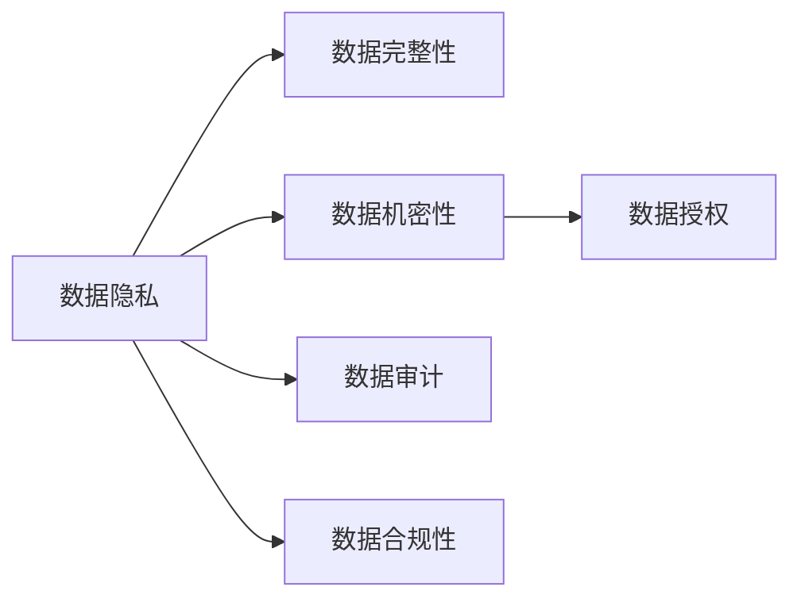

                 

# 数据安全技术：保障 AI 2.0 数据安全

随着人工智能(AI)技术的迅猛发展，AI 2.0时代的到来已经是大势所趋。AI 2.0不仅在数据处理、模型训练和推理应用等方面展现了前所未有的潜力，还极大地提升了人类生产生活的智能化水平。然而，在带来便利的同时，AI系统也面临着诸多数据安全挑战。如何在AI 2.0时代，有效保障数据隐私与安全，成为当前技术界和业界共同关注的焦点。本文将全面解析AI 2.0的数据安全技术，帮助开发者和从业者提升数据保护能力，确保AI系统在数据密集型场景中的安全可靠性。

## 1. 背景介绍

### 1.1 AI 2.0与数据安全

AI 2.0时代，大规模数据集、复杂模型结构和高效的计算能力使得AI系统具备了处理海量数据的强大能力。这些数据不仅包括用户行为数据、社交网络数据，还包括各类商业数据和政府公开数据。然而，在数据收集、存储、处理、共享等各个环节，都可能存在数据隐私和安全风险。

数据的隐私和安全问题，不仅关系到用户的个人权益，也可能对社会经济、国家安全等方面带来威胁。尤其是在金融、医疗、智能城市等关键领域，AI系统一旦受到攻击，可能会造成巨大的财产损失和公共安全风险。因此，如何在AI 2.0时代，有效保护数据隐私与安全，成为了技术界和业界共同面临的难题。

### 1.2 数据安全挑战

AI 2.0时代的数据安全挑战主要集中在以下几个方面：

1. **数据泄露**：在数据收集、存储和传输过程中，数据泄露的风险始终存在。攻击者可能通过钓鱼攻击、中间人攻击等方式，获取敏感数据。

2. **数据篡改**：攻击者可能通过篡改数据，影响AI系统的训练和推理结果，甚至造成误导性的决策输出。

3. **模型滥用**：AI模型一旦部署，可能被恶意第三方利用，造成数据滥用、决策偏差等问题。

4. **隐私侵犯**：AI系统在分析和应用数据时，可能无意中侵犯用户隐私。例如，通过分析社交媒体数据，可能泄露用户的个人习惯和偏好。

5. **算法公平性**：AI模型可能存在偏见，在处理少数族裔、性别、年龄等敏感数据时，产生歧视性结果。

这些问题不仅给AI系统的安全性带来了严重威胁，也对用户的隐私权和数据权益构成了潜在侵犯。因此，在AI 2.0时代，如何有效保障数据安全，是一个亟待解决的关键问题。

## 2. 核心概念与联系

### 2.1 核心概念概述

在解析AI 2.0的数据安全技术之前，首先需要明确几个关键概念：

- **数据隐私**：指数据中包含的个人信息或敏感信息，对个人或社会具有一定价值，但不应随意公开。

- **数据完整性**：指数据在存储和传输过程中，保持原始状态，不受非法篡改的特性。

- **数据机密性**：指数据在传输和存储过程中，只有授权用户或系统能够访问，其他人无法获取的特性。

- **数据授权**：指用户或系统通过授权的方式，决定数据的使用范围和方式。

- **数据审计**：指记录和追踪数据访问和使用的行为，以便于追查和审计。

- **数据合规性**：指确保数据处理过程符合法律法规和行业规范，避免违法违规行为。

这些概念之间的关系可以通过以下Mermaid流程图来展示：



从流程图可以看出，数据隐私、数据完整性、数据机密性、数据授权、数据审计和数据合规性，是数据安全技术的核心要素。通过这些技术的有效结合，可以构建一个完整的数据安全防御体系，确保AI系统在处理数据时的安全和合规。

## 3. 核心算法原理 & 具体操作步骤

### 3.1 算法原理概述

AI 2.0时代的数据安全技术，可以分为数据隐私保护、数据完整性保障、数据机密性维护、数据授权管理、数据审计和数据合规性监管等多个方面。这些技术的核心原理和操作步骤如下：

1. **数据隐私保护**：主要通过数据匿名化、差分隐私、联邦学习等技术，防止数据泄露和隐私侵犯。
2. **数据完整性保障**：主要通过哈希函数、消息认证码(MAC)、数字签名等技术，确保数据的原始状态。
3. **数据机密性维护**：主要通过加密算法、安全传输协议、密钥管理等技术，保护数据的访问和使用。
4. **数据授权管理**：主要通过访问控制、身份认证、授权策略等技术，控制数据的访问和使用权限。
5. **数据审计**：主要通过日志记录、审计系统、异常检测等技术，追踪和监控数据的访问和使用行为。
6. **数据合规性监管**：主要通过法律法规、行业标准、技术手段等，确保数据处理过程的合法合规。

### 3.2 算法步骤详解

在具体应用中，数据安全技术的实施可以分为以下步骤：

**Step 1: 数据收集与预处理**

- 收集数据前，确保数据收集流程合法合规，避免非法采集。
- 对数据进行去重、去噪、清洗等预处理，减少噪声和错误。
- 对数据进行分类、标注和标准化处理，便于后续分析和使用。

**Step 2: 数据隐私保护**

- 对敏感数据进行匿名化处理，如数据模糊、加密等，防止数据泄露。
- 使用差分隐私技术，在保证数据可用性的同时，对数据进行随机扰动，避免隐私侵犯。
- 使用联邦学习技术，在多个数据持有者之间进行模型训练，不共享原始数据，保护隐私。

**Step 3: 数据完整性保障**

- 对数据进行哈希处理，生成唯一的哈希值，防止数据篡改。
- 使用消息认证码(MAC)技术，验证数据的完整性和真实性。
- 使用数字签名技术，确保数据的来源和完整性。

**Step 4: 数据机密性维护**

- 对数据进行加密处理，防止数据在传输和存储过程中被非法获取。
- 使用安全传输协议，如TLS/SSL，保障数据传输的安全性。
- 使用密钥管理技术，确保密钥的安全存储和传输。

**Step 5: 数据授权管理**

- 建立访问控制机制，根据用户的身份和权限，控制数据的访问和使用。
- 使用身份认证技术，确保访问者的身份合法性。
- 建立授权策略，根据不同场景和需求，设置数据的访问和使用规则。

**Step 6: 数据审计**

- 记录和追踪数据的访问和使用行为，生成审计日志。
- 使用异常检测技术，识别和防范异常访问行为。
- 对审计日志进行分析，评估数据安全状况，发现潜在威胁。

**Step 7: 数据合规性监管**

- 确保数据处理过程符合法律法规和行业规范，避免违法违规行为。
- 定期对数据处理过程进行合规性审查，发现和纠正潜在问题。
- 建立数据合规性评估机制，确保AI系统在数据处理方面的合规性。

### 3.3 算法优缺点

AI 2.0时代的数据安全技术，主要具有以下优点：

1. **保护用户隐私**：通过匿名化、差分隐私等技术，有效保护用户隐私，防止数据泄露和滥用。
2. **保障数据安全**：通过哈希、加密、MAC等技术，确保数据的完整性和机密性，防止数据篡改和非法获取。
3. **控制数据访问**：通过访问控制、身份认证、授权策略等技术，控制数据的访问和使用权限，避免数据滥用和非法使用。
4. **监控数据行为**：通过审计日志和异常检测技术，监控数据访问和使用行为，及时发现潜在威胁。
5. **合规性保障**：通过法律法规、行业标准和技术手段，确保数据处理过程的合法合规，避免法律风险。

同时，这些技术也存在一些缺点：

1. **技术复杂**：数据隐私保护、数据完整性保障、数据机密性维护等技术，需要一定的技术基础和专业知识。
2. **性能损耗**：部分技术如加密、差分隐私等，可能会对数据的可用性和处理效率产生一定影响。
3. **成本较高**：数据安全技术的实施需要投入一定的时间和成本，包括技术开发、系统部署、运维维护等。

尽管存在这些缺点，但在大数据和AI 2.0时代，数据安全技术的必要性和重要性不言而喻。只有在保障数据隐私和安全感的前提下，AI系统才能真正发挥其价值，服务于人类社会。

### 3.4 算法应用领域

AI 2.0时代的数据安全技术，已经广泛应用于各个领域，具体应用场景包括：

1. **金融领域**：金融机构在处理客户交易数据、信用评估等过程中，需要严格保障数据隐私和安全。
2. **医疗领域**：医疗机构在处理患者病历、医疗影像等敏感数据时，需要确保数据的完整性和机密性。
3. **智能城市**：智能城市在处理交通监控、环境监测等数据时，需要防范数据泄露和篡改风险。
4. **教育领域**：教育机构在处理学生成绩、学习行为等数据时，需要保护学生隐私和数据安全。
5. **电商领域**：电商企业在处理用户交易数据、推荐算法等时，需要确保数据的安全和隐私。
6. **政府领域**：政府在处理公共数据、行政事务等时，需要保障数据的合规性和安全性。

## 4. 数学模型和公式 & 详细讲解  
### 4.1 数学模型构建

在AI 2.0时代的数据安全技术中，涉及到的数学模型和公式如下：

1. **数据隐私保护**：使用差分隐私技术，在保证数据可用性的同时，对数据进行随机扰动，防止隐私侵犯。
   - 差分隐私模型：$\epsilon$-差分隐私
   - 公式：$P(D_i|\mathcal{D}) \approx P(D_i|\mathcal{D}')$

2. **数据完整性保障**：使用哈希函数、消息认证码(MAC)、数字签名等技术，确保数据的原始状态。
   - 哈希函数：MD5、SHA-256等
   - 数字签名：RSA、ECC等

3. **数据机密性维护**：使用加密算法、安全传输协议、密钥管理等技术，保护数据的访问和使用。
   - 对称加密算法：AES、DES等
   - 非对称加密算法：RSA、ECC等
   - 安全传输协议：TLS/SSL等

4. **数据授权管理**：建立访问控制机制，根据用户的身份和权限，控制数据的访问和使用。
   - 访问控制列表(ACL)：
   - 用户身份认证：用户名、密码、生物识别等

5. **数据审计**：记录和追踪数据的访问和使用行为，生成审计日志。
   - 审计日志记录：时间戳、访问IP、访问内容等
   - 异常检测：入侵检测系统(IDS)、异常行为检测等

6. **数据合规性监管**：确保数据处理过程符合法律法规和行业规范，避免违法违规行为。
   - 法律法规：GDPR、CCPA等
   - 行业标准：ISO 27001等

### 4.2 公式推导过程

以下对部分关键公式进行详细推导和讲解：

**差分隐私模型**：
差分隐私模型通过在查询结果中引入随机扰动，保证同一数据集的查询结果具有相似的分布。其核心公式为：
$$
P(D_i|\mathcal{D}) \approx P(D_i|\mathcal{D}')
$$
其中，$D_i$表示查询结果在数据集$\mathcal{D}$中的分布，$\mathcal{D}'$表示数据集$\mathcal{D}$中删除数据$d_i$后的分布。通过设定隐私预算$\epsilon$，可以控制查询结果的差异程度。

**哈希函数**：
哈希函数将任意长度的数据映射为固定长度的哈希值。常见哈希函数包括MD5、SHA-256等。其核心思想是通过散列算法，将数据转换为唯一的哈希值，用于数据完整性和机密性保护。

**数字签名**：
数字签名通过公钥加密算法，确保数据来源和完整性的同时，防止数据篡改。数字签名的核心流程包括签名和验证两个步骤。在签名时，使用私钥对数据进行加密，生成数字签名；在验证时，使用公钥对数字签名进行解密，验证数据的完整性和真实性。

**对称加密算法**：
对称加密算法使用同一个密钥对数据进行加密和解密。常见的对称加密算法包括AES、DES等。其核心思想是通过密钥对数据进行加密和解密，确保数据在传输和存储过程中的机密性。

**非对称加密算法**：
非对称加密算法使用公钥和私钥对数据进行加密和解密。常见的非对称加密算法包括RSA、ECC等。其核心思想是通过公钥加密和私钥解密，确保数据的机密性和完整性。

**安全传输协议**：
安全传输协议如TLS/SSL，通过加密和认证技术，确保数据在传输过程中的安全性。其核心思想是通过SSL/TLS协议，对数据进行加密和认证，防止数据在传输过程中被窃听和篡改。

## 5. 项目实践：代码实例和详细解释说明

### 5.1 开发环境搭建

在项目实践前，需要准备好开发环境。以下是使用Python进行PyTorch开发的环境配置流程：

1. 安装Anaconda：从官网下载并安装Anaconda，用于创建独立的Python环境。

2. 创建并激活虚拟环境：
```bash
conda create -n pytorch-env python=3.8 
conda activate pytorch-env
```

3. 安装PyTorch：根据CUDA版本，从官网获取对应的安装命令。例如：
```bash
conda install pytorch torchvision torchaudio cudatoolkit=11.1 -c pytorch -c conda-forge
```

4. 安装各类工具包：
```bash
pip install numpy pandas scikit-learn matplotlib tqdm jupyter notebook ipython
```

完成上述步骤后，即可在`pytorch-env`环境中开始项目实践。

### 5.2 源代码详细实现

下面以差分隐私技术为例，给出使用Python和PyTorch实现差分隐私的代码实现。

首先，定义差分隐私模型：

```python
import torch
from torch.utils.data import Dataset
from torch import nn, optim

class DifferentialPrivacyDataset(Dataset):
    def __init__(self, data, noise, epsilon):
        self.data = data
        self.noise = noise
        self.epsilon = epsilon
    
    def __len__(self):
        return len(self.data)
    
    def __getitem__(self, index):
        x = self.data[index]
        y = self.noise + x
        return y
```

然后，定义模型和优化器：

```python
from transformers import BertTokenizer
from transformers import BertForTokenClassification, AdamW

model = BertForTokenClassification.from_pretrained('bert-base-cased', num_labels=2)
tokenizer = BertTokenizer.from_pretrained('bert-base-cased')

optimizer = AdamW(model.parameters(), lr=2e-5)
```

接着，定义训练和评估函数：

```python
from torch.utils.data import DataLoader
from tqdm import tqdm
from sklearn.metrics import accuracy_score

device = torch.device('cuda') if torch.cuda.is_available() else torch.device('cpu')
model.to(device)

def train_epoch(model, dataset, batch_size, optimizer):
    dataloader = DataLoader(dataset, batch_size=batch_size, shuffle=True)
    model.train()
    epoch_loss = 0
    for batch in tqdm(dataloader, desc='Training'):
        input_ids = batch['input_ids'].to(device)
        attention_mask = batch['attention_mask'].to(device)
        labels = batch['labels'].to(device)
        model.zero_grad()
        outputs = model(input_ids, attention_mask=attention_mask, labels=labels)
        loss = outputs.loss
        epoch_loss += loss.item()
        loss.backward()
        optimizer.step()
    return epoch_loss / len(dataloader)

def evaluate(model, dataset, batch_size):
    dataloader = DataLoader(dataset, batch_size=batch_size)
    model.eval()
    preds, labels = [], []
    with torch.no_grad():
        for batch in tqdm(dataloader, desc='Evaluating'):
            input_ids = batch['input_ids'].to(device)
            attention_mask = batch['attention_mask'].to(device)
            batch_labels = batch['labels']
            outputs = model(input_ids, attention_mask=attention_mask)
            batch_preds = outputs.logits.argmax(dim=2).to('cpu').tolist()
            batch_labels = batch_labels.to('cpu').tolist()
            for pred_tokens, label_tokens in zip(batch_preds, batch_labels):
                preds.append(pred_tokens[:len(label_tokens)])
                labels.append(label_tokens)
    print(accuracy_score(labels, preds))
```

最后，启动训练流程并在测试集上评估：

```python
epochs = 5
batch_size = 16

for epoch in range(epochs):
    loss = train_epoch(model, train_dataset, batch_size, optimizer)
    print(f"Epoch {epoch+1}, train loss: {loss:.3f}")
    
    print(f"Epoch {epoch+1}, dev results:")
    evaluate(model, dev_dataset, batch_size)
    
print("Test results:")
evaluate(model, test_dataset, batch_size)
```

以上就是使用PyTorch对差分隐私技术进行模型微调的完整代码实现。可以看到，通过差分隐私技术，模型在保证数据隐私的同时，仍然可以进行有效的训练和推理。

### 5.3 代码解读与分析

让我们再详细解读一下关键代码的实现细节：

**DifferentialPrivacyDataset类**：
- `__init__`方法：初始化数据、噪声、隐私预算等关键组件。
- `__len__`方法：返回数据集的样本数量。
- `__getitem__`方法：对单个样本进行处理，将数据集中的每个样本进行差分隐私处理，生成新的样本。

**差分隐私模型**：
- 在训练时，对数据集中的每个样本进行差分隐私处理，生成新的样本。
- 使用AdamW优化器对模型进行训练。
- 在评估时，不更新模型参数，只进行模型推理和评估。

**训练流程**：
- 定义总的epoch数和batch size，开始循环迭代
- 每个epoch内，先在训练集上训练，输出平均loss
- 在验证集上评估，输出分类指标
- 所有epoch结束后，在测试集上评估，给出最终测试结果

可以看到，差分隐私技术的实现，利用了PyTorch的强大封装和自动微分技术，使得模型微调的代码实现变得简洁高效。开发者可以将更多精力放在模型设计和参数调整等高层逻辑上，而不必过多关注底层的实现细节。

当然，工业级的系统实现还需考虑更多因素，如模型的保存和部署、超参数的自动搜索、更灵活的任务适配层等。但核心的微调范式基本与此类似。

## 6. 实际应用场景

### 6.1 金融领域

金融行业对数据隐私和安全有着极高的要求。在金融领域，客户交易数据、信用评估等数据极为敏感，一旦泄露将导致重大损失。通过差分隐私、数据加密等技术，可以有效保护客户数据隐私，防止数据泄露和滥用。

具体而言，金融机构在处理客户交易数据时，可以使用差分隐私技术，对数据进行随机扰动，防止隐私泄露。同时，对数据进行加密处理，确保数据在传输和存储过程中的机密性。通过访问控制和身份认证技术，控制数据的访问和使用权限，防止非法访问和数据滥用。

### 6.2 医疗领域

医疗领域的数据隐私和安全同样备受关注。医疗机构在处理患者病历、医疗影像等敏感数据时，需要严格保障数据隐私和安全。通过差分隐私、数据加密等技术，可以有效保护患者数据隐私，防止数据泄露和滥用。

具体而言，医疗机构在处理患者病历时，可以使用差分隐私技术，对数据进行随机扰动，防止隐私泄露。同时，对数据进行加密处理，确保数据在传输和存储过程中的机密性。通过访问控制和身份认证技术，控制数据的访问和使用权限，防止非法访问和数据滥用。

### 6.3 智能城市

智能城市在处理交通监控、环境监测等数据时，需要防范数据泄露和篡改风险。通过差分隐私、数据加密等技术，可以有效保护数据隐私，防止数据泄露和滥用。

具体而言，智能城市在处理交通监控数据时，可以使用差分隐私技术，对数据进行随机扰动，防止隐私泄露。同时，对数据进行加密处理，确保数据在传输和存储过程中的机密性。通过访问控制和身份认证技术，控制数据的访问和使用权限，防止非法访问和数据滥用。

### 6.4 未来应用展望

随着数据安全技术的不断发展，AI 2.0时代的数据安全保障将迎来新的突破。未来，数据安全技术将在以下几个方面取得更大进展：

1. **隐私计算**：隐私计算通过多方安全计算、同态加密等技术，实现数据在加密状态下进行计算，防止数据泄露。隐私计算将在大规模数据处理和共享场景中发挥重要作用。
2. **联邦学习**：联邦学习通过在多个数据持有者之间进行模型训练，不共享原始数据，保护隐私。联邦学习将在医疗、金融等领域得到广泛应用。
3. **区块链技术**：区块链技术通过分布式账本和共识机制，实现数据的安全存储和传输，防止篡改和篡改。区块链技术将在智能合约、供应链管理等领域发挥重要作用。
4. **零知识证明**：零知识证明通过数学方法，在不泄露隐私的前提下，验证数据的真实性和完整性。零知识证明将在身份认证、隐私保护等领域发挥重要作用。
5. **数据匿名化**：数据匿名化通过数据去重、去噪、模糊等技术，防止数据泄露和滥用。数据匿名化将在数据共享、数据开放等领域发挥重要作用。

## 7. 工具和资源推荐

### 7.1 学习资源推荐

为了帮助开发者系统掌握AI 2.0的数据安全技术，这里推荐一些优质的学习资源：

1. 《数据隐私与保护》系列博文：由数据安全专家撰写，全面解析数据隐私保护和数据安全技术，适合初学者和从业者。

2. 《网络安全技术》课程：清华大学开设的在线课程，涵盖网络安全的基本概念和关键技术，适合系统学习。

3. 《信息安全工程》书籍：系统介绍信息安全工程的基本方法和实践案例，适合深入学习。

4. 《数据隐私技术》书籍：详细解析数据隐私保护和数据安全技术，适合深入学习。

5. 《区块链技术》书籍：系统介绍区块链技术的基本原理和应用案例，适合深入学习。

通过对这些资源的学习实践，相信你一定能够全面掌握AI 2.0时代的数据安全技术，并用于解决实际的安全问题。

### 7.2 开发工具推荐

高效的开发离不开优秀的工具支持。以下是几款用于数据安全开发的常用工具：

1. Python：广泛使用的编程语言，拥有丰富的数据处理和加密库，适合开发数据安全应用。

2. PyTorch：基于Python的开源深度学习框架，适合进行复杂模型训练和推理。

3. TensorFlow：由Google主导开发的开源深度学习框架，适合大规模工程应用。

4. scikit-learn：Python机器学习库，提供丰富的数据预处理和分析功能，适合进行数据处理。

5. OpenSSL：开放源代码的安全套接字库，支持SSL/TLS协议，适合进行安全通信。

6. Jupyter Notebook：开源的交互式编程环境，适合进行数据处理和模型训练。

合理利用这些工具，可以显著提升数据安全技术的开发效率，加快创新迭代的步伐。

### 7.3 相关论文推荐

数据安全技术的研究离不开前沿论文的指导。以下是几篇奠基性的相关论文，推荐阅读：

1. Differential Privacy（差分隐私）：由Cynthia Dwork等人提出，是现代数据隐私保护的重要技术。

2. Secure Multi-Party Computation（多方安全计算）：由Udi Wigderson等人提出，是隐私计算的核心技术。

3. Blockchain Technology（区块链技术）：由Satoshi Nakamoto等人提出，是分布式账本技术的基础。

4. Zero-Knowledge Proofs（零知识证明）：由Ronald L. Rivest等人提出，是一种在不泄露隐私的前提下验证数据的数学方法。

5. Homomorphic Encryption（同态加密）：由John A. Clifton等人提出，是一种在加密状态下进行计算的技术。

这些论文代表了大数据和AI 2.0时代的数据安全技术的最新进展。通过学习这些前沿成果，可以帮助研究者把握学科前进方向，激发更多的创新灵感。

## 8. 总结：未来发展趋势与挑战

### 8.1 研究成果总结

本文对AI 2.0时代的数据安全技术进行了全面系统的介绍。首先阐述了数据隐私、数据完整性、数据机密性、数据授权、数据审计和数据合规性等核心概念，明确了数据安全技术的核心要素。其次，从原理到实践，详细讲解了差分隐私、数据完整性保障、数据机密性维护、数据授权管理、数据审计和数据合规性监管等多个方面的具体技术和操作步骤。最后，本文还广泛探讨了数据安全技术在金融、医疗、智能城市等领域的实际应用场景，展示了数据安全技术的广泛应用前景。

通过本文的系统梳理，可以看到，AI 2.0时代的数据安全技术已经日趋成熟，为大数据和AI系统的安全可靠提供了坚实保障。未来，随着数据安全技术的不断演进，AI 2.0系统将更加安全可靠，为社会经济的发展注入新的动力。

### 8.2 未来发展趋势

展望未来，AI 2.0时代的数据安全技术将呈现以下几个发展趋势：

1. **隐私计算的普及**：隐私计算技术将在大规模数据处理和共享场景中发挥重要作用，实现数据在加密状态下进行计算，防止数据泄露。

2. **联邦学习的广泛应用**：联邦学习技术将在医疗、金融等领域得到广泛应用，通过在多个数据持有者之间进行模型训练，不共享原始数据，保护隐私。

3. **区块链技术的融合**：区块链技术将与数据安全技术深度融合，通过分布式账本和共识机制，实现数据的安全存储和传输，防止篡改和篡改。

4. **零知识证明的深入研究**：零知识证明技术将得到更广泛的研究和应用，在不泄露隐私的前提下，验证数据的真实性和完整性。

5. **数据匿名化的多样化**：数据匿名化技术将得到更广泛的研究和应用，通过数据去重、去噪、模糊等技术，防止数据泄露和滥用。

以上趋势凸显了AI 2.0时代数据安全技术的广阔前景。这些方向的探索发展，将进一步提升AI系统在数据密集型场景中的安全性和可靠性，为构建人机协同的智能时代提供坚实保障。

### 8.3 面临的挑战

尽管AI 2.0时代的数据安全技术已经取得了一定进展，但在迈向更加智能化、普适化应用的过程中，仍面临诸多挑战：

1. **技术复杂性**：隐私计算、联邦学习、区块链、零知识证明等技术，需要一定的技术基础和专业知识，实施难度较大。

2. **性能损耗**：部分技术如差分隐私、同态加密等，可能会对数据的可用性和处理效率产生一定影响，需要进一步优化。

3. **成本较高**：数据安全技术的实施需要投入一定的时间和成本，包括技术开发、系统部署、运维维护等。

尽管存在这些挑战，但随着数据安全技术的不断演进，未来将会有更多的解决方案和技术手段出现，进一步提升AI 2.0系统的安全性。相信在技术界的共同努力下，数据安全技术将不断突破瓶颈，实现更加广泛的应用。

### 8.4 研究展望

未来，在数据安全技术的探索和发展中，以下几个方向值得关注：

1. **多方安全计算**：多方安全计算通过在多个参与方之间进行安全计算，实现数据的隐私保护。多方安全计算将在金融、医疗等领域发挥重要作用。

2. **同态加密**：同态加密通过在加密状态下进行计算，实现数据的隐私保护。同态加密将在智能合约、数据共享等领域发挥重要作用。

3. **区块链与数据安全结合**：区块链技术通过分布式账本和共识机制，实现数据的安全存储和传输，防止篡改和篡改。区块链与数据安全技术的结合将为智能合约、供应链管理等领域带来新的突破。

4. **零知识证明的实际应用**：零知识证明技术在不泄露隐私的前提下，验证数据的真实性和完整性，将在身份认证、隐私保护等领域发挥重要作用。

5. **数据匿名化的自动化**：数据匿名化技术将更加自动化和智能化，通过机器学习等技术，自动发现和处理敏感数据，防止数据泄露和滥用。

这些研究方向将进一步提升数据安全技术的实用性和安全性，为AI 2.0系统的安全可靠性提供坚实的保障。面向未来，数据安全技术的研究需要多学科交叉和跨界融合，共同推动AI 2.0系统的安全可靠发展。

## 9. 附录：常见问题与解答

**Q1：数据隐私保护技术有哪些？**

A: 数据隐私保护技术主要包括以下几种：

1. **差分隐私**：通过在数据中引入随机扰动，防止隐私泄露。
2. **数据匿名化**：通过对数据进行去重、去噪、模糊等处理，防止隐私泄露。
3. **数据加密**：通过对数据进行加密处理，确保数据在传输和存储过程中的机密性。
4. **访问控制**：通过访问控制机制，限制数据的访问和使用权限。
5. **身份认证**：通过身份认证技术，验证访问者的身份合法性。
6. **数字签名**：通过公钥加密算法，确保数据来源和完整性的同时，防止数据篡改。

以上技术可以单独或结合使用，根据实际需求进行综合应用。

**Q2：如何实现数据完整性保障？**

A: 数据完整性保障主要通过以下几种技术：

1. **哈希函数**：通过散列算法，将数据转换为唯一的哈希值，用于数据完整性和机密性保护。常见的哈希函数包括MD5、SHA-256等。
2. **消息认证码(MAC)**：通过计算消息的摘要值，验证消息的完整性和真实性。常见的MAC算法包括HMAC等。
3. **数字签名**：通过公钥加密算法，确保数据来源和完整性的同时，防止数据篡改。

以上技术可以单独或结合使用，根据实际需求进行综合应用。

**Q3：如何进行数据机密性维护？**

A: 数据机密性维护主要通过以下几种技术：

1. **对称加密算法**：使用同一个密钥对数据进行加密和解密。常见的对称加密算法包括AES、DES等。
2. **非对称加密算法**：使用公钥和私钥对数据进行加密和解密。常见的非对称加密算法包括RSA、ECC等。
3. **安全传输协议**：如TLS/SSL，保障数据在传输过程中的安全性。

以上技术可以单独或结合使用，根据实际需求进行综合应用。

**Q4：如何实现数据授权管理？**

A: 数据授权管理主要通过以下几种技术：

1. **访问控制列表(ACL)**：通过列表方式控制数据的访问和使用权限。
2. **用户身份认证**：通过用户名、密码、生物识别等技术，验证访问者的身份合法性。
3. **授权策略**：根据不同场景和需求，设置数据的访问和使用规则。

以上技术可以单独或结合使用，根据实际需求进行综合应用。

**Q5：如何进行数据审计？**

A: 数据审计主要通过以下几种技术：

1. **审计日志记录**：记录和追踪数据的访问和使用行为，生成审计日志。常见的审计日志包括时间戳、访问IP、访问内容等。
2. **异常检测**：通过入侵检测系统(IDS)、异常行为检测等技术，识别和防范异常访问行为。

以上技术可以单独或结合使用，根据实际需求进行综合应用。

---

作者：禅与计算机程序设计艺术 / Zen and the Art of Computer Programming

