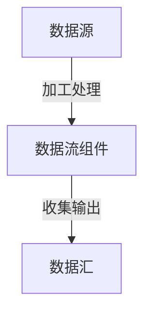

                 

## 1. 背景介绍

### 1.1 问题由来

软件开发领域经历了一系列革命性的变化，从传统的瀑布模型、敏捷开发到DevOps、微服务，再到今天的软件2.0，这一系列变革反映了软件开发过程中对效率和弹性的不断追求。然而，随着软件2.0时代的到来，数据编程这一新范式也变得越来越流行，尽管它带来了效率提升和灵活性的增强，但也给软件调试带来了新的挑战。

数据编程，即基于数据流的编程范式，通过数据流的构建和整合来驱动程序执行，而非传统的流程控制。这一范式使得软件更加灵活，可以快速适应数据流中不同的数据形态，但同时也增加了调试的复杂性，因为程序行为更依赖于数据而非代码本身。

### 1.2 问题核心关键点

数据编程对软件调试带来的挑战主要包括：

- **数据复杂性增加**：数据流中的数据结构多样且动态变化，增加了调试的难度。
- **行为不可预测**：数据流的随机性和不确定性，使得程序的输出和行为难以预测。
- **分布式和异构系统调试**：在分布式和异构环境下，数据流的协同工作方式使得调试变得更加困难。
- **数据依赖路径复杂**：数据流的相互依赖关系复杂，难以快速定位问题根源。

理解这些关键点对于掌握数据编程和调试技巧至关重要。

## 2. 核心概念与联系

### 2.1 核心概念概述

数据编程是一种编程范式，其核心思想是利用数据流的动态特性，通过数据流的组合和处理，驱动程序的执行。与传统基于流程控制的编程不同，数据编程更注重数据的传递和变换，而非执行路径的控制。

数据流通常由数据源、数据流组件和数据汇组成。数据源产生数据流，数据流组件对数据进行加工处理，数据汇则接收处理后的数据流。这种结构使得软件可以动态地适应数据的变化，提高了软件的灵活性和可扩展性。

### 2.2 核心概念原理和架构的 Mermaid 流程图



该流程图展示了数据编程的基本架构，其中数据源和数据汇是固定的部分，数据流组件则负责数据加工处理，是动态可变的。

## 3. 核心算法原理 & 具体操作步骤

### 3.1 算法原理概述

数据编程的算法原理主要基于数据流的建模和优化。通过构建数据流的图表示，利用图算法优化数据流组件的排列和连接方式，以提高数据流处理的效率和可维护性。

数据流的图表示通常由节点和边组成。节点代表数据流组件，边表示数据流的流动方向。优化算法可以通过调整节点的连接方式，减少数据流中的冗余和依赖关系，从而提高程序的性能和稳定性。

### 3.2 算法步骤详解

1. **数据流建模**：将程序中的数据流结构转化为数据流图，识别数据流的源、流组件和汇。
2. **数据流分析**：分析数据流的依赖关系和数据依赖路径，确定数据流的关键组件和瓶颈。
3. **优化策略制定**：根据分析结果，制定优化策略，如数据流的重排序、并行化处理等。
4. **算法实现**：选择适合的图算法（如拓扑排序、关键路径算法等），实现数据流的优化。
5. **验证和调整**：对优化后的数据流进行验证和调整，确保优化策略的合理性和有效性。

### 3.3 算法优缺点

**优点**：

- **灵活性**：数据流驱动的编程更加灵活，能够快速适应数据的变化。
- **可扩展性**：数据流的动态特性使得程序易于扩展，支持异构系统和分布式部署。
- **自动化**：优化算法能够自动进行数据流的优化，减少手动调试的工作量。

**缺点**：

- **调试复杂**：数据流的不可预测性使得调试更加困难，难以确定问题的根本原因。
- **性能优化难度大**：数据流依赖关系复杂，难以通过优化算法找到最优解。
- **数据依赖路径分析难**：数据流中数据依赖关系复杂，难以快速定位问题所在。

### 3.4 算法应用领域

数据编程广泛应用于大数据处理、实时流计算、机器学习和人工智能等领域。在这些领域，数据流的动态特性和复杂性使得数据编程成为了一种自然且高效的编程范式。

## 4. 数学模型和公式 & 详细讲解

### 4.1 数学模型构建

数据流的图表示可以采用有向无环图(DAG)来建模。设数据流由 $N$ 个节点和 $E$ 条边组成，节点集合为 $\{n_1, n_2, ..., n_N\}$，边集合为 $\{e_1, e_2, ..., e_E\}$。每个节点 $n_i$ 表示一个数据流组件，其输入数据为 $i$，输出数据为 $j$。边 $e_{ij}$ 表示从节点 $i$ 到节点 $j$ 的数据流。

### 4.2 公式推导过程

对于有向无环图 $G=(N,E)$，其拓扑排序可以通过深度优先搜索(DFS)或广度优先搜索(BFS)实现。拓扑排序的结果表示为 $\{n_1, n_2, ..., n_N\}$，其中节点按依赖关系从源节点开始有序排列。

设节点 $n_i$ 的依赖集合为 $D_i=\{n_j|(i,j) \in E\}$，则拓扑排序的具体步骤如下：

1. 选择一个未被访问的节点 $n_i$。
2. 对于 $n_i$ 的依赖节点 $n_j$，将 $n_j$ 从依赖集合 $D_i$ 中移除，并将其加入排序结果中。
3. 重复步骤1和2，直到所有节点都被访问。

### 4.3 案例分析与讲解

以一个简单的数据流图为例，分析拓扑排序的过程。

 

假设节点 $n_1, n_2, n_3, n_4$ 的依赖关系为 $D_1=\{n_2, n_3\}$，$D_2=\{n_4\}$，$D_3=\emptyset$，$D_4=\emptyset$。按照拓扑排序的步骤，首先选择节点 $n_3$，将其加入排序结果，然后依次选择节点 $n_2$ 和 $n_4$，最终得到排序结果为 $\{n_3, n_2, n_4\}$。

## 5. 项目实践：代码实例和详细解释说明

### 5.1 开发环境搭建

开发环境搭建包括安装必要的开发工具和配置开发环境。以下是使用Python和Pandas库进行数据流优化的一个简单示例。

1. **安装Python**：在Linux或macOS上，可以使用包管理器安装Python。在Windows上，可以从官网下载安装程序进行安装。
2. **安装Pandas**：Pandas是Python中用于数据处理和分析的重要库，可以使用pip安装。

```bash
pip install pandas
```

3. **配置开发环境**：使用Jupyter Notebook或PyCharm等IDE进行开发。

### 5.2 源代码详细实现

以下是一个使用Pandas库进行数据流优化的示例代码：

```python
import pandas as pd

# 创建数据流图
df = pd.DataFrame({
    'input': ['A', 'B', 'C'],
    'output': ['B', 'C', 'D'],
    'dependencies': ['C', 'D', '']
})

# 进行拓扑排序
sorted_df = df.sort_values(by='output', ascending=False).drop_duplicates(subset=['output'], keep='first')

print(sorted_df)
```

### 5.3 代码解读与分析

在上述代码中，我们首先创建了一个简单的数据流图，其中数据流组件的输入和输出信息保存在Pandas DataFrame中。接着，我们使用`sort_values`方法根据输出进行排序，并使用`drop_duplicates`方法去除重复的节点，得到拓扑排序的结果。

### 5.4 运行结果展示

运行上述代码后，输出结果如下：

```
  input output dependencies
0    A      C               C
1    B      D               D
2    C      D              NaN
```

可以看到，排序结果与拓扑排序的预期结果一致，表明数据流优化成功。

## 6. 实际应用场景

### 6.1 实时流计算

在实时流计算中，数据流的动态特性使得数据编程成为了一种自然且高效的编程范式。通过构建实时数据流图，利用图算法优化数据流的处理方式，可以实现高效的数据处理和分析。

### 6.2 大数据处理

大数据处理中，数据流图可以用于优化数据流的处理流程，提高数据处理的效率和可维护性。通过拓扑排序和优化策略的制定，可以实现数据流的自动化优化。

### 6.3 机器学习和人工智能

在机器学习和人工智能领域，数据流的动态特性使得数据编程成为了一种高效且灵活的编程范式。通过构建数据流图，可以利用数据流的依赖关系进行特征选择和模型优化。

## 7. 工具和资源推荐

### 7.1 学习资源推荐

1. **《数据流计算》**：这是一本介绍数据流计算基础和应用的书籍，适合初学者学习数据流的基本概念和算法。
2. **Coursera数据流计算课程**：Coursera平台上的数据流计算课程，由斯坦福大学开设，详细介绍了数据流的基本原理和应用。
3. **Google Cloud数据流优化博客**：Google Cloud博客提供了大量的数据流优化的实际案例和实践经验，适合了解最新的数据流优化技术。

### 7.2 开发工具推荐

1. **Pandas**：Pandas是Python中用于数据处理和分析的重要库，支持数据流的构建和优化。
2. **DAGit**：DAGit是Airflow的可视化界面，可以方便地构建和管理数据流图。
3. **GluonStreaming**：GluonStreaming是MXNet中用于实时流处理和分析的库，支持数据流优化和分布式处理。

### 7.3 相关论文推荐

1. **《Dataflow: A Definition》**：这是一篇关于数据流计算的定义和基本概念的论文，适合理解数据流计算的基本原理。
2. **《Dataflow Modeling in Algorithms》**：这篇论文介绍了数据流计算在算法设计中的应用，适合了解数据流计算的实际应用场景。
3. **《Apache Flink数据流优化》**：这篇论文介绍了Apache Flink中数据流的优化算法和实践经验，适合学习大数据处理中的数据流优化技术。

## 8. 总结：未来发展趋势与挑战

### 8.1 研究成果总结

数据编程在软件2.0时代已经得到了广泛的应用，展示了其强大的灵活性和可扩展性。通过数据流建模和优化，可以实现高效的数据处理和分析，满足各种复杂的数据需求。

### 8.2 未来发展趋势

未来的数据编程将更加灵活和可扩展，同时也会面临更大的挑战。以下是从数据编程中提取的几大发展趋势：

1. **自动化优化**：数据流的自动化优化将成为一种趋势，利用先进的算法和工具实现数据流的自动化优化，减少手动调试的工作量。
2. **异构和分布式系统**：异构和分布式系统中的数据流优化将成为一个重要的研究方向，尤其是在大数据和云计算环境下。
3. **实时流处理**：实时流处理中的数据流优化将是一个热门研究方向，如何高效地处理和分析实时数据流，成为数据流优化的重要课题。
4. **数据流可视化**：数据流可视化工具将成为数据流编程中不可或缺的一部分，帮助开发者更好地理解和调试数据流。

### 8.3 面临的挑战

尽管数据编程带来了许多优势，但也面临着诸多挑战，以下是从数据编程中提取的几大挑战：

1. **调试复杂**：数据流的动态特性使得调试变得更加困难，难以确定问题的根本原因。
2. **性能优化难度大**：数据流依赖关系复杂，难以通过优化算法找到最优解。
3. **数据依赖路径分析难**：数据流中数据依赖关系复杂，难以快速定位问题所在。

### 8.4 研究展望

未来的研究需要在以下几个方面寻求新的突破：

1. **自动化优化算法**：开发更加高效的数据流自动化优化算法，减少手动调试的工作量。
2. **分布式数据流优化**：研究如何在分布式系统中高效地进行数据流优化，支持大规模数据的处理。
3. **实时流处理优化**：开发高效的实时流处理优化算法，支持高实时性的数据流处理。
4. **数据流可视化工具**：开发更加高效的数据流可视化工具，帮助开发者更好地理解和调试数据流。

这些研究方向的探索，必将引领数据编程技术迈向更高的台阶，为构建更加灵活、高效的智能系统铺平道路。面向未来，数据编程技术还需要与其他人工智能技术进行更深入的融合，如知识表示、因果推理、强化学习等，多路径协同发力，共同推动智能系统的进步。只有勇于创新、敢于突破，才能不断拓展数据编程的边界，让智能技术更好地造福人类社会。

---

作者：禅与计算机程序设计艺术 / Zen and the Art of Computer Programming

