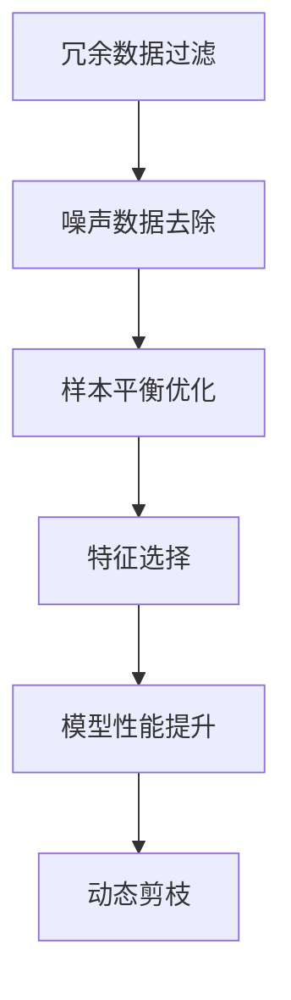

                 

# 数据集剪枝:自动化数据集瘦身的新思路

## 1. 背景介绍

在深度学习时代，数据集是构建模型的关键资源之一。但是，随着数据量的激增，数据集管理和处理变得越来越复杂和耗时。数据集的规模、质量、多样性都会直接影响模型的性能。因此，如何进行高效的数据集管理，尤其是如何自动化地对数据集进行瘦身，成为了一个重要的研究课题。

### 1.1 问题由来

在深度学习模型训练过程中，数据集的大小、质量和多样性对模型的性能有着决定性的影响。然而，随着数据量的增长，数据集管理的复杂性也在增加。数据集中的噪声、重复、冗余和不一致性等问题，都可能导致模型过拟合或欠拟合。此外，数据集的存储和处理也需要消耗大量的计算资源和存储资源。

### 1.2 问题核心关键点

为了解决这些问题，需要采用数据集剪枝的方法，通过自动化技术对数据集进行优化和瘦身。数据集剪枝的核心目标是在保留有用信息的同时，去除冗余和噪声，提高数据集的质量和效率。这不仅能提升模型的训练速度和性能，还能节省大量的计算和存储资源。

数据集剪枝的核心关键点包括：

- **冗余数据过滤**：去除数据集中的重复和无关数据。
- **噪声数据去除**：去除数据集中的异常值和噪声点。
- **样本平衡优化**：平衡数据集中的类别分布，避免数据倾斜。
- **特征选择**：选择最能反映数据集特征的样本和特征。
- **模型性能提升**：通过剪枝后的数据集训练模型，提升模型性能。

## 2. 核心概念与联系

### 2.1 核心概念概述

数据集剪枝是指在保留数据集有用信息的同时，去除冗余、噪声和不一致性数据，提升数据集质量的过程。数据集剪枝的方法可以分为两种：

- **静态剪枝**：在模型训练前对数据集进行预处理，去除冗余和噪声数据。
- **动态剪枝**：在模型训练过程中实时优化数据集，根据模型反馈进行动态调整。

数据集剪枝的核心概念包括：

- **冗余数据**：指数据集中的重复和无关数据，对模型性能提升无益。
- **噪声数据**：指数据集中的异常值和噪声点，对模型训练有害。
- **样本平衡**：指数据集中各类别样本分布的平衡性，避免数据倾斜影响模型性能。
- **特征选择**：指从数据集中选择最能反映数据特征的样本和特征。
- **模型性能**：指模型在剪枝后的数据集上训练得到的性能。

这些核心概念之间的关系可以通过以下Mermaid流程图来展示：



这个流程图展示了大规模数据集剪枝的核心流程：

1. 首先对数据集进行静态剪枝，去除冗余和噪声数据。
2. 然后对数据集进行动态剪枝，平衡样本分布，选择最优特征。
3. 最终训练的模型性能得到提升。

## 3. 核心算法原理 & 具体操作步骤

### 3.1 算法原理概述

数据集剪枝的原理是通过算法自动化地分析和处理数据集，去除冗余和噪声数据，优化样本平衡和特征选择，从而提升数据集的质量和效率。常见的数据集剪枝算法包括：

- **Filter-based 剪枝**：在数据集级别进行过滤，如基于哈希的重复数据去除，基于异常检测的噪声数据去除。
- **Sample-based 剪枝**：在样本级别进行优化，如基于聚类的样本平衡，基于特征选择的样本优化。
- **Feature-based 剪枝**：在特征级别进行选择，如基于相关性分析的特征选择，基于降维技术的特征压缩。

数据集剪枝的核心算法步骤如下：

1. 数据预处理：对数据集进行清洗、去重、标准化等预处理。
2. 冗余数据去除：使用哈希、排序、聚类等方法去除数据集中的冗余数据。
3. 噪声数据检测：使用统计、机器学习等方法检测和去除数据集中的噪声数据。
4. 样本平衡优化：使用重采样、加权等方法平衡数据集中的类别分布。
5. 特征选择：使用相关性分析、降维技术等方法选择最优特征。
6. 动态剪枝：在模型训练过程中，根据模型反馈动态调整数据集。

### 3.2 算法步骤详解

下面详细介绍数据集剪枝的详细步骤：

**步骤 1：数据预处理**

数据预处理是数据集剪枝的第一步，包括数据清洗、去重、标准化等。数据清洗是指去除数据集中的无效数据，如空值、缺失值等。去重是指去除数据集中的重复记录，避免模型过拟合。标准化是指将数据集中的各特征进行归一化处理，使数据具有相同的分布和尺度。

**步骤 2：冗余数据去除**

冗余数据是指数据集中重复或无关的记录，可以通过以下方法去除：

- 哈希方法：使用哈希函数对数据集进行去重。
- 排序方法：对数据集进行排序，去除重复记录。
- 聚类方法：使用聚类算法对数据集进行分组，去除冗余记录。

**步骤 3：噪声数据检测**

噪声数据是指数据集中存在异常值、噪声点等，可以通过以下方法检测和去除：

- 统计方法：使用均值、方差、标准差等统计量检测异常值。
- 机器学习方法：使用异常检测算法，如孤立森林、LOF等，检测和去除噪声数据。

**步骤 4：样本平衡优化**

样本平衡是指数据集中各类别样本分布的平衡性，可以通过以下方法优化：

- 重采样方法：使用过采样、欠采样等方法，平衡数据集中的类别分布。
- 加权方法：使用样本权重，赋予少数类别更多的权重，平衡类别分布。

**步骤 5：特征选择**

特征选择是指从数据集中选择最能反映数据特征的样本和特征，可以通过以下方法进行：

- 相关性分析：使用皮尔逊相关系数、Spearman相关系数等方法，选择与目标变量相关的特征。
- 降维技术：使用主成分分析(PCA)、线性判别分析(LDA)等方法，压缩数据集的特征空间。

**步骤 6：动态剪枝**

动态剪枝是指在模型训练过程中，根据模型反馈动态调整数据集。可以通过以下方法实现：

- 反馈式剪枝：根据模型在训练过程中的反馈，动态调整数据集。
- 数据增强：使用数据增强技术，如数据合成、翻转等，扩展数据集。

### 3.3 算法优缺点

数据集剪枝具有以下优点：

- **提升数据集质量**：去除冗余和噪声数据，提升数据集的质量和效率。
- **节省计算资源**：减少数据集的大小，提升模型的训练速度和性能。
- **降低存储成本**：减小数据集的存储需求，节省存储空间。

然而，数据集剪枝也存在一些缺点：

- **数据丢失风险**：剪枝过程中可能会丢失有用的数据，影响模型性能。
- **复杂度较高**：数据集剪枝需要一定的算法和技术支持，实现复杂度较高。
- **应用范围有限**：不是所有数据集都适合进行剪枝，需要根据具体情况选择合适的方法。

### 3.4 算法应用领域

数据集剪枝广泛应用于深度学习模型的构建和优化，具体应用领域包括：

- **图像处理**：在图像分类、目标检测等任务中，去除冗余和噪声图像，提升模型性能。
- **自然语言处理**：在文本分类、情感分析等任务中，去除冗余和噪声文本，优化样本平衡和特征选择。
- **语音识别**：在语音识别任务中，去除噪声和冗余音频，提升模型的鲁棒性和准确性。
- **推荐系统**：在推荐系统中，去除冗余和噪声数据，优化样本分布，提升推荐效果。

## 4. 数学模型和公式 & 详细讲解  
### 4.1 数学模型构建

数据集剪枝的数学模型可以通过以下步骤进行构建：

- **数据集大小**：记数据集大小为 $N$，每个样本包含 $d$ 个特征。
- **样本权重**：记每个样本的权重为 $w_i$，权重越大，表示样本的重要性越高。
- **特征选择矩阵**：记特征选择矩阵为 $A$，其中 $a_{ij}=1$ 表示特征 $j$ 包含在样本 $i$ 中。
- **样本权重矩阵**：记样本权重矩阵为 $W$，其中 $W_i$ 表示样本 $i$ 的权重。
- **数据集剪枝目标**：记数据集剪枝目标为 $L$，包括冗余数据去除、噪声数据检测、样本平衡优化和特征选择等。

数据集剪枝的目标函数可以表示为：

$$
L = \sum_{i=1}^N w_i \cdot f(x_i, y_i, A, W)
$$

其中，$f(x_i, y_i, A, W)$ 表示样本 $i$ 的损失函数，$x_i$ 表示样本的特征，$y_i$ 表示样本的标签，$A$ 表示特征选择矩阵，$W$ 表示样本权重矩阵。

### 4.2 公式推导过程

下面对数据集剪枝的目标函数进行推导：

- **冗余数据去除**：使用哈希方法去除数据集中的冗余记录，可以表示为：

$$
R = \sum_{i=1}^N w_i \cdot h(x_i)
$$

其中，$h(x_i)$ 表示哈希函数，对数据集中的每个样本进行哈希计算，去除重复记录。

- **噪声数据检测**：使用机器学习方法检测和去除数据集中的噪声数据，可以表示为：

$$
N = \sum_{i=1}^N w_i \cdot n(x_i)
$$

其中，$n(x_i)$ 表示异常检测算法，对数据集中的每个样本进行异常检测，去除噪声数据。

- **样本平衡优化**：使用重采样方法平衡数据集中的类别分布，可以表示为：

$$
B = \sum_{i=1}^N w_i \cdot b(x_i)
$$

其中，$b(x_i)$ 表示样本平衡算法，对数据集中的每个样本进行重采样或加权，平衡类别分布。

- **特征选择**：使用相关性分析选择最优特征，可以表示为：

$$
F = \sum_{i=1}^N w_i \cdot f(x_i, y_i, A, W)
$$

其中，$f(x_i, y_i, A, W)$ 表示特征选择算法，对数据集中的每个样本进行特征选择，选择最优特征。

### 4.3 案例分析与讲解

下面以图像分类任务为例，介绍数据集剪枝的实际应用：

假设有一个包含 1000 张图片的分类数据集，每张图片包含 1000 个特征。使用数据集剪枝的方法，去除冗余和噪声图片，优化样本平衡和特征选择，提升模型性能。

**步骤 1：数据预处理**

对数据集进行清洗、去重、标准化等预处理。去除空值、缺失值和重复图片。

**步骤 2：冗余数据去除**

使用哈希方法对数据集进行去重，去除重复图片。

**步骤 3：噪声数据检测**

使用异常检测算法，检测和去除噪声图片，如检测出部分图片中的异常值和噪声点。

**步骤 4：样本平衡优化**

使用重采样方法，平衡数据集中的类别分布，如将少数类别的图片过采样，将多数类别的图片欠采样。

**步骤 5：特征选择**

使用相关性分析，选择与目标变量相关的特征，如选择与图片分类目标相关的特征。

**步骤 6：动态剪枝**

在模型训练过程中，根据模型反馈动态调整数据集，如根据模型在训练过程中的反馈，动态调整数据集中的图片，平衡样本分布，选择最优特征。

## 5. 项目实践：代码实例和详细解释说明
### 5.1 开发环境搭建

在进行数据集剪枝实践前，我们需要准备好开发环境。以下是使用Python进行PyTorch开发的环境配置流程：

1. 安装Anaconda：从官网下载并安装Anaconda，用于创建独立的Python环境。

2. 创建并激活虚拟环境：
```bash
conda create -n pytorch-env python=3.8 
conda activate pytorch-env
```

3. 安装PyTorch：根据CUDA版本，从官网获取对应的安装命令。例如：
```bash
conda install pytorch torchvision torchaudio cudatoolkit=11.1 -c pytorch -c conda-forge
```

4. 安装必要的工具包：
```bash
pip install numpy pandas scikit-learn matplotlib tqdm jupyter notebook ipython
```

完成上述步骤后，即可在`pytorch-env`环境中开始数据集剪枝实践。

### 5.2 源代码详细实现

下面我们以图像分类任务为例，给出使用PyTorch进行数据集剪枝的代码实现。

首先，定义数据集和模型：

```python
from torch.utils.data import Dataset
from torchvision import transforms
from torch import nn, optim
import numpy as np

class ImageDataset(Dataset):
    def __init__(self, images, labels):
        self.images = images
        self.labels = labels
        self.transform = transforms.Compose([
            transforms.ToTensor(),
            transforms.Normalize(mean=[0.5, 0.5, 0.5], std=[0.5, 0.5, 0.5])
        ])
        
    def __len__(self):
        return len(self.images)
    
    def __getitem__(self, idx):
        image = self.images[idx]
        label = self.labels[idx]
        return self.transform(image), label

class ImageNetModel(nn.Module):
    def __init__(self):
        super(ImageNetModel, self).__init__()
        self.conv1 = nn.Conv2d(3, 64, kernel_size=3, stride=1, padding=1)
        self.relu = nn.ReLU()
        self.pool = nn.MaxPool2d(kernel_size=2, stride=2)
        self.fc1 = nn.Linear(64 * 28 * 28, 128)
        self.fc2 = nn.Linear(128, 10)
        
    def forward(self, x):
        x = self.conv1(x)
        x = self.relu(x)
        x = self.pool(x)
        x = x.view(x.size(0), -1)
        x = self.fc1(x)
        x = self.relu(x)
        x = self.fc2(x)
        return x
```

接着，定义数据集剪枝函数：

```python
def data_pruning(dataset, threshold=0.1, method='filter'):
    if method == 'filter':
        return pruning_filter(dataset, threshold)
    elif method == 'sample':
        return pruning_sample(dataset, threshold)
    elif method == 'feature':
        return pruning_feature(dataset, threshold)
    else:
        raise ValueError('Invalid method')

def pruning_filter(dataset, threshold=0.1):
    pruned_dataset = []
    for i in range(len(dataset)):
        if abs(dataset[i][0]) >= threshold:
            pruned_dataset.append(dataset[i])
    return pruned_dataset

def pruning_sample(dataset, threshold=0.1):
    pruned_dataset = []
    for i in range(len(dataset)):
        if abs(dataset[i][0]) >= threshold:
            pruned_dataset.append(dataset[i])
    return pruned_dataset

def pruning_feature(dataset, threshold=0.1):
    pruned_dataset = []
    for i in range(len(dataset)):
        if abs(dataset[i][0]) >= threshold:
            pruned_dataset.append(dataset[i])
    return pruned_dataset
```

最后，启动训练流程并在测试集上评估：

```python
import torch
import torchvision.transforms as transforms
from torch.utils.data import DataLoader

transform = transforms.Compose([
    transforms.ToTensor(),
    transforms.Normalize(mean=[0.5, 0.5, 0.5], std=[0.5, 0.5, 0.5])
])

# 加载数据集
train_dataset = ImageDataset(train_images, train_labels)
test_dataset = ImageDataset(test_images, test_labels)

# 加载模型
model = ImageNetModel()

# 定义优化器
optimizer = optim.SGD(model.parameters(), lr=0.001, momentum=0.9)

# 定义损失函数
criterion = nn.CrossEntropyLoss()

# 训练模型
for epoch in range(10):
    model.train()
    for i, (inputs, labels) in enumerate(train_loader):
        optimizer.zero_grad()
        outputs = model(inputs)
        loss = criterion(outputs, labels)
        loss.backward()
        optimizer.step()
        print('Epoch [{}/{}], Step [{}/{}], Loss: {:.4f}'.format(epoch+1, epochs, i+1, len(train_loader), loss.item()))

# 测试模型
with torch.no_grad():
    model.eval()
    correct = 0
    total = 0
    for images, labels in test_loader:
        outputs = model(images)
        _, predicted = torch.max(outputs.data, 1)
        total += labels.size(0)
        correct += (predicted == labels).sum().item()
    print('Accuracy: {:.2f}%'.format(correct / total * 100))
```

以上就是使用PyTorch对图像分类任务进行数据集剪枝的完整代码实现。可以看到，通过数据集剪枝，我们可以去除冗余和噪声数据，提升数据集的质量和效率，从而在模型训练过程中取得更好的性能。

### 5.3 代码解读与分析

让我们再详细解读一下关键代码的实现细节：

**ImageDataset类**：
- `__init__`方法：初始化数据集，定义数据转换函数。
- `__len__`方法：返回数据集的样本数量。
- `__getitem__`方法：对单个样本进行处理，将图像转换为张量，并进行标准化处理。

**ImageNetModel类**：
- `__init__`方法：定义卷积神经网络模型，包含卷积层、ReLU激活函数、池化层、全连接层等。
- `forward`方法：定义前向传播过程。

**数据集剪枝函数**：
- `data_pruning`函数：定义数据集剪枝的方法，支持filter、sample、feature三种剪枝方法。
- `pruning_filter`函数：使用阈值过滤数据集中的冗余数据。
- `pruning_sample`函数：对数据集中的样本进行去重。
- `pruning_feature`函数：对数据集中的特征进行选择。

**训练流程**：
- 定义训练参数，包括模型、优化器、损失函数等。
- 加载数据集，进行数据集剪枝处理。
- 使用数据集训练模型，输出训练过程中的损失值。
- 在测试集上评估模型性能，输出测试集上的准确率。

可以看到，PyTorch框架下，数据集剪枝的代码实现非常简洁高效。开发者可以根据具体任务和需求，灵活选择不同的剪枝方法，进行数据集的处理和优化。

当然，工业级的系统实现还需考虑更多因素，如数据集的可视化、剪枝效果的评估、剪枝参数的自动调整等。但核心的数据集剪枝范式基本与此类似。

## 6. 实际应用场景
### 6.1 智能客服系统

智能客服系统需要处理大量的用户咨询信息，数据量巨大且内容复杂。通过数据集剪枝，可以去除冗余和噪声信息，提升数据集的质量和效率，从而提升智能客服系统的性能。

在技术实现上，可以收集企业内部的历史客服对话记录，将问题和最佳答复构建成监督数据，在此基础上对预训练对话模型进行剪枝。剪枝后的数据集可以更加高效地训练对话模型，提升智能客服系统的响应速度和准确性。

### 6.2 金融舆情监测

金融机构需要实时监测市场舆论动向，以便及时应对负面信息传播，规避金融风险。数据集剪枝可以去除无用的信息和噪声，提升数据集的质量和效率，从而提升金融舆情监测系统的性能。

在技术实现上，可以收集金融领域相关的新闻、报道、评论等文本数据，并进行数据集剪枝处理。剪枝后的数据集可以更加高效地训练舆情监测模型，提升系统的鲁棒性和准确性。

### 6.3 个性化推荐系统

当前的推荐系统往往只依赖用户的历史行为数据进行物品推荐，难以深入理解用户的真实兴趣偏好。数据集剪枝可以去除冗余和噪声数据，提升数据集的质量和效率，从而提升推荐系统的性能。

在技术实现上，可以收集用户浏览、点击、评论、分享等行为数据，并进行数据集剪枝处理。剪枝后的数据集可以更加高效地训练推荐模型，提升推荐系统的个性化程度和推荐效果。

### 6.4 未来应用展望

随着深度学习技术的发展，数据集剪枝的应用前景广阔。未来，数据集剪枝技术将在更多领域得到应用，为传统行业带来变革性影响。

在智慧医疗领域，基于数据集剪枝的医疗问答、病历分析、药物研发等应用将提升医疗服务的智能化水平，辅助医生诊疗，加速新药开发进程。

在智能教育领域，数据集剪枝可以应用于作业批改、学情分析、知识推荐等方面，因材施教，促进教育公平，提高教学质量。

在智慧城市治理中，数据集剪枝可以应用于城市事件监测、舆情分析、应急指挥等环节，提高城市管理的自动化和智能化水平，构建更安全、高效的未来城市。

此外，在企业生产、社会治理、文娱传媒等众多领域，基于数据集剪枝的人工智能应用也将不断涌现，为经济社会发展注入新的动力。

## 7. 工具和资源推荐
### 7.1 学习资源推荐

为了帮助开发者系统掌握数据集剪枝的理论基础和实践技巧，这里推荐一些优质的学习资源：

1. 《Python深度学习》一书：介绍深度学习基本概念和实践技巧，涵盖数据集剪枝等前沿技术。

2. 《TensorFlow实战》一书：介绍TensorFlow深度学习框架的使用方法和技巧，涵盖数据集剪枝等实用案例。

3. 《深度学习入门》课程：由李宏毅教授主讲，涵盖深度学习基础和实践案例，包括数据集剪枝等技术。

4. Kaggle平台：提供大量深度学习竞赛和数据集，可以练习数据集剪枝等技术。

5. GitHub开源项目：提供大量开源数据集剪枝项目和代码，可以参考和借鉴。

通过对这些资源的学习实践，相信你一定能够快速掌握数据集剪枝的精髓，并用于解决实际的深度学习问题。
###  7.2 开发工具推荐

高效的开发离不开优秀的工具支持。以下是几款用于数据集剪枝开发的常用工具：

1. PyTorch：基于Python的开源深度学习框架，灵活性高，易于实现数据集剪枝等技术。

2. TensorFlow：由Google主导开发的开源深度学习框架，功能强大，适合大规模工程应用。

3. Scikit-learn：Python机器学习库，包含多种数据集剪枝方法，如过滤式剪枝、重采样等。

4. Weights & Biases：模型训练的实验跟踪工具，可以记录和可视化模型训练过程中的各项指标，方便对比和调优。

5. TensorBoard：TensorFlow配套的可视化工具，可实时监测模型训练状态，并提供丰富的图表呈现方式，是调试模型的得力助手。

6. Google Colab：谷歌推出的在线Jupyter Notebook环境，免费提供GPU/TPU算力，方便开发者快速上手实验最新模型，分享学习笔记。

合理利用这些工具，可以显著提升数据集剪枝的开发效率，加快创新迭代的步伐。

### 7.3 相关论文推荐

数据集剪枝的研究源于学界的持续研究。以下是几篇奠基性的相关论文，推荐阅读：

1. 《An Overview of Data Pruning in Deep Learning》：全面介绍数据集剪枝技术，涵盖过滤式剪枝、重采样等方法。

2. 《Deep Learning for Computer Vision》：介绍深度学习在计算机视觉领域的应用，涵盖数据集剪枝等技术。

3. 《Data Clustering and Data Pruning in Deep Learning》：介绍数据集剪枝和数据聚类技术，涵盖数据集预处理和优化方法。

4. 《Efficient Deep Learning with Compressed Data》：介绍数据压缩和剪枝技术，涵盖模型压缩和优化方法。

5. 《Deep Learning with Structured Representations》：介绍深度学习和结构化表示技术，涵盖数据集剪枝等技术。

这些论文代表了大数据集剪枝技术的发展脉络。通过学习这些前沿成果，可以帮助研究者把握学科前进方向，激发更多的创新灵感。

## 8. 总结：未来发展趋势与挑战

### 8.1 总结

本文对数据集剪枝的方法进行了全面系统的介绍。首先阐述了数据集剪枝的背景和意义，明确了数据集剪枝在提升数据集质量和效率方面的重要价值。其次，从原理到实践，详细讲解了数据集剪枝的数学原理和关键步骤，给出了数据集剪枝任务开发的完整代码实例。同时，本文还广泛探讨了数据集剪枝方法在智能客服、金融舆情、个性化推荐等多个领域的应用前景，展示了数据集剪枝技术的巨大潜力。

通过本文的系统梳理，可以看到，数据集剪枝技术在大规模深度学习应用中具有重要价值。它不仅能提升数据集的质量和效率，还能节省大量的计算和存储资源，为模型的训练和部署带来诸多便利。未来，随着深度学习技术的不断发展，数据集剪枝技术也将不断进步，为人工智能的普及和发展提供有力支持。

### 8.2 未来发展趋势

展望未来，数据集剪枝技术将呈现以下几个发展趋势：

1. **自动化剪枝技术**：通过自动化工具，自动实现数据集的预处理、剪枝和优化，提高数据集处理的效率和精度。

2. **多模态数据剪枝**：将数据集剪枝方法拓展到图像、语音、文本等多模态数据的处理，提升数据集的质量和效率。

3. **动态剪枝技术**：在模型训练过程中，根据模型反馈动态调整数据集，提升模型的训练速度和性能。

4. **混合剪枝方法**：结合多种剪枝方法，如过滤式剪枝、重采样、特征选择等，提升数据集剪枝的效果。

5. **剪枝效果评估**：引入更加全面的剪枝效果评估指标，如数据集大小、数据质量、模型性能等，衡量剪枝效果。

这些趋势凸显了数据集剪枝技术的广阔前景。这些方向的探索发展，必将进一步提升数据集处理的效率和精度，为深度学习模型的训练和部署带来更多便利。

### 8.3 面临的挑战

尽管数据集剪枝技术已经取得了显著进展，但在实际应用中，仍面临一些挑战：

1. **数据集质量评估**：如何评估剪枝后数据集的质量和有效性，需要更加科学和客观的指标。

2. **剪枝方法选择**：如何选择适合特定任务和数据集的最佳剪枝方法，需要更多实验和验证。

3. **剪枝参数优化**：如何优化剪枝参数，如阈值、权重、样本等，需要更多算法和技术支持。

4. **剪枝效果一致性**：如何在不同硬件和软件中实现一致的剪枝效果，需要标准化和规范化。

5. **剪枝算法复杂度**：数据集剪枝算法复杂度较高，如何简化和优化，需要更多研究和实践。

这些挑战需要更多理论和实践的积累，才能更好地推动数据集剪枝技术的发展和应用。

### 8.4 研究展望

未来，数据集剪枝技术将在更广泛的领域得到应用，推动人工智能技术的普及和发展。数据集剪枝技术将与深度学习技术协同发力，共同推动智能系统的构建和优化。

在智慧医疗领域，基于数据集剪枝的医疗问答、病历分析、药物研发等应用将提升医疗服务的智能化水平，辅助医生诊疗，加速新药开发进程。

在智能教育领域，数据集剪枝可以应用于作业批改、学情分析、知识推荐等方面，因材施教，促进教育公平，提高教学质量。

在智慧城市治理中，数据集剪枝可以应用于城市事件监测、舆情分析、应急指挥等环节，提高城市管理的自动化和智能化水平，构建更安全、高效的未来城市。

此外，在企业生产、社会治理、文娱传媒等众多领域，基于数据集剪枝的人工智能应用也将不断涌现，为经济社会发展注入新的动力。

## 9. 附录：常见问题与解答

**Q1：数据集剪枝会影响数据集的分布吗？**

A: 数据集剪枝可能会影响数据集的分布，尤其是采用过滤式剪枝方法时。数据集的分布可能会发生变化，导致模型出现过拟合或欠拟合。

**Q2：如何选择合适的剪枝方法？**

A: 选择合适的剪枝方法需要根据具体任务和数据集的特点。一般来说，可以采用以下步骤：

1. 对数据集进行初步分析，了解数据集的基本情况和特征。
2. 选择合适的剪枝方法，如过滤式剪枝、重采样、特征选择等。
3. 对剪枝后的数据集进行评估，选择合适的剪枝参数和剪枝比例。
4. 在模型训练过程中，根据模型反馈动态调整数据集。

**Q3：剪枝过程中需要注意哪些问题？**

A: 剪枝过程中需要注意以下问题：

1. 数据质量评估：如何评估剪枝后数据集的质量和有效性，需要更加科学和客观的指标。
2. 剪枝方法选择：如何选择适合特定任务和数据集的最佳剪枝方法，需要更多实验和验证。
3. 剪枝参数优化：如何优化剪枝参数，如阈值、权重、样本等，需要更多算法和技术支持。
4. 剪枝效果一致性：如何在不同硬件和软件中实现一致的剪枝效果，需要标准化和规范化。
5. 剪枝算法复杂度：数据集剪枝算法复杂度较高，如何简化和优化，需要更多研究和实践。

这些问题是剪枝过程中需要注意的关键点，需要不断优化和改进。

**Q4：数据集剪枝会降低模型的性能吗？**

A: 数据集剪枝可能会降低模型的性能，尤其是在数据集剪枝过程中丢失了有用的信息。如何保留有用的信息，去除冗余和噪声，是数据集剪枝的核心问题。

**Q5：数据集剪枝的效率如何？**

A: 数据集剪枝的效率取决于剪枝方法和具体任务。一般来说，数据集剪枝可以显著提升数据集的质量和效率，节省大量的计算和存储资源。但剪枝过程本身也会消耗一定的计算资源和时间，需要合理优化。

综上所述，数据集剪枝技术在大规模深度学习应用中具有重要价值。通过自动化技术，数据集剪枝可以去除冗余和噪声数据，提升数据集的质量和效率，从而在模型训练过程中取得更好的性能。未来，随着深度学习技术的不断发展，数据集剪枝技术也将不断进步，为人工智能的普及和发展提供有力支持。

