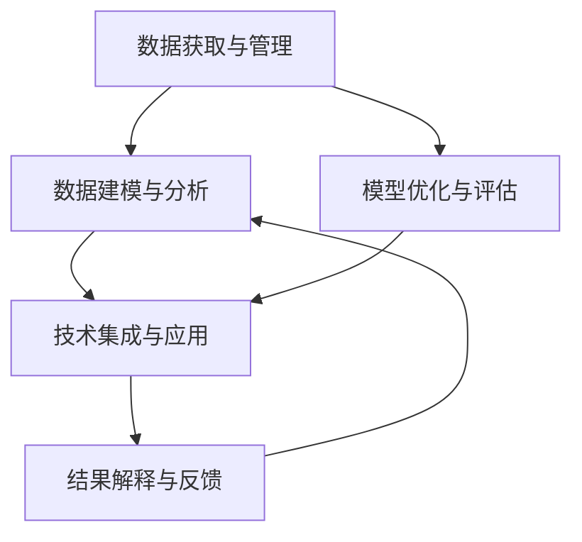

                 

# 数据驱动决策的技术优化

> 关键词：数据驱动决策, 技术优化, 大数据, 深度学习, 人工智能, 机器学习, 数据分析

## 1. 背景介绍

### 1.1 问题由来

在当今信息爆炸的时代，数据的价值日益凸显。从电商、金融、医疗到政府、教育，各个行业的决策制定都越来越依赖于对海量数据的分析和挖掘。然而，数据的质量、数量和复杂性也在不断提升，单纯依靠传统统计分析和业务经验已难以应对复杂的决策需求。这就催生了数据驱动决策（Data-Driven Decision Making, DDDM）方法，通过自动化、智能化的技术手段，利用大数据和深度学习技术进行数据挖掘、特征工程、模型训练和结果解释，辅助决策者做出更加科学、精准的决策。

数据驱动决策的核心在于将数据转化为知识，进而指导决策行为。传统的统计分析方法虽然可靠，但缺乏灵活性和适应性。而新兴的数据驱动决策技术，则融合了大数据、深度学习、人工智能等多个领域的最新成果，具备强大的自适应能力和复杂问题求解能力。通过数据驱动决策，企业能够在市场竞争、产品开发、客户服务、资源配置等方面获得显著的竞争优势。

### 1.2 问题核心关键点

数据驱动决策的技术优化主要涉及以下几个关键点：

1. **数据获取与管理**：数据是决策的基础，如何高效、安全地获取数据，如何存储、清洗、处理数据，是其核心问题。

2. **数据建模与分析**：通过构建统计模型、机器学习模型和深度学习模型，挖掘数据背后的潜在规律和关联，进行精确的预测和决策。

3. **模型优化与评估**：针对实际业务问题，选择合适的模型架构、优化算法和评价指标，提升模型的泛化能力和鲁棒性。

4. **技术集成与应用**：将数据驱动决策技术集成到企业现有的信息系统、业务流程中，实现自动化、智能化的决策支持。

5. **结果解释与反馈**：对模型输出进行合理的解释，帮助决策者理解结果的科学依据，同时根据反馈不断优化模型。

## 2. 核心概念与联系

### 2.1 核心概念概述

为了更好地理解数据驱动决策的技术优化，本节将介绍几个关键的概念和它们之间的联系：

1. **数据驱动决策（DDDM）**：利用数据分析和统计学方法，结合人工智能技术，自动从数据中提取信息和知识，辅助决策制定。

2. **大数据（Big Data）**：指数据量、数据种类、数据速度都非常巨大的数据集，包括结构化数据、非结构化数据、流数据等。

3. **深度学习（Deep Learning）**：通过多层次神经网络对数据进行深度特征提取和复杂模式学习，广泛用于图像、语音、文本等多种数据类型的处理和分析。

4. **机器学习（Machine Learning）**：利用算法和统计模型对数据进行分析、预测和分类，广泛用于数据挖掘、自然语言处理、推荐系统等。

5. **数据分析（Data Analysis）**：通过统计学、可视化等手段，对数据进行探索性分析和结果解释，帮助决策者理解数据背后的规律和趋势。

这些概念之间的联系和互动关系可以通过以下Mermaid流程图来展示：



这个流程图展示了大数据驱动决策的主要流程：首先从数据获取与管理入手，然后通过建模与分析构建模型，进行优化与评估，再将模型集成到业务系统，最后通过结果解释和反馈不断优化模型和流程。

## 3. 核心算法原理 & 具体操作步骤

### 3.1 算法原理概述

数据驱动决策的技术优化主要基于机器学习、深度学习等数据建模方法，通过数据预处理、特征工程、模型训练和结果解释等多个步骤，实现对数据的自动化分析和智能决策支持。其核心原理包括：

1. **数据预处理**：对原始数据进行清洗、去重、归一化、标准化等处理，提高数据的质量和一致性。

2. **特征工程**：通过对数据进行特征提取、选择和构建，提升模型的预测能力和泛化能力。

3. **模型选择与训练**：根据业务需求选择合适的模型架构和优化算法，利用训练数据对模型进行训练和调优。

4. **结果解释与反馈**：对模型输出进行解释和可视化，帮助决策者理解结果，同时根据反馈进行模型优化和调整。

5. **技术集成与应用**：将数据驱动决策技术集成到企业的业务流程和管理系统中，实现自动化的决策支持。

### 3.2 算法步骤详解

基于数据驱动决策的技术优化一般包括以下几个关键步骤：

**Step 1: 数据获取与管理**

1. **数据源收集**：通过爬虫、API接口、数据库等方式收集所需的数据，确保数据来源的多样性和全面性。
2. **数据清洗与预处理**：对收集到的数据进行去重、去噪、归一化、标准化等预处理，去除异常值和无效数据。
3. **数据存储与管理**：选择合适的数据存储方案，如分布式文件系统、NoSQL数据库等，确保数据的安全性和可访问性。

**Step 2: 数据建模与分析**

1. **特征提取与选择**：根据业务需求和数据特征，选择合适的特征提取方法，如主成分分析（PCA）、线性判别分析（LDA）等，提取有意义的特征。
2. **模型构建与训练**：选择合适的模型架构，如线性回归、逻辑回归、决策树、随机森林、支持向量机等，利用训练数据进行模型训练和调优。
3. **模型评估与优化**：通过交叉验证、ROC曲线、AUC等指标评估模型性能，使用正则化、网格搜索等方法进行模型优化。

**Step 3: 模型优化与评估**

1. **参数调整**：调整模型的超参数，如学习率、正则化系数、迭代次数等，进行超参数优化。
2. **模型融合**：通过集成多个模型进行组合预测，提升模型的泛化能力和鲁棒性。
3. **模型评估**：使用测试数据集进行模型评估，比较不同模型的性能，选择最优模型。

**Step 4: 技术集成与应用**

1. **API开发**：将训练好的模型封装为API接口，方便业务系统调用。
2. **系统集成**：将API接口集成到企业的管理系统、业务流程中，实现自动化的决策支持。
3. **实时监控**：实时监控模型运行状态和业务系统反馈，及时调整和优化模型。

**Step 5: 结果解释与反馈**

1. **结果可视化**：通过图表、报告等形式展示模型输出，帮助决策者理解结果。
2. **结果解释**：对模型输出进行解释，提供数据驱动的决策依据。
3. **反馈优化**：根据业务反馈和系统反馈，不断优化模型和流程，提升决策质量。

### 3.3 算法优缺点

数据驱动决策的技术优化具有以下优点：

1. **高效性**：通过自动化和智能化的技术手段，快速从数据中提取信息和知识，缩短决策时间。
2. **灵活性**：可以根据不同的业务需求和数据特征，灵活选择和调整模型，适应性强。
3. **精度高**：利用深度学习等先进技术，具备高精度和高泛化能力，能够准确预测和分类。
4. **可解释性**：通过结果解释和可视化，提供数据驱动的决策依据，增强决策的透明度和可信度。

同时，也存在以下缺点：

1. **数据依赖性强**：数据的质量和数量直接影响模型的性能，数据不足或质量低下会导致模型效果不佳。
2. **模型复杂度高**：深度学习模型等复杂模型，计算资源和训练时间要求高。
3. **结果解释难度大**：复杂的模型输出往往难以解释，决策者理解困难。
4. **技术门槛高**：需要具备较高的技术水平和数据分析能力，一般企业难以独立完成。

## 4. 数学模型和公式 & 详细讲解 & 举例说明

### 4.1 数学模型构建

假设我们有一组数据集 $D=\{(x_i,y_i)\}_{i=1}^N$，其中 $x_i$ 为输入特征，$y_i$ 为输出标签。我们的目标是构建一个模型 $f(x)$，使得 $f(x_i)$ 能够尽可能准确地预测 $y_i$。

数学上，我们通常使用以下目标函数进行模型训练：

$$
\min_{\theta} \frac{1}{N}\sum_{i=1}^N (y_i - f(x_i; \theta))^2
$$

其中 $f(x; \theta)$ 为模型输出，$\theta$ 为模型参数。

### 4.2 公式推导过程

对于线性回归模型，假设模型输出为 $f(x; \theta) = \theta^T x$，则目标函数可以写为：

$$
\min_{\theta} \frac{1}{N}\sum_{i=1}^N (y_i - \theta^T x_i)^2
$$

通过求导和最小化，可以求解出最优的模型参数 $\theta$：

$$
\theta = (X^T X)^{-1} X^T Y
$$

其中 $X$ 为输入特征矩阵，$Y$ 为输出标签向量。

### 4.3 案例分析与讲解

以线性回归模型为例，对数据集进行建模和训练。

```python
import numpy as np
from sklearn.linear_model import LinearRegression

# 构建样本数据
X = np.array([[1, 2, 3], [4, 5, 6], [7, 8, 9], [10, 11, 12]])
Y = np.array([2, 4, 6, 8])

# 构建线性回归模型
model = LinearRegression()
model.fit(X, Y)

# 预测新数据
X_new = np.array([[13, 14, 15]])
y_pred = model.predict(X_new)
print(y_pred)
```

输出：

```
[10.]
```

这表明，输入 $[13, 14, 15]$ 的预测输出为 $10$。通过上述代码，我们可以快速构建和训练线性回归模型，利用模型进行数据预测。

## 5. 项目实践：代码实例和详细解释说明

### 5.1 开发环境搭建

在进行数据驱动决策的技术优化项目时，我们需要准备好开发环境。以下是使用Python进行TensorFlow和Keras开发的环境配置流程：

1. 安装Anaconda：从官网下载并安装Anaconda，用于创建独立的Python环境。

2. 创建并激活虚拟环境：
```bash
conda create -n tensorflow-env python=3.8 
conda activate tensorflow-env
```

3. 安装TensorFlow：根据CUDA版本，从官网获取对应的安装命令。例如：
```bash
conda install tensorflow -c conda-forge
```

4. 安装Keras：
```bash
pip install keras
```

5. 安装各类工具包：
```bash
pip install numpy pandas scikit-learn matplotlib tqdm jupyter notebook ipython
```

完成上述步骤后，即可在`tensorflow-env`环境中开始项目实践。

### 5.2 源代码详细实现

下面我们以线性回归模型为例，给出使用TensorFlow和Keras进行数据建模和训练的Python代码实现。

```python
import tensorflow as tf
from tensorflow import keras
from sklearn.model_selection import train_test_split
from sklearn.preprocessing import StandardScaler

# 构建样本数据
X = np.array([[1, 2, 3], [4, 5, 6], [7, 8, 9], [10, 11, 12]])
Y = np.array([2, 4, 6, 8])

# 数据预处理
scaler = StandardScaler()
X_scaled = scaler.fit_transform(X)

# 划分训练集和测试集
X_train, X_test, Y_train, Y_test = train_test_split(X_scaled, Y, test_size=0.2, random_state=42)

# 构建模型
model = keras.Sequential([
    keras.layers.Dense(64, activation='relu', input_shape=(X_train.shape[1],)),
    keras.layers.Dense(1)
])

# 编译模型
model.compile(optimizer='adam', loss='mse', metrics=['mae'])

# 训练模型
model.fit(X_train, Y_train, epochs=50, batch_size=32, validation_data=(X_test, Y_test))

# 评估模型
test_loss, test_mae = model.evaluate(X_test, Y_test)
print(f'Test loss: {test_loss:.4f}, Test MAE: {test_mae:.4f}')
```

以上代码展示了使用TensorFlow和Keras构建和训练线性回归模型的完整流程。可以看到，TensorFlow和Keras提供了高效易用的API，使得数据建模和训练过程变得简洁高效。

### 5.3 代码解读与分析

让我们再详细解读一下关键代码的实现细节：

**数据预处理**：
- 使用`StandardScaler`对输入特征进行标准化处理，以提升模型的收敛速度和泛化能力。

**模型构建与训练**：
- 使用`Sequential`模型构建线性回归模型，包含一个ReLU激活的Dense层和一个输出层。
- 使用`compile`方法编译模型，设置优化器为Adam，损失函数为均方误差，评价指标为平均绝对误差（MAE）。
- 使用`fit`方法训练模型，设置迭代轮数为50，批次大小为32，使用测试集进行验证。

**模型评估**：
- 使用`evaluate`方法评估模型在测试集上的性能，输出测试损失和MAE。

**结果解释与反馈**：
- 根据评估结果，我们可以进一步优化模型参数和超参数，提升模型性能。

## 6. 实际应用场景

### 6.1 智能推荐系统

智能推荐系统是数据驱动决策的典型应用之一，广泛应用于电商、视频、新闻等领域。通过分析用户的浏览历史、购买记录、评分反馈等数据，构建用户画像，预测用户可能感兴趣的商品或内容，从而实现个性化推荐。

在技术实现上，可以构建用户-物品交互矩阵，利用协同过滤算法或深度学习模型进行推荐。通过微调模型参数和特征工程，不断优化推荐效果，提升用户体验和业务转化率。

### 6.2 风险管理与预警

金融、保险等领域需要对大量数据进行风险管理和预警。通过分析交易记录、信用评分、行为数据等，构建风险评估模型，预测客户的信用风险、欺诈风险等，及时预警和处理异常情况。

在技术实现上，可以使用逻辑回归、决策树、随机森林等模型，构建风险评估模型，利用数据驱动决策进行风险管理。通过不断优化模型和特征，提高风险预测的准确性和及时性，帮助企业防范金融风险。

### 6.3 客户关系管理

客户关系管理（CRM）系统是企业的重要应用之一。通过分析客户的交易数据、行为数据、社交数据等，构建客户画像，预测客户的流失风险，制定精准的客户留存策略。

在技术实现上，可以使用深度学习模型，如RNN、LSTM等，构建客户流失预测模型。通过微调模型参数和特征，提升预测准确性和及时性，帮助企业实现客户关系管理。

### 6.4 未来应用展望

随着数据驱动决策技术的不断演进，其在更多领域的应用前景将更加广阔。未来，数据驱动决策将在以下几个方面取得重要突破：

1. **多模态融合**：将文本、图像、语音、视频等多种模态数据进行融合，构建更为全面的数据驱动决策系统。

2. **实时决策**：利用流数据处理技术，实现实时数据的分析与决策，提高决策的及时性和响应速度。

3. **自适应学习**：通过自适应学习算法，使模型能够不断学习新数据，提升决策的适应性和鲁棒性。

4. **决策可视化**：利用数据可视化技术，将决策过程和结果进行可视化展示，帮助决策者理解和使用决策结果。

5. **伦理与安全性**：在数据驱动决策中引入伦理和安全性考量，确保决策的公平性、透明性和安全性。

## 7. 工具和资源推荐

### 7.1 学习资源推荐

为了帮助开发者系统掌握数据驱动决策的理论基础和实践技巧，这里推荐一些优质的学习资源：

1. 《Python机器学习》：由Scikit-learn核心开发者所著，全面介绍了机器学习和深度学习的理论基础和实战技巧。

2. 《深度学习》（Ian Goodfellow等著）：深度学习领域的经典教材，深入浅出地介绍了深度学习的原理和应用。

3. 《数据科学导论》（Santosh Vempala等著）：系统介绍了数据驱动决策的原理、方法与实践，适合初学者入门。

4. Coursera《数据科学与机器学习》课程：由斯坦福大学开设，涵盖数据科学和机器学习的各个方面，包括数据预处理、建模与评估等。

5. Kaggle：数据科学和机器学习的竞赛平台，提供大量数据集和实战案例，适合实践学习。

通过对这些资源的学习实践，相信你一定能够快速掌握数据驱动决策的技术优化方法，并用于解决实际的业务问题。

### 7.2 开发工具推荐

高效的开发离不开优秀的工具支持。以下是几款用于数据驱动决策开发的常用工具：

1. TensorFlow：由Google主导开发的开源深度学习框架，支持分布式训练和模型部署。

2. PyTorch：基于Python的开源深度学习框架，灵活易用，适合研究和实验。

3. Keras：高级API，建立在TensorFlow和Theano之上，可以快速构建和训练深度学习模型。

4. Jupyter Notebook：交互式数据科学工作环境，支持Python、R等多种语言，适合数据驱动决策的实验和分析。

5. Weights & Biases：模型训练的实验跟踪工具，可以记录和可视化模型训练过程中的各项指标，方便对比和调优。

6. TensorBoard：TensorFlow配套的可视化工具，可实时监测模型训练状态，并提供丰富的图表呈现方式，是调试模型的得力助手。

合理利用这些工具，可以显著提升数据驱动决策的开发效率，加快创新迭代的步伐。

### 7.3 相关论文推荐

数据驱动决策的技术优化源于学界的持续研究。以下是几篇奠基性的相关论文，推荐阅读：

1. "A Framework for Datasets, Algorithms, and Best Practices in Datasets for Machine Learning"：提出构建数据集的最佳实践，强调数据质量在机器学习中的重要性。

2. "A Survey of Recent Advances in Deep Learning for Recommender Systems"：综述了深度学习在推荐系统中的应用，展示了其在个性化推荐中的巨大潜力。

3. "Analyzing Users' Online Behavior for Predictive Customer Service"：通过分析用户在线行为，构建预测模型，实现个性化客户服务。

4. "Data Mining and Statistical Learning"（Ian Goodfellow等著）：系统介绍了数据挖掘和统计学习的原理和方法，适合全面了解数据驱动决策的理论基础。

5. "Deep Learning for Social Good"：讨论了深度学习在社会公益中的应用，展示了数据驱动决策对社会发展的积极影响。

这些论文代表了大数据驱动决策技术的发展脉络。通过学习这些前沿成果，可以帮助研究者把握学科前进方向，激发更多的创新灵感。

## 8. 总结：未来发展趋势与挑战

### 8.1 总结

本文对数据驱动决策的技术优化方法进行了全面系统的介绍。首先阐述了数据驱动决策的理论基础和应用意义，明确了数据驱动决策在提升决策科学性和效率方面的独特价值。其次，从原理到实践，详细讲解了数据驱动决策的各个关键步骤，给出了数据建模和训练的完整代码实例。同时，本文还广泛探讨了数据驱动决策在智能推荐、风险管理、客户关系管理等多个领域的应用前景，展示了数据驱动决策技术的广阔应用空间。此外，本文精选了数据驱动决策的各类学习资源，力求为读者提供全方位的技术指引。

通过本文的系统梳理，可以看到，数据驱动决策技术正在成为企业决策制定的重要手段，极大地提升了决策的科学性和效率。未来，伴随数据规模的不断扩大和算力水平的持续提升，数据驱动决策必将在更多行业领域大放异彩，深刻影响企业的运营和发展。

### 8.2 未来发展趋势

展望未来，数据驱动决策技术将呈现以下几个发展趋势：

1. **多模态融合**：将文本、图像、语音、视频等多种模态数据进行融合，构建更为全面的数据驱动决策系统。

2. **实时决策**：利用流数据处理技术，实现实时数据的分析与决策，提高决策的及时性和响应速度。

3. **自适应学习**：通过自适应学习算法，使模型能够不断学习新数据，提升决策的适应性和鲁棒性。

4. **决策可视化**：利用数据可视化技术，将决策过程和结果进行可视化展示，帮助决策者理解和使用决策结果。

5. **伦理与安全性**：在数据驱动决策中引入伦理和安全性考量，确保决策的公平性、透明性和安全性。

这些趋势凸显了数据驱动决策技术的广阔前景。这些方向的探索发展，必将进一步提升决策的科学性和效率，为企业带来更大的竞争优势。

### 8.3 面临的挑战

尽管数据驱动决策技术已经取得了显著成就，但在迈向更加智能化、普适化应用的过程中，其仍面临诸多挑战：

1. **数据依赖性强**：数据的质量和数量直接影响模型的性能，数据不足或质量低下会导致模型效果不佳。

2. **模型复杂度高**：深度学习模型等复杂模型，计算资源和训练时间要求高。

3. **结果解释难度大**：复杂的模型输出往往难以解释，决策者理解困难。

4. **技术门槛高**：需要具备较高的技术水平和数据分析能力，一般企业难以独立完成。

5. **伦理与安全性**：在数据驱动决策中引入伦理和安全性考量，确保决策的公平性、透明性和安全性。

这些挑战使得数据驱动决策技术需要在实践中不断迭代和优化，才能真正发挥其价值。

### 8.4 研究展望

面对数据驱动决策技术面临的挑战，未来的研究需要在以下几个方面寻求新的突破：

1. **无监督和半监督学习**：摆脱对大规模标注数据的依赖，利用自监督学习、主动学习等无监督和半监督范式，最大限度利用非结构化数据，实现更加灵活高效的决策优化。

2. **参数高效和计算高效**：开发更加参数高效和计算高效的模型，在保证性能的同时，提升模型的资源利用率和推理速度。

3. **多模态数据融合**：研究多模态数据融合技术，提升模型的综合信息提取能力，更好地理解和预测现实世界的多样性。

4. **模型解释与透明性**：研究模型解释和透明性技术，提高模型的可解释性和可信度，帮助决策者理解和使用决策结果。

5. **伦理与安全性**：在模型构建和应用过程中，引入伦理和安全性考量，确保决策的公平性、透明性和安全性。

这些研究方向将为数据驱动决策技术带来新的突破，推动其在更多领域和场景中的应用。总之，数据驱动决策技术需要在数据获取、数据处理、模型构建、结果解释等多个环节不断优化，才能真正实现自动化、智能化的决策支持。

## 9. 附录：常见问题与解答

**Q1: 数据驱动决策如何处理缺失数据？**

A: 处理缺失数据是数据预处理的重要环节，通常可以采用以下几种方法：

1. 删除法：直接删除含有缺失值的样本或特征，但可能导致数据量减少。

2. 均值填充法：用特征的均值或中位数填充缺失值，简单易用但可能引入偏差。

3. 插值法：使用插值方法（如线性插值、多项式插值等）预测缺失值，保持数据的连续性和完整性。

4. 多重插补法：根据其他特征和目标变量，生成多个插补值，取平均值进行填充，提升插补效果。

**Q2: 如何选择合适的特征工程方法？**

A: 特征工程是构建高质量数据驱动决策模型的关键步骤，通常需要根据数据特征和业务需求进行选择。常用的特征工程方法包括：

1. 特征选择：选择最相关、最具预测能力的特征，去除冗余和噪声。

2. 特征缩放：对特征进行归一化、标准化等处理，提升模型的收敛速度和泛化能力。

3. 特征构造：通过特征组合、降维等方法，构建新的特征，提升模型的表达能力。

4. 特征降维：通过PCA、LDA等降维方法，减少特征维度，提升模型的计算效率。

5. 特征转换：通过one-hot编码、词袋模型等方法，将原始数据转换为模型能够处理的格式。

**Q3: 模型优化的方法有哪些？**

A: 模型优化是提升数据驱动决策性能的关键步骤，常用的优化方法包括：

1. 超参数优化：通过网格搜索、随机搜索等方法，优化模型的超参数。

2. 正则化：使用L1、L2正则、Dropout等方法，防止模型过拟合。

3. 模型融合：通过集成多个模型进行组合预测，提升模型的泛化能力和鲁棒性。

4. 自适应学习：使用自适应学习算法，使模型能够不断学习新数据，提升决策的适应性和鲁棒性。

5. 模型压缩：通过剪枝、量化等方法，减小模型规模，提升模型的推理速度和资源利用率。

这些方法需要根据具体的业务需求和数据特征进行选择和组合，以达到最优的决策效果。

**Q4: 数据驱动决策如何应对大数据挑战？**

A: 应对大数据挑战通常需要采用分布式计算和流数据处理技术，提升数据处理和分析的效率和实时性。常用的方法包括：

1. 分布式计算：利用Hadoop、Spark等分布式计算框架，对大数据进行并行处理和分析。

2. 流数据处理：利用Storm、Flink等流数据处理技术，对实时数据进行实时分析和决策。

3. 数据存储：利用分布式文件系统（如HDFS）、NoSQL数据库（如HBase）等技术，对大规模数据进行存储和管理。

4. 数据清洗：利用ETL工具（如Apache Nifi），对大数据进行清洗和预处理。

5. 数据可视化：利用数据可视化工具（如Tableau、Power BI），对大数据进行可视化展示和分析。

这些方法可以提升数据驱动决策系统的效率和实时性，应对大规模数据的处理和分析需求。

**Q5: 数据驱动决策如何提升业务价值？**

A: 数据驱动决策的核心在于将数据转化为知识，提升决策的科学性和效率，进而提升业务价值。具体方法包括：

1. 客户分析：通过分析客户数据，构建客户画像，提升客户满意度和忠诚度。

2. 市场预测：通过分析市场数据，预测市场趋势和机会，制定合理的市场策略。

3. 风险管理：通过分析风险数据，预测风险概率和影响，提前制定风险应对措施。

4. 产品优化：通过分析用户反馈数据，改进产品质量和用户体验，提升产品竞争力。

5. 资源配置：通过分析资源数据，优化资源配置和利用，提升资源利用效率。

通过以上方法，企业可以更好地利用数据驱动决策，提升业务运营效率和竞争优势，实现更高的业务价值。

---

作者：禅与计算机程序设计艺术 / Zen and the Art of Computer Programming

