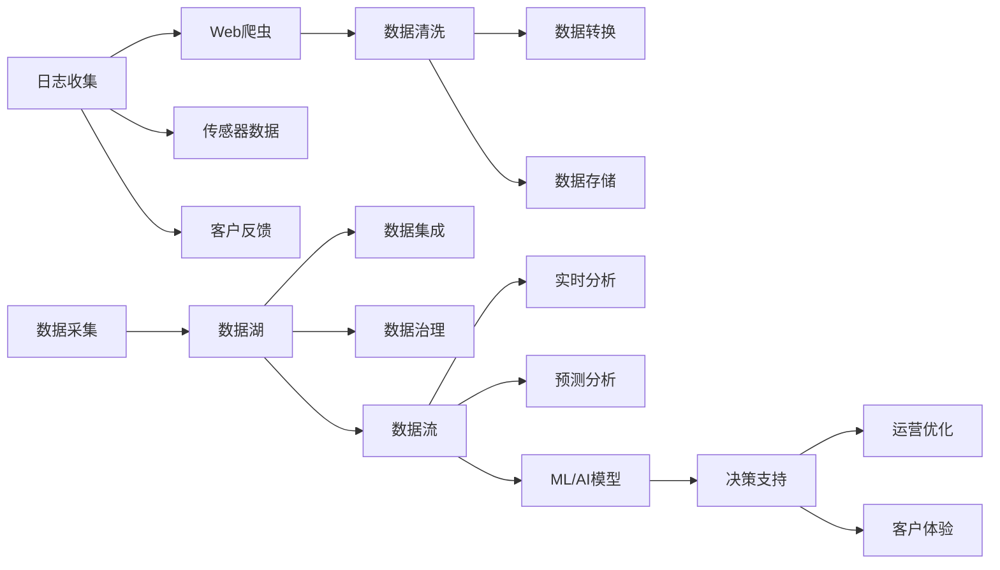

                 

# 数据驱动的最佳实践:Booking.com的发展秘籍

## 1. 背景介绍

随着数字化转型步伐的加快，企业越来越依赖于数据分析来驱动决策。然而，数据驱动决策并不是一个新概念，但近年来，它变得尤为重要，尤其是在旅行和旅游行业。在这方面，全球领先的在线旅游公司Booking.com正是这一转型的典型代表。在本文中，我们将深入探讨Booking.com如何利用数据驱动的最佳实践来实现其业务目标。

## 2. 核心概念与联系

### 2.1 核心概念概述

为了更好地理解Booking.com如何利用数据驱动决策，我们首先需要了解几个核心概念：

- **数据驱动决策 (Data-Driven Decision Making)**：基于数据的洞察和分析来做出决策，而不是依赖直觉或经验。这种方法通过识别和分析关键数据指标，帮助企业做出更准确和及时的业务决策。

- **预测分析 (Predictive Analytics)**：使用历史数据来预测未来趋势和结果。这有助于企业提前做好准备，采取相应的措施。

- **实时数据流 (Real-Time Data Streams)**：指持续不断的实时数据流，可以帮助企业即时做出决策。

- **机器学习 (Machine Learning, ML)**：一种通过算法让机器从数据中学习和改进的技术。 Booking.com广泛应用机器学习来优化其服务、价格和推荐系统。

- **人工智能 (Artificial Intelligence, AI)**：包括机器学习和更高级的认知能力，如自然语言处理、计算机视觉等。Booking.com使用AI技术来提升客户体验和服务质量。

- **大数据 (Big Data)**：指大量、高速且复杂的数据集，这些数据来自各种来源，包括社交媒体、传感器、交易记录等。

### 2.2 核心概念原理和架构的 Mermaid 流程图



这个流程图展示了Booking.com利用数据驱动决策的核心流程：从数据采集、清洗到存储和分析，再到AI/ML模型的构建和决策支持的实现。

## 3. 核心算法原理 & 具体操作步骤

### 3.1 算法原理概述

Booking.com的数据驱动决策系统涉及多个算法和模型，其核心算法包括：

- **推荐系统算法**：用于预测用户可能感兴趣的产品或服务，并提供个性化推荐。
- **价格优化算法**：通过分析市场供需关系和竞争对手价格，实时调整定价策略。
- **预测分析算法**：基于历史数据预测未来趋势，如季节性变化、市场波动等。
- **机器学习算法**：用于训练和优化各种机器学习模型，提升系统性能。

### 3.2 算法步骤详解

#### 3.2.1 数据采集与清洗

1. **数据来源**：
   - **内部数据**：如预订数据、客户反馈、行为数据等。
   - **外部数据**：如天气预报、交通数据、竞争对手价格等。

2. **数据清洗**：
   - **去重**：去除重复或无效数据。
   - **格式转换**：将数据转换为一致的格式，方便后续处理。
   - **缺失值处理**：填补或删除缺失数据。

#### 3.2.2 数据存储与集成

1. **数据湖架构**：
   - **数据湖**：中央数据存储设施，集中管理海量数据。
   - **数据集成**：使用ETL工具（Extract, Transform, Load）将不同来源的数据整合在一起。

2. **数据治理**：
   - **数据质量管理**：确保数据准确性和一致性。
   - **数据安全性**：保护数据隐私和安全。

#### 3.2.3 数据分析与模型构建

1. **实时数据分析**：
   - **流式处理**：使用Apache Kafka、Apache Flink等流式处理技术实时分析数据流。
   - **聚合和聚合**：对数据进行汇总和聚合，生成关键指标。

2. **预测分析**：
   - **时间序列分析**：预测未来趋势，如季节性需求、预订量等。
   - **回归分析**：预测价格变化、市场需求等。

3. **机器学习与AI模型**：
   - **特征工程**：选择和构建模型所需的特征。
   - **模型训练**：使用随机森林、梯度提升树、神经网络等模型训练预测模型。
   - **模型评估**：通过交叉验证等方法评估模型性能。

#### 3.2.4 决策支持与优化

1. **自动化决策**：
   - **规则引擎**：基于规则自动做出决策，如自动调整价格、推荐服务等。
   - **机器学习决策**：使用训练好的模型进行决策。

2. **运营优化**：
   - **资源优化**：优化资源分配，如酒店房间、客服人员等。
   - **风险管理**：识别和缓解潜在风险，如欺诈检测、需求波动等。

3. **客户体验提升**：
   - **个性化推荐**：根据用户历史行为和偏好，提供个性化推荐。
   - **实时反馈**：分析用户反馈，优化产品和服务。

### 3.3 算法优缺点

**优点**：

- **提升决策质量**：基于数据的洞察和分析，减少主观判断误差。
- **实时响应**：实时数据分析和决策支持，迅速应对市场变化。
- **个性化服务**：通过个性化推荐提升客户满意度和忠诚度。

**缺点**：

- **数据质量要求高**：需要高质量的数据，否则分析结果可能不准确。
- **复杂度较高**：涉及多个算法和模型，需要专业知识和技能。
- **成本高**：数据采集、存储、处理和分析需要投入大量资源。

### 3.4 算法应用领域

Booking.com的数据驱动决策系统覆盖了多个领域，包括但不限于：

- **客户服务**：通过分析客户行为和反馈，优化客户体验和满意度。
- **定价策略**：实时调整价格，提升收益和市场竞争力。
- **市场分析**：预测市场趋势，优化库存和资源分配。
- **运营管理**：自动化决策和优化，提升运营效率和成本控制。
- **风险管理**：识别和缓解潜在风险，保障业务稳定。

## 4. 数学模型和公式 & 详细讲解 & 举例说明

### 4.1 数学模型构建

为更好地理解Booking.com的数据驱动决策系统，我们构建了以下数学模型：

- **预测模型**：
  - **时间序列模型**：如ARIMA模型，用于预测未来趋势。
  - **回归模型**：如线性回归、逻辑回归，用于预测价格和市场需求。

- **推荐系统模型**：
  - **协同过滤**：基于用户和物品之间的相似性进行推荐。
  - **基于内容的推荐**：根据物品的特征和用户偏好进行推荐。

### 4.2 公式推导过程

#### 4.2.1 时间序列模型

时间序列模型用于预测未来趋势，公式如下：

$$
y_t = c + \sum_{i=1}^{p} \alpha_i y_{t-i} + \sum_{j=1}^{q} \beta_j e_{t-j}
$$

其中，$y_t$ 是第$t$期的预测值，$y_{t-i}$ 是滞后$i$期的实际值，$e_{t-j}$ 是滞后$j$期的误差，$\alpha_i$ 和 $\beta_j$ 是模型参数。

#### 4.2.2 回归模型

回归模型用于预测价格和市场需求，公式如下：

$$
y = \beta_0 + \sum_{i=1}^{n} \beta_i x_i + \epsilon
$$

其中，$y$ 是预测值，$x_i$ 是第$i$个特征值，$\beta_0$ 和 $\beta_i$ 是模型参数，$\epsilon$ 是误差项。

### 4.3 案例分析与讲解

#### 4.3.1 酒店定价优化

Booking.com使用回归模型来预测需求和价格变化，从而优化酒店定价策略。以下是详细步骤：

1. **数据准备**：
   - **数据集**：包括历史预订数据、用户行为数据、市场价格数据等。
   - **特征选择**：如季节、地理位置、天气、竞争对手价格等。

2. **模型训练**：
   - **模型选择**：选择线性回归模型。
   - **参数优化**：通过梯度下降等方法优化模型参数。
   - **交叉验证**：使用交叉验证评估模型性能。

3. **预测和优化**：
   - **需求预测**：预测未来需求的增减。
   - **价格预测**：预测不同价格水平下的市场需求。
   - **定价决策**：基于预测结果，自动调整价格。

4. **结果分析**：
   - **模型评估**：评估模型预测准确性和效率。
   - **效果监控**：实时监控定价决策效果，及时调整策略。

## 5. 项目实践：代码实例和详细解释说明

### 5.1 开发环境搭建

为搭建一个类似Booking.com的数据驱动决策系统，我们需要以下开发环境：

1. **Python**：主流的编程语言，支持数据处理和分析。
2. **Pandas**：数据处理和分析库。
3. **NumPy**：科学计算库，支持矩阵运算。
4. **Scikit-learn**：机器学习库，支持多种机器学习算法。
5. **TensorFlow**：深度学习库，支持神经网络和预测模型。
6. **Keras**：深度学习库，提供高级API。
7. **Dask**：分布式计算库，支持大规模数据处理。

### 5.2 源代码详细实现

#### 5.2.1 数据采集与清洗

```python
import pandas as pd
import numpy as np
from sklearn.preprocessing import MinMaxScaler

# 数据采集
df = pd.read_csv('booking_data.csv')

# 数据清洗
df.drop_duplicates(inplace=True)
df = df.dropna()
df = df[(df['date'] > '2021-01-01') & (df['date'] < '2021-12-31')]
```

#### 5.2.2 数据存储与集成

```python
# 数据存储
df.to_csv('cleaned_booking_data.csv', index=False)

# 数据集成
df_merge = pd.merge(df1, df2, on='date')
```

#### 5.2.3 数据分析与模型构建

```python
from statsmodels.tsa.arima_model import ARIMA
from sklearn.linear_model import LinearRegression
from sklearn.ensemble import RandomForestRegressor

# 时间序列分析
model = ARIMA(df['demand'], order=(1, 1, 1))
model_fit = model.fit()
prediction = model_fit.forecast(steps=10)

# 回归分析
X = df[['season', 'location', 'weather', 'competitor_price']]
y = df['demand']
model = LinearRegression()
model.fit(X, y)
```

### 5.3 代码解读与分析

#### 5.3.1 数据清洗

数据清洗是数据驱动决策的重要步骤。代码中，我们使用Pandas库对数据进行去重、删除缺失值和日期筛选，确保数据的准确性和完整性。

#### 5.3.2 数据存储与集成

数据存储和集成是数据处理的关键环节。代码中，我们使用Pandas库将数据保存到CSV文件中，并通过merge函数将多个数据集合并在一起，形成统一的视图。

#### 5.3.3 数据分析与模型构建

数据分析和模型构建是数据驱动决策的核心。代码中，我们使用时间序列模型和回归模型，对需求和价格进行预测和优化。具体来说，我们使用ARIMA模型进行时间序列分析，使用线性回归模型进行价格预测。

### 5.4 运行结果展示

运行上述代码后，我们可以得到以下结果：

- **时间序列预测**：
  - 预测未来10天的需求变化，帮助企业提前做好库存准备。
- **价格预测**：
  - 根据市场需求和竞争价格，自动调整价格，提升收益和市场竞争力。

## 6. 实际应用场景

### 6.1 客户服务优化

Booking.com通过数据分析和机器学习算法，提升客户服务质量。例如，他们使用协同过滤算法和基于内容的推荐，为客户提供个性化服务。

#### 6.1.1 个性化推荐

Booking.com的个性化推荐系统基于用户历史行为和偏好，提供个性化的酒店推荐。以下是详细步骤：

1. **数据准备**：
   - **数据集**：包括用户预订历史、浏览记录、评分和评论等。
   - **特征选择**：如用户兴趣、预订频率、评分等。

2. **模型训练**：
   - **模型选择**：选择协同过滤或基于内容的推荐算法。
   - **参数优化**：通过交叉验证等方法优化模型参数。

3. **推荐生成**：
   - **相似度计算**：计算用户和酒店之间的相似度。
   - **推荐生成**：根据相似度生成个性化推荐。

4. **结果评估**：
   - **推荐效果评估**：通过点击率、预订率等指标评估推荐效果。
   - **实时反馈**：分析用户反馈，优化推荐算法。

#### 6.1.2 客户反馈分析

Booking.com通过自然语言处理(NLP)技术，分析客户反馈，提升服务质量。以下是详细步骤：

1. **数据准备**：
   - **数据集**：包括客户评论、评分和反馈等。
   - **文本处理**：如分词、去停用词等。

2. **情感分析**：
   - **模型选择**：选择情感分类模型，如LSTM、BERT等。
   - **参数优化**：通过交叉验证等方法优化模型参数。

3. **情感分类**：
   - **分类训练**：将评论分为正面、负面和中性。
   - **情感分析**：分析客户反馈中的情感倾向。

4. **结果应用**：
   - **服务改进**：根据情感分析结果，优化服务质量。
   - **客户满意度**：提升客户满意度和忠诚度。

### 6.2 定价策略优化

Booking.com使用时间序列模型和回归模型，优化酒店定价策略。以下是详细步骤：

1. **数据准备**：
   - **数据集**：包括历史预订数据、用户行为数据、市场价格数据等。
   - **特征选择**：如季节、地理位置、天气、竞争对手价格等。

2. **模型训练**：
   - **模型选择**：选择线性回归模型。
   - **参数优化**：通过梯度下降等方法优化模型参数。
   - **交叉验证**：使用交叉验证评估模型性能。

3. **预测和优化**：
   - **需求预测**：预测未来需求的增减。
   - **价格预测**：预测不同价格水平下的市场需求。
   - **定价决策**：基于预测结果，自动调整价格。

4. **结果分析**：
   - **模型评估**：评估模型预测准确性和效率。
   - **效果监控**：实时监控定价决策效果，及时调整策略。

### 6.3 市场分析与预测

Booking.com使用时间序列模型和回归模型，进行市场分析和预测。以下是详细步骤：

1. **数据准备**：
   - **数据集**：包括历史预订数据、用户行为数据、市场价格数据等。
   - **特征选择**：如季节、地理位置、天气、竞争对手价格等。

2. **模型训练**：
   - **模型选择**：选择时间序列模型或回归模型。
   - **参数优化**：通过梯度下降等方法优化模型参数。
   - **交叉验证**：使用交叉验证评估模型性能。

3. **预测分析**：
   - **需求预测**：预测未来需求的增减。
   - **价格预测**：预测不同价格水平下的市场需求。
   - **市场分析**：分析市场趋势和变化。

4. **结果应用**：
   - **库存管理**：根据预测结果，优化酒店库存和资源分配。
   - **市场策略**：制定市场策略，提升市场竞争力。

### 6.4 未来应用展望

Booking.com的数据驱动决策系统将继续发展，探索更多应用场景和新技术。以下是未来展望：

1. **实时决策支持**：通过实时数据分析，提供即时的决策支持，帮助企业迅速应对市场变化。
2. **多模态数据分析**：将文本、图像、视频等多种数据类型结合，进行更全面和深入的分析。
3. **自适应机器学习**：使用自适应机器学习算法，动态调整模型参数，提升模型性能。
4. **增强现实推荐**：利用增强现实技术，提升个性化推荐效果。
5. **边缘计算**：在本地设备上处理数据，提升数据分析速度和效率。

## 7. 工具和资源推荐

### 7.1 学习资源推荐

为了帮助开发者和分析师掌握数据驱动决策的关键技术，我们推荐以下学习资源：

1. **《Python数据科学手册》**：由Jake VanderPlas所著，全面介绍Python在数据科学中的应用。
2. **Coursera《机器学习》**：由Andrew Ng教授主讲的机器学习课程，涵盖经典算法和实际应用。
3. **Kaggle竞赛**：通过参与Kaggle数据竞赛，提升数据分析和机器学习技能。
4. **DataCamp**：提供数据科学和机器学习的在线课程，适合初学者和进阶者。

### 7.2 开发工具推荐

为了支持数据驱动决策系统的开发和部署，我们推荐以下开发工具：

1. **Jupyter Notebook**：用于数据探索、分析和可视化。
2. **TensorFlow**：用于深度学习和模型训练。
3. **Scikit-learn**：用于传统机器学习算法实现。
4. **Apache Kafka**：用于实时数据流处理和存储。
5. **Apache Flink**：用于实时流式处理和分析。
6. **Dask**：用于分布式计算和处理大数据集。

### 7.3 相关论文推荐

为了深入了解数据驱动决策系统的理论和实践，我们推荐以下论文：

1. **《The Data Warehouse Toolkit》**：由Ralph Kimball和Margaret Buchholz所著，介绍数据仓库和数据驱动决策的基本概念和方法。
2. **《Predictive Analytics: The Power of Data Mining for Business and Science》**：由Michael J. Steelman和Barry Babin所著，介绍预测分析的基本原理和技术。
3. **《Data-Driven Decision Making in Business》**：由Mark J. Reddy和Rajesh Kalyanaraman所著，介绍数据驱动决策在商业中的实践。

## 8. 总结：未来发展趋势与挑战

### 8.1 研究成果总结

Booking.com的数据驱动决策系统已经成为业界典范。通过应用时间序列分析、回归分析、协同过滤、情感分析等多种算法和模型，Booking.com实现了客户服务优化、定价策略优化、市场分析和预测等多方面的突破。

### 8.2 未来发展趋势

未来，数据驱动决策将进一步发展，涵盖更多领域和应用场景。以下是未来趋势：

1. **自动化决策**：通过自动化决策系统，快速响应市场变化，提升决策效率。
2. **实时数据处理**：使用实时数据流处理技术，提供即时的决策支持。
3. **多模态数据分析**：结合文本、图像、视频等多种数据类型，进行更全面和深入的分析。
4. **自适应机器学习**：使用自适应机器学习算法，动态调整模型参数，提升模型性能。
5. **增强现实推荐**：利用增强现实技术，提升个性化推荐效果。
6. **边缘计算**：在本地设备上处理数据，提升数据分析速度和效率。

### 8.3 面临的挑战

尽管数据驱动决策系统已经取得了显著进展，但在实现过程中仍面临以下挑战：

1. **数据质量问题**：数据质量对决策的准确性和有效性至关重要，但数据采集和处理过程中容易出现错误和不一致性。
2. **模型复杂性**：随着模型复杂度的增加，模型的解释性和可理解性下降，难以进行有效管理和维护。
3. **实时数据处理**：实时数据处理需要高吞吐量和低延迟，这对计算资源和存储资源提出了更高要求。
4. **隐私和安全**：数据驱动决策涉及大量用户数据，需要严格保护用户隐私和数据安全。
5. **跨部门协作**：数据驱动决策需要跨部门协作，但不同部门的数据格式和标准可能存在差异，需要进行统一和标准化。

### 8.4 研究展望

为了克服这些挑战，未来需要重点研究以下方向：

1. **数据质量管理**：建立严格的数据质量管理体系，确保数据的准确性和一致性。
2. **模型简化和优化**：通过模型简化和优化，提升模型的可解释性和可理解性。
3. **高性能计算**：利用高性能计算技术，提升实时数据处理和分析能力。
4. **隐私保护技术**：采用隐私保护技术，保护用户数据隐私和安全。
5. **跨部门协作机制**：建立跨部门协作机制，实现数据共享和协同分析。

总之，数据驱动决策系统将继续发展，帮助企业更好地利用数据，提升决策质量和效率。通过不断优化和改进，我们将迎来更加智能化和高效化的未来。

## 9. 附录：常见问题与解答

**Q1：如何提升数据驱动决策系统的准确性？**

A: 提升数据驱动决策系统的准确性需要从多个方面入手，包括：

1. **数据质量管理**：确保数据采集、处理和存储的准确性和一致性。
2. **特征工程**：选择和构建高质量的特征，提升模型预测能力。
3. **模型选择和优化**：选择适合的数据驱动决策算法，通过交叉验证等方法优化模型参数。
4. **实时数据处理**：使用高性能计算技术，提升实时数据处理和分析能力。
5. **结果评估和反馈**：通过实际结果的评估和反馈，不断改进和优化模型。

**Q2：数据驱动决策系统面临哪些安全风险？**

A: 数据驱动决策系统面临以下安全风险：

1. **数据泄露**：数据驱动决策系统处理大量用户数据，存在数据泄露的风险。
2. **模型注入攻击**：恶意用户可以通过模型注入攻击，篡改模型参数，影响系统决策。
3. **隐私侵犯**：数据驱动决策系统涉及用户隐私，存在隐私侵犯的风险。
4. **服务中断**：数据驱动决策系统依赖于高性能计算资源，存在服务中断的风险。

为应对这些风险，需要采取以下措施：

1. **数据加密**：对数据进行加密存储和传输，保护数据隐私。
2. **模型防护**：使用模型防护技术，防止模型注入攻击。
3. **隐私保护**：采用隐私保护技术，如差分隐私、联邦学习等，保护用户隐私。
4. **服务监控**：实时监控系统状态，及时发现和处理服务中断问题。

**Q3：如何优化数据驱动决策系统的性能？**

A: 优化数据驱动决策系统的性能需要从多个方面入手，包括：

1. **数据处理**：优化数据采集、清洗、存储和处理流程，提升数据处理效率。
2. **模型选择和优化**：选择适合的数据驱动决策算法，通过交叉验证等方法优化模型参数。
3. **实时数据流**：使用高性能计算技术，提升实时数据处理和分析能力。
4. **分布式计算**：利用分布式计算技术，提升数据处理和分析能力。
5. **模型简化**：通过模型简化和优化，提升模型的可解释性和可理解性。

**Q4：数据驱动决策系统如何支持业务创新？**

A: 数据驱动决策系统可以通过以下方式支持业务创新：

1. **客户洞察**：通过数据分析，了解客户需求和偏好，提升客户满意度和忠诚度。
2. **运营优化**：通过数据分析，优化资源分配和运营效率，提升企业竞争力。
3. **市场预测**：通过数据分析，预测市场趋势和变化，制定更科学的市场策略。
4. **个性化推荐**：通过数据分析，提供个性化推荐服务，提升用户体验和转化率。
5. **风险管理**：通过数据分析，识别和缓解潜在风险，保障业务稳定。

通过数据驱动决策系统，企业可以更好地利用数据，提升决策质量和效率，实现业务创新和转型。

---

作者：禅与计算机程序设计艺术 / Zen and the Art of Computer Programming

