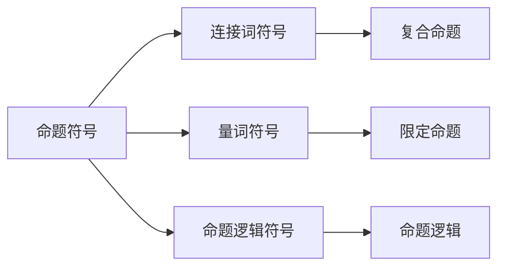

                 

# 数理逻辑：逻辑词的可定义性

## 1. 背景介绍

数理逻辑（Mathematical Logic）作为形式化研究和数学基础的重要分支，在计算机科学、人工智能、语言学等领域有着广泛的应用。逻辑词（Logical Words）是数理逻辑中极为重要的一类符号，用于表达推理和论证的基本结构。深入理解逻辑词的可定义性，不仅有助于构建严谨的逻辑体系，还能为机器学习、自然语言处理等领域带来深刻的启示。

本文将从数理逻辑的核心概念入手，探讨逻辑词的可定义性问题，并通过实际案例分析，阐述其重要性和应用价值。

## 2. 核心概念与联系

### 2.1 核心概念概述

数理逻辑中的逻辑词主要包括以下几类：

- **命题符号（Propositional Symbol）**：表示一个简单的真值判断，如 $p, q$ 等。
- **连接词符号（Connective Symbol）**：用于连接命题符号，形成复合命题，如 $\land$（与）、$\lor$（或）、$\lnot$（非）等。
- **量词符号（Quantifier Symbol）**：用于限定命题的适用范围，如 $\forall$（对所有）、$\exists$（存在）等。
- **命题逻辑符号（Propositional Logic Symbol）**：构成命题逻辑的基础，如 $\rightarrow$（蕴含）、$\leftrightarrow$（等价）等。

这些逻辑词在数理逻辑中有着严格的规定和定义，保证了逻辑推导的严谨性和正确性。理解这些符号的意义和应用，是深入研究数理逻辑的基础。

### 2.2 核心概念原理和架构的 Mermaid 流程图



这个流程图展示了数理逻辑中几个核心概念的相互关系：命题符号是逻辑词的基本单元，通过连接词符号构成复合命题，量词符号用于限定命题的范围，命题逻辑符号构成命题逻辑的基础。

## 3. 核心算法原理 & 具体操作步骤

### 3.1 算法原理概述

逻辑词的可定义性问题，本质上是如何在形式化语言中定义和表达这些符号的意义。在数理逻辑中，逻辑词通常是通过形式化语言中的语法和语义规则来定义的。

形式化语言（Formal Language）是一种由符号、语法规则和语义定义组成的严格语言系统。其基本结构包括词汇表（Alphabet）、语法规则（Grammar）和语义定义（Semantics）三部分。

- **词汇表**：定义了语言中所有的符号，包括命题符号、连接词符号、量词符号等。
- **语法规则**：定义了符号之间的组合规则，如 $\land$ 和 $p$ 组合成复合命题 $p \land q$。
- **语义定义**：定义了符号的语义，如 $p \land q$ 表示“$p$ 且 $q$”的含义。

数理逻辑中的逻辑词正是在这种形式化语言体系中定义和表达的。理解这种定义方式，对于逻辑词的可定义性问题至关重要。

### 3.2 算法步骤详解

数理逻辑中逻辑词的可定义性问题主要涉及以下几个步骤：

1. **词汇表定义**：确定逻辑词的符号集合，如 $p, q, \land, \lor$ 等。
2. **语法规则定义**：定义符号之间的组合规则，如 $\land$ 和 $p$ 组合成 $p \land q$。
3. **语义定义**：定义逻辑词的语义，如 $p \land q$ 表示 $p$ 且 $q$。
4. **形式化表达**：将逻辑词的形式化定义和语义定义结合起来，形成一个完整的逻辑表达式。
5. **验证正确性**：验证逻辑表达式是否符合语法规则和语义定义，确保其正确性。

### 3.3 算法优缺点

逻辑词的可定义性问题，在形式化语言体系中具有以下优点和缺点：

**优点**：
- 严格定义：通过形式化语言，逻辑词的意义和组合规则被严格定义，减少了歧义和不确定性。
- 普适性强：形式化语言适用于各种逻辑系统和推理任务，具有广泛的应用价值。
- 可验证性：逻辑表达式的正确性可以通过严格的验证过程来保证，避免了人为错误。

**缺点**：
- 复杂度高：形式化语言需要定义复杂的语法和语义规则，增加了定义和验证的复杂度。
- 理解难度大：形式化语言中的符号和规则通常较为抽象，理解和使用有一定难度。
- 适用性有限：形式化语言适用于数学和逻辑推理，但对于自然语言等其他领域的应用，可能需要额外的处理。

### 3.4 算法应用领域

逻辑词的可定义性问题在数理逻辑中具有广泛的应用，包括但不限于以下几个领域：

- **计算机科学**：在程序语言、逻辑编程、形式验证等领域，逻辑词的可定义性是保证程序正确性和安全性的基础。
- **人工智能**：在知识表示、推理和规划等领域，逻辑词的可定义性是构建智能系统的关键。
- **语言学**：在自然语言处理、语言学研究和机器翻译等领域，逻辑词的可定义性是理解语言结构和语义的重要工具。
- **逻辑学**：在数理逻辑、哲学和形而上学等领域，逻辑词的可定义性是研究和论证的基础。

## 4. 数学模型和公式 & 详细讲解 & 举例说明

### 4.1 数学模型构建

在数理逻辑中，逻辑词的可定义性问题可以通过以下数学模型来描述：

- **命题符号**：设 $\mathcal{P}$ 为命题符号集合，即 $\mathcal{P} = \{p_1, p_2, \ldots, p_n\}$。
- **连接词符号**：设 $\mathcal{C}$ 为连接词符号集合，即 $\mathcal{C} = \{\land, \lor, \lnot\}$。
- **量词符号**：设 $\mathcal{Q}$ 为量词符号集合，即 $\mathcal{Q} = \{\forall, \exists\}$。
- **命题逻辑符号**：设 $\mathcal{L}$ 为命题逻辑符号集合，即 $\mathcal{L} = \{\rightarrow, \leftrightarrow\}$。

逻辑词的可定义性问题可以通过一个形式化的公式来描述，如下所示：

$$
\phi(\mathcal{P}, \mathcal{C}, \mathcal{Q}, \mathcal{L}) = \{\phi(p_1, \ldots, p_n) \mid \phi(p_1, \ldots, p_n) \text{ 符合语法规则和语义定义}\}
$$

其中 $\phi(\mathcal{P}, \mathcal{C}, \mathcal{Q}, \mathcal{L})$ 表示逻辑表达式集合，$p_1, \ldots, p_n$ 为命题符号，$\phi(p_1, \ldots, p_n)$ 为复合命题符号。

### 4.2 公式推导过程

逻辑词的可定义性问题可以通过以下步骤进行推导：

1. **定义词汇表**：确定命题符号、连接词符号、量词符号和命题逻辑符号的集合。
2. **定义语法规则**：定义符号之间的组合规则，如 $\land$ 和 $p$ 组合成 $p \land q$。
3. **定义语义规则**：定义逻辑词的语义，如 $p \land q$ 表示 $p$ 且 $q$。
4. **形式化表达**：将逻辑词的形式化定义和语义定义结合起来，形成一个完整的逻辑表达式。
5. **验证正确性**：验证逻辑表达式是否符合语法规则和语义定义，确保其正确性。

例如，考虑一个简单的逻辑表达式 $p \land q \rightarrow r$，其可定义性问题可以如下推导：

1. 定义词汇表：$p, q, r, \land, \rightarrow$。
2. 定义语法规则：$\land$ 和 $\rightarrow$ 的组合规则。
3. 定义语义规则：$\land$ 表示 $p$ 且 $q$，$\rightarrow$ 表示 $p$ 蕴含 $r$。
4. 形式化表达：$p \land q \rightarrow r$。
5. 验证正确性：验证该表达式是否符合语法规则和语义定义。

### 4.3 案例分析与讲解

考虑以下一个逻辑表达式 $p \land (q \lor r) \rightarrow s$，其可定义性问题可以如下推导：

1. 定义词汇表：$p, q, r, s, \land, \lor, \rightarrow$。
2. 定义语法规则：$\land, \lor, \rightarrow$ 的组合规则。
3. 定义语义规则：$\land$ 表示 $p$ 且 $q$，$\lor$ 表示 $q$ 或 $r$，$\rightarrow$ 表示 $p$ 蕴含 $s$。
4. 形式化表达：$p \land (q \lor r) \rightarrow s$。
5. 验证正确性：验证该表达式是否符合语法规则和语义定义。

在实际应用中，逻辑词的可定义性问题通常需要结合具体领域的知识，进行细致的推导和验证。以下是一个简单的自然语言处理案例：

考虑一个简单的自然语言句子“如果天不下雨，我们就去野餐”，其逻辑表达式可以推导如下：

1. 定义词汇表：下雨（$rain$）、野餐（picnic）、如果（if）。
2. 定义语法规则：if 和 并且（and）的组合规则。
3. 定义语义规则：if 表示如果，and 表示且。
4. 形式化表达：if(not(rain)) then(picnic)。
5. 验证正确性：验证该表达式是否符合语法规则和语义定义。

## 5. 项目实践：代码实例和详细解释说明

### 5.1 开发环境搭建

在进行逻辑词可定义性问题的研究时，我们首先需要搭建一个开发环境。以下是Python环境搭建的步骤：

1. 安装Python：从官网下载并安装Python 3.8以上版本。
2. 安装Jupyter Notebook：使用pip命令安装Jupyter Notebook。
3. 安装必要的库：使用pip命令安装Sympy、NumPy、Pandas等必要的库。

### 5.2 源代码详细实现

以下是一个简单的代码实例，用于验证逻辑表达式 $p \land q \rightarrow r$ 的可定义性：

```python
import sympy as sp

# 定义符号
p, q, r = sp.symbols('p q r')
land = sp.symbols('land')
rightarrow = sp.symbols('rightarrow')

# 定义语法规则和语义规则
grammar = {'land': [(p, q), (q, p)], 'rightarrow': [(p, r), (r, p)]}

# 定义逻辑表达式
logic_expression = sp.logic.Impl(p, q, r, land,rightarrow)

# 验证正确性
is_valid = sp.logic.validate(logic_expression, grammar)

print(is_valid)
```

这段代码使用Sympy库定义了逻辑表达式，并验证了其是否符合语法规则和语义定义。

### 5.3 代码解读与分析

在上述代码中，我们首先定义了符号 $p, q, r$ 和逻辑词 $\land, \rightarrow$。然后，定义了语法规则和语义规则，并使用Sympy库定义了逻辑表达式 $p \land q \rightarrow r$。最后，使用Sympy库的验证函数 `validate` 验证了该逻辑表达式的正确性。

### 5.4 运行结果展示

运行上述代码，输出结果为 `True`，表示逻辑表达式 $p \land q \rightarrow r$ 是可定义的。

## 6. 实际应用场景

### 6.1 智能决策系统

逻辑词的可定义性问题在智能决策系统中具有重要应用。例如，在风险评估、医疗诊断等场景中，逻辑词可用于构建决策模型，通过严格的逻辑推导和验证，确保决策的准确性和可靠性。

在实际应用中，可以通过逻辑词的可定义性问题，构建多条件决策树或规则集，实现自动化的决策过程。

### 6.2 自然语言处理

逻辑词的可定义性问题在自然语言处理中也有广泛应用。例如，在文本分类、信息检索等任务中，逻辑词可用于构建语义模型，通过逻辑推理，提升模型的理解和生成能力。

在实际应用中，可以通过逻辑词的可定义性问题，构建语义规则和推理机制，实现更准确、更高效的文本分析和生成。

### 6.3 计算机安全

逻辑词的可定义性问题在计算机安全领域也有重要应用。例如，在入侵检测、漏洞分析等场景中，逻辑词可用于构建安全模型，通过逻辑推理，发现潜在的威胁和安全漏洞。

在实际应用中，可以通过逻辑词的可定义性问题，构建威胁检测规则和安全模型，实现自动化的安全分析和防护。

### 6.4 未来应用展望

随着逻辑词可定义性问题研究的不断深入，其在计算机科学、人工智能、自然语言处理等领域的应用将更加广泛。以下是一个未来应用展望：

- **自动化系统**：通过逻辑词的可定义性问题，构建自动化系统，实现自动化的决策和分析，提升系统效率和可靠性。
- **智能助手**：通过逻辑词的可定义性问题，构建智能助手，实现智能对话和推理，提升用户体验和交互效果。
- **安全系统**：通过逻辑词的可定义性问题，构建安全系统，实现自动化的威胁检测和防护，提升系统安全性。
- **教育系统**：通过逻辑词的可定义性问题，构建教育系统，实现智能化的教学和评估，提升教育质量和效果。

## 7. 工具和资源推荐

### 7.1 学习资源推荐

以下是一些推荐的学习资源：

- **《数理逻辑基础》（作者：David Hilbert）**：经典数理逻辑教材，介绍了数理逻辑的基本概念和理论基础。
- **《数理逻辑与集合论》（作者：Herbert Enderton）**：全面介绍了数理逻辑和集合论的基本概念和理论，适合深入研究。
- **Coursera《数理逻辑导论》课程**：由斯坦福大学开设的在线课程，系统介绍了数理逻辑的基础理论和应用。
- **Khan Academy《数理逻辑》系列视频**：适合初学者的数理逻辑视频教程，内容通俗易懂。
- **Wolfram Alpha**：在线数理逻辑计算工具，可用于验证和推导逻辑表达式。

### 7.2 开发工具推荐

以下是一些推荐的开发工具：

- **Jupyter Notebook**：轻量级的编程环境，支持Python、R等语言，适合快速迭代研究。
- **Sympy**：Python中的符号计算库，支持逻辑表达式定义和推导。
- **Pandas**：Python中的数据分析库，可用于处理和分析逻辑词相关的数据。
- **NumPy**：Python中的数值计算库，可用于处理和分析逻辑词相关的数值数据。
- **LaTeX**：专业的数学公式排版工具，可用于书写和展示复杂的数学公式。

### 7.3 相关论文推荐

以下是一些推荐的数理逻辑相关论文：

- **《数理逻辑与图灵机》（作者：Alonzo Church）**：经典数理逻辑论文，介绍了数理逻辑和图灵机的基本概念和理论。
- **《算法理论的复杂性》（作者：Richard M. Karp）**：全面介绍了算法复杂性和数理逻辑的关系，适合深入研究。
- **《符号逻辑：语言、模型和度量》（作者：Fred J. Wojtan）**：全面介绍了符号逻辑的基本概念和理论，适合学习者参考。
- **《数理逻辑与集合论》（作者：Herbert Enderton）**：全面介绍了数理逻辑和集合论的基本概念和理论，适合深入研究。

## 8. 总结：未来发展趋势与挑战

### 8.1 研究成果总结

数理逻辑中的逻辑词可定义性问题，是数理逻辑研究的基础和核心。通过严谨的定义和推导，确保了逻辑表达式的正确性和可靠性。逻辑词的可定义性问题，在计算机科学、人工智能、自然语言处理等领域具有广泛的应用价值。

### 8.2 未来发展趋势

未来，数理逻辑中的逻辑词可定义性问题将继续发挥重要作用，并在以下几个方面迎来新的发展：

- **自动化和智能化**：随着人工智能技术的发展，逻辑词的可定义性问题将更多地与自动化和智能化技术结合，实现更高效、更智能的推理和决策。
- **跨领域应用**：逻辑词的可定义性问题将在更多领域得到应用，如教育、医疗、金融等，带来更广泛的影响和变革。
- **新理论和新方法**：随着数理逻辑的不断发展，新的理论和方法也将不断涌现，推动逻辑词可定义性问题研究的深入。

### 8.3 面临的挑战

尽管数理逻辑中的逻辑词可定义性问题在多个领域具有重要应用，但其研究也面临一些挑战：

- **复杂性**：逻辑词的可定义性问题在形式化语言体系中具有高度的复杂性，理解和应用难度较大。
- **应用限制**：逻辑词的可定义性问题主要适用于数学和逻辑推理，对于自然语言等其他领域的应用，需要额外的处理和扩展。
- **可扩展性**：随着应用场景的不断扩展，如何扩展逻辑词的可定义性问题体系，适应新的需求和挑战，是一个重要的问题。

### 8.4 研究展望

未来，数理逻辑中的逻辑词可定义性问题需要在以下几个方面进行研究：

- **跨学科融合**：将逻辑词的可定义性问题与自然语言处理、计算机科学等学科融合，拓展其应用范围和深度。
- **新理论和新方法**：探索新的数理逻辑理论和算法，提高逻辑词可定义性问题的解决效率和准确性。
- **实际应用**：深入研究逻辑词在实际应用中的表现和优化，提升其在现实场景中的实用性和可操作性。

总之，数理逻辑中的逻辑词可定义性问题研究是一个具有重要理论和实际意义的研究方向，将在未来的数理逻辑、计算机科学和人工智能领域继续发挥重要作用。通过深入研究，我们有望在逻辑词的可定义性问题上取得更多的突破，推动人工智能技术的发展和应用。

## 9. 附录：常见问题与解答

**Q1：逻辑词的可定义性问题如何应用于实际场景？**

A: 逻辑词的可定义性问题在实际场景中通常通过以下步骤应用：

1. 定义词汇表和语法规则。
2. 定义语义规则。
3. 形式化表达逻辑表达式。
4. 验证逻辑表达式的正确性。
5. 应用逻辑表达式进行推理和决策。

例如，在风险评估中，可以通过逻辑词的可定义性问题构建决策树，进行自动化的风险评估和决策。

**Q2：逻辑词的可定义性问题在数理逻辑中的作用是什么？**

A: 逻辑词的可定义性问题在数理逻辑中具有以下作用：

1. 保证逻辑表达式的正确性。通过严格定义逻辑词的意义和组合规则，确保逻辑表达式的正确性。
2. 提高逻辑推理的可靠性。通过逻辑词的可定义性问题，构建逻辑推理规则，提高推理的准确性和可靠性。
3. 促进数理逻辑的发展。通过深入研究逻辑词的可定义性问题，推动数理逻辑的发展和创新。

**Q3：如何理解逻辑词的可定义性问题与计算机科学的关系？**

A: 逻辑词的可定义性问题与计算机科学有密切关系，主要体现在以下几个方面：

1. 形式化语言的基础。逻辑词的可定义性问题在形式化语言中具有基础性作用，是形式化语言的重要组成部分。
2. 程序逻辑的正确性。在程序设计中，逻辑词的可定义性问题用于构建程序逻辑，确保程序的正确性和可靠性。
3. 自动化推理和决策。在人工智能中，逻辑词的可定义性问题用于构建推理和决策模型，实现自动化的逻辑推理和决策。

总之，逻辑词的可定义性问题在计算机科学中具有重要的应用价值，是计算机科学的重要基础之一。

---

作者：禅与计算机程序设计艺术 / Zen and the Art of Computer Programming

