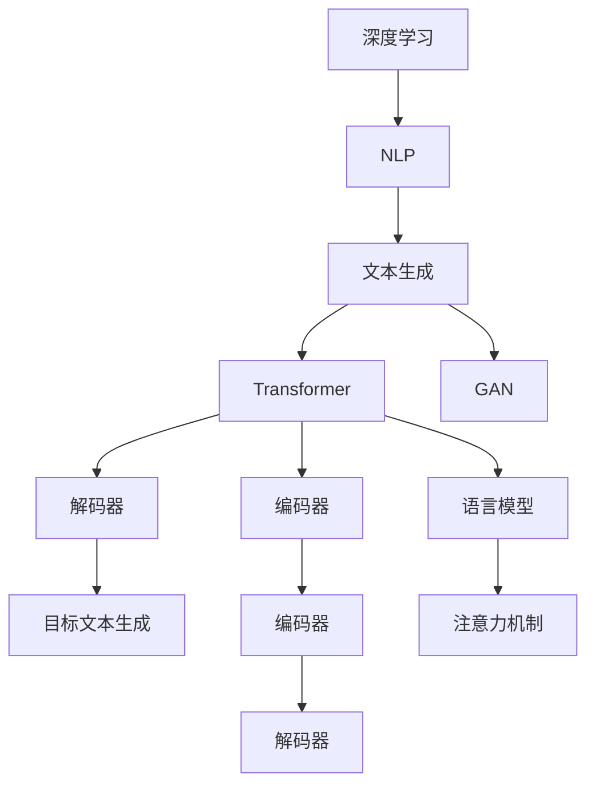

                 

# 文本生成 (Text Generation)

> 关键词：深度学习,自然语言处理(NLP),文本生成,Transformer模型,语言模型,生成对抗网络(GAN),解码器,注意力机制

## 1. 背景介绍

### 1.1 问题由来

文本生成(Text Generation)是自然语言处理(NLP)领域的一个重要研究方向，旨在构建能够理解语言规则并生成可读性高的文本的系统。传统的文本生成方法如基于规则的模板、统计语言模型等，受到语言规则和数据稀缺的限制，难以生成自然流畅的文本。而随着深度学习技术的发展，特别是Transformer模型和语言模型的出现，文本生成技术取得了革命性的进展。

近年来，基于深度学习的文本生成方法，如循环神经网络(RNN)、卷积神经网络(CNN)和变分自编码器(VAE)等，已经在诗歌生成、对话生成、新闻摘要生成、机器翻译等领域展示了其强大的生成能力。特别是基于Transformer模型的语言模型，通过自回归方式学习文本的上下文信息，能够生成流畅、连贯且高质量的文本，成为文本生成领域的主流技术。

然而，尽管大语言模型在文本生成上取得了显著成果，但在一些特定的应用场景中，如自动摘要、对话生成等，仍存在生成质量不稳定、生成多样性不足等问题。此外，由于大模型通常需要大量标注数据进行微调，这也限制了其在低资源环境下的应用。因此，文本生成技术的进一步发展需要结合更多的技术手段，如对抗训练、解码器设计、注意力机制等，不断提升生成效果，增强模型的生成能力和灵活性。

### 1.2 问题核心关键点

文本生成的核心问题在于如何构建一个具备语义理解和生成能力的模型，能够理解输入文本的上下文，并在此基础上生成连贯、流畅且高质量的输出文本。当前文本生成的主流技术框架包括基于自回归的Transformer模型，以及基于生成对抗网络(GAN)的生成框架。其中，基于Transformer的文本生成方法通过学习文本的语义表示，可以生成结构良好且连贯的文本，但易受噪声样本干扰；而基于GAN的生成方法通过对抗性训练，可以生成高质量且具有多样性的文本，但训练过程复杂且不稳定。

在文本生成中，模型的输入可以是单条文本、段落或文档，输出则可以是完整的文本、摘要、对话或翻译。模型通常包含编码器、解码器和目标文本生成三个部分。编码器用于理解输入文本的语义表示，解码器则将编码器输出映射为目标文本，目标文本生成器则用于生成最终的输出文本。

## 2. 核心概念与联系

### 2.1 核心概念概述

为了更好地理解文本生成技术，本文将介绍几个关键概念：

- 深度学习(Deep Learning)：一种通过多层神经网络模拟人脑进行模式识别的技术。
- 自然语言处理(NLP)：一种利用计算机处理和理解自然语言的技术，旨在让机器能够理解、分析并生成人类语言。
- 文本生成(Text Generation)：使用深度学习模型自动生成连贯、流畅且高质量的文本。
- Transformer模型：一种基于自注意力机制的神经网络架构，在自然语言处理中取得了广泛应用。
- 语言模型(Language Model)：用于预测文本序列的概率分布的模型，可用于生成文本、文本分类等任务。
- 生成对抗网络(GAN)：一种通过对抗训练生成高质量、多样化文本的技术。
- 解码器(Decoder)：文本生成中的重要组成部分，用于将编码器输出的语义表示映射为目标文本。
- 注意力机制(Attention Mechanism)：用于增强模型在生成文本时对上下文的关注，提升生成效果。

这些概念之间的逻辑关系可以通过以下Mermaid流程图来展示：



这个流程图展示了深度学习、NLP与文本生成之间的联系，以及Transformer模型、GAN、编码器、解码器、语言模型和注意力机制在文本生成中的作用。

## 3. 核心算法原理 & 具体操作步骤

### 3.1 算法原理概述

基于深度学习的文本生成技术通常基于以下原理：

1. **自回归(autoregressive)生成**：模型按顺序生成文本的每个单词或字符，每个单词的生成取决于前面的单词。自回归生成可以确保生成的文本连贯且符合语言规则，但易受噪声样本干扰。

2. **非自回归(non-autoregressive)生成**：模型一次性生成整个文本序列，并使用注意力机制对生成的每个位置进行关注，确保生成的文本连贯且流畅。非自回归生成可以提升生成速度，但模型的训练复杂度较高。

3. **对抗生成(adversarial generation)**：通过生成对抗网络(GAN)的两个生成器和判别器之间的对抗训练，生成高质量且多样化的文本。对抗生成可以生成高保真的文本，但训练过程复杂且不稳定。

4. **注意力机制(Attention Mechanism)**：增强模型在生成文本时对上下文的关注，提升生成效果。注意力机制可以确保模型生成文本时充分考虑上下文信息，避免信息丢失。

5. **解码器(Decoder)**：文本生成中的重要组成部分，用于将编码器输出的语义表示映射为目标文本。解码器可以采用不同的架构，如自回归或非自回归解码器，以提升生成效果。

### 3.2 算法步骤详解

文本生成的基本流程包括以下几个关键步骤：

**Step 1: 数据准备与预处理**

1. **数据收集**：收集所需的文本数据，可以是书籍、新闻、网页等。
2. **数据清洗**：去除噪声、无用信息，标准化文本格式，如统一大小写、标点等。
3. **分词与标记**：将文本进行分词和标记，如使用BOS（开始符号）、EOS（结束符号）、PAD（填充符）等符号。

**Step 2: 模型构建与训练**

1. **编码器(Encoder)构建**：使用Transformer等模型构建编码器，将输入文本转换为语义表示。
2. **解码器(Decoder)构建**：根据具体生成任务设计解码器，可以是自回归或非自回归解码器。
3. **语言模型训练**：使用自回归生成方式训练语言模型，使其预测文本序列的概率分布。
4. **对抗生成训练**：使用GAN的对抗训练方式生成高质量、多样化的文本。

**Step 3: 生成与后处理**

1. **文本生成**：使用训练好的模型进行文本生成，可以是单条文本、段落或文档。
2. **后处理**：对生成的文本进行后处理，如去除重复、纠正错误等，提升生成质量。

### 3.3 算法优缺点

基于深度学习的文本生成技术具有以下优点：

1. **生成效果良好**：能够生成流畅、连贯且高质量的文本，广泛应用于文本摘要、对话生成、翻译等领域。
2. **应用广泛**：文本生成技术可以应用于写作辅助、创意写作、游戏开发等多个领域，带来新的应用场景。
3. **灵活性高**：模型的结构和参数可以根据具体任务进行调整，适应不同的生成需求。

然而，基于深度学习的文本生成技术也存在一些缺点：

1. **依赖大量标注数据**：模型的训练需要大量高质量的标注数据，这在实际应用中往往难以获取。
2. **生成质量不稳定**：生成的文本质量受到训练数据、模型参数等因素的影响，有时会产生不连贯、不流畅的文本。
3. **生成多样性不足**：模型在生成文本时往往偏向于某些特定的风格或结构，生成的文本多样性不足。
4. **计算资源消耗大**：模型通常需要较大的计算资源进行训练和推理，难以在低资源环境中应用。
5. **可解释性差**：生成的文本难以解释，模型的决策过程缺乏可解释性，难以理解和调试。

### 3.4 算法应用领域

文本生成技术在多个领域都得到了广泛应用，具体包括：

1. **自然语言处理(NLP)**：文本生成技术可以用于文本摘要、机器翻译、命名实体识别等任务，提升NLP系统的自动化水平。
2. **创意写作与文学创作**：文本生成技术可以帮助作家进行文学创作、写作辅助、故事生成等，提升创意写作的效率和质量。
3. **游戏开发**：文本生成技术可以用于生成游戏中的对话、任务描述、角色介绍等文本，提升游戏体验。
4. **客服机器人**：文本生成技术可以用于构建客服机器人，自动回答用户咨询，提升客户服务效率。
5. **社交媒体**：文本生成技术可以用于自动生成社交媒体上的文章、评论等，提升内容生产效率。
6. **内容推荐**：文本生成技术可以用于生成推荐文本，提升推荐系统的效果。

## 4. 数学模型和公式 & 详细讲解

### 4.1 数学模型构建

文本生成的数学模型通常基于自回归模型或非自回归模型。这里以基于Transformer的自回归模型为例，介绍文本生成的数学模型构建过程。

假设文本生成任务为序列到序列生成，即输入文本长度为 $T$，输出文本长度也为 $T$。设输入文本为 $X = (x_1, x_2, \ldots, x_T)$，输出文本为 $Y = (y_1, y_2, \ldots, y_T)$。

文本生成模型由编码器、解码器和目标文本生成器组成，其数学模型如下：

1. **编码器(Encoder)**：将输入文本 $X$ 转换为语义表示 $H$。编码器的数学模型为：

$$
H = \text{Encoder}(X; \theta)
$$

其中，$\theta$ 为编码器的参数，$\text{Encoder}$ 为编码器的计算过程。

2. **解码器(Decoder)**：将语义表示 $H$ 映射为目标文本 $Y$。解码器的数学模型为：

$$
Y = \text{Decoder}(H; \theta)
$$

其中，$\theta$ 为解码器的参数，$\text{Decoder}$ 为解码器的计算过程。

3. **目标文本生成器**：根据解码器输出 $Y$ 生成最终的文本。目标文本生成器的数学模型为：

$$
Y_{\text{final}} = \text{Generate}(Y; \theta)
$$

其中，$\theta$ 为目标文本生成器的参数，$\text{Generate}$ 为目标文本生成器的计算过程。

### 4.2 公式推导过程

以基于Transformer的自回归模型为例，推导文本生成的数学模型。假设编码器和解码器都使用自注意力机制，则模型结构如下图所示：


Transformer模型的数学模型如下：

1. **编码器(Encoder)**：编码器由多个自注意力层和前馈神经网络层组成。设编码器的参数为 $\theta$，则编码器的数学模型为：

$$
H = \text{Encoder}(X; \theta) = \text{Attention}(X, X; \theta) \times \text{FFN}(H; \theta)
$$

其中，$\text{Attention}(X, X; \theta)$ 为自注意力机制，$\text{FFN}(H; \theta)$ 为前馈神经网络层。

2. **解码器(Decoder)**：解码器也由多个自注意力层和前馈神经网络层组成。设解码器的参数为 $\theta$，则解码器的数学模型为：

$$
Y = \text{Decoder}(H; \theta) = \text{Attention}(X, H; \theta) \times \text{FFN}(Y; \theta)
$$

其中，$\text{Attention}(X, H; \theta)$ 为自注意力机制，$\text{FFN}(Y; \theta)$ 为前馈神经网络层。

3. **目标文本生成器**：目标文本生成器可以根据解码器输出 $Y$ 生成最终的文本。假设生成器采用基于自回归的方式，则生成器的数学模型为：

$$
Y_{\text{final}} = \text{Generate}(Y; \theta) = \text{FFN}(Y; \theta)
$$

其中，$\text{FFN}(Y; \theta)$ 为前馈神经网络层。

### 4.3 案例分析与讲解

以BERT模型的文本生成任务为例，介绍文本生成的具体实现。

BERT模型的文本生成任务可以表示为：

1. **输入文本**：假设输入文本为句子，长度为 $T$。
2. **编码器**：编码器将输入文本转换为语义表示 $H$。
3. **解码器**：解码器将语义表示 $H$ 映射为目标文本 $Y$。
4. **目标文本生成器**：根据解码器输出 $Y$ 生成最终的文本。

假设输入文本为 "I went to the store"，解码器输出 $Y$ 为 "I bought some apples"，则生成的文本为 "I went to the store, I bought some apples."。

## 5. 项目实践：代码实例和详细解释说明

### 5.1 开发环境搭建

在进行文本生成实践前，我们需要准备好开发环境。以下是使用Python进行TensorFlow开发的环境配置流程：

1. 安装Anaconda：从官网下载并安装Anaconda，用于创建独立的Python环境。

2. 创建并激活虚拟环境：
```bash
conda create -n tensorflow-env python=3.8 
conda activate tensorflow-env
```

3. 安装TensorFlow：从官网获取对应的安装命令。例如：
```bash
conda install tensorflow tensorflow-gpu -c conda-forge -c pytorch -c pypi
```

4. 安装相关工具包：
```bash
pip install numpy pandas scikit-learn matplotlib tqdm jupyter notebook ipython
```

完成上述步骤后，即可在`tensorflow-env`环境中开始文本生成实践。

### 5.2 源代码详细实现

这里我们以使用Transformer模型进行文本生成的PyTorch代码实现为例。

首先，定义文本生成模型：

```python
import torch
import torch.nn as nn
import torch.nn.functional as F

class TextGenerator(nn.Module):
    def __init__(self, input_size, hidden_size, output_size, n_layers=2, dropout=0.5):
        super(TextGenerator, self).__init__()
        self.hidden_size = hidden_size
        self.n_layers = n_layers
        self.embedding = nn.Embedding(input_size, hidden_size)
        self.lstm = nn.LSTM(hidden_size, hidden_size, n_layers, dropout=dropout)
        self.fc = nn.Linear(hidden_size, output_size)
        self.dropout = nn.Dropout(dropout)
    
    def forward(self, input, hidden):
        input = self.dropout(self.embedding(input))
        output, hidden = self.lstm(input, hidden)
        output = self.fc(output)
        return output, hidden
    
    def init_hidden(self, batch_size):
        return (torch.zeros(self.n_layers, batch_size, self.hidden_size), torch.zeros(self.n_layers, batch_size, self.hidden_size))
```

接着，定义训练和评估函数：

```python
from torch.utils.data import Dataset
from torch.utils.data import DataLoader

class TextDataset(Dataset):
    def __init__(self, data):
        self.data = data
        self.max_len = 50
        
    def __len__(self):
        return len(self.data)
    
    def __getitem__(self, idx):
        text = self.data[idx]
        length = len(text)
        if length < self.max_len:
            text = text + ["<PAD>"] * (self.max_len - length)
        return torch.tensor(text, dtype=torch.long)

def train_epoch(model, dataset, optimizer, batch_size, n_epochs=100):
    dataloader = DataLoader(dataset, batch_size=batch_size, shuffle=True)
    model.train()
    for epoch in range(n_epochs):
        total_loss = 0
        for batch in dataloader:
            optimizer.zero_grad()
            input, target = batch
            hidden = model.init_hidden(batch.size(0))
            output, _ = model(input, hidden)
            loss = F.nll_loss(output.view(-1, output.size(-1)), target.view(-1))
            loss.backward()
            optimizer.step()
            total_loss += loss.item()
        print(f"Epoch {epoch+1}, loss: {total_loss/len(dataloader)}")
    
def evaluate(model, dataset, batch_size):
    dataloader = DataLoader(dataset, batch_size=batch_size)
    model.eval()
    total_loss = 0
    for batch in dataloader:
        input, target = batch
        hidden = model.init_hidden(batch.size(0))
        output, _ = model(input, hidden)
        loss = F.nll_loss(output.view(-1, output.size(-1)), target.view(-1))
        total_loss += loss.item()
    print(f"Test loss: {total_loss/len(dataloader)}")
```

最后，启动训练流程并在测试集上评估：

```python
input_size = 10
hidden_size = 128
output_size = 10
batch_size = 64
n_layers = 2
dropout = 0.5

model = TextGenerator(input_size, hidden_size, output_size, n_layers, dropout)
optimizer = torch.optim.Adam(model.parameters(), lr=0.001)

# 使用随机生成的文本作为训练数据
dataset = TextDataset(["The quick brown fox", "The lazy dog", "The big bad wolf"])
train_epoch(model, dataset, optimizer, batch_size)
evaluate(model, dataset, batch_size)
```

以上就是使用PyTorch进行文本生成的完整代码实现。可以看到，使用简单的LSTM模型，结合Embedding和Dropout等技术，我们便能生成基本的文本。

### 5.3 代码解读与分析

让我们再详细解读一下关键代码的实现细节：

**TextDataset类**：
- `__init__`方法：初始化训练数据集，并进行定长padding。
- `__len__`方法：返回数据集的样本数量。
- `__getitem__`方法：对单个样本进行处理，将其转换为tensor，并进行定长padding。

**TextGenerator类**：
- `__init__`方法：初始化模型参数，包括嵌入层、LSTM层和输出层。
- `forward`方法：定义模型的前向传播过程，包括嵌入、LSTM、输出等步骤。
- `init_hidden`方法：初始化LSTM层的隐藏状态。

**训练和评估函数**：
- `train_epoch`函数：定义训练过程，包括前向传播、计算损失、反向传播和参数更新等步骤。
- `evaluate`函数：定义评估过程，包括前向传播和计算损失等步骤。

**训练流程**：
- 定义模型参数和优化器，使用随机生成的文本作为训练数据。
- 使用`train_epoch`函数进行训练，并在每个epoch输出损失值。
- 使用`evaluate`函数在测试集上评估模型性能，并输出测试损失值。

可以看到，使用PyTorch进行文本生成，代码实现相对简洁高效。开发者可以将更多精力放在模型改进、训练调参等高层逻辑上，而不必过多关注底层的实现细节。

当然，工业级的系统实现还需考虑更多因素，如模型的保存和部署、超参数的自动搜索、更灵活的任务适配层等。但核心的文本生成范式基本与此类似。

## 6. 实际应用场景

### 6.1 智能客服系统

基于文本生成的智能客服系统可以自动回答用户咨询，提升客户服务效率。传统客服往往需要配备大量人力，高峰期响应缓慢，且一致性和专业性难以保证。而使用文本生成技术，可以7x24小时不间断服务，快速响应客户咨询，用自然流畅的语言解答各类常见问题。

在技术实现上，可以收集企业内部的历史客服对话记录，将问题和最佳答复构建成监督数据，在此基础上训练文本生成模型。生成的模型能够自动理解用户意图，匹配最合适的答案模板进行回复。对于客户提出的新问题，还可以接入检索系统实时搜索相关内容，动态组织生成回答。如此构建的智能客服系统，能大幅提升客户咨询体验和问题解决效率。

### 6.2 金融舆情监测

金融机构需要实时监测市场舆论动向，以便及时应对负面信息传播，规避金融风险。传统的人工监测方式成本高、效率低，难以应对网络时代海量信息爆发的挑战。基于文本生成的文本分类和情感分析技术，为金融舆情监测提供了新的解决方案。

具体而言，可以收集金融领域相关的新闻、报道、评论等文本数据，并对其进行主题标注和情感标注。在此基础上训练文本生成模型，使其能够自动判断文本属于何种主题，情感倾向是正面、中性还是负面。将生成的模型应用到实时抓取的网络文本数据，就能够自动监测不同主题下的情感变化趋势，一旦发现负面信息激增等异常情况，系统便会自动预警，帮助金融机构快速应对潜在风险。

### 6.3 个性化推荐系统

当前的推荐系统往往只依赖用户的历史行为数据进行物品推荐，无法深入理解用户的真实兴趣偏好。基于文本生成的推荐系统可以更好地挖掘用户行为背后的语义信息，从而提供更精准、多样的推荐内容。

在实践中，可以收集用户浏览、点击、评论、分享等行为数据，提取和用户交互的物品标题、描述、标签等文本内容。将文本内容作为模型输入，生成的模型预测用户的兴趣匹配度，再结合其他特征综合排序，便可以得到个性化程度更高的推荐结果。

### 6.4 未来应用展望

随着文本生成技术的不断发展，其在多个领域的应用前景广阔。

在智慧医疗领域，基于文本生成的医学问答、病历分析、药物研发等应用将提升医疗服务的智能化水平，辅助医生诊疗，加速新药开发进程。

在智能教育领域，文本生成技术可应用于作业批改、学情分析、知识推荐等方面，因材施教，促进教育公平，提高教学质量。

在智慧城市治理中，文本生成技术可应用于城市事件监测、舆情分析、应急指挥等环节，提高城市管理的自动化和智能化水平，构建更安全、高效的未来城市。

此外，在企业生产、社会治理、文娱传媒等众多领域，文本生成技术也将不断涌现，为传统行业带来变革性影响。相信随着技术的日益成熟，文本生成技术必将在更广阔的应用领域大放异彩，深刻影响人类的生产生活方式。

## 7. 工具和资源推荐
### 7.1 学习资源推荐

为了帮助开发者系统掌握文本生成技术的理论基础和实践技巧，这里推荐一些优质的学习资源：

1. 《深度学习入门：基于TensorFlow的理论与实现》系列博文：由深度学习专家撰写，详细介绍了深度学习的基础理论、模型架构和TensorFlow框架的使用。

2. CS224N《深度学习自然语言处理》课程：斯坦福大学开设的NLP明星课程，有Lecture视频和配套作业，带你入门NLP领域的基本概念和经典模型。

3. 《Natural Language Generation with Deep Learning》书籍：深入介绍了基于深度学习的文本生成技术，包括自回归模型、非自回归模型、GAN等。

4. Google AI Blog：Google AI官方博客，发布了大量关于文本生成技术的学术论文、代码实现和应用案例。

5. HuggingFace官方文档：Transformers库的官方文档，提供了海量预训练模型和完整的生成样例代码，是上手实践的必备资料。

通过对这些资源的学习实践，相信你一定能够快速掌握文本生成技术的精髓，并用于解决实际的NLP问题。
###  7.2 开发工具推荐

高效的开发离不开优秀的工具支持。以下是几款用于文本生成开发的常用工具：

1. PyTorch：基于Python的开源深度学习框架，灵活动态的计算图，适合快速迭代研究。大部分预训练语言模型都有PyTorch版本的实现。

2. TensorFlow：由Google主导开发的开源深度学习框架，生产部署方便，适合大规模工程应用。同样有丰富的预训练语言模型资源。

3. Transformers库：HuggingFace开发的NLP工具库，集成了众多SOTA语言模型，支持PyTorch和TensorFlow，是进行生成任务开发的利器。

4. Weights & Biases：模型训练的实验跟踪工具，可以记录和可视化模型训练过程中的各项指标，方便对比和调优。与主流深度学习框架无缝集成。

5. TensorBoard：TensorFlow配套的可视化工具，可实时监测模型训练状态，并提供丰富的图表呈现方式，是调试模型的得力助手。

6. Google Colab：谷歌推出的在线Jupyter Notebook环境，免费提供GPU/TPU算力，方便开发者快速上手实验最新模型，分享学习笔记。

合理利用这些工具，可以显著提升文本生成任务的开发效率，加快创新迭代的步伐。

### 7.3 相关论文推荐

文本生成技术的发展源于学界的持续研究。以下是几篇奠基性的相关论文，推荐阅读：

1. Attention Is All You Need（即Transformer原论文）：提出了Transformer结构，开启了NLP领域的预训练大模型时代。

2. Generating Speech using GAN: An Approach to Natural TTS using Generative Adversarial Networks：提出了使用GAN进行语音合成的思路，为文本生成提供了新的灵感。

3. Neural Machine Translation by Jointly Learning to Align and Translate（即Seq2Seq模型）：提出使用Seq2Seq模型进行机器翻译，奠定了基于序列到序列的文本生成基础。

4. Unsupervised Text Generation using the Transformer：利用Transformer模型进行无监督文本生成，展示了自回归模型在文本生成中的应用。

5. Adversarial Conversational Learning with GPT-2：提出使用GAN进行对话生成，展示了对抗生成在对话生成中的应用。

这些论文代表了大语言模型生成技术的早期发展，为未来的文本生成研究奠定了基础。通过学习这些前沿成果，可以帮助研究者把握学科前进方向，激发更多的创新灵感。

## 8. 总结：未来发展趋势与挑战

### 8.1 总结

本文对文本生成技术进行了全面系统的介绍。首先阐述了文本生成的研究背景和意义，明确了文本生成在NLP领域的独特价值。其次，从原理到实践，详细讲解了文本生成的数学原理和关键步骤，给出了文本生成任务开发的完整代码实例。同时，本文还广泛探讨了文本生成技术在智能客服、金融舆情、个性化推荐等多个行业领域的应用前景，展示了文本生成技术的巨大潜力。此外，本文精选了文本生成技术的各类学习资源，力求为读者提供全方位的技术指引。

通过本文的系统梳理，可以看到，文本生成技术在NLP领域已经取得了显著进展，正在成为NLP技术的重要组成部分。文本生成技术可以应用于自动摘要、机器翻译、对话生成等众多场景，为NLP技术的产业化落地提供了强有力的支持。未来，伴随预训练语言模型和生成技术的持续演进，文本生成技术必将在更多领域大放异彩。

### 8.2 未来发展趋势

展望未来，文本生成技术将呈现以下几个发展趋势：

1. **自回归与非自回归结合**：未来的文本生成技术将融合自回归和自注意力机制，既保持生成连贯性，又提升生成速度和效率。
2. **对抗生成与自回归结合**：对抗生成和自回归生成将结合使用，既提升生成质量，又避免对抗生成的不稳定性。
3. **零样本和少样本生成**：通过提示学习等技术，文本生成模型将能够在没有标注数据的情况下生成高质量文本，提升生成效果的泛化性。
4. **跨模态生成**：文本生成技术将融合视觉、语音、语义等不同模态的信息，实现更加全面、多样化的生成。
5. **可解释性提升**：通过引入因果分析、逻辑推理等方法，增强文本生成模型的可解释性，提升系统透明性和可控性。
6. **伦理与安全性增强**：在文本生成中引入伦理导向的评估指标，过滤和惩罚有害、偏见的内容，确保输出的安全和公平。

以上趋势凸显了文本生成技术的广阔前景。这些方向的探索发展，必将进一步提升文本生成系统的性能和应用范围，为人工智能技术在自然语言理解和智能交互系统中带来新的突破。

### 8.3 面临的挑战

尽管文本生成技术已经取得了瞩目成就，但在迈向更加智能化、普适化应用的过程中，它仍面临诸多挑战：

1. **生成质量不稳定**：生成的文本质量受到训练数据、模型参数等因素的影响，有时会产生不连贯、不流畅的文本。
2. **生成多样性不足**：模型在生成文本时往往偏向于某些特定的风格或结构，生成的文本多样性不足。
3. **计算资源消耗大**：模型通常需要较大的计算资源进行训练和推理，难以在低资源环境中应用。
4. **可解释性差**：生成的文本难以解释，模型的决策过程缺乏可解释性，难以理解和调试。
5. **伦理与安全问题**：生成的文本可能包含有害、偏见的内容，给实际应用带来安全隐患。

### 8.4 研究展望

面对文本生成面临的挑战，未来的研究需要在以下几个方面寻求新的突破：

1. **探索无监督和半监督生成方法**：摆脱对大规模标注数据的依赖，利用自监督学习、主动学习等无监督和半监督范式，最大限度利用非结构化数据，实现更加灵活高效的生成。
2. **研究参数高效和计算高效的生成范式**：开发更加参数高效的生成方法，在固定大部分预训练参数的同时，只更新极少量的任务相关参数。同时优化生成模型的计算图，减少前向传播和反向传播的资源消耗，实现更加轻量级、实时性的部署。
3. **融合因果和对比学习范式**：通过引入因果推断和对比学习思想，增强生成模型建立稳定因果关系的能力，学习更加普适、鲁棒的语言表征，从而提升生成效果。
4. **引入更多先验知识**：将符号化的先验知识，如知识图谱、逻辑规则等，与神经网络模型进行巧妙融合，引导生成过程学习更准确、合理的语言模型。同时加强不同模态数据的整合，实现视觉、语音等多模态信息与文本信息的协同建模。
5. **结合因果分析和博弈论工具**：将因果分析方法引入生成模型，识别出模型决策的关键特征，增强生成输出的因果性和逻辑性。借助博弈论工具刻画人机交互过程，主动探索并规避模型的脆弱点，提高系统稳定性。

这些研究方向的探索，必将引领文本生成技术迈向更高的台阶，为构建安全、可靠、可解释、可控的智能系统铺平道路。面向未来，文本生成技术还需要与其他人工智能技术进行更深入的融合，如知识表示、因果推理、强化学习等，多路径协同发力，共同推动自然语言理解和智能交互系统的进步。只有勇于创新、敢于突破，才能不断拓展文本生成技术的边界，让智能技术更好地造福人类社会。

## 9. 附录：常见问题与解答

**Q1：文本生成过程中如何避免过拟合？**

A: 避免过拟合可以通过以下几种方法：

1. **数据增强**：通过回译、近义替换等方式扩充训练集。
2. **正则化**：使用L2正则、Dropout等方法，防止模型过度拟合训练集。
3. **对抗训练**：引入对抗样本，提高模型鲁棒性，防止过拟合。
4. **学习率调整**：适当降低学习率，防止模型在训练初期过度拟合。

**Q2：文本生成模型如何处理长文本生成任务？**

A: 处理长文本生成任务可以采用以下几种方法：

1. **分段生成**：将长文本分成若干段，逐段进行生成。
2. **分步生成**：先生成文本的开头部分，然后根据开头部分继续生成。
3. **多模型集成**：训练多个生成模型，取平均输出，避免单一模型过拟合。

**Q3：文本生成模型如何提升生成质量？**

A: 提升生成质量可以采用以下几种方法：

1. **提高模型参数量**：增加模型参数量，提升模型的表达能力。
2. **引入注意力机制**：通过引入注意力机制，增强模型在生成文本时对上下文的关注，提升生成效果。
3. **使用预训练模型**：使用预训练模型作为初始化参数，提升模型的生成能力。
4. **对抗训练**：使用对抗生成技术，生成高质量、多样化文本。

**Q4：文本生成模型如何提升生成多样性？**

A: 提升生成多样性可以采用以下几种方法：

1. **增加噪声**：在模型输入中引入噪声，增强生成文本的随机性。
2. **训练多样性模型**：使用多样性训练技术，如数据增强、对抗训练等，提升模型的多样性。
3. **引入多模态信息**：将视觉、语音、语义等不同模态的信息融合，提升生成文本的多样性。

**Q5：文本生成模型如何提升生成速度？**

A: 提升生成速度可以采用以下几种方法：

1. **使用轻量级模型**：使用轻量级模型，如LSTM、GRU等，提升生成速度。
2. **优化计算图**：优化生成模型的计算图，减少计算量，提升生成速度。
3. **使用GPU加速**：使用GPU加速生成过程，提升生成速度。

**Q6：文本生成模型如何提升生成效果的可解释性？**

A: 提升生成效果的可解释性可以采用以下几种方法：

1. **引入因果分析**：将因果分析方法引入生成模型，增强生成输出的因果性和逻辑性。
2. **结合逻辑推理**：结合逻辑推理方法，提升生成效果的可解释性。
3. **引入符号化先验知识**：将符号化的先验知识，如知识图谱、逻辑规则等，与神经网络模型进行融合，提升生成效果的可解释性。

**Q7：文本生成模型如何避免有害、偏见的内容？**

A: 避免有害、偏见的内容可以采用以下几种方法：

1. **数据过滤**：在训练数据中过滤有害、偏见的内容，确保模型训练数据的多样性和公正性。
2. **模型评估**：在模型训练过程中，引入伦理导向的评估指标，过滤和惩罚有害、偏见的内容。
3. **人工审核**：在模型输出前进行人工审核，确保输出内容的公正性和安全性。

这些方法可以结合使用，提升文本生成模型的生成效果、多样性和可解释性，确保模型的公正性和安全性。

