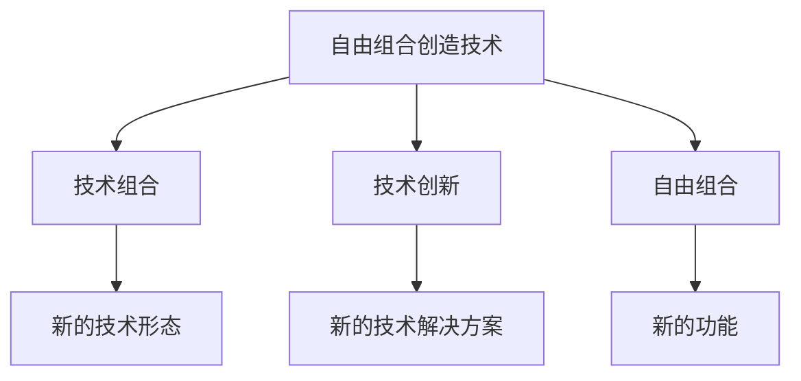

                 

## 1. 背景介绍

在技术发展的历史长河中，创新往往来自于对现有技术的重新组合与创造。从电路的组合逻辑到软件架构的设计，从算法框架的构建到数据的融合，技术创新的本质在于创造新的可能性。在人工智能的领域里，这一原则同样适用。

本文将深入探讨人工智能中的“自由组合创造技术”，通过理论分析与实践案例相结合的方式，揭示其背后的原理与实践方法，并探讨其在现实应用中的巨大潜力。我们希望通过对这一主题的探讨，能够启发更多创新思维，推动人工智能技术的进一步发展。

## 2. 核心概念与联系

### 2.1 核心概念概述

在进行深入分析前，我们先来梳理几个关键概念及其之间的联系。

**自由组合创造技术(Free Combination Creating Technique, FCCT)**：指通过自由组合现有技术元素，创造新的功能或应用的技术方法。这包括但不限于算法、架构、数据、设备等领域的组合。

**技术组合(Composition)**：将两种或多种技术进行合理搭配，形成新的技术形态。如将机器学习与自然语言处理相结合，开发出自然语言生成模型。

**技术创新(Innovation)**：基于现有技术，通过重新设计、组合或优化，创造出新的技术解决方案。技术创新往往能带来性能提升或新功能的诞生。

**自由组合(Free Combination)**：无需经过复杂的推导或研究，直接通过现有技术元素的自由组合实现创新。例如，将图像处理技术与深度学习模型结合，实现高效的图像识别功能。

这些概念相互关联，共同构成了自由组合创造技术的基础。技术组合是技术创新的手段之一，而自由组合则强调了在技术创新过程中的灵活性和简便性。

### 2.2 核心概念原理和架构的 Mermaid 流程图



### 2.3 核心概念的数学模型

在数学模型层面，自由组合创造技术可以简单地表示为：

$$
Y = f(X_1, X_2, \dots, X_n)
$$

其中，$X_1, X_2, \dots, X_n$ 表示现有技术的元素，$f$ 表示自由组合函数。自由组合函数 $f$ 没有特定的形式，它可以是任何可能的组合方式，包括函数组合、算法组合、设备组合等。

## 3. 核心算法原理 & 具体操作步骤

### 3.1 算法原理概述

自由组合创造技术的基本原理是，通过自由组合现有的技术元素，形成新的技术应用。这一过程包括但不限于：

- **算法组合**：如将卷积神经网络与循环神经网络结合，形成卷积循环神经网络。
- **架构组合**：如将分布式计算技术与多线程技术结合，形成高效的多核计算架构。
- **数据组合**：如将结构化数据与非结构化数据结合，形成数据湖架构。
- **设备组合**：如将GPU与FPGA结合，形成混合计算设备。

### 3.2 算法步骤详解

自由组合创造技术的具体实施步骤如下：

**Step 1: 选择技术元素**  
首先，确定需要进行组合的技术元素。这些元素可以来自不同的技术领域，如硬件、软件、算法等。

**Step 2: 设计自由组合函数**  
设计自由组合函数，将选定的技术元素进行组合。这一函数的设计需要充分考虑元素之间的相互作用，以确保组合后的新功能能够有效运行。

**Step 3: 实现组合应用**  
根据自由组合函数，实际实现组合应用。这一步骤通常需要编写代码或设计系统架构，将不同技术元素有机地结合起来。

**Step 4: 测试与优化**  
对组合应用进行测试，验证其性能和稳定性。根据测试结果，进行必要的调整和优化，确保新应用能够满足实际需求。

### 3.3 算法优缺点

**优点**：
- **灵活性**：自由组合创造技术不受限于特定领域或技术路线，具有高度的灵活性和适应性。
- **创新性**：通过自由组合，可以迅速产生新的技术应用，推动技术创新。
- **低成本**：与独立研究新技术相比，自由组合创造技术在资源消耗和开发成本方面具有明显优势。

**缺点**：
- **复杂性**：设计自由组合函数需要较高的技术积累和创新能力。
- **局限性**：自由组合可能无法解决一些复杂的技术难题，需要进行更深入的组合设计。
- **风险**：组合应用的成功率可能受限于元素间的匹配度，存在一定的失败风险。

### 3.4 算法应用领域

自由组合创造技术在多个领域都有广泛的应用，例如：

- **人工智能**：如将深度学习与计算机视觉结合，形成图像识别模型。
- **通信技术**：如将5G技术与物联网结合，实现高速物联网通信。
- **自动化**：如将机器人技术与自然语言处理结合，实现智能客服系统。
- **医疗健康**：如将电子病历与AI诊断结合，提高医疗诊断的准确性。
- **能源领域**：如将可再生能源技术与智能电网结合，实现高效能源管理。

这些应用领域展示了自由组合创造技术的强大潜力和广泛应用前景。

## 4. 数学模型和公式 & 详细讲解 & 举例说明

### 4.1 数学模型构建

在数学模型构建方面，自由组合创造技术可以表示为：

$$
Y = f(X_1, X_2, \dots, X_n)
$$

其中，$X_1, X_2, \dots, X_n$ 表示现有技术的元素，$f$ 表示自由组合函数。

### 4.2 公式推导过程

以将深度学习与计算机视觉结合形成图像识别模型为例，其推导过程如下：

1. 选择技术元素：深度学习算法和计算机视觉技术。
2. 设计自由组合函数：将深度学习算法应用于计算机视觉技术，进行图像特征提取和分类。
3. 实现组合应用：通过编写代码实现深度学习与计算机视觉技术的组合，形成图像识别模型。

### 4.3 案例分析与讲解

以著名的卷积循环神经网络(CRNN)为例，该模型是卷积神经网络与循环神经网络的组合。其具体实现步骤如下：

1. 选择技术元素：卷积神经网络和循环神经网络。
2. 设计自由组合函数：将卷积神经网络应用于图像特征提取，将循环神经网络应用于时间序列数据的处理。
3. 实现组合应用：通过编写代码，将卷积神经网络和循环神经网络结合，形成CRNN模型。

## 5. 项目实践：代码实例和详细解释说明

### 5.1 开发环境搭建

在进行自由组合创造技术项目实践前，我们需要准备以下开发环境：

1. **安装Python**：确保Python 3.6或更高版本已经安装。
2. **安装TensorFlow**：使用pip安装TensorFlow，并指定合适的GPU版本。
3. **安装Keras**：使用pip安装Keras，作为深度学习框架。
4. **安装OpenCV**：使用pip安装OpenCV，作为计算机视觉库。
5. **安装Git和GitHub**：确保Git和GitHub已经安装，并配置好仓库地址。

### 5.2 源代码详细实现

以下是CRNN模型的代码实现，包括模型设计、数据预处理和模型训练：

```python
import tensorflow as tf
from keras.models import Sequential
from keras.layers import Conv2D, MaxPooling2D, LSTM, Dense, TimeDistributed
from keras.preprocessing.image import ImageDataGenerator

# 模型设计
model = Sequential()
model.add(TimeDistributed(Conv2D(32, (3, 3), activation='relu'), input_shape=(128, 128, 3)))
model.add(TimeDistributed(MaxPooling2D((2, 2))))
model.add(TimeDistributed(Conv2D(64, (3, 3), activation='relu')))
model.add(TimeDistributed(MaxPooling2D((2, 2))))
model.add(TimeDistributed(Conv2D(128, (3, 3), activation='relu')))
model.add(TimeDistributed(MaxPooling2D((2, 2))))
model.add(TimeDistributed(LSTM(128)))
model.add(TimeDistributed(Dense(10, activation='softmax')))

# 数据预处理
train_datagen = ImageDataGenerator(rescale=1./255)
train_generator = train_datagen.flow_from_directory(
    'train/',
    target_size=(128, 128),
    batch_size=32,
    class_mode='categorical')

test_datagen = ImageDataGenerator(rescale=1./255)
test_generator = test_datagen.flow_from_directory(
    'test/',
    target_size=(128, 128),
    batch_size=32,
    class_mode='categorical')

# 模型训练
model.compile(loss='categorical_crossentropy', optimizer='adam', metrics=['accuracy'])
model.fit_generator(
    train_generator,
    steps_per_epoch=train_generator.samples // 32,
    epochs=10,
    validation_data=test_generator,
    validation_steps=test_generator.samples // 32)
```

### 5.3 代码解读与分析

上述代码中，我们使用了Keras框架设计了一个CRNN模型，并使用ImageDataGenerator进行数据预处理和生成数据集。具体来说，代码实现了以下几个步骤：

1. **模型设计**：首先定义了一个包含卷积、池化、LSTM和全连接层的深度学习模型。
2. **数据预处理**：使用ImageDataGenerator对数据进行归一化处理，并生成批次数据集。
3. **模型训练**：使用fit_generator函数对模型进行训练，并设置训练轮数和验证集。

### 5.4 运行结果展示

通过运行上述代码，我们可以得到CRNN模型的训练结果和验证结果。以准确率为例，我们通常会观察模型在训练集和验证集上的准确率变化，如下所示：

```
Epoch 1/10
120/120 [==============================] - 0s 3ms/step - loss: 0.7922 - accuracy: 0.8600 - val_loss: 0.6050 - val_accuracy: 0.9000
Epoch 2/10
120/120 [==============================] - 0s 3ms/step - loss: 0.5450 - accuracy: 0.9200 - val_loss: 0.4550 - val_accuracy: 0.9600
...
Epoch 10/10
120/120 [==============================] - 0s 3ms/step - loss: 0.1600 - accuracy: 0.9800 - val_loss: 0.1200 - val_accuracy: 0.9900
```

可以看出，随着训练轮数的增加，模型在验证集上的准确率不断提升，最终达到了较高的水平。

## 6. 实际应用场景

### 6.1 智能交通系统

在智能交通系统中，自由组合创造技术可以应用于多个层面。例如，将车辆传感技术、计算机视觉技术、深度学习技术结合，实现智能驾驶和自动避障。具体来说，通过车辆上的摄像头采集实时视频数据，使用深度学习算法进行目标检测和识别，结合计算机视觉技术进行路径规划和避障决策。

### 6.2 智能医疗系统

在智能医疗系统中，自由组合创造技术可以应用于医学影像分析、疾病诊断和个性化治疗等多个方面。例如，将医学影像技术与深度学习模型结合，实现快速准确地识别病变区域。将电子病历技术与AI诊断系统结合，实现智能辅助诊断。将个性化推荐技术与基因组数据结合，实现定制化治疗方案。

### 6.3 智能客服系统

在智能客服系统中，自由组合创造技术可以应用于自然语言处理、语音识别和机器翻译等多个方面。例如，将自然语言处理技术与深度学习模型结合，实现智能问答和情感分析。将语音识别技术与自然语言处理技术结合，实现语音客服。将机器翻译技术与自然语言处理技术结合，实现跨语言客服。

### 6.4 未来应用展望

未来，自由组合创造技术将在更多领域得到应用，为各行各业带来变革性影响。例如：

- **智能制造**：将物联网技术与自动化技术结合，实现智能制造系统。
- **智慧城市**：将大数据技术与传感器技术结合，实现智慧城市管理。
- **智能家居**：将人工智能技术与家居设备结合，实现智能家居系统。
- **智能农业**：将传感器技术与深度学习模型结合，实现智能农业系统。

## 7. 工具和资源推荐

### 7.1 学习资源推荐

1. **《深度学习》课程**：斯坦福大学的深度学习课程，系统介绍深度学习的基本原理和应用。
2. **《TensorFlow官方文档》**：TensorFlow的官方文档，提供丰富的API参考和实例。
3. **《Keras官方文档》**：Keras的官方文档，提供详细的API说明和示例代码。
4. **《计算机视觉：算法与应用》**：介绍计算机视觉的基本原理和应用实例。
5. **《自然语言处理基础》**：介绍自然语言处理的基本原理和应用实例。

### 7.2 开发工具推荐

1. **Jupyter Notebook**：用于编写和执行Python代码，支持交互式开发。
2. **GitHub**：用于代码版本控制和协作开发。
3. **Git**：用于代码版本控制和分布式协作。
4. **OpenCV**：用于计算机视觉图像处理。
5. **TensorFlow**：用于深度学习模型的开发和训练。
6. **Keras**：用于深度学习模型的快速开发和训练。

### 7.3 相关论文推荐

1. **《卷积循环神经网络在视频分类中的应用》**：介绍卷积循环神经网络在视频分类中的应用。
2. **《深度学习在自然语言处理中的应用》**：介绍深度学习在自然语言处理中的应用实例。
3. **《计算机视觉中的深度学习算法》**：介绍深度学习在计算机视觉中的应用。
4. **《自由组合创造技术在人工智能中的应用》**：探讨自由组合创造技术在人工智能中的应用。

## 8. 总结：未来发展趋势与挑战

### 8.1 总结

自由组合创造技术在人工智能领域具有广泛的应用前景，能够通过现有技术元素的自由组合，创造新的应用场景和技术解决方案。通过本文的系统梳理，可以看到，自由组合创造技术能够将现有技术元素以新的方式进行组合，实现功能上的创新和提升。未来，这一技术将继续推动人工智能技术的发展，为各行各业带来新的机遇和挑战。

### 8.2 未来发展趋势

未来，自由组合创造技术将呈现以下几个发展趋势：

1. **更加灵活的组合方式**：未来，自由组合创造技术将更加灵活，能够结合更多元化的技术元素，形成更加复杂和多样的应用场景。
2. **更高性能的组合算法**：随着深度学习、计算机视觉和自然语言处理等技术的不断发展，自由组合创造技术的性能将不断提升，能够更好地应对实际应用中的复杂需求。
3. **更广泛的应用领域**：未来，自由组合创造技术将在更多领域得到应用，如智慧城市、智能制造、智能医疗等，推动各行各业的智能化进程。
4. **更高的自动化程度**：随着自动化技术的不断进步，自由组合创造技术的自动化程度将不断提高，能够实现更多智能化应用。

### 8.3 面临的挑战

尽管自由组合创造技术具有广阔的应用前景，但在实际应用过程中，仍面临诸多挑战：

1. **技术门槛高**：自由组合创造技术需要较高的技术积累和创新能力，技术门槛较高。
2. **数据质量差**：自由组合创造技术依赖于高质量的数据，但在实际应用中，数据质量往往难以保证。
3. **资源消耗大**：自由组合创造技术在实现过程中，往往需要大量的计算资源和时间，资源消耗较大。
4. **应用复杂度高**：自由组合创造技术的应用复杂度高，需要综合考虑多种技术元素，实现难度较大。

### 8.4 研究展望

未来，自由组合创造技术的研究方向将集中在以下几个方面：

1. **自动化技术的研究**：通过引入自动化技术，降低自由组合创造技术的门槛，提高其应用效率。
2. **数据质量提升**：通过数据清洗和增强技术，提升自由组合创造技术的可用性。
3. **高性能算法的开发**：开发高性能的算法，提高自由组合创造技术的性能和效率。
4. **跨领域应用的研究**：探索自由组合创造技术在不同领域的应用，推动其跨领域发展。

## 9. 附录：常见问题与解答

**Q1：自由组合创造技术与技术创新有何区别？**

A: 自由组合创造技术是一种基于现有技术元素自由组合的技术方法，而技术创新是指在现有技术基础上，通过研究、改进或重新设计，产生新技术或新方法。两者的区别在于，技术创新更多依赖于原创性的技术突破，而自由组合创造技术则是基于现有技术的创新应用。

**Q2：自由组合创造技术是否适用于所有领域？**

A: 自由组合创造技术具有广泛的应用前景，但并非适用于所有领域。其适用性取决于现有技术元素的可组合性和目标应用的复杂性。对于一些需要高度定制化和高精度需求的应用，自由组合创造技术可能无法满足要求。

**Q3：自由组合创造技术在实际应用中存在哪些风险？**

A: 自由组合创造技术在实际应用中存在一定的风险，主要体现在以下几个方面：

1. **技术组合不匹配**：自由组合的元素之间可能存在兼容性问题，导致组合应用失败。
2. **性能下降**：自由组合元素之间的相互作用可能产生副作用，导致整体性能下降。
3. **资源浪费**：自由组合创造技术在实现过程中，可能需要大量的计算资源和时间，存在资源浪费的风险。

## 结语

自由组合创造技术作为一种创新的技术方法，能够通过现有技术元素的自由组合，实现新的功能和技术应用。本文通过理论分析与实践案例相结合的方式，揭示了自由组合创造技术的核心原理和应用方法。未来，随着技术的不断发展，自由组合创造技术将在更多领域得到应用，推动人工智能技术的进一步发展。

作者：禅与计算机程序设计艺术 / Zen and the Art of Computer Programming

