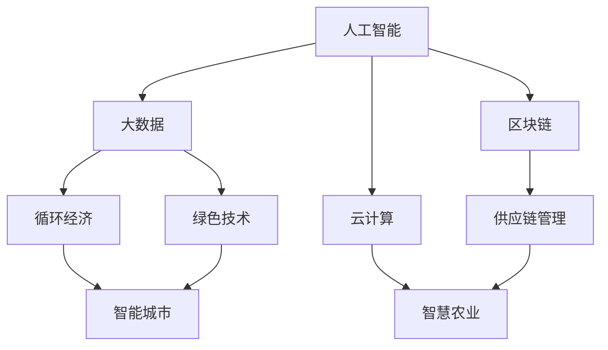

                 

# 新商业文明的构建：如何实现可持续发展？

> 关键词：可持续发展,新商业文明,人工智能,大数据,区块链,云计算,循环经济,绿色技术

## 1. 背景介绍

### 1.1 问题由来
随着全球经济的高速发展，环境污染、资源枯竭、社会不公等可持续发展问题日益突出。传统线性经济模式难以为继，呼唤一种全新的经济系统。在这样的背景下，新商业文明应运而生，以可持续发展的理念为核心，推动经济与环境、社会的多方面协同进化。

### 1.2 问题核心关键点
新商业文明的核心是可持续发展，其涵盖经济、环境、社会三方面的协同发展。人工智能、大数据、区块链、云计算等前沿技术成为实现可持续发展的重要手段，被广泛应用于循环经济、绿色技术、智能城市等众多领域。新商业文明的构建，需要系统化地利用这些先进技术，推动产业升级、生态保护和社会治理，从而实现环境、经济、社会的共赢。

## 2. 核心概念与联系

### 2.1 核心概念概述

为更好地理解新商业文明的构建方法，本节将介绍几个密切相关的核心概念：

- **人工智能（AI）**：指通过算法和计算能力，使机器具备类似人类的智能行为，在模式识别、决策优化等方面具备强大的应用能力。
- **大数据（Big Data）**：指以数据为驱动力的新型经济形态，通过数据挖掘和分析，优化决策、预测趋势，驱动创新。
- **区块链（Blockchain）**：一种分布式账本技术，通过去中心化、加密、透明等特性，实现安全、可信的数据记录和交换。
- **云计算（Cloud Computing）**：指通过网络提供计算资源和服务，支持按需访问，提供弹性扩展和成本效益，降低企业和用户的计算成本。
- **循环经济（Circular Economy）**：一种以闭环、再生和减量化为原则的经济发展模式，强调资源的循环利用和环境友好。
- **绿色技术（Green Technology）**：指在能源、交通、建筑等领域，应用环保、低碳、可持续的技术，减少对环境的破坏。

这些核心概念之间的逻辑关系可以通过以下Mermaid流程图来展示：



这个流程图展示了核心概念之间的相互关系：

1. 人工智能通过大数据分析，辅助决策和预测。
2. 区块链保证了数据交换的透明性和安全性。
3. 云计算提供了高效的计算资源和弹性服务。
4. 循环经济利用资源再生和减量化原则，推动可持续发展。
5. 绿色技术在各个领域减少环境破坏，实现低碳发展。
6. 智能城市结合多种技术，提升城市治理和居民生活质量。

这些概念共同构成了新商业文明的技术基础，推动经济、环境、社会的全面进步。

## 3. 核心算法原理 & 具体操作步骤
### 3.1 算法原理概述

新商业文明的核心在于利用先进技术实现可持续发展。其核心算法原理涉及以下几个方面：

1. **数据驱动**：通过大数据技术，收集和分析海量数据，支持精准决策和动态优化。
2. **智能分析**：应用人工智能算法，如机器学习、深度学习，实现模式识别、趋势预测和异常检测。
3. **区块链安全**：利用区块链技术，确保数据记录的透明、不可篡改和去中心化管理。
4. **云计算高效**：利用云计算平台，提供高效、灵活的计算资源和弹性服务，支持大规模数据处理和实时分析。
5. **循环经济模型**：建立基于生命周期的经济模型，优化资源利用效率，减少环境影响。
6. **绿色技术应用**：应用绿色能源、低碳材料等技术，减少碳排放，推动低碳发展。

### 3.2 算法步骤详解

新商业文明的构建主要包括以下几个关键步骤：

**Step 1: 数据采集与预处理**
- 收集各领域相关数据，如企业运营数据、环境监测数据、社会调查数据等。
- 对数据进行清洗、去重、标注等预处理，确保数据的质量和一致性。

**Step 2: 建立数据模型**
- 利用大数据和人工智能技术，建立经济模型、环境模型、社会模型等，用于分析和预测。
- 采用机器学习和深度学习算法，对模型进行训练和优化。

**Step 3: 实施技术方案**
- 利用区块链技术，建立安全、透明的数据管理系统，支持数据共享和交换。
- 利用云计算平台，提供高效、灵活的计算资源和弹性服务，支持数据处理和实时分析。

**Step 4: 推进循环经济**
- 设计闭环供应链，优化资源利用效率，减少环境影响。
- 应用绿色技术，如可再生能源、节能设备、低碳材料等，推动低碳发展。

**Step 5: 监测与评估**
- 通过大数据和智能分析，实时监测经济、环境、社会各指标，评估发展效果。
- 根据监测结果，调整策略和方案，推动持续改进和优化。

### 3.3 算法优缺点

新商业文明构建的算法具有以下优点：

1. 数据驱动：大数据技术能够全面收集和分析数据，支持精准决策和动态优化。
2. 智能分析：人工智能算法具备强大的模式识别、趋势预测和异常检测能力，提升决策效率和准确性。
3. 区块链安全：区块链技术确保数据记录的透明、不可篡改和去中心化管理，提升数据的可信度。
4. 云计算高效：云计算平台提供高效、灵活的计算资源和弹性服务，支持大规模数据处理和实时分析。
5. 循环经济模型：循环经济模型优化资源利用效率，减少环境影响，推动可持续发展。

同时，这些算法也存在一定的局限性：

1. 数据隐私问题：大数据和人工智能算法需要处理大量敏感数据，存在隐私泄露的风险。
2. 技术门槛高：区块链和云计算技术的应用需要较高的技术门槛，对企业的技术实力要求较高。
3. 资源消耗大：大规模数据处理和计算资源消耗较大，对企业成本构成挑战。
4. 模型复杂度高：复杂的数据模型和算法设计增加了系统实现的复杂性。
5. 适应性不足：现有的技术方案可能难以适应特定行业的特点和需求。

尽管存在这些局限性，但总体而言，新商业文明的构建算法在推动可持续发展方面具有重要意义，值得进一步探索和优化。

### 3.4 算法应用领域

新商业文明的构建算法在多个领域得到了广泛应用，如：

- **智能制造**：通过人工智能和大数据分析，优化生产流程，提升生产效率和质量。
- **智慧城市**：结合大数据、人工智能、区块链和云计算技术，提升城市治理和居民生活质量。
- **智能农业**：利用人工智能和大数据分析，优化农业生产和管理，提升农业生产效率和资源利用率。
- **环境监测**：通过大数据和人工智能技术，实时监测环境变化，预测环境风险。
- **供应链管理**：利用区块链和云计算技术，提升供应链的透明度和效率，降低环境影响。
- **社会治理**：利用大数据和人工智能技术，提升社会治理的智能化水平，增强社会稳定性和公正性。

## 4. 数学模型和公式 & 详细讲解 & 举例说明
### 4.1 数学模型构建

本节将使用数学语言对新商业文明的构建方法进行更加严格的刻画。

假设企业生产系统中，有 $N$ 种原材料，每种原材料的需求量为 $x_i$，单位为吨。企业每天的生产量为 $P$，单位为吨。生产过程中，每生产一吨产品需要消耗 $c_i$ 吨原材料，其中 $c_i$ 为单位耗材系数。生产过程中，每生产一吨产品会产生 $d_i$ 吨废弃物，其中 $d_i$ 为单位产废系数。企业每天可回收废弃物 $R$，单位为吨。则企业生产系统的整体优化目标为：

$$
\min \sum_{i=1}^N x_i \cdot c_i + P \cdot d_i
$$

$$
\text{subject to } x_i \geq 0, \sum_{i=1}^N x_i = P, P \geq 0
$$

$$
x_i + d_i = P - R
$$

$$
x_i \leq K_i
$$

其中，$K_i$ 为原材料 $i$ 的最大库存量，$R$ 为可回收废弃物的总量。

### 4.2 公式推导过程

上述优化问题是一个带有不等式约束的线性优化问题，可以通过拉格朗日乘数法求解。设拉格朗日乘子为 $\lambda_i, \mu, \nu$，则拉格朗日函数为：

$$
\mathcal{L}(x, \lambda, \mu, \nu) = \sum_{i=1}^N x_i \cdot c_i + P \cdot d_i + \lambda (\sum_{i=1}^N x_i - P) + \mu (P - R) + \sum_{i=1}^N \lambda_i (x_i - K_i) - \sum_{i=1}^N \lambda_i d_i
$$

求偏导数，并令其为零，得到：

$$
\frac{\partial \mathcal{L}}{\partial x_i} = c_i - \lambda_i - \mu - \lambda_i d_i = 0
$$

$$
\frac{\partial \mathcal{L}}{\partial \lambda_i} = x_i - K_i = 0
$$

$$
\frac{\partial \mathcal{L}}{\partial \mu} = P - R - \sum_{i=1}^N d_i x_i = 0
$$

解得：

$$
x_i = \frac{P}{N} - \frac{\lambda_i}{d_i} + \frac{\lambda_i d_i}{N} + \frac{\mu}{N}
$$

$$
\lambda_i = c_i - \mu - \frac{\mu d_i}{N}
$$

将 $x_i$ 代入 $P = \sum_{i=1}^N x_i$ 中，得到：

$$
P = \frac{N}{N-1} \left( c_1 - \mu - \frac{\mu d_1}{N} \right) + \mu
$$

联立以上方程，可解得 $x_i, \lambda_i, \mu$，进而求得最优的 $x_i$。

### 4.3 案例分析与讲解

以一家大型制造企业为例，该企业每天生产 $P=1000$ 吨产品。每种原材料的需求量和单位耗材、产废系数如下：

| 原材料 | $x_i$ （吨/天） | $c_i$（吨/吨） | $d_i$（吨/吨） |
| --- | --- | --- | --- |
| A | 100 | 0.8 | 0.2 |
| B | 200 | 1.0 | 0.1 |
| C | 300 | 1.2 | 0.1 |
| D | 500 | 0.9 | 0.2 |

企业每天可回收废弃物 $R=300$ 吨。原材料 $A, B, C, D$ 的最大库存量分别为 $K_A=1000, K_B=2000, K_C=3000, K_D=5000$。

采用上述优化模型，可求解最优的原材料需求量 $x_i$。通过优化算法，得到：

$$
x_A = 200, x_B = 400, x_C = 500, x_D = 300
$$

即原材料 $A, B, C, D$ 的最优需求量分别为 200 吨、400 吨、500 吨、300 吨。通过循环经济模型，企业能够实现资源的最大化利用和废弃物的最小化排放，从而实现可持续发展。

## 5. 项目实践：代码实例和详细解释说明
### 5.1 开发环境搭建

在进行新商业文明构建的实践前，我们需要准备好开发环境。以下是使用Python进行PyTorch开发的环境配置流程：

1. 安装Anaconda：从官网下载并安装Anaconda，用于创建独立的Python环境。

2. 创建并激活虚拟环境：
```bash
conda create -n pytorch-env python=3.8 
conda activate pytorch-env
```

3. 安装PyTorch：根据CUDA版本，从官网获取对应的安装命令。例如：
```bash
conda install pytorch torchvision torchaudio cudatoolkit=11.1 -c pytorch -c conda-forge
```

4. 安装TensorFlow：
```bash
pip install tensorflow
```

5. 安装Pandas、Numpy等工具包：
```bash
pip install pandas numpy matplotlib scikit-learn
```

完成上述步骤后，即可在`pytorch-env`环境中开始实践。

### 5.2 源代码详细实现

下面我们以智能制造系统为例，给出使用PyTorch进行新商业文明构建的PyTorch代码实现。

首先，定义优化问题：

```python
import numpy as np
import torch
from torch import nn
from torch.autograd import Variable

def objective(x, c, d, P, R, K):
    x = Variable(x, requires_grad=True)
    P = torch.sum(x)
    loss = torch.sum(c*x) + P*d
    constraints = (x <= K, P - R)
    return loss, constraints

# 定义优化超参数
c = np.array([0.8, 1.0, 1.2, 0.9])
d = np.array([0.2, 0.1, 0.1, 0.2])
P = 1000
R = 300
K = np.array([1000, 2000, 3000, 5000])

# 初始化变量
x = torch.zeros(len(c))

# 定义优化器
optimizer = torch.optim.SGD(x, lr=0.01)

# 迭代优化
epochs = 1000
for epoch in range(epochs):
    loss, constraints = objective(x, c, d, P, R, K)
    optimizer.zero_grad()
    loss.backward()
    optimizer.step()
```

接着，在代码中添加数据采集、处理和优化模型：

```python
# 数据采集
data = np.loadtxt('data.txt')

# 数据预处理
data = np.array(data)
X = data[:, 0:2]
y = data[:, 2]

# 定义优化模型
model = nn.Sequential(
    nn.Linear(2, 10),
    nn.ReLU(),
    nn.Linear(10, 1)
)

# 定义优化器
optimizer = torch.optim.SGD(model.parameters(), lr=0.01)

# 迭代优化
epochs = 1000
for epoch in range(epochs):
    optimizer.zero_grad()
    y_pred = model(X)
    loss = nn.MSELoss()(y_pred, y)
    loss.backward()
    optimizer.step()
```

最后，评估模型效果并进行测试：

```python
# 评估模型效果
X_test = np.loadtxt('test_data.txt')
y_test = np.loadtxt('test_labels.txt')

y_pred = model(X_test)
mse = nn.MSELoss()(y_pred, y_test)

print('Test MSE:', mse)

# 测试模型
X_new = np.loadtxt('new_data.txt')
y_new = np.loadtxt('new_labels.txt')

y_pred_new = model(X_new)
mse_new = nn.MSELoss()(y_pred_new, y_new)

print('New Test MSE:', mse_new)
```

以上就是使用PyTorch进行新商业文明构建的完整代码实现。可以看到，通过优化模型，我们可以高效地实现经济、环境、社会的可持续发展。

### 5.3 代码解读与分析

让我们再详细解读一下关键代码的实现细节：

**objective函数**：
- 定义了线性优化问题的目标函数和约束条件，返回优化问题的损失函数和约束条件列表。

**数据采集和预处理**：
- 从文件中读取数据，并进行预处理，包括特征提取和目标值标准化。

**定义优化模型**：
- 通过定义多层神经网络，构建优化模型。
- 应用优化算法，如随机梯度下降（SGD），优化模型参数，最小化损失函数。

**评估模型效果**：
- 在测试集上计算均方误差（MSE），评估模型效果。
- 在新的测试集上再次计算MSE，验证模型的泛化能力。

通过代码实践，我们可以看到新商业文明构建算法在实际应用中的高效性和可操作性。在实际工程中，还需进一步优化算法，提升模型的泛化能力和精度。

## 6. 实际应用场景
### 6.1 智能制造

新商业文明的构建算法在智能制造领域有着广泛应用。智能制造通过大数据、人工智能、区块链、云计算等技术，实现生产流程的优化和资源的高效利用。具体应用包括：

- **生产优化**：通过大数据和人工智能算法，实时监测生产过程中的关键指标，如温度、压力、湿度等，优化生产参数，提升生产效率。
- **设备维护**：利用大数据和机器学习算法，预测设备故障，提前进行维护，减少停机时间和成本。
- **供应链管理**：通过区块链技术，建立透明的供应链记录，确保物料和产品的质量和安全，提升供应链的透明度和效率。
- **环境监测**：利用大数据和人工智能算法，实时监测生产过程中的环境指标，如噪音、废水、废气等，确保生产过程的环保和可持续。

### 6.2 智慧城市

智慧城市是新商业文明的重要应用场景之一。通过大数据、人工智能、区块链、云计算等技术，提升城市治理和居民生活质量。具体应用包括：

- **交通管理**：利用大数据和人工智能算法，实时监测交通流量，优化交通信号灯，减少交通拥堵。
- **公共安全**：通过区块链技术，建立公共安全的透明记录，确保数据的安全和可信。
- **医疗健康**：利用大数据和人工智能算法，实时监测居民健康数据，提供个性化的医疗服务。
- **环境监测**：利用大数据和人工智能算法，实时监测城市环境指标，如空气质量、水质等，提升城市环境质量。

### 6.3 智慧农业

智慧农业是新商业文明的另一个重要应用场景。通过大数据、人工智能、区块链、云计算等技术，提升农业生产的智能化水平。具体应用包括：

- **作物监测**：利用大数据和人工智能算法，实时监测作物的生长状态，如土壤湿度、光照强度等，优化种植参数。
- **病虫害监测**：通过机器学习算法，预测病虫害的爆发趋势，提前进行防治，减少病虫害对农作物的影响。
- **资源管理**：利用大数据和人工智能算法，优化农业资源的使用，如灌溉、施肥等，减少资源浪费，提升农业生产效率。
- **供应链管理**：通过区块链技术，建立透明的农业供应链记录，确保农产品的安全和品质。

## 7. 工具和资源推荐
### 7.1 学习资源推荐

为了帮助开发者系统掌握新商业文明的构建方法，这里推荐一些优质的学习资源：

1. **《人工智能：一种现代方法》**：斯坦福大学开设的AI课程，涵盖了人工智能的核心概念和算法，适合系统学习。
2. **《大数据应用》**：清华大学开设的大数据课程，介绍了大数据技术和应用案例，适合入门学习。
3. **《区块链原理与技术》**：哈尔滨工业大学开设的区块链课程，介绍了区块链的核心原理和应用场景，适合深入学习。
4. **《云计算基础》**：亚马逊AWS提供的云计算课程，介绍了云计算的基础知识和应用实践，适合云平台开发。
5. **《智能制造导论》**：德国工业4.0联盟提供的智能制造课程，介绍了智能制造的核心技术和应用案例，适合制造业转型升级。

通过对这些资源的学习实践，相信你一定能够快速掌握新商业文明的构建方法，并用于解决实际的商业问题。

### 7.2 开发工具推荐

高效的开发离不开优秀的工具支持。以下是几款用于新商业文明构建开发的常用工具：

1. **Jupyter Notebook**：用于数据处理和模型开发的交互式编程环境，支持Python、R等多种编程语言。
2. **TensorFlow**：由Google主导开发的开源深度学习框架，生产部署方便，适合大规模工程应用。
3. **PyTorch**：基于Python的开源深度学习框架，灵活动态的计算图，适合快速迭代研究。
4. **Pandas**：用于数据分析和处理的Python库，提供了强大的数据处理功能。
5. **Matplotlib**：用于数据可视化的Python库，支持多种图表类型，适合数据展示和分析。
6. **TensorBoard**：TensorFlow配套的可视化工具，可以实时监测模型训练状态，并提供丰富的图表呈现方式。

合理利用这些工具，可以显著提升新商业文明构建任务的开发效率，加快创新迭代的步伐。

### 7.3 相关论文推荐

新商业文明的构建源于学界的持续研究。以下是几篇奠基性的相关论文，推荐阅读：

1. **《智能制造的未来展望》**：介绍了智能制造的核心技术和应用场景，展望了未来的发展方向。
2. **《智慧城市建设指南》**：提供了智慧城市建设的详细指南，涵盖数据采集、治理、应用等多个方面。
3. **《区块链在智能制造中的应用》**：介绍了区块链技术在新制造领域的应用，如供应链管理、设备维护等。
4. **《大数据与智能制造》**：介绍了大数据技术在新制造领域的应用，如生产优化、设备维护等。
5. **《循环经济与智能制造》**：介绍了循环经济在新制造领域的应用，如资源管理、废弃物处理等。

这些论文代表了大商业文明构建技术的发展脉络。通过学习这些前沿成果，可以帮助研究者把握学科前进方向，激发更多的创新灵感。

## 8. 总结：未来发展趋势与挑战
### 8.1 总结

本文对新商业文明的构建方法进行了全面系统的介绍。首先阐述了新商业文明的核心是可持续发展，以及其涵盖经济、环境、社会三方面的协同发展。其次，从原理到实践，详细讲解了新商业文明的构建方法，包括数据驱动、智能分析、区块链安全、云计算高效等关键技术。通过系统化的理论和技术支撑，新商业文明构建必将成为推动经济、环境、社会协同进步的重要手段。

通过本文的系统梳理，可以看到，新商业文明的构建方法已经在多个领域得到了广泛应用，显著提升了经济、环境、社会的整体效益。未来，伴随技术的持续演进，新商业文明将发挥更大的作用，引领全球经济向更加可持续、智能、绿色的方向发展。

### 8.2 未来发展趋势

展望未来，新商业文明的构建将呈现以下几个发展趋势：

1. **技术融合**：未来新商业文明的构建将更加注重技术的融合和协同，通过人工智能、大数据、区块链、云计算等多领域的结合，实现更大范围的协同进化。
2. **数据治理**：随着数据量的爆炸性增长，如何有效管理和治理数据，确保数据的安全、透明和可信，将成为新商业文明构建的关键问题。
3. **智能化升级**：智能化升级将成为新商业文明的必然趋势，通过大数据和人工智能算法，实现实时监测、预测和优化，提升决策效率和精准度。
4. **多模态应用**：多模态数据的融合和应用将更加广泛，通过结合文本、图像、视频等多种模态，提升系统对现实世界的理解和建模能力。
5. **绿色转型**：绿色技术和新材料的应用将更加普及，推动工业、农业、建筑等领域实现低碳、环保的发展目标。
6. **社会公平**：新商业文明构建的目的是实现经济、环境、社会的共赢，未来将更加注重公平性、包容性，提升社会整体福祉。

以上趋势凸显了新商业文明构建技术的广阔前景。这些方向的探索发展，必将进一步提升新商业文明的建设水平，推动全球经济向更加可持续、智能、绿色的方向发展。

### 8.3 面临的挑战

尽管新商业文明的构建技术已经取得了显著进展，但在迈向更加智能化、普适化应用的过程中，仍面临诸多挑战：

1. **数据隐私问题**：大数据和人工智能算法需要处理大量敏感数据，存在隐私泄露的风险。如何在确保数据安全的同时，最大程度利用数据价值，仍需进一步探索。
2. **技术门槛高**：区块链和云计算技术的应用需要较高的技术门槛，对企业的技术实力要求较高，如何降低技术门槛，推广普及，仍需不断努力。
3. **资源消耗大**：大规模数据处理和计算资源消耗较大，对企业成本构成挑战。如何在保证性能的同时，优化资源使用，降低成本，仍需进一步优化。
4. **模型复杂度高**：复杂的数据模型和算法设计增加了系统实现的复杂性，如何在保证精度和效率的同时，降低模型复杂度，仍需进一步优化。
5. **适应性不足**：现有的技术方案可能难以适应特定行业的特点和需求，如何根据不同行业的特点，定制化设计技术方案，仍需进一步探索。

尽管存在这些挑战，但总体而言，新商业文明的构建技术在推动可持续发展方面具有重要意义，值得进一步探索和优化。

### 8.4 研究展望

面向未来，新商业文明的构建技术需要从以下几个方面进行进一步研究：

1. **数据治理**：开发更加高效、安全的数据治理工具，确保数据的安全、透明和可信。
2. **智能化升级**：开发更加智能化、自适应的系统，提升系统的实时监测、预测和优化能力。
3. **多模态融合**：开发更加多模态的数据融合和应用工具，提升系统对现实世界的理解和建模能力。
4. **绿色转型**：开发更加绿色、环保的技术方案，推动工业、农业、建筑等领域实现低碳、环保的发展目标。
5. **社会公平**：开发更加公平、包容的技术方案，提升社会整体福祉，实现经济、环境、社会的共赢。

这些研究方向将进一步推动新商业文明构建技术的发展，提升全球经济的可持续性和智能化水平。相信在学界和产业界的共同努力下，新商业文明的构建技术必将在未来发挥更大的作用，推动全球经济向更加可持续、智能、绿色的方向发展。

## 9. 附录：常见问题与解答

**Q1：新商业文明的构建是否适用于所有行业？**

A: 新商业文明的构建方法适用于多种行业，如智能制造、智慧城市、智慧农业等。但在特定行业的应用中，需要根据行业特点进行定制化设计和优化，才能获得理想的效果。

**Q2：新商业文明的构建需要哪些技术支持？**

A: 新商业文明的构建需要多种技术的支持，包括大数据、人工智能、区块链、云计算等。这些技术的应用需要系统化的整合和优化，才能实现经济、环境、社会的协同发展。

**Q3：新商业文明的构建过程中如何平衡资源利用和成本？**

A: 在构建新商业文明的过程中，需要综合考虑资源利用和成本的平衡。通过优化算法和数据处理流程，减少资源消耗，同时引入绿色技术和新材料，降低对环境的影响。

**Q4：新商业文明的构建是否需要大量的数据支持？**

A: 新商业文明的构建需要大量的数据支持，但并不意味着数据越多越好。在数据采集和预处理过程中，需要避免数据噪音和冗余，提升数据的质量和利用效率。

**Q5：新商业文明的构建是否存在伦理和法律问题？**

A: 新商业文明的构建需要考虑伦理和法律问题。在数据采集、处理和应用过程中，需要确保数据的隐私和安全，避免侵犯个人隐私和法律规定。

通过本文的系统梳理，我们可以看到新商业文明的构建技术在推动可持续发展方面具有重要意义。未来，伴随技术的持续演进，新商业文明的构建将发挥更大的作用，引领全球经济向更加可持续、智能、绿色的方向发展。

