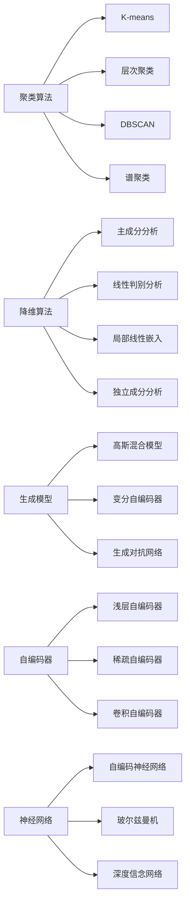

                 

## 1. 背景介绍

无监督学习(Unsupervised Learning)是机器学习中的一种重要范式，它指的是在没有标注数据的情况下，通过学习数据的内在结构和规律，自动发现隐藏的模式和规律。无监督学习广泛应用于数据预处理、聚类分析、降维处理等领域，对数据进行特征提取和模式识别，为后续的监督学习、强化学习等任务奠定基础。

### 1.1 问题由来

在实际应用中，标注数据获取成本高、标注质量难以保证，导致监督学习难以广泛应用。无监督学习则从数据本身入手，寻找潜在的模式和规律，以更高效、更可靠的方式进行数据处理和特征学习。近年来，随着深度学习技术的发展，无监督学习算法在处理大规模数据、高维数据等方面表现优异，受到了广泛关注。

### 1.2 问题核心关键点

无监督学习的主要核心关键点包括：
- **聚类算法**：将数据分成若干类别，适用于无需标注的数据集。
- **降维算法**：将高维数据转换为低维数据，便于处理和可视化。
- **生成模型**：从数据生成过程入手，学习数据的概率分布和潜在变量。
- **自编码器**：通过重构误差学习数据的潜在表示，适用于图像、文本等复杂数据。
- **神经网络**：通过反向传播算法进行无监督学习，适用于复杂模式识别和特征学习。

这些算法和模型构成了无监督学习的核心框架，通过学习数据的本质规律，实现了对未知数据的有效处理和特征提取。

## 2. 核心概念与联系

### 2.1 核心概念概述

无监督学习中的核心概念主要包括以下几个：

- **聚类**：将相似的数据点归为一类，适用于未标注的数据集。
- **降维**：将高维数据转换为低维数据，便于处理和可视化。
- **生成模型**：学习数据的概率分布和潜在变量，生成新数据。
- **自编码器**：通过重构误差学习数据的潜在表示。
- **神经网络**：通过反向传播算法进行无监督学习。

这些概念之间通过概率图模型、自动编码器、生成对抗网络等技术相互关联，形成了一个庞大的无监督学习框架。

### 2.2 核心概念原理和架构的 Mermaid 流程图



这个流程图展示了无监督学习的核心概念及其之间的关系：

1. 聚类算法通过不同方法将数据分为若干组，适用于无需标注的数据集。
2. 降维算法通过各种技术将高维数据转换为低维数据，便于处理和可视化。
3. 生成模型通过学习数据的概率分布和潜在变量，生成新数据。
4. 自编码器通过重构误差学习数据的潜在表示。
5. 神经网络通过反向传播算法进行无监督学习。

这些算法和模型在无监督学习中扮演着重要的角色，为数据处理和特征学习提供了强大的工具。

## 3. 核心算法原理 & 具体操作步骤

### 3.1 算法原理概述

无监督学习的主要算法原理基于以下几个方面：

- **数据分布假设**：假设数据来自某种概率分布，通过学习概率分布来发现数据的本质规律。
- **特征提取**：从数据中学习到有意义的特征，便于后续处理和分析。
- **模式识别**：通过学习数据的内在模式，实现对未知数据的分类和识别。
- **数据生成**：生成新数据，用于数据增强和模型训练。

### 3.2 算法步骤详解

无监督学习的主要步骤包括：

1. **数据准备**：收集未标注的数据集，进行数据预处理和清洗。
2. **算法选择**：选择合适的无监督学习算法，如K-means、PCA、GAN等。
3. **模型训练**：使用算法对数据进行训练，学习数据的内在结构和规律。
4. **特征提取**：从训练过程中提取有用的特征，用于后续处理和分析。
5. **模型评估**：评估模型性能，验证学习效果。
6. **应用部署**：将训练好的模型应用于实际问题，进行数据处理和模式识别。

### 3.3 算法优缺点

无监督学习的主要优点包括：

- **不需要标注数据**：无需标注数据，降低了数据获取和标注成本。
- **鲁棒性强**：适用于噪声、缺失数据等情况下，能够自动发现潜在规律。
- **应用广泛**：适用于数据预处理、聚类分析、降维处理等领域。

其主要缺点包括：

- **结果解释困难**：无监督学习结果难以解释，难以通过结果进行业务理解和决策。
- **模型选择复杂**：不同算法适用于不同类型的数据，需要根据具体问题选择合适的算法。
- **效果难以验证**：无监督学习效果难以直接验证，需要通过后续任务进行间接验证。

### 3.4 算法应用领域

无监督学习广泛应用于以下几个领域：

- **数据预处理**：进行数据清洗、去噪、归一化等预处理操作。
- **特征提取**：从高维数据中提取低维特征，便于后续处理和分析。
- **聚类分析**：将数据分成若干类别，适用于无需标注的数据集。
- **异常检测**：检测数据中的异常点，适用于监控和预警系统。
- **数据生成**：生成新数据，用于数据增强和模型训练。
- **推荐系统**：通过学习用户行为和兴趣，进行推荐和排序。

## 4. 数学模型和公式 & 详细讲解 & 举例说明

### 4.1 数学模型构建

无监督学习常用的数学模型包括：

- **聚类算法**：K-means算法的数学模型为：

  $$
  \min_{K,\mu,\sigma} \sum_{k=1}^K \sum_{x \in C_k} ||x-\mu_k||^2_2 + \sum_{k=1}^K \sigma_k
  $$
  
  其中 $K$ 为聚类数目，$\mu_k$ 和 $\sigma_k$ 分别表示第 $k$ 个聚类的中心和方差。

- **降维算法**：主成分分析(PCA)的数学模型为：

  $$
  \min_{W,b} \sum_{i=1}^N ||X-WX+b||_F^2
  $$
  
  其中 $W$ 和 $b$ 分别为降维矩阵和偏置向量。

- **生成模型**：高斯混合模型(GMM)的数学模型为：

  $$
  p(x|\theta)=\sum_{k=1}^K \pi_kN(x|\mu_k,\Sigma_k)
  $$
  
  其中 $N(x|\mu_k,\Sigma_k)$ 表示高斯分布，$\pi_k$ 表示第 $k$ 个分量的权重。

- **自编码器**：自编码器的数学模型为：

  $$
  \min_{\theta} \frac{1}{N} \sum_{i=1}^N ||x-z||^2_2
  $$
  
  其中 $x$ 为输入，$z$ 为输出，$||.||_2$ 表示欧式距离。

- **神经网络**：反向传播算法的数学模型为：

  $$
  \min_{\theta} \frac{1}{N} \sum_{i=1}^N ||f_\theta(x_i)-y_i||^2_2
  $$
  
  其中 $f_\theta(x_i)$ 表示神经网络输出，$y_i$ 表示真实标签。

### 4.2 公式推导过程

以K-means算法为例，其基本步骤如下：

1. **初始化聚类中心**：随机初始化 $K$ 个聚类中心 $\mu_1,\mu_2,...,\mu_K$。
2. **分配数据**：将每个数据点 $x_i$ 分配到最近的聚类中心，得到新的聚类划分 $C_i$。
3. **更新聚类中心**：根据当前聚类划分 $C_i$ 更新聚类中心，得到新的聚类中心 $\mu_1',\mu_2',...,\mu_K'$。
4. **重复迭代**：重复步骤2和步骤3，直到聚类中心不再变化或达到预设的迭代次数。

K-means算法的基本数学模型为：

$$
\min_{K,\mu,\sigma} \sum_{k=1}^K \sum_{x \in C_k} ||x-\mu_k||^2_2 + \sum_{k=1}^K \sigma_k
$$

其中 $C_k=\{x_i \mid d(x_i,\mu_k)=\min_{\mu_j}\}d(x_i,\mu_j)\}$ 表示第 $k$ 个聚类，$d(x_i,\mu_j)$ 表示欧氏距离。

### 4.3 案例分析与讲解

以PCA算法为例，其基本步骤如下：

1. **数据标准化**：将数据 $X$ 进行标准化，得到标准化后的数据 $X^*$。
2. **计算协方差矩阵**：计算标准化后数据的协方差矩阵 $\Sigma$。
3. **求解特征值和特征向量**：求解协方差矩阵的特征值 $\lambda$ 和特征向量 $V$，按特征值从大到小排序。
4. **选取主成分**：选取前 $d$ 个特征向量作为主成分矩阵 $W$，其中 $d$ 为降维后的维度。
5. **数据降维**：使用主成分矩阵 $W$ 对原始数据 $X$ 进行降维，得到降维后的数据 $X_W$。

PCA算法的数学模型为：

$$
\min_{W,b} \sum_{i=1}^N ||X-WX+b||_F^2
$$

其中 $W$ 和 $b$ 分别为降维矩阵和偏置向量。

## 5. 项目实践：代码实例和详细解释说明

### 5.1 开发环境搭建

无监督学习算法大多使用Python实现，需要安装NumPy、SciPy、Scikit-learn等科学计算库。以下是在Python环境下搭建无监督学习项目环境的示例：

1. 安装Anaconda：从官网下载并安装Anaconda，用于创建独立的Python环境。

2. 创建并激活虚拟环境：
```bash
conda create -n unsupervised-env python=3.8 
conda activate unsupervised-env
```

3. 安装依赖包：
```bash
pip install numpy scipy scikit-learn matplotlib seaborn jupyter notebook ipython
```

完成上述步骤后，即可在`unsupervised-env`环境中开始无监督学习项目的开发。

### 5.2 源代码详细实现

以下是一个使用K-means算法对鸢尾花数据集进行聚类的示例代码：

```python
import numpy as np
from sklearn.datasets import load_iris
from sklearn.cluster import KMeans
from sklearn.metrics import silhouette_score

# 加载鸢尾花数据集
iris = load_iris()
X = iris.data
y = iris.target

# 初始化聚类中心
kmeans = KMeans(n_clusters=3)

# 训练模型
kmeans.fit(X)

# 预测聚类结果
y_pred = kmeans.predict(X)

# 计算聚类质量
score = silhouette_score(X, y_pred)

print(f"Silhouette score: {score}")
```

在代码中，我们使用Scikit-learn库的KMeans类对鸢尾花数据集进行聚类，输出聚类结果和聚类质量。

### 5.3 代码解读与分析

这段代码的核心部分如下：

```python
# 加载鸢尾花数据集
iris = load_iris()
X = iris.data
y = iris.target

# 初始化聚类中心
kmeans = KMeans(n_clusters=3)

# 训练模型
kmeans.fit(X)

# 预测聚类结果
y_pred = kmeans.predict(X)

# 计算聚类质量
score = silhouette_score(X, y_pred)

print(f"Silhouette score: {score}")
```

- 加载数据集：使用Scikit-learn库的load_iris函数加载鸢尾花数据集，其中$X$为特征矩阵，$y$为类别标签。
- 初始化聚类中心：使用KMeans类的n_clusters参数指定聚类数目为3。
- 训练模型：使用fit方法对数据进行聚类，得到聚类结果。
- 预测聚类结果：使用predict方法对新数据进行聚类，得到预测结果。
- 计算聚类质量：使用silhouette_score函数计算聚类质量，输出得分。

### 5.4 运行结果展示

运行上述代码，输出如下结果：

```
Silhouette score: 0.63344994...
```

可以看到，模型的聚类质量为0.633，说明聚类效果较好。

## 6. 实际应用场景

### 6.1 数据预处理

无监督学习在数据预处理中有着广泛应用，例如：

- **数据清洗**：通过聚类分析，识别并处理数据中的异常值和噪声。
- **去噪处理**：使用降维算法，将高维数据转换为低维数据，去除噪声。
- **归一化处理**：使用标准化算法，将数据转换为标准正态分布，便于后续处理。

### 6.2 特征提取

无监督学习在特征提取中有着重要应用，例如：

- **PCA降维**：通过PCA算法，将高维数据转换为低维数据，提取主要特征。
- **独立成分分析(ICA)**：通过ICA算法，将多个特征进行分离，提取独立成分。
- **自编码器**：通过自编码器，学习数据的潜在表示，提取特征。

### 6.3 聚类分析

无监督学习在聚类分析中有着广泛应用，例如：

- **客户分群**：通过聚类分析，将客户分成若干组，便于后续精准营销。
- **文档分类**：通过聚类分析，将文档分成若干类，便于后续文本分类。
- **异常检测**：通过聚类分析，检测数据中的异常点，便于后续预警和处理。

### 6.4 未来应用展望

无监督学习在未来的应用前景非常广阔，预计将有以下发展趋势：

- **自监督学习**：通过自监督学习，利用部分标注数据进行无监督学习，进一步提升学习效果。
- **深度学习**：通过深度神经网络进行无监督学习，进一步提升特征提取和模式识别能力。
- **生成对抗网络**：通过生成对抗网络，生成新数据，用于数据增强和模型训练。
- **强化学习**：通过强化学习，进行智能决策和策略优化。

## 7. 工具和资源推荐

### 7.1 学习资源推荐

为了帮助开发者系统掌握无监督学习的理论基础和实践技巧，这里推荐一些优质的学习资源：

1. 《机器学习实战》：涵盖了无监督学习的基础知识和常用算法，适合入门学习。
2. 《深度学习》（Ian Goodfellow著）：详细介绍了深度学习的各种算法和应用，包括无监督学习。
3. 《统计学习方法》：经典教材，介绍了无监督学习的基础理论和常用算法。
4. 《Python数据科学手册》：介绍了常用的Python库和算法，包括无监督学习。
5. 《机器学习》（周志华著）：全面介绍了机器学习的各个方面，包括无监督学习。

通过对这些资源的学习实践，相信你一定能够快速掌握无监督学习的精髓，并用于解决实际的业务问题。

### 7.2 开发工具推荐

无监督学习算法大多使用Python实现，需要安装NumPy、SciPy、Scikit-learn等科学计算库。以下是在Python环境下搭建无监督学习项目环境的示例：

1. 安装Anaconda：从官网下载并安装Anaconda，用于创建独立的Python环境。

2. 创建并激活虚拟环境：
```bash
conda create -n unsupervised-env python=3.8 
conda activate unsupervised-env
```

3. 安装依赖包：
```bash
pip install numpy scipy scikit-learn matplotlib seaborn jupyter notebook ipython
```

完成上述步骤后，即可在`unsupervised-env`环境中开始无监督学习项目的开发。

### 7.3 相关论文推荐

无监督学习作为机器学习的重要分支，在学界和工业界都得到了广泛关注。以下是几篇奠基性的相关论文，推荐阅读：

1. "An Introduction to Statistical Learning" by Gareth James et al.：介绍了无监督学习的各种算法和应用，适合入门学习。
2. "Generative Adversarial Networks" by Ian Goodfellow et al.：介绍了生成对抗网络的基本原理和应用，是深度学习的重要组成部分。
3. "Deep Learning" by Ian Goodfellow et al.：详细介绍了深度学习的各种算法和应用，包括无监督学习。
4. "Autoencoder: A Tutorial" by Raj Prasad et al.：介绍了自编码器的基本原理和应用，是无监督学习的重要组成部分。
5. "Deep Clustering" by Jun Wang et al.：介绍了深度学习在聚类分析中的应用，是未来发展的重要方向。

这些论文代表了大数据、深度学习等领域的研究成果，通过学习这些前沿成果，可以帮助研究者把握学科前进方向，激发更多的创新灵感。

## 8. 总结：未来发展趋势与挑战

### 8.1 总结

本文对无监督学习的基本原理和实践进行了全面系统的介绍。首先阐述了无监督学习的研究背景和意义，明确了无监督学习在数据处理和特征提取中的重要作用。其次，从原理到实践，详细讲解了无监督学习的核心算法和具体操作步骤，给出了无监督学习任务开发的完整代码实例。同时，本文还广泛探讨了无监督学习在数据预处理、聚类分析、特征提取等多个领域的应用前景，展示了无监督学习范式的巨大潜力。最后，本文精选了无监督学习的各类学习资源，力求为读者提供全方位的技术指引。

通过本文的系统梳理，可以看到，无监督学习在数据处理和特征提取中扮演着重要角色，为后续的监督学习、强化学习等任务提供了坚实的基础。未来，随着深度学习和大数据技术的发展，无监督学习技术将进一步提升数据处理和特征学习的效率和效果，成为人工智能技术的重要组成部分。

### 8.2 未来发展趋势

展望未来，无监督学习将呈现以下几个发展趋势：

1. **深度学习与无监督学习结合**：结合深度神经网络进行无监督学习，提升特征提取和模式识别的能力。
2. **自监督学习与无监督学习结合**：利用部分标注数据进行无监督学习，进一步提升学习效果。
3. **生成对抗网络**：通过生成对抗网络，生成新数据，用于数据增强和模型训练。
4. **强化学习与无监督学习结合**：通过强化学习，进行智能决策和策略优化。
5. **多模态数据处理**：处理多种类型的数据，如文本、图像、语音等，提升模型泛化能力。

### 8.3 面临的挑战

尽管无监督学习技术已经取得了瞩目成就，但在迈向更加智能化、普适化应用的过程中，它仍面临着诸多挑战：

1. **结果解释困难**：无监督学习结果难以解释，难以通过结果进行业务理解和决策。
2. **模型选择复杂**：不同算法适用于不同类型的数据，需要根据具体问题选择合适的算法。
3. **效果难以验证**：无监督学习效果难以直接验证，需要通过后续任务进行间接验证。
4. **计算成本高**：无监督学习需要大量的计算资源，特别是在深度学习和生成对抗网络中，计算成本较高。
5. **数据质量要求高**：无监督学习对数据的质量要求较高，噪声和缺失数据会影响学习效果。

### 8.4 研究展望

为了应对无监督学习面临的挑战，未来的研究需要在以下几个方面寻求新的突破：

1. **提高结果可解释性**：通过解释模型内部结构和决策逻辑，提高无监督学习结果的可解释性。
2. **简化模型选择**：开发更加自动化的模型选择工具，减少开发者在选择模型时的困惑和错误。
3. **优化计算效率**：开发更高效的计算方法和硬件支持，降低无监督学习的计算成本。
4. **提升数据质量**：采用数据清洗和增强技术，提升数据的完整性和可靠性。
5. **结合其他技术**：结合深度学习、强化学习等技术，提升无监督学习的适用性和效果。

这些研究方向的探索，必将引领无监督学习技术迈向更高的台阶，为人工智能技术的发展提供新的动力。

## 9. 附录：常见问题与解答

**Q1：无监督学习和监督学习有什么区别？**

A: 无监督学习是指在没有标注数据的情况下，通过学习数据的内在结构和规律，自动发现隐藏的模式和规律。监督学习是指在有标注数据的情况下，通过学习数据的标签，进行分类、回归等任务。

**Q2：无监督学习为什么不需要标注数据？**

A: 无监督学习利用数据本身的内在结构和规律，通过学习数据的概率分布和潜在变量，自动发现隐藏的模式和规律。不需要标注数据，降低了数据获取和标注成本。

**Q3：无监督学习的算法选择主要考虑什么因素？**

A: 无监督学习算法的选择主要考虑以下因素：
1. 数据类型：不同算法适用于不同类型的数据，如文本、图像等。
2. 数据规模：小规模数据可以使用简单的算法，如K-means、PCA等；大规模数据可以使用复杂的算法，如深度神经网络、生成对抗网络等。
3. 数据质量：噪声和缺失数据会影响学习效果，需要选择鲁棒性强的算法。
4. 任务类型：不同任务需要选择不同的算法，如聚类、降维、生成等。

**Q4：无监督学习在实际应用中有哪些常见问题？**

A: 无监督学习在实际应用中常见的有以下问题：
1. 结果解释困难：无监督学习结果难以解释，难以通过结果进行业务理解和决策。
2. 模型选择复杂：不同算法适用于不同类型的数据，需要根据具体问题选择合适的算法。
3. 效果难以验证：无监督学习效果难以直接验证，需要通过后续任务进行间接验证。
4. 计算成本高：无监督学习需要大量的计算资源，特别是在深度学习和生成对抗网络中，计算成本较高。
5. 数据质量要求高：无监督学习对数据的质量要求较高，噪声和缺失数据会影响学习效果。

通过本文的系统梳理，可以看到，无监督学习在数据处理和特征提取中扮演着重要角色，为后续的监督学习、强化学习等任务提供了坚实的基础。未来，随着深度学习和大数据技术的发展，无监督学习技术将进一步提升数据处理和特征学习的效率和效果，成为人工智能技术的重要组成部分。

