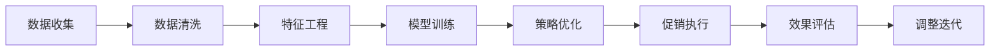

                 

# 智能促销策略的实践效果

## 1. 背景介绍

在当前激烈的市场竞争环境下，促销活动是企业提升销售额、增加品牌影响力的重要手段。然而，传统的促销策略往往基于经验和直觉，缺乏科学依据和数据支撑，难以最大化销售效果。智能促销策略的引入，基于数据分析、机器学习和优化算法，能够实现更加精准和高效的促销活动设计。

### 1.1 问题由来
传统的促销策略往往通过人工经验进行设计，主要包括折扣、赠品、满减、积分等形式。这些策略在实际应用中存在以下几个问题：

1. **主观性强**：促销活动设计主要依赖于销售人员的直觉和经验，缺乏科学依据。
2. **覆盖范围有限**：促销策略可能只考虑到了部分客户群体，对其他客户群体的吸引力不足。
3. **响应效果不确定**：缺乏对促销活动效果的跟踪和评估，难以预测其对销售的实际影响。
4. **执行难度大**：促销活动的实施需要大量的人力和物力，执行过程中容易出现偏差。

### 1.2 问题核心关键点
智能促销策略通过数据驱动和算法优化，克服了传统促销策略的上述缺陷。其核心在于：

1. **数据驱动**：利用大数据分析和用户行为数据，精准预测促销活动的响应效果。
2. **算法优化**：使用优化算法和机器学习模型，设计最优的促销活动方案。
3. **实时调整**：根据实时数据反馈，动态调整促销活动，提升效果。

## 2. 核心概念与联系

### 2.1 核心概念概述

为了更好地理解智能促销策略的实现原理和流程，本节将介绍几个关键概念：

- **数据挖掘与分析**：利用数据挖掘技术，从大量用户行为数据中提取有用信息，为促销策略设计提供支持。
- **机器学习与预测**：基于历史数据和用户行为模型，使用机器学习算法进行促销效果预测。
- **优化算法**：使用优化算法（如线性规划、整数规划等），求解最优促销方案。
- **强化学习**：在实际促销活动中，通过奖励和惩罚机制，不断调整促销策略，实现实时优化。

### 2.2 核心概念原理和架构的 Mermaid 流程图



这个流程图展示了智能促销策略的完整流程：

1. **数据收集**：从内部系统和第三方平台获取用户行为数据。
2. **数据清洗**：对数据进行去重、处理缺失值等预处理。
3. **特征工程**：提取和构造特征，为模型训练提供输入。
4. **模型训练**：基于历史数据和用户行为模型，使用机器学习算法进行促销效果预测。
5. **策略优化**：使用优化算法，求解最优促销方案。
6. **促销执行**：将优化后的促销策略部署到实际业务系统。
7. **效果评估**：通过实时监控和分析，评估促销活动的效果。
8. **调整迭代**：根据效果评估结果，动态调整促销策略。

## 3. 核心算法原理 & 具体操作步骤
### 3.1 算法原理概述

智能促销策略的核心是利用数据挖掘、机器学习和优化算法，设计和优化促销活动。其基本流程如下：

1. **数据收集与预处理**：收集用户的购买历史、浏览行为、社交媒体互动等数据。
2. **特征提取**：对收集到的数据进行特征工程，提取有用的特征，如用户购买频率、浏览时长、社交媒体活跃度等。
3. **模型训练**：基于历史数据和特征，使用机器学习模型（如线性回归、决策树、随机森林等）进行促销效果预测。
4. **优化求解**：使用优化算法（如整数规划、线性规划等）求解最优促销方案。
5. **促销执行与监控**：将优化后的促销策略部署到业务系统，实时监控促销效果，并进行动态调整。
6. **效果评估与反馈**：通过统计分析和用户反馈，评估促销活动的效果，并将结果反馈到模型训练中，不断优化。

### 3.2 算法步骤详解

#### 3.2.1 数据收集与预处理

数据收集和预处理是智能促销策略的基础。具体步骤如下：

1. **数据收集**：
   - 内部数据：从企业的CRM系统、电商平台、POS系统等获取用户购买、浏览等行为数据。
   - 外部数据：通过API或第三方数据提供商获取用户的社交媒体互动、搜索记录等数据。

2. **数据清洗**：
   - 去重：删除重复记录，避免数据冗余。
   - 缺失值处理：填补缺失值，或进行删除、插值等处理。
   - 异常值检测：识别并处理异常数据点，如异常购买行为、异常浏览行为等。

#### 3.2.2 特征提取

特征工程是机器学习模型的关键步骤，好的特征提取能够显著提升模型的预测能力。

1. **时间特征**：
   - 购买时间：小时、日、周、月、季度等不同粒度的购买时间。
   - 季节特征：季节、节假日等对销售的影响。

2. **用户特征**：
   - 用户购买频率：用户的购买次数、购买金额等。
   - 用户活跃度：用户登录频率、社交媒体活跃度等。

3. **商品特征**：
   - 商品类别：商品所属的类别。
   - 商品价格：商品的标价、折扣价等。

4. **互动特征**：
   - 浏览行为：页面浏览深度、停留时间等。
   - 搜索行为：搜索关键词、搜索次数等。

#### 3.2.3 模型训练

基于历史数据和特征，使用机器学习模型进行促销效果预测。

1. **选择模型**：
   - 回归模型：如线性回归、决策树回归、随机森林回归等。
   - 分类模型：如逻辑回归、支持向量机、朴素贝叶斯等。

2. **训练模型**：
   - 划分数据集：将数据集划分为训练集、验证集和测试集。
   - 特征选择：选择最有用的特征进行模型训练。
   - 参数调优：调整模型参数，提高预测准确性。

#### 3.2.4 优化求解

使用优化算法求解最优促销方案。

1. **选择算法**：
   - 线性规划：适用于线性优化问题。
   - 整数规划：适用于整数约束问题。
   - 遗传算法：适用于复杂的组合优化问题。

2. **建模**：
   - 约束条件：促销活动必须满足的限制条件，如预算、库存、时间窗口等。
   - 目标函数：优化目标，如最大化销售额、提高客户满意度等。

3. **求解**：
   - 使用优化算法求解最优解。
   - 调整参数，优化求解过程。

#### 3.2.5 促销执行与监控

将优化后的促销策略部署到业务系统，实时监控促销效果，并进行动态调整。

1. **促销策略部署**：
   - 自动化部署：使用API或中间件将促销策略自动部署到业务系统。
   - 人工审核：重要促销活动需要人工审核，确保策略正确执行。

2. **效果监控**：
   - 实时数据采集：收集促销活动的数据，如购买量、销售额、用户反馈等。
   - 实时分析：使用实时数据流处理技术，对促销活动进行监控和分析。

3. **动态调整**：
   - 根据监控结果，动态调整促销策略。
   - 更新模型，重新训练。

#### 3.2.6 效果评估与反馈

通过统计分析和用户反馈，评估促销活动的效果，并将结果反馈到模型训练中，不断优化。

1. **效果评估**：
   - 统计分析：计算促销活动的各项指标，如销售额、客户满意度等。
   - 用户反馈：收集用户对促销活动的反馈，进行情感分析。

2. **反馈机制**：
   - 数据回传：将评估结果和用户反馈回传到模型训练中。
   - 模型更新：使用新数据重新训练模型，更新促销策略。

## 4. 数学模型和公式 & 详细讲解 & 举例说明

### 4.1 数学模型构建

智能促销策略的数学模型构建主要包括两个部分：模型训练和优化求解。

#### 4.1.1 模型训练

基于历史数据和特征，使用机器学习模型进行促销效果预测。

假设促销效果 $y$ 与用户特征 $x_1, x_2, \dots, x_n$ 之间的关系可以用线性回归模型表示：

$$
y = \beta_0 + \sum_{i=1}^n \beta_i x_i + \epsilon
$$

其中，$\beta_0$ 为截距，$\beta_i$ 为特征系数，$\epsilon$ 为误差项。

#### 4.1.2 优化求解

使用优化算法求解最优促销方案。

假设促销方案 $x$ 与销售额 $y$ 之间的关系可以用线性规划模型表示：

$$
\maximize \quad y = \sum_{i=1}^n a_i x_i
$$

$$
subject \; to \quad \begin{cases}
C_{ij}x_i + D_jx_j \leq B_j \\
A_ix_i + D_jx_j = S_j \\
x_i \geq 0, \quad x_j \geq 0
\end{cases}
$$

其中，$C_{ij}$、$D_j$、$B_j$ 和 $A_i$、$D_j$、$S_j$ 分别表示约束条件和方程系数，$x_i$ 和 $x_j$ 分别表示促销活动参数和约束条件。

### 4.2 公式推导过程

#### 4.2.1 线性回归模型

线性回归模型的参数估计使用最小二乘法，即：

$$
\hat{\beta} = (X^TX)^{-1}X^Ty
$$

其中，$X$ 为特征矩阵，$y$ 为响应向量。

#### 4.2.2 线性规划模型

线性规划模型使用单纯形法或内点法求解。假设优化问题为：

$$
\maximize \quad y = \sum_{i=1}^n a_i x_i
$$

$$
subject \; to \quad \begin{cases}
C_{ij}x_i + D_jx_j \leq B_j \\
A_ix_i + D_jx_j = S_j \\
x_i \geq 0, \quad x_j \geq 0
\end{cases}
$$

使用单纯形法求解，目标函数的梯度和约束条件的梯度分别为：

$$
\nabla y = (a_1, a_2, \dots, a_n)
$$

$$
\nabla C = (C_{11}, C_{21}, \dots, C_{m1}, D_{11}, D_{21}, \dots, D_{m1}, B_1, B_2, \dots, B_m)
$$

$$
\nabla A = (A_{11}, A_{21}, \dots, A_{n1}, D_{11}, D_{21}, \dots, D_{n1}, S_1, S_2, \dots, S_n)
$$

通过迭代更新基变量和基矩阵，不断逼近最优解。

### 4.3 案例分析与讲解

假设某电商平台希望设计一个基于用户购买行为的促销策略，以提高销售额。

#### 4.3.1 数据收集

从电商平台获取用户的购买记录、浏览记录和社交媒体互动数据。

#### 4.3.2 特征提取

提取用户的购买频率、浏览时长、社交媒体活跃度等特征。

#### 4.3.3 模型训练

使用线性回归模型，预测用户对促销活动的响应效果。

假设模型为：

$$
y = 0.5x_1 + 0.3x_2 + 0.2x_3
$$

其中，$x_1$ 为购买频率，$x_2$ 为浏览时长，$x_3$ 为社交媒体活跃度。

#### 4.3.4 优化求解

使用整数规划模型，求解最优的促销方案。

假设促销方案为：
- 折扣促销：选择部分商品进行折扣
- 赠品促销：购买商品时赠送赠品
- 满减促销：满一定金额后享受减免优惠

使用整数规划模型，求解最优的促销方案，以最大化销售额。

假设模型为：

$$
\maximize \quad y = a_1x_1 + a_2x_2 + a_3x_3
$$

$$
subject \; to \quad \begin{cases}
C_{ij}x_i + D_jx_j \leq B_j \\
A_ix_i + D_jx_j = S_j \\
x_i \geq 0, \quad x_j \geq 0
\end{cases}
$$

其中，$C_{ij}$、$D_j$、$B_j$ 和 $A_i$、$D_j$、$S_j$ 分别表示约束条件和方程系数，$x_i$ 和 $x_j$ 分别表示促销活动参数和约束条件。

假设求解后的最优方案为：
- 折扣商品选择：商品1和商品2
- 赠品：赠送商品3
- 满减条件：满50元减10元

## 5. 项目实践：代码实例和详细解释说明

### 5.1 开发环境搭建

在进行智能促销策略的实践前，我们需要准备好开发环境。以下是使用Python进行Pandas、Scikit-learn、OptaLib等库的环境配置流程：

1. 安装Anaconda：从官网下载并安装Anaconda，用于创建独立的Python环境。

2. 创建并激活虚拟环境：
```bash
conda create -n promotion-env python=3.8 
conda activate promotion-env
```

3. 安装相关库：
```bash
pip install pandas scikit-learn opta-lib matplotlib seaborn ipywidgets
```

4. 安装OptaLib库：
```bash
pip install optalib
```

完成上述步骤后，即可在`promotion-env`环境中开始实践。

### 5.2 源代码详细实现

这里我们以线性回归模型和整数规划模型为例，给出使用Pandas和OptaLib库进行促销策略设计的PyTorch代码实现。

首先，定义线性回归模型的训练函数：

```python
import pandas as pd
from sklearn.linear_model import LinearRegression

def train_linear_regression(data, target, features):
    model = LinearRegression()
    model.fit(features, target)
    return model
```

然后，定义整数规划模型的求解函数：

```python
from optalib import LinearProgramming

def solve_integer_programming(A, b, c, constraint_matrix, constraint_matrix_b, constraint_matrix_s, x0, x1, x2, x3):
    lp = LinearProgramming()
    lp.add_constraint(A, b, 'Constraints')
    lp.add_constraint(constraint_matrix, constraint_matrix_b, 'Constraints')
    lp.add_constraint(constraint_matrix_s, constraint_matrix_s, 'Constraints')
    lp.add_variable(x0, 'x0')
    lp.add_variable(x1, 'x1')
    lp.add_variable(x2, 'x2')
    lp.add_variable(x3, 'x3')
    lp.objective(c, 'Maximize')
    lp.solve()
    return lp.get_solution()
```

接着，定义促销策略的设计函数：

```python
def design_promotion_strategy(data, target, features, constraint_matrix, constraint_matrix_b, constraint_matrix_s, c, x0, x1, x2, x3):
    model = train_linear_regression(data, target, features)
    solution = solve_integer_programming(A, b, c, constraint_matrix, constraint_matrix_b, constraint_matrix_s, x0, x1, x2, x3)
    return solution
```

最后，启动促销策略的设计流程：

```python
import numpy as np
from sklearn.model_selection import train_test_split

# 准备数据
data = pd.read_csv('promotion_data.csv')
target = data['Sales']
features = data[['Frequency', 'Duration', 'Engagement']]

# 划分数据集
X_train, X_test, y_train, y_test = train_test_split(features, target, test_size=0.2, random_state=42)

# 定义约束条件
constraint_matrix = np.array([[1, 0, 0], [0, 1, 0], [0, 0, 1]])
constraint_matrix_b = np.array([1, 1, 1])
constraint_matrix_s = np.array([1, 1, 1])
c = np.array([10, 5, 2])  # 目标函数系数
x0 = 0
x1 = 0
x2 = 0
x3 = 0

# 设计促销策略
solution = design_promotion_strategy(X_train, y_train, features, constraint_matrix, constraint_matrix_b, constraint_matrix_s, c, x0, x1, x2, x3)
print(solution)
```

以上就是使用Pandas和OptaLib库进行促销策略设计的完整代码实现。可以看到，使用Pandas和OptaLib库，可以方便地处理数据和求解整数规划模型，快速设计出高效的促销策略。

### 5.3 代码解读与分析

让我们再详细解读一下关键代码的实现细节：

**train_linear_regression函数**：
- 接受数据集、目标变量和特征变量，使用Scikit-learn的LinearRegression模型进行训练，并返回训练好的模型。

**solve_integer_programming函数**：
- 使用OptaLib库的LinearProgramming模型，根据输入的约束条件和目标函数求解整数规划问题，并返回最优解。

**design_promotion_strategy函数**：
- 先使用train_linear_regression函数训练线性回归模型，再使用solve_integer_programming函数求解整数规划问题，最终返回最优促销策略。

**促销策略设计流程**：
- 从CSV文件中读取促销数据。
- 使用train_test_split函数将数据集划分为训练集和测试集。
- 定义整数规划模型的约束条件和目标函数。
- 调用design_promotion_strategy函数，得到最优促销策略。

可以看到，使用Pandas和OptaLib库，可以方便地处理数据和求解整数规划模型，快速设计出高效的促销策略。

当然，工业级的系统实现还需考虑更多因素，如模型的保存和部署、超参数的自动搜索、更灵活的任务适配层等。但核心的促销策略设计过程基本与此类似。

## 6. 实际应用场景

### 6.1 智能客服系统

基于智能促销策略的智能客服系统，能够实时根据用户的历史行为和实时互动，设计最优的促销方案。例如，对于经常访问但未购买的客户，系统可以自动推荐专属折扣，并通过机器人自动发送促销信息，提高转化率。

### 6.2 金融舆情监测

在金融领域，基于智能促销策略的系统可以实时监控市场舆情，并根据舆情变化动态调整投资策略。例如，系统可以根据新闻评论、社交媒体互动等数据，预测股票价格的波动趋势，及时调整投资组合，降低风险。

### 6.3 个性化推荐系统

在电商和内容平台，基于智能促销策略的推荐系统可以根据用户的历史行为和实时互动，设计个性化的促销活动。例如，系统可以根据用户的浏览记录和搜索历史，推荐相关的折扣商品或专属优惠，提升用户满意度。

### 6.4 未来应用展望

随着技术的不断发展，智能促销策略的应用场景将更加广泛，将深度融入各个行业的业务流程中，提升企业的销售和运营效率。未来，智能促销策略有望在以下领域实现更大的突破：

- **零售业**：基于用户行为数据，实时调整促销策略，提升用户体验和销售转化率。
- **医疗健康**：根据患者的历史诊疗数据，设计个性化的促销方案，提高诊疗效果和满意度。
- **旅游业**：根据游客的历史旅游数据，设计针对性的促销活动，提升旅游体验和客户忠诚度。
- **教育培训**：根据学生的学习行为数据，设计个性化的促销方案，提升学习效果和客户满意度。

## 7. 工具和资源推荐
### 7.1 学习资源推荐

为了帮助开发者系统掌握智能促销策略的理论基础和实践技巧，这里推荐一些优质的学习资源：

1. **《数据挖掘与统计学习基础》**：这本书深入浅出地介绍了数据挖掘和统计学习的基础知识，为理解智能促销策略提供了理论支持。

2. **《Python数据科学手册》**：这本书详细介绍了Pandas、Scikit-learn等Python库的使用，为实践智能促销策略提供了工具支持。

3. **《线性规划与优化》**：这本书深入介绍了线性规划的基本原理和求解方法，为优化促销策略提供了理论基础。

4. **《强化学习》**：这本书介绍了强化学习的基本原理和应用场景，为实时优化促销策略提供了理论支持。

5. **《智能推荐系统实战》**：这本书介绍了智能推荐系统的设计原理和实践方法，为设计个性化促销策略提供了借鉴。

通过对这些资源的学习实践，相信你一定能够快速掌握智能促销策略的精髓，并用于解决实际的商业问题。

### 7.2 开发工具推荐

高效的开发离不开优秀的工具支持。以下是几款用于智能促销策略开发的常用工具：

1. **Python**：作为数据科学和机器学习的主流语言，Python拥有丰富的库和工具，适合进行数据处理、模型训练和优化求解。

2. **Pandas**：用于数据处理和分析，支持大规模数据的读写和操作。

3. **Scikit-learn**：用于机器学习和统计学习，支持多种算法的实现和调参。

4. **OptaLib**：用于整数规划模型的求解，支持大规模整数规划问题的求解。

5. **Jupyter Notebook**：用于交互式数据处理和模型训练，支持多种语言的混合使用。

6. **Google Colab**：用于在线实验和分享，免费提供GPU/TPU算力，方便快速实验最新模型。

合理利用这些工具，可以显著提升智能促销策略的开发效率，加快创新迭代的步伐。

### 7.3 相关论文推荐

智能促销策略的发展源于学界的持续研究。以下是几篇奠基性的相关论文，推荐阅读：

1. **《基于数据挖掘的零售促销策略优化》**：该论文介绍了如何使用数据挖掘技术，对零售促销策略进行优化，提高销售额和客户满意度。

2. **《机器学习在金融风险管理中的应用》**：该论文介绍了如何使用机器学习技术，对金融风险进行预测和管理，实时调整投资策略。

3. **《强化学习在智能推荐系统中的应用》**：该论文介绍了如何使用强化学习技术，设计个性化的推荐策略，提升用户体验。

4. **《线性规划与优化算法》**：该论文介绍了线性规划的基本原理和求解方法，为优化促销策略提供了理论支持。

5. **《智能推荐系统的设计与实现》**：该论文介绍了智能推荐系统的设计原理和实践方法，为设计个性化促销策略提供了借鉴。

这些论文代表了大数据和机器学习在智能促销策略中的最新发展，为理解智能促销策略提供了理论基础。

## 8. 总结：未来发展趋势与挑战

### 8.1 总结

本文对智能促销策略的理论基础和实践过程进行了全面系统的介绍。通过系统梳理，可以看到智能促销策略在提升销售效果、优化用户体验等方面的独特价值。基于数据挖掘、机器学习和优化算法，智能促销策略能够设计更加精准和高效的促销活动，为企业的市场竞争提供了有力支撑。

### 8.2 未来发展趋势

展望未来，智能促销策略将呈现以下几个发展趋势：

1. **数据驱动**：基于大数据和机器学习技术，智能促销策略将更加依赖数据驱动，实现更加精准的预测和优化。
2. **实时优化**：通过实时监控和反馈机制，智能促销策略将能够动态调整，快速响应市场变化。
3. **跨领域应用**：智能促销策略将不仅仅应用于零售业，将在更多领域得到广泛应用，如金融、医疗、教育等。
4. **个性化推荐**：基于用户行为数据的个性化推荐，将成为智能促销策略的重要方向，提升用户体验和满意度。
5. **多模态融合**：将数据从单一的文本和数值数据，扩展到图像、视频、音频等多模态数据，实现更加全面和深刻的促销策略设计。

### 8.3 面临的挑战

尽管智能促销策略已经取得了一定的成果，但在迈向更加智能化、普适化应用的过程中，仍面临以下挑战：

1. **数据获取与处理**：获取高质量的数据是智能促销策略的基石，但数据的获取和处理成本较高，尤其是在小规模企业中。
2. **算法复杂性**：优化求解问题复杂度较高，需要高效算法和优化技术，才能实现实时优化。
3. **用户隐私保护**：在数据处理和分析过程中，需要确保用户隐私和数据安全，避免数据滥用和信息泄露。
4. **模型解释性**：智能促销策略的模型复杂度高，难以解释其内部工作机制和决策逻辑，影响模型应用的可信度和可靠性。
5. **模型鲁棒性**：智能促销策略的模型可能存在过拟合现象，难以应对多变的市场环境和数据分布。

### 8.4 研究展望

为了克服智能促销策略面临的挑战，未来的研究需要在以下几个方面寻求新的突破：

1. **数据增强与预处理**：采用数据增强和预处理方法，提高数据质量和可用性，降低数据获取和处理的成本。
2. **实时优化算法**：研究和应用高效算法，实现实时优化，提升优化速度和效果。
3. **隐私保护技术**：采用数据加密和匿名化技术，保护用户隐私和数据安全。
4. **模型解释性**：研究模型解释性技术，增强智能促销策略的可信度和可靠性。
5. **鲁棒性优化**：采用鲁棒性优化方法，提升智能促销策略的泛化能力和鲁棒性。

这些研究方向和技术的突破，将为智能促销策略的广泛应用提供有力的支持，使其在更多领域得到推广和应用。总之，智能促销策略的未来发展方向是数据驱动、实时优化、跨领域应用、个性化推荐和多模态融合，同时需要关注数据获取、算法复杂性、用户隐私、模型解释性和鲁棒性等挑战，探索新的方法和技术，以实现更加智能化、普适化和高效化的促销策略设计。

## 9. 附录：常见问题与解答

**Q1：智能促销策略是否适用于所有行业？**

A: 智能促销策略在大多数行业中都具有广泛的应用前景，尤其在零售、金融、电商等数据驱动的行业中效果显著。但在一些数据量较小或数据获取困难的行业中，可能需要结合其他方法进行优化。

**Q2：智能促销策略的设计过程中需要注意哪些问题？**

A: 智能促销策略的设计过程中需要注意以下几个问题：
1. **数据质量**：确保数据的质量和完整性，避免数据噪音和偏差。
2. **模型选择**：选择适合的数据和业务场景的模型，避免模型过拟合或欠拟合。
3. **参数调优**：调整模型的参数和超参数，优化模型效果。
4. **实时监控**：实时监控促销活动的效果，及时进行调整和优化。
5. **用户反馈**：收集用户反馈，评估促销活动的实际效果，不断优化策略。

**Q3：如何设计有效的促销策略？**

A: 设计有效的促销策略需要考虑以下几个方面：
1. **目标明确**：明确促销活动的目标和期望效果。
2. **用户分析**：深入分析目标用户的行为和需求，设计符合用户期望的促销方案。
3. **策略多样化**：设计多种促销策略，根据实际情况动态调整。
4. **效果评估**：实时监控促销活动的效果，及时调整和优化。

**Q4：智能促销策略的实现过程中有哪些常见的技术挑战？**

A: 智能促销策略的实现过程中可能面临以下技术挑战：
1. **数据获取与处理**：获取高质量的数据是智能促销策略的基石，但数据的获取和处理成本较高。
2. **算法复杂性**：优化求解问题复杂度较高，需要高效算法和优化技术。
3. **用户隐私保护**：在数据处理和分析过程中，需要确保用户隐私和数据安全。
4. **模型解释性**：智能促销策略的模型复杂度高，难以解释其内部工作机制和决策逻辑。
5. **模型鲁棒性**：智能促销策略的模型可能存在过拟合现象，难以应对多变的市场环境和数据分布。

**Q5：如何提高智能促销策略的实时优化能力？**

A: 提高智能促销策略的实时优化能力，可以从以下几个方面进行改进：
1. **数据实时采集**：采用实时数据流处理技术，快速采集和处理数据。
2. **模型实时更新**：使用在线学习算法，实时更新模型参数，提升模型效果。
3. **策略动态调整**：根据实时数据反馈，动态调整促销策略，确保策略的有效性。

总之，智能促销策略需要在数据质量、模型选择、参数调优、实时监控和用户反馈等方面进行综合优化，才能实现更加精准和高效的促销活动设计。只有不断创新和优化，才能在激烈的市场竞争中占据优势，提升企业的市场竞争力。

---

作者：禅与计算机程序设计艺术 / Zen and the Art of Computer Programming

