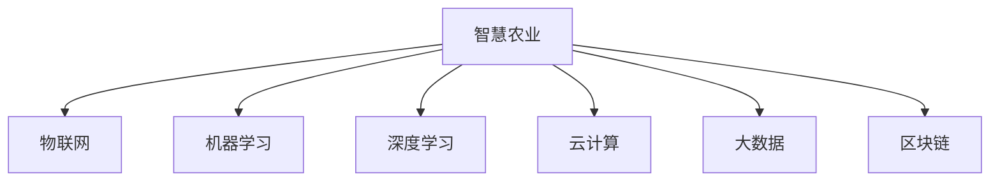

                 

## 1. 背景介绍

### 1.1 问题由来
随着互联网和大数据技术的快速发展，传统行业正经历着前所未有的变革。农业，作为人类社会的基础产业，同样面临着数字化转型的重大机遇。然而，与信息技术领域的创新日新月异相比，农业领域的数字化进程相对缓慢。技术手段的落后直接导致了农业生产效率低下、资源浪费严重、产品品质参差不齐等问题。

为了解决这一问题，科技界和企业界正探索以新技术赋能传统农业，希望通过数据驱动的方式提升农业生产管理水平，实现农业的智能化和高效化。然而，现有的农业科技解决方案，如智慧农业平台、物联网设备等，仍存在设备成本高、数据孤岛、用户体验不佳等问题，难以大规模推广。

在这一背景下，智能农业创业应运而生。通过融合现代科技和农业知识，构建智能化的农业系统，不仅能够提升农业生产的效率和品质，还能降低生产成本，提升农民收益。智能农业创业正逐渐成为全球农业科技创新的重要方向。

### 1.2 问题核心关键点
智能农业创业的核心关键点在于如何通过科技手段提高农业生产管理的智能化水平。这包括但不限于以下几个方面：
- **数据采集与处理**：构建高效的物联网设备，收集实时数据，进行数据清洗与预处理。
- **数据分析与建模**：应用机器学习、深度学习等技术，从海量数据中提取有价值的信息，构建精准的农业生产模型。
- **智能决策与控制**：结合农业知识库，利用智能算法自动决策，指导农事作业，如精准施肥、灌溉、病虫害防治等。
- **用户体验与协作**：提供直观易用的智能农业平台，让用户能够便捷地获取信息、控制设备、分析结果。
- **业务闭环与增值服务**：构建包括农业生产、供应链、市场推广等环节的完整业务链条，提供综合性的农业服务。

## 2. 核心概念与联系

### 2.1 核心概念概述

为更好地理解智能农业创业的关键技术，本节将介绍几个紧密相关的核心概念：

- **智慧农业**：通过现代信息技术对农业生产进行精准化、可视化和自动化管理，提高农业生产效率和品质。
- **物联网**：通过传感器、控制器、通信网络等技术手段，实现物理世界的数字化与互联互通。
- **机器学习**：一种通过数据训练模型，自动学习规律和优化决策的技术。
- **深度学习**：机器学习的一种，通过多层神经网络模拟人脑处理复杂数据的能力，可用于图像识别、自然语言处理等领域。
- **云计算**：通过互联网提供高效、可扩展的计算资源和服务，支持大规模数据处理和分布式计算。
- **大数据**：海量规模的数据集合，通过数据挖掘、分析等手段提取有价值的信息。
- **区块链**：一种去中心化的分布式账本技术，用于确保数据透明、安全、可追溯。

这些核心概念之间的逻辑关系可以通过以下Mermaid流程图来展示：



这个流程图展示了智慧农业与各大技术的紧密联系：通过物联网采集数据，应用机器学习和深度学习进行数据分析和建模，利用云计算进行数据处理和模型训练，结合大数据进行信息挖掘，并通过区块链保障数据透明和可追溯性。

## 3. 核心算法原理 & 具体操作步骤
### 3.1 算法原理概述

智能农业创业的核心算法原理包括以下几个关键环节：

1. **数据采集与预处理**：利用物联网技术采集田间地头的实时数据，包括土壤湿度、温度、光照、作物生长状态等。通过传感器和通信网络，将这些数据传输到中央服务器进行处理。

2. **数据分析与建模**：采用机器学习和深度学习算法，从大量历史数据中提取规律，构建农业生产模型。例如，通过时间序列分析预测作物生长周期，通过图像识别识别病虫害状态，通过自然语言处理分析作物生长报告等。

3. **智能决策与控制**：结合农业知识库和专家系统，通过智能算法自动决策和控制农事作业。例如，根据土壤湿度和作物生长状态自动灌溉，根据病虫害预测结果自动施药，根据天气预报自动调整种植计划等。

4. **用户体验与协作**：设计直观易用的智能农业平台，提供便捷的用户交互界面，让用户能够实时监控田间状态，进行作业管理和数据分析。同时，平台还支持多用户协作，便于农场主、技术员、供应商等各类参与者共享信息，共同管理农业生产。

5. **业务闭环与增值服务**：构建完整的农业产业链，从种子选配、种植管理、产品收获到市场推广，提供一站式解决方案。同时，平台还支持农业产品的追溯，通过区块链技术确保产品信息的透明和可追溯，提升消费者信任度。

### 3.2 算法步骤详解

智能农业创业的具体操作步骤如下：

**Step 1: 设备部署与数据采集**

1. 选型与部署：根据农作物种类和生长环境，选择合适的物联网设备和传感器。例如，土壤湿度传感器、温湿度传感器、光照强度传感器等。
2. 部署与调试：在田间地头进行设备的安装与调试，确保数据采集的准确性和实时性。
3. 数据传输：通过无线网络（Wi-Fi、LoRa、NB-IoT等）将采集到的数据传输到中央服务器或云端平台。

**Step 2: 数据预处理与清洗**

1. 数据采集：收集来自物联网设备的海量数据，包括实时和历史数据。
2. 数据清洗：对数据进行去重、过滤、填充等预处理，去除噪声和异常值。
3. 数据存储：将清洗后的数据存储在数据库中，便于后续分析和建模。

**Step 3: 数据分析与建模**

1. 特征工程：根据业务需求和领域知识，提取数据中的关键特征。例如，提取土壤湿度、温度、光照等特征。
2. 模型训练：应用机器学习和深度学习算法，训练预测模型。例如，利用时间序列分析预测作物生长周期，利用卷积神经网络（CNN）进行病虫害识别。
3. 模型评估：通过交叉验证等方法评估模型的性能，调整模型参数以优化预测结果。

**Step 4: 智能决策与控制**

1. 决策引擎：构建农业知识库和专家系统，定义决策规则和逻辑。例如，根据土壤湿度和作物生长状态自动灌溉。
2. 自动化控制：利用物联网设备执行决策结果，例如通过水泵自动控制灌溉，通过喷洒装置自动施药。
3. 闭环反馈：收集执行结果和反馈数据，优化决策算法，提高决策准确性。

**Step 5: 用户体验与协作**

1. 平台设计：设计直观易用的智能农业平台，提供便捷的用户交互界面，支持移动端和PC端访问。
2. 数据可视化：将采集到的数据和预测结果进行可视化展示，例如，通过地图展示田间设备状态和作物生长情况。
3. 协作管理：提供多用户协作功能，支持农场主、技术员、供应商等各类参与者共享信息，共同管理农业生产。

**Step 6: 业务闭环与增值服务**

1. 产业链构建：从种子选配、种植管理、产品收获到市场推广，提供一站式解决方案，支持农产品的追溯和供应链管理。
2. 增值服务：提供技术咨询、设备租赁、金融服务等增值服务，提升农场主的综合收益。
3. 系统集成：将智能农业平台与其他农业系统进行集成，例如农机设备、气象预报系统等，实现数据共享和业务协同。

### 3.3 算法优缺点

智能农业创业的算法具有以下优点：

1. **高效准确**：通过数据驱动的智能决策，大大提升农业生产的效率和精准度。
2. **自动化控制**：利用物联网设备实现自动化控制，减少人工干预，提高作业效率。
3. **跨界融合**：结合农业知识库和人工智能技术，提升农业生产的智能化水平。
4. **用户体验优化**：提供直观易用的智能农业平台，提升用户互动体验和满意度。
5. **业务闭环**：构建完整的产业链和增值服务体系，提升农场主的综合收益。

同时，该算法也存在一些局限性：

1. **设备成本高**：物联网设备和传感器的成本较高，难以大规模推广。
2. **数据依赖性强**：智能决策依赖于高质量的数据，数据的采集、清洗和预处理工作量大。
3. **技术门槛高**：需要具备较高的技术水平和专业知识，开发和运维成本较高。
4. **安全性问题**：物联网设备的互联互通可能带来安全漏洞，需要加强网络安全防护。
5. **隐私保护**：农业数据的隐私保护需要特别注意，避免数据泄露和滥用。

尽管存在这些局限性，但智能农业创业的算法仍然具有显著的优势和广泛的应用前景。未来，随着技术的进步和成本的降低，这些问题有望得到进一步解决。

### 3.4 算法应用领域

智能农业创业的算法广泛应用于以下几个领域：

1. **智能灌溉与施肥**：通过物联网设备采集土壤湿度、温度等数据，自动决策和控制灌溉和施肥。
2. **病虫害防治**：利用图像识别技术识别病虫害状态，自动施药并进行预警。
3. **作物生长监测**：通过摄像头、传感器等设备，实时监测作物生长状态和环境参数。
4. **农机自动化**：通过物联网设备和传感器，实现农机的自动化作业和调度。
5. **农场管理**：构建智能农业平台，支持农场管理、作业调度、数据分析等综合管理功能。
6. **农产品追溯**：利用区块链技术，确保农产品信息的透明和可追溯，提升消费者信任度。

## 4. 数学模型和公式 & 详细讲解  
### 4.1 数学模型构建

假设农业生产系统由 $N$ 个传感器组成，采集到的实时数据为 $x_1, x_2, \ldots, x_N$。通过机器学习算法，训练一个预测模型 $f(x)$，用于预测作物生长状态或产量。模型的输出为 $y = f(x)$，其中 $y$ 表示作物生长状态或产量。

## 5. 项目实践：代码实例和详细解释说明
### 5.1 开发环境搭建

在进行智能农业创业的实践前，我们需要准备好开发环境。以下是使用Python进行智能农业开发的环境配置流程：

1. 安装Anaconda：从官网下载并安装Anaconda，用于创建独立的Python环境。

2. 创建并激活虚拟环境：
```bash
conda create -n smart-agriculture python=3.8 
conda activate smart-agriculture
```

3. 安装必要的依赖包：
```bash
pip install numpy pandas sklearn tensorflow keras openai pytorch
```

4. 安装物联网设备驱动和通讯库：
```bash
pip install pyserial pymongo
```

完成上述步骤后，即可在`smart-agriculture`环境中开始智能农业创业的开发实践。

### 5.2 源代码详细实现

下面我们以智能灌溉系统为例，给出使用Python和TensorFlow进行智能农业开发的代码实现。

首先，定义灌溉系统的传感器数据：

```python
import numpy as np

# 定义土壤湿度、温度、光照等传感器的模拟数据
humidity = np.random.normal(20, 3, 100)
temperature = np.random.normal(25, 2, 100)
light_intensity = np.random.normal(500, 50, 100)

# 将数据合并为一个特征向量
features = np.hstack((humidity.reshape(-1, 1), temperature.reshape(-1, 1), light_intensity.reshape(-1, 1)))

# 定义目标变量，表示是否需要灌溉
labels = np.where(features[:, 0] > 18, 1, 0)
```

然后，定义模型并进行训练：

```python
import tensorflow as tf

# 定义模型架构
model = tf.keras.Sequential([
    tf.keras.layers.Dense(32, activation='relu', input_shape=(features.shape[1],)),
    tf.keras.layers.Dense(1, activation='sigmoid')
])

# 编译模型
model.compile(optimizer='adam', loss='binary_crossentropy', metrics=['accuracy'])

# 训练模型
model.fit(features, labels, epochs=10, batch_size=32, validation_split=0.2)
```

接着，定义数据预处理与模型预测函数：

```python
from sklearn.preprocessing import StandardScaler

# 数据标准化
scaler = StandardScaler()
features_scaled = scaler.fit_transform(features)

# 预测模型
def predict_irrigation(features):
    features_scaled = scaler.transform(features)
    prediction = model.predict(features_scaled)
    return prediction > 0.5

# 实时数据预测
real_time_data = np.array([[19.5, 26, 450]]).T
prediction = predict_irrigation(real_time_data)
print(prediction)
```

最后，启动智能灌溉系统的自动化控制：

```python
# 定义灌溉控制函数
def control_irrigation(prediction):
    if prediction:
        print("需要灌溉")
        # 调用农业灌溉系统API，启动灌溉设备
    else:
        print("不需要灌溉")
        # 调用农业灌溉系统API，停止灌溉设备

# 实时数据预测并控制
real_time_data = np.array([[19.5, 26, 450]]).T
prediction = predict_irrigation(real_time_data)
control_irrigation(prediction)
```

以上就是使用Python和TensorFlow进行智能农业开发的完整代码实现。可以看到，通过简单的代码实现，我们构建了一个基于机器学习的智能灌溉系统，能够根据实时传感器数据自动决策是否灌溉。

### 5.3 代码解读与分析

让我们再详细解读一下关键代码的实现细节：

**传感器数据定义**：
- 使用NumPy生成模拟的土壤湿度、温度、光照等传感器数据，用于训练模型。
- 将数据合并为一个特征向量，方便模型处理。

**模型训练**：
- 使用TensorFlow定义一个简单的神经网络模型，包含一个隐藏层和一个输出层。
- 使用`compile`方法编译模型，选择Adam优化器，设置损失函数和评估指标。
- 使用`fit`方法训练模型，指定训练轮数和批大小，并设置验证集比例。

**数据预处理**：
- 使用`StandardScaler`对特征数据进行标准化处理，确保数据分布一致。
- 定义模型预测函数，先对新数据进行标准化，再通过模型预测。

**实时数据预测与控制**：
- 定义实时数据预测函数，将实时传感器数据传入模型，得到预测结果。
- 定义灌溉控制函数，根据预测结果调用灌溉系统API，启动或停止灌溉设备。
- 通过实时数据预测并控制，实现智能灌溉系统的自动化决策和控制。

可以看到，智能农业创业的开发实现较为简单，主要依赖于机器学习算法的训练和应用。但具体的实现过程还需要结合实际农业环境和设备进行优化和调整。

## 6. 实际应用场景
### 6.1 智慧农场

智慧农场是智能农业创业的重要应用场景。通过物联网设备采集田间地头的实时数据，利用智能决策系统自动控制灌溉、施肥、病虫害防治等农事作业，实现农业生产的智能化和自动化。

在智慧农场中，智能灌溉系统、智能施肥系统、智能病虫害防治系统等子系统可以相互协作，提升农业生产的整体效率和质量。例如，通过智能灌溉系统根据土壤湿度自动控制灌溉，通过智能施肥系统根据作物需求自动调整施肥量，通过智能病虫害防治系统实时监测和预警病虫害，并进行及时施药。

### 6.2 农业物联网

农业物联网是将农业生产与物联网技术深度融合的结果。通过各类物联网设备采集农业生产数据，利用云计算和数据分析技术，提供精准农业决策支持。

农业物联网可以应用于智能农业创业的各个环节，例如智能灌溉系统、智能施肥系统、智能病虫害防治系统、智能农机系统等。通过物联网设备采集数据，并上传到云端平台进行分析和处理，结合农业知识库和智能算法，提供精准的农业生产决策支持。

### 6.3 农产品质量追溯

农产品质量追溯是智能农业创业的重要增值服务之一。通过区块链技术，确保农产品的生产、加工、运输、销售等各个环节的信息透明和可追溯，提升消费者对农产品的信任度。

在农产品质量追溯系统中，智能农业创业的各个环节都可以参与信息记录和验证。例如，智能灌溉系统可以记录灌溉时间和方式，智能施肥系统可以记录施肥量和成分，智能农机系统可以记录农机作业的轨迹和参数，最终通过区块链技术将这些信息整合并存储在区块链上，形成完整的农产品追溯信息。

### 6.4 未来应用展望

随着物联网技术和智能算法的不断发展，智能农业创业将迎来更多的应用场景和机遇：

1. **智慧农业平台**：构建集成的智能农业平台，提供全面的农业生产管理和数据分析服务，提升农业生产的整体效率和质量。
2. **农业机器人**：利用机器人技术进行农作物的种植、收获、搬运等作业，提高农业生产的机械化和自动化水平。
3. **农业物联网平台**：构建农业物联网平台，提供设备连接、数据采集、分析处理等综合服务，推动农业生产的智能化和高效化。
4. **农业人工智能**：利用人工智能技术进行农业生产预测、决策优化、智能控制等，提升农业生产的科学性和精准度。
5. **农业供应链管理**：利用区块链和物联网技术，实现农业供应链的透明和可追溯，提升供应链的效率和可靠性。

未来，智能农业创业将结合现代科技和农业知识，构建更加智能、高效、可持续的农业生产系统，为农业生产提供更加精准和科学的决策支持。

## 7. 工具和资源推荐
### 7.1 学习资源推荐

为了帮助开发者系统掌握智能农业创业的理论基础和实践技巧，这里推荐一些优质的学习资源：

1. **《智慧农业》课程**：由农业领域专家开设的在线课程，涵盖智能农业的各个方面，包括传感器技术、数据分析、智能决策等。
2. **《农业物联网技术》书籍**：全面介绍农业物联网技术的原理、应用和实现方法，适合科技爱好者和农业从业者阅读。
3. **《Python在农业中的应用》书籍**：介绍Python在农业中的各种应用场景，包括数据分析、智能决策、自动化控制等。
4. **智能农业创业平台**：提供智能农业创业的开发工具、技术支持和创业指导，帮助开发者快速实现智能农业应用。
5. **开源农业数据集**：提供大规模农业生产数据，支持开发者进行数据预处理和模型训练，助力智能农业创业。

通过对这些资源的学习实践，相信你一定能够快速掌握智能农业创业的精髓，并用于解决实际的农业问题。

### 7.2 开发工具推荐

高效的开发离不开优秀的工具支持。以下是几款用于智能农业创业开发的常用工具：

1. **Anaconda**：用于创建和管理Python环境，支持大规模数据处理和深度学习模型训练。
2. **TensorFlow**：开源深度学习框架，支持分布式计算和模型部署，适合大规模数据处理和智能决策。
3. **IoT平台**：提供物联网设备的连接和管理功能，支持实时数据采集和传输。
4. **农业知识库**：提供农业领域的专业知识库和决策支持系统，支持智能决策和优化。
5. **区块链平台**：提供区块链技术的服务和开发工具，支持农业数据的透明和可追溯。

合理利用这些工具，可以显著提升智能农业创业的开发效率，加快创新迭代的步伐。

### 7.3 相关论文推荐

智能农业创业的研究源于学界的持续探索。以下是几篇奠基性的相关论文，推荐阅读：

1. **《智慧农业系统架构设计》**：介绍智慧农业系统的整体架构和关键技术，为智能农业创业提供了理论基础。
2. **《农业物联网技术现状与展望》**：分析农业物联网技术的现状和未来发展方向，为智能农业创业提供了技术指导。
3. **《农业大数据与智能决策》**：探讨农业大数据在智能农业创业中的应用，为智能农业创业提供了数据支撑。
4. **《智能农业创业模式研究》**：分析智能农业创业的商业模式和实践经验，为智能农业创业提供了业务指导。

这些论文代表了大数据、人工智能在农业中的应用方向。通过学习这些前沿成果，可以帮助研究者把握学科前进方向，激发更多的创新灵感。

## 8. 总结：未来发展趋势与挑战
### 8.1 总结

本文对智能农业创业的理论基础和实践方法进行了全面系统的介绍。首先阐述了智能农业创业的背景和核心关键点，明确了智能农业创业在农业生产管理智能化、高效化方面的重要价值。其次，从原理到实践，详细讲解了智能农业创业的数学模型和操作步骤，提供了智能灌溉系统的代码实现和详细解释。同时，本文还探讨了智能农业创业在智慧农场、农业物联网、农产品质量追溯等多个领域的应用前景，展示了智能农业创业的广阔前景。最后，本文精选了智能农业创业的学习资源、开发工具和相关论文，力求为读者提供全方位的技术指引。

通过本文的系统梳理，可以看到，智能农业创业结合了现代科技和农业知识，通过数据驱动的智能决策和自动化控制，显著提升了农业生产的效率和质量。未来，随着技术的不断进步和应用场景的不断拓展，智能农业创业必将为农业生产提供更加精准和科学的决策支持，推动农业生产的智能化和高效化。

### 8.2 未来发展趋势

展望未来，智能农业创业将呈现以下几个发展趋势：

1. **智能农业平台普及化**：随着智能农业技术的成熟和应用成本的降低，智能农业平台将逐渐普及，成为农业生产的重要基础设施。
2. **农业物联网标准化**：农业物联网设备的标准化和接口统一，将提升设备之间的互联互通和数据共享能力。
3. **农业人工智能普适化**：智能算法和人工智能技术的普及，将使更多农场主能够享受智能决策带来的便利和高效。
4. **农业大数据深入化**：通过深度学习和大数据分析，实现农业生产过程的深入理解和优化。
5. **农业知识库开放化**：构建开放式的农业知识库，供开发者和研究者使用，推动智能农业创业的进一步发展。
6. **农业供应链智能化**：利用区块链和物联网技术，实现农业供应链的透明和可追溯，提升供应链的效率和可靠性。

以上趋势凸显了智能农业创业的广阔前景。这些方向的探索发展，必将进一步提升智能农业创业的智能化水平，为农业生产提供更加精准和科学的决策支持。

### 8.3 面临的挑战

尽管智能农业创业已经取得了一定的进展，但在迈向更加智能化、普适化应用的过程中，仍面临诸多挑战：

1. **技术成熟度**：当前智能农业创业技术仍处于起步阶段，许多关键技术尚未成熟，需要进一步研究探索。
2. **设备成本高**：农业物联网设备的成本较高，难以大规模推广，需要进一步降低设备成本。
3. **数据孤岛问题**：不同设备和系统的数据标准不统一，导致数据孤岛现象严重，需要解决数据共享问题。
4. **用户体验优化**：智能农业创业平台的用户体验仍有提升空间，需要进一步优化界面设计和交互流程。
5. **技术安全**：智能农业创业平台需要高度关注网络安全问题，避免数据泄露和系统攻击。
6. **政策法规**：智能农业创业需要遵守相关政策法规，确保数据安全和隐私保护。

这些挑战需要多方共同努力，通过技术创新、政策引导和市场推动，逐步解决智能农业创业的难题。

### 8.4 研究展望

面对智能农业创业面临的挑战，未来的研究需要在以下几个方面寻求新的突破：

1. **技术标准化**：推动农业物联网设备和技术标准的统一，提升设备之间的互联互通和数据共享能力。
2. **设备智能化**：研发成本更低、性能更优的智能农业设备，提升设备普及度和使用体验。
3. **数据分析深度化**：结合人工智能和大数据分析技术，实现农业生产过程的深入理解和优化。
4. **用户体验优化**：通过优化界面设计和交互流程，提升智能农业创业平台的用户体验和满意度。
5. **技术安全保障**：加强智能农业创业平台的网络安全防护，确保数据安全和隐私保护。
6. **政策法规完善**：推动农业数据管理和智能农业创业的政策法规建设，保障智能农业创业的可持续发展。

这些研究方向的探索，必将引领智能农业创业迈向更高的台阶，为农业生产提供更加精准和科学的决策支持。

## 9. 附录：常见问题与解答
**Q1：智能农业创业的难点在哪里？**

A: 智能农业创业的难点主要集中在以下几个方面：

1. **技术复杂度高**：智能农业创业涉及多种新技术，如物联网、机器学习、深度学习等，需要较高的技术水平和专业知识。
2. **设备成本高**：农业物联网设备的成本较高，难以大规模推广，需要进一步降低设备成本。
3. **数据孤岛问题**：不同设备和系统的数据标准不统一，导致数据孤岛现象严重，需要解决数据共享问题。
4. **用户体验优化**：智能农业创业平台的用户体验仍有提升空间，需要进一步优化界面设计和交互流程。
5. **技术安全**：智能农业创业平台需要高度关注网络安全问题，避免数据泄露和系统攻击。
6. **政策法规**：智能农业创业需要遵守相关政策法规，确保数据安全和隐私保护。

这些问题需要通过技术创新、政策引导和市场推动，逐步解决智能农业创业的难题。

**Q2：智能农业创业如何获取高质量的农业数据？**

A: 获取高质量的农业数据是智能农业创业的关键。以下是几种获取高质量农业数据的方法：

1. **传感器设备**：安装各类传感器设备，实时采集土壤湿度、温度、光照等数据，获取高精度的农业生产数据。
2. **农业知识库**：利用农业知识库和专家系统，提取有价值的信息，补充农业数据。
3. **众包平台**：通过农业众包平台，收集农民的生产经验和记录，获取真实、全面的农业数据。
4. **公开数据集**：利用农业领域公开数据集，如农业气象数据、农作物生长数据等，进行数据预处理和分析。
5. **农业物联网平台**：利用农业物联网平台，收集各类农业生产数据，实现数据共享和整合。

通过多种渠道获取高质量的农业数据，可以提升智能农业创业的模型训练和决策质量。

**Q3：智能农业创业如何提高模型的准确性和泛化能力？**

A: 提高模型的准确性和泛化能力是智能农业创业的重要目标。以下是几种方法：

1. **数据增强**：通过数据增强技术，扩充训练数据集，提高模型的泛化能力。例如，利用数据扩充技术生成更多样本，利用数据合成技术生成虚拟样本。
2. **模型优化**：通过优化模型架构和参数，提高模型的准确性。例如，使用深度学习算法提高模型的拟合能力，使用正则化技术防止过拟合。
3. **模型融合**：通过模型融合技术，将多个模型的预测结果进行加权组合，提升模型的综合性能。例如，使用集成学习技术将多个模型的预测结果进行融合。
4. **知识图谱**：利用知识图谱技术，将农业知识进行结构化表示，提升模型的理解和推理能力。例如，使用知识图谱表示农业领域的专业知识，通过图神经网络进行知识融合。
5. **实时更新**：通过实时更新模型参数，保持模型与农业生产的最新状态同步。例如，利用在线学习技术，实时更新模型参数，提升模型的适应能力。

这些方法可以结合智能农业创业的具体需求进行优化，提升模型的准确性和泛化能力。

**Q4：智能农业创业如何实现低成本、高效益的商业模式？**

A: 实现低成本、高效益的商业模式是智能农业创业的重要目标。以下是几种方法：

1. **云平台服务**：构建智能农业云平台，提供设备连接、数据存储、模型训练等服务，降低设备成本和运维成本。
2. **数据服务**：通过数据分析和挖掘，提供精准农业决策支持，获取服务收入。例如，提供智能灌溉、智能施肥、智能病虫害防治等服务。
3. **设备租赁**：通过设备租赁模式，降低农民的设备投资成本，提升设备利用率。例如，提供农机租赁服务，让农民按需租赁农机设备。
4. **供应链管理**：通过供应链管理平台，优化农业供应链，降低物流成本，提升供应链效率。例如，提供农产品配送、供应链追溯等服务。
5. **增值服务**：通过提供技术咨询、设备维护、金融服务等增值服务，提升农民的综合收益。例如，提供农机维护、农资采购、农业保险等服务。

这些方法可以结合智能农业创业的具体需求进行优化，实现低成本、高效益的商业模式。

**Q5：智能农业创业如何保障数据安全和隐私保护？**

A: 保障数据安全和隐私保护是智能农业创业的重要目标。以下是几种方法：

1. **数据加密**：对数据进行加密处理，防止数据泄露和未授权访问。例如，使用AES加密算法对数据进行加密处理。
2. **访问控制**：通过访问控制技术，限制数据访问权限，防止非法访问和数据滥用。例如，使用RBAC（基于角色的访问控制）技术限制数据访问权限。
3. **数据匿名化**：对数据进行匿名化处理，防止数据泄露和隐私侵害。例如，使用数据脱敏技术对数据进行匿名化处理。
4. **安全审计**：通过安全审计技术，监控数据访问和操作行为，及时发现和处理安全漏洞。例如，使用日志审计技术监控数据访问和操作行为。
5. **区块链技术**：利用区块链技术，实现数据透明和可追溯，防止数据篡改和滥用。例如，使用区块链技术记录数据访问和操作行为，确保数据透明和可追溯。

这些方法可以结合智能农业创业的具体需求进行优化，保障数据安全和隐私保护。

---

作者：禅与计算机程序设计艺术 / Zen and the Art of Computer Programming

