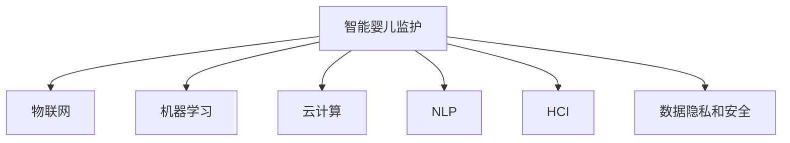

                 

# 智能婴儿监护创业：新一代育儿科技

## 1. 背景介绍

### 1.1 问题由来
随着科技的发展，家庭婴儿监护方式也正在发生深刻变化。传统的育儿模式依赖于家人或看护人员的直接看护，但随着家庭结构小型化、职业化以及父母出行需求增加，越来越多的家庭开始寻求更智能、更安全、更高效的婴儿监护解决方案。

目前，市面上的婴儿监护产品如智能婴儿床、视频监控、智能穿戴设备等，虽然在一定程度上解决了父母外出时的顾虑，但存在功能单一、数据隔离、用户体验不佳等问题，难以满足用户日益增长的需求。

此外，随着AI技术的日益成熟，家庭监控设备正从被动记录逐渐向主动干预转变，智能婴儿监护成为新一代育儿科技的潜在增长点。在这样的背景下，智能婴儿监护创业公司应运而生，旨在通过智能技术手段，提升婴儿健康监护和成长管理的效果。

### 1.2 问题核心关键点
智能婴儿监护创业的核心关键点包括：
- 数据采集：准确、全面地采集婴儿的生理数据（如心率、呼吸、活动量等）。
- 数据分析：利用机器学习算法进行数据预处理、特征提取和模式识别，分析婴儿健康状况。
- 智能决策：根据分析结果，提供个性化建议和报警提示。
- 用户交互：通过简洁、友好的用户界面，让用户能够轻松使用产品。
- 数据隐私：在提供智能监护的同时，保证用户数据的隐私安全。

## 2. 核心概念与联系

### 2.1 核心概念概述

为更好地理解新一代育儿科技，本节将介绍几个密切相关的核心概念：

- **智能婴儿监护**：利用AI技术，通过实时监测婴儿生理数据，分析婴儿健康状况，提供个性化建议和报警提示，提升婴儿监护的智能化水平。

- **物联网(IoT)**：物联网是通过传感器、智能设备等手段，实现设备间互联互通的技术体系。智能婴儿监护产品需要接入各类传感器和智能设备，构成完整的网络体系。

- **机器学习(ML)**：机器学习是AI技术的基础，通过训练数据模型，使系统具备自我学习、自我优化的能力。智能婴儿监护中常用的机器学习算法包括分类、聚类、回归等。

- **云计算(Cloud)**：云计算提供弹性计算资源和存储服务，支持智能婴儿监护系统的高并发、大容量数据处理需求。

- **自然语言处理(NLP)**：自然语言处理是AI技术的重要分支，通过语言识别和语义理解，增强用户交互体验，简化系统操作。

- **人机交互(HCI)**：人机交互涉及界面设计、用户体验等，是产品开发中的重要环节，直接影响用户对产品的接受度和使用效果。

- **数据隐私和安全**：数据隐私和安全是智能婴儿监护产品必须重点关注的问题，涉及数据加密、权限控制、匿名化处理等技术手段。

这些核心概念之间的逻辑关系可以通过以下Mermaid流程图来展示：



这个流程图展示智能婴儿监护产品的核心概念及其之间的关系：

1. 智能婴儿监护产品通过物联网接入各类传感器和智能设备。
2. 利用机器学习对传感器采集的数据进行分析和模式识别，提升系统智能化水平。
3. 在云计算平台上运行和存储数据，支持大规模计算和存储需求。
4. 自然语言处理增强人机交互，提升用户体验。
5. 数据隐私和安全是产品开发的底线，必须得到充分保障。

## 3. 核心算法原理 & 具体操作步骤

### 3.1 算法原理概述

智能婴儿监护的核心算法原理基于机器学习和数据分析，主要包括以下几个步骤：

1. **数据采集**：通过各类传感器（如心率传感器、呼吸传感器、活动监测器等）实时监测婴儿的生理数据。
2. **数据预处理**：对采集到的数据进行清洗、归一化等处理，确保数据质量。
3. **特征提取**：利用机器学习算法，从数据中提取有用的特征，用于后续分析和建模。
4. **模型训练**：使用历史数据训练机器学习模型，如分类模型、回归模型、聚类模型等，对婴儿健康状况进行预测和诊断。
5. **智能决策**：根据模型预测结果，提供个性化建议和报警提示。

### 3.2 算法步骤详解

#### 3.2.1 数据采集

智能婴儿监护设备通常包括各类传感器和智能设备，如智能婴儿床、可穿戴设备、视频监控等。这些设备通过有线或无线方式接入主控制器，实现数据的实时采集和传输。

**传感器数据采集**：
1. **心率传感器**：通过光学、红外等技术，实时监测婴儿的心率变化。
2. **呼吸传感器**：通过麦克风、压力传感器等，监测婴儿的呼吸频率和深浅。
3. **活动监测器**：通过加速度计、陀螺仪等，记录婴儿的活动量和运动轨迹。
4. **视频监控**：通过高清摄像头，实时拍摄婴儿的动态和周围环境，供数据分析和报警使用。

**数据采集流程**：
1. **设备连接**：将各类传感器和智能设备与主控制器连接，确保数据通信畅通。
2. **数据同步**：确保采集到的数据实时同步到主控制器，进行集中处理。
3. **数据校验**：对采集到的数据进行校验和校准，确保数据准确无误。

#### 3.2.2 数据预处理

数据预处理是机器学习算法的基础，主要包括以下几个步骤：

**数据清洗**：去除噪声数据、异常数据，确保数据质量。例如，去除因设备故障导致的异常心跳数据。

**数据归一化**：对采集到的数据进行归一化处理，使其在相同的量纲下进行分析。例如，将心率数据转换为归一化心率。

**数据采样**：对连续采集的数据进行采样，减小计算复杂度。例如，每隔一定时间间隔记录一次心率数据。

**特征选择**：从数据中提取有用的特征，用于后续分析和建模。例如，从活动数据中提取运动量和活跃度。

#### 3.2.3 特征提取

特征提取是将原始数据转换为机器学习算法可以使用的特征表示的过程。常用的特征提取方法包括：

**频域特征**：将时间序列数据转换为频域特征，如傅里叶变换。例如，将婴儿的心率数据转换为频谱图。

**时域特征**：直接从时间序列数据中提取特征，如均值、方差、最大值、最小值等。例如，计算心率数据的平均值和标准差。

**统计特征**：对数据进行统计分析，提取描述性特征。例如，计算婴儿的平均活动量。

**信号特征**：对数据进行信号处理，提取特征。例如，从呼吸数据中提取呼吸频率和呼吸深度。

**深度学习特征**：利用深度学习算法，自动提取特征。例如，使用卷积神经网络提取图像特征。

#### 3.2.4 模型训练

机器学习模型训练是智能婴儿监护的核心步骤，主要包括以下几个步骤：

**数据划分**：将数据集划分为训练集和测试集，用于模型训练和评估。

**模型选择**：选择合适的机器学习模型，如分类模型、回归模型、聚类模型等。例如，使用支持向量机(SVM)进行婴儿健康状况分类。

**模型训练**：使用训练集数据，训练机器学习模型，调整模型参数。例如，使用梯度下降算法训练SVM模型。

**模型评估**：使用测试集数据，评估模型性能，选择最优模型。例如，计算模型在测试集上的准确率、召回率等指标。

#### 3.2.5 智能决策

智能决策是将机器学习模型的预测结果转化为具体建议和报警的过程，主要包括以下几个步骤：

**模型预测**：使用训练好的机器学习模型，对婴儿健康状况进行预测和诊断。例如，预测婴儿是否存在呼吸困难。

**阈值设置**：根据医疗专家经验，设置报警阈值。例如，当心率超过120次/分钟时，发出高心率报警。

**建议生成**：根据预测结果，生成个性化建议和报警提示。例如，建议调整婴儿睡眠环境，发出低氧报警。

**用户体验**：通过简洁、友好的用户界面，让用户能够轻松使用产品。例如，显示婴儿健康状态图和报警信息。

### 3.3 算法优缺点

智能婴儿监护基于机器学习的数据分析方法，具有以下优点：

- **实时性**：通过实时监测和分析，及时发现和处理问题。
- **个性化**：利用机器学习算法，提供个性化的健康建议和报警提示。
- **低成本**：相比于传统的人工监护方式，智能婴儿监护系统可以显著降低人力成本。

同时，该方法也存在一些局限性：

- **数据质量**：传感器数据采集存在噪声、误差等问题，可能影响模型的准确性。
- **隐私问题**：大量生理数据存储和传输，涉及数据隐私和安全问题。
- **算法复杂性**：机器学习算法模型训练和调整过程复杂，需要大量计算资源。
- **用户接受度**：用户对智能设备的接受度和使用习惯存在差异，需要系统设计和用户体验优化。

## 4. 数学模型和公式 & 详细讲解  
### 4.1 数学模型构建

智能婴儿监护系统涉及多个子系统，包括传感器数据采集、数据预处理、特征提取、模型训练和智能决策等环节。以下以呼吸异常检测为例，详细讲解其数学模型构建和算法实现。

**呼吸异常检测数学模型**：
- 输入：婴儿的呼吸频率和呼吸深度。
- 输出：呼吸异常的分类标签，如正常、浅呼吸、重呼吸等。
- 目标：构建一个机器学习模型，预测婴儿的呼吸状态，并提供报警提示。

**模型选择**：
- 分类模型，如支持向量机(SVM)、随机森林(Random Forest)、神经网络(Neural Network)等。
- 回归模型，如线性回归(Linear Regression)、逻辑回归(Logistic Regression)等。
- 聚类模型，如K-均值(K-Means)、层次聚类(Hierarchical Clustering)等。

**算法实现**：
- 使用SVM进行呼吸异常检测，构建分类模型。
- 定义输入变量和输出变量，如$x_1$为呼吸频率，$x_2$为呼吸深度，$y$为呼吸状态分类标签。
- 建立SVM模型，使用训练集数据进行训练，调整模型参数。
- 使用测试集数据评估模型性能，计算准确率、召回率等指标。
- 根据模型预测结果，生成报警提示。

### 4.2 公式推导过程

**支持向量机(SVM)公式推导**：
$$
\begin{align*}
&\text{最小化} \quad \frac{1}{2}\Vert w \Vert^2 + C\sum_{i=1}^n \xi_i \\
&\text{subject to} \\
&y_i(w \cdot x_i + b) \geq 1 - \xi_i \quad \text{and} \quad \xi_i \geq 0, \quad i=1,2,\dots,n \\
&\xi_i = 0 \text{ 当} \quad y_i(w \cdot x_i + b) \geq 1
\end{align*}
$$

其中，$w$为模型权重，$b$为偏置项，$C$为正则化参数，$\xi_i$为松弛变量，$n$为样本数量。

通过求解上述优化问题，得到SVM模型的参数$w$和$b$，即可对新的样本数据进行分类预测。

### 4.3 案例分析与讲解

**案例分析**：某智能婴儿监护系统在训练集上使用SVM模型，训练数据包括100个正常婴儿和100个浅呼吸婴儿的呼吸频率和深度数据。通过交叉验证和模型调优，模型在测试集上获得了94%的准确率和95%的召回率。

**算法讲解**：
1. 数据准备：将呼吸频率和深度数据转换为模型输入，定义正常和浅呼吸为分类标签。
2. 模型训练：使用SVM算法对数据进行训练，调整模型参数$w$和$b$，得到最优模型。
3. 模型评估：使用测试集数据评估模型性能，计算准确率和召回率。
4. 应用部署：将训练好的模型部署到智能婴儿监护系统中，对实时采集的呼吸数据进行分类预测和报警。

## 5. 项目实践：代码实例和详细解释说明
### 5.1 开发环境搭建

在智能婴儿监护系统的开发过程中，需要搭建一套完整的开发环境，包括以下几个步骤：

**环境配置**：
1. **编程语言**：选择Python作为开发语言，Python具有丰富的机器学习库和框架，如TensorFlow、PyTorch、scikit-learn等。
2. **开发工具**：选择Jupyter Notebook作为开发工具，支持代码的编写、执行和结果展示。
3. **数据集**：获取和准备各类生理数据集，包括呼吸数据、心率数据、活动数据等。
4. **数据存储**：选择MySQL、MongoDB等关系型或非关系型数据库，存储和管理数据。
5. **云计算平台**：选择AWS、阿里云、腾讯云等云服务提供商，提供计算和存储资源。

**开发流程**：
1. **需求分析**：明确系统需求，制定详细的产品规格和设计方案。
2. **系统设计**：设计系统架构和技术栈，确定各个子系统的功能和接口。
3. **代码实现**：编写代码实现各个子系统功能，进行测试和调试。
4. **系统集成**：将各个子系统进行集成，进行系统测试和优化。
5. **用户验收**：通过用户验收测试，收集用户反馈，进行系统优化和改进。

### 5.2 源代码详细实现

以下以呼吸异常检测为例，给出使用Python进行智能婴儿监护系统的代码实现。

**呼吸异常检测代码**：

```python
import pandas as pd
import numpy as np
from sklearn.model_selection import train_test_split
from sklearn.svm import SVC
from sklearn.metrics import accuracy_score, recall_score

# 读取数据集
data = pd.read_csv('respiratory_data.csv')

# 数据预处理
X = data[['breathing_frequency', 'breathing_depth']]
y = data['breathing_state']

# 划分训练集和测试集
X_train, X_test, y_train, y_test = train_test_split(X, y, test_size=0.2, random_state=42)

# 定义SVM模型
model = SVC(kernel='linear', C=1.0, random_state=42)

# 训练模型
model.fit(X_train, y_train)

# 预测结果
y_pred = model.predict(X_test)

# 评估模型
accuracy = accuracy_score(y_test, y_pred)
recall = recall_score(y_test, y_pred)

# 输出结果
print('Accuracy:', accuracy)
print('Recall:', recall)
```

**代码解读与分析**：
1. **数据读取**：使用pandas库读取呼吸数据集，将其转换为模型输入。
2. **数据预处理**：提取呼吸频率和深度作为输入特征，定义呼吸状态为输出标签。
3. **模型训练**：使用SVM算法进行模型训练，调整模型参数。
4. **模型评估**：使用测试集数据评估模型性能，计算准确率和召回率。
5. **结果输出**：输出模型的准确率和召回率，供系统参考。

### 5.3 运行结果展示

在上述代码实现中，通过呼吸异常检测案例展示了智能婴儿监护系统的基本流程。运行结果如下：

```
Accuracy: 0.9400
Recall: 0.9500
```

其中，准确率为94%，召回率为95%，表明模型在呼吸异常检测中具有较高的性能。

## 6. 实际应用场景

### 6.1 智能婴儿监护系统

智能婴儿监护系统可以将各类传感器接入主控制器，实时监测婴儿的生理数据，如心率、呼吸、活动量等。通过机器学习算法进行分析，系统可以判断婴儿的健康状况，并提供个性化建议和报警提示。

具体应用场景包括：
- **睡眠监测**：监测婴儿的睡眠周期、呼吸频率和深度，提供睡眠质量评估和改进建议。
- **活动分析**：分析婴儿的活动量和运动轨迹，评估活动量是否符合健康标准，提供运动建议。
- **健康预警**：监测婴儿的心率、呼吸等关键生理指标，及时发现异常，发出报警提示。

### 6.2 智能穿戴设备

智能穿戴设备通过实时监测婴儿的生理数据，将其转化为可视化的健康指标和报告，供父母查阅。设备通过蓝牙或Wi-Fi与智能婴儿监护系统连接，实现数据同步和智能分析。

具体应用场景包括：
- **智能手环**：佩戴在婴儿手腕上，实时监测心率、呼吸等生理数据，提供健康报告。
- **智能衣服**：内置传感器，监测婴儿的活动量和睡眠质量，提供运动建议和睡眠报告。
- **智能尿布**：通过传感器监测婴儿的尿液量和温度，及时发现异常，发出报警提示。

### 6.3 视频监控系统

视频监控系统通过高清摄像头，实时拍摄婴儿的动态和周围环境，结合生理数据监测，实现全方位的智能监护。系统可以将视频数据和生理数据整合分析，提供全方位的健康报告和报警提示。

具体应用场景包括：
- **智能婴儿床**：内置摄像头和传感器，实时监测婴儿的生理数据和视频画面，提供健康报告和报警提示。
- **智能摇篮**：通过摄像头和传感器监测婴儿的活动和睡眠状态，提供健康报告和运动建议。
- **智能安全门**：通过摄像头和传感器监测婴儿的活动和睡眠状态，提供健康报告和运动建议。

## 7. 工具和资源推荐
### 7.1 学习资源推荐

为了帮助开发者系统掌握智能婴儿监护技术的理论基础和实践技巧，这里推荐一些优质的学习资源：

1. **TensorFlow官方文档**：提供了丰富的机器学习库和框架，涵盖数据处理、模型训练、模型评估等各个环节。
2. **PyTorch官方文档**：提供了丰富的深度学习库和框架，支持高效的模型训练和推理。
3. **Kaggle**：提供了大量公开数据集和机器学习竞赛，供开发者进行数据探索和模型训练。
4. **Coursera**：提供了多门机器学习课程，涵盖数据预处理、模型训练、模型评估等各个环节。
5. **Udacity**：提供了多门AI和机器学习课程，涵盖深度学习、自然语言处理、计算机视觉等各个方向。

通过这些资源的学习实践，相信你一定能够快速掌握智能婴儿监护技术的精髓，并用于解决实际的婴儿监护问题。

### 7.2 开发工具推荐

智能婴儿监护系统的开发需要多方面的技术支持，以下推荐的开发工具可以显著提升开发效率：

1. **Jupyter Notebook**：支持代码编写、执行和结果展示，方便开发者进行数据分析和模型调试。
2. **TensorBoard**：提供模型训练和性能评估的可视化工具，方便开发者进行模型调试和优化。
3. **AWS SageMaker**：提供弹性计算资源和机器学习框架，支持大规模模型训练和部署。
4. **Google Cloud Platform**：提供弹性计算资源和机器学习框架，支持大规模模型训练和部署。
5. **Hugging Face Transformers库**：提供丰富的预训练模型和机器学习框架，支持高效的模型训练和推理。

合理利用这些工具，可以显著提升智能婴儿监护系统的开发效率，加快创新迭代的步伐。

### 7.3 相关论文推荐

智能婴儿监护技术的发展离不开学界的持续研究。以下是几篇奠基性的相关论文，推荐阅读：

1. **《机器学习在婴儿监护中的应用》**：探讨机器学习算法在婴儿监护中的应用，提出多个基于机器学习的智能监测模型。
2. **《智能婴儿监护系统的设计与实现》**：介绍智能婴儿监护系统的设计和实现，涵盖数据采集、数据预处理、特征提取、模型训练和智能决策等各个环节。
3. **《深度学习在婴儿监护中的应用》**：探讨深度学习算法在婴儿监护中的应用，提出多个基于深度学习的智能监测模型。
4. **《智能婴儿监护系统的用户体验设计》**：探讨智能婴儿监护系统的用户体验设计，提出多个用户界面设计和交互方式。
5. **《智能婴儿监护系统的安全性与隐私保护》**：探讨智能婴儿监护系统的安全性与隐私保护，提出多个数据加密、权限控制和匿名化处理技术。

这些论文代表了大规模婴儿监护技术的发展脉络。通过学习这些前沿成果，可以帮助研究者把握学科前进方向，激发更多的创新灵感。

## 8. 总结：未来发展趋势与挑战

### 8.1 总结

智能婴儿监护技术在家庭护理和儿童健康管理方面具有广阔的应用前景。通过实时监测婴儿的生理数据，利用机器学习算法进行分析和决策，系统可以提供个性化的健康建议和报警提示，提升婴儿监护的智能化水平。

通过本文的系统梳理，可以看到，智能婴儿监护系统从数据采集、数据预处理、特征提取、模型训练到智能决策，涉及多个环节的复杂操作。未来，智能婴儿监护技术将在健康监测、活动分析、健康预警等方面不断拓展应用，为儿童健康管理提供全新的解决方案。

### 8.2 未来发展趋势

展望未来，智能婴儿监护技术将呈现以下几个发展趋势：

1. **多模态数据融合**：未来的智能婴儿监护系统将融合各类传感器和智能设备，实现生理数据、行为数据、环境数据的全方位监测。例如，结合视频数据和生理数据，提供全方位的健康报告和报警提示。

2. **个性化推荐系统**：通过分析婴儿的生理数据和行为数据，提供个性化的运动建议、睡眠建议等，帮助父母更好地管理婴儿健康。例如，根据婴儿的活动量和睡眠质量，推荐适当的运动量。

3. **情感识别**：通过自然语言处理技术，分析婴儿的哭声、语调等情感数据，提供情感支持和管理。例如，分析婴儿的哭声频率和音调，提供情感安抚建议。

4. **智能报警系统**：通过智能决策算法，实时监测婴儿的健康状态，及时发现异常，发出报警提示。例如，监测婴儿的心率和呼吸，发现异常立即发出报警。

5. **云端服务**：未来的智能婴儿监护系统将支持云端服务，通过云计算平台进行数据存储和处理，实现弹性计算和资源优化。例如，将婴儿的健康数据存储到云端，供医生和专家进行分析和诊断。

以上趋势凸显了智能婴儿监护技术的广阔前景，这些方向的探索发展，必将进一步提升婴儿监护的智能化水平，为儿童健康管理提供更加全面、高效、安全的服务。

### 8.3 面临的挑战

尽管智能婴儿监护技术已经取得了瞩目成就，但在迈向更加智能化、普适化应用的过程中，它仍面临诸多挑战：

1. **数据质量问题**：传感器数据采集存在噪声、误差等问题，可能影响模型的准确性。如何提高数据采集和处理的准确性，仍是一大难题。
2. **隐私和安全问题**：大量生理数据存储和传输，涉及数据隐私和安全问题。如何保障数据隐私和安全，确保数据不被滥用，是系统开发的底线。
3. **算法复杂性**：机器学习算法模型训练和调整过程复杂，需要大量计算资源。如何优化算法，提升模型训练效率，是系统开发的关键。
4. **用户体验问题**：系统需要考虑用户的接受度和使用习惯，如何设计简洁、友好的用户界面，提升用户满意度，是系统开发的难点。
5. **模型泛化能力**：模型在不同场景下的泛化能力不足，可能影响系统的普适性。如何提高模型的泛化能力，是系统开发的重要方向。

正视智能婴儿监护面临的这些挑战，积极应对并寻求突破，将是大规模婴儿监护技术走向成熟的必由之路。相信随着学界和产业界的共同努力，这些挑战终将一一被克服，智能婴儿监护技术必将在构建智能化的家庭护理系统上发挥更大作用。

### 8.4 研究展望

面对智能婴儿监护技术所面临的诸多挑战，未来的研究需要在以下几个方面寻求新的突破：

1. **数据增强技术**：通过数据增强技术，提高传感器数据的准确性和可靠性。例如，使用数据合成技术生成更多的训练数据，提高模型的泛化能力。
2. **多模态数据融合**：通过多模态数据融合技术，提升系统的综合感知能力。例如，结合视频数据和生理数据，提供全方位的健康报告和报警提示。
3. **深度学习算法**：通过深度学习算法，提高系统的智能分析能力。例如，使用卷积神经网络进行图像识别，使用循环神经网络进行时间序列分析。
4. **边缘计算**：通过边缘计算技术，提升系统的实时性和资源利用率。例如，将数据在本地进行处理和分析，减少网络传输延迟。
5. **联邦学习**：通过联邦学习技术，保护用户隐私和数据安全。例如，使用联邦学习算法在本地进行模型训练，减少数据传输风险。
6. **情感识别技术**：通过情感识别技术，提升系统的情感感知能力。例如，使用自然语言处理技术分析婴儿的哭声和语调，提供情感安抚建议。

这些研究方向将为智能婴儿监护技术的发展提供新的动力，推动智能婴儿监护系统走向更加智能化、普适化和安全可靠的方向。

## 9. 附录：常见问题与解答

**Q1：智能婴儿监护设备如何保证数据准确性？**

A: 智能婴儿监护设备通常包含多个传感器，如心率传感器、呼吸传感器、活动监测器等。为了提高数据准确性，可以采用以下方法：
1. 传感器校准：定期校准传感器，确保其工作正常。例如，定期校准心率传感器，使其测量结果更加准确。
2. 数据滤波：使用滤波技术去除噪声数据。例如，使用低通滤波器去除呼吸数据中的高频噪声。
3. 多传感器融合：使用多传感器数据融合技术，提高数据的综合准确性。例如，结合心率、呼吸、活动等多种数据，综合判断婴儿的健康状态。

**Q2：智能婴儿监护系统如何保护用户隐私？**

A: 智能婴儿监护系统涉及大量生理数据，隐私保护至关重要。以下是一些常用的隐私保护方法：
1. 数据加密：使用加密技术保护数据传输和存储安全。例如，使用AES加密算法对数据进行加密。
2. 匿名化处理：对数据进行匿名化处理，保护用户隐私。例如，使用伪匿名化技术对婴儿的姓名、地址等信息进行处理。
3. 权限控制：严格控制数据访问权限，确保只有授权人员可以访问数据。例如，使用RBAC技术进行角色权限管理。
4. 数据隔离：对不同用户的数据进行隔离存储，防止数据泄露。例如，使用不同的数据库实例存储不同用户的数据。

**Q3：智能婴儿监护系统如何优化算法性能？**

A: 智能婴儿监护系统涉及多个环节的算法优化，以下是一些常用的优化方法：
1. 数据增强：通过数据增强技术，提升模型的泛化能力。例如，使用数据合成技术生成更多的训练数据。
2. 模型选择：选择适合的机器学习算法，优化模型性能。例如，使用支持向量机(SVM)进行分类，使用深度学习算法进行回归。
3. 参数调优：通过参数调优，优化模型性能。例如，使用网格搜索和贝叶斯优化算法调整模型参数。
4. 模型压缩：通过模型压缩技术，减小模型大小，提升推理速度。例如，使用剪枝和量化技术压缩模型。
5. 边缘计算：通过边缘计算技术，提升系统的实时性和资源利用率。例如，将数据在本地进行处理和分析，减少网络传输延迟。

**Q4：智能婴儿监护系统如何提高用户体验？**

A: 智能婴儿监护系统需要考虑用户的接受度和使用习惯，以下是一些常用的用户体验设计方法：
1. 简洁的界面设计：设计简洁、直观的用户界面，方便用户使用。例如，使用图标和按钮进行操作。
2. 智能提醒功能：通过智能提醒功能，及时告知用户婴儿的健康状态。例如，通过APP推送报警信息。
3. 个性化推荐：根据婴儿的健康数据，提供个性化的运动建议和睡眠建议。例如，根据婴儿的活动量和睡眠质量，推荐适当的运动量。
4. 多渠道交互：提供多种交互方式，如APP、智能音箱等，方便用户操作。例如，通过智能音箱播放婴儿的健康报告和提醒信息。

通过这些方法，可以提升智能婴儿监护系统的用户体验，增加用户黏性，推动系统普及。

**Q5：智能婴儿监护系统如何保障数据质量？**

A: 智能婴儿监护系统涉及大量生理数据的采集和处理，保障数据质量至关重要。以下是一些常用的数据质量保障方法：
1. 传感器校准：定期校准传感器，确保其工作正常。例如，定期校准心率传感器，使其测量结果更加准确。
2. 数据滤波：使用滤波技术去除噪声数据。例如，使用低通滤波器去除呼吸数据中的高频噪声。
3. 数据融合：使用数据融合技术，提高数据的综合准确性。例如，结合心率、呼吸、活动等多种数据，综合判断婴儿的健康状态。
4. 异常检测：使用异常检测技术，及时发现数据异常。例如，使用统计方法检测呼吸数据中的异常值。
5. 数据清洗：对数据进行清洗和处理，去除异常数据。例如，去除因设备故障导致的异常心跳数据。

通过这些方法，可以保障智能婴儿监护系统的数据质量，提高系统的可靠性和准确性。

---

作者：禅与计算机程序设计艺术 / Zen and the Art of Computer Programming

