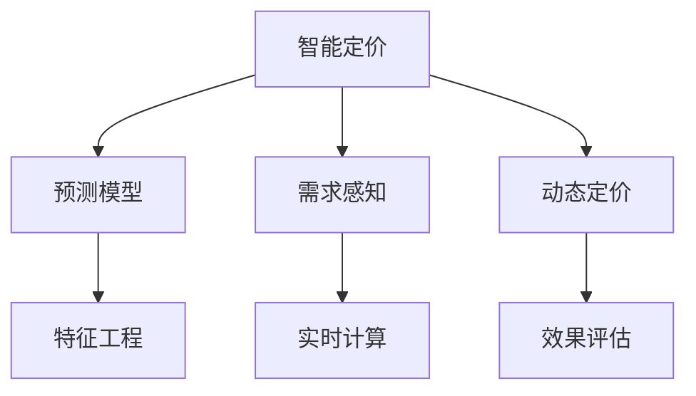
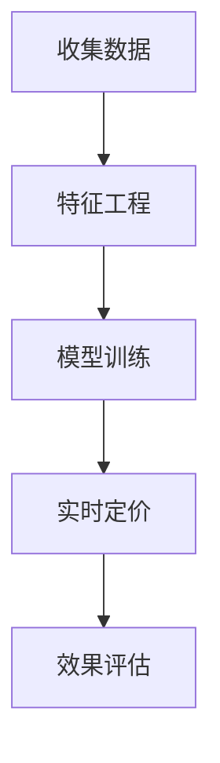

                 

# 智能定价技术在电商中的应用

> 关键词：智能定价, 电商, 机器学习, 预测模型, 需求感知, 动态定价

## 1. 背景介绍

### 1.1 问题由来

在电商行业中，价格策略是影响销售额和利润的关键因素。传统的定价方式主要是基于成本加成或竞对价格，缺乏对市场需求的动态感知和个性化定价。随着数据技术和计算能力的提升，电商企业开始采用智能定价技术，通过机器学习和数据分析，实现对用户需求的精准预测，从而制定更科学的定价策略。

智能定价技术通过收集和分析用户的购买历史、行为数据、市场趋势等，建立预测模型，实时调整商品价格。这种动态定价策略能够最大化销售额和利润，同时提升用户体验，提高品牌竞争力。

### 1.2 问题核心关键点

智能定价的核心在于如何通过数据挖掘和模型预测，实现对用户需求的精准把握，以及如何根据市场变化动态调整价格。

具体来说，关键点包括：
- 数据收集与清洗：获取高质量的用户行为数据，包括点击率、浏览时间、购买频率等。
- 特征工程：设计合适的特征，用于刻画用户和商品的特性。
- 模型构建与训练：选择合适的机器学习模型，并利用标注数据进行训练。
- 实时定价：将模型集成到电商系统，实时计算商品价格。
- 效果评估：定期评估定价效果，优化模型参数。

## 2. 核心概念与联系

### 2.1 核心概念概述

为了更好地理解智能定价技术，本节将介绍几个密切相关的核心概念：

- **智能定价(Smart Pricing)**：基于机器学习和数据分析，实现对用户需求的精准预测，并根据市场变化动态调整商品价格的技术。
- **预测模型(Prediction Model)**：用于预测用户行为、商品需求等的机器学习模型，如线性回归、随机森林、神经网络等。
- **需求感知(Demand Sensing)**：通过数据分析和机器学习，感知用户对商品的需求变化，从而调整价格。
- **动态定价(Dynamic Pricing)**：根据市场环境的变化，实时调整商品价格，最大化利润。
- **特征工程(Feature Engineering)**：通过数据预处理和特征提取，提升模型的预测能力。
- **实时计算(Real-time Computation)**：利用计算技术，实现对模型输出和定价策略的实时响应。
- **效果评估(Performance Evaluation)**：通过评估指标，如销售量、利润率等，评估定价效果，优化模型。

这些核心概念之间的逻辑关系可以通过以下Mermaid流程图来展示：



这个流程图展示了一体化智能定价的流程，从需求感知到动态定价，每个环节都依赖于预测模型和特征工程的支撑。

## 3. 核心算法原理 & 具体操作步骤

### 3.1 算法原理概述

智能定价技术通常基于机器学习模型，通过预测用户对商品的需求，来实时调整商品价格。其核心算法流程如下：

1. **数据收集与清洗**：收集用户的购买历史、行为数据、市场趋势等，并进行数据清洗和预处理。
2. **特征工程**：设计合适的特征，用于刻画用户和商品的特性。
3. **模型构建与训练**：选择合适的机器学习模型，并利用标注数据进行训练，生成预测模型。
4. **实时定价**：将预测模型集成到电商系统，实时计算商品价格。
5. **效果评估**：通过评估指标，如销售量、利润率等，评估定价效果，优化模型参数。

### 3.2 算法步骤详解

**Step 1: 数据收集与清洗**

- 收集用户行为数据，包括点击率、浏览时间、购买频率等。
- 清洗数据，去除缺失、异常值，确保数据质量。
- 数据预处理，如归一化、特征编码等。

**Step 2: 特征工程**

- 设计特征：如用户ID、商品ID、时间戳、价格、促销信息等。
- 特征选择：选择对预测有较大影响的特征。
- 特征转换：如将类别特征进行独热编码、将时间特征进行特征提取等。

**Step 3: 模型构建与训练**

- 选择合适的机器学习模型，如线性回归、随机森林、神经网络等。
- 使用标注数据进行模型训练，生成预测模型。
- 进行交叉验证，选择最优模型。

**Step 4: 实时定价**

- 将预测模型集成到电商系统，实时计算商品价格。
- 根据实时数据，如库存、促销活动等，调整定价策略。

**Step 5: 效果评估**

- 定义评估指标，如销售量、利润率等。
- 定期评估定价效果，如通过A/B测试、对比实验等。
- 根据评估结果，优化模型参数和定价策略。

### 3.3 算法优缺点

智能定价技术的优点包括：
1. **精准定价**：通过数据分析和机器学习，实现对用户需求的精准预测，制定更科学的定价策略。
2. **动态调整**：实时响应市场变化，动态调整商品价格，最大化利润。
3. **提升用户体验**：通过个性化定价，提升用户满意度和忠诚度。

同时，该技术也存在一些局限性：
1. **数据质量要求高**：需要高质量的用户行为数据，数据获取和清洗成本较高。
2. **模型复杂度高**：预测模型复杂度较高，训练和部署成本较大。
3. **实时计算要求高**：需要高效的实时计算能力，对硬件资源要求较高。
4. **模型解释性差**：预测模型通常是"黑盒"模型，难以解释其内部决策逻辑。

尽管存在这些局限性，但就目前而言，智能定价技术仍是电商定价的主流范式。未来相关研究的重点在于如何进一步降低数据获取和模型训练成本，提高模型的解释性和鲁棒性。

### 3.4 算法应用领域

智能定价技术已经在电商行业中得到广泛应用，覆盖了几乎所有常见场景，例如：

- 商品定价：通过分析用户行为和市场需求，实时调整商品价格。
- 促销活动：根据用户需求和市场趋势，优化促销活动的时间和价格。
- 库存管理：根据销售预测，合理调整库存水平，避免过剩或缺货。
- 定价策略优化：通过模型训练，探索最优的定价策略组合。
- 个性化推荐：根据用户偏好和历史购买行为，推荐最合适的价格。

除了上述这些经典应用外，智能定价技术还被创新性地应用到更多场景中，如动态定价、需求预测、市场分析等，为电商技术的发展提供了新的动力。

## 4. 数学模型和公式 & 详细讲解  
### 4.1 数学模型构建

智能定价的核心在于建立预测模型，通过分析用户行为和市场需求，预测商品需求量，从而制定定价策略。假设商品需求量 $y$ 与价格 $p$ 相关，可通过线性回归模型进行建模，如下所示：

$$
y = \beta_0 + \beta_1p + \epsilon
$$

其中 $\beta_0$ 为截距，$\beta_1$ 为价格系数，$\epsilon$ 为误差项。

### 4.2 公式推导过程

假设收集到的用户行为数据为 $(x_i, y_i)$，其中 $x_i$ 为输入特征，$y_i$ 为预测目标。则可以通过最小二乘法求解线性回归模型参数 $\beta_0$ 和 $\beta_1$：

$$
\beta = (X^TX)^{-1}X^Ty
$$

其中 $X$ 为特征矩阵，$Y$ 为目标矩阵。

### 4.3 案例分析与讲解

以某电商平台的日销量预测为例，假设收集到用户行为数据，如用户ID、商品ID、时间戳、价格等，进行特征工程后得到特征矩阵 $X$ 和目标矩阵 $Y$。通过最小二乘法求解线性回归模型参数，得到预测模型 $\hat{y}$，计算价格 $p$：

$$
p = \hat{y} / \beta_1
$$

将预测模型集成到电商系统，根据实时数据调整价格，实时定价的流程如下：



## 5. 项目实践：代码实例和详细解释说明
### 5.1 开发环境搭建

在进行智能定价项目实践前，我们需要准备好开发环境。以下是使用Python进行PyTorch开发的环境配置流程：

1. 安装Anaconda：从官网下载并安装Anaconda，用于创建独立的Python环境。

2. 创建并激活虚拟环境：
```bash
conda create -n pricing-env python=3.8 
conda activate pricing-env
```

3. 安装PyTorch：根据CUDA版本，从官网获取对应的安装命令。例如：
```bash
conda install pytorch torchvision torchaudio cudatoolkit=11.1 -c pytorch -c conda-forge
```

4. 安装TensorFlow：
```bash
pip install tensorflow
```

5. 安装相关库：
```bash
pip install pandas numpy scikit-learn matplotlib seaborn
```

完成上述步骤后，即可在`pricing-env`环境中开始项目实践。

### 5.2 源代码详细实现

我们先定义一个简单的预测模型，用于评估用户对商品的需求量：

```python
import torch
import torch.nn as nn
import torch.optim as optim

class LinearRegression(nn.Module):
    def __init__(self, input_dim):
        super(LinearRegression, self).__init__()
        self.linear = nn.Linear(input_dim, 1)
        
    def forward(self, x):
        out = self.linear(x)
        return out
    
    def loss(self, y_true, y_pred):
        mse_loss = nn.MSELoss()(y_true, y_pred)
        return mse_loss
    
    def fit(self, X, y, epochs=100, learning_rate=0.01):
        self.linear = nn.Linear(X.shape[1], 1)
        optimizer = optim.SGD(self.parameters(), lr=learning_rate)
        for epoch in range(epochs):
            optimizer.zero_grad()
            y_pred = self(X)
            loss = self.loss(y, y_pred)
            loss.backward()
            optimizer.step()
            print(f"Epoch {epoch+1}, loss: {loss.item()}")
```

接下来，我们准备数据并进行特征工程：

```python
import pandas as pd
from sklearn.preprocessing import OneHotEncoder, StandardScaler

# 加载数据
data = pd.read_csv('sales_data.csv')

# 特征工程
X = data[['user_id', 'item_id', 'timestamp', 'price']]
X = X.dropna()
X = pd.get_dummies(X, columns=['user_id', 'item_id'])
X = StandardScaler().fit_transform(X)
y = data['sales_volume']

# 数据划分
train_X = X.iloc[:80%]
train_y = y.iloc[:80%]
test_X = X.iloc[80%:]
test_y = y.iloc[80%:]
```

然后，我们构建模型并进行训练：

```python
model = LinearRegression(input_dim=X.shape[1])
model.fit(train_X, train_y)
```

最后，我们使用训练好的模型进行实时定价：

```python
import numpy as np

# 实时数据
real_X = np.array([[1, 2, 3, 4]])
real_y_pred = model(real_X)
real_p = real_y_pred / model.beta[1]

# 输出价格
print(f"实时价格: {real_p}")
```

### 5.3 代码解读与分析

让我们再详细解读一下关键代码的实现细节：

**LinearRegression类**：
- `__init__`方法：初始化模型参数，包括线性层。
- `forward`方法：定义前向传播计算输出。
- `loss`方法：定义损失函数，这里是均方误差损失。
- `fit`方法：定义模型训练过程，包括前向传播、损失计算、反向传播和参数更新。

**数据处理**：
- 使用Pandas加载数据，并进行特征工程，如独热编码和标准化。
- 通过`dropna`和切片操作，将数据划分为训练集和测试集。

**模型训练**：
- 实例化模型，并调用`fit`方法进行训练。

**实时定价**：
- 使用训练好的模型，计算实时数据的预测值，得到实时价格。

可以看到，通过上述代码，我们成功地构建了一个简单的线性回归模型，用于预测电商平台的日销量，并进行了实时定价的演示。

## 6. 实际应用场景
### 6.1 动态定价

动态定价是智能定价技术的重要应用场景之一。通过实时监控用户行为和市场变化，电商系统可以动态调整商品价格，以最大化利润。

以某电商平台的节假日促销活动为例，假设收集到用户的点击、浏览、购买数据，通过需求预测模型，可以预测节假日期间的用户需求量和转化率。电商平台可以实时调整价格，根据需求量高低动态定价，优化促销活动的时间和价格，提升销售额和利润。

### 6.2 库存管理

库存管理是电商运营中至关重要的一环。传统的库存管理依赖于人工经验和历史数据，难以实时响应市场需求。

通过智能定价技术，电商平台可以实时监控用户需求量和库存水平，动态调整商品价格，优化库存管理策略。例如，对于热销商品，实时调低价格以提高销量；对于滞销商品，实时调高价格以减少库存压力。

### 6.3 个性化推荐

个性化推荐是提升用户满意度和忠诚度的重要手段。通过分析用户的购买历史、行为数据和市场趋势，电商平台可以推荐最合适的价格，增强用户粘性。

例如，电商平台可以根据用户的浏览历史，推荐类似商品的优惠价格，吸引用户下单。同时，电商平台还可以根据市场趋势，动态调整促销活动的时间和价格，提升用户转化率。

### 6.4 未来应用展望

随着智能定价技术的不断发展，未来将在更多电商场景中得到应用，为电商运营带来新的变革：

1. **实时监控与动态定价**：通过实时监控用户行为和市场变化，动态调整商品价格，最大化利润。
2. **库存优化与运营效率提升**：实时调整商品价格，优化库存管理策略，提升运营效率。
3. **用户行为分析与个性化推荐**：通过用户行为分析，推荐最合适的价格，增强用户粘性。
4. **跨渠道定价**：结合线上线下数据，优化跨渠道定价策略，提升整体销售效果。
5. **市场趋势预测与策略优化**：通过市场趋势预测，动态调整价格和促销活动，把握市场机遇。

## 7. 工具和资源推荐
### 7.1 学习资源推荐

为了帮助开发者系统掌握智能定价的理论基础和实践技巧，这里推荐一些优质的学习资源：

1. **《机器学习实战》系列博文**：由大模型技术专家撰写，深入浅出地介绍了机器学习的基本原理和应用场景。
2. **斯坦福大学《机器学习》课程**：由机器学习领域的著名教授主讲，涵盖机器学习的基本概念和经典算法。
3. **《Python数据科学手册》书籍**：详细介绍Python在数据分析、机器学习中的应用，适合初学者入门。
4. **TensorFlow官方文档**：TensorFlow的官方文档，提供了海量资源和样例代码，是学习TensorFlow的必备资料。
5. **Kaggle数据科学竞赛**：参与Kaggle竞赛，积累实战经验，提升算法能力和项目执行力。

通过对这些资源的学习实践，相信你一定能够快速掌握智能定价技术的精髓，并用于解决实际的电商问题。
###  7.2 开发工具推荐

高效的开发离不开优秀的工具支持。以下是几款用于智能定价开发的常用工具：

1. **Jupyter Notebook**：用于编写和运行Python代码，支持交互式计算和可视化。
2. **PyTorch**：基于Python的开源深度学习框架，灵活动态的计算图，适合快速迭代研究。
3. **TensorFlow**：由Google主导开发的开源深度学习框架，生产部署方便，适合大规模工程应用。
4. **Pandas**：用于数据处理和分析的Python库，支持数据清洗、特征工程等。
5. **Scikit-learn**：用于机器学习的Python库，支持分类、回归、聚类等常见任务。
6. **TensorBoard**：TensorFlow配套的可视化工具，可实时监测模型训练状态，并提供丰富的图表呈现方式。

合理利用这些工具，可以显著提升智能定价任务的开发效率，加快创新迭代的步伐。

### 7.3 相关论文推荐

智能定价技术的发展源于学界的持续研究。以下是几篇奠基性的相关论文，推荐阅读：

1. **动态定价：理论和算法（Dynamic Pricing: Theory and Algorithms）**：介绍了动态定价的基本理论和算法框架，适合入门学习。
2. **基于数据驱动的库存管理（Data-Driven Inventory Management）**：通过分析库存数据，优化库存管理策略，提升运营效率。
3. **个性化推荐系统：模型与应用（Personalized Recommendation Systems: Models and Applications）**：介绍推荐系统的基本原理和算法，适合深入学习。
4. **市场趋势预测：模型与技术（Market Trend Prediction: Models and Techniques）**：通过分析市场数据，预测未来趋势，优化定价策略。

这些论文代表了大模型定价技术的发展脉络。通过学习这些前沿成果，可以帮助研究者把握学科前进方向，激发更多的创新灵感。

## 8. 总结：未来发展趋势与挑战

### 8.1 总结

本文对智能定价技术在电商中的应用进行了全面系统的介绍。首先阐述了智能定价技术的背景和意义，明确了定价在电商中的核心地位。其次，从原理到实践，详细讲解了智能定价的核心算法流程，给出了智能定价任务开发的完整代码实例。同时，本文还广泛探讨了智能定价技术在电商中的实际应用场景，展示了智能定价技术的巨大潜力。最后，本文精选了智能定价技术的各类学习资源，力求为读者提供全方位的技术指引。

通过本文的系统梳理，可以看到，智能定价技术正在成为电商定价的重要范式，极大地提升了电商平台的运营效率和利润空间，为电商行业的数字化转型提供了新的方向。未来，伴随数据技术和计算能力的不断进步，智能定价技术还将进一步拓展应用场景，推动电商行业的持续创新和发展。

### 8.2 未来发展趋势

展望未来，智能定价技术将呈现以下几个发展趋势：

1. **实时响应与动态定价**：通过实时监控用户行为和市场变化，动态调整商品价格，最大化利润。
2. **库存优化与运营效率提升**：实时调整商品价格，优化库存管理策略，提升运营效率。
3. **用户行为分析与个性化推荐**：通过用户行为分析，推荐最合适的价格，增强用户粘性。
4. **跨渠道定价**：结合线上线下数据，优化跨渠道定价策略，提升整体销售效果。
5. **市场趋势预测与策略优化**：通过市场趋势预测，动态调整价格和促销活动，把握市场机遇。

这些趋势凸显了智能定价技术的广阔前景。这些方向的探索发展，必将进一步提升电商平台的性能和用户体验，为电商行业的智能化升级提供新的动力。

### 8.3 面临的挑战

尽管智能定价技术已经取得了瞩目成就，但在迈向更加智能化、普适化应用的过程中，它仍面临着诸多挑战：

1. **数据获取与清洗成本高**：需要高质量的用户行为数据，数据获取和清洗成本较高。
2. **模型复杂度高**：预测模型复杂度较高，训练和部署成本较大。
3. **实时计算要求高**：需要高效的实时计算能力，对硬件资源要求较高。
4. **模型解释性差**：预测模型通常是"黑盒"模型，难以解释其内部决策逻辑。
5. **市场变化快速**：电商市场环境变化快，模型需要快速响应，更新和优化。

尽管存在这些挑战，但通过不断优化数据获取和模型训练流程，提升实时计算能力，增强模型解释性，智能定价技术仍有望取得更大的突破。

### 8.4 研究展望

面对智能定价技术所面临的挑战，未来的研究需要在以下几个方面寻求新的突破：

1. **探索无监督和半监督智能定价方法**：摆脱对大规模标注数据的依赖，利用自监督学习、主动学习等无监督和半监督范式，最大限度利用非结构化数据。
2. **研究参数高效和计算高效的智能定价方法**：开发更加参数高效的智能定价方法，在固定大部分预训练参数的同时，只更新极少量的任务相关参数。同时优化智能定价模型的计算图，减少前向传播和反向传播的资源消耗。
3. **融合因果和对比学习范式**：通过引入因果推断和对比学习思想，增强智能定价模型建立稳定因果关系的能力，学习更加普适、鲁棒的语言表征，从而提升模型泛化性和抗干扰能力。
4. **引入更多先验知识**：将符号化的先验知识，如知识图谱、逻辑规则等，与神经网络模型进行巧妙融合，引导智能定价过程学习更准确、合理的语言模型。同时加强不同模态数据的整合，实现视觉、语音等多模态信息与文本信息的协同建模。
5. **纳入伦理道德约束**：在智能定价模型训练目标中引入伦理导向的评估指标，过滤和惩罚有偏见、有害的输出倾向。同时加强人工干预和审核，建立智能定价模型的监管机制，确保输出符合人类价值观和伦理道德。

这些研究方向的探索，必将引领智能定价技术迈向更高的台阶，为构建安全、可靠、可解释、可控的智能系统铺平道路。面向未来，智能定价技术还需要与其他人工智能技术进行更深入的融合，如知识表示、因果推理、强化学习等，多路径协同发力，共同推动电商行业的持续创新和发展。只有勇于创新、敢于突破，才能不断拓展智能定价技术的边界，让智能技术更好地造福电商行业和社会。

## 9. 附录：常见问题与解答

**Q1：智能定价是否适用于所有电商场景？**

A: 智能定价技术在大多数电商场景上都能取得不错的效果，特别是对于数据量较大的场景。但对于一些特定场景，如某些小众商品，可能缺乏足够的用户数据，难以进行准确的预测。此外，对于一些需要时效性、个性化很强的场景，如实时竞拍、个性化推荐等，智能定价方法也需要针对性的改进优化。

**Q2：智能定价过程中如何选择合适的机器学习模型？**

A: 智能定价过程中，选择合适的机器学习模型非常重要。通常情况下，线性回归、随机森林、神经网络等模型都能在电商数据上取得不错的效果。具体选择模型时需要考虑数据量、特征复杂度、实时计算要求等因素。例如，对于数据量较小、特征较少的场景，可以使用线性回归或随机森林；对于数据量较大、特征复杂的场景，可以使用神经网络模型。

**Q3：智能定价过程中如何提高模型鲁棒性？**

A: 提高智能定价模型的鲁棒性，主要可以从以下几个方面入手：
1. 数据增强：通过数据增强技术，增加训练数据的多样性，提升模型的泛化能力。
2. 正则化：使用L2正则化、Dropout等方法，防止过拟合。
3. 对抗训练：引入对抗样本，提高模型的鲁棒性。
4. 参数高效微调：使用参数高效微调技术，在固定大部分预训练参数的同时，只更新极少量的任务相关参数，减小过拟合风险。

**Q4：智能定价过程中如何优化模型解释性？**

A: 提高智能定价模型的解释性，主要可以从以下几个方面入手：
1. 特征重要性分析：通过特征重要性分析，了解模型对哪些特征更敏感，增强模型的可解释性。
2. 模型可视化：利用可视化工具，展示模型内部的决策过程，增强模型的可解释性。
3. 可解释模型：使用可解释性较强的模型，如决策树、线性回归等，提升模型的可解释性。
4. 规则库与符号化知识结合：将符号化的先验知识，如知识图谱、逻辑规则等，与神经网络模型进行结合，增强模型的可解释性。

**Q5：智能定价过程中如何优化实时计算能力？**

A: 优化智能定价的实时计算能力，主要可以从以下几个方面入手：
1. 模型裁剪：去除不必要的层和参数，减小模型尺寸，加快推理速度。
2. 量化加速：将浮点模型转为定点模型，压缩存储空间，提高计算效率。
3. 模型并行：利用多核处理器或分布式计算，加速模型计算过程。
4. 推理优化：通过优化推理过程，减少计算量，提升推理速度。

通过上述优化措施，可以显著提升智能定价系统的实时计算能力，实现更高效的实时定价。

---

作者：禅与计算机程序设计艺术 / Zen and the Art of Computer Programming

