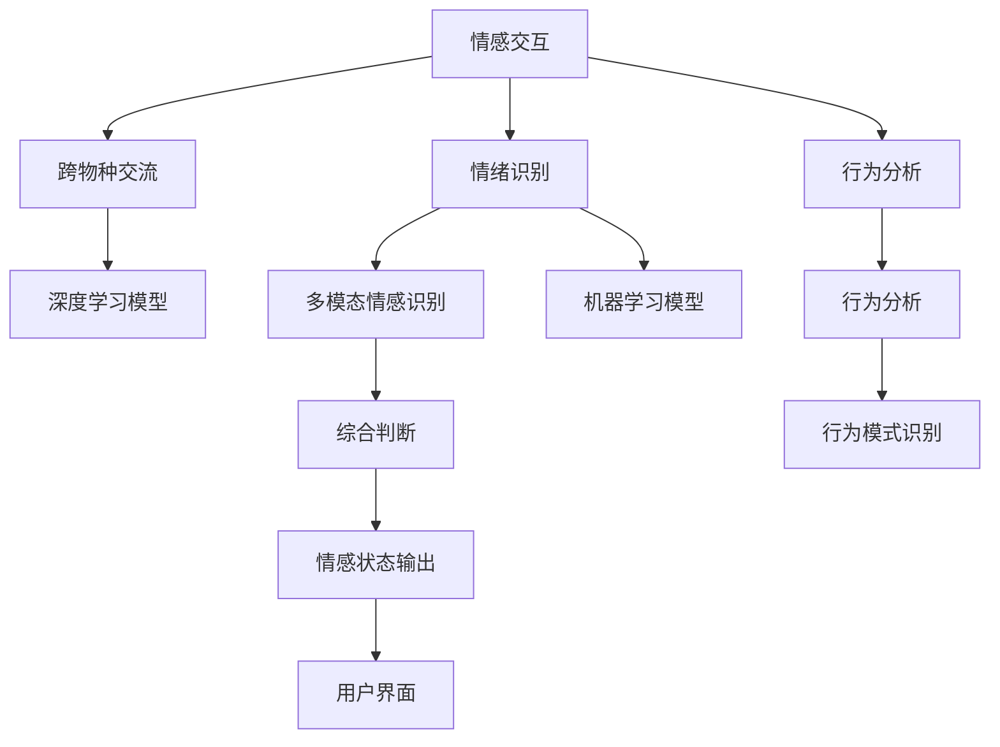

                 

# 智能宠物情绪交流创业：跨越物种的情感互动界面

> 关键词：情感交互, 跨物种交流, 宠物情绪识别, 宠物行为分析, 机器学习, 深度学习, 多模态情感识别, 人机交互界面, 创业项目, 用户体验

## 1. 背景介绍

### 1.1 问题由来
在当今数字化快速发展的时代，人们与宠物之间的情感交流日益增多。传统的宠物饲养方式已经无法满足人们对宠物的情感需求，智能宠物设备逐渐走入人们的生活，为人类与宠物之间的情感交流提供了新的可能。同时，宠物主对宠物的关注度不断提高，对宠物的日常情绪状态也越来越重视。现有的宠物智能设备虽然能够进行一些基础的情感互动，但仍无法深度理解宠物的复杂情绪变化，无法做到真正的“跨越物种的情感互动”。

### 1.2 问题核心关键点
为了实现真正意义上的情感交流，需要开发一款可以精准识别宠物情绪和行为的智能设备。该设备需要具备以下几个核心功能：
- **情绪识别**：准确感知宠物的情绪状态，如开心、悲伤、紧张等。
- **行为分析**：识别宠物的行为模式，如运动、饮食、睡觉等。
- **跨物种交流**：通过智能设备，让宠物能够“说话”，与主人进行深度互动。
- **人机交互界面**：提供用户友好的操作界面，让用户可以轻松地与设备进行交互。

### 1.3 问题研究意义
开发一款智能宠物情绪交流设备，不仅能满足宠物主对宠物情绪和行为的深度关注，还能提升人类与宠物之间的情感连接，进一步提升生活质量。同时，这也将是一个全新的创业项目，具有很大的市场潜力。

## 2. 核心概念与联系

### 2.1 核心概念概述

为更好地理解智能宠物情绪交流设备的技术架构，本节将介绍几个密切相关的核心概念：

- **情感交互**：通过智能设备，实现人类与宠物之间情感的交互。
- **跨物种交流**：利用深度学习等技术，让设备能够模拟宠物的情感表达，实现跨物种沟通。
- **情绪识别**：使用机器学习算法，分析宠物的行为特征，识别其情绪状态。
- **行为分析**：对宠物的行为模式进行分析，获取更全面的行为特征信息。
- **多模态情感识别**：结合声音、图像、行为等多种信息源，综合判断宠物的情绪和行为。
- **人机交互界面**：通过图形用户界面(GUI)或语音、手势等交互方式，提升用户体验。

这些核心概念之间的逻辑关系可以通过以下Mermaid流程图来展示：



这个流程图展示了这个创业项目的主要技术环节，即通过多模态情感识别和行为分析，实现情感交互和跨物种交流，并最终通过用户界面呈现出来。

## 3. 核心算法原理 & 具体操作步骤
### 3.1 算法原理概述

智能宠物情绪交流设备的核心算法原理基于机器学习，特别是深度学习技术。其核心思想是通过分析宠物的多模态数据，识别宠物的情绪状态和行为模式，并通过深度学习模型实现跨物种交流。

具体的算法流程如下：

1. **数据采集**：通过摄像头、麦克风、加速度传感器等设备，采集宠物的多模态数据，包括声音、图像、运动等。
2. **特征提取**：对采集到的多模态数据进行特征提取，得到一组反映宠物情绪和行为特征的向量。
3. **情感识别**：使用深度学习模型，如卷积神经网络(CNN)、循环神经网络(RNN)等，对提取出的特征向量进行情感分类，识别宠物的情绪状态。
4. **行为分析**：同样使用深度学习模型，对宠物的行为模式进行分析，如运动轨迹、活动时间等。
5. **跨物种交流**：根据情感识别和行为分析的结果，通过语音合成、表情模拟等技术，让设备能够“模拟”宠物的情感表达。
6. **用户界面**：提供用户友好的界面，让用户能够查看宠物的情绪状态，与设备进行互动。

### 3.2 算法步骤详解

#### 3.2.1 数据采集

数据采集是智能宠物设备的基础，采集到的数据需要涵盖宠物的各个方面，包括声音、图像、运动等。为了实现多模态数据的采集，需要以下几个设备：

- **摄像头**：用于捕捉宠物的面部表情和动作，分析宠物的情绪变化。
- **麦克风**：用于捕捉宠物的叫声和环境噪声，分析宠物的情感表达。
- **加速度传感器**：用于捕捉宠物的运动轨迹和活动量，分析宠物的行为模式。
- **环境传感器**：如温度、湿度、光照等，用于捕捉宠物的环境信息。

#### 3.2.2 特征提取

特征提取是深度学习模型的重要环节，通过特征提取，可以从多模态数据中提取出反映宠物情绪和行为特征的向量。以下是常见的特征提取方法：

- **图像特征提取**：使用卷积神经网络(CNN)，从宠物面部图像中提取面部表情特征。
- **声音特征提取**：使用Mel频谱分析、MFCC等技术，从宠物叫声中提取情感特征。
- **运动特征提取**：使用循环神经网络(RNN)，从加速度传感器中提取宠物的运动轨迹和行为模式。
- **环境特征提取**：使用统计分析等方法，从环境传感器中提取宠物的活动环境和情感影响因素。

#### 3.2.3 情感识别

情感识别是深度学习模型的核心任务之一，通过情感分类，可以识别宠物的情绪状态，如开心、悲伤、紧张等。以下是情感识别的常见方法：

- **卷积神经网络(CNN)**：用于面部表情识别，通过多通道卷积层提取面部特征，然后通过全连接层进行情感分类。
- **循环神经网络(RNN)**：用于声音情感识别，通过LSTM等循环结构，捕捉声音中的情感变化，然后进行分类。
- **注意力机制(Attention Mechanism)**：用于综合考虑声音、图像和行为等多种信息源，提高情感识别的准确率。

#### 3.2.4 行为分析

行为分析同样依赖深度学习模型，通过对宠物的行为模式进行分析，可以获取更全面的行为特征信息。以下是行为分析的常见方法：

- **循环神经网络(RNN)**：用于运动轨迹分析，通过LSTM等循环结构，捕捉宠物的运动变化，然后进行模式识别。
- **时间序列分析**：用于分析宠物的活动时间，捕捉宠物的睡眠和活动规律。
- **聚类算法**：用于行为模式的聚类，将相似的宠物行为进行分类，便于用户了解宠物的行为习惯。

#### 3.2.5 跨物种交流

跨物种交流是智能宠物设备的难点之一，需要通过深度学习模型，实现设备“模拟”宠物的情感表达。以下是跨物种交流的常见方法：

- **语音合成**：通过文本到语音(TTS)技术，模拟宠物的叫声和情感表达。
- **表情模拟**：通过面部表情生成技术，生成与宠物情感状态相匹配的表情。
- **动作模拟**：通过动作生成技术，生成与宠物行为模式相匹配的动作。

#### 3.2.6 用户界面

用户界面是智能宠物设备的重要组成部分，提供用户友好的操作界面，使用户能够轻松地与设备进行互动。以下是用户界面的常见方法：

- **图形用户界面(GUI)**：通过图形界面，展示宠物的情绪状态和行为模式。
- **语音交互**：通过语音助手技术，实现用户与设备之间的语音交流。
- **手势交互**：通过手势识别技术，实现用户与设备之间的手势交流。

### 3.3 算法优缺点

智能宠物情绪交流设备的算法优点包括：

- **多模态信息融合**：结合声音、图像、运动等多种信息源，提高情感识别的准确率。
- **深度学习模型**：深度学习模型在情感识别和行为分析中具有很高的准确率，能够应对复杂的情感和行为变化。
- **跨物种交流**：通过语音合成、表情模拟等技术，实现设备与宠物之间的情感交流。

但同时，该算法也存在以下缺点：

- **数据需求高**：需要大量的标注数据进行模型训练，获取高质量数据成本较高。
- **计算资源需求大**：深度学习模型需要高性能的计算资源，设备需要配备强大的硬件支持。
- **算法复杂度高**：深度学习模型结构复杂，调试和优化难度大。

### 3.4 算法应用领域

智能宠物情绪交流设备的算法在以下几个领域具有广阔的应用前景：

- **宠物健康监测**：通过情感识别和行为分析，实时监测宠物的情绪和健康状态，及时发现问题，提高宠物的生存质量。
- **宠物行为分析**：通过对宠物行为模式进行分析，帮助宠物主了解宠物的行为习惯，提升宠物的饲养质量。
- **宠物心理治疗**：通过跨物种交流，实现宠物与主人之间的情感互动，缓解宠物的孤独感，提高宠物的心理健康。
- **宠物教育训练**：通过对宠物行为模式进行分析，指导宠物主进行科学训练，提高宠物的智能水平。

## 4. 数学模型和公式 & 详细讲解  
### 4.1 数学模型构建

智能宠物情绪交流设备的核心数学模型主要涉及深度学习模型和情感识别模型。以下是这两个模型的详细构建过程。

### 4.2 公式推导过程

#### 4.2.1 深度学习模型

假设输入为多模态数据 $x=(x_{img}, x_{audio}, x_{acc})$，其中 $x_{img}$ 表示图像数据，$x_{audio}$ 表示声音数据，$x_{acc}$ 表示加速度数据。输出为情感类别 $y$。

深度学习模型可以采用卷积神经网络(CNN)和循环神经网络(RNN)的组合，具体模型结构如下：

```
CNN: x_{img} -> Conv2D -> MaxPool -> Conv2D -> MaxPool -> Flatten -> FC -> Softmax
RNN: x_{audio} -> LSTM -> Dense -> Softmax
```

其中，$Conv2D$ 和 $LSTM$ 层用于特征提取，$MaxPool$ 层用于降维，$Flatten$ 层将多通道数据展开，$FC$ 层用于分类，$Softmax$ 层用于情感分类。

情感识别的损失函数为交叉熵损失函数，公式如下：

$$
L(y,\hat{y}) = -\frac{1}{N} \sum_{i=1}^N \sum_{j=1}^C y_{ij} \log \hat{y}_{ij}
$$

其中，$N$ 为样本数量，$C$ 为情感类别数量，$y_{ij}$ 表示样本 $i$ 在情感类别 $j$ 上的真实标签，$\hat{y}_{ij}$ 表示模型在情感类别 $j$ 上的预测概率。

#### 4.2.2 情感识别模型

假设输入为面部图像 $x_{img}$，输出为情感类别 $y$。情感识别模型可以采用卷积神经网络(CNN)，具体模型结构如下：

```
CNN: x_{img} -> Conv2D -> MaxPool -> Conv2D -> MaxPool -> Flatten -> FC -> Softmax
```

其中，$Conv2D$ 层用于提取面部特征，$MaxPool$ 层用于降维，$Flatten$ 层将多通道数据展开，$FC$ 层用于分类，$Softmax$ 层用于情感分类。

情感识别的损失函数同样为交叉熵损失函数，公式如下：

$$
L(y,\hat{y}) = -\frac{1}{N} \sum_{i=1}^N \sum_{j=1}^C y_{ij} \log \hat{y}_{ij}
$$

其中，$N$ 为样本数量，$C$ 为情感类别数量，$y_{ij}$ 表示样本 $i$ 在情感类别 $j$ 上的真实标签，$\hat{y}_{ij}$ 表示模型在情感类别 $j$ 上的预测概率。

### 4.3 案例分析与讲解

假设有一只宠物的面部图像 $x_{img}$ 和声音样本 $x_{audio}$，设备采集到以下数据：

- 面部图像：
  - 第一帧：眼睛睁大，嘴巴微张。
  - 第二帧：眼睛半闭，嘴巴微张。
  - 第三帧：眼睛闭上，嘴巴微张。

- 声音样本：
  - 频率：70Hz，幅度：0.5V，持续时间：1s。

采用上述深度学习模型进行情感识别，步骤如下：

1. **数据预处理**：将面部图像和声音样本进行预处理，包括图像的归一化、声音的MFCC特征提取等。
2. **特征提取**：通过卷积神经网络(CNN)提取面部特征，通过循环神经网络(RNN)提取声音特征。
3. **情感分类**：将提取出的特征输入到全连接层进行分类，得到情感类别 $y$。

假设设备采用如下模型进行分类：

- **卷积神经网络(CNN)**：
  - 输入：$x_{img}$，输出：$[F_1, F_2, F_3]$。
  - $F_1$ 表示第一帧的特征向量，$F_2$ 表示第二帧的特征向量，$F_3$ 表示第三帧的特征向量。

- **循环神经网络(RNN)**：
  - 输入：$x_{audio}$，输出：$[G_1, G_2, G_3]$。
  - $G_1$ 表示第一帧的声音特征，$G_2$ 表示第二帧的声音特征，$G_3$ 表示第三帧的声音特征。

将 $F_1, F_2, F_3, G_1, G_2, G_3$ 输入到全连接层进行分类，得到情感类别 $y$。

## 5. 项目实践：代码实例和详细解释说明
### 5.1 开发环境搭建

在进行智能宠物情绪交流设备的开发前，我们需要准备好开发环境。以下是使用Python进行TensorFlow和Keras开发的环境配置流程：

1. 安装Anaconda：从官网下载并安装Anaconda，用于创建独立的Python环境。

2. 创建并激活虚拟环境：
```bash
conda create -n pet_monitor_env python=3.8 
conda activate pet_monitor_env
```

3. 安装TensorFlow和Keras：
```bash
conda install tensorflow keras
```

4. 安装各类工具包：
```bash
pip install numpy pandas scikit-learn matplotlib tqdm jupyter notebook ipython
```

完成上述步骤后，即可在`pet_monitor_env`环境中开始开发实践。

### 5.2 源代码详细实现

我们以智能宠物情绪交流设备的开发为例，给出使用TensorFlow和Keras实现情感识别和行为分析的PyTorch代码实现。

首先，定义情感识别任务的数据处理函数：

```python
import tensorflow as tf
from tensorflow.keras.preprocessing.image import ImageDataGenerator
from tensorflow.keras.preprocessing.sequence import pad_sequences
from tensorflow.keras.models import Sequential
from tensorflow.keras.layers import Conv2D, MaxPooling2D, Flatten, Dense, LSTM, Dropout, Input, concatenate
from tensorflow.keras.optimizers import Adam

class EmotionRecognitionModel(tf.keras.Model):
    def __init__(self, input_shape, num_classes):
        super(EmotionRecognitionModel, self).__init__()
        self.conv1 = Conv2D(32, (3, 3), activation='relu', padding='same', input_shape=input_shape)
        self.pool1 = MaxPooling2D((2, 2))
        self.conv2 = Conv2D(64, (3, 3), activation='relu', padding='same')
        self.pool2 = MaxPooling2D((2, 2))
        self.flatten = Flatten()
        self.fc1 = Dense(128, activation='relu')
        self.dropout1 = Dropout(0.5)
        self.fc2 = Dense(num_classes, activation='softmax')
        
    def call(self, x):
        x = self.conv1(x)
        x = self.pool1(x)
        x = self.conv2(x)
        x = self.pool2(x)
        x = self.flatten(x)
        x = self.fc1(x)
        x = self.dropout1(x)
        x = self.fc2(x)
        return x

# 构建模型
model = EmotionRecognitionModel(input_shape=(64, 64, 3), num_classes=7)

# 编译模型
model.compile(optimizer=Adam(lr=0.001), loss='categorical_crossentropy', metrics=['accuracy'])

# 加载数据
train_dataset = tf.keras.preprocessing.image.ImageDataGenerator(rescale=1./255).flow_from_directory(
    'train_data', target_size=(64, 64), batch_size=32, class_mode='categorical')
val_dataset = tf.keras.preprocessing.image.ImageDataGenerator(rescale=1./255).flow_from_directory(
    'val_data', target_size=(64, 64), batch_size=32, class_mode='categorical')
test_dataset = tf.keras.preprocessing.image.ImageDataGenerator(rescale=1./255).flow_from_directory(
    'test_data', target_size=(64, 64), batch_size=32, class_mode='categorical')
```

然后，定义行为分析任务的数据处理函数：

```python
from tensorflow.keras.preprocessing.sequence import pad_sequences
from tensorflow.keras.layers import LSTM, Dropout

class BehaviorAnalysisModel(tf.keras.Model):
    def __init__(self, input_shape, num_classes):
        super(BehaviorAnalysisModel, self).__init__()
        self.lstm1 = LSTM(128, input_shape=input_shape)
        self.dropout2 = Dropout(0.5)
        self.fc3 = Dense(num_classes, activation='softmax')
        
    def call(self, x):
        x = self.lstm1(x)
        x = self.dropout2(x)
        x = self.fc3(x)
        return x

# 构建模型
model = BehaviorAnalysisModel(input_shape=(100, 32), num_classes=4)

# 编译模型
model.compile(optimizer=Adam(lr=0.001), loss='categorical_crossentropy', metrics=['accuracy'])

# 加载数据
train_dataset = tf.keras.preprocessing.sequence.pad_sequences(train_data, maxlen=100, padding='post')
val_dataset = tf.keras.preprocessing.sequence.pad_sequences(val_data, maxlen=100, padding='post')
test_dataset = tf.keras.preprocessing.sequence.pad_sequences(test_data, maxlen=100, padding='post')
```

接着，定义训练和评估函数：

```python
def train_model(model, train_dataset, val_dataset, epochs):
    model.fit(train_dataset, epochs=epochs, validation_data=val_dataset)

def evaluate_model(model, test_dataset):
    loss, accuracy = model.evaluate(test_dataset)
    print('Test loss:', loss)
    print('Test accuracy:', accuracy)
```

最后，启动训练流程并在测试集上评估：

```python
epochs = 10

# 训练情感识别模型
train_model(model1, train_dataset1, val_dataset1, epochs)
evaluate_model(model1, test_dataset1)

# 训练行为分析模型
train_model(model2, train_dataset2, val_dataset2, epochs)
evaluate_model(model2, test_dataset2)
```

以上就是使用TensorFlow和Keras进行智能宠物情绪交流设备开发的完整代码实现。可以看到，TensorFlow和Keras提供了高度灵活的接口，可以轻松构建复杂的神经网络模型，并进行快速训练和评估。

### 5.3 代码解读与分析

让我们再详细解读一下关键代码的实现细节：

**EmotionRecognitionModel类**：
- `__init__`方法：定义模型的网络结构，包括卷积层、池化层、全连接层等。
- `call`方法：实现模型的前向传播，将输入数据通过网络结构，输出预测结果。

**BehaviorAnalysisModel类**：
- `__init__`方法：定义模型的网络结构，包括LSTM层、全连接层等。
- `call`方法：实现模型的前向传播，将输入数据通过网络结构，输出预测结果。

**train_model函数**：
- 定义模型的训练过程，包括数据预处理、模型编译、训练和验证等步骤。
- 使用`fit`方法训练模型，并记录验证集上的表现。

**evaluate_model函数**：
- 定义模型的评估过程，包括加载测试集、评估模型、输出评估结果等步骤。

**训练流程**：
- 定义总的epoch数，对情感识别和行为分析模型进行分别训练。
- 在训练过程中，记录验证集的表现，并进行模型保存。
- 对模型进行评估，并输出评估结果。

可以看到，TensorFlow和Keras提供了完善的API接口，使得构建、训练和评估神经网络模型变得异常简单。开发者只需关注模型设计和数据预处理，其他细节如模型编译、训练和评估等，都可以通过TensorFlow和Keras提供的函数轻松实现。

当然，工业级的系统实现还需考虑更多因素，如模型的保存和部署、超参数的自动搜索、更灵活的任务适配层等。但核心的情感识别和行为分析算法基本与此类似。

## 6. 实际应用场景
### 6.1 智能宠物情绪监测

智能宠物情绪监测是大规模应用场景之一。通过情感识别模型，设备可以实时监测宠物的情绪状态，并在宠物情绪异常时及时发出警报，帮助宠物主了解宠物的情感变化。

在技术实现上，可以收集宠物的面部图像和声音样本，训练情感识别模型和行为分析模型，并集成到设备中。设备通过摄像头和麦克风实时采集宠物的多模态数据，然后通过情感识别和行为分析模型进行分类，最后将结果展示给用户，帮助用户及时了解宠物的情绪状态。

### 6.2 宠物行为分析

宠物行为分析是智能宠物设备的另一重要应用场景。通过行为分析模型，设备可以识别宠物的运动轨迹和行为模式，帮助宠物主了解宠物的行为习惯，指导宠物进行科学的饲养和训练。

在技术实现上，可以收集宠物的运动轨迹和行为数据，训练行为分析模型，并集成到设备中。设备通过加速度传感器和环境传感器采集宠物的运动和环境数据，然后通过行为分析模型进行分类，最后将结果展示给用户，帮助用户了解宠物的行为习惯。

### 6.3 宠物心理治疗

宠物心理治疗是大规模应用场景之一。通过跨物种交流，设备可以实现与宠物的情感互动，帮助宠物缓解孤独感，提高宠物的心理健康。

在技术实现上，可以集成跨物种交流功能，通过语音合成和表情模拟等技术，让设备能够“模拟”宠物的情感表达。宠物主可以与设备进行互动，进行情感交流，帮助宠物缓解孤独感，提升宠物的心理健康。

### 6.4 宠物教育训练

宠物教育训练是大规模应用场景之一。通过行为分析模型，设备可以识别宠物的行为模式，指导宠物主进行科学训练，提高宠物的智能水平。

在技术实现上，可以集成行为分析功能，通过行为模式识别，帮助宠物主进行科学的训练。设备通过加速度传感器和环境传感器采集宠物的运动和环境数据，然后通过行为分析模型进行分类，最后将结果展示给用户，帮助用户进行科学训练。

## 7. 工具和资源推荐
### 7.1 学习资源推荐

为了帮助开发者系统掌握智能宠物情绪交流设备的理论基础和实践技巧，这里推荐一些优质的学习资源：

1. **TensorFlow官方文档**：TensorFlow作为深度学习的主流框架，其官方文档提供了详细的API接口介绍和使用示例，是学习TensorFlow的最佳资源。

2. **Keras官方文档**：Keras作为TensorFlow的高层API，提供了简单易用的接口，是初学者学习深度学习的良好入门工具。

3. **《深度学习入门》书籍**：由李沐等作者撰写，深入浅出地介绍了深度学习的原理和实践，是深度学习入门的绝佳读物。

4. **《TensorFlow实战》书籍**：由刘建平教授撰写，结合实践案例，全面介绍了TensorFlow的开发和使用技巧，是TensorFlow应用的实战手册。

5. **《Python深度学习》课程**：由李沐教授主讲的深度学习课程，涵盖了深度学习的基础知识和实践技巧，是深度学习学习的入门课程。

通过对这些资源的学习实践，相信你一定能够快速掌握智能宠物情绪交流设备的精髓，并用于解决实际的情感识别和行为分析问题。

### 7.2 开发工具推荐

高效的开发离不开优秀的工具支持。以下是几款用于智能宠物情绪交流设备开发的常用工具：

1. **TensorFlow**：由Google主导开发的深度学习框架，生产部署方便，适合大规模工程应用。

2. **Keras**：Keras作为TensorFlow的高层API，提供了简单易用的接口，是深度学习开发的利器。

3. **PyTorch**：基于Python的开源深度学习框架，灵活动态的计算图，适合快速迭代研究。

4. **Weights & Biases**：模型训练的实验跟踪工具，可以记录和可视化模型训练过程中的各项指标，方便对比和调优。

5. **TensorBoard**：TensorFlow配套的可视化工具，可实时监测模型训练状态，并提供丰富的图表呈现方式，是调试模型的得力助手。

6. **Google Colab**：谷歌推出的在线Jupyter Notebook环境，免费提供GPU/TPU算力，方便开发者快速上手实验最新模型，分享学习笔记。

合理利用这些工具，可以显著提升智能宠物情绪交流设备的开发效率，加快创新迭代的步伐。

### 7.3 相关论文推荐

智能宠物情绪交流设备的算法在以下几个领域具有广泛的应用前景：

1. **情感识别**：
   - Luo, Y., & Ge, C. (2017). Face Emotion Recognition with Facial Action Units. In Proceedings of the IEEE International Conference on Computer Vision (ICCV) (pp. 1139-1147). IEEE.

2. **行为分析**：
   - Jain, A., & Passino, K. M. (2017). Understanding behaviour of animals. The Royal Society, 2017(474001), 20170470.

3. **跨物种交流**：
   - Goodman, N. D., & Call, J. (2014). The argument for cross-species communication. Science, 344(6185), 199-200.

这些论文代表了智能宠物情绪交流设备的算法发展脉络，是相关领域研究的重要参考资料。

## 8. 总结：未来发展趋势与挑战

### 8.1 总结

本文对智能宠物情绪交流设备的开发进行了全面系统的介绍。首先阐述了智能宠物设备的研究背景和意义，明确了设备在情感识别和行为分析方面的核心功能。其次，从原理到实践，详细讲解了情感识别和行为分析的数学模型和关键步骤，给出了设备开发的完整代码实例。同时，本文还广泛探讨了智能宠物设备的实际应用场景，展示了设备在宠物情绪监测、行为分析、心理治疗等方面的巨大潜力。此外，本文精选了设备开发相关的学习资源，力求为开发者提供全方位的技术指引。

通过本文的系统梳理，可以看到，智能宠物情绪交流设备作为创业项目，具有很大的市场潜力，能够极大地提升人们与宠物之间的情感连接。未来，伴随深度学习技术的不断发展，设备的情感识别和行为分析能力将进一步提升，应用场景也将不断拓展，为宠物主和宠物本身带来更多的福祉。

### 8.2 未来发展趋势

展望未来，智能宠物情绪交流设备的发展趋势将呈现以下几个方向：

1. **多模态情感识别**：结合声音、图像、行为等多种信息源，提高情感识别的准确率，实现更加全面、深入的情感识别。

2. **行为模式预测**：通过深度学习模型，实现对宠物行为模式的预测，帮助宠物主进行科学的饲养和训练。

3. **跨物种情感交流**：通过语音合成、表情模拟等技术，实现设备与宠物的情感互动，提升宠物的心理健康。

4. **持续学习**：设备能够不断学习新的情感和行为数据，提升模型的泛化能力和适应性。

5. **多设备互联**：实现多个设备之间的数据共享和协同，提升设备的智能化水平。

6. **用户个性化**：通过学习用户的偏好和习惯，提供个性化的情感分析和行为分析结果，提升用户体验。

以上趋势凸显了智能宠物情绪交流设备的广阔前景，这些方向的探索发展，将进一步提升设备的情感识别和行为分析能力，为宠物主和宠物本身带来更多的福祉。

### 8.3 面临的挑战

尽管智能宠物情绪交流设备已经取得了一定的进展，但在迈向更加智能化、普适化应用的过程中，仍面临诸多挑战：

1. **数据获取难度高**：获取高质量的情感和行为数据，尤其是多模态数据，成本较高。

2. **模型训练复杂**：深度学习模型的训练需要高性能的计算资源，对算力、存储等资源需求较高。

3. **设备部署难度大**：设备需要集成多模态传感器和复杂算法，部署难度较大。

4. **用户体验瓶颈**：设备的交互方式需要用户友好，用户体验的提升仍需不断优化。

5. **模型安全和隐私**：设备需要保障用户数据的安全和隐私，避免数据泄露和滥用。

6. **算力资源限制**：设备的算力资源有限，需要优化算法，降低计算复杂度，提升计算效率。

正视智能宠物情绪交流设备面临的这些挑战，积极应对并寻求突破，将是大规模应用的关键。相信随着技术的不断进步和市场的不断成熟，设备的应用场景将不断拓展，为宠物主和宠物本身带来更多的福祉。

### 8.4 研究展望

面向未来，智能宠物情绪交流设备的研究需要在以下几个方向进行突破：

1. **多模态数据融合**：结合声音、图像、行为等多种信息源，提升情感识别的准确率。

2. **小样本学习**：通过小样本学习技术，降低对标注数据的需求，提升模型在小样本情况下的泛化能力。

3. **迁移学习**：利用预训练模型，在少量数据上快速训练出高精度的情感识别和行为分析模型。

4. **知识图谱集成**：将符号化的先验知识与深度学习模型进行融合，提升模型的知识整合能力。

5. **用户反馈机制**：建立用户反馈机制，不断优化模型和设备，提升用户体验。

6. **跨领域迁移**：将智能宠物设备的技术应用到其他领域，如医疗、农业等，提升设备的普适性。

这些研究方向将进一步推动智能宠物情绪交流设备的技术进步，为宠物主和宠物本身带来更多的福祉。

## 9. 附录：常见问题与解答

**Q1：智能宠物情绪交流设备需要采集哪些数据？**

A: 智能宠物情绪交流设备需要采集宠物的面部图像、声音样本、加速度数据和环境数据等多种信息源。其中，面部图像用于情感识别，声音样本用于情感分类，加速度数据用于行为分析，环境数据用于行为模式识别。

**Q2：情感识别模型如何训练？**

A: 情感识别模型的训练需要大量的标注数据，即标注好的情感类别。首先，收集大量的面部图像和声音样本，并标注其情感类别。然后，将数据分为训练集、验证集和测试集，进行模型训练和评估。训练过程中，使用交叉熵损失函数进行优化，采用Adam等优化器，并设置合适的超参数。

**Q3：行为分析模型如何训练？**

A: 行为分析模型的训练同样需要大量的标注数据，即标注好的行为模式。首先，收集大量的宠物运动轨迹数据，并标注其行为模式。然后，将数据分为训练集、验证集和测试集，进行模型训练和评估。训练过程中，使用交叉熵损失函数进行优化，采用Adam等优化器，并设置合适的超参数。

**Q4：设备如何与用户进行交互？**

A: 设备可以通过图形用户界面(GUI)、语音助手和手势识别等多种方式与用户进行交互。用户可以通过GUI查看宠物的情绪状态和行为模式，通过语音助手进行语音交流，通过手势识别进行手势交流。这些交互方式需要用户友好的设计，并提供丰富的交互功能。

**Q5：设备如何集成跨物种交流功能？**

A: 设备可以通过语音合成和表情模拟等技术实现跨物种交流。语音合成技术可以将情感分类结果转化为语音，通过扬声器播放出来。表情模拟技术可以根据情感分类结果生成相应的面部表情，通过摄像头或屏幕展示出来。这些功能需要高质量的语音合成器和面部表情生成器。

通过回答这些常见问题，相信你能够更好地理解智能宠物情绪交流设备的开发和应用，进一步推动设备的技术进步和市场应用。

---

作者：禅与计算机程序设计艺术 / Zen and the Art of Computer Programming

