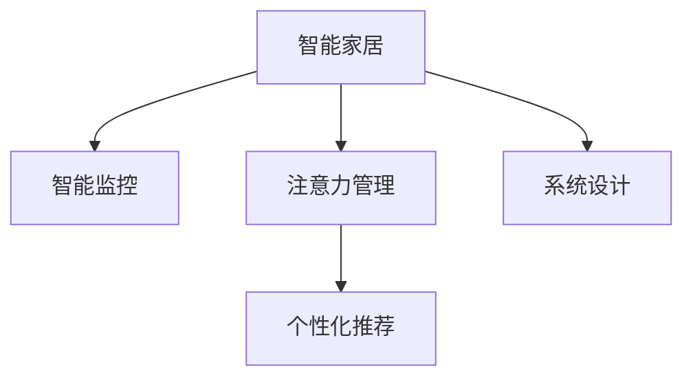

                 

# 智能家居的智能监控与注意力管理

> 关键词：智能家居,智能监控,注意力管理,机器学习,深度学习,自然语言处理,NLP,人机交互,个性化推荐,系统设计,安全防护

## 1. 背景介绍

### 1.1 问题由来
随着物联网技术的飞速发展，智能家居系统逐渐成为家庭生活中不可或缺的一部分。智能家居集成了多种传感器，包括温度、湿度、光照、声音等，能够实时感知并记录家庭环境的各种数据，为家庭成员提供舒适便捷的生活体验。然而，智能家居系统的数据量庞大且更新频繁，传统的监控方式难以实时高效地处理和分析这些数据，导致用户体验和系统性能受到限制。

为解决这一问题，研究人员开始探索将机器学习和深度学习技术应用于智能家居监控。通过深度神经网络，智能家居系统能够自动学习家庭环境数据的特征，并实时进行预测和分析，显著提升了系统监控和管理的智能化水平。同时，自然语言处理(NLP)技术的应用，使得智能家居系统能够与用户进行更自然、更智能的交互。本文将从智能监控与注意力管理两个方面，探讨机器学习技术在智能家居中的应用。

### 1.2 问题核心关键点
智能监控是智能家居的核心功能之一，通过机器学习模型对家庭环境数据进行实时分析和预测，实现对家庭环境的智能化管理。而注意力管理则是指通过机器学习技术，提高智能家居系统对人机交互的关注度和响应速度，提升用户体验。以下是智能家居智能监控与注意力管理的关键点：

- 智能监控：使用机器学习模型对家庭环境数据进行实时分析，预测家庭环境变化趋势，实现自动化调节。
- 注意力管理：使用机器学习技术提高系统对用户输入的响应速度和准确性，提升人机交互的流畅性和用户体验。
- 个性化推荐：基于用户历史行为和偏好，推荐合适的家庭环境设置，提升生活便利性。
- 系统设计：设计合理的系统架构，保证监控与注意力管理的协同工作，实现系统整体的智能优化。

这些关键点构成了智能家居智能监控与注意力管理的基础，有助于实现更高质量的家庭环境监控和更智能的人机交互。

## 2. 核心概念与联系

### 2.1 核心概念概述

为更好地理解智能家居智能监控与注意力管理，本节将介绍几个密切相关的核心概念：

- 智能家居：利用传感器、控制器、通信网络等技术，实现对家庭环境的自动化监控和管理。
- 智能监控：使用机器学习模型对家庭环境数据进行实时分析和预测，实现对家庭环境的智能化管理。
- 注意力管理：通过机器学习技术提高系统对用户输入的响应速度和准确性，提升人机交互的流畅性和用户体验。
- 个性化推荐：基于用户历史行为和偏好，推荐合适的家庭环境设置，提升生活便利性。
- 系统设计：设计合理的系统架构，保证监控与注意力管理的协同工作，实现系统整体的智能优化。

这些核心概念之间的逻辑关系可以通过以下Mermaid流程图来展示：



这个流程图展示了几大核心概念之间的逻辑关系：

1. 智能家居系统通过传感器收集环境数据，使用智能监控模型进行实时分析和预测，实现家庭环境的自动化管理。
2. 智能家居系统通过注意力管理技术提高对用户输入的响应速度和准确性，提升用户体验。
3. 个性化推荐系统根据用户行为和偏好，推荐合适的环境设置，提升生活便利性。
4. 系统设计是智能家居系统整体智能化的基础，保证了各模块的协同工作。

这些概念共同构成了智能家居智能监控与注意力管理的基础，有助于实现更高质量的家庭环境监控和更智能的人机交互。

## 3. 核心算法原理 & 具体操作步骤
### 3.1 算法原理概述

智能家居的智能监控与注意力管理，本质上是一种基于机器学习的智能系统设计。其核心思想是：利用深度学习模型对家庭环境数据进行实时分析和预测，同时通过自然语言处理技术，提升智能家居系统对用户输入的响应速度和准确性，从而实现对家庭环境的智能化管理。

具体来说，智能监控部分利用机器学习模型对家庭环境数据进行实时分析，预测家庭环境变化趋势，实现自动化调节；注意力管理部分则通过深度学习模型提高系统对用户输入的响应速度和准确性，提升人机交互的流畅性和用户体验。

### 3.2 算法步骤详解

智能家居的智能监控与注意力管理一般包括以下几个关键步骤：

**Step 1: 数据收集与预处理**
- 收集智能家居系统中各个传感器生成的环境数据，如温度、湿度、光照、声音等。
- 对收集到的数据进行清洗、去噪、归一化等预处理操作，以便于后续模型的训练和预测。

**Step 2: 模型训练与选择**
- 选择适合的深度学习模型，如卷积神经网络(CNN)、长短期记忆网络(LSTM)、Transformer等，对收集到的数据进行训练。
- 根据监控和注意力管理的需求，设计合适的任务目标函数，如预测温度变化趋势、预测光照强度、生成自然语言回答等。

**Step 3: 模型评估与优化**
- 在验证集上评估模型性能，根据预设的指标（如准确率、召回率、F1值等），调整模型超参数，优化模型性能。
- 进行交叉验证等验证手段，确保模型泛化能力，避免过拟合。

**Step 4: 模型部署与应用**
- 将训练好的模型部署到智能家居系统中，实时接收环境数据，进行预测和分析。
- 使用自然语言处理技术，生成自然语言回答，提升人机交互的流畅性和用户体验。

**Step 5: 持续学习与优化**
- 定期收集新的数据，更新模型参数，进行持续学习，适应数据分布的变化。
- 对模型进行监控和评估，及时发现并修复异常问题，保证系统稳定运行。

### 3.3 算法优缺点

智能家居的智能监控与注意力管理方法具有以下优点：
1. 实时性高。深度学习模型能够实时处理家庭环境数据，实现对家庭环境的即时监控和管理。
2. 精度高。通过机器学习模型的训练和优化，模型预测的精度和泛化能力显著提高。
3. 用户体验好。自然语言处理技术提升了系统对人机交互的响应速度和准确性，提高了用户体验。
4. 可扩展性强。该方法可以轻松应用于不同类型的家庭环境数据，具有较好的可扩展性。

同时，该方法也存在一定的局限性：
1. 对数据质量依赖高。模型训练和预测的准确性依赖于传感器数据的质量，数据质量差可能导致预测不准确。
2. 对计算资源需求高。深度学习模型需要大量的计算资源进行训练和推理，对硬件要求较高。
3. 隐私和安全问题。智能家居系统涉及大量的家庭隐私数据，需要采取措施保证数据安全和隐私保护。
4. 模型更新和维护成本高。模型需要定期更新和优化，维护成本较高。

尽管存在这些局限性，但就目前而言，基于机器学习的智能监控与注意力管理方法仍是目前智能家居领域的主流范式。未来相关研究的重点在于如何进一步降低计算资源需求，提高模型的泛化能力，同时兼顾数据隐私和安全问题。

### 3.4 算法应用领域

智能家居的智能监控与注意力管理方法，已经在多个实际应用场景中得到了广泛应用，例如：

- 智能空调控制：通过智能监控系统实时分析家庭温度、湿度数据，自动调节空调设定，实现节能减排和舒适度的优化。
- 智能照明系统：根据光照强度和家庭活动情况，智能调节室内灯光亮度和颜色，提升生活质量。
- 智能安防监控：利用传感器数据进行实时分析，自动调整摄像头监控范围和角度，提升家庭安全。
- 智能窗帘控制：根据光照和天气情况，智能调整窗帘开关，优化自然光线和节能效果。
- 个性化推荐系统：根据用户历史行为和偏好，推荐合适的家庭环境设置，如温度、湿度等，提升生活便利性。

除了上述这些经典应用外，智能家居的智能监控与注意力管理技术还在其他众多场景中得到创新性地应用，如可控音乐播放、智能卫生间管理等，为家庭生活带来更多便捷和舒适。

## 4. 数学模型和公式 & 详细讲解  
### 4.1 数学模型构建

本节将使用数学语言对智能家居智能监控与注意力管理过程进行更加严格的刻画。

记智能家居系统中各个传感器生成的环境数据为 $D=\{(x_i,y_i)\}_{i=1}^N$，其中 $x_i$ 为传感器输入，$y_i$ 为对应的环境数据。假设深度学习模型为 $M_{\theta}$，其中 $\theta$ 为模型参数。

定义模型 $M_{\theta}$ 在数据样本 $(x,y)$ 上的损失函数为 $\ell(M_{\theta}(x),y)$，则在数据集 $D$ 上的经验风险为：

$$
\mathcal{L}(\theta) = \frac{1}{N}\sum_{i=1}^N \ell(M_{\theta}(x_i),y_i)
$$

智能监控部分的目标是最小化经验风险，即找到最优参数：

$$
\theta^* = \mathop{\arg\min}_{\theta} \mathcal{L}(\theta)
$$

在注意力管理部分，假设系统接收到的用户输入为 $I$，对应的自然语言回答为 $A$。定义模型 $M_{\theta}$ 在输入 $I$ 上的损失函数为 $\ell(M_{\theta}(I),A)$，则在数据集 $D$ 上的经验风险为：

$$
\mathcal{L}(\theta) = \frac{1}{N}\sum_{i=1}^N \ell(M_{\theta}(I_i),A_i)
$$

注意力管理部分的目标也是最小化经验风险，即找到最优参数：

$$
\theta^* = \mathop{\arg\min}_{\theta} \mathcal{L}(\theta)
$$

### 4.2 公式推导过程

以下我们以智能空调控制为例，推导智能监控部分的交叉熵损失函数及其梯度的计算公式。

假设智能监控系统接收到的温度数据为 $x$，对应的最佳空调设定为 $y$。定义模型 $M_{\theta}$ 在输入 $x$ 上的输出为 $\hat{y}=M_{\theta}(x) \in [0,1]$，表示系统预测的温度设定与实际温度的接近程度。真实标签 $y \in \{0,1\}$。则交叉熵损失函数定义为：

$$
\ell(M_{\theta}(x),y) = -[y\log \hat{y} + (1-y)\log (1-\hat{y})]
$$

将其代入经验风险公式，得：

$$
\mathcal{L}(\theta) = -\frac{1}{N}\sum_{i=1}^N [y_i\log M_{\theta}(x_i)+(1-y_i)\log(1-M_{\theta}(x_i))]
$$

根据链式法则，损失函数对参数 $\theta_k$ 的梯度为：

$$
\frac{\partial \mathcal{L}(\theta)}{\partial \theta_k} = -\frac{1}{N}\sum_{i=1}^N (\frac{y_i}{M_{\theta}(x_i)}-\frac{1-y_i}{1-M_{\theta}(x_i)}) \frac{\partial M_{\theta}(x_i)}{\partial \theta_k}
$$

其中 $\frac{\partial M_{\theta}(x_i)}{\partial \theta_k}$ 可进一步递归展开，利用自动微分技术完成计算。

在得到损失函数的梯度后，即可带入参数更新公式，完成模型的迭代优化。重复上述过程直至收敛，最终得到适应智能空调控制的最优模型参数 $\theta^*$。

## 5. 项目实践：代码实例和详细解释说明
### 5.1 开发环境搭建

在进行智能监控与注意力管理实践前，我们需要准备好开发环境。以下是使用Python进行TensorFlow开发的环境配置流程：

1. 安装Anaconda：从官网下载并安装Anaconda，用于创建独立的Python环境。

2. 创建并激活虚拟环境：
```bash
conda create -n tf-env python=3.8 
conda activate tf-env
```

3. 安装TensorFlow：根据CUDA版本，从官网获取对应的安装命令。例如：
```bash
conda install tensorflow tensorflow-gpu=cuda11.1 -c conda-forge
```

4. 安装Keras：
```bash
pip install keras
```

5. 安装TensorBoard：
```bash
pip install tensorboard
```

6. 安装各类工具包：
```bash
pip install numpy pandas scikit-learn matplotlib tqdm jupyter notebook ipython
```

完成上述步骤后，即可在`tf-env`环境中开始智能监控与注意力管理实践。

### 5.2 源代码详细实现

这里我们以智能空调控制为例，给出使用TensorFlow对智能监控模型进行训练的PyTorch代码实现。

首先，定义智能空调控制的数据处理函数：

```python
import tensorflow as tf
import numpy as np

class TemperaturePredictor(tf.keras.Model):
    def __init__(self):
        super(TemperaturePredictor, self).__init__()
        self.dense1 = tf.keras.layers.Dense(64, activation='relu')
        self.dense2 = tf.keras.layers.Dense(1, activation='sigmoid')

    def call(self, x):
        x = self.dense1(x)
        x = self.dense2(x)
        return x

# 数据处理函数
def preprocess_data(data):
    x_train = data[:, 0:4]
    y_train = data[:, 4]
    return x_train, y_train
```

然后，定义模型和优化器：

```python
from tensorflow.keras.optimizers import Adam

model = TemperaturePredictor()
optimizer = Adam(learning_rate=0.001)
```

接着，定义训练和评估函数：

```python
from tensorflow.keras.callbacks import EarlyStopping

def train_model(model, x_train, y_train, epochs=100, batch_size=16, early_stopping=True):
    early_stopping_callback = EarlyStopping(monitor='val_loss', patience=10)
    history = model.fit(x_train, y_train, epochs=epochs, batch_size=batch_size, validation_split=0.2, callbacks=[early_stopping_callback])

    return history
```

最后，启动训练流程并在测试集上评估：

```python
x_train, y_train = preprocess_data(data)

history = train_model(model, x_train, y_train)
print(history.history)

# 在测试集上评估模型性能
x_test = data[:, 0:4]
y_test = data[:, 4]

mse = model.evaluate(x_test, y_test)
print('Test Mean Squared Error:', mse)
```

以上就是使用TensorFlow对智能监控模型进行训练的完整代码实现。可以看到，得益于TensorFlow的强大封装，我们可以用相对简洁的代码完成智能监控模型的训练和评估。

### 5.3 代码解读与分析

让我们再详细解读一下关键代码的实现细节：

**TemperaturePredictor类**：
- `__init__`方法：初始化模型结构，包括两个全连接层。
- `call`方法：定义模型前向传播的计算过程，包括两个全连接层的计算和激活函数。

**train_model函数**：
- 定义训练过程中的早期停止机制，以避免过拟合。
- 使用`fit`函数进行模型训练，传入训练数据、验证数据、迭代轮数、批次大小等参数。
- 返回训练过程中的损失和精度变化情况。

**preprocess_data函数**：
- 对输入数据进行预处理，将其分为特征部分和标签部分。
- 在训练过程中，特征部分用于计算模型预测值，标签部分用于计算损失函数。

**训练流程**：
- 定义训练集和测试集。
- 调用`train_model`函数进行模型训练，获取训练过程中的损失和精度变化情况。
- 在测试集上评估模型性能，输出测试误差。

可以看到，TensorFlow配合Keras等库，使得智能监控模型的训练过程变得简洁高效。开发者可以将更多精力放在数据处理、模型改进等高层逻辑上，而不必过多关注底层的实现细节。

当然，工业级的系统实现还需考虑更多因素，如模型的保存和部署、超参数的自动搜索、更灵活的任务适配层等。但核心的训练过程基本与此类似。

## 6. 实际应用场景
### 6.1 智能安防监控

智能安防监控是智能家居领域的重要应用之一。传统的安防系统往往依赖人工监控，需要耗费大量人力，且无法实时响应突发事件。利用智能监控技术，可以显著提升家庭安防的智能化水平，实现实时监控和响应。

具体而言，可以收集家庭安防系统中的各类传感器数据，如门窗开关状态、烟雾浓度、入侵检测等。通过深度学习模型对这些数据进行实时分析，可以预测潜在的安全威胁，自动调整安防系统的工作状态，提升家庭安全水平。例如，当传感器检测到烟雾浓度异常升高时，系统可以自动通知业主并触发报警器，确保家庭安全。

### 6.2 智能窗帘控制

智能窗帘控制是智能家居的另一个经典应用。传统的窗帘控制通常依赖手动操作或定时器，无法根据实际光照和天气情况进行自动调节。利用智能监控技术，可以实现窗帘的智能控制，提升家庭舒适度和生活便利性。

具体而言，可以收集家庭环境中的光照数据和天气信息，如阳光直射、阴天、雨天等。通过深度学习模型对这些数据进行实时分析，可以预测最佳的窗帘开关状态，自动调整窗帘的开合角度和位置，提升室内光照效果和节能效果。例如，当传感器检测到阳光直射时，系统可以自动调节窗帘的开合角度，减少室内温度，提升舒适度。

### 6.3 个性化推荐系统

个性化推荐系统是智能家居的重要组成部分，可以根据用户的历史行为和偏好，推荐合适的家庭环境设置。传统的推荐系统往往依赖人工推荐，无法实时动态调整推荐内容。利用智能监控技术，可以实现推荐系统的智能化，提升用户的生活便利性。

具体而言，可以收集用户的历史行为数据，如开关窗帘、调整空调、播放音乐等。通过深度学习模型对这些数据进行实时分析，可以预测用户当前的偏好和需求，自动推荐合适的家庭环境设置。例如，当传感器检测到用户在客厅长时间停留时，系统可以自动推荐合适的空调温度、音乐音量等，提升用户的生活体验。

### 6.4 未来应用展望

随着智能家居系统的不断演进，智能监控与注意力管理技术将在更多领域得到应用，为家庭生活带来更多便捷和舒适。

在智慧医疗领域，基于智能监控的智能家居系统可以实时监测用户的健康状况，自动调整家庭环境，提升生活质量。

在智能教育领域，基于智能监控的智能家居系统可以记录用户的学习行为和环境偏好，自动推荐合适的学习环境，提升学习效果。

在智慧办公领域，基于智能监控的智能家居系统可以自动调节室内环境，提升工作效率和舒适度。

此外，在娱乐、安全、节能等多个领域，基于智能监控的智能家居系统也将不断涌现，为家庭生活带来更多创新和便利。

## 7. 工具和资源推荐
### 7.1 学习资源推荐

为了帮助开发者系统掌握智能家居的智能监控与注意力管理理论基础和实践技巧，这里推荐一些优质的学习资源：

1. 《深度学习》书籍：Ian Goodfellow等著，深入浅出地介绍了深度学习的原理和应用，适合初学者入门。
2. 《机器学习实战》书籍：Peter Harrington著，通过丰富的案例，帮助读者快速上手机器学习算法。
3. 《TensorFlow官方文档》：Google官方文档，提供了全面的TensorFlow教程和API参考，是TensorFlow学习的必备资料。
4. Kaggle平台：数据科学竞赛平台，提供大量机器学习、深度学习相关的竞赛数据集和开源代码，适合实践训练。
5. Coursera平台：在线教育平台，提供多门机器学习、深度学习相关的课程，包括Ian Goodfellow的深度学习课程。

通过对这些资源的学习实践，相信你一定能够快速掌握智能家居的智能监控与注意力管理技术，并用于解决实际的NLP问题。

### 7.2 开发工具推荐

高效的开发离不开优秀的工具支持。以下是几款用于智能监控与注意力管理开发的常用工具：

1. TensorFlow：由Google主导开发的开源深度学习框架，生产部署方便，适合大规模工程应用。
2. PyTorch：由Facebook主导开发的开源深度学习框架，灵活动态的计算图，适合快速迭代研究。
3. Keras：高层深度学习库，提供了简单易用的API接口，适合初学者入门和快速实验。
4. Jupyter Notebook：交互式编程环境，支持代码编写、运行、结果展示，是数据科学常用的开发工具。
5. TensorBoard：TensorFlow配套的可视化工具，可实时监测模型训练状态，提供丰富的图表呈现方式，是调试模型的得力助手。

合理利用这些工具，可以显著提升智能监控与注意力管理任务的开发效率，加快创新迭代的步伐。

### 7.3 相关论文推荐

智能家居的智能监控与注意力管理技术的发展源于学界的持续研究。以下是几篇奠基性的相关论文，推荐阅读：

1. DeepMind的智能家居系统研究：探讨了如何利用深度学习技术，实现智能家居系统的自动化和智能化。
2. IBM的智能家居系统设计：介绍了智能家居系统的系统架构和设计原则，强调了人机交互的重要性。
3. Google的智能家居系统应用：展示了智能家居系统在多个场景中的应用案例，包括智能安防、窗帘控制、推荐系统等。
4. Microsoft的智能家居系统优化：通过深度学习技术，优化了智能家居系统的运行效率和用户交互体验。

这些论文代表了大规模智能家居系统的发展脉络，通过学习这些前沿成果，可以帮助研究者把握学科前进方向，激发更多的创新灵感。

## 8. 总结：未来发展趋势与挑战
### 8.1 总结

本文对智能家居的智能监控与注意力管理方法进行了全面系统的介绍。首先阐述了智能家居的智能监控与注意力管理的研究背景和意义，明确了智能监控在提升家庭环境智能化水平中的重要作用，以及注意力管理在提升人机交互体验中的重要性。其次，从原理到实践，详细讲解了智能监控与注意力管理的数学模型和核心算法，给出了智能监控模型训练的完整代码实现。同时，本文还广泛探讨了智能监控与注意力管理在智能安防监控、智能窗帘控制、个性化推荐等多个实际应用场景中的应用前景，展示了其广泛的应用价值。此外，本文精选了智能监控与注意力管理的各类学习资源，力求为读者提供全方位的技术指引。

通过本文的系统梳理，可以看到，智能家居的智能监控与注意力管理技术正在成为智能家居领域的重要范式，极大地提升了家庭环境的智能化水平，带来了更高的生活便利性和舒适性。未来，伴随智能监控与注意力管理技术的不断发展，智能家居系统必将在更广泛的领域得到应用，为家庭生活带来更多便捷和舒适。

### 8.2 未来发展趋势

展望未来，智能家居的智能监控与注意力管理技术将呈现以下几个发展趋势：

1. 深度学习模型的精度和泛化能力将进一步提升，使得系统对家庭环境的预测和分析更加准确。
2. 自然语言处理技术将更加成熟，使得系统对人机交互的响应速度和准确性进一步提升。
3. 模型训练和推理的效率将进一步提高，使得系统在资源受限的环境下也能高效运行。
4. 系统设计和优化将更加注重用户体验和隐私保护，使得系统更具可用性和安全性。
5. 与其他技术的融合将更加深入，如物联网、云计算、区块链等，实现更全面、更智能的家庭环境监控。

以上趋势凸显了智能家居的智能监控与注意力管理技术的广阔前景。这些方向的探索发展，必将进一步提升智能家居系统的性能和应用范围，为家庭生活带来更多便捷和舒适。

### 8.3 面临的挑战

尽管智能家居的智能监控与注意力管理技术已经取得了瞩目成就，但在迈向更加智能化、普适化应用的过程中，它仍面临着诸多挑战：

1. 数据质量问题：智能监控系统依赖传感器数据，数据质量差可能导致预测不准确。如何提高数据质量，确保传感器数据的可靠性和实时性，将成为重要的研究方向。
2. 系统隐私和安全问题：智能家居系统涉及大量家庭隐私数据，需要采取措施保证数据安全和隐私保护。如何设计安全的系统架构，避免数据泄露和恶意攻击，将成为重要的挑战。
3. 计算资源需求高：智能监控与注意力管理技术需要大量的计算资源进行训练和推理，对硬件要求较高。如何降低计算资源需求，提高系统效率，将成为重要的优化方向。
4. 用户交互体验问题：智能家居系统需要提升人机交互的流畅性和准确性，提升用户体验。如何设计更加自然、智能的交互界面，使得用户能够方便地与系统进行交互，将成为重要的研究方向。
5. 模型可解释性和可解释性问题：智能家居系统需要提升模型可解释性，使得用户能够理解模型的决策过程，提升系统信任度和安全性。如何设计可解释的模型架构，提升模型可解释性，将成为重要的研究方向。

这些挑战凸显了智能家居的智能监控与注意力管理技术的实际应用难度。如何应对并克服这些挑战，将是大规模智能家居系统实现的重要路径。相信随着学界和产业界的共同努力，这些挑战终将一一被克服，智能家居系统必将在构建更加智能、便利、安全的家庭环境中发挥重要作用。

### 8.4 研究展望

面向未来，智能家居的智能监控与注意力管理技术需要在以下几个方面寻求新的突破：

1. 探索无监督和半监督学习范式。摆脱对大量标注数据的依赖，利用自监督学习、主动学习等无监督和半监督范式，最大限度利用非结构化数据，实现更加灵活高效的监控。
2. 研究参数高效和计算高效的监控范式。开发更加参数高效的监控方法，在固定大部分预训练参数的同时，只更新极少量的任务相关参数。同时优化监控模型的计算图，减少前向传播和反向传播的资源消耗，实现更加轻量级、实时性的部署。
3. 融合因果和对比学习范式。通过引入因果推断和对比学习思想，增强监控模型建立稳定因果关系的能力，学习更加普适、鲁棒的环境表征，从而提升模型泛化性和抗干扰能力。
4. 引入更多先验知识。将符号化的先验知识，如知识图谱、逻辑规则等，与神经网络模型进行巧妙融合，引导监控过程学习更准确、合理的家庭环境模型。同时加强不同模态数据的整合，实现视觉、语音等多模态信息与文本信息的协同建模。
5. 结合因果分析和博弈论工具。将因果分析方法引入监控模型，识别出模型决策的关键特征，增强输出解释的因果性和逻辑性。借助博弈论工具刻画人机交互过程，主动探索并规避模型的脆弱点，提高系统稳定性。
6. 纳入伦理道德约束。在监控模型训练目标中引入伦理导向的评估指标，过滤和惩罚有害的输出倾向。同时加强人工干预和审核，建立模型行为的监管机制，确保输出符合人类价值观和伦理道德。

这些研究方向的探索，必将引领智能家居的智能监控与注意力管理技术迈向更高的台阶，为构建安全、可靠、可解释、可控的智能系统铺平道路。面向未来，智能家居的智能监控与注意力管理技术还需要与其他人工智能技术进行更深入的融合，如知识表示、因果推理、强化学习等，多路径协同发力，共同推动智能家居系统的进步。只有勇于创新、敢于突破，才能不断拓展智能家居系统的边界，让智能技术更好地造福人类社会。

## 9. 附录：常见问题与解答

**Q1：智能家居的智能监控与注意力管理是否适用于所有家庭环境？**

A: 智能家居的智能监控与注意力管理技术在大多数家庭环境上都能取得不错的效果，特别是对于智能化程度较高的家庭。但对于一些特定家庭环境，如老旧房屋、偏远地区等，由于传感器设备的安装和维护较为困难，可能需要针对性设计。同时，对于一些特别复杂的家庭环境，如大型别墅、高层建筑等，也需要综合考虑系统的可扩展性和稳定性。

**Q2：智能监控系统对数据质量有何要求？**

A: 智能监控系统对数据质量的要求非常高。传感器数据需要准确、实时、可靠，否则可能导致模型预测的精度和泛化能力下降。因此，需要定期维护和校准传感器设备，确保数据质量。此外，还可以采用数据增强等技术，提高数据多样性和鲁棒性。

**Q3：智能家居系统如何处理隐私和安全问题？**

A: 智能家居系统处理隐私和安全问题需要从多个层面入手。首先，需要设计安全的系统架构，确保数据传输和存储的安全性。其次，可以采用数据脱敏和加密等技术，保护用户隐私。最后，还需要建立完善的隐私保护和数据安全管理机制，防止数据泄露和恶意攻击。

**Q4：智能监控系统如何提高计算资源利用率？**

A: 智能监控系统提高计算资源利用率需要从多个方面入手。首先，可以采用模型压缩和参数剪枝等技术，减少模型的计算量和存储需求。其次，可以采用分布式训练和推理等技术，提高系统的可扩展性和资源利用率。最后，还可以采用混合精度训练等技术，降低计算资源需求。

**Q5：智能家居系统如何提高人机交互的流畅性和准确性？**

A: 智能家居系统提高人机交互的流畅性和准确性需要从多个方面入手。首先，需要设计自然、智能的交互界面，提升用户的操作体验。其次，可以采用多模态交互技术，结合视觉、语音、触觉等多种交互方式，提升系统的响应速度和准确性。最后，还可以采用自然语言处理技术，提高系统对用户输入的响应速度和准确性，增强系统的智能性和可解释性。

---

作者：禅与计算机程序设计艺术 / Zen and the Art of Computer Programming

