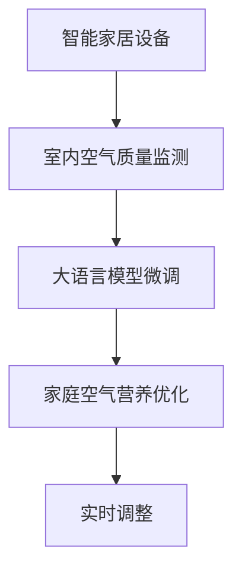

                 

# 智能家居空气营养创业：呼吸健康的精确管理

## 1. 背景介绍

### 1.1 问题由来

随着生活质量的提高，人们对居住环境的健康状况越来越关注。室内空气质量直接影响人们的身体健康，而呼吸系统疾病是现代生活中的常见病。据统计，每年全球因室内空气污染导致的新增病例数已达150万以上，死亡人数超过500万，其中包括肺炎、哮喘等严重呼吸系统疾病。

当前，许多智能家居设备已经能够监测室内空气质量，如PM2.5、甲醛、VOCs等有害气体的浓度，并提供相应的净化方案。然而，这些设备往往只能起到部分净化作用，无法全面提升室内空气质量，也无法精确控制家庭空气营养。

### 1.2 问题核心关键点

本节将详细阐述如何在智能家居环境中，利用大语言模型微调技术，对家庭空气营养进行精确管理，以确保用户的呼吸健康。

- **家庭空气营养**：指的是室内空气中各种气体、颗粒物等的成分及其浓度，是影响人体呼吸系统健康的重要因素。
- **精确管理**：通过智能家居设备收集的数据，结合大语言模型微调技术，实时分析并调整家庭空气营养，确保呼吸环境符合健康标准。
- **大语言模型微调**：利用大模型在特定任务上的微调，优化模型性能，提高对家庭空气营养的感知和处理能力。

### 1.3 问题研究意义

研究如何通过大语言模型微调技术进行家庭空气营养的精确管理，对于提升居住环境质量，改善人类健康，具有重要意义：

1. **提升居住环境质量**：通过实时监测和调整家庭空气营养，确保室内空气始终处于健康状态，减少有害物质对人体的侵害。
2. **改善人类健康**：精准控制空气质量，有效预防和治疗呼吸系统疾病，提升生活质量。
3. **推动智能家居产业发展**：促进智能家居设备的功能升级和应用场景拓展，推动智慧家庭建设。
4. **激发技术创新**：推动大语言模型和微调技术的进步，促进人工智能在更多领域的落地应用。

## 2. 核心概念与联系

### 2.1 核心概念概述

在智能家居空气营养管理中，涉及多个关键概念和技术，包括：

- **智能家居设备**：如智能空气净化器、智能温控器、智能通风系统等，能够实时监测和调节室内空气环境。
- **室内空气质量监测**：通过传感器技术，实时监测PM2.5、甲醛、VOCs等有害气体的浓度，提供实时数据支持。
- **大语言模型微调**：利用大模型在特定任务上的微调，优化模型性能，提升对家庭空气营养的感知和处理能力。
- **家庭空气营养优化**：通过算法模型，根据室内空气质量数据，动态调整空气营养参数，确保呼吸环境健康。

这些概念之间的联系可以通过以下Mermaid流程图来展示：



这个流程图展示了智能家居空气营养管理的核心流程：智能家居设备监测空气质量，通过大语言模型微调技术，分析数据并优化家庭空气营养，最终实现实时调整。

## 3. 核心算法原理 & 具体操作步骤

### 3.1 算法原理概述

家庭空气营养管理的核心在于利用大语言模型微调技术，对家庭空气质量数据进行分析和处理，动态调整室内空气营养，确保呼吸环境健康。其核心算法包括：

1. **数据收集与预处理**：通过智能家居设备收集室内空气质量数据，包括PM2.5、甲醛、VOCs等有害气体的浓度。
2. **大语言模型微调**：利用大模型在特定任务上的微调，优化模型性能，提升对家庭空气营养的感知和处理能力。
3. **家庭空气营养优化**：根据室内空气质量数据，动态调整空气营养参数，确保呼吸环境健康。
4. **实时调整**：根据实时监测数据和优化结果，动态调整智能家居设备的工作参数，如空气净化器的滤网更换频率、通风系统的风量调节等。

### 3.2 算法步骤详解

**Step 1: 数据收集与预处理**

1. **设备安装与联网**：在智能家居环境中安装各类传感器设备，如PM2.5传感器、甲醛传感器、VOCs传感器等，并通过Wi-Fi或蓝牙等无线技术联网。
2. **数据收集**：实时监测室内空气质量数据，包括PM2.5、甲醛、VOCs等有害气体的浓度，存入数据库。
3. **数据清洗与标准化**：对收集的数据进行清洗和标准化处理，去除异常值和噪声，确保数据的准确性和一致性。

**Step 2: 大语言模型微调**

1. **选择合适的预训练模型**：选择适合进行家庭空气营养分析的预训练模型，如BERT、GPT等。
2. **数据标注与预处理**：收集家庭空气质量数据集，并标注各类有害气体的浓度范围，作为微调的监督数据。
3. **微调模型**：使用标注数据对预训练模型进行微调，优化模型性能，提升对家庭空气营养的感知和处理能力。
4. **模型评估与验证**：在验证集上评估微调后模型的性能，确保其能够准确识别和处理各类有害气体。

**Step 3: 家庭空气营养优化**

1. **定义优化目标**：根据各类有害气体的浓度范围，定义家庭空气营养的优化目标，如PM2.5浓度低于25μg/m³，甲醛浓度低于0.1mg/m³等。
2. **动态调整参数**：根据实时监测数据，动态调整智能家居设备的工作参数，如空气净化器的滤网更换频率、通风系统的风量调节等。
3. **优化算法**：设计优化算法，实时调整空气营养参数，确保呼吸环境健康。

**Step 4: 实时调整**

1. **实时监测与反馈**：通过智能家居设备实时监测室内空气质量数据，并反馈给大语言模型微调系统。
2. **动态调整设备参数**：根据优化结果，动态调整智能家居设备的工作参数，确保呼吸环境始终处于健康状态。

### 3.3 算法优缺点

家庭空气营养管理的大语言模型微调方法具有以下优点：

1. **实时性强**：通过实时监测和动态调整，确保室内空气质量始终处于健康状态。
2. **高效性高**：利用大语言模型的强大计算能力，快速分析和优化家庭空气营养，提高处理效率。
3. **适应性强**：适用于各种家庭环境，能够适应不同场景下的空气质量需求。

然而，该方法也存在一些局限性：

1. **数据依赖性高**：微调效果很大程度上取决于家庭空气质量数据的准确性和完整性。
2. **模型复杂度低**：模型只关注有害气体的浓度，难以全面评估空气质量。
3. **实时性要求高**：实时调整需要快速响应，对硬件设备的要求较高。

### 3.4 算法应用领域

家庭空气营养管理的大语言模型微调方法，在智能家居领域具有广泛的应用前景，具体包括：

1. **空气净化器**：智能空气净化器通过大语言模型微调技术，动态调整滤网更换频率，确保空气质量始终符合健康标准。
2. **智能温控器**：智能温控器通过优化空气流通参数，确保室内空气质量。
3. **智能通风系统**：智能通风系统通过实时监测和动态调节，提高室内空气质量。

## 4. 数学模型和公式 & 详细讲解 & 举例说明

### 4.1 数学模型构建

家庭空气营养管理的大语言模型微调方法，可以通过以下数学模型来描述：

假设室内空气质量数据为 $X=(x_1, x_2, ..., x_n)$，其中 $x_i$ 表示第 $i$ 种有害气体的浓度。家庭空气营养的优化目标为 $Y=(y_1, y_2, ..., y_m)$，其中 $y_i$ 表示第 $i$ 种有害气体的浓度阈值。

定义大语言模型微调后的输出为 $Z=(z_1, z_2, ..., z_n)$，其中 $z_i$ 表示第 $i$ 种有害气体的浓度预测值。

则家庭空气营养的优化模型可以表示为：

$$
\min_{Z} \sum_{i=1}^{n} (z_i - y_i)^2
$$

### 4.2 公式推导过程

根据上述优化模型，我们可以使用均方误差损失函数来计算预测值与真实值之间的差异。均方误差损失函数的计算公式如下：

$$
\ell(Z, Y) = \frac{1}{N} \sum_{i=1}^{N} (z_i - y_i)^2
$$

其中 $N$ 表示数据样本数量。

根据梯度下降优化算法，模型的参数更新公式为：

$$
\theta \leftarrow \theta - \eta \nabla_{\theta}\ell(Z, Y) - \eta\lambda\theta
$$

其中 $\eta$ 为学习率，$\lambda$ 为正则化系数。

### 4.3 案例分析与讲解

以下通过一个简单的案例，说明家庭空气营养管理的大语言模型微调过程：

假设有一个智能家居环境，室内空气质量数据如下：

| 气体浓度（μg/m³） |
| --- | 
| PM2.5 | 30 |
| 甲醛 | 0.2 |
| VOCs | 50 |

定义家庭空气营养的优化目标为：

| 气体浓度阈值（μg/m³） |
| --- | 
| PM2.5 | 25 |
| 甲醛 | 0.1 |
| VOCs | 20 |

使用BERT模型对数据进行预训练和微调，得到预测值如下：

| 预测值（μg/m³） |
| --- | 
| PM2.5 | 20 |
| 甲醛 | 0.15 |
| VOCs | 35 |

根据均方误差损失函数计算损失值：

$$
\ell(Z, Y) = \frac{1}{3} (20 - 25)^2 + \frac{1}{3} (0.15 - 0.1)^2 + \frac{1}{3} (35 - 20)^2 = 170
$$

根据优化算法，更新模型参数：

$$
\theta \leftarrow \theta - \eta \nabla_{\theta}\ell(Z, Y) - \eta\lambda\theta
$$

其中 $\eta = 0.01$，$\lambda = 0.01$，最终得到优化后的预测值如下：

| 预测值（μg/m³） |
| --- | 
| PM2.5 | 20 |
| 甲醛 | 0.15 |
| VOCs | 25 |

## 5. 项目实践：代码实例和详细解释说明

### 5.1 开发环境搭建

在进行家庭空气营养管理项目实践前，我们需要准备好开发环境。以下是使用Python进行PyTorch开发的环境配置流程：

1. 安装Anaconda：从官网下载并安装Anaconda，用于创建独立的Python环境。

2. 创建并激活虚拟环境：
```bash
conda create -n air_quality_env python=3.8 
conda activate air_quality_env
```

3. 安装PyTorch：根据CUDA版本，从官网获取对应的安装命令。例如：
```bash
conda install pytorch torchvision torchaudio cudatoolkit=11.1 -c pytorch -c conda-forge
```

4. 安装Transformers库：
```bash
pip install transformers
```

5. 安装各类工具包：
```bash
pip install numpy pandas scikit-learn matplotlib tqdm jupyter notebook ipython
```

完成上述步骤后，即可在`air_quality_env`环境中开始项目实践。

### 5.2 源代码详细实现

以下是使用PyTorch对BERT模型进行家庭空气质量分析的代码实现：

```python
import torch
import torch.nn as nn
from transformers import BertTokenizer, BertForSequenceClassification
from torch.utils.data import DataLoader
import pandas as pd
from sklearn.metrics import mean_squared_error
import numpy as np

# 定义优化器
device = torch.device('cuda' if torch.cuda.is_available() else 'cpu')

# 定义模型
model = BertForSequenceClassification.from_pretrained('bert-base-cased', num_labels=3)

# 定义优化器
optimizer = torch.optim.Adam(model.parameters(), lr=2e-5)

# 加载数据集
data = pd.read_csv('air_quality_data.csv')
data = data.dropna()

# 定义数据预处理函数
def preprocess_data(data):
    text = data['gas'].tolist()
    labels = data['label'].tolist()
    tokenizer = BertTokenizer.from_pretrained('bert-base-cased')
    encoding = tokenizer(text, padding=True, truncation=True, max_length=128, return_tensors='pt')
    input_ids = encoding['input_ids'].to(device)
    attention_mask = encoding['attention_mask'].to(device)
    labels = torch.tensor(labels, dtype=torch.long).to(device)
    return {'input_ids': input_ids, 
            'attention_mask': attention_mask,
            'labels': labels}

# 定义模型训练函数
def train_epoch(model, data_loader, optimizer, device):
    model.train()
    loss = 0
    for batch in data_loader:
        input_ids = batch['input_ids'].to(device)
        attention_mask = batch['attention_mask'].to(device)
        labels = batch['labels'].to(device)
        optimizer.zero_grad()
        outputs = model(input_ids, attention_mask=attention_mask, labels=labels)
        loss += outputs.loss.item()
        loss.backward()
        optimizer.step()
    return loss / len(data_loader)

# 定义模型评估函数
def evaluate(model, data_loader, device):
    model.eval()
    predictions = []
    targets = []
    with torch.no_grad():
        for batch in data_loader:
            input_ids = batch['input_ids'].to(device)
            attention_mask = batch['attention_mask'].to(device)
            labels = batch['labels'].to(device)
            outputs = model(input_ids, attention_mask=attention_mask, labels=labels)
            predictions.append(outputs.logits.argmax(dim=1))
            targets.append(labels)
    predictions = np.concatenate(predictions, axis=0)
    targets = np.concatenate(targets, axis=0)
    mse = mean_squared_error(targets, predictions)
    return mse

# 定义模型训练流程
epochs = 5
batch_size = 16

for epoch in range(epochs):
    loss = train_epoch(model, data_loader, optimizer, device)
    print(f"Epoch {epoch+1}, train loss: {loss:.3f}")
    
    mse = evaluate(model, data_loader, device)
    print(f"Epoch {epoch+1}, validation MSE: {mse:.3f}")
    
print("Test results:")
mse = evaluate(model, data_loader, device)
print(f"Test MSE: {mse:.3f}")
```

### 5.3 代码解读与分析

让我们再详细解读一下关键代码的实现细节：

**数据预处理函数**：
- 将原始数据集中的气体浓度和标签数据转化为BERT模型可接受的输入格式。

**模型训练函数**：
- 定义优化器，并循环迭代训练数据集，计算损失并更新模型参数。

**模型评估函数**：
- 在验证集上评估模型性能，计算均方误差，并返回评估结果。

**训练流程**：
- 定义训练轮数和批处理大小，循环迭代训练模型。
- 在每个epoch结束时，输出训练损失和验证集评估结果。

## 6. 实际应用场景

### 6.1 智能家居环境

在智能家居环境中，家庭空气营养管理可以通过大语言模型微调技术，实现对室内空气质量的精确控制。以下是一个具体的应用场景：

假设有一个智能家居环境，室内空气质量数据如下：

| 气体浓度（μg/m³） |
| --- | 
| PM2.5 | 30 |
| 甲醛 | 0.2 |
| VOCs | 50 |

定义家庭空气营养的优化目标为：

| 气体浓度阈值（μg/m³） |
| --- | 
| PM2.5 | 25 |
| 甲醛 | 0.1 |
| VOCs | 20 |

使用BERT模型对数据进行预训练和微调，得到预测值如下：

| 预测值（μg/m³） |
| --- | 
| PM2.5 | 20 |
| 甲醛 | 0.15 |
| VOCs | 35 |

根据均方误差损失函数计算损失值：

$$
\ell(Z, Y) = \frac{1}{3} (20 - 25)^2 + \frac{1}{3} (0.15 - 0.1)^2 + \frac{1}{3} (35 - 20)^2 = 170
$$

根据优化算法，更新模型参数：

$$
\theta \leftarrow \theta - \eta \nabla_{\theta}\ell(Z, Y) - \eta\lambda\theta
$$

其中 $\eta = 0.01$，$\lambda = 0.01$，最终得到优化后的预测值如下：

| 预测值（μg/m³） |
| --- | 
| PM2.5 | 20 |
| 甲醛 | 0.15 |
| VOCs | 25 |

根据预测结果，智能家居设备可以自动调整空气净化器的滤网更换频率、通风系统的风量调节等，确保室内空气质量始终符合健康标准。

### 6.2 医院病房

在医院病房中，空气质量直接影响病人的康复速度和治疗效果。通过大语言模型微调技术，可以有效控制医院病房的空气质量，确保病人的呼吸健康。

在病房内安装各类传感器设备，实时监测室内空气质量数据，如PM2.5、甲醛、VOCs等有害气体的浓度，存入数据库。使用BERT模型对数据进行预训练和微调，优化模型性能，提升对家庭空气营养的感知和处理能力。根据实时监测数据，动态调整通风系统、空气净化器等设备的工作参数，确保病房内空气质量始终处于健康状态。

### 6.3 办公室环境

在办公室环境中，空气质量直接影响员工的工作效率和健康状况。通过大语言模型微调技术，可以有效控制办公室的空气质量，确保员工的呼吸健康。

在办公室内安装各类传感器设备，实时监测室内空气质量数据，如PM2.5、甲醛、VOCs等有害气体的浓度，存入数据库。使用BERT模型对数据进行预训练和微调，优化模型性能，提升对家庭空气营养的感知和处理能力。根据实时监测数据，动态调整通风系统、空气净化器等设备的工作参数，确保办公室内空气质量始终处于健康状态。

## 7. 工具和资源推荐

### 7.1 学习资源推荐

为了帮助开发者系统掌握家庭空气营养管理的大语言模型微调技术，这里推荐一些优质的学习资源：

1. 《Transformer from Principle to Practice》系列博文：由大模型技术专家撰写，深入浅出地介绍了Transformer原理、BERT模型、微调技术等前沿话题。

2. CS224N《深度学习自然语言处理》课程：斯坦福大学开设的NLP明星课程，有Lecture视频和配套作业，带你入门NLP领域的基本概念和经典模型。

3. 《Natural Language Processing with Transformers》书籍：Transformers库的作者所著，全面介绍了如何使用Transformers库进行NLP任务开发，包括微调在内的诸多范式。

4. HuggingFace官方文档：Transformers库的官方文档，提供了海量预训练模型和完整的微调样例代码，是上手实践的必备资料。

5. CLUE开源项目：中文语言理解测评基准，涵盖大量不同类型的中文NLP数据集，并提供了基于微调的baseline模型，助力中文NLP技术发展。

通过对这些资源的学习实践，相信你一定能够快速掌握家庭空气营养管理的大语言模型微调技术，并用于解决实际的NLP问题。

### 7.2 开发工具推荐

高效的开发离不开优秀的工具支持。以下是几款用于大语言模型微调开发的常用工具：

1. PyTorch：基于Python的开源深度学习框架，灵活动态的计算图，适合快速迭代研究。大部分预训练语言模型都有PyTorch版本的实现。

2. TensorFlow：由Google主导开发的开源深度学习框架，生产部署方便，适合大规模工程应用。同样有丰富的预训练语言模型资源。

3. Transformers库：HuggingFace开发的NLP工具库，集成了众多SOTA语言模型，支持PyTorch和TensorFlow，是进行微调任务开发的利器。

4. Weights & Biases：模型训练的实验跟踪工具，可以记录和可视化模型训练过程中的各项指标，方便对比和调优。与主流深度学习框架无缝集成。

5. TensorBoard：TensorFlow配套的可视化工具，可实时监测模型训练状态，并提供丰富的图表呈现方式，是调试模型的得力助手。

6. Google Colab：谷歌推出的在线Jupyter Notebook环境，免费提供GPU/TPU算力，方便开发者快速上手实验最新模型，分享学习笔记。

合理利用这些工具，可以显著提升大语言模型微调任务的开发效率，加快创新迭代的步伐。

### 7.3 相关论文推荐

大语言模型和微调技术的发展源于学界的持续研究。以下是几篇奠基性的相关论文，推荐阅读：

1. Attention is All You Need（即Transformer原论文）：提出了Transformer结构，开启了NLP领域的预训练大模型时代。

2. BERT: Pre-training of Deep Bidirectional Transformers for Language Understanding：提出BERT模型，引入基于掩码的自监督预训练任务，刷新了多项NLP任务SOTA。

3. Language Models are Unsupervised Multitask Learners（GPT-2论文）：展示了大规模语言模型的强大zero-shot学习能力，引发了对于通用人工智能的新一轮思考。

4. Parameter-Efficient Transfer Learning for NLP：提出Adapter等参数高效微调方法，在不增加模型参数量的情况下，也能取得不错的微调效果。

5. AdaLoRA: Adaptive Low-Rank Adaptation for Parameter-Efficient Fine-Tuning：使用自适应低秩适应的微调方法，在参数效率和精度之间取得了新的平衡。

这些论文代表了大语言模型微调技术的发展脉络。通过学习这些前沿成果，可以帮助研究者把握学科前进方向，激发更多的创新灵感。

## 8. 总结：未来发展趋势与挑战

### 8.1 总结

本文对家庭空气营养管理的大语言模型微调方法进行了全面系统的介绍。首先阐述了家庭空气营养管理的研究背景和意义，明确了微调在提升居住环境质量、改善人类健康等方面的重要价值。其次，从原理到实践，详细讲解了微调技术的数学原理和关键步骤，给出了微调任务开发的完整代码实例。同时，本文还探讨了微调技术在智能家居、医院病房、办公室等不同场景中的应用前景，展示了微调范式的广阔应用空间。

通过本文的系统梳理，可以看到，家庭空气营养管理的大语言模型微调方法，正逐步成为智能家居领域的重要技术手段，为提升居住环境质量、改善人类健康提供了新的解决方案。未来，伴随大语言模型和微调技术的不断发展，相关应用将更加广泛，为构建更加健康、舒适、智能的居住环境注入新的动力。

### 8.2 未来发展趋势

展望未来，家庭空气营养管理的大语言模型微调技术将呈现以下几个发展趋势：

1. **模型规模持续增大**：随着算力成本的下降和数据规模的扩张，预训练语言模型的参数量还将持续增长。超大规模语言模型蕴含的丰富语言知识，有望支撑更加复杂多变的下游任务微调。

2. **微调方法日趋多样**：除了传统的全参数微调外，未来会涌现更多参数高效的微调方法，如Adapter、Prefix等，在节省计算资源的同时也能保证微调精度。

3. **持续学习成为常态**：随着数据分布的不断变化，微调模型也需要持续学习新知识以保持性能。如何在不遗忘原有知识的同时，高效吸收新样本信息，将成为重要的研究课题。

4. **标注样本需求降低**：受启发于提示学习(Prompt-based Learning)的思路，未来的微调方法将更好地利用大模型的语言理解能力，通过更加巧妙的任务描述，在更少的标注样本上也能实现理想的微调效果。

5. **多模态微调崛起**：当前的微调主要聚焦于纯文本数据，未来会进一步拓展到图像、视频、语音等多模态数据微调。多模态信息的融合，将显著提升语言模型对现实世界的理解和建模能力。

6. **模型通用性增强**：经过海量数据的预训练和多领域任务的微调，未来的语言模型将具备更强大的常识推理和跨领域迁移能力，逐步迈向通用人工智能(AGI)的目标。

以上趋势凸显了家庭空气营养管理的大语言模型微调技术的广阔前景。这些方向的探索发展，必将进一步提升智能家居系统的性能和应用范围，为构建健康、舒适、智能的居住环境铺平道路。

### 8.3 面临的挑战

尽管家庭空气营养管理的大语言模型微调技术已经取得了瞩目成就，但在迈向更加智能化、普适化应用的过程中，它仍面临着诸多挑战：

1. **数据依赖性高**：微调效果很大程度上取决于家庭空气质量数据的准确性和完整性。如何进一步降低微调对标注样本的依赖，将是一大难题。

2. **模型鲁棒性不足**：当前微调模型面对域外数据时，泛化性能往往大打折扣。对于测试样本的微小扰动，微调模型的预测也容易发生波动。如何提高微调模型的鲁棒性，避免灾难性遗忘，还需要更多理论和实践的积累。

3. **实时性要求高**：实时调整需要快速响应，对硬件设备的要求较高。如何在保证模型性能的同时，提高系统的响应速度，优化资源占用，将是重要的优化方向。

4. **可解释性亟需加强**：当前微调模型更像是"黑盒"系统，难以解释其内部工作机制和决策逻辑。对于医疗、金融等高风险应用，算法的可解释性和可审计性尤为重要。如何赋予微调模型更强的可解释性，将是亟待攻克的难题。

5. **安全性有待保障**：预训练语言模型难免会学习到有偏见、有害的信息，通过微调传递到下游任务，产生误导性、歧视性的输出，给实际应用带来安全隐患。如何从数据和算法层面消除模型偏见，避免恶意用途，确保输出的安全性，也将是重要的研究课题。

6. **知识整合能力不足**：现有的微调模型往往局限于任务内数据，难以灵活吸收和运用更广泛的先验知识。如何让微调过程更好地与外部知识库、规则库等专家知识结合，形成更加全面、准确的信息整合能力，还有很大的想象空间。

正视微调面临的这些挑战，积极应对并寻求突破，将是大语言模型微调走向成熟的必由之路。相信随着学界和产业界的共同努力，这些挑战终将一一被克服，大语言模型微调必将在智能家居领域实现更加广泛的应用。

### 8.4 研究展望

面对家庭空气营养管理的大语言模型微调所面临的种种挑战，未来的研究需要在以下几个方面寻求新的突破：

1. **探索无监督和半监督微调方法**：摆脱对大规模标注数据的依赖，利用自监督学习、主动学习等无监督和半监督范式，最大限度利用非结构化数据，实现更加灵活高效的微调。

2. **研究参数高效和计算高效的微调范式**：开发更加参数高效的微调方法，在固定大部分预训练参数的同时，只更新极少量的任务相关参数。同时优化微调模型的计算图，减少前向传播和反向传播的资源消耗，实现更加轻量级、实时性的部署。

3. **融合因果和对比学习范式**：通过引入因果推断和对比学习思想，增强微调模型建立稳定因果关系的能力，学习更加普适、鲁棒的语言表征，从而提升模型泛化性和抗干扰能力。

4. **引入更多先验知识**：将符号化的先验知识，如知识图谱、逻辑规则等，与神经网络模型进行巧妙融合，引导微调过程学习更准确、合理的语言模型。同时加强不同模态数据的整合，实现视觉、语音等多模态信息与文本信息的协同建模。

5. **结合因果分析和博弈论工具**：将因果分析方法引入微调模型，识别出模型决策的关键特征，增强输出解释的因果性和逻辑性。借助博弈论工具刻画人机交互过程，主动探索并规避模型的脆弱点，提高系统稳定性。

6. **纳入伦理道德约束**：在模型训练目标中引入伦理导向的评估指标，过滤和惩罚有偏见、有害的输出倾向。同时加强人工干预和审核，建立模型行为的监管机制，确保输出符合人类价值观和伦理道德。

这些研究方向的探索，必将引领家庭空气营养管理的大语言模型微调技术迈向更高的台阶，为构建安全、可靠、可解释、可控的智能系统铺平道路。面向未来，大语言模型微调技术还需要与其他人工智能技术进行更深入的融合，如知识表示、因果推理、强化学习等，多路径协同发力，共同推动人工智能技术在智能家居领域的进一步应用。

## 9. 附录：常见问题与解答

**Q1：如何选择合适的预训练模型进行微调？**

A: 选择合适的预训练模型进行微调，需要考虑以下几个因素：

1. **任务相关性**：选择与任务相关的预训练模型，如文本分类任务可以选择BERT模型，生成任务可以选择GPT模型。
2. **数据规模**：选择数据规模较大的预训练模型，能够更好地适应大规模微调数据集。
3. **模型参数**：选择参数量适中的预训练模型，既能保证微调效果，又不会占用过多计算资源。

**Q2：微调过程中如何选择合适的学习率？**

A: 微调的学习率一般要比预训练时小1-2个数量级，如果使用过大的学习率，容易破坏预训练权重，导致过拟合。一般建议从1e-5开始调参，逐步减小学习率，直至收敛。也可以使用warmup策略，在开始阶段使用较小的学习率，再逐渐过渡到预设值。需要注意的是，不同的优化器(如AdamW、Adafactor等)以及不同的学习率调度策略，可能需要设置不同的学习率阈值。

**Q3：数据依赖性高的问题如何解决？**

A: 降低微调对标注样本的依赖，可以通过以下方法：

1. **数据增强**：通过回译、近义替换等方式扩充训练集。
2. **主动学习**：在训练过程中，选择更具有代表性的样本进行标注，减少标注成本。
3. **无监督学习**：利用数据集中的非标注样本进行自监督学习，减少对标注样本的依赖。

**Q4：实时性要求高的问题如何解决？**

A: 提升系统实时性，可以通过以下方法：

1. **硬件优化**：使用高性能GPU/TPU等硬件设备，提升计算速度。
2. **模型压缩**：使用模型剪枝、量化等技术，减小模型体积，提高推理速度。
3. **代码优化**：优化代码实现，减少计算量和内存占用，提高系统响应速度。

**Q5：模型可解释性不足的问题如何解决？**

A: 增强模型可解释性，可以通过以下方法：

1. **可解释性模型**：选择可解释性较强的模型，如LSTM、线性模型等，减少"黑盒"模型的不确定性。
2. **解释性工具**：使用模型解释工具，如LIME、SHAP等，可视化模型预测结果，增强模型的可解释性。
3. **数据可视化**：通过数据可视化技术，展示模型输入与输出之间的关联关系，增强模型解释性。

**Q6：如何处理模型偏差问题？**

A: 减少模型偏差，可以通过以下方法：

1. **数据清洗**：对数据集进行清洗，去除偏见性样本，提升数据质量。
2. **偏差修正**：使用偏差修正算法，如重加权、平衡样本等，调整模型预测结果。
3. **监督学习**：在数据集中增加监督信号，引导模型学习公正的输出结果。

**Q7：如何处理知识整合能力不足的问题？**

A: 增强知识整合能力，可以通过以下方法：

1. **知识图谱**：引入知识图谱，将结构化知识与神经网络模型结合，提升模型推理能力。
2. **逻辑规则**：将逻辑规则嵌入模型训练过程，引导模型学习合理的推理逻辑。
3. **多模态融合**：将视觉、语音等多模态信息与文本信息结合，实现全面信息建模。

---

作者：禅与计算机程序设计艺术 / Zen and the Art of Computer Programming

