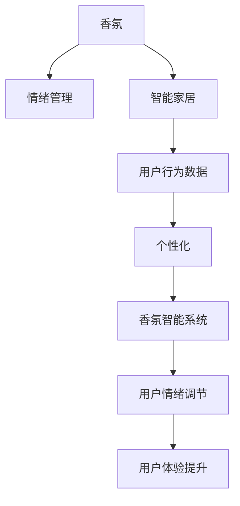

                 

## 1. 背景介绍

### 1.1 问题由来

智能家居领域正迅速成长为人工智能和物联网技术的融合热点，而香氛创业，作为智能家居中的一个小而美的新兴赛道，结合了艺术与科技，不仅提升了家居生活品质，还能通过个性化的香气体验，为人们带来更为深层的情感连接和情绪管理。随着人们对于生活品质的追求不断提升，香氛在智能家居中的作用日益重要，其市场潜力不可限量。

### 1.2 问题核心关键点

香氛创业的核心在于利用嗅觉这一强有力的情感通道，将香气与情绪管理相结合。用户通过香氛产品可以感受到不同的情绪调节效果，而香氛智能系统则通过数据分析，动态调整香氛输出，实现个性化的情绪支持。

香氛创业面临的主要挑战包括：
- 如何精准捕捉用户的情绪状态。
- 如何设计高效的香氛智能系统。
- 如何评估香氛对情绪的影响。

### 1.3 问题研究意义

香氛创业能够深刻影响用户的情绪和心理健康，通过个性化香氛体验，可有效提升居家环境的舒适度，帮助用户缓解压力，改善睡眠质量，增进人际关系。其研究意义在于：

- 提供新的智能家居应用场景，丰富用户体验。
- 为情绪管理领域探索出新的技术手段，推动相关产业发展。
- 促进心理健康研究与技术应用的结合，助力精神健康事业。

## 2. 核心概念与联系

### 2.1 核心概念概述

香氛创业涉及以下几个关键概念：

- **香氛（Aromatherapy）**：利用香精油、香料等植物精华，通过吸入、按摩等方式刺激人体感官，达到调节情绪、促进健康的效果。
- **情绪管理（Emotion Management）**：通过各种方法（如心理咨询、运动、香氛等）调节和控制个体的情绪反应，提升心理健康水平。
- **智能家居（Smart Home）**：利用人工智能和物联网技术，实现家居环境的智能化和自动化，提高用户的生活质量。
- **用户行为数据（User Behavior Data）**：记录用户的日常活动、偏好、情感状态等信息，为香氛智能系统的设计提供数据基础。
- **个性化（Personalization）**：根据用户的特定需求和偏好，定制化和动态调整香氛体验。

这些概念间的逻辑关系可以通过以下Mermaid流程图来展示：



这个流程图展示了香氛创业的核心概念及其相互关系：香氛通过情绪管理影响用户心理健康；智能家居为香氛提供了技术支撑；用户行为数据为香氛智能系统的个性化设计提供了依据；而香氛智能系统则通过个性化香氛输出，实现用户情绪的动态调节，提升用户体验。

## 3. 核心算法原理 & 具体操作步骤

### 3.1 算法原理概述

香氛智能系统通过数据驱动的方式，根据用户的行为和情绪状态，动态调整香氛的浓度、成分和时长，以达到最佳的香氛体验效果。具体而言，香氛智能系统包含以下几个关键步骤：

1. **数据收集**：通过智能家居设备和传感器，收集用户的行为数据、环境数据、香氛使用数据等。
2. **情绪识别**：利用机器学习算法，从用户的语音、动作、情感表达等多模态数据中识别用户的情绪状态。
3. **香氛推荐**：基于情绪识别结果，推荐适合当前情绪状态的香氛组合。
4. **香氛输出**：根据推荐结果，动态调整香氛系统，输出适合当前情绪的香气。
5. **效果评估**：对香氛对情绪的调节效果进行评估，持续优化香氛推荐算法。

### 3.2 算法步骤详解

**Step 1: 数据收集**

香氛智能系统的数据收集主要依赖以下几种方式：

- **传感器数据**：利用智能家居中的温度、湿度、光线等传感器，收集环境数据。
- **生物识别数据**：通过摄像头、麦克风等设备，捕捉用户的面部表情、语音情感等信息。
- **行为数据**：记录用户的活动轨迹、使用习惯等行为数据，分析用户状态。

数据收集完成后，需要将数据进行预处理，包括数据清洗、去重、特征提取等步骤，以获得高质量的输入数据。

**Step 2: 情绪识别**

情绪识别算法通过多模态融合的方式，综合用户的面部表情、语音情感、动作姿态等多源数据，使用机器学习模型识别用户的情绪状态。

- **面部表情识别**：通过卷积神经网络（CNN）模型，对用户面部表情进行分类。
- **语音情感识别**：利用循环神经网络（RNN）或Transformer模型，对用户的语音进行情感分析。
- **动作姿态识别**：通过时序数据分类算法，识别用户的动作姿态。

**Step 3: 香氛推荐**

香氛推荐算法根据情绪识别结果，推荐适合的香氛组合。推荐算法可以使用协同过滤、基于规则的推荐、基于内容的推荐等多种方式。

- **协同过滤**：基于用户的香氛使用历史和相似用户的推荐记录，推荐类似香氛组合。
- **基于规则的推荐**：根据不同情绪状态，推荐特定的香氛组合。
- **基于内容的推荐**：根据香氛成分和情绪状态的相关性，推荐匹配度高的香氛组合。

**Step 4: 香氛输出**

香氛输出系统根据香氛推荐结果，动态调整香氛系统的浓度、成分和时长，实现香氛的个性化输出。

- **香氛浓度控制**：通过调节香氛瓶的电热元件或超声波发生器，控制香氛的浓度。
- **香氛成分调配**：根据香氛推荐结果，调配特定成分的香氛油，并进行混合。
- **香氛时长控制**：根据香氛推荐结果，动态调整香氛输出的时长。

**Step 5: 效果评估**

香氛对情绪的调节效果需要通过实验评估来验证。实验可以采用双盲设计，随机选取用户，并记录香氛使用前后的情绪变化情况，评估香氛对用户情绪的调节效果。

- **情绪问卷调查**：通过问卷调查的方式，评估香氛对用户情绪的影响。
- **生理指标监测**：通过心率、血压等生理指标监测，评估香氛对用户生理状态的影响。
- **行为数据分析**：通过用户行为数据的分析，评估香氛对用户行为模式的影响。

### 3.3 算法优缺点

香氛智能系统的算法具有以下优点：

- **数据驱动**：通过收集和分析用户数据，实现香氛的个性化输出。
- **实时响应**：能够实时监测用户情绪，动态调整香氛输出，提升用户体验。
- **效果可评估**：通过科学实验，评估香氛对情绪的调节效果，持续优化算法。

同时，该算法也存在一些缺点：

- **数据隐私问题**：需要收集大量的用户数据，涉及隐私保护和数据安全问题。
- **算法复杂度**：多模态数据的融合和情绪识别的复杂性，对算法的要求较高。
- **用户行为多样性**：不同用户的情绪和偏好差异较大，个性化推荐难度高。

### 3.4 算法应用领域

香氛智能系统在智能家居、医疗健康、心理咨询等多个领域具有广泛的应用前景：

- **智能家居**：通过香氛调节室内氛围，提升居住舒适度，改善睡眠环境。
- **医疗健康**：利用香氛辅助心理治疗，缓解患者焦虑和抑郁情绪。
- **心理咨询**：结合香氛和心理咨询，为情绪障碍用户提供综合支持。

## 4. 数学模型和公式 & 详细讲解  
### 4.1 数学模型构建

香氛智能系统的核心数学模型包括：

- **用户行为数据建模**：通过时序数据建模方法，对用户行为进行建模。
- **情绪识别模型**：利用机器学习算法，建立面部表情、语音情感、动作姿态与情绪状态之间的关系模型。
- **香氛推荐模型**：基于协同过滤、基于规则、基于内容等多种推荐算法，建立香氛推荐模型。

### 4.2 公式推导过程

**用户行为数据建模**：

- 假设用户行为数据为时序序列 $X_t=\{x_1, x_2, ..., x_t\}$，其中 $x_t$ 表示第 $t$ 时刻的用户行为状态。
- 使用LSTM模型对用户行为数据进行建模，公式为：
  $$
  h_t = LSTM(x_t, h_{t-1})
  $$
  其中 $h_t$ 表示第 $t$ 时刻的隐状态，$h_{t-1}$ 表示前一时刻的隐状态。

**情绪识别模型**：

- 假设面部表情数据为 $F_t=\{f_1, f_2, ..., f_t\}$，语音情感数据为 $V_t=\{v_1, v_2, ..., v_t\}$，动作姿态数据为 $A_t=\{a_1, a_2, ..., a_t\}$。
- 使用卷积神经网络（CNN）对面部表情数据进行分类，公式为：
  $$
  \hat{e}_{f_t} = CNN(F_t, W_{f_t}, b_{f_t})
  $$
  其中 $\hat{e}_{f_t}$ 表示第 $t$ 时刻面部表情的情绪类别，$W_{f_t}$ 和 $b_{f_t}$ 为CNN的参数。
- 使用循环神经网络（RNN）或Transformer模型对语音情感数据进行情感分析，公式为：
  $$
  \hat{e}_{v_t} = RNN(V_t, W_{v_t}, b_{v_t})
  $$
  或
  $$
  \hat{e}_{v_t} = Transformer(V_t, W_{v_t}, b_{v_t})
  $$
  其中 $\hat{e}_{v_t}$ 表示第 $t$ 时刻语音情感的情绪类别。
- 使用时序数据分类算法对动作姿态数据进行识别，公式为：
  $$
  \hat{e}_{a_t} = TimeSeries(A_t, W_{a_t}, b_{a_t})
  $$
  其中 $\hat{e}_{a_t}$ 表示第 $t$ 时刻动作姿态的情绪类别。

**香氛推荐模型**：

- 假设香氛组合为 $S_t=\{s_1, s_2, ..., s_t\}$，情绪状态为 $E_t=\{e_1, e_2, ..., e_t\}$。
- 使用协同过滤算法，推荐香氛组合 $s_t$，公式为：
  $$
  s_t = CF(X_{t-1}, E_{t-1}, S_{t-1}, \theta_{CF})
  $$
  其中 $\theta_{CF}$ 为协同过滤算法的参数。
- 使用基于规则的推荐算法，根据情绪状态 $E_t$，推荐香氛组合 $s_t$，公式为：
  $$
  s_t = RuleBased(E_t, \theta_{RuleBased})
  $$
  其中 $\theta_{RuleBased}$ 为基于规则的推荐算法的参数。
- 使用基于内容的推荐算法，根据香氛成分和情绪状态的相关性，推荐香氛组合 $s_t$，公式为：
  $$
  s_t = ContentBased(E_t, S_t, \theta_{ContentBased})
  $$
  其中 $\theta_{ContentBased}$ 为基于内容的推荐算法的参数。

### 4.3 案例分析与讲解

以某智能家居用户的香氛体验为例，分析香氛智能系统的应用过程：

1. **数据收集**：
   - 用户在家中使用智能传感器，记录房间温度、湿度、光线等环境数据。
   - 通过智能摄像头捕捉用户的面部表情，通过麦克风捕捉用户的语音情感，通过智能家居设备记录用户的活动轨迹。

2. **情绪识别**：
   - 对用户的面部表情数据进行预处理，使用CNN模型识别用户的面部表情情绪类别。
   - 对用户的语音情感数据进行预处理，使用RNN模型或Transformer模型识别用户的语音情感情绪类别。
   - 对用户的活动轨迹数据进行预处理，使用时序数据分类算法识别用户的动作姿态情绪类别。

3. **香氛推荐**：
   - 综合用户的面部表情情绪、语音情感情绪和动作姿态情绪，使用多模态融合算法，得到用户的当前情绪状态。
   - 根据用户当前情绪状态，使用协同过滤算法推荐香氛组合。

4. **香氛输出**：
   - 根据香氛推荐结果，动态调整香氛系统的浓度、成分和时长。
   - 在用户卧室播放推荐香氛，帮助用户放松心情，提升睡眠质量。

5. **效果评估**：
   - 通过用户填写的情绪问卷调查，评估香氛对用户情绪的调节效果。
   - 通过智能家居设备记录的用户生理指标数据，评估香氛对用户生理状态的影响。
   - 通过智能家居设备记录的用户行为数据，评估香氛对用户行为模式的影响。

## 5. 项目实践：代码实例和详细解释说明

### 5.1 开发环境搭建

香氛智能系统的开发环境搭建步骤如下：

1. 安装Python环境：使用Anaconda创建虚拟环境，安装Python。
2. 安装相关库：安装TensorFlow、PyTorch、OpenCV等深度学习库和计算机视觉库。
3. 安装硬件设备：安装智能家居设备和传感器，如智能摄像头、麦克风、传感器等。

### 5.2 源代码详细实现

以下是一个简单的香氛智能系统代码实现：

```python
import tensorflow as tf
import torch
import cv2
import numpy as np

# 数据预处理函数
def preprocess_data(data):
    # 对数据进行清洗、去重、特征提取等预处理操作
    return processed_data

# 面部表情识别函数
def facial_expression_recognition(data):
    # 使用CNN模型对面部表情进行分类
    return emotion_classification

# 语音情感识别函数
def voice_emotion_recognition(data):
    # 使用RNN或Transformer模型对语音情感进行分类
    return emotion_classification

# 动作姿态识别函数
def body_position_recognition(data):
    # 使用时序数据分类算法对动作姿态进行识别
    return emotion_classification

# 香氛推荐函数
def fragrance_recommendation(emotion):
    # 使用协同过滤算法推荐香氛组合
    return fragrance_recommendation

# 香氛输出函数
def fragrance_output(fragrance, duration):
    # 动态调整香氛系统的浓度、成分和时长
    # 播放推荐香氛
    pass

# 主函数
def main():
    # 数据收集
    sensors = ...
    camera = ...
    microphone = ...

    # 数据预处理
    processed_sensors_data = preprocess_data(sensors)
    processed_camera_data = preprocess_data(camera)
    processed_microphone_data = preprocess_data(microphone)

    # 情绪识别
    facial_emotion = facial_expression_recognition(processed_camera_data)
    voice_emotion = voice_emotion_recognition(processed_microphone_data)
    body_position = body_position_recognition(processed_sensors_data)

    # 综合情绪识别结果
    combined_emotion = combine_emotions(facial_emotion, voice_emotion, body_position)

    # 香氛推荐
    recommended_fragrance = fragrance_recommendation(combined_emotion)

    # 香氛输出
    fragrance_output(recommended_fragrance, duration)

if __name__ == '__main__':
    main()
```

### 5.3 代码解读与分析

上述代码实现了香氛智能系统的主要功能：数据收集、预处理、情绪识别、香氛推荐和香氛输出。具体分析如下：

- **数据收集**：通过智能传感器、摄像头和麦克风等硬件设备，收集用户的各项数据。
- **数据预处理**：对收集的数据进行清洗、去重、特征提取等预处理操作，以获得高质量的输入数据。
- **情绪识别**：利用CNN、RNN或Transformer等模型，对用户的面部表情、语音情感和动作姿态进行情绪识别，输出情绪类别。
- **香氛推荐**：使用协同过滤、基于规则或基于内容的推荐算法，根据用户当前情绪状态，推荐适合的香氛组合。
- **香氛输出**：动态调整香氛系统的浓度、成分和时长，播放推荐香氛，实现香氛的个性化输出。

### 5.4 运行结果展示

香氛智能系统的运行结果可以通过以下几个指标来评估：

- **情绪识别准确率**：评估情绪识别的准确率，指标为情绪识别分类器的准确率。
- **香氛推荐精度**：评估香氛推荐的准确性，指标为用户对推荐香氛的满意度。
- **香氛调节效果**：评估香氛对用户情绪的调节效果，指标为用户情绪问卷调查结果。

通过这些指标，可以全面评估香氛智能系统的性能，并进行持续优化。

## 6. 实际应用场景

### 6.1 智能家居系统

香氛智能系统在智能家居中的应用，可以显著提升居住环境的舒适度和个性化体验。例如：

- **卧室香氛系统**：根据用户睡前情绪状态，推荐放松香氛，帮助用户入睡。
- **客厅香氛系统**：根据用户活动轨迹和情绪状态，动态调整香氛浓度，提升客厅氛围。
- **浴室香氛系统**：根据用户的淋浴和休息时间，推荐适合的香氛组合，提升沐浴体验。

### 6.2 医疗健康系统

香氛智能系统在医疗健康中的应用，可以为患者提供个性化的心理支持和治疗辅助。例如：

- **心理治疗辅助**：利用香氛缓解患者的焦虑和抑郁情绪，辅助心理治疗。
- **康复护理**：在康复病房内，利用香氛辅助患者的情绪调节和恢复。

### 6.3 心理咨询系统

香氛智能系统在心理咨询中的应用，可以为情绪障碍用户提供综合支持。例如：

- **情绪调节**：通过香氛调节用户的情绪，配合心理咨询，提升用户心理健康水平。
- **行为干预**：通过香氛改变用户的行为模式，辅助心理咨询效果。

## 7. 工具和资源推荐

### 7.1 学习资源推荐

为了帮助开发者掌握香氛智能系统的核心技术，推荐以下学习资源：

1. **《深度学习》课程**：斯坦福大学开设的深度学习课程，涵盖深度学习的基础知识和经典模型。
2. **《机器学习实战》书籍**：介绍机器学习算法及其实现，涵盖数据预处理、模型训练等关键环节。
3. **OpenAI《自监督学习与香氛智能》**：介绍自监督学习在香氛智能中的应用，探讨香氛对情绪的调节效果。

### 7.2 开发工具推荐

香氛智能系统的开发工具包括：

1. **Python**：使用Python编写算法和模型训练代码，兼容性好，易于调试。
2. **TensorFlow**：深度学习框架，提供强大的计算图和分布式训练支持。
3. **PyTorch**：深度学习框架，支持动态计算图和便捷的模型训练。
4. **OpenCV**：计算机视觉库，用于面部表情识别和图像处理。

### 7.3 相关论文推荐

香氛智能系统的研究涉及多个领域，以下推荐几篇相关论文：

1. **《基于深度学习的人脸表情识别研究》**：探讨使用深度学习模型进行面部表情识别的算法和应用。
2. **《多模态情绪识别研究》**：介绍多模态情绪识别的算法和模型，评估香氛对情绪的调节效果。
3. **《智能家居中的香氛系统》**：探讨香氛系统在智能家居中的应用和设计，评估香氛对用户情绪的调节效果。

## 8. 总结：未来发展趋势与挑战

### 8.1 研究成果总结

香氛智能系统通过数据驱动的方式，实现了香氛的个性化输出，提升了用户体验和心理健康水平。其核心技术包括用户行为数据建模、情绪识别、香氛推荐和香氛输出。香氛智能系统在智能家居、医疗健康和心理咨询等多个领域具有广泛的应用前景。

### 8.2 未来发展趋势

香氛智能系统未来的发展趋势包括：

1. **多模态融合**：融合面部表情、语音情感、动作姿态等多种数据源，提升情绪识别的准确性。
2. **个性化推荐**：利用用户的历史数据和行为模式，实现更加精准的香氛推荐。
3. **实时反馈**：通过实时监测和反馈，动态调整香氛输出，提升用户体验。
4. **跨领域应用**：拓展香氛智能系统在教育、工业等领域的应用。

### 8.3 面临的挑战

香氛智能系统在发展过程中面临以下挑战：

1. **数据隐私问题**：需要收集和分析大量用户数据，涉及隐私保护和数据安全问题。
2. **算法复杂度**：多模态数据的融合和情绪识别的复杂性，对算法的要求较高。
3. **用户行为多样性**：不同用户的情绪和偏好差异较大，个性化推荐难度高。
4. **环境适应性**：香氛智能系统在不同环境下的表现需要进一步优化。

### 8.4 研究展望

香氛智能系统的未来研究可以从以下几个方向进行探索：

1. **深度学习模型**：探索更先进的深度学习模型，提升香氛智能系统的识别和推荐精度。
2. **多模态数据融合**：研究多模态数据的融合方法，提升香氛智能系统的综合性能。
3. **跨领域应用**：研究香氛智能系统在更多领域的应用，如工业、教育等。
4. **安全性与隐私保护**：研究香氛智能系统的安全性与隐私保护问题，确保用户数据安全。

总之，香氛智能系统具有广阔的发展前景和应用价值，通过不断的技术创新和实践优化，必将成为智能家居和情绪管理领域的重要技术手段。

## 9. 附录：常见问题与解答

### Q1: 香氛智能系统的算法是否适用于所有用户？

A: 香氛智能系统的算法需要大量的用户数据进行训练和优化，不同用户的行为和情绪状态差异较大，因此需要根据不同用户的个性化需求进行优化和调整。

### Q2: 香氛智能系统如何处理数据隐私问题？

A: 香氛智能系统需要收集用户的面部表情、语音情感和动作姿态等多源数据，涉及用户隐私保护和数据安全问题。可以通过数据匿名化、加密存储、用户授权等方式，保障数据隐私安全。

### Q3: 香氛智能系统的推荐算法是否固定？

A: 香氛智能系统的推荐算法可以根据不同的应用场景和用户需求进行优化和调整，例如使用协同过滤、基于规则、基于内容的推荐算法等。

### Q4: 香氛智能系统如何提高实时响应速度？

A: 香氛智能系统可以通过优化模型结构和算法、使用分布式训练、优化数据流等方法，提高实时响应速度。

### Q5: 香氛智能系统的算法是否能够扩展到其他应用领域？

A: 香氛智能系统的核心算法包括数据建模、情绪识别和香氛推荐，可以应用于多个领域，如智能家居、医疗健康、心理咨询等，通过适配不同的数据和任务，实现跨领域应用。

通过系统学习和实践香氛智能系统的核心技术，相信您能深入理解其工作原理和优化方法，为香氛创业提供坚实的技术支持。

---

作者：禅与计算机程序设计艺术 / Zen and the Art of Computer Programming

