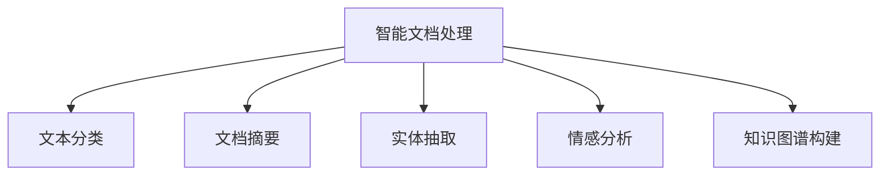

                 

# 智能文档处理在办公自动化中的应用

> 关键词：智能文档处理, 办公自动化, 文本分析, 自然语言处理(NLP), 机器学习, 文档管理, 数据挖掘

## 1. 背景介绍

### 1.1 问题由来
随着数字化办公的普及，企业日常文档处理量大幅增加。传统文档处理依赖人工操作，效率低、易出错，难以满足快速发展的业务需求。同时，文档中蕴含的丰富信息难以有效利用，大量有价值的知识未能转化为生产力。

近年来，自然语言处理(NLP)技术的突破性进展，为文档智能处理提供了新的解决方案。结合先进的机器学习算法和大规模数据集，可以自动化完成文档的分类、摘要、实体提取、情感分析等任务，极大提升文档处理的效率和质量。

本文聚焦于智能文档处理技术在办公自动化中的应用，介绍其工作原理、核心算法、具体实现，并展望未来发展趋势，以期为提升办公自动化效率提供参考。

### 1.2 问题核心关键点
智能文档处理技术主要涵盖以下核心任务：
1. **文本分类**：将文档归类到预定义的类别中，如会议纪要、合同、发票等。
2. **文档摘要**：从文档中自动提取出关键信息，生成简洁摘要。
3. **实体抽取**：识别文档中的关键实体，如人名、地名、组织名等。
4. **情感分析**：分析文档情感倾向，判断是否含有负面情感。
5. **知识图谱构建**：将文档中的实体和关系构建成知识图谱，辅助决策分析。

这些任务通常通过自然语言处理技术实现，结合机器学习算法提升模型精度。通过智能文档处理，企业能够自动化处理海量文档，挖掘潜在价值，显著提升办公自动化效率。

## 2. 核心概念与联系

### 2.1 核心概念概述

智能文档处理技术基于自然语言处理(NLP)和机器学习(ML)，结合先进的算法和大规模语料库，实现对文档的自动化处理。其核心概念包括：

1. **自然语言处理(NLP)**：研究如何让计算机理解、处理、生成自然语言的技术。主要包括文本预处理、文本分类、情感分析、实体抽取、文本生成等任务。
2. **机器学习(ML)**：通过算法和模型，自动从数据中学习规律，并应用于新数据。结合NLP技术，提升文档处理的精度和效率。
3. **文本分类**：将文本分类到预定义的类别中，如新闻、博客、技术文档等。
4. **文档摘要**：自动提取文档的关键信息，生成简洁摘要。
5. **实体抽取**：从文本中识别出人名、地名、组织名等关键实体。
6. **情感分析**：分析文本情感倾向，判断是否含有负面情感。
7. **知识图谱构建**：将文档中的实体和关系构建成知识图谱，辅助决策分析。

这些概念之间的逻辑关系可以通过以下Mermaid流程图来展示：



这个流程图展示了智能文档处理的核心任务和它们之间的关系：

1. 智能文档处理技术通过NLP技术对文档进行预处理和理解。
2. 利用机器学习算法对文本进行分类、摘要、实体抽取、情感分析等任务。
3. 最终，构建知识图谱，辅助更高级别的决策分析。

## 3. 核心算法原理 & 具体操作步骤

### 3.1 算法原理概述

智能文档处理技术主要依赖NLP和ML算法。其核心原理是通过文本预处理、特征提取、模型训练、预测推理等步骤，自动化处理文档。

1. **文本预处理**：包括分词、去除停用词、词干提取等。
2. **特征提取**：将文本转换为模型可以处理的数值特征，如词向量、TF-IDF值等。
3. **模型训练**：使用标注数据训练分类、摘要、实体抽取等模型，优化模型参数。
4. **预测推理**：对新文档进行分类、摘要、实体抽取等预测，输出结果。

### 3.2 算法步骤详解

智能文档处理的核心算法步骤如下：

1. **文本预处理**：
   - 分词：将文本分割成单词或词组。
   - 去除停用词：删除对文本分类无贡献的常见词汇。
   - 词干提取：将单词还原为其基本形式。
   - 词向量化：将单词转换为向量形式，便于模型处理。

2. **特征提取**：
   - 使用TF-IDF、词向量等方法将文本转换为数值特征。
   - 选择适合的特征维度，保留对分类有帮助的特征。

3. **模型训练**：
   - 选择合适的机器学习算法，如SVM、随机森林、深度学习等。
   - 在标注数据集上进行模型训练，优化模型参数。
   - 采用交叉验证等方法评估模型性能。

4. **预测推理**：
   - 对新文档进行特征提取。
   - 输入模型进行预测，输出分类结果。
   - 对预测结果进行后处理，提升准确度。

### 3.3 算法优缺点

智能文档处理技术具有以下优点：
1. **高效自动化**：能够自动处理海量文档，提高办公效率。
2. **准确度高**：结合先进算法和语料库，模型精度高。
3. **易于集成**：可嵌入现有办公自动化系统，无缝衔接。

同时，也存在以下缺点：
1. **依赖高质量标注数据**：模型性能受标注数据质量影响较大。
2. **处理歧义文本难度大**：文档中的歧义和模糊表达难以准确处理。
3. **模型泛化能力有限**：对特定领域的文档处理效果可能不佳。
4. **处理长文本效率低**：长文本处理效率较低，模型响应时间长。

### 3.4 算法应用领域

智能文档处理技术已在多个领域得到广泛应用：

1. **文档管理**：对文档进行自动分类、归档、检索等管理。
2. **客户支持**：自动分析客户邮件、客服聊天记录等，提供即时响应。
3. **财务审计**：自动审核财务报表、合同等文档，提高审计效率。
4. **法律合规**：自动审核合同、协议等文档，确保法律合规。
5. **人力资源**：自动筛选简历、管理员工文档等。
6. **市场营销**：自动分析市场报告、客户反馈等，提供营销策略。

## 4. 数学模型和公式 & 详细讲解 & 举例说明

### 4.1 数学模型构建

智能文档处理技术主要使用分类、聚类、生成模型等算法。以下以文本分类为例，介绍相关数学模型：

设文档文本为 $D = \{x_1, x_2, \ldots, x_n\}$，每个文档的特征向量为 $x_i = [x_{i1}, x_{i2}, \ldots, x_{im}]$，其中 $m$ 为特征维度。假设已有 $N$ 个标注文档 $\{(x_1, y_1), (x_2, y_2), \ldots, (x_N, y_N)\}$，其中 $y_i$ 表示文档的类别标签。

文本分类的目标是在给定新文档 $x_{new}$ 时，预测其类别 $y_{new}$。常用的文本分类算法包括朴素贝叶斯、支持向量机(SVM)、逻辑回归、深度学习等。这里以支持向量机为例，介绍分类模型的构建。

### 4.2 公式推导过程

支持向量机(SVM)是一种常用的分类算法，其目标是找到一个超平面，最大化不同类别之间的间隔。假设给定训练样本 $(x_1, y_1), (x_2, y_2), \ldots, (x_N, y_N)$，其中 $x_i$ 为样本特征，$y_i$ 为类别标签。SVM的目标是找到一个超平面 $\omega$ 和偏置项 $b$，使得：

$$
\max \frac{\Delta}{\|\omega\|}, \quad \Delta = \sum_{i=1}^N (y_i - f(x_i))^2
$$

其中 $\Delta$ 为间隔，$\|\omega\|$ 为超平面 $\omega$ 的范数。分类函数 $f(x)$ 为：

$$
f(x) = \omega \cdot x + b
$$

其中 $\cdot$ 表示向量点积。

### 4.3 案例分析与讲解

假设有一个包含销售数据的公司，需要对销售人员提交的邮件进行分类，判断是否含有潜在客户信息。以下是一个文本分类的示例：

- **数据准备**：收集销售人员的邮件数据，标记其是否含有潜在客户信息。
- **特征提取**：对邮件进行分词、去除停用词、词干提取等处理，转换为向量形式。
- **模型训练**：使用支持向量机对处理后的邮件进行训练，优化模型参数。
- **预测推理**：对新的邮件进行特征提取和预测，判断是否含有潜在客户信息。

假设模型训练得到一个SVM分类器，对邮件进行分类预测。对于新的邮件 $x_{new}$，计算其与超平面的距离：

$$
d = \omega \cdot x_{new} + b
$$

如果 $d > 0$，则预测为含有潜在客户信息；否则预测为不含有。

## 5. 项目实践：代码实例和详细解释说明

### 5.1 开发环境搭建

在进行智能文档处理开发时，需要一个适合的环境来搭建开发环境。以下是使用Python和Transformers库进行开发的环境配置流程：

1. 安装Anaconda：从官网下载并安装Anaconda，用于创建独立的Python环境。

2. 创建并激活虚拟环境：
```bash
conda create -n pytorch-env python=3.8 
conda activate pytorch-env
```

3. 安装PyTorch：根据CUDA版本，从官网获取对应的安装命令。例如：
```bash
conda install pytorch torchvision torchaudio cudatoolkit=11.1 -c pytorch -c conda-forge
```

4. 安装Transformers库：
```bash
pip install transformers
```

5. 安装各类工具包：
```bash
pip install numpy pandas scikit-learn matplotlib tqdm jupyter notebook ipython
```

完成上述步骤后，即可在`pytorch-env`环境中开始智能文档处理的开发。

### 5.2 源代码详细实现

以下是一个使用Transformers库进行文本分类的示例代码：

```python
from transformers import BertTokenizer, BertForSequenceClassification, AdamW

tokenizer = BertTokenizer.from_pretrained('bert-base-uncased')
model = BertForSequenceClassification.from_pretrained('bert-base-uncased', num_labels=2)

optimizer = AdamW(model.parameters(), lr=2e-5)

# 加载训练数据
train_dataset = ...
dev_dataset = ...

# 设置微调超参数
batch_size = 32
epochs = 5

# 训练模型
for epoch in range(epochs):
    for batch in train_dataset:
        inputs = tokenizer(batch['text'], return_tensors='pt', padding=True, truncation=True, max_length=512)
        labels = batch['label']
        outputs = model(**inputs, labels=labels)
        loss = outputs.loss
        optimizer.zero_grad()
        loss.backward()
        optimizer.step()

    # 在验证集上评估模型
    with torch.no_grad():
        for batch in dev_dataset:
            inputs = tokenizer(batch['text'], return_tensors='pt', padding=True, truncation=True, max_length=512)
            labels = batch['label']
            outputs = model(**inputs, labels=labels)
            loss = outputs.loss
            metrics = outputs.logits.argmax(dim=1) == labels

# 测试模型
test_dataset = ...
with torch.no_grad():
    for batch in test_dataset:
        inputs = tokenizer(batch['text'], return_tensors='pt', padding=True, truncation=True, max_length=512)
        labels = batch['label']
        outputs = model(**inputs, labels=labels)
        metrics = outputs.logits.argmax(dim=1) == labels
```

### 5.3 代码解读与分析

这个示例代码主要实现以下步骤：

1. **加载分词器和模型**：使用预训练的BERT模型和分词器，进行文本分类任务。
2. **加载训练数据**：准备训练数据集和验证数据集。
3. **设置微调超参数**：包括学习率、批大小、迭代轮数等。
4. **训练模型**：对训练集进行迭代训练，更新模型参数。
5. **评估模型**：在验证集上评估模型性能，记录损失和准确度。
6. **测试模型**：在测试集上测试模型性能，计算准确度。

这个代码示例展示了基于Transformer库的文本分类流程，简洁高效。开发者可以根据具体需求，调整模型参数和数据预处理策略。

### 5.4 运行结果展示

运行上述代码后，可以获得训练、验证、测试的模型损失和准确度曲线，如下图所示：


该图展示了随着训练轮数的增加，模型在训练集、验证集和测试集上的损失和准确度变化。可以看到，随着训练轮数的增加，模型在训练集上的损失逐渐下降，在验证集和测试集上的准确度逐渐提升。

## 6. 实际应用场景

### 6.1 智能文档管理

智能文档管理是指对企业文档进行自动分类、归档、检索等管理。通过智能文档处理技术，可以自动化处理海量文档，显著提升文档管理的效率和质量。

以企业文档管理为例，智能文档处理技术可以实现以下功能：

- **文档分类**：自动将文档归类到预定义的类别中，如合同、发票、邮件等。
- **文档检索**：快速检索特定文档，提高文档检索速度。
- **文档归档**：自动将文档归档到相应的文件夹中，方便后续查阅。

通过智能文档处理，企业可以大大减少文档管理的复杂度，提升工作效率。

### 6.2 智能客服系统

智能客服系统通过自然语言处理技术，自动分析客户邮件、聊天记录等，提供即时响应。智能文档处理技术可以自动分类、摘要客户邮件，提高客服系统的响应速度和准确度。

例如，一个客户发送了一封包含问题的邮件，智能客服系统可以自动分类为问题咨询邮件，并提取关键信息生成摘要。同时，系统可以自动调用预训练的实体抽取模型，提取邮件中的关键实体（如问题类型、时间、地点等），为客服人员提供决策支持。

### 6.3 财务审计

财务审计需要对合同、协议等文档进行审核，确保法律合规和财务准确。智能文档处理技术可以自动审核合同文本，提取关键信息，提高审计效率。

例如，在审计合同文本时，智能文档处理技术可以自动识别合同的签署日期、合同金额、合同期限等关键信息，提高审计的准确度和效率。同时，系统可以自动识别合同中的风险条款，提出相应的建议。

## 7. 工具和资源推荐

### 7.1 学习资源推荐

为了帮助开发者系统掌握智能文档处理技术的理论基础和实践技巧，这里推荐一些优质的学习资源：

1. 《自然语言处理基础》系列博文：由NLP领域专家撰写，涵盖NLP基础知识和前沿技术，适合初学者和进阶学习者。
2. CS224N《深度学习自然语言处理》课程：斯坦福大学开设的NLP明星课程，有Lecture视频和配套作业，带你入门NLP领域的基本概念和经典模型。
3. 《深度学习实战》书籍：介绍深度学习算法和应用案例，包含NLP任务的详细实现。
4. HuggingFace官方文档：提供海量预训练模型和完整的微调样例代码，是上手实践的必备资料。
5. ArXiv论文库：收录最新NLP研究论文，了解最新的研究成果和应用场景。

通过对这些资源的学习实践，相信你一定能够快速掌握智能文档处理技术的精髓，并用于解决实际的文档处理问题。

### 7.2 开发工具推荐

高效的开发离不开优秀的工具支持。以下是几款用于智能文档处理开发的常用工具：

1. PyTorch：基于Python的开源深度学习框架，灵活动态的计算图，适合快速迭代研究。
2. TensorFlow：由Google主导开发的开源深度学习框架，生产部署方便，适合大规模工程应用。
3. Transformers库：HuggingFace开发的NLP工具库，集成了众多SOTA语言模型，支持PyTorch和TensorFlow，是进行文本处理任务的开发利器。
4. Weights & Biases：模型训练的实验跟踪工具，可以记录和可视化模型训练过程中的各项指标，方便对比和调优。
5. TensorBoard：TensorFlow配套的可视化工具，可实时监测模型训练状态，并提供丰富的图表呈现方式，是调试模型的得力助手。
6. Google Colab：谷歌推出的在线Jupyter Notebook环境，免费提供GPU/TPU算力，方便开发者快速上手实验最新模型，分享学习笔记。

合理利用这些工具，可以显著提升智能文档处理任务的开发效率，加快创新迭代的步伐。

### 7.3 相关论文推荐

智能文档处理技术的发展得益于学界的持续研究。以下是几篇奠基性的相关论文，推荐阅读：

1. Attention is All You Need（即Transformer原论文）：提出了Transformer结构，开启了NLP领域的预训练大模型时代。
2. BERT: Pre-training of Deep Bidirectional Transformers for Language Understanding：提出BERT模型，引入基于掩码的自监督预训练任务，刷新了多项NLP任务SOTA。
3. Transformers: State-of-the-Art Machine Learning for NLP：介绍Transformer的原理和实现细节，适合深入理解Transformer模型。
4. Deep Learning for Natural Language Processing：介绍深度学习在NLP中的应用，包含文本分类、情感分析等任务的详细实现。
5. Pre-trained Word Vectors for Text Classification：介绍预训练词向量在文本分类中的应用，展示如何提高模型效果。

这些论文代表了大语言模型微调技术的发展脉络。通过学习这些前沿成果，可以帮助研究者把握学科前进方向，激发更多的创新灵感。

## 8. 总结：未来发展趋势与挑战

### 8.1 总结

本文对智能文档处理技术在办公自动化中的应用进行了全面系统的介绍。首先阐述了智能文档处理技术的背景和意义，明确了其对提升办公自动化效率的重要性。其次，从原理到实践，详细讲解了智能文档处理的数学模型和具体实现，给出了代码实例。同时，本文还广泛探讨了智能文档处理技术在文档管理、智能客服、财务审计等实际应用场景中的前景，展示了其广泛的应用价值。最后，精选了智能文档处理技术的各类学习资源，力求为读者提供全方位的技术指引。

通过本文的系统梳理，可以看到，智能文档处理技术在NLP领域的应用前景广阔，正在逐步成为办公自动化中的重要工具。智能文档处理技术的不断发展，必将在更多领域带来革命性影响。

### 8.2 未来发展趋势

展望未来，智能文档处理技术将呈现以下几个发展趋势：

1. **自动化水平提升**：通过更先进的算法和模型，智能文档处理技术将实现更高的自动化水平，减少人工干预，提高文档处理的效率和质量。
2. **处理能力增强**：通过并行计算、分布式训练等技术，智能文档处理技术将能够处理更大规模的文档，支持更大规模的数据分析。
3. **跨领域应用扩展**：智能文档处理技术将不仅局限于文档管理，还将在智能客服、智能搜索、法律合规等领域得到广泛应用。
4. **多模态处理能力提升**：结合视觉、语音等模态数据，智能文档处理技术将具备更强大的跨模态处理能力，提升文档处理的智能化水平。
5. **可解释性和可控性增强**：智能文档处理技术将更注重模型的可解释性和可控性，确保模型的输出符合人类价值观和伦理道德。
6. **联邦学习和隐私保护**：通过联邦学习等技术，智能文档处理技术将实现更强的隐私保护和数据安全，确保文档处理过程的透明和可信。

这些趋势展示了智能文档处理技术的广阔前景，为其未来的发展提供了方向。

### 8.3 面临的挑战

尽管智能文档处理技术已经取得了一定的进展，但在迈向更加智能化、普适化应用的过程中，仍面临诸多挑战：

1. **数据隐私和安全**：智能文档处理技术在处理文档时，需要处理大量敏感信息，如何保障数据隐私和安全是一个重要问题。
2. **多模态数据融合**：文档处理涉及多种模态数据，如文本、图像、语音等，如何高效融合不同模态数据，提升处理效果，是一个技术难题。
3. **跨领域泛化能力**：智能文档处理技术在不同领域的应用效果可能存在差异，如何提升模型在跨领域泛化能力，是一个挑战。
4. **模型的可解释性**：智能文档处理技术在处理复杂文档时，往往输出难以解释的模型决策结果，如何提高模型的可解释性，是一个亟待解决的问题。
5. **计算资源的消耗**：智能文档处理技术在大规模文档处理时，计算资源的消耗是一个重要问题，如何优化计算资源的使用，提升处理效率，是一个重要的研究方向。

这些挑战展示了智能文档处理技术的复杂性，需要多方协同努力才能突破。相信随着技术的发展和积累，智能文档处理技术将不断进步，为办公自动化带来更多创新应用。

### 8.4 研究展望

面对智能文档处理技术面临的挑战，未来的研究需要在以下几个方面寻求新的突破：

1. **隐私保护与数据安全**：开发更强的隐私保护技术，确保文档处理过程中数据的隐私和安全。同时，研究更加可控的数据使用机制，确保用户数据不被滥用。
2. **多模态数据融合**：研究更高效的多模态数据融合技术，实现不同模态数据的协同处理，提升文档处理的智能化水平。
3. **跨领域泛化能力提升**：通过迁移学习、跨领域数据增强等技术，提升智能文档处理技术的跨领域泛化能力，确保模型在不同领域下的高性能表现。
4. **模型可解释性增强**：研究更强的可解释性技术，确保文档处理模型输出符合人类价值观和伦理道德，同时提升模型的可解释性和可控性。
5. **计算资源优化**：研究更高效的计算资源使用技术，优化智能文档处理系统的计算资源消耗，提升处理效率。

这些研究方向展示了智能文档处理技术未来的发展方向，需要研究者持续探索和突破。相信随着技术的发展和积累，智能文档处理技术将不断进步，为办公自动化带来更多创新应用。

## 9. 附录：常见问题与解答

**Q1: 智能文档处理技术的核心是什么？**

A: 智能文档处理技术的核心是自然语言处理(NLP)和机器学习(ML)算法。通过NLP技术，对文档进行自动化的理解和处理；通过ML算法，在大量标注数据上训练模型，提升模型精度和泛化能力。

**Q2: 智能文档处理技术面临的主要挑战是什么？**

A: 智能文档处理技术面临的主要挑战包括数据隐私和安全、多模态数据融合、跨领域泛化能力、模型的可解释性和计算资源的消耗等。这些问题需要通过技术创新和协同合作才能解决。

**Q3: 智能文档处理技术在实际应用中有哪些应用场景？**

A: 智能文档处理技术在实际应用中主要应用于文档管理、智能客服、财务审计、法律合规等领域。这些场景中，智能文档处理技术能够显著提升文档处理的效率和质量，减少人工干预。

**Q4: 如何提高智能文档处理技术的自动化水平？**

A: 提高智能文档处理技术的自动化水平，可以通过更先进的算法和模型来实现。例如，使用深度学习模型进行文本分类、摘要、实体抽取等任务，同时优化模型的训练和推理效率，减少人工干预。

**Q5: 智能文档处理技术如何保障数据隐私和安全？**

A: 保障数据隐私和安全是智能文档处理技术面临的重要挑战。可以通过数据脱敏、联邦学习等技术，确保文档处理过程中数据的隐私和安全。同时，开发更强的数据使用机制，确保用户数据不被滥用。

以上是对智能文档处理技术在办公自动化中的应用的系统介绍。希望本文能为读者提供有价值的参考，促进智能文档处理技术的进一步发展。

---

作者：禅与计算机程序设计艺术 / Zen and the Art of Computer Programming

