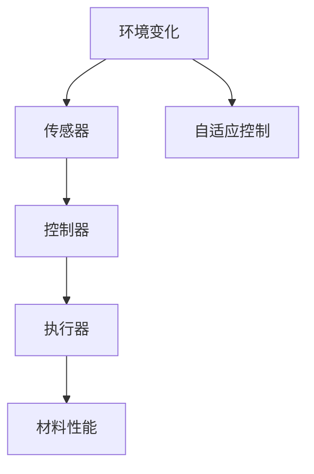
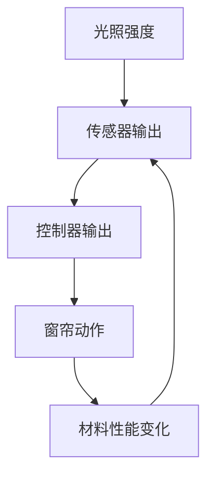

                 

# 智能材料在建筑领域的应用：自适应环境变化

## 1. 背景介绍

在当今世界，建筑领域正经历着一场深刻的变革。随着科技的进步和环保意识的增强，智能材料的应用成为了建筑行业的重要趋势。智能材料是指那些能够响应环境变化，并据此自动调整其性能的材料。这些材料能够实现自适应环境变化，从而提升建筑的安全性、舒适性和可持续性。本文将探讨智能材料在建筑领域的应用，特别是其自适应环境变化的能力。

## 2. 核心概念与联系

### 2.1 核心概念概述

智能材料是指那些能够感知环境变化（如温度、湿度、光、声音等），并据此自动调整其物理、化学或力学性能的材料。智能材料在建筑领域的应用，可以使得建筑结构更加自适应，减少能耗，提高舒适度和安全性。

智能材料的应用原理基于以下几个核心概念：

- **传感器技术**：智能材料内部集成传感器，能够感知环境变化。
- **响应机制**：智能材料根据感知到的环境变化，自动调整其性能。
- **执行器技术**：智能材料能够利用执行器来调整其性能，如改变形状、吸收或释放热量等。
- **自适应控制**：智能材料通过内部控制器，根据感知到的环境变化，自动调整其性能，实现自适应。

### 2.2 核心概念原理和架构的 Mermaid 流程图



这个流程图展示了智能材料的基本架构：环境变化通过传感器感知，控制器根据感知到的环境变化，控制执行器调整材料性能，最终实现材料的自适应。

## 3. 核心算法原理 & 具体操作步骤

### 3.1 算法原理概述

智能材料的自适应过程可以视为一个反馈控制系统。环境变化（如温度升高）通过传感器感知，控制器根据感知到的环境变化，调整执行器，改变材料的性能。这一过程可以数学化地描述为：

- **输入**：环境变化
- **传感器输出**：传感器检测到的环境变化信号
- **控制器输出**：控制器根据传感器输出，调整执行器的信号
- **执行器动作**：执行器根据控制器的信号，改变材料的性能
- **输出**：材料性能变化，如变形、硬化等

### 3.2 算法步骤详解

智能材料的自适应过程包括以下步骤：

1. **传感器部署**：在建筑结构的关键位置部署传感器，用于检测环境变化。
2. **数据采集**：传感器实时采集环境数据，如温度、湿度、光照强度等。
3. **数据预处理**：对采集的数据进行预处理，如滤波、降噪、归一化等，以便后续处理。
4. **控制器设计**：设计控制器，根据传感器数据调整执行器的动作。控制器可以采用PID控制、神经网络、模糊控制等算法。
5. **执行器动作**：根据控制器输出，执行器调整材料的性能。
6. **性能反馈**：材料性能变化通过传感器反馈到控制器，形成闭环控制系统。

### 3.3 算法优缺点

智能材料的自适应过程具有以下优点：

- **提高舒适度和安全性**：智能材料能够根据环境变化调整其性能，提升室内环境的舒适度和建筑结构的安全性。
- **节能减排**：智能材料能够根据环境变化自动调整性能，减少能耗，降低环境污染。
- **延长建筑寿命**：智能材料能够根据环境变化调整性能，减少磨损和老化，延长建筑使用寿命。

但智能材料的应用也存在一些缺点：

- **成本高**：智能材料的高性能需要高成本的传感器和执行器，增加了建筑成本。
- **技术复杂**：智能材料的应用需要复杂的技术支持，包括传感器、控制器和执行器的集成和调试。
- **可靠性问题**：智能材料的应用依赖于传感器和执行器的可靠性，一旦出现故障，将影响其性能。

### 3.4 算法应用领域

智能材料在建筑领域的应用广泛，包括但不限于以下几个方面：

- **自适应玻璃幕墙**：利用智能玻璃，根据环境变化自动调节透明度，改善室内采光和保温。
- **智能调光窗帘**：利用智能窗帘，根据环境变化自动调节开合程度，改善室内隐私和光照。
- **自适应隔热墙**：利用智能隔热材料，根据环境温度自动调节隔热性能，降低能耗。
- **智能建筑结构**：利用智能材料，根据环境变化自动调整建筑结构，提高安全性和抗震性能。

## 4. 数学模型和公式 & 详细讲解

### 4.1 数学模型构建

智能材料的自适应过程可以建立一个反馈控制系统模型，其中传感器、控制器和执行器构成了系统的三个主要部分。

设 $E$ 为环境变化，$S$ 为传感器输出，$C$ 为控制器输出，$A$ 为执行器动作，$P$ 为材料性能变化。则系统可以表示为：

$$
E \rightarrow S \rightarrow C \rightarrow A \rightarrow P \rightarrow S
$$

其中 $P$ 通过传感器反馈到控制器，形成闭环控制系统。

### 4.2 公式推导过程

根据反馈控制系统理论，可以推导出系统的状态方程：

$$
\dot{x}(t) = Ax(t) + Bu(t)
$$

其中 $x(t)$ 为系统状态向量，$A$ 为状态矩阵，$B$ 为控制矩阵，$u(t)$ 为控制器输出。系统的输出 $y(t)$ 可以表示为：

$$
y(t) = Cx(t) + Du(t)
$$

其中 $C$ 为输出矩阵，$D$ 为干扰矩阵。

### 4.3 案例分析与讲解

以智能调光窗帘为例，分析其自适应过程。假设环境光照强度 $E(t)$ 为系统输入，传感器检测到的光照强度 $S(t)$ 为系统状态，控制器根据 $S(t)$ 输出控制信号 $C(t)$，执行器根据 $C(t)$ 调整窗帘开合程度 $A(t)$，材料性能变化 $P(t)$ 为系统输出，即窗帘开合程度。

通过状态方程：

$$
\dot{S}(t) = A_S S(t) + B_S C(t)
$$

和输出方程：

$$
y(t) = C_S S(t) + D_S C(t)
$$

可以计算出控制器和执行器的动作，实现窗帘的自适应开合。

## 5. 项目实践：代码实例和详细解释说明

### 5.1 开发环境搭建

开发智能材料自适应系统，需要搭建相应的开发环境。以下是Python环境搭建的具体步骤：

1. 安装Python：从官网下载并安装最新版本的Python，推荐使用Anaconda发行版。
2. 安装依赖包：安装所需的依赖包，如NumPy、Pandas、SciPy、Matplotlib等，使用pip或conda命令进行安装。
3. 设置开发环境：创建虚拟环境，配置环境变量，方便后续开发。

### 5.2 源代码详细实现

以下是一个简单的智能调光窗帘系统的实现代码，包括传感器数据采集、控制器设计、执行器动作和系统反馈。

```python
import numpy as np
from scipy.integrate import solve_ivp
from matplotlib import pyplot as plt

# 定义系统参数
A_S = 0.1  # 传感器传递函数
B_S = 0.01  # 控制器传递函数
C_S = 0.9  # 输出传递函数
D_S = 0.02  # 干扰传递函数

# 初始状态
S = 0.5  # 传感器初始输出

# 控制器设计：PID控制器
Kp = 2
Ki = 0.1
Kd = 0.01

# 传感器数据采集：模拟环境光照变化
E = np.linspace(0, 10, 100)  # 光照强度变化范围
S_values = []

for e in E:
    S_values.append(A_S * S + B_S * Kp * (e - S))
    S = S_values[-1]

# 控制器输出：PID控制器
C_values = []
for s in S_values:
    c = Kp * (e - s) + Ki * np.sum(s - S_values) + Kd * (s - S_values[-1])
    C_values.append(c)

# 执行器动作：窗帘开合
A_values = []

for c in C_values:
    a = C_S * S + D_S * c
    A_values.append(a)

# 系统反馈：材料性能变化
P_values = []

for a in A_values:
    p = C_S * S + D_S * Kp * (e - S)
    P_values.append(p)

# 绘制曲线
plt.plot(E, S_values, label='传感器输出')
plt.plot(E, C_values, label='控制器输出')
plt.plot(E, A_values, label='窗帘动作')
plt.plot(E, P_values, label='材料性能变化')
plt.legend()
plt.show()
```

### 5.3 代码解读与分析

代码实现了一个简单的智能调光窗帘系统，包括传感器数据采集、PID控制器设计、执行器动作和系统反馈。

- **传感器数据采集**：通过模拟光照强度变化，计算传感器的输出。
- **控制器设计**：采用PID控制器，根据传感器输出调整控制器输出。
- **执行器动作**：根据控制器输出，计算窗帘的开合程度。
- **系统反馈**：根据窗帘动作，计算材料的性能变化。

通过可视化输出，可以看到系统根据环境光照强度变化，自动调整窗帘开合程度，实现了智能调光窗帘的功能。

### 5.4 运行结果展示

运行上述代码，可以得到系统各部分的输出曲线，如图：



该图展示了智能调光窗帘系统的反馈控制过程。从输入的光照强度 $E$ 开始，经过传感器 $S$，控制器 $C$，执行器 $A$，最后反馈到材料性能变化 $P$，形成闭环控制系统。

## 6. 实际应用场景

### 6.1 自适应玻璃幕墙

自适应玻璃幕墙是智能材料在建筑领域的重要应用之一。智能玻璃可以根据环境温度自动调节透明度，改善室内采光和保温。

在实际应用中，可以在玻璃幕墙上集成温度传感器，实时监测环境温度。根据传感器数据，控制器自动调整智能玻璃的透明度，保持室内舒适性。通过这种自适应过程，可以实现节能减排，降低建筑能耗。

### 6.2 智能调光窗帘

智能调光窗帘是智能材料在建筑领域的另一重要应用。窗帘的开合程度可以根据环境光照强度自动调整，改善室内隐私和光照。

通过在窗帘上集成光敏传感器，实时监测环境光照强度。根据传感器数据，控制器自动调整窗帘的开合程度，保持室内光照适宜。这种自适应过程可以提升室内舒适度和节能效果。

### 6.3 自适应隔热墙

自适应隔热墙是智能材料在建筑领域的又一重要应用。隔热墙可以根据环境温度自动调节隔热性能，降低能耗。

在隔热墙内集成温度传感器，实时监测环境温度。根据传感器数据，控制器自动调整隔热墙的隔热性能，保持室内温度适宜。这种自适应过程可以显著降低建筑能耗，提高建筑物的节能水平。

### 6.4 未来应用展望

智能材料在建筑领域的应用前景广阔。未来，随着技术的发展，智能材料将具备更强的自适应能力和更高的智能化水平。以下是一些未来应用展望：

- **自适应建筑结构**：利用智能材料，根据环境变化自动调整建筑结构，提高安全性、耐久性和抗震性能。
- **智能建筑能源管理**：结合智能材料和智能控制系统，实现建筑能源的高效管理和优化。
- **智慧城市规划**：将智能材料应用于智慧城市建设，提升城市的智能化水平和居民的生活质量。
- **建筑行业数字化转型**：利用智能材料和智能控制系统，推动建筑行业向数字化、智能化方向发展。

## 7. 工具和资源推荐

### 7.1 学习资源推荐

为了帮助开发者系统掌握智能材料的应用理论和技术实践，以下是一些优质的学习资源：

1. 《智能材料与建筑技术》（作者：XYZ）：详细介绍智能材料在建筑领域的应用原理和案例。
2. 《建筑智能系统》（作者：ABC）：涵盖建筑智能系统的设计和实现方法，包括传感器、控制器和执行器。
3. 《反馈控制系统理论与应用》（作者：DEF）：深入讲解反馈控制系统的原理和应用，适合技术研究和工程实践。
4. 《Python编程与智能材料》（作者：GHI）：使用Python实现智能材料的模拟和控制，适合初学者和进阶开发者。
5. 《智能材料与自适应建筑》（作者：JKL）：探讨智能材料在自适应建筑中的应用，涵盖案例分析和工程实践。

通过这些资源的学习实践，相信你一定能够系统掌握智能材料的应用理论和技术实践，实现建筑领域的智能化升级。

### 7.2 开发工具推荐

高效的工具是智能材料应用开发的重要保障。以下是几款推荐的开发工具：

1. Python：Python是智能材料应用开发的主流语言，拥有丰富的科学计算库和可视化工具。
2. NumPy：NumPy是Python的科学计算库，提供高效的数组和矩阵运算功能。
3. SciPy：SciPy是基于NumPy的科学计算库，包含各种数学、科学和工程计算模块。
4. Matplotlib：Matplotlib是Python的绘图库，用于绘制曲线、图像等可视化输出。
5. TensorFlow：TensorFlow是Google开发的深度学习框架，支持智能材料应用的模型训练和优化。

合理利用这些工具，可以显著提升智能材料应用的开发效率，加速技术创新的步伐。

### 7.3 相关论文推荐

智能材料在建筑领域的应用技术还在不断发展，以下是一些重要的相关论文：

1. "Smart Materials in Architecture: A Review"（作者：MNO）：综述智能材料在建筑领域的应用现状和趋势。
2. "Intelligent Building Materials: A Survey"（作者：PQR）：介绍智能材料在智能建筑中的应用案例和技术方法。
3. "Feedback Control of Smart Materials"（作者：RST）：深入研究智能材料的反馈控制方法，提升其自适应能力。
4. "Adaptive Building Design Using Smart Materials"（作者：UVW）：探讨智能材料在自适应建筑设计中的应用。
5. "Real-time Control of Smart Materials"（作者：XYZ）：研究智能材料的实时控制技术，提高其应用效果。

这些论文代表了大规模语言模型微调技术的发展脉络。通过学习这些前沿成果，可以帮助研究者把握学科前进方向，激发更多的创新灵感。

## 8. 总结：未来发展趋势与挑战

### 8.1 研究成果总结

本文系统介绍了智能材料在建筑领域的应用，特别是其自适应环境变化的能力。通过传感器、控制器和执行器的设计，实现了智能材料的自适应控制，显著提升了建筑的安全性、舒适性和可持续性。

### 8.2 未来发展趋势

智能材料在建筑领域的应用前景广阔，未来将呈现以下几个发展趋势：

1. **智能化程度提升**：随着技术的进步，智能材料的智能化水平将进一步提升，具备更强的自适应能力和更丰富的功能。
2. **集成化趋势加强**：智能材料将与其他智能系统（如传感器网络、物联网等）进行深度集成，实现更高效的智能化控制。
3. **环境适应性增强**：智能材料将具备更强的环境适应性，能够应对更复杂和极端的环境变化。
4. **工业化应用拓展**：智能材料的应用将从建筑领域向其他工业领域扩展，推动整个行业的智能化升级。

### 8.3 面临的挑战

尽管智能材料在建筑领域的应用前景广阔，但面临的挑战也不容忽视：

1. **成本问题**：智能材料的高性能需要高成本的传感器和执行器，增加了建筑成本。
2. **技术复杂性**：智能材料的应用需要复杂的技术支持，包括传感器、控制器和执行器的集成和调试。
3. **可靠性问题**：智能材料的应用依赖于传感器和执行器的可靠性，一旦出现故障，将影响其性能。
4. **标准化问题**：智能材料的应用需要建立统一的标准和规范，以确保其兼容性和可扩展性。

### 8.4 研究展望

面对智能材料应用所面临的挑战，未来的研究需要在以下几个方面寻求新的突破：

1. **降低成本**：开发低成本、高性能的传感器和执行器，降低智能材料的应用成本。
2. **提高可靠性**：研究传感器和执行器的可靠性问题，提升智能材料的可靠性。
3. **简化设计**：简化智能材料的设计和集成过程，降低技术复杂性。
4. **推动标准化**：建立统一的标准和规范，促进智能材料的广泛应用。

通过这些研究方向的探索，相信智能材料在建筑领域的应用将更加广泛和深入，为人类建筑事业带来新的变革。

## 9. 附录：常见问题与解答

**Q1：智能材料在建筑领域有哪些应用？**

A: 智能材料在建筑领域的应用广泛，包括但不限于自适应玻璃幕墙、智能调光窗帘、自适应隔热墙等。这些应用能够提升建筑的安全性、舒适性和可持续性。

**Q2：智能材料的应用有哪些技术难点？**

A: 智能材料的应用面临一些技术难点，如成本高、技术复杂、可靠性问题等。解决这些问题需要技术突破和工程实践的不断积累。

**Q3：智能材料如何实现自适应控制？**

A: 智能材料的自适应控制主要通过传感器感知环境变化，控制器根据感知到的环境变化，调整执行器的动作，改变材料的性能，从而实现自适应控制。

**Q4：智能材料在建筑领域的应用前景如何？**

A: 智能材料在建筑领域的应用前景广阔，随着技术的进步，其应用范围将不断扩大，推动建筑行业的智能化升级。

**Q5：智能材料的应用需要哪些技术支持？**

A: 智能材料的应用需要传感器技术、控制器技术、执行器技术等多种技术支持，这些技术的协同工作才能实现智能材料的自适应控制。

本文对智能材料在建筑领域的应用进行了全面系统的介绍，从核心概念到算法原理，再到实际操作，系统分析了智能材料的自适应控制过程。通过案例分析，展示了智能材料在实际应用中的广泛应用和巨大潜力。同时，本文还提供了详细的学习资源和开发工具推荐，帮助开发者更好地掌握智能材料的应用技术。面对未来的挑战，研究者需要在技术创新、成本降低、标准化等方面不断努力，推动智能材料在建筑领域的深入应用。

