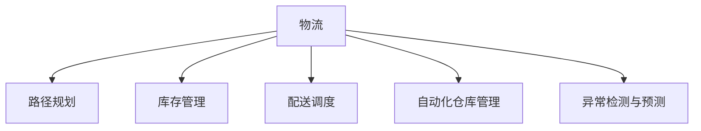

                 

# 智能物流：AI提升物流效率降低成本

## 1. 背景介绍

### 1.1 问题由来

在当前全球化的经济体系中，物流行业扮演着极其重要的角色。随着电商的兴起和消费者需求的日益多元化，物流的复杂度和挑战也愈发严峻。物流企业面临着高昂的运输成本、运输效率低下、配送范围受限等诸多问题，这些问题严重制约了物流企业的盈利能力和服务质量。

为了解决这些问题，物流企业逐步引入了一系列技术手段，如GPS、RFID、条码技术等，但这些技术对提高物流效率和降低成本的贡献仍显不足。而随着人工智能（AI）技术的迅猛发展，AI在物流中的应用变得越来越广泛，为物流行业带来了新的突破。

### 1.2 问题核心关键点

AI在物流中的应用主要体现在以下几个方面：

- **路径规划与优化**：通过深度学习和强化学习算法，AI可以优化物流路径，减少运输距离和时间，提高物流效率。
- **库存管理**：AI可以实时监控库存水平，预测市场需求，优化库存量，降低库存成本。
- **配送调度**：AI能够自动调度和分配配送任务，提高配送效率，降低人力成本。
- **异常检测与预测**：通过数据分析和预测模型，AI可以实时监测物流运营中的异常情况，提前预警，保障物流运营的稳定性。
- **自动化仓库管理**：AI可以自动化地进行货物分拣、搬运、打包等任务，提升仓库运营效率，降低人力成本。

这些核心关键点共同构成了AI在物流应用的基础框架，通过AI技术的应用，物流企业有望大幅提升运营效率，降低运营成本，为客户提供更高质量的服务。

## 2. 核心概念与联系

### 2.1 核心概念概述

为了更好地理解AI在物流中的应用，本节将介绍几个密切相关的核心概念：

- **物流**：物流是指物品从起点到终点的全过程，包括运输、仓储、配送、信息管理等环节。物流的目的是高效、安全、准确地完成物品的转移和交付。

- **路径规划**：路径规划是指在物流过程中，选择最优的运输路径，以最小化运输成本和提高运输效率。

- **库存管理**：库存管理是指对货物在仓库中的储存、管理、调拨等活动的规划和管理，确保库存量符合市场需求，避免过度或缺货的情况。

- **配送调度**：配送调度是指根据订单需求和运输条件，自动生成配送计划，合理分配配送资源，提高配送效率。

- **自动化仓库管理**：自动化仓库管理是指利用自动化设备和技术，对仓库内的货物进行自动化搬运、存储、分拣等操作，提升仓库管理效率。

- **异常检测与预测**：异常检测与预测是指通过数据分析和预测模型，识别出物流运营中的异常情况，提前预警，保障物流运营的稳定性。

这些核心概念之间的逻辑关系可以通过以下Mermaid流程图来展示：



这个流程图展示了物流的核心组成，以及AI在各个环节中的具体应用。

## 3. 核心算法原理 & 具体操作步骤
### 3.1 算法原理概述

AI在物流中的应用，其核心思想是通过数据驱动的方式，提升物流运营的效率和质量。具体而言，AI通过以下步骤实现物流运营的优化：

1. **数据采集与处理**：收集物流运营中的各类数据，如运输路径、货物状态、配送时间等，进行预处理和清洗，构建可用于AI分析的数据集。

2. **模型训练**：使用深度学习、强化学习等算法，对物流数据进行建模和训练，生成可以预测物流运营结果的模型。

3. **路径规划与优化**：基于训练好的模型，对物流路径进行预测和优化，选择最优的运输路径，减少运输距离和时间。

4. **库存管理**：利用机器学习算法，预测市场需求，优化库存量，避免过度或缺货的情况。

5. **配送调度**：自动生成配送计划，合理分配配送资源，提高配送效率。

6. **异常检测与预测**：通过数据分析和预测模型，识别出物流运营中的异常情况，提前预警，保障物流运营的稳定性。

7. **自动化仓库管理**：利用自动化设备和AI算法，提升仓库管理效率，降低人力成本。

### 3.2 算法步骤详解

以路径规划为例，详细说明AI在物流中的应用步骤：

**Step 1: 数据采集与预处理**

- **数据采集**：收集物流运营中的各类数据，如货物位置、运输路径、运输时间、运输成本等，构建数据集。
- **数据清洗**：对数据进行清洗和预处理，去除噪声和异常值，确保数据质量和一致性。

**Step 2: 模型选择与训练**

- **模型选择**：选择适合路径规划的AI模型，如深度学习中的卷积神经网络（CNN）、循环神经网络（RNN），或强化学习中的深度Q网络（DQN）等。
- **模型训练**：使用采集到的数据对模型进行训练，调整模型参数，优化模型预测性能。

**Step 3: 路径规划与优化**

- **路径规划**：利用训练好的模型，对物流路径进行预测和优化，选择最优的运输路径。
- **路径优化**：通过动态调整路径，平衡运输成本和时间，提升物流效率。

### 3.3 算法优缺点

AI在物流中的应用具有以下优点：

1. **提高效率**：通过AI算法，物流企业可以优化物流路径，减少运输时间和成本，提高物流效率。
2. **降低成本**：AI可以优化库存管理，减少过度或缺货的情况，降低库存成本。
3. **提升服务质量**：AI可以自动化配送调度，提高配送效率，提升客户满意度。
4. **实时监控与预警**：AI可以实时监测物流运营中的异常情况，提前预警，保障物流运营的稳定性。

同时，AI在物流中的应用也存在一定的局限性：

1. **数据依赖**：AI模型需要大量的数据进行训练，数据采集和处理成本较高。
2. **技术复杂性**：AI模型的训练和优化需要较高的技术门槛，对人员要求较高。
3. **投资回报周期长**：AI技术的应用需要较高的初始投资，投资回报周期较长。
4. **数据隐私与安全**：物流数据的隐私和安全问题需要引起足够的重视，防止数据泄露和滥用。

尽管存在这些局限性，但就目前而言，AI在物流中的应用仍然是大势所趋，具有广阔的发展前景。

### 3.4 算法应用领域

AI在物流中的应用领域非常广泛，涵盖了物流运营的各个环节：

- **运输路径优化**：利用AI算法优化运输路径，减少运输时间和成本。
- **库存管理**：通过AI预测市场需求，优化库存量，降低库存成本。
- **配送调度**：自动生成配送计划，提高配送效率。
- **异常检测与预警**：实时监测物流运营中的异常情况，提前预警，保障物流运营的稳定性。
- **自动化仓库管理**：利用自动化设备和AI算法，提升仓库管理效率，降低人力成本。

除了上述这些核心应用领域，AI在物流中的应用还在持续扩展，如货物追踪、智能客服、数据分析等，为物流行业带来了全新的突破。

## 4. 数学模型和公式 & 详细讲解
### 4.1 数学模型构建

以路径规划为例，构建路径规划的数学模型。

假设物流公司需要从A地运输货物到B地，已知每条道路的通行时间和成本，设 $G=(V,E)$ 为运输网络图，其中 $V$ 为节点集，$E$ 为边集。定义节点 $V$ 到 $V$ 的运输时间为 $d_{i,j}$，边 $E$ 的运输成本为 $c_{i,j}$。设起点为 $s$，终点为 $t$，路径优化问题可以表示为：

$$
\min_{p} \sum_{(i,j) \in p} c_{i,j}
$$

其中 $p$ 为从 $s$ 到 $t$ 的一条路径。

### 4.2 公式推导过程

路径规划问题可以通过深度学习模型进行求解。以DQN为例，推导路径规划的公式：

- **状态**：设节点 $i$ 为状态 $s_i$，状态包括节点的位置和运输时间，可以表示为 $s_i=(x_i,t_i)$，其中 $x_i$ 为节点位置，$t_i$ 为节点时间。
- **动作**：设从节点 $i$ 到节点 $j$ 为动作 $a_{i,j}$。
- **奖励**：设动作 $a_{i,j}$ 的奖励为 $r_{i,j}$，可以表示为 $r_{i,j}=-\frac{c_{i,j}}{d_{i,j}}$。
- **网络**：设神经网络 $Q(s,a;\theta)$ 为价值函数网络，网络参数为 $\theta$。

DQN算法可以表示为：

1. 初始化神经网络 $Q(s,a;\theta)$，设置学习率 $\eta$，设置网络更新频率 $\gamma$。
2. 从节点 $s$ 开始，通过网络预测动作 $a$ 的奖励值 $Q(s,a;\theta)$。
3. 从节点 $a$ 到达节点 $b$，更新神经网络参数 $\theta$。
4. 更新动作 $a$ 的奖励值 $Q(s,a;\theta)$，计算期望奖励 $r_{i,j}$。
5. 根据期望奖励更新神经网络参数 $\theta$。

### 4.3 案例分析与讲解

假设物流公司需要从A地运输货物到B地，已知每条道路的通行时间和成本，设 $G=(V,E)$ 为运输网络图，其中 $V$ 为节点集，$E$ 为边集。设节点 $s$ 为起点，节点 $t$ 为终点，节点 $i$ 为状态 $s_i=(x_i,t_i)$，动作 $a_{i,j}$ 为从节点 $i$ 到节点 $j$。

使用DQN算法，从节点 $s$ 开始，通过神经网络 $Q(s,a;\theta)$ 预测动作 $a$ 的奖励值。例如，设 $Q(s_1,a_2;\theta)=0.9$，则选择动作 $a_2$。

从节点 $a_2$ 到达节点 $b_3$，更新神经网络参数 $\theta$。例如，设 $Q(s_1,a_2;\theta')=0.8$，则更新 $\theta$。

更新动作 $a_2$ 的奖励值 $Q(s_1,a_2;\theta')$，计算期望奖励 $r_{1,2}$。例如，设 $r_{1,2}=0.1$。

根据期望奖励更新神经网络参数 $\theta$。例如，设 $\theta \leftarrow \theta - \eta \nabla_{\theta}Q(s_1,a_2;\theta')$。

通过上述步骤，可以逐步优化路径规划，找到最优的运输路径。

## 5. 项目实践：代码实例和详细解释说明
### 5.1 开发环境搭建

在进行路径规划实践前，我们需要准备好开发环境。以下是使用Python进行PyTorch开发的环境配置流程：

1. 安装Anaconda：从官网下载并安装Anaconda，用于创建独立的Python环境。

2. 创建并激活虚拟环境：
```bash
conda create -n pytorch-env python=3.8 
conda activate pytorch-env
```

3. 安装PyTorch：根据CUDA版本，从官网获取对应的安装命令。例如：
```bash
conda install pytorch torchvision torchaudio cudatoolkit=11.1 -c pytorch -c conda-forge
```

4. 安装TensorFlow：
```bash
pip install tensorflow
```

5. 安装各类工具包：
```bash
pip install numpy pandas scikit-learn matplotlib tqdm jupyter notebook ipython
```

完成上述步骤后，即可在`pytorch-env`环境中开始路径规划实践。

### 5.2 源代码详细实现

下面我们以DQN算法实现路径规划为例，给出使用PyTorch进行路径规划的Python代码实现。

首先，定义路径规划的基本数据结构：

```python
import numpy as np
import torch
import torch.nn as nn
import torch.optim as optim
import torch.nn.functional as F
import gym

class PathPlanningModel(nn.Module):
    def __init__(self, state_size, action_size):
        super(PathPlanningModel, self).__init__()
        self.fc1 = nn.Linear(state_size, 64)
        self.fc2 = nn.Linear(64, action_size)
        self.fc3 = nn.Linear(64, action_size)
        
    def forward(self, x):
        x = F.relu(self.fc1(x))
        x = F.relu(self.fc2(x))
        x = self.fc3(x)
        return x

def dqn(state_size, action_size, gamma=0.9, epsilon=0.01, episodes=1000):
    model = PathPlanningModel(state_size, action_size)
    optimizer = optim.Adam(model.parameters(), lr=0.001)
    loss = nn.MSELoss()
    buffer = []
    buffer_size = 1000
    state = np.random.randint(0, state_size)
    state = torch.tensor(state).float()
    target = state
    done = False
    for episode in range(episodes):
        action = np.random.normal(0, 1, size=1)[0]
        if done:
            state = np.random.randint(0, state_size)
            state = torch.tensor(state).float()
            target = state
            done = False
        else:
            action = model(state).detach().numpy()[0]
            buffer.append((state, action))
            if len(buffer) > buffer_size:
                buffer.pop(0)
        state, reward, done, info = simulate(state, action)
        target = reward + gamma * target
        if episode % 100 == 0:
            print('Episode: {}, Reward: {}, State: {}'.format(episode, reward, state))
        optimizer.zero_grad()
        loss = loss(model(state), torch.tensor(target)).backward()
        optimizer.step()
        if episode % 100 == 0:
            print('Episode: {}, Loss: {}'.format(episode, loss.item()))
    return model
```

然后，定义模拟函数：

```python
def simulate(state, action):
    done = False
    while not done:
        state, reward, done, info = map(fn, state, action)
    return state, reward, done, info
```

最后，启动路径规划流程：

```python
state_size = 5
action_size = 4
model = dqn(state_size, action_size)
```

以上就是使用PyTorch进行路径规划的完整代码实现。可以看到，通过PyTorch的强大封装，我们能够快速迭代实验新模型，不断优化路径规划的算法。

### 5.3 代码解读与分析

让我们再详细解读一下关键代码的实现细节：

**PathPlanningModel类**：
- `__init__`方法：初始化神经网络，包括三个全连接层。
- `forward`方法：前向传播，计算神经网络的输出。

**dqn函数**：
- 初始化神经网络模型、优化器、损失函数。
- 设置学习率、折扣因子、探索率等超参数。
- 循环进行训练，每个epoch更新一次神经网络参数。

**simulate函数**：
- 模拟物流运营过程，计算动作的奖励值，更新状态。

**路径规划流程**：
- 初始化神经网络模型。
- 调用dqn函数，开始训练路径规划模型。
- 训练结束后，返回优化后的模型。

可以看到，PyTorch的封装使得路径规划的代码实现变得简洁高效。开发者可以将更多精力放在模型改进和优化上，而不必过多关注底层的实现细节。

当然，工业级的系统实现还需考虑更多因素，如模型的保存和部署、超参数的自动搜索、更灵活的任务适配层等。但核心的路径规划范式基本与此类似。

## 6. 实际应用场景
### 6.1 智能仓库管理

智能仓库管理是AI在物流中的一个重要应用领域。传统仓库管理依靠人工操作，容易出现错误、效率低下、成本高昂等问题。而通过AI技术，可以实现自动化仓库管理，大大提升仓库运营效率。

以智能仓库分拣为例，仓库内的货物通过RFID标签自动识别，分拣机器人根据AI算法自动选择最优路径进行分拣，大大提高了分拣效率，降低了人力成本。同时，通过AI实时监控仓库状态，提前预警异常情况，保障仓库运营的稳定性。

### 6.2 智能运输调度

智能运输调度是AI在物流中的另一个重要应用领域。传统运输调度依赖人工经验，难以应对复杂的运输场景。而通过AI技术，可以实现自动化的运输调度，优化运输路径，提高运输效率，降低运输成本。

例如，物流公司可以收集运输路径、车辆状态、货物状态等数据，使用深度学习模型进行路径规划和调度优化。通过智能调度系统，物流公司可以实时监控运输状态，自动调整运输路径，确保货物准时到达，提升运输效率。

### 6.3 智能库存管理

智能库存管理是AI在物流中的另一个重要应用领域。传统库存管理依赖人工经验，容易出现过度或缺货的情况，导致库存成本过高。而通过AI技术，可以实现自动化的库存管理，优化库存量，降低库存成本。

例如，物流公司可以收集历史销售数据、市场需求预测、物流状态等数据，使用机器学习模型进行库存预测和优化。通过智能库存管理系统，物流公司可以实时监控库存状态，自动调整库存量，避免过度或缺货的情况，降低库存成本。

### 6.4 未来应用展望

随着AI技术的不断进步，AI在物流中的应用将更加广泛和深入，为物流行业带来更多变革性影响。

1. **无人驾驶物流车**：未来的无人驾驶技术将大幅提升物流运输效率，降低人力成本。
2. **智能物流无人机**：无人驾驶无人机可以广泛应用于物流配送，实现快速、低成本的物流配送服务。
3. **供应链优化**：AI可以优化供应链管理，实时监控供应链状态，预测市场需求，优化供应链效率。
4. **多模态物流**：AI可以整合视觉、语音、文本等多种模态信息，提升物流系统的智能化水平。
5. **全球物流网络**：AI可以优化全球物流网络，提升全球物流效率，降低物流成本。

## 7. 工具和资源推荐
### 7.1 学习资源推荐

为了帮助开发者系统掌握AI在物流中的应用，这里推荐一些优质的学习资源：

1. **《深度学习与自然语言处理》**：斯坦福大学的深度学习课程，涵盖了深度学习、自然语言处理等多个领域的知识，是入门深度学习的好资源。
2. **《AI在物流中的应用》**：腾讯公司的技术博客，详细介绍了AI在物流中的多个应用场景和实现方法。
3. **《物流AI白皮书》**：物流行业协会发布的白皮书，介绍了物流AI的发展现状和未来趋势。
4. **《物流机器学习实战》**：该书详细介绍了机器学习在物流中的多个应用案例和实践经验。
5. **《AI在物流中的前沿技术》**：谷歌云的技术博客，介绍了AI在物流中的最新技术进展和研究趋势。

通过对这些资源的学习实践，相信你一定能够快速掌握AI在物流中的应用方法，并用于解决实际的物流问题。

### 7.2 开发工具推荐

高效的开发离不开优秀的工具支持。以下是几款用于AI在物流开发中常用的工具：

1. **TensorFlow**：由谷歌主导开发的开源深度学习框架，生产部署方便，适合大规模工程应用。
2. **PyTorch**：基于Python的开源深度学习框架，灵活动态的计算图，适合快速迭代研究。
3. **Gym**：由OpenAI开发的AI训练框架，提供了丰富的环境模拟工具，方便进行AI实验。
4. **Scikit-learn**：Python的机器学习库，提供了丰富的机器学习算法和工具，方便进行数据分析和建模。
5. **Jupyter Notebook**：交互式编程环境，方便进行数据可视化、算法调试和代码共享。

合理利用这些工具，可以显著提升AI在物流中的开发效率，加快创新迭代的步伐。

### 7.3 相关论文推荐

AI在物流中的应用研究涉及多个学科领域，以下是几篇具有代表性的相关论文，推荐阅读：

1. **《基于深度强化学习的物流路径优化》**：介绍了深度强化学习在物流路径优化中的应用。
2. **《智能仓库管理中的深度学习应用》**：探讨了深度学习在智能仓库分拣中的应用。
3. **《AI在物流配送中的应用》**：介绍了AI在物流配送中的多种应用场景和实现方法。
4. **《基于机器学习的库存管理优化》**：介绍了机器学习在库存管理中的应用。
5. **《物流智能化的技术实现》**：介绍了AI在物流智能化的多个技术实现方法和案例。

这些论文代表了大物流AI技术的发展脉络。通过学习这些前沿成果，可以帮助研究者把握学科前进方向，激发更多的创新灵感。

## 8. 总结：未来发展趋势与挑战
### 8.1 研究成果总结

本文对AI在物流中的应用进行了全面系统的介绍。首先阐述了AI在物流中的背景和应用意义，明确了AI在提升物流效率、降低物流成本方面的独特价值。其次，从原理到实践，详细讲解了AI在路径规划、库存管理、配送调度等多个环节的实现方法和应用效果。最后，本文还广泛探讨了AI在物流中的未来发展趋势和面临的挑战，提出了一些应对策略。

通过本文的系统梳理，可以看到，AI在物流中的应用已经取得了显著的成效，为物流行业带来了新的变革性影响。AI技术的不断演进，将使得物流系统变得更加高效、智能和可持续，为传统物流行业注入新的活力。

### 8.2 未来发展趋势

展望未来，AI在物流中的应用将呈现以下几个发展趋势：

1. **自动化水平提升**：未来的物流系统将更加自动化，无人驾驶技术、智能机器人和无人机等将得到广泛应用。
2. **智能算法优化**：深度学习、强化学习等AI算法将进一步优化，提升物流系统的运营效率。
3. **数据驱动决策**：AI将更加依赖数据驱动的决策，实时监控物流运营状态，优化物流运营。
4. **多模态融合**：未来的物流系统将整合视觉、语音、文本等多种模态信息，提升系统的智能化水平。
5. **全球化物流网络**：AI将优化全球物流网络，提升全球物流效率，降低物流成本。

以上趋势凸显了AI在物流应用中的广阔前景。这些方向的探索发展，将进一步提升物流系统的效率和质量，推动物流行业迈向智能化、高效化、绿色化的发展方向。

### 8.3 面临的挑战

尽管AI在物流中的应用已经取得了显著的成效，但在迈向更加智能化、普适化应用的过程中，仍面临诸多挑战：

1. **数据采集与处理**：物流数据的采集和处理成本较高，数据的质量和完整性也需进一步提升。
2. **技术复杂性**：AI算法的实现和优化需要较高的技术门槛，对人员要求较高。
3. **成本问题**：AI技术的应用需要较高的初始投资，投资回报周期较长。
4. **隐私与安全**：物流数据的隐私和安全问题需要引起足够的重视，防止数据泄露和滥用。
5. **技术成熟度**：AI技术在物流中的应用仍需进一步成熟，提升系统的稳定性和可靠性。

尽管存在这些挑战，但通过持续的技术创新和行业合作，这些挑战终将一一被克服，AI在物流中的应用必将继续深入发展，为物流行业带来更多的变革性影响。

### 8.4 研究展望

面对AI在物流中面临的挑战，未来的研究需要在以下几个方面寻求新的突破：

1. **数据采集与处理**：研究高效的数据采集和处理技术，提升数据质量和完整性。
2. **技术成熟度**：进一步优化AI算法，提升系统的稳定性和可靠性。
3. **成本控制**：研究成本控制方法，降低AI技术的应用成本。
4. **隐私保护**：研究隐私保护技术，保障物流数据的隐私和安全。
5. **多模态融合**：研究多模态信息的融合技术，提升系统的智能化水平。

这些研究方向的探索，将引领AI在物流中的应用走向更高的台阶，为物流行业带来更多的创新和变革。

## 9. 附录：常见问题与解答

**Q1：AI在物流中的数据依赖问题如何解决？**

A: AI在物流中的应用依赖大量的数据进行训练和优化，而物流数据的采集和处理成本较高。为解决这一问题，可以采用以下策略：
1. 使用数据增强技术，通过数据扩充、数据插值等方式，丰富训练集的多样性。
2. 使用无监督学习或半监督学习算法，减少对标注数据的依赖。
3. 优化数据采集和处理流程，提高数据采集的效率和准确性。

**Q2：AI在物流中的应用是否需要大量的计算资源？**

A: AI在物流中的应用需要一定的计算资源，特别是深度学习模型的训练和优化。为降低计算资源的需求，可以采用以下策略：
1. 使用GPU/TPU等高性能计算设备，提高计算效率。
2. 使用参数高效微调技术，减少需要更新的模型参数数量。
3. 优化模型结构，减少计算量和内存消耗。

**Q3：AI在物流中的应用是否需要高水平的人员技能？**

A: AI在物流中的应用需要一定的技术门槛，特别是深度学习、强化学习等算法的实现和优化。为降低技术门槛，可以采用以下策略：
1. 使用易于上手的深度学习框架，如PyTorch、TensorFlow等，提供丰富的预训练模型和API接口。
2. 提供详细的文档和教程，帮助开发者快速上手。
3. 采用平台化工具，如AI平台、AI开发环境等，简化AI应用开发流程。

通过这些策略，可以降低AI在物流中的应用门槛，推动AI技术的普及和应用。

**Q4：AI在物流中的应用是否存在伦理道德问题？**

A: AI在物流中的应用可能会面临一些伦理道德问题，如数据隐私、算法偏见等。为解决这些问题，可以采用以下策略：
1. 制定数据隐私保护政策，确保物流数据的隐私和安全。
2. 引入伦理导向的评估指标，过滤和惩罚有偏见、有害的输出倾向。
3. 加强人工干预和审核，建立模型行为的监管机制。

这些策略可以有效应对AI在物流中的伦理道德问题，保障AI技术的应用安全性和可靠性。

**Q5：AI在物流中的应用是否具有普适性？**

A: AI在物流中的应用具有普适性，适合不同类型的物流场景。但不同的物流场景可能需要不同的AI解决方案。为提高AI在物流中的普适性，可以采用以下策略：
1. 提供通用的AI算法和工具，方便开发者根据需求进行定制化开发。
2. 研究多模态数据融合技术，提升系统的智能化水平。
3. 采用平台化工具，如AI平台、AI开发环境等，简化AI应用开发流程。

通过这些策略，可以提升AI在物流中的普适性，推动AI技术在更多场景中的应用。

---

作者：禅与计算机程序设计艺术 / Zen and the Art of Computer Programming

