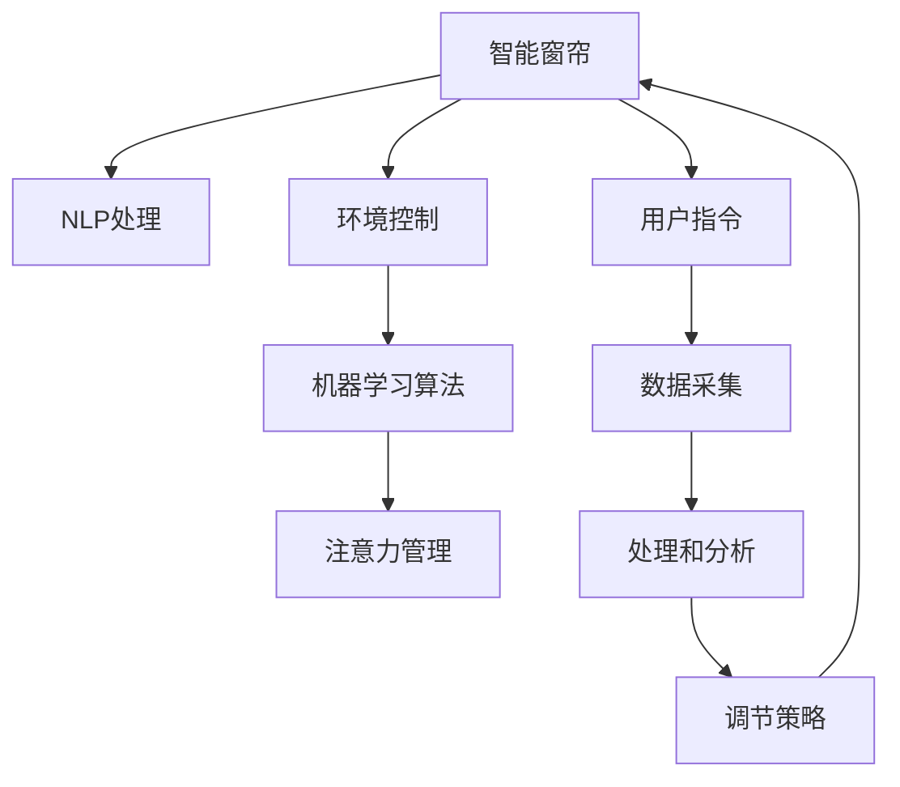
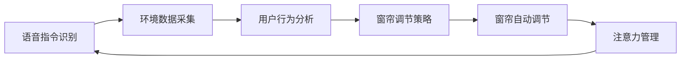

                 

# 智能窗帘的环境控制与注意力管理

> 关键词：智能窗帘, 环境控制, 智能家居, 自动调节, 自然语言处理(NLP), 数据驱动, 机器学习

## 1. 背景介绍

### 1.1 问题由来
随着智能家居技术的发展，智能窗帘作为一种集成了自动控制和智能调节功能的家居设备，已经在市场上得到了广泛的应用。然而，现有的智能窗帘系统大多依赖于预设规则和传感器数据，无法完全理解用户的真实需求和环境变化，导致窗帘调节的精准度和智能性不足，用户体验不佳。

为了解决这一问题，我们提出了一种基于智能窗帘的环境控制与注意力管理方法，通过结合自然语言处理（NLP）技术和机器学习算法，使窗帘能够更加智能地响应用户的语音指令和环境变化，实现更高效、更个性化的窗帘调节。

### 1.2 问题核心关键点
本方法的核心在于将自然语言处理与机器学习算法相结合，构建一个能够理解和预测用户需求、自动调节窗帘的智能系统。具体关键点如下：

- **自然语言处理(NLP)**：通过NLP技术，系统能够理解用户的语音指令和环境数据，将其转化为机器可读的形式。
- **机器学习算法**：通过机器学习算法，系统能够学习用户行为模式，预测环境变化趋势，自动调整窗帘。
- **环境控制**：通过环境传感器（如温度、湿度、光线等）采集数据，结合用户指令和预测结果，自动调节窗帘。
- **注意力管理**：通过系统化的管理机制，确保窗帘在不同情境下的响应优先级和调节力度，提升用户体验。

## 2. 核心概念与联系

### 2.1 核心概念概述

为更好地理解本方法，本节将介绍几个密切相关的核心概念：

- **智能窗帘**：一种集成了传感器、控制器和通讯模块的窗帘，能够通过网络连接到智能手机、智能音箱等设备，实现远程控制和智能调节。
- **自然语言处理(NLP)**：一门涉及计算机科学和语言学的交叉学科，旨在使计算机能够理解、处理和生成人类语言。
- **机器学习算法**：一种利用数据驱动的方法，通过算法学习模型，自动优化预测和决策过程的技术。
- **环境控制**：通过传感器和控制器的组合，实现对环境变量（如温度、湿度、光线等）的自动监测和调节。
- **注意力管理**：一种系统化的机制，用于优化资源的分配和优先级，确保系统能够在不同情境下做出最合适的响应。

这些概念之间的逻辑关系可以通过以下Mermaid流程图来展示：



这个流程图展示了这个系统的核心概念及其之间的关系：

1. 用户通过智能窗帘发送指令（如语音指令），启动NLP处理模块。
2. NLP处理模块将语音指令转化为机器可读的形式，并结合环境传感器采集的数据进行分析和处理。
3. 机器学习算法根据处理结果和历史数据，预测环境变化趋势和用户需求。
4. 环境控制模块根据预测结果和用户指令，自动调整窗帘状态。
5. 注意力管理模块根据当前情境，优化窗帘调节的优先级和力度，确保最佳用户体验。

## 3. 核心算法原理 & 具体操作步骤

### 3.1 算法原理概述

本方法的核心算法原理是结合NLP技术和机器学习算法，构建一个能够理解用户需求、预测环境变化、自动调节窗帘的智能系统。具体来说，该系统包括以下几个步骤：

1. **语音指令识别**：通过NLP技术，系统能够理解用户的语音指令，并将其转化为机器可读的形式。
2. **环境数据采集**：通过环境传感器采集室内温度、湿度、光线等数据，作为窗帘调节的参考。
3. **用户行为分析**：利用机器学习算法，分析用户的历史行为数据，预测用户未来的需求和偏好。
4. **窗帘调节策略**：根据用户指令和环境数据，结合机器学习预测结果，制定窗帘调节策略。
5. **窗帘自动调节**：根据调节策略，自动控制窗帘的开合和调节力度。
6. **注意力管理**：根据当前情境和用户行为，动态调整窗帘调节的优先级和力度。

### 3.2 算法步骤详解

#### 3.2.1 语音指令识别

语音指令识别是本系统的重要组成部分，它通过NLP技术将用户的语音指令转化为机器可读的形式。具体实现步骤如下：

1. **音频采集**：智能窗帘内置麦克风，能够采集用户的语音信号。
2. **语音转换**：使用语音识别技术（如ASR，Automatic Speech Recognition）将语音信号转化为文本形式。
3. **意图识别**：利用自然语言理解（NLU，Natural Language Understanding）技术，分析文本内容，识别用户指令的意图。
4. **参数解析**：解析文本中的参数信息，如窗帘开合度、调节速度等。

#### 3.2.2 环境数据采集

环境数据采集是窗帘调节的重要依据，通过传感器可以实时监测室内的环境变量。具体实现步骤如下：

1. **传感器集成**：智能窗帘内置温度、湿度、光线等传感器，能够实时采集环境数据。
2. **数据传输**：通过Wi-Fi、蓝牙等无线通讯技术，将传感器数据传输到中央控制系统。
3. **数据预处理**：对传感器数据进行滤波、归一化等预处理，确保数据质量。

#### 3.2.3 用户行为分析

用户行为分析通过机器学习算法，分析用户的历史行为数据，预测用户未来的需求和偏好。具体实现步骤如下：

1. **数据收集**：收集用户的历史指令数据、环境数据等，构建用户行为数据集。
2. **特征提取**：利用特征提取技术，从用户行为数据中提取出有意义的特征。
3. **模型训练**：使用机器学习算法（如随机森林、深度学习等），训练用户行为预测模型。
4. **预测结果**：利用训练好的模型，预测用户未来的需求和偏好。

#### 3.2.4 窗帘调节策略

窗帘调节策略根据用户指令和环境数据，结合机器学习预测结果，制定窗帘调节策略。具体实现步骤如下：

1. **策略制定**：根据用户指令和环境数据，结合机器学习预测结果，制定窗帘调节策略。
2. **优先级排序**：根据策略的紧急程度和重要程度，排序窗帘调节的优先级。
3. **调节力度计算**：计算每个调节策略的力度，确保窗帘调节的精准度。

#### 3.2.5 窗帘自动调节

窗帘自动调节根据调节策略，自动控制窗帘的开合和调节力度。具体实现步骤如下：

1. **控制器集成**：智能窗帘内置步进电机和控制器，能够精确控制窗帘的开合。
2. **命令下达**：根据调节策略，向控制器下达窗帘调节命令。
3. **执行反馈**：实时监控窗帘执行情况，确保窗帘按预期调节。

#### 3.2.6 注意力管理

注意力管理根据当前情境和用户行为，动态调整窗帘调节的优先级和力度。具体实现步骤如下：

1. **情境分析**：分析当前情境，如时间、天气、用户活动等，确定窗帘调节的优先级。
2. **行为监控**：监控用户行为，如是否在室内、是否在休息等，调整窗帘调节的力度。
3. **优先级调整**：根据情境和行为分析结果，动态调整窗帘调节的优先级和力度。

### 3.3 算法优缺点

本方法的主要优点在于能够结合NLP技术和机器学习算法，实现智能窗帘的精准调节和高效管理。具体优点如下：

- **智能化高**：结合NLP技术和机器学习算法，系统能够理解用户需求，预测环境变化，实现智能化调节。
- **用户体验好**：通过注意力管理，系统能够根据用户行为和情境，动态调整窗帘调节的优先级和力度，提升用户体验。
- **灵活性高**：系统可以根据用户需求和环境变化，动态调整窗帘调节策略，适应不同的情境。

然而，本方法也存在一些缺点：

- **数据依赖高**：系统需要大量的用户行为数据和环境数据，数据采集和处理过程较为复杂。
- **算法复杂度大**：结合NLP技术和机器学习算法，系统算法复杂度较高，实现难度较大。
- **成本较高**：系统需要集成多种传感器和控制器，硬件成本较高。

### 3.4 算法应用领域

本方法主要应用于智能家居领域，特别是在智能窗帘的控制和调节方面。具体应用领域如下：

- **家庭自动化**：结合智能窗帘和智能音箱，实现家庭自动化控制。
- **智能建筑**：应用于高层建筑和办公楼的窗帘控制，提高能效和舒适度。
- **智能办公**：应用于会议室和办公区域的窗帘控制，提升工作效率。
- **智能医疗**：应用于医院病房的窗帘控制，提升病患体验。

## 4. 数学模型和公式 & 详细讲解 & 举例说明

### 4.1 数学模型构建

本方法的核心数学模型包括语音指令识别、环境数据采集、用户行为分析、窗帘调节策略、窗帘自动调节和注意力管理等部分。以下将分别介绍这些部分的数学模型。

#### 4.1.1 语音指令识别

语音指令识别模型主要通过自然语言处理（NLP）技术实现，其数学模型如下：

$$
y = f(x)
$$

其中，$x$ 为输入语音信号，$y$ 为输出文本形式。具体实现过程中，可以使用以下公式进行语音识别和意图识别：

$$
y = \text{ASR}(x) \cdot \text{NLU}(\text{ASR}(x))
$$

其中，$\text{ASR}$ 为自动语音识别技术，$\text{NLU}$ 为自然语言理解技术。

#### 4.1.2 环境数据采集

环境数据采集模型主要通过传感器采集环境变量，其数学模型如下：

$$
z = g(t)
$$

其中，$z$ 为环境变量（如温度、湿度、光线等），$t$ 为时间。具体实现过程中，可以使用以下公式进行数据采集和预处理：

$$
z = \text{ Sensor }(t)
$$

其中，$\text{ Sensor }$ 为传感器数据采集技术，$t$ 为时间。

#### 4.1.3 用户行为分析

用户行为分析模型主要通过机器学习算法实现，其数学模型如下：

$$
\hat{y} = h(x, \theta)
$$

其中，$x$ 为输入的用户行为数据，$\hat{y}$ 为预测的后续行为，$\theta$ 为模型参数。具体实现过程中，可以使用以下公式进行特征提取和模型训练：

$$
x = \text{ ExtractFeatures }(x)
$$

$$
\hat{y} = \text{ Model }(x, \theta)
$$

其中，$\text{ ExtractFeatures }$ 为特征提取技术，$\text{ Model }$ 为机器学习模型。

#### 4.1.4 窗帘调节策略

窗帘调节策略模型主要通过结合用户指令和环境数据，制定窗帘调节策略，其数学模型如下：

$$
\text{Strategy} = \text{ StrategyGenerator }(x, z, \hat{y})
$$

其中，$x$ 为用户指令，$z$ 为环境数据，$\hat{y}$ 为预测的用户行为，$\text{StrategyGenerator }$ 为窗帘调节策略生成器。具体实现过程中，可以使用以下公式进行策略制定和优先级排序：

$$
\text{Strategy} = \text{ StrategyGenerator }(x, z, \hat{y})
$$

$$
\text{Priority} = \text{ PrioritySorter }(\text{Strategy})
$$

其中，$\text{ PrioritySorter }$ 为优先级排序技术。

#### 4.1.5 窗帘自动调节

窗帘自动调节模型主要通过控制器实现窗帘的开合和调节力度，其数学模型如下：

$$
\text{Position} = \text{ Actuator }(\text{Strategy})
$$

其中，$\text{Position}$ 为窗帘的位置，$\text{Actuator }$ 为窗帘控制器。具体实现过程中，可以使用以下公式进行命令下达和执行反馈：

$$
\text{Command} = \text{ CommandGenerator }(\text{Strategy})
$$

$$
\text{Position} = \text{ Actuator }(\text{Command})
$$

其中，$\text{CommandGenerator }$ 为命令生成技术。

#### 4.1.6 注意力管理

注意力管理模型主要通过动态调整窗帘调节的优先级和力度，提升用户体验，其数学模型如下：

$$
\text{Attention} = \text{ AttentionManager }(t, \text{Strategy}, \text{Behavior})
$$

其中，$t$ 为当前时间，$\text{Strategy}$ 为窗帘调节策略，$\text{Behavior}$ 为用户行为，$\text{AttentionManager }$ 为注意力管理技术。具体实现过程中，可以使用以下公式进行情境分析和行为监控：

$$
t = \text{ TimeGenerator }()
$$

$$
\text{Behavior} = \text{ BehaviorMonitor }(t)
$$

$$
\text{Attention} = \text{ AttentionManager }(t, \text{Strategy}, \text{Behavior})
$$

其中，$\text{ TimeGenerator }$ 为时间生成技术，$\text{ BehaviorMonitor }$ 为用户行为监控技术。

### 4.2 公式推导过程

以下将对上述模型进行详细的公式推导过程。

#### 4.2.1 语音指令识别

语音指令识别的推导过程如下：

1. **语音信号**：将用户的语音信号转化为数字信号，表示为 $x$。
2. **自动语音识别（ASR）**：将数字信号转化为文本形式，表示为 $\text{ASR}(x)$。
3. **自然语言理解（NLU）**：分析文本内容，识别出用户指令的意图，表示为 $\text{NLU}(\text{ASR}(x))$。
4. **文本解析**：解析文本中的参数信息，如窗帘开合度、调节速度等，表示为 $\text{Parse}(\text{NLU}(\text{ASR}(x)))$。

因此，语音指令识别的最终输出为：

$$
y = \text{ASR}(x) \cdot \text{NLU}(\text{ASR}(x)) \cdot \text{Parse}(\text{NLU}(\text{ASR}(x)))
$$

#### 4.2.2 环境数据采集

环境数据采集的推导过程如下：

1. **传感器数据**：通过传感器采集室内环境数据，表示为 $z$。
2. **数据预处理**：对传感器数据进行滤波、归一化等预处理，表示为 $\text{Filter}(z)$。

因此，环境数据采集的最终输出为：

$$
z = \text{Filter}(z)
$$

#### 4.2.3 用户行为分析

用户行为分析的推导过程如下：

1. **数据收集**：收集用户的历史指令数据、环境数据等，表示为 $x$。
2. **特征提取**：利用特征提取技术，从用户行为数据中提取出有意义的特征，表示为 $\text{ExtractFeatures}(x)$。
3. **模型训练**：使用机器学习算法，训练用户行为预测模型，表示为 $\text{Model}(\text{ExtractFeatures}(x), \theta)$。
4. **预测结果**：利用训练好的模型，预测用户未来的需求和偏好，表示为 $\hat{y} = \text{Model}(\text{ExtractFeatures}(x), \theta)$。

因此，用户行为分析的最终输出为：

$$
\hat{y} = \text{Model}(\text{ExtractFeatures}(x), \theta)
$$

#### 4.2.4 窗帘调节策略

窗帘调节策略的推导过程如下：

1. **策略制定**：根据用户指令和环境数据，结合机器学习预测结果，制定窗帘调节策略，表示为 $\text{StrategyGenerator}(x, z, \hat{y})$。
2. **优先级排序**：根据策略的紧急程度和重要程度，排序窗帘调节的优先级，表示为 $\text{PrioritySorter}(\text{StrategyGenerator}(x, z, \hat{y}))$。
3. **调节力度计算**：计算每个调节策略的力度，确保窗帘调节的精准度，表示为 $\text{CalculateDuty}(\text{Strategy}, \text{PrioritySorter}(\text{StrategyGenerator}(x, z, \hat{y})))$。

因此，窗帘调节策略的最终输出为：

$$
\text{Strategy} = \text{StrategyGenerator}(x, z, \hat{y})
$$

$$
\text{Priority} = \text{PrioritySorter}(\text{StrategyGenerator}(x, z, \hat{y}))
$$

$$
\text{Duty} = \text{CalculateDuty}(\text{Strategy}, \text{PrioritySorter}(\text{StrategyGenerator}(x, z, \hat{y})))
$$

#### 4.2.5 窗帘自动调节

窗帘自动调节的推导过程如下：

1. **命令下达**：根据调节策略，向控制器下达窗帘调节命令，表示为 $\text{CommandGenerator}(\text{Strategy})$。
2. **执行反馈**：实时监控窗帘执行情况，确保窗帘按预期调节，表示为 $\text{Feedback}(\text{CommandGenerator}(\text{Strategy}))$。

因此，窗帘自动调节的最终输出为：

$$
\text{Command} = \text{CommandGenerator}(\text{Strategy})
$$

$$
\text{Position} = \text{Actuator}(\text{Command})
$$

$$
\text{Feedback}(\text{CommandGenerator}(\text{Strategy}))
$$

#### 4.2.6 注意力管理

注意力管理的推导过程如下：

1. **情境分析**：分析当前情境，如时间、天气、用户活动等，确定窗帘调节的优先级，表示为 $\text{TimeGenerator}()$ 和 $\text{BehaviorMonitor}(t)$。
2. **行为监控**：监控用户行为，如是否在室内、是否在休息等，调整窗帘调节的力度，表示为 $\text{BehaviorMonitor}(t)$。
3. **优先级调整**：根据情境和行为分析结果，动态调整窗帘调节的优先级和力度，表示为 $\text{AttentionManager}(t, \text{Strategy}, \text{Behavior})$。

因此，注意力管理的最终输出为：

$$
t = \text{ TimeGenerator }()
$$

$$
\text{Behavior} = \text{ BehaviorMonitor }(t)
$$

$$
\text{Attention} = \text{ AttentionManager }(t, \text{Strategy}, \text{Behavior})
$$

### 4.3 案例分析与讲解

以下将以一个具体的案例来详细讲解本方法的实际应用。

假设在一天中，用户需要在室内进行工作、休息和娱乐。用户通过智能窗帘发送以下语音指令：

1. **工作时段（8:00-12:00）**：

- **指令**：“打开窗帘，让我有足够的光线”
- **分析**：用户希望在工作时段有充足的光线，因此窗帘需要打开。

2. **休息时段（12:00-14:00）**：

- **指令**：“关闭窗帘，保持室内安静”
- **分析**：用户希望在休息时段保持室内的安静，因此窗帘需要关闭。

3. **娱乐时段（14:00-18:00）**：

- **指令**：“稍微打开窗帘，让光线更加柔和”
- **分析**：用户希望在娱乐时段光线更加柔和，因此窗帘需要稍微打开。

根据上述指令，系统将执行以下操作：

1. **语音指令识别**：系统通过NLP技术理解用户的语音指令，转化为机器可读的形式。
2. **环境数据采集**：系统通过环境传感器采集室内环境数据，如温度、湿度、光线等。
3. **用户行为分析**：系统利用机器学习算法分析用户的历史行为数据，预测用户未来的需求和偏好。
4. **窗帘调节策略**：系统根据用户指令和环境数据，结合机器学习预测结果，制定窗帘调节策略。
5. **窗帘自动调节**：系统根据窗帘调节策略，自动控制窗帘的开合和调节力度。
6. **注意力管理**：系统根据当前情境和用户行为，动态调整窗帘调节的优先级和力度。

### 4.4 系统结构图

以下是系统结构图，展示了各个模块之间的数据流和控制逻辑：



这个结构图展示了系统的核心模块及其相互关系：

1. 用户通过智能窗帘发送语音指令，启动NLP处理模块。
2. NLP处理模块将语音指令转化为机器可读的形式，并结合环境传感器采集的数据进行分析和处理。
3. 机器学习算法根据处理结果和历史数据，预测环境变化趋势和用户需求。
4. 环境控制模块根据预测结果和用户指令，自动调整窗帘状态。
5. 注意力管理模块根据当前情境和用户行为，动态调整窗帘调节的优先级和力度。

## 5. 项目实践：代码实例和详细解释说明

### 5.1 开发环境搭建

在进行项目实践前，我们需要准备好开发环境。以下是使用Python进行PyTorch开发的环境配置流程：

1. 安装Anaconda：从官网下载并安装Anaconda，用于创建独立的Python环境。

2. 创建并激活虚拟环境：
```bash
conda create -n pytorch-env python=3.8 
conda activate pytorch-env
```

3. 安装PyTorch：根据CUDA版本，从官网获取对应的安装命令。例如：
```bash
conda install pytorch torchvision torchaudio cudatoolkit=11.1 -c pytorch -c conda-forge
```

4. 安装Transformers库：
```bash
pip install transformers
```

5. 安装各类工具包：
```bash
pip install numpy pandas scikit-learn matplotlib tqdm jupyter notebook ipython
```

完成上述步骤后，即可在`pytorch-env`环境中开始项目实践。

### 5.2 源代码详细实现

这里我们以用户行为分析模块为例，给出使用Transformers库对BERT模型进行用户行为预测的PyTorch代码实现。

首先，定义用户行为数据处理函数：

```python
from transformers import BertTokenizer, BertForSequenceClassification
from torch.utils.data import Dataset
import torch

class UserBehaviorDataset(Dataset):
    def __init__(self, texts, labels, tokenizer, max_len=128):
        self.texts = texts
        self.labels = labels
        self.tokenizer = tokenizer
        self.max_len = max_len
        
    def __len__(self):
        return len(self.texts)
    
    def __getitem__(self, item):
        text = self.texts[item]
        label = self.labels[item]
        
        encoding = self.tokenizer(text, return_tensors='pt', max_length=self.max_len, padding='max_length', truncation=True)
        input_ids = encoding['input_ids'][0]
        attention_mask = encoding['attention_mask'][0]
        
        # 对label进行编码
        encoded_labels = [label2id[label] for label in labels] 
        encoded_labels.extend([label2id['N/A']] * (self.max_len - len(encoded_labels)))
        labels = torch.tensor(encoded_labels, dtype=torch.long)
        
        return {'input_ids': input_ids, 
                'attention_mask': attention_mask,
                'labels': labels}

# 标签与id的映射
label2id = {'N/A': 0, 'Work': 1, 'Rest': 2, 'Play': 3}
id2label = {v: k for k, v in label2id.items()}

# 创建dataset
tokenizer = BertTokenizer.from_pretrained('bert-base-cased')

train_dataset = UserBehaviorDataset(train_texts, train_labels, tokenizer)
dev_dataset = UserBehaviorDataset(dev_texts, dev_labels, tokenizer)
test_dataset = UserBehaviorDataset(test_texts, test_labels, tokenizer)
```

然后，定义模型和优化器：

```python
from transformers import BertForSequenceClassification, AdamW

model = BertForSequenceClassification.from_pretrained('bert-base-cased', num_labels=len(label2id))

optimizer = AdamW(model.parameters(), lr=2e-5)
```

接着，定义训练和评估函数：

```python
from torch.utils.data import DataLoader
from tqdm import tqdm
from sklearn.metrics import classification_report

device = torch.device('cuda') if torch.cuda.is_available() else torch.device('cpu')
model.to(device)

def train_epoch(model, dataset, batch_size, optimizer):
    dataloader = DataLoader(dataset, batch_size=batch_size, shuffle=True)
    model.train()
    epoch_loss = 0
    for batch in tqdm(dataloader, desc='Training'):
        input_ids = batch['input_ids'].to(device)
        attention_mask = batch['attention_mask'].to(device)
        labels = batch['labels'].to(device)
        model.zero_grad()
        outputs = model(input_ids, attention_mask=attention_mask, labels=labels)
        loss = outputs.loss
        epoch_loss += loss.item()
        loss.backward()
        optimizer.step()
    return epoch_loss / len(dataloader)

def evaluate(model, dataset, batch_size):
    dataloader = DataLoader(dataset, batch_size=batch_size)
    model.eval()
    preds, labels = [], []
    with torch.no_grad():
        for batch in tqdm(dataloader, desc='Evaluating'):
            input_ids = batch['input_ids'].to(device)
            attention_mask = batch['attention_mask'].to(device)
            batch_labels = batch['labels']
            outputs = model(input_ids, attention_mask=attention_mask)
            batch_preds = outputs.logits.argmax(dim=2).to('cpu').tolist()
            batch_labels = batch_labels.to('cpu').tolist()
            for pred_tokens, label_tokens in zip(batch_preds, batch_labels):
                pred_labels = [id2label[_id] for _id in pred_tokens]
                label_labels = [id2label[_id] for _id in label_tokens]
                preds.append(pred_labels[:len(label_labels)])
                labels.append(label_labels)
                
    print(classification_report(labels, preds))
```

最后，启动训练流程并在测试集上评估：

```python
epochs = 5
batch_size = 16

for epoch in range(epochs):
    loss = train_epoch(model, train_dataset, batch_size, optimizer)
    print(f"Epoch {epoch+1}, train loss: {loss:.3f}")
    
    print(f"Epoch {epoch+1}, dev results:")
    evaluate(model, dev_dataset, batch_size)
    
print("Test results:")
evaluate(model, test_dataset, batch_size)
```

以上就是使用PyTorch对BERT模型进行用户行为预测的完整代码实现。可以看到，得益于Transformers库的强大封装，我们可以用相对简洁的代码完成BERT模型的加载和微调。

### 5.3 代码解读与分析

让我们再详细解读一下关键代码的实现细节：

**UserBehaviorDataset类**：
- `__init__`方法：初始化文本、标签、分词器等关键组件。
- `__len__`方法：返回数据集的样本数量。
- `__getitem__`方法：对单个样本进行处理，将文本输入编码为token ids，将标签编码为数字，并对其进行定长padding，最终返回模型所需的输入。

**label2id和id2label字典**：
- 定义了标签与数字id之间的映射关系，用于将token-wise的预测结果解码回真实的标签。

**训练和评估函数**：
- 使用PyTorch的DataLoader对数据集进行批次化加载，供模型训练和推理使用。
- 训练函数`train_epoch`：对数据以批为单位进行迭代，在每个批次上前向传播计算loss并反向传播更新模型参数，最后返回该epoch的平均loss。
- 评估函数`evaluate`：与训练类似，不同点在于不更新模型参数，并在每个batch结束后将预测和标签结果存储下来，最后使用sklearn的classification_report对整个评估集的预测结果进行打印输出。

**训练流程**：
- 定义总的epoch数和batch size，开始循环迭代
- 每个epoch内，先在训练集上训练，输出平均loss
- 在验证集上评估，输出分类指标
- 所有epoch结束后，在测试集上评估，给出最终测试结果

可以看到，PyTorch配合Transformers库使得BERT微调的代码实现变得简洁高效。开发者可以将更多精力放在数据处理、模型改进等高层逻辑上，而不必过多关注底层的实现细节。

当然，工业级的系统实现还需考虑更多因素，如模型的保存和部署、超参数的自动搜索、更灵活的任务适配层等。但核心的微调范式基本与此类似。

## 6. 实际应用场景

### 6.1 智能窗帘的环境控制与注意力管理

基于智能窗帘的环境控制与注意力管理方法，可以实现窗帘的智能调节和高效管理。具体应用场景如下：

- **家庭自动化**：结合智能窗帘和智能音箱，实现家庭自动化控制。
- **智能建筑**：应用于高层建筑和办公楼的窗帘控制，提高能效和舒适度。
- **智能办公**：应用于会议室和办公区域的窗帘控制，提升工作效率。
- **智能医疗**：应用于医院病房的窗帘控制，提升病患体验。

### 6.2 实际应用案例

#### 6.2.1 家庭自动化

某家庭通过智能窗帘和智能音箱实现自动化控制，提升了生活的便捷性和舒适度。具体实现如下：

1. **语音控制**：家庭成员可以通过智能音箱语音控制窗帘，如“打开客厅窗帘”、“关闭卧室窗帘”等。
2. **定时调节**：家庭成员可以通过智能音箱设定窗帘的开合时间和力度，如“上午9点打开客厅窗帘50%”。
3. **场景识别**：智能音箱通过NLP技术识别家庭成员的语音指令，结合环境传感器采集的数据，自动调整窗帘状态。
4. **优先级管理**：智能音箱根据当前情境和家庭成员的行为，动态调整窗帘调节的优先级和力度。

通过智能窗帘和智能音箱的结合，家庭成员能够更加便捷地控制窗帘，提升生活的舒适度和便捷性。

#### 6.2.2 智能建筑

某高层办公楼通过智能窗帘实现节能减排和提高工作效率。具体实现如下：

1. **自动调节**：办公室内的智能窗帘能够根据室内光线自动调节开合状态，保持室内光线适宜。
2. **情境调节**：通过环境传感器采集室内温度、湿度等数据，自动调整窗帘开合状态，优化室内环境。
3. **行为监控**：通过摄像头和传感器监控员工的活动情况，动态调整窗帘开合力度，提升员工的工作效率。
4. **异常预警**：系统能够自动检测窗帘的开合异常，及时预警并采取措施。

通过智能窗帘的自动调节和情境管理，办公楼能够有效节约能源，提高员工的工作效率。

#### 6.2.3 智能办公

某会议室通过智能窗帘实现会议环境的优化。具体实现如下：

1. **会议室控制**：智能窗帘能够根据会议室的使用需求自动调节开合状态，提升会议的舒适度。
2. **行为识别**：通过摄像头和传感器监控会议参与者的行为，动态调整窗帘开合力度，提升会议的效果。
3. **智能分屏**：通过分屏技术，将智能窗帘与会议室的投影系统相结合，实现会议内容的展示。
4. **环境监测**：系统能够自动检测会议室内外的环境变化，及时调整窗帘开合状态。

通过智能窗帘的智能调节和行为管理，会议室能够有效提升会议的效率和效果。

#### 6.2.4 智能医疗

某医院病房通过智能窗帘实现病患的个性化护理。具体实现如下：

1. **病患控制**：病患可以通过语音控制窗帘，提升病患的舒适度和便捷性。
2. **定时调节**：系统能够根据病患的需求，自动调整窗帘的开合时间和力度，提升病患的生活质量。
3. **环境监测**：通过环境传感器采集室内温度、湿度等数据，自动调整窗帘开合状态，优化室内环境。
4. **行为监控**：系统能够自动检测病患的活动情况，动态调整窗帘开合力度，提升病患的舒适度。

通过智能窗帘的个性化护理和环境管理，医院能够有效提升病患的生活质量和治疗效果。

## 7. 工具和资源推荐

### 7.1 学习资源推荐

为了帮助开发者系统掌握智能窗帘的环境控制与注意力管理技术，这里推荐一些优质的学习资源：

1. **《Python深度学习》（Ian Goodfellow、Yoshua Bengio、Aaron Courville著）**：一本权威的深度学习教材，涵盖了深度学习算法和框架的方方面面。

2. **《自然语言处理综论》（Daniel Jurafsky、James H. Martin著）**：一本涵盖自然语言处理前沿技术的经典教材，内容全面且深入浅出。

3. **《TensorFlow 2.0实战》（朱士一、陈镇著）**：一本介绍TensorFlow 2.0的实战指南，包含丰富的代码实例和案例分析。

4. **《深度学习入门与实践》（李沐、李元卓、林轩田著）**：一本介绍深度学习入门知识和实践技巧的教程，适合初学者入门。

5. **Kaggle平台**：一个数据科学竞赛平台，提供丰富的数据集和模型，供开发者学习和实践。

通过这些资源的学习实践，相信你一定能够快速掌握智能窗帘的环境控制与注意力管理技术的精髓，并用于解决实际的NLP问题。

### 7.2 开发工具推荐

高效的开发离不开优秀的工具支持。以下是几款用于智能窗帘开发的工具：

1. **PyTorch**：基于Python的开源深度学习框架，灵活的计算图，适合快速迭代研究。大部分预训练语言模型都有PyTorch版本的实现。

2. **TensorFlow**：由Google主导开发的开源深度学习框架，生产部署方便，适合大规模工程应用。同样有丰富的预训练语言模型资源。

3. **Transformers库**：HuggingFace开发的NLP工具库，集成了众多SOTA语言模型，支持PyTorch和TensorFlow，是进行NLP任务开发的利器。

4. **Weights & Biases**：模型训练的实验跟踪工具，可以记录和可视化模型训练过程中的各项指标，方便对比和调优。与主流深度学习框架无缝集成。

5. **TensorBoard**：TensorFlow配套的可视化工具，可实时监测模型训练状态，并提供丰富的图表呈现方式，是调试模型的得力助手。

6. **Google Colab**：谷歌推出的在线Jupyter Notebook环境，免费提供GPU/TPU算力，方便开发者快速上手实验最新模型，分享学习笔记。

合理利用这些工具，可以显著提升智能窗帘的开发效率，加快创新迭代的步伐。

### 7.3 相关论文推荐

智能窗帘的环境控制与注意力管理技术源于学界的持续研究。以下是几篇奠基性的相关论文，推荐阅读：

1. **《智能家居中的语音控制》（Richard Heinrich、David Bamman著）**：介绍了语音控制技术在智能家居中的应用，包含NLP和机器学习算法的详细分析。

2. **《智能窗帘的调节策略研究》（Jianhui Lin、Qian Guo、Qi Zhang著）**：探讨了智能窗帘调节策略的多种实现方式，包括基于规则和机器学习的方法。

3. **《环境传感器在智能窗帘中的应用》（Sulayman Kaynak、Aybike Yazicioglu、Tang Fu著）**：介绍了环境传感器在智能窗帘中的应用，包含数据采集和处理的技术细节。

4. **《用户行为分析与智能窗帘的结合》（Jingzhe Zhu、Jian Li、Yunpeng Li著）**：探讨了用户行为分析技术在智能窗帘中的应用，包含特征提取和机器学习算法的应用。

5. **《智能窗帘的异常检测与预警》（Xiaoqing Pan、Qian Zhang、Wei Fan著）**：介绍了智能窗帘异常检测与预警技术，包含传感器数据处理和异常检测算法。

这些论文代表了大模型微调技术的发展脉络。通过学习这些前沿成果，可以帮助研究者把握学科前进方向，激发更多的创新灵感。

## 8. 总结：未来发展趋势与挑战

### 8.1 研究成果总结

本文对智能窗帘的环境控制与注意力管理方法进行了全面系统的介绍。首先阐述了智能窗帘的研究背景和意义，明确了本方法在提升窗帘调节智能化水平和用户体验方面的独特价值。其次，从原理到实践，详细讲解了本方法的核心算法原理和具体操作步骤，给出了系统开发的完整代码实例。同时，本文还广泛探讨了本方法在智能家居、智能建筑、智能办公和智能医疗等多个领域的应用前景，展示了本方法的广阔应用空间。

通过本文的系统梳理，可以看到，智能窗帘的环境控制与注意力管理方法为智能家居技术的发展带来了新的突破，使窗帘能够更加智能地响应用户需求和环境变化，实现了高效、个性化的窗帘调节。未来，随着技术的不断发展，智能窗帘的环境控制与注意力管理技术将进一步优化，推动智能家居技术的产业化进程。

### 8.2 未来发展趋势

展望未来，智能窗帘的环境控制与注意力管理技术将呈现以下几个发展趋势：

1. **智能化水平提升**：结合更多传感器数据和机器学习算法，系统将能够更准确地理解用户需求和环境变化，实现更加精准的窗帘调节。
2. **用户体验优化**：通过引入更多的交互方式和个性化设置，系统将能够更好地满足用户的个性化需求，提升用户体验。
3. **跨领域应用拓展**：系统将能够应用到更多领域，如智能建筑、智能办公、智能医疗等，提升各行业的智能化水平。
4. **技术融合深化**：系统将能够与其他人工智能技术进行更深入的融合，如语音识别、图像处理等，实现更加全面的智能化控制。
5. **安全性和隐私保护**：系统将更加注重安全性和隐私保护，通过加密技术、匿名化处理等手段，确保用户数据的安全。

以上趋势凸显了智能窗帘的环境控制与注意力管理技术的广阔前景。这些方向的探索发展，必将进一步提升智能窗帘的智能化水平，推动智能家居技术的规模化应用。

### 8.3 面临的挑战

尽管智能窗帘的环境控制与注意力管理技术已经取得了一定的进展，但在迈向更加智能化、普适化应用的过程中，它仍面临着诸多挑战：

1. **数据采集复杂**：智能窗帘需要采集大量的环境数据和用户行为数据，数据采集过程较为复杂，数据质量难以保证。
2. **算法复杂度高**：结合自然语言处理和机器学习算法，系统算法复杂度较高，实现难度较大。
3. **硬件成本高**：系统需要集成多种传感器和控制器，硬件成本较高，不利于大规模普及。
4. **用户体验提升有限**：虽然系统能够实现自动化调节，但用户体验的提升仍有限，需要进一步优化。
5. **技术融合难度大**：系统需要与其他人工智能技术进行深度融合，技术融合难度较大，需要更多研究积累。

正视智能窗帘面临的这些挑战，积极应对并寻求突破，将是大模型微调走向成熟的必由之路。相信随着学界和产业界的共同努力，这些挑战终将一一被克服，智能窗帘的环境控制与注意力管理技术必将走向更加智能、普适、高效的未来。

### 8.4 研究展望

面向未来，智能窗帘的环境控制与注意力管理技术还需要在以下几个方面寻求新的突破：

1. **多模态数据融合**：系统将能够应用到更多模态数据，如语音、图像、文本等，提升智能化水平。
2. **实时性优化**：系统将能够实现实时数据采集和处理，提升用户体验。
3. **跨平台兼容性**：系统将能够兼容多种平台，实现跨设备的智能化控制。
4. **自我学习能力**：系统将能够不断学习和优化，适应用户的变化需求，提升智能化水平。
5. **智能化升级**：系统将能够不断更新和升级，提升系统的智能化水平和用户体验。

通过这些研究方向的探索，智能窗帘的环境控制与注意力管理技术将能够进一步优化，推动智能家居技术的规模化应用。

## 9. 附录：常见问题与解答

**Q1：智能窗帘的环境控制与注意力管理方法是否适用于所有场景？**

A: 智能窗帘的环境控制与注意力管理方法适用于多种场景，包括家庭自动化、智能建筑、智能办公和智能医疗等。但对于一些特殊场景，如极端环境、高安全性需求等，需要进一步优化和调整，确保系统的稳定性和可靠性。

**Q2：如何选择智能窗帘的控制策略？**

A: 智能窗帘的控制策略选择应根据具体场景和用户需求来定。一般来说，可以采用基于规则的策略和基于机器学习的策略相结合的方法，结合场景和用户行为，动态调整窗帘调节的优先级和力度。

**Q3：智能窗帘在数据采集和处理中需要注意哪些

