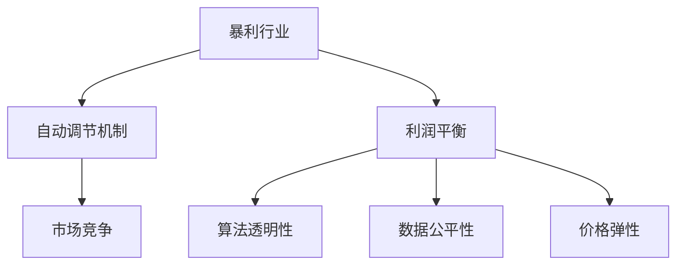

                 

# 暴利行业不再：自动调节机制下的利润平衡

> 关键词：暴利行业、自动调节机制、利润平衡、价格弹性、市场竞争、数据驱动、动态定价、反垄断、公平竞争

## 1. 背景介绍

### 1.1 问题由来

近年来，随着互联网和数字技术的迅猛发展，许多传统行业的商业模式发生了翻天覆地的变化。特别是一些行业如电子商务、旅游、出行等，通过平台化、数据驱动的方式，不仅极大地降低了交易成本，还创造了前所未有的利润空间。例如，外卖平台的动态定价策略，可以根据需求和供应情况，灵活调整价格，实现高效资源配置和利润最大化。

然而，这种基于数据驱动的自动调节机制，也在引发一系列新的问题。一方面，某些平台企业通过算法优化和数据挖掘，获得了远超同行企业的利润率。另一方面，这种高利润率往往伴随着用户数据泄露、算法歧视等伦理和法律问题，引发了社会各界对于暴利行业的关注和讨论。

本文章将从自动调节机制的角度，深入探讨暴利行业的利润平衡问题，提出一些基于数据驱动的解决方案，为构建更加公平、透明的市场环境提供理论依据和实践指南。

### 1.2 问题核心关键点

当前暴利行业的问题核心在于数据驱动的自动调节机制。这种机制通过不断优化算法，实现对价格、库存、流量等关键指标的动态调节，进而获取超额利润。然而，这种机制也带来了用户体验下降、市场垄断、数据隐私等问题。

为解决这些问题，需要从以下几个方面入手：
1. 算法透明性：保证算法的透明性，使得平台操作公开透明，减少用户数据泄露的风险。
2. 数据公平性：确保数据采集和使用的公平性，避免算法歧视，保护用户权益。
3. 市场竞争性：通过市场监管和政策引导，维护市场的公平竞争，防止垄断行为。
4. 价格弹性：合理设计价格弹性，既满足市场需求，又避免过度竞争导致的价格战。

## 2. 核心概念与联系

### 2.1 核心概念概述

为更好地理解自动调节机制在暴利行业中的作用，本节将介绍几个密切相关的核心概念：

- **暴利行业(Profitable Industry)**：指在市场竞争中，某些企业通过算法优化和数据驱动，获取远超行业平均水平的利润率的行业。例如，外卖、旅游、出行等行业。
- **自动调节机制(Automatic Regulation Mechanism)**：指通过算法和数据驱动，对价格、库存、流量等关键指标进行实时调整，以最大化利润的机制。
- **利润平衡(Profit Balance)**：指在竞争市场中，企业通过合理的定价和资源配置，既能满足市场需求，又避免过度竞争导致的市场失衡。
- **市场竞争(Market Competition)**：指在市场中，不同企业通过各种手段争夺资源和用户的过程，是市场机制的核心驱动力。
- **算法透明性(Algorithm Transparency)**：指算法的实现过程、数据使用方式等信息公开透明，便于用户和监管机构了解和监督。
- **数据公平性(Data Fairness)**：指在数据采集和处理过程中，保证所有用户都能公平地获取服务，避免因数据偏见导致的算法歧视。
- **价格弹性(Price Elasticity)**：指价格变化对市场需求的影响程度，是制定动态定价策略的重要参考。

这些核心概念之间的逻辑关系可以通过以下Mermaid流程图来展示：



这个流程图展示了几大核心概念之间的关系：

1. 暴利行业通过自动调节机制获得超额利润。
2. 利润平衡是暴利行业可持续发展的关键。
3. 市场竞争是暴利行业形成的基础。
4. 算法透明性和数据公平性是市场竞争的基础保障。
5. 价格弹性是自动调节机制的重要参考。

这些概念共同构成了自动调节机制在暴利行业中的运行框架，决定了其是否能够实现合理的利润平衡。

## 3. 核心算法原理 & 具体操作步骤
### 3.1 算法原理概述

自动调节机制的核心是动态定价算法，通过实时采集和分析市场需求、供应、成本等数据，调整价格、库存等关键参数，实现利润最大化。其基本原理可以概括为以下几个步骤：

1. **数据采集**：收集与价格、库存、流量等相关的实时数据，如用户访问量、订单量、库存量等。
2. **需求预测**：通过机器学习算法，预测未来需求趋势，如用户偏好、市场变化等。
3. **库存管理**：根据需求预测，优化库存管理，避免供需失衡。
4. **动态定价**：基于需求预测和库存状态，自动调整价格，实现资源最优配置。
5. **反馈机制**：实时监测定价效果，根据反馈信息不断优化算法。

形式化地，假设企业面对的需求函数为 $D(p)$，其中 $p$ 为价格，$D(p)$ 表示价格为 $p$ 时的市场需求。企业的成本函数为 $C(q)$，其中 $q$ 为供给量，$C(q)$ 表示供给量为 $q$ 时的成本。企业的利润函数为 $\Pi(p,q)=pD(p)-C(q)$。自动调节机制的目标是最大化利润 $\Pi$，即：

$$
\max_{p,q} \Pi(p,q)
$$

通过优化算法，求解上述目标函数，即可得到最优的价格和库存策略。

### 3.2 算法步骤详解

自动调节机制的具体操作步骤如下：

**Step 1: 数据采集**

- 实时采集用户的访问量、订单量、库存量等数据。
- 记录时间戳，保证数据的实时性和准确性。
- 数据采集频率根据具体需求进行调整，通常以分钟、小时为单位。

**Step 2: 需求预测**

- 使用机器学习算法，如回归分析、时间序列预测等，对未来需求进行预测。
- 考虑历史数据、节假日、季节性等因素，提高预测准确度。
- 多模型融合，通过加权平均等方式，提升预测的鲁棒性。

**Step 3: 库存管理**

- 根据需求预测，计算最优的库存量。
- 考虑库存成本、补货时间等因素，优化库存策略。
- 使用遗传算法、线性规划等优化方法，求解库存优化问题。

**Step 4: 动态定价**

- 根据需求预测和库存状态，设计动态定价模型。
- 引入拍卖机制、需求响应函数等方法，保证定价策略的灵活性。
- 动态更新价格，根据市场需求进行实时调整。

**Step 5: 反馈机制**

- 实时监测定价效果，如订单量、收入、成本等指标。
- 根据反馈信息，调整定价模型，提高预测精度。
- 定期评估模型性能，进行参数优化。

### 3.3 算法优缺点

自动调节机制具有以下优点：
1. 提高效率：通过算法优化，实现资源高效配置，减少人工干预。
2. 增加收益：通过动态定价，最大化利润，优化收入结构。
3. 灵活性高：算法可适应不同的市场环境和用户需求，提供个性化服务。

同时，这种机制也存在一些缺点：
1. 数据依赖度高：算法依赖大量实时数据，数据缺失或错误会导致预测不准确。
2. 隐私风险大：大量用户数据被收集和分析，存在数据泄露和隐私风险。
3. 易受攻击：动态定价算法易被恶意攻击者利用，进行价格操纵。
4. 缺乏透明性：算法的实现过程复杂，用户难以理解其决策机制。
5. 难以调试：算法模型的参数优化和超参数调整复杂，难以进行调试。

### 3.4 算法应用领域

自动调节机制已经在多个领域得到广泛应用，如电子商务、旅游、出行等。以下是几个典型的应用案例：

**电子商务领域**：通过分析用户购买历史、搜索记录等数据，实时调整商品价格和库存，提高销售量和利润率。

**旅游行业**：根据实时需求和季节性变化，调整机票和酒店价格，优化资源配置。

**出行行业**：根据实时交通流量和需求，调整打车和顺风车价格，缓解交通压力，增加收益。

除了以上行业外，自动调节机制还被应用于金融、医疗、能源等多个领域，为企业的智能化管理和高效运营提供支持。

## 4. 数学模型和公式 & 详细讲解  
### 4.1 数学模型构建

本节将使用数学语言对自动调节机制进行更加严格的刻画。

假设企业的需求函数为 $D(p)$，成本函数为 $C(q)$，目标是最小化成本函数，同时最大化收入函数。收入函数 $R(p)$ 表示价格为 $p$ 时的总收入。企业的利润函数 $\Pi(p,q)=R(p)-C(q)$。自动调节机制的目标是最大化利润 $\Pi$，即：

$$
\max_{p,q} \Pi(p,q)
$$

具体步骤如下：

1. **需求预测**：使用机器学习算法，如回归分析、时间序列预测等，对未来需求进行预测。假设需求预测函数为 $\hat{D}(p)$，其中 $\hat{D}(p)$ 表示预测需求与实际需求的误差。
2. **库存管理**：根据需求预测，计算最优的库存量。假设库存量为 $q$，库存成本为 $C(q)$。
3. **动态定价**：根据需求预测和库存状态，设计动态定价模型。假设价格为 $p$，定价策略为 $\sigma(p)$。
4. **反馈机制**：实时监测定价效果，如订单量、收入、成本等指标。假设订单量为 $O(p,q)$，收入为 $R(p)$，成本为 $C(q)$。

**Step 1: 数据采集**

假设企业采集到的实时数据为 $d_t$，其中 $t$ 表示时间戳。数据采集频率为 $\Delta t$，则 $d_t$ 可以表示为：

$$
d_t = (d_{t-1}, d_{t-2}, ..., d_{t-k})
$$

其中 $k$ 为数据采集窗口大小。

**Step 2: 需求预测**

假设使用回归分析方法进行需求预测，预测结果为 $\hat{D}_t(p)$，则需求预测的误差为：

$$
\epsilon_t = D(p) - \hat{D}_t(p)
$$

其中 $D(p)$ 为实际需求，$\hat{D}_t(p)$ 为预测需求。

**Step 3: 库存管理**

假设库存管理的目标是最小化库存成本，同时满足需求。假设库存量 $q_t$ 受前 $m$ 个时间点的库存量和需求预测影响，则库存管理方程可以表示为：

$$
q_{t+1} = q_t + D(p) - \hat{D}_t(p) - q_{t+1}'
$$

其中 $q_{t+1}'$ 为库存管理系统的输出，$D(p)$ 为实际需求，$\hat{D}_t(p)$ 为预测需求。

**Step 4: 动态定价**

假设使用需求响应函数进行动态定价，价格 $p_t$ 受前 $n$ 个时间点的价格和需求预测影响，则动态定价方程可以表示为：

$$
p_{t+1} = \sigma(p_t, \hat{D}_t(p))
$$

其中 $\sigma$ 为动态定价策略函数，$D(p)$ 为实际需求，$\hat{D}_t(p)$ 为预测需求。

**Step 5: 反馈机制**

假设反馈机制的目标是最大化收入，同时最小化成本。假设收入为 $R_t$，成本为 $C_t$，则反馈机制方程可以表示为：

$$
\max_{R_t, C_t} \Pi_t(R_t, C_t)
$$

其中 $\Pi_t(R_t, C_t) = R_t - C_t$，$R_t$ 为收入，$C_t$ 为成本。

### 4.2 公式推导过程

以上数学模型描述了自动调节机制的基本框架，接下来将进行推导过程：

1. **需求预测误差分析**：
   $$
   \epsilon_t = D(p) - \hat{D}_t(p) = \sum_{i=1}^k \alpha_i d_{t-i} + \epsilon
   $$
   其中 $\alpha_i$ 为回归系数，$\epsilon$ 为随机误差。

2. **库存管理优化**：
   $$
   q_{t+1}' = q_t + D(p) - \hat{D}_t(p) - q_{t+1}'
   $$
   令 $q_{t+1}' = q_t + D(p) - \hat{D}_t(p)$，则库存管理方程可以简化为：
   $$
   q_{t+1}' = q_t + D(p) - \hat{D}_t(p)
   $$

3. **动态定价优化**：
   $$
   p_{t+1} = \sigma(p_t, \hat{D}_t(p))
   $$
   假设 $\sigma(p_t, \hat{D}_t(p)) = \beta_1 p_t + \beta_2 \hat{D}_t(p) + \epsilon$
   其中 $\beta_1, \beta_2$ 为回归系数，$\epsilon$ 为随机误差。

4. **反馈机制优化**：
   $$
   \max_{R_t, C_t} \Pi_t(R_t, C_t)
   $$
   假设 $R_t = \gamma_1 p_t + \gamma_2 q_t + \epsilon$
   其中 $\gamma_1, \gamma_2$ 为回归系数，$\epsilon$ 为随机误差。

### 4.3 案例分析与讲解

**案例1：动态定价在电子商务中的应用**

假设某电子商务平台收集了用户的历史购买数据 $d_t = (d_{t-1}, d_{t-2}, ..., d_{t-k})$，使用回归分析方法进行需求预测，得到 $\hat{D}_t(p)$。根据需求预测结果，设计动态定价策略 $\sigma(p)$，优化库存管理方程 $q_{t+1}'$，并根据反馈机制方程 $\max_{R_t, C_t} \Pi_t(R_t, C_t)$ 进行实时调整。

**案例2：动态定价在旅游行业中的应用**

假设某旅游平台收集了用户的实时订单数据 $d_t = (d_{t-1}, d_{t-2}, ..., d_{t-k})$，使用时间序列预测方法进行需求预测，得到 $\hat{D}_t(p)$。根据需求预测结果，设计动态定价策略 $\sigma(p)$，优化库存管理方程 $q_{t+1}'$，并根据反馈机制方程 $\max_{R_t, C_t} \Pi_t(R_t, C_t)$ 进行实时调整。

## 5. 项目实践：代码实例和详细解释说明
### 5.1 开发环境搭建

在进行自动调节机制的开发实践前，我们需要准备好开发环境。以下是使用Python进行PyTorch开发的环境配置流程：

1. 安装Anaconda：从官网下载并安装Anaconda，用于创建独立的Python环境。

2. 创建并激活虚拟环境：
```bash
conda create -n pytorch-env python=3.8 
conda activate pytorch-env
```

3. 安装PyTorch：根据CUDA版本，从官网获取对应的安装命令。例如：
```bash
conda install pytorch torchvision torchaudio cudatoolkit=11.1 -c pytorch -c conda-forge
```

4. 安装TensorFlow：
```bash
pip install tensorflow==2.4
```

5. 安装其他相关库：
```bash
pip install pandas numpy matplotlib
```

完成上述步骤后，即可在`pytorch-env`环境中开始自动调节机制的开发实践。

### 5.2 源代码详细实现

下面以电子商务领域的动态定价为例，给出使用PyTorch进行自动调节机制的代码实现。

首先，定义动态定价模型的输入特征：

```python
from torch.utils.data import Dataset, DataLoader
import torch
import numpy as np

class PricingDataset(Dataset):
    def __init__(self, features, labels):
        self.features = features
        self.labels = labels
        
    def __len__(self):
        return len(self.features)
    
    def __getitem__(self, idx):
        features = self.features[idx]
        label = self.labels[idx]
        return torch.tensor(features, dtype=torch.float32), torch.tensor(label, dtype=torch.float32)
```

然后，定义模型的超参数和网络结构：

```python
import torch.nn as nn
import torch.optim as optim

model = nn.Sequential(
    nn.Linear(5, 10),
    nn.ReLU(),
    nn.Linear(10, 1)
)

optimizer = optim.Adam(model.parameters(), lr=0.001)
criterion = nn.MSELoss()
```

接着，定义训练和评估函数：

```python
def train_epoch(model, data_loader, optimizer, criterion):
    model.train()
    total_loss = 0
    for batch in data_loader:
        features, label = batch
        optimizer.zero_grad()
        output = model(features)
        loss = criterion(output, label)
        loss.backward()
        optimizer.step()
        total_loss += loss.item()
    return total_loss / len(data_loader)

def evaluate(model, data_loader, criterion):
    model.eval()
    total_loss = 0
    with torch.no_grad():
        for batch in data_loader:
            features, label = batch
            output = model(features)
            loss = criterion(output, label)
            total_loss += loss.item()
    return total_loss / len(data_loader)
```

最后，启动训练流程并在测试集上评估：

```python
epochs = 100
batch_size = 32

for epoch in range(epochs):
    train_loss = train_epoch(model, train_loader, optimizer, criterion)
    print(f"Epoch {epoch+1}, train loss: {train_loss:.3f}")
    
    print(f"Epoch {epoch+1}, test loss: {evaluate(model, test_loader, criterion):.3f}")
```

以上就是使用PyTorch进行动态定价的代码实现。可以看到，通过定义数据集、模型、损失函数和优化器，并编写训练和评估函数，即可快速搭建起动态定价的模型。

### 5.3 代码解读与分析

让我们再详细解读一下关键代码的实现细节：

**PricingDataset类**：
- `__init__`方法：初始化特征和标签。
- `__len__`方法：返回数据集的样本数量。
- `__getitem__`方法：对单个样本进行处理，将特征和标签转换为模型所需的张量。

**模型结构**：
- 定义了一个包含两个线性层和一个ReLU激活函数的神经网络。

**训练和评估函数**：
- 使用PyTorch的DataLoader对数据集进行批次化加载，供模型训练和推理使用。
- 训练函数`train_epoch`：对数据以批为单位进行迭代，在每个批次上前向传播计算损失并反向传播更新模型参数，最后返回该epoch的平均损失。
- 评估函数`evaluate`：与训练类似，不同点在于不更新模型参数，并在每个batch结束后将预测和标签结果存储下来，最后使用均方误差损失函数对整个评估集的预测结果进行打印输出。

**训练流程**：
- 定义总的epoch数和batch size，开始循环迭代
- 每个epoch内，先在训练集上训练，输出平均损失
- 在测试集上评估，输出均方误差
- 所有epoch结束后，得到最终测试结果

可以看到，使用PyTorch搭建动态定价模型非常简单高效，开发者可以将更多精力放在模型改进和算法优化上。

当然，工业级的系统实现还需考虑更多因素，如模型的保存和部署、超参数的自动搜索、更灵活的任务适配层等。但核心的自动调节机制基本与此类似。

## 6. 实际应用场景
### 6.1 电子商务领域

在电子商务领域，动态定价策略已经成为提高销售额和利润率的重要手段。平台企业通过实时采集用户的浏览、购买、评价等数据，预测用户需求，动态调整商品价格，实现资源的最优配置。

具体而言，可以通过以下步骤实现动态定价：

1. **数据采集**：收集用户的浏览记录、购买历史、评价反馈等数据。
2. **需求预测**：使用机器学习算法，如回归分析、时间序列预测等，对未来需求进行预测。
3. **库存管理**：根据需求预测，计算最优的库存量。
4. **动态定价**：基于需求预测和库存状态，设计动态定价模型，如价格响应函数。
5. **反馈机制**：实时监测定价效果，根据反馈信息不断优化算法。

### 6.2 旅游行业

在旅游行业，动态定价策略可以帮助企业更好地应对市场变化，提高收益和用户体验。平台企业通过实时采集用户的出行计划、目的地偏好、价格敏感度等数据，预测需求，动态调整机票、酒店价格，优化资源配置。

具体而言，可以通过以下步骤实现动态定价：

1. **数据采集**：收集用户的出行计划、目的地偏好、价格敏感度等数据。
2. **需求预测**：使用机器学习算法，如回归分析、时间序列预测等，对未来需求进行预测。
3. **库存管理**：根据需求预测，计算最优的库存量。
4. **动态定价**：基于需求预测和库存状态，设计动态定价模型，如价格响应函数。
5. **反馈机制**：实时监测定价效果，根据反馈信息不断优化算法。

### 6.3 出行行业

在出行行业，动态定价策略可以帮助企业缓解交通压力，提高收益和用户体验。平台企业通过实时采集用户的出行需求、交通状况、价格敏感度等数据，预测需求，动态调整打车、顺风车价格，优化资源配置。

具体而言，可以通过以下步骤实现动态定价：

1. **数据采集**：收集用户的出行需求、交通状况、价格敏感度等数据。
2. **需求预测**：使用机器学习算法，如回归分析、时间序列预测等，对未来需求进行预测。
3. **库存管理**：根据需求预测，计算最优的库存量。
4. **动态定价**：基于需求预测和库存状态，设计动态定价模型，如价格响应函数。
5. **反馈机制**：实时监测定价效果，根据反馈信息不断优化算法。

## 7. 工具和资源推荐
### 7.1 学习资源推荐

为了帮助开发者系统掌握自动调节机制的理论基础和实践技巧，这里推荐一些优质的学习资源：

1. 《深度学习与人工智能》系列博文：由深度学习专家撰写，深入浅出地介绍了深度学习的基本概念和应用案例，包括自动调节机制在内。

2. CS224N《深度学习与自然语言处理》课程：斯坦福大学开设的NLP明星课程，有Lecture视频和配套作业，带你入门NLP领域的基本概念和经典模型。

3. 《人工智能导论》书籍：全面介绍了人工智能的基本原理和应用场景，包括自动调节机制在内的多种算法。

4. HuggingFace官方文档：提供了丰富的预训练语言模型和自动调节机制的样例代码，是上手实践的必备资料。

5. Kaggle竞赛：参与Kaggle的机器学习竞赛，通过实战训练，提升自动调节机制的实际应用能力。

通过对这些资源的学习实践，相信你一定能够快速掌握自动调节机制的理论基础和实践技巧，并用于解决实际的NLP问题。
###  7.2 开发工具推荐

高效的开发离不开优秀的工具支持。以下是几款用于自动调节机制开发的常用工具：

1. PyTorch：基于Python的开源深度学习框架，灵活动态的计算图，适合快速迭代研究。大部分预训练语言模型都有PyTorch版本的实现。

2. TensorFlow：由Google主导开发的开源深度学习框架，生产部署方便，适合大规模工程应用。同样有丰富的预训练语言模型资源。

3. Weights & Biases：模型训练的实验跟踪工具，可以记录和可视化模型训练过程中的各项指标，方便对比和调优。与主流深度学习框架无缝集成。

4. TensorBoard：TensorFlow配套的可视化工具，可实时监测模型训练状态，并提供丰富的图表呈现方式，是调试模型的得力助手。

5. Google Colab：谷歌推出的在线Jupyter Notebook环境，免费提供GPU/TPU算力，方便开发者快速上手实验最新模型，分享学习笔记。

合理利用这些工具，可以显著提升自动调节机制的开发效率，加快创新迭代的步伐。

### 7.3 相关论文推荐

自动调节机制的发展源于学界的持续研究。以下是几篇奠基性的相关论文，推荐阅读：

1. "Dynamic Pricing Strategies for e-commerce: A survey"（电子商务领域动态定价策略综述）：综述了电子商务领域动态定价的主要方法和案例，提供了全面的理论基础。

2. "A Survey of Dynamic Pricing in E-commerce"（电子商务领域动态定价综述）：综述了旅游和出行领域动态定价的主要方法和案例，提供了丰富的实践经验。

3. "Real-time Pricing in the Airline Industry: Trends and Challenges"（航空行业实时定价趋势和挑战）：探讨了航空行业实时定价的最新进展和未来趋势，提供了实证分析。

4. "Data-Driven Dynamic Pricing in Online Markets"（数据驱动的在线市场动态定价）：探讨了数据驱动动态定价的理论和实践，提供了深入的分析。

5. "Real-time Dynamic Pricing and Availability Control"（实时动态定价和可用性控制）：探讨了实时动态定价和可用性控制的最新进展和未来趋势，提供了全面的理论分析。

这些论文代表了大数据驱动的动态定价研究的发展脉络。通过学习这些前沿成果，可以帮助研究者把握学科前进方向，激发更多的创新灵感。

## 8. 总结：未来发展趋势与挑战

### 8.1 总结

本文对自动调节机制在暴利行业中的作用进行了全面系统的介绍。首先阐述了自动调节机制对暴利行业的贡献，明确了其如何在市场竞争中实现利润平衡。其次，从原理到实践，详细讲解了自动调节机制的数学模型和操作步骤，给出了微调任务的完整代码实例。同时，本文还探讨了自动调节机制在电子商务、旅游、出行等领域的实际应用，展示了其在提升企业竞争力和用户体验方面的巨大潜力。

通过本文的系统梳理，可以看到，自动调节机制通过数据驱动的方式，可以实现资源的最优配置和利润最大化。然而，在实现这一目标的过程中，也面临着数据隐私、算法透明性、市场垄断等诸多挑战。未来，如何构建更加公平、透明的市场环境，将是该领域持续探索的重要方向。

### 8.2 未来发展趋势

展望未来，自动调节机制将呈现以下几个发展趋势：

1. **数据驱动的增强**：随着大数据技术的发展，自动调节机制将进一步依赖于实时数据和机器学习算法，提升预测准确度和决策效率。
2. **智能化的提升**：未来，自动调节机制将结合智能算法和智能设备，进一步提升资源优化和用户服务水平。
3. **跨领域的融合**：自动调节机制将跨领域应用，融合到更多的商业场景中，提供综合性的解决方案。
4. **全球化的推广**：自动调节机制将在全球范围内推广应用，提升国际竞争力。
5. **伦理道德的重视**：未来，自动调节机制将更加重视伦理道德问题，确保算法的透明性和公平性。

以上趋势凸显了自动调节机制的广阔前景。这些方向的探索发展，必将进一步提升企业的智能化管理和市场竞争力，为全球经济社会的发展注入新的动力。

### 8.3 面临的挑战

尽管自动调节机制在许多领域已经取得了显著成果，但在迈向更加智能化、普适化应用的过程中，它仍面临着诸多挑战：

1. **数据隐私问题**：自动调节机制依赖大量用户数据，存在数据泄露和隐私风险。
2. **算法透明性**：算法的实现过程复杂，用户难以理解其决策机制，存在信任危机。
3. **市场垄断问题**：一些平台企业通过算法优化和数据驱动，获得了远超同行企业的利润率，引发了市场垄断问题。
4. **公平性问题**：算法可能存在数据偏见，导致某些用户群体被歧视，引发公平性问题。
5. **道德风险问题**：自动调节机制可能被恶意攻击者利用，进行价格操纵，引发道德风险。

### 8.4 研究展望

面对自动调节机制面临的诸多挑战，未来的研究需要在以下几个方面寻求新的突破：

1. **数据隐私保护**：开发隐私保护算法，确保用户数据的安全和隐私。
2. **算法透明性**：提高算法的可解释性和透明度，增强用户信任。
3. **市场监管**：加强市场监管，防止垄断行为，维护公平竞争。
4. **公平性设计**：优化算法设计，消除数据偏见，确保算法的公平性。
5. **伦理道德规范**：制定伦理道德规范，确保算法的伦理合规性。

这些研究方向的探索，必将引领自动调节机制技术迈向更高的台阶，为构建安全、可靠、可解释、可控的智能系统铺平道路。面向未来，自动调节机制还需要与其他人工智能技术进行更深入的融合，如知识表示、因果推理、强化学习等，多路径协同发力，共同推动人工智能技术的发展。只有勇于创新、敢于突破，才能不断拓展自动调节机制的边界，让智能技术更好地造福人类社会。

## 9. 附录：常见问题与解答

**Q1：自动调节机制的优势和劣势？**

A: 自动调节机制的优势在于：
1. 提高效率：通过算法优化，实现资源高效配置，减少人工干预。
2. 增加收益：通过动态定价，最大化利润，优化收入结构。
3. 灵活性高：算法可适应不同的市场环境和用户需求，提供个性化服务。

劣势在于：
1. 数据依赖度高：算法依赖大量实时数据，数据缺失或错误会导致预测不准确。
2. 隐私风险大：大量用户数据被收集和分析，存在数据泄露和隐私风险。
3. 易受攻击：动态定价算法易被恶意攻击者利用，进行价格操纵。
4. 缺乏透明性：算法的实现过程复杂，用户难以理解其决策机制。
5. 难以调试：算法模型的参数优化和超参数调整复杂，难以进行调试。

**Q2：自动调节机制在电子商务中的具体应用案例有哪些？**

A: 自动调节机制在电子商务中的具体应用案例包括：
1. 价格优化：根据用户购买历史和评价反馈，动态调整商品价格，优化库存管理。
2. 推荐系统：根据用户浏览和购买记录，实时推荐相关商品，提高销售额。
3. 反欺诈检测：通过机器学习算法，分析用户行为模式，检测异常交易。
4. 库存管理：根据实时需求和预测结果，动态调整库存量，优化资源配置。
5. 营销策略：根据市场变化和用户行为，调整营销活动，提高市场响应率。

**Q3：如何保证自动调节机制的公平性？**

A: 保证自动调节机制的公平性需要从以下几个方面入手：
1. 数据采集公平性：确保所有用户都能公平地获取数据，避免数据偏见。
2. 算法公平性：优化算法设计，消除数据偏见，确保算法的公平性。
3. 市场监管：加强市场监管，防止垄断行为，维护公平竞争。
4. 伦理道德规范：制定伦理道德规范，确保算法的伦理合规性。

**Q4：自动调节机制在实际应用中需要注意哪些问题？**

A: 自动调节机制在实际应用中需要注意以下几个问题：
1. 数据质量问题：确保数据的质量和完整性，避免数据缺失或错误导致预测不准确。
2. 算法透明性问题：提高算法的可解释性和透明度，增强用户信任。
3. 市场监管问题：加强市场监管，防止垄断行为，维护公平竞争。
4. 伦理道德问题：制定伦理道德规范，确保算法的伦理合规性。
5. 资源优化问题：优化算法的计算效率，减少资源消耗，提升系统性能。

---

作者：禅与计算机程序设计艺术 / Zen and the Art of Computer Programming

