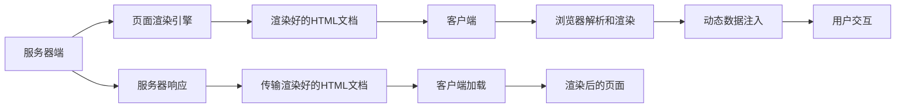

                 

## 1. 背景介绍

### 1.1 问题由来

随着互联网和移动互联网的普及，网页成为了人们获取信息、交流互动的重要工具。传统的客户端渲染(CSR, Client-Side Rendering)模式，即在前端JavaScript中动态生成DOM（文档对象模型），使得页面加载和渲染完全依赖客户端设备，带来了诸如首屏加载慢、用户体验差等问题。为了解决这些问题，服务器端渲染(SSR, Server-Side Rendering)技术应运而生。

服务器端渲染将页面的初始渲染工作放在服务器端完成，仅在客户端加载渲染过的HTML、CSS、JavaScript等静态资源，极大地提升了页面加载速度和用户体验。

### 1.2 问题核心关键点

SSR的核心在于将页面初始渲染工作转移至服务器端，利用服务器的高效性能，实现快速的HTML渲染和数据渲染，然后将渲染后的页面数据传输至客户端。这一过程包括：
- 服务器端初始渲染：服务器通过渲染引擎生成完整的HTML文档。
- 客户端代码注入：将客户端JavaScript代码注入到渲染后的HTML文档中。
- 网络传输：将渲染好的页面数据通过网络传输至客户端。
- 客户端渲染：客户端浏览器解析渲染后的页面数据，执行JavaScript代码，实现动态效果。

SSR的优点包括：
- 首屏加载速度快：服务器端生成完整页面后传输至客户端，减少了客户端JavaScript代码的加载和解析时间。
- 提升用户体验：页面渲染速度更快，用户体验更佳。
- 可缓存性强：静态资源缓存效果更好，提升了网站性能。

然而，SSR也存在以下缺点：
- 初始加载占用服务器资源：在服务器端进行页面渲染，可能会占用更多资源。
- 开发复杂度高：需要同时维护前后端代码，增加了开发复杂度。
- 网络传输依赖：依赖网络传输速度，网络不稳定时可能影响用户体验。

## 2. 核心概念与联系

### 2.1 核心概念概述

为了深入理解SSR的工作原理，我们首先介绍几个核心概念：

- **Server-Side Rendering (SSR)**：服务器端渲染，即将页面渲染工作放在服务器端完成，然后将渲染好的页面数据传输至客户端。
- **Client-Side Rendering (CSR)**：客户端渲染，即在前端JavaScript中动态生成DOM，页面渲染完全依赖客户端设备。
- **页面渲染(Paging Rendering)**：通过JavaScript等脚本语言，生成页面上的DOM元素，构建出完整页面。
- **页面渲染引擎**：如React、Vue等，提供前端页面渲染的核心功能。
- **静态资源(Static Resource)**：如HTML、CSS、JavaScript等，用于构建页面结构和交互逻辑。
- **动态数据(Dynamic Data)**：需要在客户端根据用户行为或服务器数据动态生成的数据。

这些核心概念之间有着紧密的联系。SSR与CSR相辅相成，共同构成前端开发的基础框架。通过SSR，服务器端负责渲染静态资源和初始渲染页面，CSR则负责动态数据的注入和交互逻辑的处理。

### 2.2 核心概念原理和架构的 Mermaid 流程图



该图展示了SSR的总体架构：
1. 服务器端通过渲染引擎生成渲染好的HTML文档。
2. 服务器响应，将渲染好的HTML文档传输至客户端。
3. 客户端浏览器解析渲染后的HTML文档，执行JavaScript代码。
4. 客户端根据用户交互行为，动态注入数据，实现页面动态效果。

SSR和CSR两种模式通过网络交互协同工作，各自发挥优势，提升前端开发的整体性能。

## 3. 核心算法原理 & 具体操作步骤

### 3.1 算法原理概述

服务器端渲染的原理主要是将初始渲染工作放在服务器端完成，具体流程包括：
1. 服务器接收到客户端请求，解析请求参数，获取需要渲染的URL。
2. 服务器端渲染引擎对请求URL对应的页面进行渲染，生成完整的HTML文档。
3. 服务器将渲染好的HTML文档传输至客户端。
4. 客户端浏览器解析渲染好的HTML文档，执行JavaScript代码，实现动态效果。

### 3.2 算法步骤详解

SSR的具体操作步骤如下：

1. **页面路由**：根据URL路由到对应的组件或模板，进行页面渲染。
2. **渲染引擎**：通过渲染引擎生成完整的HTML文档，一般使用React、Vue等前端框架。
3. **数据渲染**：渲染引擎根据当前请求获取动态数据，如用户登录状态、商品价格等，将这些数据渲染到页面上。
4. **传输页面数据**：将渲染好的HTML文档通过HTTP协议传输至客户端。
5. **客户端渲染**：客户端浏览器解析渲染好的HTML文档，执行JavaScript代码，实现动态效果。

### 3.3 算法优缺点

#### 优点：
- **提升首屏加载速度**：通过服务器端渲染，减少了客户端JavaScript代码的加载和解析时间，页面加载更快。
- **提升用户体验**：页面渲染更快，用户体验更佳。
- **可缓存性强**：静态资源缓存效果更好，提升了网站性能。

#### 缺点：
- **初始加载占用服务器资源**：在服务器端进行页面渲染，可能会占用更多资源。
- **开发复杂度高**：需要同时维护前后端代码，增加了开发复杂度。
- **网络传输依赖**：依赖网络传输速度，网络不稳定时可能影响用户体验。

### 3.4 算法应用领域

SSR在以下领域具有广泛的应用：

- **电商网站**：通过服务器端渲染，可以快速展示商品列表和商品详情，提升用户体验。
- **内容平台**：通过SSR，可以快速生成文章页面，提升内容加载速度和阅读体验。
- **企业应用**：通过SSR，可以快速生成应用页面，提升系统性能和用户体验。

此外，SSR在SEO（搜索引擎优化）、数据分析等方面也有重要应用，提升了网站的搜索排名和数据追踪效果。

## 4. 数学模型和公式 & 详细讲解 & 举例说明

### 4.1 数学模型构建

在服务器端渲染中，页面渲染的过程可以用以下数学模型来描述：

- 设 $P$ 为页面渲染所需的所有数据，$F(P)$ 表示渲染引擎将数据 $P$ 渲染成完整HTML文档的过程。
- 设 $T$ 为传输渲染好的HTML文档到客户端所需的时间。
- 设 $R$ 为客户端浏览器解析渲染好的HTML文档，并执行JavaScript代码所需的时间。

因此，SSR的总耗时 $T_{ssr}$ 为：

$$
T_{ssr} = T + R
$$

### 4.2 公式推导过程

对于具体的渲染过程，设渲染引擎需要 $t_1$ 时间渲染数据 $P$，需要 $t_2$ 时间传输渲染好的HTML文档到客户端，客户端浏览器需要 $t_3$ 时间解析渲染好的HTML文档，并执行JavaScript代码。

因此，总耗时 $T_{ssr}$ 可以进一步分解为：

$$
T_{ssr} = t_1 + t_2 + t_3
$$

### 4.3 案例分析与讲解

以电商网站的商品详情页为例，使用SSR渲染的过程如下：

1. 服务器收到客户端请求，获取商品详情页面所需的数据，如商品信息、库存量等。
2. 渲染引擎（如React）将数据渲染成完整的HTML文档。
3. 服务器将渲染好的HTML文档传输至客户端。
4. 客户端浏览器解析渲染好的HTML文档，执行JavaScript代码，显示商品信息、渲染动态效果等。

SSR通过将页面初始渲染工作转移至服务器端，减少了客户端JavaScript代码的加载和解析时间，提升了页面加载速度和用户体验。

## 5. 项目实践：代码实例和详细解释说明

### 5.1 开发环境搭建

为了进行SSR开发，需要以下开发环境：

1. 服务器：如Nginx、Apache等，负责接收客户端请求和传输数据。
2. 渲染引擎：如React、Vue等，负责页面渲染。
3. 数据库：如MySQL、MongoDB等，用于存储动态数据。

### 5.2 源代码详细实现

以下是一个使用React进行服务器端渲染的代码实现：

```javascript
import React from 'react';
import ReactDOMServer from 'react-dom/server';

const App = () => (
  <div>
    <h1>Welcome to SSR Example</h1>
    <p>This is a server-side rendered page.</p>
  </div>
);

const html = ReactDOMServer.renderToString(App);
const app = ReactDOMServer.hydrate(<App />, document.getElementById('root'));
```

以上代码实现了React的服务器端渲染，生成完整的HTML文档，并通过`ReactDOMServer.hydrate`方法将渲染后的页面传输至客户端。

### 5.3 代码解读与分析

**ReactDOMServer.renderToString**方法将React组件渲染成完整的HTML文档。该方法会遍历组件树，生成对应的HTML标签，并将标签内容作为字符串返回。

**ReactDOMServer.hydrate**方法将渲染好的HTML文档传输至客户端，并在客户端解析渲染。该方法会遍历渲染好的HTML文档，将需要动态渲染的部分注入到页面中，实现动态效果。

### 5.4 运行结果展示

运行上述代码后，将得到如下渲染好的HTML文档：

```html
<html>
  <body>
    <div id="root">
      <h1>Welcome to SSR Example</h1>
      <p>This is a server-side rendered page.</p>
    </div>
  </body>
</html>
```

该HTML文档在客户端浏览器中解析渲染后，将呈现如下页面：

```html
<h1>Welcome to SSR Example</h1>
<p>This is a server-side rendered page.</p>
```

## 6. 实际应用场景

### 6.1 电商网站

电商网站是SSR应用的典型场景。通过SSR，电商网站可以快速展示商品列表和商品详情，提升用户体验。例如，Amazon等大型电商网站均使用SSR技术进行页面渲染。

### 6.2 内容平台

内容平台如Medium、知乎等，通过SSR可以快速生成文章页面，提升内容加载速度和阅读体验。

### 6.3 企业应用

企业应用如CRM（客户关系管理）、ERP（企业资源计划）等，通过SSR可以快速生成应用页面，提升系统性能和用户体验。

### 6.4 未来应用展望

未来，SSR技术将在更多领域得到应用，如智能家居、智慧城市、虚拟现实等。通过SSR，可以实现更加高效、流畅的交互体验，提升应用性能和用户体验。

## 7. 工具和资源推荐

### 7.1 学习资源推荐

为了帮助开发者系统掌握SSR技术，以下是一些优质的学习资源：

1. 《SSR原理与实践》系列博文：详细介绍了SSR的原理、流程和实践方法，适合初学者和进阶开发者。
2. 《Node.js Server-Side Rendering》书籍：由Node.js专家撰写，介绍了Node.js环境下SSR的实现方法和最佳实践。
3 《React Server Side Rendering》官方文档：React官方文档，详细介绍了React的SSR特性和实现方法。
4 《Vue Server Side Rendering》官方文档：Vue官方文档，详细介绍了Vue的SSR特性和实现方法。
5 《SSR实战》视频课程：由知名技术博主推出，系统讲解了SSR的原理、实践和应用案例。

通过对这些资源的学习实践，相信你一定能够快速掌握SSR技术的精髓，并用于解决实际的NLP问题。

### 7.2 开发工具推荐

高效的开发离不开优秀的工具支持。以下是几款用于SSR开发的常用工具：

1. Node.js：基于JavaScript的运行环境，适用于服务器端渲染。
2. React：Facebook开源的前端框架，提供了强大的组件化开发能力。
3. Vue：由尤雨溪等人开发的前端框架，提供高效的页面渲染和组件化开发能力。
4. webpack：JavaScript打包工具，支持SSR的配置和使用。
5. Next.js：React框架的SSR版本，提供了自动化配置和优化工具，适用于中大型应用。

合理利用这些工具，可以显著提升SSR任务的开发效率，加快创新迭代的步伐。

### 7.3 相关论文推荐

SSR技术的发展源于学界的持续研究。以下是几篇奠基性的相关论文，推荐阅读：

1. *Meteor: Server-side Rendering with Data*：介绍了一种基于SSR和数据渲染的PageRank算法，提出了动态数据渲染的策略。
2. *Single-Page Applications with Server-Side Rendering*：探讨了在SPA中应用SSR的优化策略，如懒加载、组件生命周期等。
3. *Web Server-Side Rendering*：介绍了SSR的发展历程和应用场景，提出了多种SSR的实现方法。
4 *React Server Side Rendering*：React官方文档，详细介绍了React的SSR特性和实现方法。
5 *Vue Server Side Rendering*：Vue官方文档，详细介绍了Vue的SSR特性和实现方法。

这些论文代表了大语言模型微调技术的发展脉络。通过学习这些前沿成果，可以帮助研究者把握学科前进方向，激发更多的创新灵感。

## 8. 总结：未来发展趋势与挑战

### 8.1 总结

本文对服务器端渲染技术进行了全面系统的介绍。首先阐述了SSR技术的背景和意义，明确了SSR在提升页面加载速度和用户体验方面的独特价值。其次，从原理到实践，详细讲解了SSR的数学模型和核心操作步骤，给出了SSR任务开发的完整代码实例。同时，本文还广泛探讨了SSR技术在电商网站、内容平台、企业应用等多个行业领域的应用前景，展示了SSR技术的巨大潜力。此外，本文精选了SSR技术的各类学习资源，力求为读者提供全方位的技术指引。

通过本文的系统梳理，可以看到，SSR技术正在成为Web前端开发的重要范式，极大地提升了Web应用的性能和用户体验。未来，伴随SSR技术的不断发展，Web应用的渲染方式将发生根本性的变化，带来更流畅、更高效的Web体验。

### 8.2 未来发展趋势

展望未来，SSR技术将呈现以下几个发展趋势：

1. **SSR与CSR的融合**：未来的SSR将更加注重与CSR的融合，发挥各自优势，提升整体性能。
2. **静态资源和动态数据的分离**：通过静态资源和动态数据的分离，提升渲染效率和优化效果。
3. **多端渲染的统一**：SSR技术将支持跨端渲染，实现多端一致的渲染效果。
4. **全栈开发**：未来的开发环境将更加融合前后端代码，提升开发效率和性能。
5. **实时渲染和动态数据更新**：通过实时渲染和动态数据更新，提升用户体验和交互流畅性。

以上趋势凸显了SSR技术的广阔前景。这些方向的探索发展，必将进一步提升Web应用的性能和用户体验，为Web技术的发展带来深远影响。

### 8.3 面临的挑战

尽管SSR技术已经取得了瞩目成就，但在迈向更加智能化、普适化应用的过程中，它仍面临着诸多挑战：

1. **开发复杂度高**：需要同时维护前后端代码，增加了开发复杂度。
2. **性能优化困难**：需要在服务器端进行初始渲染，可能会占用更多资源。
3. **网络传输依赖**：依赖网络传输速度，网络不稳定时可能影响用户体验。
4. **可维护性差**：代码逻辑复杂，维护困难。
5. **新技术适配**：需要不断更新和适配新技术，提升开发效率。

尽管存在这些挑战，但SSR作为提升Web应用性能的重要手段，仍有广阔的发展前景和应用空间。

### 8.4 研究展望

未来的SSR研究需要在以下几个方面寻求新的突破：

1. **优化渲染引擎**：提升渲染引擎的渲染效率和性能，降低服务器端渲染的资源消耗。
2. **静态资源和动态数据的分离**：通过分离静态资源和动态数据，提升渲染效率和优化效果。
3. **实时渲染和动态数据更新**：通过实时渲染和动态数据更新，提升用户体验和交互流畅性。
4. **多端渲染的统一**：SSR技术将支持跨端渲染，实现多端一致的渲染效果。
5. **全栈开发**：未来的开发环境将更加融合前后端代码，提升开发效率和性能。

这些研究方向的探索，必将引领SSR技术迈向更高的台阶，为构建更高效、更流畅的Web应用奠定基础。面向未来，SSR技术还需要与其他Web技术进行更深入的融合，如PWA（Progressive Web App）、Firebase等，共同推动Web技术的发展。

## 9. 附录：常见问题与解答

**Q1: 什么是服务器端渲染（SSR）？**

A: 服务器端渲染（SSR）是指将页面初始渲染工作放在服务器端完成，然后将渲染好的页面数据传输至客户端。SSR可以将渲染工作放在服务器端进行，减少了客户端JavaScript代码的加载和解析时间，提升了页面加载速度和用户体验。

**Q2: SSR和CSR有什么区别？**

A: SSR和CSR都是Web前端渲染的方式。CSR在前端JavaScript中动态生成DOM，页面渲染完全依赖客户端设备。而SSR将页面初始渲染工作放在服务器端完成，然后将渲染好的页面数据传输至客户端。SSR可以提升页面加载速度和用户体验，但开发复杂度高。

**Q3: 如何提升SSR性能？**

A: 提升SSR性能的方法包括：
1. 优化渲染引擎：提升渲染引擎的渲染效率和性能。
2. 静态资源和动态数据的分离：通过分离静态资源和动态数据，提升渲染效率和优化效果。
3. 实时渲染和动态数据更新：通过实时渲染和动态数据更新，提升用户体验和交互流畅性。

**Q4: SSR在开发中需要注意哪些问题？**

A: SSR在开发中需要注意以下问题：
1. 开发复杂度高：需要同时维护前后端代码。
2. 性能优化困难：需要在服务器端进行初始渲染，可能会占用更多资源。
3. 网络传输依赖：依赖网络传输速度，网络不稳定时可能影响用户体验。

**Q5: SSR与CSR的融合趋势是什么？**

A: 未来的SSR将更加注重与CSR的融合，发挥各自优势，提升整体性能。SSR与CSR的融合，可以提升渲染效率和用户体验，同时降低开发复杂度。

---

作者：禅与计算机程序设计艺术 / Zen and the Art of Computer Programming

