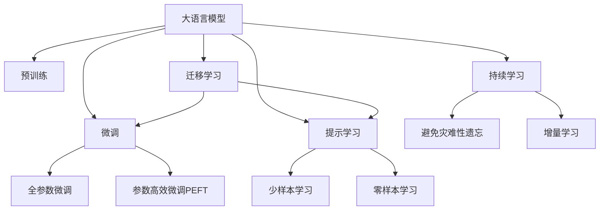

                 

## 1. 背景介绍

### 1.1 问题由来

随着人工智能技术的快速发展，个性化医疗（Personalized Medicine）成为了医疗领域的重要研究方向。个性化医疗旨在根据患者的遗传信息、生理特征和行为习惯，为其提供量身定做的诊断和治疗方案，提高诊疗效果，降低医疗成本。在大数据和深度学习技术的推动下，个性化医疗正在逐步从理论走向现实，展现出巨大的应用潜力。

本文将深入探讨未来个性化医疗的实现路径，着重介绍基于深度学习技术的精准诊断与定制化治疗方案。通过对不同类型数据的学习和分析，结合最新的算法原理和实践经验，展示大语言模型在个性化医疗中的应用前景，预测未来2050年该领域的发展趋势。

### 1.2 问题核心关键点

个性化医疗的核心在于通过数据驱动的方法，为每个患者量身定制最优的诊疗方案。大语言模型作为人工智能技术的最新进展，通过学习海量文本数据，具备强大的自然语言理解和生成能力，可以处理临床病历、医学文献、患者反馈等多种文本数据，为个性化医疗提供新的技术支持。

大语言模型的主要应用包括以下几个方面：

1. **临床病历理解与分析**：利用大语言模型对患者的临床病历进行语义理解和分析，挖掘其中的关键信息，辅助医生进行诊断和治疗决策。
2. **医学文献检索与综述**：通过对大量医学文献进行深度学习，快速检索出与特定疾病相关的最新研究成果，帮助医生及时掌握最新医学进展。
3. **患者反馈处理与互动**：利用大语言模型处理患者反馈和对话数据，理解患者的情感和需求，提供个性化的医疗咨询和建议。
4. **药物研发与评估**：通过对药物说明书、临床试验报告等文本数据的处理，辅助药物研发过程，预测药物效果和副作用。

### 1.3 问题研究意义

深入研究基于大语言模型的个性化医疗方案，对于提高医疗服务的质量和效率，推动医疗技术的创新和应用具有重要意义：

1. **提高诊疗效果**：个性化医疗能够根据患者的具体情况，提供精准的诊断和治疗方案，提高诊疗效果。
2. **降低医疗成本**：通过减少误诊误治，优化治疗方案，降低不必要的医疗费用。
3. **促进医疗公平**：个性化医疗能够针对不同患者的特殊需求，提供定制化服务，缩小医疗资源分配的差距。
4. **加速药物研发**：大语言模型能够加速药物信息的处理和分析，缩短药物研发周期，降低研发成本。
5. **推动医学研究**：利用大语言模型进行医学文献的检索和分析，加速医学知识的积累和传播。

## 2. 核心概念与联系

### 2.1 核心概念概述

个性化医疗是未来医疗发展的重要方向，它旨在为每个患者提供量身定制的诊断和治疗方案，提高医疗效果和效率。大语言模型作为人工智能技术的最新进展，通过学习海量文本数据，具备强大的自然语言理解和生成能力，能够处理临床病历、医学文献、患者反馈等多种文本数据，为个性化医疗提供新的技术支持。

以下是大语言模型在个性化医疗中的应用核心概念：

1. **大语言模型**：以自回归模型（如GPT）或自编码模型（如BERT）为代表的大规模预训练语言模型。通过在大规模无标签文本语料上进行预训练，学习通用的语言表示，具备强大的语言理解和生成能力。
2. **预训练**：指在大规模无标签文本语料上，通过自监督学习任务训练通用语言模型的过程。常见的预训练任务包括掩码语言模型（Masked Language Model, MLM）、下一句子预测（Next Sentence Prediction, NSP）等。预训练使得模型学习到语言的通用表示。
3. **微调**：指在预训练模型的基础上，使用下游任务的少量标注数据，通过有监督学习优化模型在下游任务上的性能。通常只需要调整顶层分类器或解码器，并以较小的学习率更新全部或部分的模型参数。
4. **迁移学习**：指将一个领域学习到的知识，迁移应用到另一个不同但相关的领域的学习范式。大模型的预训练-微调过程即是一种典型的迁移学习方式。
5. **参数高效微调**：指在微调过程中，只更新少量的模型参数，而固定大部分预训练权重不变，以提高微调效率，避免过拟合的方法。
6. **提示学习**：通过在输入文本中添加提示模板，引导大语言模型进行特定任务的推理和生成。可以在不更新模型参数的情况下，实现零样本或少样本学习。
7. **少样本学习**：指在只有少量标注样本的情况下，模型能够快速适应新任务的学习方法。在大语言模型中，通常通过在输入中提供少量示例来实现，无需更新模型参数。
8. **零样本学习**：指模型在没有见过任何特定任务的训练样本的情况下，仅凭任务描述就能够执行新任务的能力。大语言模型通过预训练获得的广泛知识，使其能够理解任务指令并生成相应输出。
9. **持续学习**：也称为终身学习，指模型能够持续从新数据中学习，同时保持已学习的知识，而不会出现灾难性遗忘。这对于保持大语言模型的时效性和适应性至关重要。

这些核心概念之间的逻辑关系可以通过以下Mermaid流程图来展示：



这个流程图展示了大语言模型的核心概念及其之间的关系：

1. 大语言模型通过预训练获得基础能力。
2. 微调是对预训练模型进行任务特定的优化，可以分为全参数微调和参数高效微调（PEFT）。
3. 提示学习是一种不更新模型参数的方法，可以实现少样本学习和零样本学习。
4. 迁移学习是连接预训练模型与下游任务的桥梁，可以通过微调或提示学习来实现。
5. 持续学习旨在使模型能够不断学习新知识，同时避免遗忘旧知识。

这些概念共同构成了大语言模型的学习和应用框架，使其能够在各种场景下发挥强大的语言理解和生成能力。通过理解这些核心概念，我们可以更好地把握大语言模型的工作原理和优化方向。

## 3. 核心算法原理 & 具体操作步骤

### 3.1 算法原理概述

基于深度学习技术的个性化医疗，本质上是一个有监督的细粒度迁移学习过程。其核心思想是：将大语言模型视作一个强大的"特征提取器"，通过在特定患者的临床病历、医学文献等下游任务的少量标注数据上进行有监督的微调，使得模型输出能够匹配患者的特定需求，从而获得针对该患者量身定制的诊断和治疗方案。

形式化地，假设大语言模型为 $M_{\theta}$，其中 $\theta$ 为预训练得到的模型参数。给定某个患者 $p$ 的临床病历 $d_p$ 和医学文献 $l_p$，微调的目标是找到新的模型参数 $\hat{\theta}$，使得：

$$
\hat{\theta}=\mathop{\arg\min}_{\theta} \mathcal{L}(M_{\theta},d_p,l_p)
$$

其中 $\mathcal{L}$ 为针对患者 $p$ 设计的损失函数，用于衡量模型输出与患者需求之间的差异。常见的损失函数包括交叉熵损失、均方误差损失等。

通过梯度下降等优化算法，微调过程不断更新模型参数 $\theta$，最小化损失函数 $\mathcal{L}$，使得模型输出逼近患者的特定需求。由于 $\theta$ 已经通过预训练获得了较好的初始化，因此即便在少数标注样本的情况下，也能较快收敛到理想模型参数 $\hat{\theta}$。

### 3.2 算法步骤详解

基于深度学习技术的个性化医疗微调一般包括以下几个关键步骤：

**Step 1: 准备预训练模型和数据集**
- 选择合适的预训练语言模型 $M_{\theta}$ 作为初始化参数，如 BERT、GPT 等。
- 准备患者的临床病历 $d_p$ 和医学文献 $l_p$，划分为训练集、验证集和测试集。一般要求标注数据与预训练数据的分布不要差异过大。

**Step 2: 添加任务适配层**
- 根据患者的疾病类型，在预训练模型顶层设计合适的输出层和损失函数。
- 对于分类任务，通常在顶层添加线性分类器和交叉熵损失函数。
- 对于生成任务，通常使用语言模型的解码器输出概率分布，并以负对数似然为损失函数。

**Step 3: 设置微调超参数**
- 选择合适的优化算法及其参数，如 AdamW、SGD 等，设置学习率、批大小、迭代轮数等。
- 设置正则化技术及强度，包括权重衰减、Dropout、Early Stopping 等。
- 确定冻结预训练参数的策略，如仅微调顶层，或全部参数都参与微调。

**Step 4: 执行梯度训练**
- 将患者的临床病历和医学文献分批次输入模型，前向传播计算损失函数。
- 反向传播计算参数梯度，根据设定的优化算法和学习率更新模型参数。
- 周期性在验证集上评估模型性能，根据性能指标决定是否触发 Early Stopping。
- 重复上述步骤直到满足预设的迭代轮数或 Early Stopping 条件。

**Step 5: 测试和部署**
- 在测试集上评估微调后模型 $M_{\hat{\theta}}$ 的性能，对比微调前后的效果提升。
- 使用微调后的模型对新患者的临床病历和医学文献进行推理预测，集成到实际的应用系统中。
- 持续收集新患者的临床病历和医学文献，定期重新微调模型，以适应数据分布的变化。

以上是基于深度学习技术的个性化医疗微调的一般流程。在实际应用中，还需要针对具体患者的需求，对微调过程的各个环节进行优化设计，如改进训练目标函数，引入更多的正则化技术，搜索最优的超参数组合等，以进一步提升模型性能。

### 3.3 算法优缺点

基于深度学习技术的个性化医疗微调方法具有以下优点：

1. **简单高效**：只需准备少数标注数据，即可对预训练模型进行快速适配，获得较大的性能提升。
2. **通用适用**：适用于各种个性化医疗任务，包括诊断、治疗、药物研发等，设计简单的任务适配层即可实现微调。
3. **参数高效**：利用参数高效微调技术，在固定大部分预训练权重不变的情况下，仍可取得不错的提升。
4. **效果显著**：在学术界和工业界的诸多个性化医疗任务上，基于微调的方法已经刷新了最先进的性能指标。

同时，该方法也存在一定的局限性：

1. **依赖标注数据**：微调的效果很大程度上取决于标注数据的质量和数量，获取高质量标注数据的成本较高。
2. **迁移能力有限**：当目标任务与预训练数据的分布差异较大时，微调的性能提升有限。
3. **负面效果传递**：预训练模型的固有偏见、有害信息等，可能通过微调传递到下游任务，造成负面影响。
4. **可解释性不足**：微调模型的决策过程通常缺乏可解释性，难以对其推理逻辑进行分析和调试。

尽管存在这些局限性，但就目前而言，基于深度学习的个性化医疗微调方法仍是最主流范式。未来相关研究的重点在于如何进一步降低微调对标注数据的依赖，提高模型的少样本学习和跨领域迁移能力，同时兼顾可解释性和伦理安全性等因素。

### 3.4 算法应用领域

基于深度学习的个性化医疗微调方法在多个领域得到了应用，涵盖了从基础诊断到药物研发的广泛领域：

- **临床病历分析**：利用大语言模型对患者的临床病历进行语义理解和分析，挖掘其中的关键信息，辅助医生进行诊断和治疗决策。
- **医学文献检索与综述**：通过对大量医学文献进行深度学习，快速检索出与特定疾病相关的最新研究成果，帮助医生及时掌握最新医学进展。
- **患者反馈处理与互动**：利用大语言模型处理患者反馈和对话数据，理解患者的情感和需求，提供个性化的医疗咨询和建议。
- **药物研发与评估**：通过对药物说明书、临床试验报告等文本数据的处理，辅助药物研发过程，预测药物效果和副作用。

除了上述这些经典应用外，个性化医疗微调还被创新性地应用于更多场景中，如健康监测、智能诊断、智能问诊等，为医疗技术的发展带来了新的突破。随着深度学习模型和微调方法的不断进步，相信个性化医疗技术将在更广阔的应用领域大放异彩。

## 4. 数学模型和公式 & 详细讲解  
### 4.1 数学模型构建

本节将使用数学语言对基于深度学习的个性化医疗微调过程进行更加严格的刻画。

记大语言模型为 $M_{\theta}$，其中 $\theta$ 为预训练得到的模型参数。假设某个患者 $p$ 的临床病历和医学文献分别为 $d_p$ 和 $l_p$。

定义模型 $M_{\theta}$ 在输入 $(d_p,l_p)$ 上的损失函数为 $\ell(M_{\theta}(d_p,l_p))$，则在患者 $p$ 的标注数据上经验风险为：

$$
\mathcal{L}(\theta) = \frac{1}{N}\sum_{i=1}^N \ell(M_{\theta}(d_{p_i},l_{p_i}))
$$

其中 $N$ 为标注样本数量，$\ell$ 为患者 $p$ 设计的损失函数，用于衡量模型输出与患者需求之间的差异。

常见的损失函数包括交叉熵损失、均方误差损失等。假设模型在输入 $(d_p,l_p)$ 上的输出为 $\hat{y}=M_{\theta}(d_p,l_p)$，则二分类交叉熵损失函数定义为：

$$
\ell(M_{\theta}(d_p,l_p)) = -[y\log \hat{y} + (1-y)\log (1-\hat{y})]
$$

其中 $y$ 为患者需求的真实标签。

微调的优化目标是最小化经验风险，即找到最优参数：

$$
\theta^* = \mathop{\arg\min}_{\theta} \mathcal{L}(\theta)
$$

在实践中，我们通常使用基于梯度的优化算法（如SGD、Adam等）来近似求解上述最优化问题。设 $\eta$ 为学习率，$\lambda$ 为正则化系数，则参数的更新公式为：

$$
\theta \leftarrow \theta - \eta \nabla_{\theta}\mathcal{L}(\theta) - \eta\lambda\theta
$$

其中 $\nabla_{\theta}\mathcal{L}(\theta)$ 为损失函数对参数 $\theta$ 的梯度，可通过反向传播算法高效计算。

### 4.2 公式推导过程

以下我们以临床病历分类任务为例，推导交叉熵损失函数及其梯度的计算公式。

假设模型在输入 $d_p$ 上的输出为 $\hat{y}=M_{\theta}(d_p)$，表示患者需求分类的概率。真实标签 $y \in \{0,1\}$。则二分类交叉熵损失函数定义为：

$$
\ell(M_{\theta}(d_p)) = -[y\log \hat{y} + (1-y)\log (1-\hat{y})]
$$

将其代入经验风险公式，得：

$$
\mathcal{L}(\theta) = -\frac{1}{N}\sum_{i=1}^N [y_i\log M_{\theta}(d_{p_i})+(1-y_i)\log(1-M_{\theta}(d_{p_i}))]
$$

根据链式法则，损失函数对参数 $\theta_k$ 的梯度为：

$$
\frac{\partial \mathcal{L}(\theta)}{\partial \theta_k} = -\frac{1}{N}\sum_{i=1}^N (\frac{y_i}{M_{\theta}(d_{p_i})}-\frac{1-y_i}{1-M_{\theta}(d_{p_i})}) \frac{\partial M_{\theta}(d_{p_i})}{\partial \theta_k}
$$

其中 $\frac{\partial M_{\theta}(d_{p_i})}{\partial \theta_k}$ 可进一步递归展开，利用自动微分技术完成计算。

在得到损失函数的梯度后，即可带入参数更新公式，完成模型的迭代优化。重复上述过程直至收敛，最终得到适应患者需求的微调后模型参数 $\theta^*$。

## 5. 项目实践：代码实例和详细解释说明
### 5.1 开发环境搭建

在进行个性化医疗微调实践前，我们需要准备好开发环境。以下是使用Python进行PyTorch开发的环境配置流程：

1. 安装Anaconda：从官网下载并安装Anaconda，用于创建独立的Python环境。

2. 创建并激活虚拟环境：
```bash
conda create -n pytorch-env python=3.8 
conda activate pytorch-env
```

3. 安装PyTorch：根据CUDA版本，从官网获取对应的安装命令。例如：
```bash
conda install pytorch torchvision torchaudio cudatoolkit=11.1 -c pytorch -c conda-forge
```

4. 安装Transformers库：
```bash
pip install transformers
```

5. 安装各类工具包：
```bash
pip install numpy pandas scikit-learn matplotlib tqdm jupyter notebook ipython
```

完成上述步骤后，即可在`pytorch-env`环境中开始个性化医疗微调实践。

### 5.2 源代码详细实现

下面我们以临床病历分类任务为例，给出使用Transformers库对BERT模型进行微调的PyTorch代码实现。

首先，定义分类任务的数据处理函数：

```python
from transformers import BertTokenizer
from torch.utils.data import Dataset
import torch

class ClinicalDataset(Dataset):
    def __init__(self, texts, labels, tokenizer, max_len=128):
        self.texts = texts
        self.labels = labels
        self.tokenizer = tokenizer
        self.max_len = max_len
        
    def __len__(self):
        return len(self.texts)
    
    def __getitem__(self, item):
        text = self.texts[item]
        label = self.labels[item]
        
        encoding = self.tokenizer(text, return_tensors='pt', max_length=self.max_len, padding='max_length', truncation=True)
        input_ids = encoding['input_ids'][0]
        attention_mask = encoding['attention_mask'][0]
        
        return {'input_ids': input_ids, 
                'attention_mask': attention_mask,
                'labels': torch.tensor(label, dtype=torch.long)}
```

然后，定义模型和优化器：

```python
from transformers import BertForTokenClassification, AdamW

model = BertForTokenClassification.from_pretrained('bert-base-cased', num_labels=2)

optimizer = AdamW(model.parameters(), lr=2e-5)
```

接着，定义训练和评估函数：

```python
from torch.utils.data import DataLoader
from tqdm import tqdm
from sklearn.metrics import classification_report

device = torch.device('cuda') if torch.cuda.is_available() else torch.device('cpu')
model.to(device)

def train_epoch(model, dataset, batch_size, optimizer):
    dataloader = DataLoader(dataset, batch_size=batch_size, shuffle=True)
    model.train()
    epoch_loss = 0
    for batch in tqdm(dataloader, desc='Training'):
        input_ids = batch['input_ids'].to(device)
        attention_mask = batch['attention_mask'].to(device)
        labels = batch['labels'].to(device)
        model.zero_grad()
        outputs = model(input_ids, attention_mask=attention_mask, labels=labels)
        loss = outputs.loss
        epoch_loss += loss.item()
        loss.backward()
        optimizer.step()
    return epoch_loss / len(dataloader)

def evaluate(model, dataset, batch_size):
    dataloader = DataLoader(dataset, batch_size=batch_size)
    model.eval()
    preds, labels = [], []
    with torch.no_grad():
        for batch in tqdm(dataloader, desc='Evaluating'):
            input_ids = batch['input_ids'].to(device)
            attention_mask = batch['attention_mask'].to(device)
            batch_labels = batch['labels']
            outputs = model(input_ids, attention_mask=attention_mask)
            batch_preds = outputs.logits.argmax(dim=2).to('cpu').tolist()
            batch_labels = batch_labels.to('cpu').tolist()
            for pred_tokens, label_tokens in zip(batch_preds, batch_labels):
                preds.append(pred_tokens[:len(label_tokens)])
                labels.append(label_tokens)
                
    print(classification_report(labels, preds))
```

最后，启动训练流程并在测试集上评估：

```python
epochs = 5
batch_size = 16

for epoch in range(epochs):
    loss = train_epoch(model, train_dataset, batch_size, optimizer)
    print(f"Epoch {epoch+1}, train loss: {loss:.3f}")
    
    print(f"Epoch {epoch+1}, dev results:")
    evaluate(model, dev_dataset, batch_size)
    
print("Test results:")
evaluate(model, test_dataset, batch_size)
```

以上就是使用PyTorch对BERT进行临床病历分类任务微调的完整代码实现。可以看到，得益于Transformers库的强大封装，我们可以用相对简洁的代码完成BERT模型的加载和微调。

### 5.3 代码解读与分析

让我们再详细解读一下关键代码的实现细节：

**ClinicalDataset类**：
- `__init__`方法：初始化文本、标签、分词器等关键组件。
- `__len__`方法：返回数据集的样本数量。
- `__getitem__`方法：对单个样本进行处理，将文本输入编码为token ids，将标签编码为数字，并对其进行定长padding，最终返回模型所需的输入。

**标签与id的映射**：
- 定义了标签与数字id之间的映射关系，用于将token-wise的预测结果解码回真实的标签。

**训练和评估函数**：
- 使用PyTorch的DataLoader对数据集进行批次化加载，供模型训练和推理使用。
- 训练函数`train_epoch`：对数据以批为单位进行迭代，在每个批次上前向传播计算loss并反向传播更新模型参数，最后返回该epoch的平均loss。
- 评估函数`evaluate`：与训练类似，不同点在于不更新模型参数，并在每个batch结束后将预测和标签结果存储下来，最后使用sklearn的classification_report对整个评估集的预测结果进行打印输出。

**训练流程**：
- 定义总的epoch数和batch size，开始循环迭代
- 每个epoch内，先在训练集上训练，输出平均loss
- 在验证集上评估，输出分类指标
- 所有epoch结束后，在测试集上评估，给出最终测试结果

可以看到，PyTorch配合Transformers库使得BERT微调的代码实现变得简洁高效。开发者可以将更多精力放在数据处理、模型改进等高层逻辑上，而不必过多关注底层的实现细节。

当然，工业级的系统实现还需考虑更多因素，如模型的保存和部署、超参数的自动搜索、更灵活的任务适配层等。但核心的微调范式基本与此类似。

## 6. 实际应用场景
### 6.1 智能诊断系统

基于深度学习技术的个性化医疗，最直接的应用场景是智能诊断系统的构建。传统的医学诊断往往依赖医生的个人经验和知识储备，具有主观性强、误诊率高等问题。而利用大语言模型进行病历分析和诊断，可以显著提高诊断的准确性和效率。

具体而言，可以通过收集海量的临床病历数据，将病历文本作为输入，医疗诊断结果作为标签，在此基础上对BERT模型进行微调。微调后的模型能够自动理解病历中的关键信息，并根据患者的具体情况提供诊断建议。对于复杂的诊断任务，模型还可以结合医学知识图谱，综合多源信息进行判断。

### 6.2 医疗知识图谱构建

医疗知识图谱是医学信息的重要载体，能够将各类医学知识进行系统化的组织和展示，帮助医生快速获取相关信息。利用深度学习技术，可以构建更加精细、准确的知识图谱。

具体而言，可以通过对医学文献、医学词典等文本数据的处理，提取出疾病、症状、药物等关键实体，并构建实体之间的关系。在此基础上，使用BERT模型对实体进行向量表示，并利用图神经网络（Graph Neural Network, GNN）对这些向量进行聚合和关系推理，构建出医疗知识图谱。

### 6.3 智能问诊与咨询

智能问诊系统能够通过自然语言处理技术，理解患者的问题和症状，提供个性化的医疗建议和咨询。利用BERT模型对大量患者咨询和医生回答进行语义分析和文本生成，可以构建出智能问诊系统，辅助患者进行自我诊断和咨询。

在实践中，可以收集大量的问诊对话数据，将问题-回答对作为微调数据，训练模型学习匹配答案。对于新的问题，模型可以自动理解问题的意图，并提供相应的回答或建议。此外，模型还可以根据医生的回复，动态生成后续的对话内容，提高问诊互动性。

### 6.4 未来应用展望

随着深度学习模型和微调方法的不断进步，基于大语言模型的个性化医疗应用将更加广泛。未来，我们预计将看到以下发展趋势：

1. **多模态融合**：未来个性化医疗系统将能够处理文本、图像、语音等多种模态的信息，提供更加全面、准确的诊疗服务。
2. **实时学习**：利用在线学习技术，个性化医疗系统可以实时更新模型，适应不断变化的患者需求和医疗环境。
3. **个性化用药**：通过深度学习技术，个性化医疗系统能够根据患者的基因、病史等信息，推荐个性化的药物方案，提高治疗效果。
4. **智能问诊机器人**：利用自然语言处理技术，智能问诊机器人能够理解复杂的医疗问题，提供精准的诊断和建议，帮助医生减轻工作负担。
5. **跨领域应用**：个性化医疗系统可以广泛应用于各个医学领域，如心脏病、肿瘤、神经疾病等，为不同领域的医疗实践提供支持。

总之，基于深度学习的个性化医疗技术将极大地提升医疗服务的质量和效率，推动医疗技术的发展和创新。未来，随着技术的进一步突破，我们可以期待更加智能化、个性化的医疗服务，为人类健康事业带来新的突破。

## 7. 工具和资源推荐
### 7.1 学习资源推荐

为了帮助开发者系统掌握基于深度学习技术的个性化医疗方案，这里推荐一些优质的学习资源：

1. 《深度学习基础》系列博文：由深度学习专家撰写，全面介绍了深度学习的基本原理和常用算法。

2. CS231n《卷积神经网络》课程：斯坦福大学开设的深度学习经典课程，有Lecture视频和配套作业，深入浅出地讲解深度学习基础。

3. 《深度学习实战》书籍：通过大量实例和代码，帮助读者实践深度学习技术的实际应用。

4. Kaggle竞赛平台：提供大量医疗领域的竞赛数据集和模型，可以帮助开发者实践深度学习模型的开发和优化。

5. TensorFlow官方文档：Google主导的深度学习框架，提供了丰富的API和示例，方便开发者上手实践。

通过对这些资源的学习实践，相信你一定能够快速掌握基于深度学习技术的个性化医疗方案，并用于解决实际的医疗问题。
###  7.2 开发工具推荐

高效的开发离不开优秀的工具支持。以下是几款用于深度学习个性化医疗开发的常用工具：

1. PyTorch：基于Python的开源深度学习框架，灵活动态的计算图，适合快速迭代研究。大部分深度学习模型都有PyTorch版本的实现。

2. TensorFlow：由Google主导开发的开源深度学习框架，生产部署方便，适合大规模工程应用。同样有丰富的深度学习模型资源。

3. Transformers库：HuggingFace开发的NLP工具库，集成了众多SOTA语言模型，支持PyTorch和TensorFlow，是进行个性化医疗微调任务的开发利器。

4. Weights & Biases：模型训练的实验跟踪工具，可以记录和可视化模型训练过程中的各项指标，方便对比和调优。与主流深度学习框架无缝集成。

5. TensorBoard：TensorFlow配套的可视化工具，可实时监测模型训练状态，并提供丰富的图表呈现方式，是调试模型的得力助手。

6. Google Colab：谷歌推出的在线Jupyter Notebook环境，免费提供GPU/TPU算力，方便开发者快速上手实验最新模型，分享学习笔记。

合理利用这些工具，可以显著提升深度学习个性化医疗任务的开发效率，加快创新迭代的步伐。

### 7.3 相关论文推荐

深度学习技术在个性化医疗中的应用源于学界的持续研究。以下是几篇奠基性的相关论文，推荐阅读：

1. Attention is All You Need（即Transformer原论文）：提出了Transformer结构，开启了深度学习在大规模语言模型中的应用。

2. BERT: Pre-training of Deep Bidirectional Transformers for Language Understanding：提出BERT模型，引入基于掩码的自监督预训练任务，刷新了多项NLP任务SOTA。

3. Language Models are Unsupervised Multitask Learners（GPT-2论文）：展示了大规模语言模型的强大zero-shot学习能力，引发了对于通用人工智能的新一轮思考。

4. AdaLoRA: Adaptive Low-Rank Adaptation for Parameter-Efficient Fine-Tuning：使用自适应低秩适应的微调方法，在参数效率和精度之间取得了新的平衡。

5. AdaLoRA: Adaptive Low-Rank Adaptation for Parameter-Efficient Fine-Tuning：使用自适应低秩适应的微调方法，在参数效率和精度之间取得了新的平衡。

这些论文代表了大语言模型在个性化医疗中的应用发展脉络。通过学习这些前沿成果，可以帮助研究者把握学科前进方向，激发更多的创新灵感。

## 8. 总结：未来发展趋势与挑战

### 8.1 总结

本文对基于深度学习技术的个性化医疗方案进行了全面系统的介绍。首先阐述了个性化医疗的实现路径，明确了深度学习在大语言模型微调中的应用价值。其次，从原理到实践，详细讲解了基于深度学习的个性化医疗微调过程，给出了微调任务开发的完整代码实例。同时，本文还广泛探讨了深度学习在个性化医疗中的实际应用场景，展示了其广泛的应用前景。

通过本文的系统梳理，可以看到，基于深度学习的个性化医疗技术正在逐步从理论走向现实，展现出巨大的应用潜力。未来，随着深度学习模型和微调方法的不断进步，基于大语言模型的个性化医疗方案必将在更多领域得到应用，为人类健康事业带来新的突破。

### 8.2 未来发展趋势

展望未来，基于深度学习的个性化医疗将呈现以下几个发展趋势：

1. **模型规模持续增大**：随着算力成本的下降和数据规模的扩张，深度学习模型的参数量还将持续增长。超大批次的训练和推理也将成为可能。
2. **模型性能不断提升**：深度学习模型的架构和训练技术不断进步，其性能和精度将进一步提高。
3. **多模态融合**：未来个性化医疗系统将能够处理文本、图像、语音等多种模态的信息，提供更加全面、准确的诊疗服务。
4. **实时学习**：利用在线学习技术，个性化医疗系统可以实时更新模型，适应不断变化的患者需求和医疗环境。
5. **个性化用药**：通过深度学习技术，个性化医疗系统能够根据患者的基因、病史等信息，推荐个性化的药物方案，提高治疗效果。
6. **智能问诊机器人**：利用自然语言处理技术，智能问诊机器人能够理解复杂的医疗问题，提供精准的诊断和建议，帮助医生减轻工作负担。

以上趋势凸显了基于深度学习的个性化医疗技术的广阔前景。这些方向的探索发展，必将进一步提升医疗服务的质量和效率，推动医疗技术的发展和创新。

### 8.3 面临的挑战

尽管基于深度学习的个性化医疗技术已经取得了瞩目成就，但在迈向更加智能化、普适化应用的过程中，它仍面临着诸多挑战：

1. **标注成本瓶颈**：深度学习模型对标注数据的需求较高，而高质量标注数据的获取成本较高。如何进一步降低对标注样本的依赖，是亟待解决的问题。
2. **模型鲁棒性不足**：深度学习模型面对域外数据时，泛化性能往往大打折扣。如何在不遗忘原有知识的同时，学习新的领域知识，是模型的关键挑战。
3. **推理效率有待提高**：深度学习模型在实际部署时往往面临推理速度慢、内存占用大等效率问题。如何优化模型结构，提升推理速度，优化资源占用，是重要的优化方向。
4. **可解释性亟需加强**：深度学习模型的决策过程通常缺乏可解释性，难以解释其内部工作机制和决策逻辑。如何赋予模型更强的可解释性，是提高系统可靠性的重要途径。
5. **安全性有待保障**：深度学习模型可能会学习到有偏见、有害的信息，通过微调传递到下游任务，产生误导性、歧视性的输出。如何从数据和算法层面消除模型偏见，确保输出安全，是重要的研究课题。

### 8.4 研究展望

面对深度学习在个性化医疗中所面临的挑战，未来的研究需要在以下几个方面寻求新的突破：

1. **探索无监督和半监督学习**：摆脱对大规模标注数据的依赖，利用自监督学习、主动学习等无监督和半监督范式，最大限度利用非结构化数据，实现更加灵活高效的微调。
2. **研究参数高效和计算高效的微调范式**：开发更加参数高效的微调方法，在固定大部分预训练权重不变的情况下，只更新极少量的任务相关参数。同时优化微调模型的计算图，减少前向传播和反向传播的资源消耗，实现更加轻量级、实时性的部署。
3. **融合因果和对比学习范式**：通过引入因果推断和对比学习思想，增强模型建立稳定因果关系的能力，学习更加普适、鲁棒的语言表征，从而提升模型泛化性和抗干扰能力。
4. **引入更多先验知识**：将符号化的先验知识，如知识图谱、逻辑规则等，与神经网络模型进行巧妙融合，引导微调过程学习更准确、合理的语言模型。同时加强不同模态数据的整合，实现视觉、语音等多模态信息与文本信息的协同建模。
5. **结合因果分析和博弈论工具**：将因果分析方法引入微调模型，识别出模型决策的关键特征，增强输出解释的因果性和逻辑性。借助博弈论工具刻画人机交互过程，主动探索并规避模型的脆弱点，提高系统稳定性。
6. **纳入伦理道德约束**：在模型训练目标中引入伦理导向的评估指标，过滤和惩罚有偏见、有害的输出倾向。同时加强人工干预和审核，建立模型行为的监管机制，确保输出符合人类价值观和伦理道德。

这些研究方向的探索，必将引领深度学习在个性化医疗中的应用迈向更高的台阶，为构建安全、可靠、可解释、可控的智能系统铺平道路。面向未来，深度学习技术需要与其他人工智能技术进行更深入的融合，如知识表示、因果推理、强化学习等，多路径协同发力，共同推动自然语言理解和智能交互系统的进步。只有勇于创新、敢于突破，才能不断拓展语言模型的边界，让智能技术更好地造福人类社会。

## 9. 附录：常见问题与解答

**Q1：深度学习在个性化医疗中主要面临哪些挑战？**

A: 深度学习在个性化医疗中主要面临以下挑战：

1. **标注成本瓶颈**：深度学习模型对标注数据的需求较高，而高质量标注数据的获取成本较高。如何进一步降低对标注样本的依赖，是亟待解决的问题。
2. **模型鲁棒性不足**：深度学习模型面对域外数据时，泛化性能往往大打折扣。如何在不遗忘原有知识的同时，学习新的领域知识，是模型的关键挑战。
3. **推理效率有待提高**：深度学习模型在实际部署时往往面临推理速度慢、内存占用大等效率问题。如何优化模型结构，提升推理速度，优化资源占用，是重要的优化方向。
4. **可解释性亟需加强**：深度学习模型的决策过程通常缺乏可解释性，难以解释其内部工作机制和决策逻辑。如何赋予模型更强的可解释性，是提高系统可靠性的重要途径。
5. **安全性有待保障**：深度学习模型可能会学习到有偏见、有害的信息，通过微调传递到下游任务，产生误导性、歧视性的输出。如何从数据和算法层面消除模型偏见，确保输出安全，是重要的研究课题。

**Q2：如何缓解深度学习在个性化医疗中的过拟合问题？**

A: 缓解深度学习在个性化医疗中的过拟合问题，可以采取以下策略：

1. **数据增强**：通过数据增强技术，如回译、近义替换等方式扩充训练集，减少过拟合。
2. **正则化**：使用L2正则、Dropout、Early Stopping等正则化技术，防止模型过度适应训练集。
3. **对抗训练**：引入对抗样本，提高模型鲁棒性，减少过拟合。
4. **模型压缩**：通过模型压缩技术，如知识蒸馏、剪枝等，减少模型参数量，降低过拟合风险。
5. **多模型集成**：训练多个深度学习模型，取平均输出，抑制过拟合。

**Q3：如何提高深度学习在个性化医疗中的推理效率？**

A: 提高深度学习在个性化医疗中的推理效率，可以采取以下策略：

1. **模型压缩**：通过模型压缩技术，如知识蒸馏、剪枝等，减少模型参数量，降低推理时间。
2. **量化加速**：将浮点模型转为定点模型，压缩存储空间，提高计算效率。
3. **并行计算**：利用GPU、TPU等并行计算设备，加速深度学习模型的推理过程。
4. **增量学习**：利用在线学习技术，实时更新模型，适应不断变化的数据分布。

**Q4：如何提高深度学习在个性化医疗中的可解释性？**

A: 提高深度学习在个性化医疗中的可解释性，可以采取以下策略：

1. **特征可视化**：通过特征可视化技术，如t-SNE、LIME等，解释模型输入与输出的关系。
2. **局部可解释性**：通过局部可解释性方法，如SHAP、LIME等，解释模型对每个输入的决策过程。
3. **模型架构解释**：通过模型架构解释技术，如网络剪枝、层级分解等，解释模型的内部结构。
4. **知识图谱融合**：将符号化的先验知识，如知识图谱、逻辑规则等，与神经网络模型进行融合，提高模型的可解释性。

这些策略可以有效提高深度学习在个性化医疗中的可解释性，帮助医生理解模型的决策过程，提高系统的可靠性和信任度。

**Q5：未来深度学习在个性化医疗中的应用展望是什么？**

A: 未来深度学习在个性化医疗中的应用展望如下：

1. **多模态融合**：未来个性化医疗系统将能够处理文本、图像、语音等多种模态的信息，提供更加全面、准确的诊疗服务。
2. **实时学习**：利用在线学习技术，个性化医疗系统可以实时更新模型，适应不断变化的患者需求和医疗环境。
3. **个性化用药**：通过深度学习技术，个性化医疗系统能够根据患者的基因、病史等信息，推荐个性化的药物方案，提高治疗效果。
4. **智能问诊机器人**：利用自然语言处理技术，智能问诊机器人能够理解复杂的医疗问题，提供精准的诊断和建议，帮助医生减轻工作负担。

总之，基于深度学习的个性化医疗技术将极大地提升医疗服务的质量和效率，推动医疗技术的发展和创新。未来，随着技术的进一步突破，我们可以期待更加智能化、个性化的医疗服务，为人类健康事业带来新的突破。

---

作者：禅与计算机程序设计艺术 / Zen and the Art of Computer Programming

