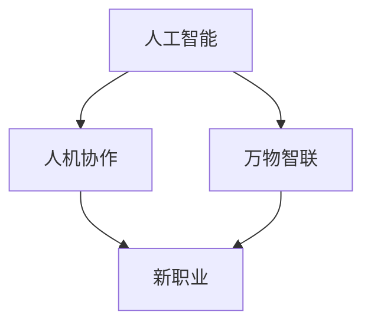

                 

# 未来的就业趋势：2050年的人机协作与万物智联时代的新职业

> 关键词：人机协作,就业趋势,2050,万物智联,新职业

## 1. 背景介绍

### 1.1 问题由来
随着人工智能(AI)、物联网(IoT)、量子计算等技术的飞速发展，未来职场将迎来深刻的变革。自动化、智能化、信息化将彻底重塑人类的工作方式和生活模式。如何适应这场技术浪潮，迎接即将到来的未来就业趋势，成为各行各业从业者必须面对的问题。

### 1.2 问题核心关键点
未来职场的核心将是人机协作与万物智联。人机协作是指人类与人工智能系统的深度融合，发挥各自优势，实现任务协同。万物智联则是指智能设备和系统的互联互通，实现更高效的数据流动和资源整合。新职业的产生和发展将围绕这两个核心点展开，带来前所未有的机遇和挑战。

### 1.3 问题研究意义
研究未来就业趋势，对于引导行业发展、促进职业教育、推动技术革新具有重要意义：

1. 指导行业战略规划。洞察未来就业变化，有助于企业及时调整人才招聘和培养策略，保持竞争力。
2. 助力职业教育转型。预见未来职业需求，可以为教育机构提供方向性指导，推动职业教育改革。
3. 推动技术创新应用。理解未来技术趋势，有助于科研机构和企业加速新技术研发和应用，提升产业竞争力。
4. 构建智慧生态体系。明确未来职业走向，可以为政策制定者提供依据，促进智慧城市、智慧工业等生态体系建设。
5. 应对社会转型挑战。预见未来就业变化，可以帮助社会各界提前准备，应对技术进步带来的社会和经济变革。

## 2. 核心概念与联系

### 2.1 核心概念概述

为更好地理解未来就业趋势，本节将介绍几个密切相关的核心概念：

- 人工智能(AI)：通过算法和计算实现智能行为的技术。核心技术包括机器学习、深度学习、自然语言处理等。
- 人机协作(Human-Machine Collaboration)：人类与AI系统协同工作，发挥各自优势，提升工作效率和质量。
- 万物智联(IoT-Enabled Intelligence)：通过物联网技术实现设备互联互通，推动智能应用发展。
- 新职业(New Roles)：随着技术发展，新兴的职业角色将应运而生，如数据科学家、AI训练师、智能系统运维师等。

这些核心概念之间的逻辑关系可以通过以下Mermaid流程图来展示：



这个流程图展示了大语言模型的核心概念及其之间的关系：

1. 人工智能为万物智联和人机协作提供了技术基础。
2. 人机协作和万物智联为各类新职业的产生提供了舞台。
3. 新职业的发展又反过来推动了人工智能和物联网技术的进步。

这些概念共同构成了未来就业趋势的框架，为我们理解未来的职业变化提供了基础。

## 3. 核心算法原理 & 具体操作步骤
### 3.1 算法原理概述

未来职场的核心在于人机协作与万物智联，这背后涉及到复杂的算法原理和具体操作步骤。以下是几个关键步骤：

- **数据融合与预处理**：将各类数据源采集并融合，进行预处理和清洗，形成可供AI模型分析的数据集。
- **模型训练与优化**：选择适合的AI模型，利用大规模数据集进行训练和优化，提升模型的精度和泛化能力。
- **系统集成与部署**：将训练好的模型集成到实际应用系统中，并进行部署和测试，确保系统稳定运行。
- **持续学习与优化**：根据实际应用中的反馈数据，持续优化模型和系统，提升性能和用户体验。

### 3.2 算法步骤详解

未来职场中的算法步骤可以总结为以下几个关键环节：

**Step 1: 数据采集与融合**
- 利用传感器、摄像头、无人机等设备，采集各类数据。
- 将采集到的数据进行清洗、预处理，形成统一标准的数据格式。
- 利用数据融合技术，将不同数据源的数据进行整合，形成完整的数据视图。

**Step 2: 模型选择与训练**
- 根据具体应用场景，选择合适的AI模型，如CNN、RNN、Transformer等。
- 利用预处理后的数据集，对模型进行训练，调整模型参数，提升模型性能。
- 采用正则化技术、对抗训练等方法，防止模型过拟合。

**Step 3: 系统集成与部署**
- 将训练好的模型集成到实际应用系统中，如智能控制系统、智慧城市平台等。
- 利用API、微服务等技术，实现系统模块化部署和扩展。
- 利用容器化技术，如Docker、Kubernetes等，确保系统稳定运行和快速扩展。

**Step 4: 持续学习与优化**
- 实时采集系统运行数据，进行监控和分析，识别出系统瓶颈和问题。
- 根据分析结果，调整模型参数，优化算法，提升系统性能。
- 利用联邦学习、迁移学习等技术，在不同设备间共享模型知识和优化成果，提升整体系统效能。

### 3.3 算法优缺点

人机协作与万物智联技术具有以下优点：
1. 提升效率和准确性。通过智能系统的辅助，人类可以更加高效地完成复杂任务，减少错误和遗漏。
2. 降低成本和风险。自动化的系统可以减少人工操作，降低成本和事故发生率。
3. 创造新价值。新职业的产生，带来新的商业模式和市场机会。

同时，这些技术也存在以下局限性：
1. 依赖高质量数据。数据采集和融合的准确性直接影响模型性能。
2. 技术门槛较高。AI模型和系统集成需要高水平的技术储备。
3. 安全与隐私风险。智能系统可能带来数据泄露和隐私侵犯等问题。
4. 技术普及难度大。技术推广和普及需要时间和教育成本。

尽管存在这些局限性，但就目前而言，人机协作与万物智联技术仍是大势所趋，有望彻底改变未来职场的面貌。

### 3.4 算法应用领域

人机协作与万物智联技术已经在多个领域得到广泛应用，例如：

- 智慧医疗：通过智能设备和系统，实现远程诊断、智能药柜、健康监测等。
- 智能制造：利用物联网和AI技术，实现智能生产线、设备预测维护、智能仓储等。
- 智慧城市：通过智能系统，实现城市交通管理、公共安全监控、能源管理等。
- 智能家居：利用物联网技术，实现家庭设备互联、智能安防、智能照明等。
- 自动驾驶：通过传感器、AI算法和实时数据，实现自动导航和驾驶辅助。
- 智能客服：通过AI和自然语言处理技术，实现智能客服机器人、情感分析、客户需求匹配等。

除了上述这些经典应用外，未来将涌现更多基于人机协作与万物智联的新职业和应用场景，推动社会的智能化转型。

## 4. 数学模型和公式 & 详细讲解 & 举例说明

### 4.1 数学模型构建

本节将使用数学语言对未来职场的技术框架进行更加严格的刻画。

记未来职场中的数据集为 $D=\{(x_i,y_i)\}_{i=1}^N, x_i \in \mathbb{R}^d, y_i \in \{0,1\}$，其中 $x_i$ 为输入特征，$y_i$ 为标签。假设选择的模型为 $M_{\theta}:\mathbb{R}^d \rightarrow \mathbb{R}$，其中 $\theta$ 为模型参数。

定义模型 $M_{\theta}$ 在数据样本 $(x,y)$ 上的损失函数为 $\ell(M_{\theta}(x),y)$，则在数据集 $D$ 上的经验风险为：

$$
\mathcal{L}(\theta) = \frac{1}{N} \sum_{i=1}^N \ell(M_{\theta}(x_i),y_i)
$$

微调的目标是最小化经验风险，即找到最优参数：

$$
\theta^* = \mathop{\arg\min}_{\theta} \mathcal{L}(\theta)
$$

在实践中，我们通常使用基于梯度的优化算法（如SGD、Adam等）来近似求解上述最优化问题。设 $\eta$ 为学习率，$\lambda$ 为正则化系数，则参数的更新公式为：

$$
\theta \leftarrow \theta - \eta \nabla_{\theta}\mathcal{L}(\theta) - \eta\lambda\theta
$$

其中 $\nabla_{\theta}\mathcal{L}(\theta)$ 为损失函数对参数 $\theta$ 的梯度，可通过反向传播算法高效计算。

### 4.2 公式推导过程

以下我们以智慧医疗中的智能诊断系统为例，推导基于深度学习模型的诊断任务损失函数及其梯度的计算公式。

假设模型 $M_{\theta}$ 在输入 $x$ 上的输出为 $\hat{y}=M_{\theta}(x) \in [0,1]$，表示样本属于某种疾病的概率。真实标签 $y \in \{0,1\}$。则二分类交叉熵损失函数定义为：

$$
\ell(M_{\theta}(x),y) = -[y\log \hat{y} + (1-y)\log (1-\hat{y})]
$$

将其代入经验风险公式，得：

$$
\mathcal{L}(\theta) = -\frac{1}{N}\sum_{i=1}^N [y_i\log M_{\theta}(x_i)+(1-y_i)\log(1-M_{\theta}(x_i))]
$$

根据链式法则，损失函数对参数 $\theta_k$ 的梯度为：

$$
\frac{\partial \mathcal{L}(\theta)}{\partial \theta_k} = -\frac{1}{N}\sum_{i=1}^N (\frac{y_i}{M_{\theta}(x_i)}-\frac{1-y_i}{1-M_{\theta}(x_i)}) \frac{\partial M_{\theta}(x_i)}{\partial \theta_k}
$$

其中 $\frac{\partial M_{\theta}(x_i)}{\partial \theta_k}$ 可进一步递归展开，利用自动微分技术完成计算。

在得到损失函数的梯度后，即可带入参数更新公式，完成模型的迭代优化。重复上述过程直至收敛，最终得到适应未来医疗诊断任务的模型参数 $\theta^*$。

## 5. 项目实践：代码实例和详细解释说明
### 5.1 开发环境搭建

在进行未来职场项目实践前，我们需要准备好开发环境。以下是使用Python进行PyTorch开发的环境配置流程：

1. 安装Anaconda：从官网下载并安装Anaconda，用于创建独立的Python环境。

2. 创建并激活虚拟环境：
```bash
conda create -n pytorch-env python=3.8 
conda activate pytorch-env
```

3. 安装PyTorch：根据CUDA版本，从官网获取对应的安装命令。例如：
```bash
conda install pytorch torchvision torchaudio cudatoolkit=11.1 -c pytorch -c conda-forge
```

4. 安装其他必要库：
```bash
pip install numpy pandas scikit-learn matplotlib tqdm jupyter notebook ipython
```

5. 安装TensorFlow和其他相关工具：
```bash
pip install tensorflow
```

完成上述步骤后，即可在`pytorch-env`环境中开始项目实践。

### 5.2 源代码详细实现

下面我们以智慧医疗中的智能诊断系统为例，给出使用PyTorch进行模型开发的PyTorch代码实现。

首先，定义模型和数据集：

```python
import torch
import torch.nn as nn
import torch.optim as optim
from torch.utils.data import Dataset, DataLoader

class MedicalDataset(Dataset):
    def __init__(self, data, labels):
        self.data = data
        self.labels = labels

    def __len__(self):
        return len(self.data)

    def __getitem__(self, idx):
        img, label = self.data[idx], self.labels[idx]
        return img, label

# 定义模型结构
class MedicalModel(nn.Module):
    def __init__(self):
        super(MedicalModel, self).__init__()
        self.conv1 = nn.Conv2d(1, 64, kernel_size=3, stride=1, padding=1)
        self.conv2 = nn.Conv2d(64, 128, kernel_size=3, stride=1, padding=1)
        self.pool = nn.MaxPool2d(kernel_size=2, stride=2)
        self.fc1 = nn.Linear(128 * 14 * 14, 256)
        self.fc2 = nn.Linear(256, 1)
        self.dropout = nn.Dropout(0.5)

    def forward(self, x):
        x = self.pool(F.relu(self.conv1(x)))
        x = self.pool(F.relu(self.conv2(x)))
        x = x.view(-1, 128 * 14 * 14)
        x = self.dropout(x)
        x = F.relu(self.fc1(x))
        x = self.fc2(x)
        return x

# 准备数据集和训练集
train_dataset = MedicalDataset(train_data, train_labels)
test_dataset = MedicalDataset(test_data, test_labels)
train_loader = DataLoader(train_dataset, batch_size=64, shuffle=True)
test_loader = DataLoader(test_dataset, batch_size=64)
```

然后，定义训练和评估函数：

```python
from torch.optim import Adam

# 定义模型、损失函数和优化器
model = MedicalModel()
criterion = nn.BCEWithLogitsLoss()
optimizer = Adam(model.parameters(), lr=0.001)

# 定义训练函数
def train(model, train_loader, optimizer, criterion, num_epochs):
    model.train()
    for epoch in range(num_epochs):
        for batch_idx, (inputs, targets) in enumerate(train_loader):
            inputs, targets = inputs.to(device), targets.to(device)
            optimizer.zero_grad()
            outputs = model(inputs)
            loss = criterion(outputs, targets)
            loss.backward()
            optimizer.step()
            if batch_idx % 100 == 0:
                print(f'Train Epoch: {epoch + 1} [{batch_idx * len(inputs)}/{len(train_loader.dataset)}], Loss: {loss.item():.4f}')

# 定义评估函数
def evaluate(model, test_loader, criterion):
    model.eval()
    total_loss = 0
    with torch.no_grad():
        for batch_idx, (inputs, targets) in enumerate(test_loader):
            inputs, targets = inputs.to(device), targets.to(device)
            outputs = model(inputs)
            loss = criterion(outputs, targets)
            total_loss += loss.item()
    print(f'Test Loss: {total_loss / len(test_loader):.4f}')
```

最后，启动训练流程并在测试集上评估：

```python
num_epochs = 10
device = torch.device('cuda' if torch.cuda.is_available() else 'cpu')

# 将模型和数据移至设备
model.to(device)
train_loader = train_loader.to(device)
test_loader = test_loader.to(device)

# 开始训练
train(model, train_loader, optimizer, criterion, num_epochs)

# 在测试集上评估模型
evaluate(model, test_loader, criterion)
```

以上就是使用PyTorch对智慧医疗中的智能诊断系统进行模型训练和评估的完整代码实现。可以看到，通过简单的几行代码，我们就可以实现一个基础的深度学习模型，用于解决医疗诊断中的二分类问题。

### 5.3 代码解读与分析

让我们再详细解读一下关键代码的实现细节：

**MedicalDataset类**：
- `__init__`方法：初始化数据和标签。
- `__len__`方法：返回数据集的样本数量。
- `__getitem__`方法：对单个样本进行处理，返回数据和标签。

**MedicalModel类**：
- `__init__`方法：定义模型结构，包括卷积层、池化层、全连接层和Dropout层。
- `forward`方法：定义前向传播流程，将输入数据经过多层处理后输出结果。

**train和evaluate函数**：
- `train`函数：定义训练函数，在每个epoch中对数据集进行迭代，前向传播计算损失，反向传播更新模型参数。
- `evaluate`函数：定义评估函数，在测试集上计算模型损失，输出评估结果。

可以看到，通过这些基础的代码实现，我们可以构建一个基本的深度学习模型，用于解决具体的智能诊断问题。

## 6. 实际应用场景

### 6.1 智能客服系统

智能客服系统是未来职场中人机协作的重要应用场景之一。传统的客服系统需要大量人力进行人工客服，高峰期响应速度慢，客户体验差。通过智能客服系统，利用自然语言处理(NLP)和深度学习技术，可以实现24/7不间断服务，快速响应客户咨询，提升客户满意度。

在技术实现上，可以收集企业内部的历史客服对话记录，将问题-答案对作为监督数据，在此基础上对预训练模型进行微调。微调后的智能客服系统能够自动理解用户意图，匹配最合适的答案模板进行回复。对于客户提出的新问题，还可以接入检索系统实时搜索相关内容，动态组织生成回答。如此构建的智能客服系统，能大幅提升客户咨询体验和问题解决效率。

### 6.2 智能制造

智能制造是未来职场中万物智联的重要应用场景之一。传统制造企业依赖人工操作，生产效率低，生产过程不透明。通过智能制造系统，利用物联网(IoT)和AI技术，可以实现生产线的自动化和智能化管理，提高生产效率，降低成本。

在技术实现上，可以采集生产线上的各类数据，如设备状态、温度、湿度、生产工艺等，进行数据融合和预处理，构建统一的数据视图。在此基础上，利用深度学习模型对生产过程进行建模和预测，实现生产线的智能化管理和优化。智能制造系统可以实时监控生产过程，预测设备故障，优化生产流程，提高产品质量和生产效率。

### 6.3 智慧城市

智慧城市是未来职场中万物智联的重要应用场景之一。传统城市管理依赖人工操作，效率低，响应慢。通过智慧城市系统，利用物联网(IoT)和AI技术，可以实现城市管理的自动化和智能化，提升城市管理效率和服务水平。

在技术实现上，可以采集城市中的各类数据，如交通流量、环境质量、公共设施使用情况等，进行数据融合和预处理，构建统一的数据视图。在此基础上，利用深度学习模型对城市运行状态进行建模和预测，实现城市管理的智能化和优化。智慧城市系统可以实现城市交通管理、公共安全监控、能源管理等，提升城市管理的效率和服务水平。

### 6.4 未来应用展望

随着未来职场中人机协作与万物智联技术的发展，未来的应用场景将更加广泛，带来更多的创新和机遇。

- **智能医疗**：通过智能设备和系统，实现远程诊断、智能药柜、健康监测等，提升医疗服务的智能化水平，辅助医生诊疗，加速新药开发进程。
- **智能教育**：通过智能系统，实现作业批改、学情分析、知识推荐等，因材施教，促进教育公平，提高教学质量。
- **智能交通**：通过自动驾驶和智能交通系统，实现自动导航和驾驶辅助，提升交通安全和效率。
- **智能金融**：通过智能系统，实现金融舆情监测、智能投资、智能风控等，提升金融服务的智能化水平。
- **智能农业**：通过智能设备，实现农业生产的智能化管理，提高生产效率和产品质量。
- **智能家居**：通过物联网技术，实现家庭设备互联、智能安防、智能照明等，提升家庭生活的智能化水平。

总之，未来职场中的人机协作与万物智联技术将彻底改变人类工作和生活的方式，带来前所未有的机遇和挑战。我们需要不断学习和适应新的技术范式，迎接未来的挑战，迎接更加智能化、普适化的未来。

## 7. 工具和资源推荐

### 7.1 学习资源推荐

为了帮助开发者系统掌握未来职场的技术基础和实践技巧，这里推荐一些优质的学习资源：

1. 《深度学习》系列书籍：由深度学习领域的权威专家编写，系统介绍了深度学习的基本概念和应用，是理解未来职场技术基础的重要参考资料。

2. 《TensorFlow 2.0实战》系列课程：由TensorFlow官方团队开发的实战课程，详细讲解了TensorFlow的使用方法，包括模型构建、训练和部署等环节。

3. 《Python数据科学手册》：由Python数据科学社区知名博主编写，全面介绍了Python在数据科学、机器学习、深度学习中的应用，是学习未来职场必备的工具书。

4. Coursera《人工智能基础》课程：由斯坦福大学教授Andrew Ng主讲，系统介绍了人工智能的基本概念和算法，适合初学者学习。

5. Udacity《深度学习专项》课程：由知名深度学习专家主讲的专项课程，涵盖了深度学习的各个方面，适合进阶学习。

通过学习这些资源，相信你一定能够系统掌握未来职场的技术基础和实践技巧，为未来的就业做好准备。

### 7.2 开发工具推荐

高效的开发离不开优秀的工具支持。以下是几款用于未来职场开发的常用工具：

1. PyTorch：基于Python的开源深度学习框架，灵活动态的计算图，适合快速迭代研究。

2. TensorFlow：由Google主导开发的开源深度学习框架，生产部署方便，适合大规模工程应用。

3. Transformers库：HuggingFace开发的NLP工具库，集成了众多SOTA语言模型，支持PyTorch和TensorFlow，是进行智能系统开发的利器。

4. Weights & Biases：模型训练的实验跟踪工具，可以记录和可视化模型训练过程中的各项指标，方便对比和调优。

5. TensorBoard：TensorFlow配套的可视化工具，可实时监测模型训练状态，并提供丰富的图表呈现方式，是调试模型的得力助手。

6. Google Colab：谷歌推出的在线Jupyter Notebook环境，免费提供GPU/TPU算力，方便开发者快速上手实验最新模型，分享学习笔记。

合理利用这些工具，可以显著提升未来职场中项目的开发效率，加快创新迭代的步伐。

### 7.3 相关论文推荐

未来职场中的技术发展源于学界的持续研究。以下是几篇奠基性的相关论文，推荐阅读：

1. AlphaGo Zero：提出了强化学习技术，通过自我对弈训练AI，实现了零样本下战胜人类围棋顶尖选手的目标，展示了AI在智能决策中的潜力。

2. GANs for Smart Home：提出了基于生成对抗网络(GAN)的智能家居系统，通过GAN技术实现了智能家居设备的控制和调度，展示了AI在智能家居中的应用前景。

3. Deep Residual Learning for Image Recognition：提出了深度残差网络(ResNet)，通过残差连接解决了深度网络退化问题，提升了图像识别的准确率，展示了深度学习在计算机视觉中的应用潜力。

4. ImageNet Classification with Deep Convolutional Neural Networks：提出了卷积神经网络(CNN)，通过卷积操作实现了对图像的高效处理，展示了深度学习在图像处理中的应用潜力。

5. Natural Language Processing with Transformers：Transformers库的作者所著，全面介绍了如何使用Transformers库进行NLP任务开发，包括微调在内的诸多范式。

这些论文代表了大语言模型微调技术的发展脉络。通过学习这些前沿成果，可以帮助研究者把握学科前进方向，激发更多的创新灵感。

## 8. 总结：未来发展趋势与挑战

### 8.1 总结

本文对未来职场中人机协作与万物智联技术进行了全面系统的介绍。首先阐述了未来职场的核心在于人机协作与万物智联，明确了未来职场的发展趋势。其次，从原理到实践，详细讲解了未来职场的技术框架，给出了智能诊断系统的代码实例。同时，本文还广泛探讨了未来职场在智能客服、智能制造、智慧城市等多个领域的应用前景，展示了未来职场的广阔前景。此外，本文精选了未来职场技术的各类学习资源，力求为读者提供全方位的技术指引。

通过本文的系统梳理，可以看到，未来职场中的人机协作与万物智联技术正在成为职场发展的必然趋势，极大地拓展了人类的工作方式和生活模式。随着技术的不断发展，未来职场将带来更多创新和机遇，同时也带来更多挑战和风险。我们需要不断学习和适应新的技术范式，迎接未来的挑战，迎接更加智能化、普适化的未来。

### 8.2 未来发展趋势

展望未来，未来职场中的技术将呈现以下几个发展趋势：

1. 自动化和智能化水平将持续提升。随着AI技术的不断发展，自动化和智能化的水平将进一步提升，人类将从繁琐重复的劳动中解放出来，更多地专注于创造性工作。

2. 多模态智能系统将日益普及。未来的智能系统将不仅限于文本和图像数据，还将涵盖语音、视频、传感器等多样化的数据类型，实现多模态智能融合。

3. 实时数据处理能力将不断增强。未来的职场将越来越多地依赖实时数据进行决策和执行，对数据处理和计算能力的需求将不断提升。

4. 人机协作模式将更加多样化。未来的职场将不再局限于固定的工作模式，而是更加灵活多样，人机协作的边界将不断扩展。

5. 智能系统将更多融入人类工作。未来的职场将不再是孤立的人机交互，而是更加紧密的协作伙伴，智能系统将更多地融入人类工作流程，提升工作效率和质量。

6. 数据隐私和安全将更加重要。未来的职场将更加依赖智能设备和系统，数据隐私和安全问题将成为重要关注点。

7. 持续学习和适应能力将成为核心竞争力。未来的职场将面临快速变化的环境，持续学习和适应能力将成为企业竞争力的关键。

以上趋势凸显了未来职场中技术的发展方向。这些方向的探索发展，必将进一步提升职场的智能化和自动化水平，推动社会的全面进步。

### 8.3 面临的挑战

尽管未来职场中的技术发展前景广阔，但仍面临着诸多挑战：

1. 技术成熟度不足。当前技术仍处于快速发展阶段，成熟度不够，存在许多技术瓶颈和不确定性。

2. 数据隐私和安全问题。智能系统将依赖大量的数据进行决策，数据隐私和安全问题将更加突出。

3. 社会适应性和教育问题。新技术的应用需要社会各界的适应和支持，教育体系的转型需要时间和投入。

4. 伦理和道德问题。新技术的应用可能带来伦理和道德上的挑战，如自动化失业、数据滥用等。

5. 技术普及和应用成本。新技术的推广和应用需要大量资金和资源投入，成本较高。

6. 技术发展和产业政策的关系。未来职场的技术发展需要政策的支持和引导，但技术进步的路径和产业政策的制定也存在不确定性。

尽管存在这些挑战，但未来职场中的人机协作与万物智联技术仍是大势所趋，有望彻底改变人类工作和生活的方式。相信随着技术的发展和社会的适应，这些挑战终将逐步解决，未来职场必将迎来更加美好的明天。

### 8.4 研究展望

面对未来职场中的技术挑战，未来的研究需要在以下几个方面寻求新的突破：

1. 提升技术的成熟度和可靠性。加快技术研发，提高技术成熟度，解决技术瓶颈，确保技术稳定可靠。

2. 加强数据隐私和安全保护。建立完善的数据隐私和安全保护机制，确保数据安全。

3. 推动社会适应性和教育改革。加强技术普及和应用推广，推动教育体系转型，提升社会适应性。

4. 制定伦理和道德规范。制定合理的伦理和道德规范，引导技术健康发展，避免技术滥用。

5. 优化技术普及和应用成本。探索技术普及和应用的新路径，降低成本，提高效率。

6. 加强技术发展与产业政策的协调。加强技术发展与产业政策的协调，确保技术发展与经济社会的协同进步。

这些研究方向将引领未来职场中人机协作与万物智联技术的不断进步，推动社会的全面进步和智能化转型。

## 9. 附录：常见问题与解答

**Q1：未来职场中的主要职业角色有哪些？**

A: 未来职场中的主要职业角色包括但不限于：

1. 数据科学家：负责数据采集、处理、分析和建模，为智能系统提供数据支撑。
2. AI训练师：负责模型训练、优化和评估，提升模型的性能和泛化能力。
3. 智能系统运维师：负责智能系统的部署、监控和优化，确保系统的稳定运行。
4. 多模态系统设计师：负责多模态数据的融合和应用，提升系统的综合能力。
5. 人机协作工程师：负责设计人机协作流程，优化人机交互体验，提升系统效率。
6. 智慧城市规划师：负责智慧城市系统的规划和设计，提升城市管理的智能化水平。
7. 智能制造工程师：负责智能制造系统的设计、实施和优化，提升制造业的智能化水平。

这些职业角色将随着技术的发展和应用场景的扩展而不断演变。

**Q2：未来职场中哪些技术将更加重要？**

A: 未来职场中，以下技术将更加重要：

1. 人工智能：通过深度学习、强化学习等技术，实现智能决策和自动化。
2. 物联网：通过传感器、摄像头等设备采集数据，实现设备互联互通，提升智能化水平。
3. 大数据：通过数据融合和分析，实现对复杂问题的建模和预测。
4. 自然语言处理：通过NLP技术，实现文本数据的处理和分析。
5. 计算机视觉：通过图像处理技术，实现对视觉数据的分析。
6. 智能决策：通过智能算法，实现决策支持和自动化执行。

这些技术的综合应用，将为未来职场带来更多的机遇和挑战。

**Q3：未来职场中如何平衡人机协作和自动化？**

A: 未来职场中，人机协作和自动化将相辅相成，平衡二者关系的关键在于：

1. 明确人机协作的边界：确定哪些任务适合自动化，哪些任务适合人机协作，确保各自优势得到充分发挥。
2. 设计合理的交互界面：设计直观、易用的交互界面，提升人机协作的效率和体验。
3. 实现持续学习和适应的系统：通过持续学习和适应的技术，使系统能够不断优化，适应变化的环境。
4. 重视人机协作的教育和培训：加强对从业者的教育和培训，提升其人机协作能力。

通过合理设计，可以实现人机协作和自动化的平衡，提升职场的效率和质量。

---

作者：禅与计算机程序设计艺术 / Zen and the Art of Computer Programming

