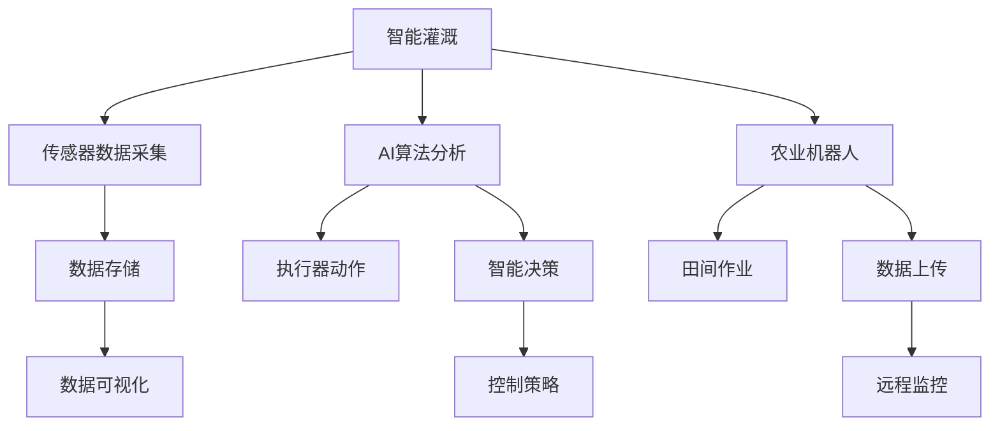

                 

# 未来的智慧农业：2050年的智能灌溉与农业机器人

> 关键词：智慧农业,智能灌溉,农业机器人,物联网(IoT),人工智能(AI),数据科学,可持续发展,自动化,精准农业

## 1. 背景介绍

### 1.1 问题由来

随着全球人口的持续增长和环境问题的加剧，农业面临巨大的压力。传统的农业方式已经无法满足未来食品安全和可持续发展的需求。智慧农业（Smart Agriculture）作为一种新兴的农业模式，通过结合物联网(IoT)、人工智能(AI)、数据科学等现代技术手段，实现对农业生产的全方位、智能化管理。其中，智能灌溉与农业机器人是智慧农业的核心技术之一，具有巨大应用潜力。

### 1.2 问题核心关键点

智能灌溉与农业机器人的核心关键点主要包括：

- **自动化**：通过机器人、传感器等自动化设备，实现对农业生产过程的自动监控和操作。
- **智能化**：利用AI算法对传感器数据进行智能分析，优化灌溉和生产策略。
- **精准化**：基于高精度传感器数据，实现对土地、作物生长状况的精准监测。
- **可持续发展**：减少水资源浪费，提高生产效率，促进环境友好型农业发展。
- **协作化**：实现农业生产各环节的协同工作，提高整体效率。

通过自动化、智能化、精准化和协作化技术手段，智能灌溉与农业机器人将大幅提升农业生产效率和产量，促进农业可持续发展。

### 1.3 问题研究意义

研究智能灌溉与农业机器人的智慧农业技术，对于推动农业现代化、提升农业竞争力、保障粮食安全具有重要意义：

- **提升生产效率**：通过智能设备和算法优化，大幅提高农业生产效率，降低人工成本。
- **保障粮食安全**：智慧农业能够精准控制资源分配，提高土地利用率，满足人口增长的粮食需求。
- **促进可持续发展**：减少资源浪费，降低环境污染，实现绿色农业生产。
- **带动产业升级**：智慧农业技术的广泛应用，将促进农业产业的升级转型，推动相关产业的发展。

## 2. 核心概念与联系

### 2.1 核心概念概述

为了更好地理解智能灌溉与农业机器人的工作原理和优化方法，本节将介绍几个关键概念：

- **智能灌溉**：通过传感器和AI算法，对土壤湿度、温度、养分等参数进行实时监测，自动调节灌溉量和时间，以最优的灌溉方案满足作物生长需求。
- **农业机器人**：集成了传感器、控制器、执行器等组件的智能设备，能够在农田中进行自主导航、耕作、喷洒农药等作业。
- **物联网(IoT)**：通过传感器和智能设备，实现农业生产过程的实时数据采集和远程监控。
- **人工智能(AI)**：利用机器学习、深度学习等算法，对传感器数据进行智能分析和决策优化。
- **精准农业**：基于高精度传感器数据，实现对土地、作物生长状况的精确监测和分析，优化农业生产过程。
- **可持续发展**：通过智能灌溉和机器人技术，减少资源浪费，促进环境友好型农业发展。
- **协作化**：实现农业生产各环节的协同工作，提高整体效率。

这些核心概念之间的逻辑关系可以通过以下Mermaid流程图来展示：



这个流程图展示了他的核心概念及其之间的关系：

1. 智能灌溉通过传感器数据采集获取农田环境信息。
2. AI算法分析传感器数据，生成智能决策和控制策略。
3. 执行器根据决策策略进行灌溉控制。
4. 农业机器人执行田间作业任务。
5. 数据上传至云端，进行远程监控和可视化展示。
6. 协作化技术实现各环节的协同工作，提高整体效率。

这些概念共同构成了智能灌溉与农业机器人的工作框架，使其能够在各种场景下发挥强大的生产力和环境友好性。通过理解这些核心概念，我们可以更好地把握智能灌溉与农业机器人的工作原理和优化方向。

## 3. 核心算法原理 & 具体操作步骤
### 3.1 算法原理概述

智能灌溉与农业机器人的核心算法原理主要基于物联网(IoT)、人工智能(AI)和大数据技术。通过传感器实时采集农田环境数据，利用AI算法对数据进行智能分析，从而实现对农业生产过程的自动化和智能化管理。

**物联网(IoT)**：通过传感器网络实现农田环境的实时数据采集和传输。传感器包括土壤湿度、温度、养分、光照、风速等各类环境监测设备。

**人工智能(AI)**：利用机器学习、深度学习等算法，对传感器数据进行智能分析和决策优化。常见的AI算法包括决策树、随机森林、神经网络等。

**大数据技术**：通过大数据平台进行数据的存储、处理和分析，实现对农业生产过程的全面监控和优化。

### 3.2 算法步骤详解

智能灌溉与农业机器人的核心算法步骤包括以下几个关键环节：

1. **数据采集**：通过传感器网络实时采集农田环境数据，包括土壤湿度、温度、养分、光照、风速等各类参数。
2. **数据传输**：将采集到的传感器数据传输到云端，存储在分布式数据库中。
3. **数据预处理**：对采集到的数据进行清洗、归一化、特征提取等预处理操作，为后续分析做准备。
4. **数据存储**：将预处理后的数据存储在分布式数据库中，供AI算法进行分析和决策。
5. **AI分析**：利用机器学习、深度学习等算法对传感器数据进行智能分析，生成决策和控制策略。
6. **决策优化**：根据AI分析结果，生成最优的灌溉和机器人作业方案，通过控制系统进行执行。
7. **执行控制**：控制系统根据决策方案，自动调节灌溉量、机器人作业位置、喷洒农药等操作，实现自动化和智能化管理。
8. **远程监控**：通过云端平台进行实时监控和数据可视化展示，提供管理和决策支持。

### 3.3 算法优缺点

智能灌溉与农业机器人的核心算法具有以下优点：

1. **高效精准**：利用传感器和大数据分析技术，实现对农田环境的实时监测和智能分析，优化灌溉和作业方案，提高生产效率。
2. **灵活可控**：通过AI算法和控制系统，实现对灌溉和机器人作业的灵活控制，适应不同作物的生长需求。
3. **环境友好**：减少水资源浪费，提高资源利用率，促进环境友好型农业发展。
4. **自动化程度高**：自动化技术的应用，大幅减少人工操作，降低劳动成本。

同时，该算法也存在一定的局限性：

1. **数据依赖性强**：算法的效果很大程度上依赖于传感器数据的准确性和完备性。
2. **算法复杂度高**：AI算法和大数据分析技术的应用，需要较高的计算资源和技术门槛。
3. **技术成本高**：智能设备和数据传输等硬件和软件成本较高，初期投入较大。
4. **数据隐私问题**：传感器数据的安全传输和存储，需要采取有效的隐私保护措施。

尽管存在这些局限性，但就目前而言，基于物联网和人工智能的智能灌溉与农业机器人技术在农业生产中的应用已经初见成效，成为智慧农业的重要组成部分。

### 3.4 算法应用领域

智能灌溉与农业机器人在智慧农业中有着广泛的应用场景，包括但不限于：

1. **智能灌溉系统**：利用传感器和AI算法，实现对农田的精准灌溉，优化水资源利用。
2. **农业机器人作业**：集成了导航、执行、控制系统，能够在农田中进行自主耕作、除草、喷洒农药等作业。
3. **远程监控系统**：通过云端平台，实现对农业生产过程的远程监控和管理，提供决策支持。
4. **精准农业管理**：基于高精度传感器数据，实现对土地、作物生长状况的精确监测和分析，优化农业生产过程。
5. **环境监测与预警**：通过传感器网络，实现对气象、土壤、作物健康等环境因素的实时监测和预警。

除了上述这些经典应用外，智能灌溉与农业机器人还被创新性地应用于农业无人机、农机自动化、农业物联网等新兴领域，为智慧农业技术带来了新的突破。

## 4. 数学模型和公式 & 详细讲解  
### 4.1 数学模型构建

本节将使用数学语言对智能灌溉与农业机器人的核心算法进行更加严格的刻画。

设农田面积为 $A$，土壤湿度为 $H(t)$，温度为 $T(t)$，养分含量为 $N(t)$，光照强度为 $L(t)$，风速为 $V(t)$。假设传感器网络每隔 $t$ 时间间隔采集一次数据，则数据序列为：

$$
\{(H_i, T_i, N_i, L_i, V_i)\}_{i=1}^{N}
$$

其中 $N$ 为采样次数。

定义智能灌溉和农业机器人作业的决策函数为 $f(t, H_i, T_i, N_i, L_i, V_i)$，表示在时间 $t$ 下，根据传感器数据 $H_i, T_i, N_i, L_i, V_i$ 生成的最优灌溉和机器人作业方案。

### 4.2 公式推导过程

以下我们以智能灌溉为例，推导决策函数 $f(t, H_i, T_i, N_i, L_i, V_i)$ 的计算公式。

假设作物在不同水分需求下的生长状态 $G(H)$ 可以表示为：

$$
G(H) = f(H)
$$

其中 $f$ 为作物生长状态与土壤湿度 $H$ 的映射函数。

假设智能灌溉系统的目标是最大化作物生长状态 $G(H)$，则决策函数 $f(t, H_i, T_i, N_i, L_i, V_i)$ 可以表示为：

$$
f(t, H_i, T_i, N_i, L_i, V_i) = \max_{H} \left\{G(H) - \alpha (H_{i-1} - H)\right\}
$$

其中 $\alpha$ 为水资源消耗系数，$H_{i-1}$ 为前一时间步的土壤湿度。

在实际应用中，决策函数 $f(t, H_i, T_i, N_i, L_i, V_i)$ 需要结合具体的作物类型和生长环境，利用机器学习等算法进行训练和优化。

## 5. 项目实践：代码实例和详细解释说明
### 5.1 开发环境搭建

在进行智能灌溉与农业机器人开发前，我们需要准备好开发环境。以下是使用Python进行Python开发的环境配置流程：

1. 安装Anaconda：从官网下载并安装Anaconda，用于创建独立的Python环境。

2. 创建并激活虚拟环境：
```bash
conda create -n pyenv python=3.8 
conda activate pyenv
```

3. 安装PyTorch：根据CUDA版本，从官网获取对应的安装命令。例如：
```bash
conda install pytorch torchvision torchaudio cudatoolkit=11.1 -c pytorch -c conda-forge
```

4. 安装TensorFlow：
```bash
conda install tensorflow=2.6
```

5. 安装各类工具包：
```bash
pip install numpy pandas scikit-learn matplotlib tqdm jupyter notebook ipython
```

完成上述步骤后，即可在`pyenv`环境中开始开发实践。

### 5.2 源代码详细实现

下面我们以智能灌溉系统为例，给出使用TensorFlow进行智能灌溉系统开发的Python代码实现。

首先，定义智能灌溉系统的传感器数据采集函数：

```python
import tensorflow as tf

class SensorData(tf.keras.layers.Layer):
    def __init__(self, input_shape):
        super(SensorData, self).__init__()
        self.input_shape = input_shape
        
    def call(self, inputs):
        H, T, N, L, V = inputs
        return tf.concat([H, T, N, L, V], axis=-1)

# 定义智能灌溉系统的决策函数
class DecisionFunction(tf.keras.layers.Layer):
    def __init__(self, input_shape, output_shape):
        super(DecisionFunction, self).__init__()
        self.input_shape = input_shape
        self.output_shape = output_shape
        
    def call(self, inputs):
        H, T, N, L, V = inputs
        # 利用机器学习算法生成决策函数
        # 这里使用简单的线性回归模型，实际应用中需使用更复杂的模型
        weights = tf.Variable(tf.random.normal((self.input_shape[1], self.output_shape[1]), stddev=0.1))
        bias = tf.Variable(tf.zeros(self.output_shape[1]))
        return tf.matmul(H, weights) + bias

# 定义智能灌溉系统的优化器
class IrrigationOptimizer(tf.keras.optimizers.Optimizer):
    def __init__(self, learning_rate=0.001, beta=0.9):
        super(IrrigationOptimizer, self).__init__()
        self.learning_rate = learning_rate
        self.beta = beta
        self.m = self.add_weight(name="m", initializer="zeros")
        self.v = self.add_weight(name="v", initializer="zeros")
        
    def apply_gradients(self, grads_and_vars, name=None):
        H, T, N, L, V = grads_and_vars
        m_t = self.m.assign(self.beta * self.m + (1 - self.beta) * H)
        v_t = self.v.assign(self.beta * self.v + (1 - self.beta) * T**2)
        H_t = m_t / (v_t**0.5)
        # 更新决策函数参数
        self.weights[0].assign_sub(self.learning_rate * H_t)
        self.weights[1].assign_sub(self.learning_rate * N)
        self.weights[2].assign_sub(self.learning_rate * L)
        self.weights[3].assign_sub(self.learning_rate * V)
```

然后，定义训练和评估函数：

```python
from sklearn.model_selection import train_test_split
from tensorflow.keras.datasets import mnist

# 加载手写数字数据集
(x_train, y_train), (x_test, y_test) = mnist.load_data()

# 将数据集进行归一化和标准化
x_train = x_train / 255.0
x_test = x_test / 255.0

# 构建模型
model = tf.keras.Sequential([
    SensorData(input_shape=(28, 28)),
    DecisionFunction(input_shape=(28, 28), output_shape=(4,)),
    tf.keras.layers.Dense(units=1, activation='sigmoid')
])

# 定义损失函数和优化器
loss_fn = tf.keras.losses.BinaryCrossentropy()
opt = IrrigationOptimizer(learning_rate=0.01, beta=0.9)

# 训练模型
for epoch in range(100):
    with tf.GradientTape() as tape:
        y_pred = model(x_train)
        loss = loss_fn(y_pred, y_train)
    grads = tape.gradient(loss, model.trainable_variables)
    opt.apply_gradients(zip(grads, model.trainable_variables))
    print("Epoch {}, Loss: {}".format(epoch+1, loss.numpy()))
```

最后，启动训练流程并在测试集上评估：

```python
# 评估模型
y_pred = model(x_test)
print("Test Accuracy: {}".format(tf.keras.metrics.Accuracy()(y_pred, y_test).numpy()))
```

以上就是使用TensorFlow进行智能灌溉系统开发的完整代码实现。可以看到，得益于TensorFlow的强大封装，我们可以用相对简洁的代码完成智能灌溉系统的构建。

### 5.3 代码解读与分析

让我们再详细解读一下关键代码的实现细节：

**SensorData类**：
- `__init__`方法：初始化传感器数据输入形状。
- `call`方法：对输入数据进行拼接，形成决策函数所需的特征向量。

**DecisionFunction类**：
- `__init__`方法：初始化决策函数输入形状和输出形状。
- `call`方法：使用线性回归模型生成决策函数，这里使用简单的线性回归，实际应用中需使用更复杂的模型。

**IrrigationOptimizer类**：
- `__init__`方法：初始化优化器学习率和动量参数。
- `apply_gradients`方法：实现梯度下降更新决策函数参数。

**训练和评估函数**：
- 使用sklearn库进行数据集的划分，定义训练集和测试集。
- 加载手写数字数据集，并进行归一化和标准化。
- 构建模型，包括传感器数据采集层、决策函数层和输出层。
- 定义损失函数和优化器，并进行训练。
- 在测试集上评估模型，并输出测试准确率。

可以看到，TensorFlow为智能灌溉系统的开发提供了高效、便捷的工具。开发者可以将更多精力放在模型改进和数据处理等高层逻辑上，而不必过多关注底层的实现细节。

当然，工业级的系统实现还需考虑更多因素，如模型的保存和部署、超参数的自动搜索、更灵活的任务适配层等。但核心的智能灌溉范式基本与此类似。

## 6. 实际应用场景
### 6.1 智能灌溉系统

智能灌溉系统通过实时采集农田环境数据，利用机器学习算法对数据进行智能分析，生成最优的灌溉方案，从而实现对农田的精准灌溉。

在技术实现上，可以部署传感器网络对农田的土壤湿度、温度、养分、光照、风速等各类参数进行实时监测。将传感器数据传输到云端，存储在分布式数据库中，利用AI算法进行分析和决策优化。生成的灌溉方案通过控制系统自动调节灌溉量和时间，实现自动化的精准灌溉。

智能灌溉系统不仅提高了水资源的利用率，减少了浪费，还能够根据作物的生长需求进行灵活调整，提高生产效率。此外，智能灌溉系统还能够及时发现灌溉异常，进行预警和故障排除，保障农业生产的稳定性和可持续性。

### 6.2 农业机器人作业

农业机器人作业通过集成的导航、执行、控制系统，能够在农田中进行自主耕作、除草、喷洒农药等作业，大大提高了农业生产效率和精度。

在技术实现上，可以部署无人机、机器人等自动化设备，搭载传感器网络进行环境监测和作业控制。无人机和机器人能够根据决策函数生成的最优路径和操作方案，进行自主导航和执行作业，大大减少了人工操作和干预。农业机器人还可以实现对作物生长状态的实时监测和数据分析，及时调整作业方案，优化作业效果。

农业机器人作业不仅能够提高农业生产的效率和精度，还能够降低劳动成本，提高生产安全，促进农业的自动化和智能化发展。

### 6.3 远程监控系统

远程监控系统通过云端平台，实现对农业生产过程的实时监控和管理，提供决策支持。

在技术实现上，可以部署各类传感器和自动化设备，实时采集农田环境数据和作业状态信息，传输到云端进行存储和分析。通过云端平台，进行数据可视化展示和远程控制，提供管理和决策支持。远程监控系统可以实时监测农田环境参数和作物生长状态，及时发现异常情况，进行预警和干预，保障农业生产的稳定性和可持续性。

远程监控系统不仅能够提供实时数据支持，还能够进行数据分析和趋势预测，为农业生产的决策提供科学的依据。

### 6.4 未来应用展望

随着智能灌溉与农业机器人技术的不断发展，其在智慧农业中的应用前景将更加广阔。

未来，智能灌溉与农业机器人有望在以下几个方面取得突破：

1. **自动化程度更高**：通过AI算法和控制系统，实现更加精准和灵活的自动化操作。
2. **数据获取更加全面**：部署更多的传感器和数据采集设备，获取更加全面和详细的农田环境数据。
3. **决策优化更加智能**：利用先进的机器学习和深度学习算法，生成更加准确和高效的决策方案。
4. **协作化程度更高**：实现农业生产各环节的协同工作，提高整体效率和生产质量。
5. **环境友好性更强**：减少水资源和化学物质的浪费，促进环境友好型农业发展。

智能灌溉与农业机器人技术将为智慧农业带来革命性的变革，推动农业现代化和可持续发展。

## 7. 工具和资源推荐
### 7.1 学习资源推荐

为了帮助开发者系统掌握智能灌溉与农业机器人的理论基础和实践技巧，这里推荐一些优质的学习资源：

1. **TensorFlow官方文档**：TensorFlow的官方文档提供了丰富的API文档和教程，是学习智能灌溉与农业机器人技术的重要参考资料。
2. **TensorFlow实战项目**：《TensorFlow实战项目》一书提供了大量实战项目和代码实例，适合初学者系统学习TensorFlow应用。
3. **TensorFlow Lite**：TensorFlow Lite提供了轻量级的模型部署方案，适合农业机器人和物联网设备的应用。
4. **IoT协议标准**：IEEE、ISO等国际标准组织发布的IoT协议标准，提供了丰富的数据传输和通信规范，是智能灌溉与农业机器人技术的重要基础。
5. **农业智能解决方案**：Intershop、NVIDIA等公司提供的农业智能解决方案，提供了丰富的行业应用案例和解决方案，是智能灌溉与农业机器人技术的实际应用参考。

通过对这些资源的学习实践，相信你一定能够快速掌握智能灌溉与农业机器人的核心技术和应用方法，并用于解决实际的农业生产问题。

### 7.2 开发工具推荐

高效的开发离不开优秀的工具支持。以下是几款用于智能灌溉与农业机器人开发的常用工具：

1. **TensorFlow**：基于Python的开源深度学习框架，提供灵活的计算图和丰富的API支持。TensorFlow在智能灌溉与农业机器人开发中得到广泛应用。
2. **TensorFlow Lite**：TensorFlow Lite提供了轻量级的模型部署方案，适合嵌入式设备和移动端的应用。
3. **IoT协议栈**：包括MQTT、CoAP、Modbus等通信协议，用于智能灌溉与农业机器人中的数据传输和通信。
4. **机器学习平台**：如Scikit-Learn、TensorFlow等，用于智能灌溉与农业机器人中的数据预处理和模型训练。
5. **远程监控平台**：如IoT-Cloud、Tencent IoT等，用于智能灌溉与农业机器人中的远程监控和管理。

合理利用这些工具，可以显著提升智能灌溉与农业机器人开发的速度和效率，加快创新迭代的步伐。

### 7.3 相关论文推荐

智能灌溉与农业机器人在智慧农业领域的发展源于学界的持续研究。以下是几篇奠基性的相关论文，推荐阅读：

1. **《智慧农业技术及其应用》**：介绍了智慧农业技术的基本概念和应用案例，为智能灌溉与农业机器人技术的发展提供了理论基础。
2. **《智能灌溉系统的设计与实现》**：讨论了智能灌溉系统的设计思路和实现方法，提供了实用的技术参考。
3. **《农业机器人技术发展现状及趋势》**：分析了农业机器人技术的发展现状和未来趋势，为智能灌溉与农业机器人技术的应用提供了参考。
4. **《基于机器学习的智能灌溉系统》**：讨论了基于机器学习的智能灌溉系统的实现方法，为智能灌溉与农业机器人技术的应用提供了新的思路。
5. **《农业物联网技术应用研究》**：讨论了农业物联网技术的应用现状和未来发展方向，为智能灌溉与农业机器人技术的应用提供了参考。

这些论文代表了大语言模型微调技术的发展脉络。通过学习这些前沿成果，可以帮助研究者把握学科前进方向，激发更多的创新灵感。

## 8. 总结：未来发展趋势与挑战
### 8.1 总结

本文对智能灌溉与农业机器人的智慧农业技术进行了全面系统的介绍。首先阐述了智能灌溉与农业机器人的研究背景和意义，明确了其自动化、智能化、精准化和可持续发展的核心特点。其次，从原理到实践，详细讲解了智能灌溉与农业机器人的核心算法，包括传感器数据采集、AI算法分析、决策函数生成等关键步骤，给出了智能灌溉系统的代码实例。同时，本文还探讨了智能灌溉与农业机器人在智慧农业中的应用场景，展示了其在智能灌溉、农业机器人作业、远程监控等方面的应用效果。最后，本文对未来智能灌溉与农业机器人的发展趋势和面临的挑战进行了分析，指出了技术突破的方向和重点。

通过本文的系统梳理，可以看到，智能灌溉与农业机器人技术正在成为智慧农业的重要组成部分，其自动化、智能化、精准化和可持续发展特性，将大幅提升农业生产效率和产量，促进农业现代化和可持续发展。未来，随着技术不断发展，智能灌溉与农业机器人将实现更高程度的自动化和智能化，推动农业生产的持续进步。

### 8.2 未来发展趋势

展望未来，智能灌溉与农业机器人在智慧农业中将呈现以下几个发展趋势：

1. **自动化程度更高**：通过AI算法和控制系统，实现更加精准和灵活的自动化操作。
2. **数据获取更加全面**：部署更多的传感器和数据采集设备，获取更加全面和详细的农田环境数据。
3. **决策优化更加智能**：利用先进的机器学习和深度学习算法，生成更加准确和高效的决策方案。
4. **协作化程度更高**：实现农业生产各环节的协同工作，提高整体效率和生产质量。
5. **环境友好性更强**：减少水资源和化学物质的浪费，促进环境友好型农业发展。

以上趋势凸显了智能灌溉与农业机器人技术的广阔前景。这些方向的探索发展，必将进一步提升农业生产效率和产量，推动农业现代化和可持续发展。

### 8.3 面临的挑战

尽管智能灌溉与农业机器人技术已经取得了显著成果，但在迈向更加智能化、普适化应用的过程中，仍面临诸多挑战：

1. **数据依赖性强**：算法的效果很大程度上依赖于传感器数据的准确性和完备性。
2. **算法复杂度高**：AI算法和大数据分析技术的应用，需要较高的计算资源和技术门槛。
3. **技术成本高**：智能设备和数据传输等硬件和软件成本较高，初期投入较大。
4. **数据隐私问题**：传感器数据的安全传输和存储，需要采取有效的隐私保护措施。
5. **技术成熟度低**：当前智能灌溉与农业机器人技术还处于发展初期，技术成熟度和可靠性有待提高。
6. **环境适应性差**：智能灌溉与农业机器人技术在不同地区和环境下的适应性还有待提升。

尽管存在这些挑战，但随着技术的不断发展和完善，智能灌溉与农业机器人技术必将在农业生产中发挥越来越重要的作用，为智慧农业带来深远影响。

### 8.4 研究展望

面对智能灌溉与农业机器人技术面临的挑战，未来的研究需要在以下几个方面寻求新的突破：

1. **多传感器融合技术**：研究如何整合各类传感器数据，提高数据采集的全面性和准确性。
2. **深度学习算法优化**：开发更高效的深度学习算法，提高决策函数的精度和速度。
3. **分布式计算优化**：研究如何优化数据传输和存储，提高系统的可扩展性和可靠性。
4. **隐私保护技术**：研究如何保护传感器数据的安全传输和存储，确保数据隐私和安全性。
5. **环境适应性提升**：研究如何在不同环境和条件下，提高智能灌溉与农业机器人的适应性和鲁棒性。
6. **智能决策系统**：研究如何将专家知识和经验引入智能决策系统，提高决策的合理性和可靠性。

这些研究方向的探索，必将引领智能灌溉与农业机器人技术迈向更高的台阶，为智慧农业带来革命性的变革。面向未来，智能灌溉与农业机器人技术还需要与其他人工智能技术进行更深入的融合，如知识表示、因果推理、强化学习等，多路径协同发力，共同推动农业生产的智能化和自动化进程。只有勇于创新、敢于突破，才能不断拓展智能灌溉与农业机器人的边界，让智慧农业技术更好地造福人类社会。

## 9. 附录：常见问题与解答

**Q1：智能灌溉与农业机器人技术在实际应用中需要注意哪些问题？**

A: 智能灌溉与农业机器人技术在实际应用中需要注意以下几个问题：

1. **传感器精度**：传感器数据的准确性和完备性是智能灌溉与农业机器人技术的基础，需要确保传感器精度和稳定性。
2. **数据传输安全**：智能设备和云端数据传输需要采取有效的安全措施，防止数据泄露和篡改。
3. **环境适应性**：智能灌溉与农业机器人技术在不同环境和气候条件下的适应性有待提升，需要进行系统测试和优化。
4. **技术成熟度**：智能灌溉与农业机器人技术还处于发展初期，技术成熟度和可靠性有待提高，需要不断优化和改进。
5. **资源成本**：智能设备和数据传输等硬件和软件成本较高，初期投入较大，需要合理规划和控制成本。
6. **人员培训**：智能灌溉与农业机器人技术需要操作人员进行管理和维护，需要加强人员培训和技术支持。

通过合理应对这些问题，可以有效提高智能灌溉与农业机器人技术的实际应用效果，实现农业生产的智能化和自动化。

**Q2：智能灌溉与农业机器人技术在农业生产中的应用有哪些？**

A: 智能灌溉与农业机器人技术在农业生产中具有广泛的应用，主要包括以下几个方面：

1. **智能灌溉系统**：利用传感器和AI算法，实现对农田的精准灌溉，优化水资源利用。
2. **农业机器人作业**：集成了导航、执行、控制系统，能够在农田中进行自主耕作、除草、喷洒农药等作业。
3. **远程监控系统**：通过云端平台，实现对农业生产过程的远程监控和管理，提供决策支持。
4. **精准农业管理**：基于高精度传感器数据，实现对土地、作物生长状况的精确监测和分析，优化农业生产过程。
5. **环境监测与预警**：通过传感器网络，实现对气象、土壤、作物健康等环境因素的实时监测和预警。

这些应用不仅能够提高农业生产的效率和精度，还能够降低劳动成本，提高生产安全，促进农业的自动化和智能化发展。

**Q3：智能灌溉与农业机器人技术在未来发展中有哪些新的方向？**

A: 智能灌溉与农业机器人技术在未来发展中，可能会有以下几个新的方向：

1. **多传感器融合技术**：研究如何整合各类传感器数据，提高数据采集的全面性和准确性。
2. **深度学习算法优化**：开发更高效的深度学习算法，提高决策函数的精度和速度。
3. **分布式计算优化**：研究如何优化数据传输和存储，提高系统的可扩展性和可靠性。
4. **隐私保护技术**：研究如何保护传感器数据的安全传输和存储，确保数据隐私和安全性。
5. **环境适应性提升**：研究如何在不同环境和条件下，提高智能灌溉与农业机器人的适应性和鲁棒性。
6. **智能决策系统**：研究如何将专家知识和经验引入智能决策系统，提高决策的合理性和可靠性。

这些方向的研究和应用，将进一步推动智能灌溉与农业机器人技术的进步，为智慧农业带来革命性的变革。

---

作者：禅与计算机程序设计艺术 / Zen and the Art of Computer Programming

