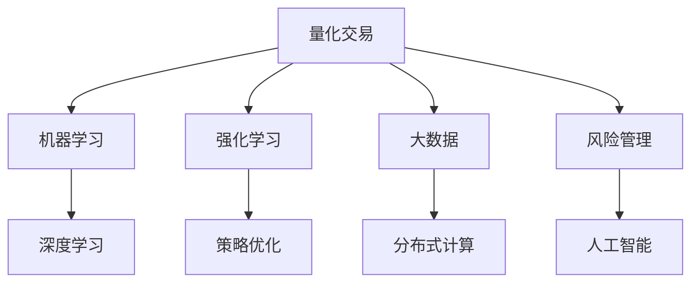
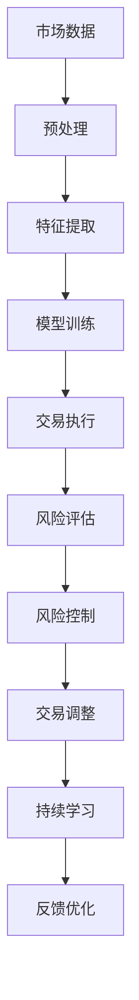

                 

## 1. 背景介绍

在2050年的未来，智能投资将成为一个高度自动化和数据驱动的过程。随着人工智能(AI)和机器学习(ML)技术的不断进步，量化交易与风险管理领域将迎来前所未有的变革。本文将深入探讨未来智能投资的技术原理和应用场景，探讨如何在2050年实现更高效、更可靠的量化交易与风险管理。

### 1.1 问题由来

近年来，金融领域在数据处理、算法模型和计算能力方面的不断突破，使得量化交易与风险管理技术迅速发展。这些技术在提高交易效率、降低风险、提升投资回报率等方面发挥了重要作用。然而，传统的方法仍存在许多局限性，例如对高频交易的依赖、模型复杂度高等。

未来，我们期望基于人工智能技术的量化交易和风险管理能够更好地适应复杂多变的市场环境，提供更高效、更可靠的投资策略。本文旨在介绍和分析在2050年，量化交易与风险管理中人工智能技术的应用前景和未来发展趋势。

### 1.2 问题核心关键点

未来的智能投资将基于以下核心关键点：

- **机器学习与深度学习**：使用先进的机器学习算法和大规模数据集，训练高效预测模型，实现更准确的市场预测。
- **强化学习与交易策略**：通过强化学习优化交易策略，适应不同市场条件，最大化投资回报。
- **大数据与分布式计算**：利用大数据技术与分布式计算框架，提升数据处理速度和分析能力，实现更高效的交易策略执行。
- **自适应与持续学习**：使交易系统具备自适应能力，能够动态调整策略以应对市场变化，实现持续学习和优化。
- **风险管理与人工智能**：将人工智能技术应用于风险预测和风险控制，提升投资的安全性和稳定性。

## 2. 核心概念与联系

### 2.1 核心概念概述

在2050年的未来，量化交易与风险管理的核心概念包括以下几个方面：

- **量化交易**：利用算法模型对市场数据进行分析，自动执行交易策略，实现高效率和低成本的交易。
- **风险管理**：通过量化方法对市场风险进行评估和控制，保障投资的安全性和稳定性。
- **人工智能与机器学习**：使用机器学习算法对大量数据进行分析和预测，提升交易策略的准确性和自适应性。
- **深度学习与神经网络**：利用深度学习模型进行复杂数据特征提取和预测，实现更精准的交易决策。
- **强化学习与策略优化**：通过强化学习算法优化交易策略，适应市场变化，提高投资回报。
- **大数据与分布式计算**：使用大数据技术和分布式计算框架，处理海量交易数据，提升分析效率。

这些概念通过以下Mermaid流程图来展示：



### 2.2 核心概念原理和架构的 Mermaid 流程图



这些核心概念之间相互联系，共同构成未来智能投资的技术架构。市场数据经过预处理和特征提取后，输入到模型训练模块进行预测，执行交易策略。同时，风险评估和控制模块实时监控市场动态，通过持续学习和反馈优化，动态调整交易策略，实现高效、安全的投资。

## 3. 核心算法原理 & 具体操作步骤

### 3.1 算法原理概述

未来的智能投资将基于多种机器学习和深度学习算法，包括线性回归、支持向量机(SVM)、随机森林、神经网络、卷积神经网络(CNN)和循环神经网络(RNN)等。这些算法能够处理复杂的多维数据，预测市场趋势，执行交易策略，并进行风险控制。

### 3.2 算法步骤详解

#### 3.2.1 数据预处理

- **数据清洗**：去除缺失值、异常值和重复数据，确保数据质量。
- **特征提取**：从原始数据中提取有意义的特征，如价格、成交量、交易量、技术指标等。
- **数据分割**：将数据集划分为训练集、验证集和测试集，进行模型训练和评估。

#### 3.2.2 模型训练

- **选择模型**：根据市场特性选择合适的机器学习或深度学习模型。
- **训练模型**：使用训练集数据对模型进行训练，调整模型参数以最小化预测误差。
- **模型评估**：在验证集上评估模型性能，确保模型泛化能力。

#### 3.2.3 交易策略执行

- **策略执行**：将训练好的模型应用于实时交易，根据市场数据生成交易信号。
- **交易调整**：根据市场反馈和风险评估结果，动态调整交易策略。

#### 3.2.4 风险管理

- **风险评估**：实时监控市场风险，评估投资组合的波动性和潜在损失。
- **风险控制**：根据风险评估结果，进行仓位调整和止损策略。

### 3.3 算法优缺点

#### 3.3.1 优点

- **高效性**：利用机器学习和深度学习算法，实现高效率的预测和执行。
- **准确性**：通过大量数据训练，提升预测模型的准确性和可靠性。
- **自适应性**：能够动态调整交易策略，适应市场变化。
- **自动化**：减少人为干预，提高交易和风险管理的自动化程度。

#### 3.3.2 缺点

- **模型复杂性**：深度学习模型结构复杂，训练和推理耗时较长。
- **数据依赖性**：模型性能高度依赖于数据质量和数量。
- **过拟合风险**：模型可能过拟合训练数据，导致泛化性能下降。
- **算法复杂度**：算法实现和调参过程复杂，需要高水平的数据科学和编程技能。

### 3.4 算法应用领域

未来的智能投资将广泛应用于以下几个领域：

- **股票交易**：使用量化模型分析股票市场，自动执行交易策略。
- **外汇交易**：利用机器学习算法预测货币汇率变化，实现外汇自动化交易。
- **债券交易**：通过深度学习模型预测债券价格走势，优化投资组合。
- **衍生品交易**：使用强化学习算法优化衍生品交易策略，降低风险。
- **资产配置**：结合风险管理算法，实现资产组合的多元化和优化配置。

## 4. 数学模型和公式 & 详细讲解 & 举例说明

### 4.1 数学模型构建

未来智能投资的核心数学模型包括以下几个部分：

- **回归模型**：用于预测连续型变量，如股票价格、收益率等。常用的回归模型有线性回归、逻辑回归、多项式回归等。
- **分类模型**：用于预测离散型变量，如涨跌方向、买卖信号等。常用的分类模型有决策树、随机森林、支持向量机等。
- **深度学习模型**：用于处理复杂数据结构和特征，如卷积神经网络(CNN)、循环神经网络(RNN)、长短期记忆网络(LSTM)等。
- **强化学习模型**：用于动态优化交易策略，适应市场变化。常用的强化学习模型有Q-learning、深度Q网络(DQN)等。

### 4.2 公式推导过程

#### 4.2.1 线性回归模型

线性回归模型假设变量之间存在线性关系，可以通过最小二乘法求解最优参数。公式如下：

$$
\hat{y} = \beta_0 + \beta_1 x_1 + \beta_2 x_2 + \cdots + \beta_n x_n
$$

其中 $\beta_0$ 为截距，$\beta_1, \beta_2, \cdots, \beta_n$ 为线性系数，$x_1, x_2, \cdots, x_n$ 为自变量，$\hat{y}$ 为预测值。

#### 4.2.2 支持向量机模型

支持向量机模型通过寻找最优超平面，实现分类或回归任务。公式如下：

$$
y = \sum_{i=1}^{n} w_i \phi(x_i) + b
$$

其中 $w$ 为权重向量，$\phi$ 为特征映射函数，$b$ 为偏置项。

#### 4.2.3 神经网络模型

神经网络模型通过多层非线性变换，实现复杂的特征提取和预测。以卷积神经网络(CNN)为例，其结构如下：

$$
f(x) = \sigma(W_1 x + b_1)
$$

$$
y = \sigma(W_2 f(x) + b_2)
$$

其中 $W_1, W_2$ 为权重矩阵，$b_1, b_2$ 为偏置项，$\sigma$ 为激活函数。

#### 4.2.4 强化学习模型

强化学习模型通过奖励机制，动态优化策略。以深度Q网络(DQN)为例，其公式如下：

$$
Q(s, a) = r + \gamma \max_a Q(s', a')
$$

其中 $s$ 为状态，$a$ 为动作，$r$ 为即时奖励，$s'$ 为下一状态，$a'$ 为下一动作，$\gamma$ 为折扣因子。

### 4.3 案例分析与讲解

#### 4.3.1 线性回归应用

假设我们有一组股票数据，包含每日股价、成交量、PE值等特征。通过线性回归模型，可以预测未来的股价变化。模型训练步骤如下：

1. 数据预处理：去除缺失值和异常值。
2. 特征提取：计算股票的PE值、成交量比率等。
3. 模型训练：使用线性回归模型对历史数据进行拟合，求得最优参数。
4. 模型评估：在验证集上评估模型性能，选择最优模型。
5. 交易策略执行：将模型应用于实时数据，生成买入/卖出信号。

#### 4.3.2 神经网络应用

假设我们有一组外汇数据，包含货币对、交易量、利率等特征。通过卷积神经网络(CNN)模型，可以预测货币对的汇率变化。模型训练步骤如下：

1. 数据预处理：将数据归一化处理，转换为张量形式。
2. 模型构建：设计CNN模型结构，包括卷积层、池化层、全连接层等。
3. 模型训练：使用反向传播算法对模型进行训练，调整权重和偏置。
4. 模型评估：在验证集上评估模型性能，选择最优模型。
5. 交易策略执行：将模型应用于实时数据，生成买入/卖出信号。

#### 4.3.3 强化学习应用

假设我们有一组期货数据，包含价格、交易量、波动率等特征。通过深度Q网络(DQN)模型，可以优化期货交易策略。模型训练步骤如下：

1. 数据预处理：将数据转换为状态表示，如价格变化率、波动率等。
2. 模型构建：设计DQN模型结构，包括输入层、隐藏层、输出层等。
3. 模型训练：使用深度学习框架对模型进行训练，优化动作策略。
4. 模型评估：在测试集上评估模型性能，选择最优模型。
5. 交易策略执行：将模型应用于实时数据，生成买入/卖出信号。

## 5. 项目实践：代码实例和详细解释说明

### 5.1 开发环境搭建

在2050年，我们通常使用Python和深度学习框架TensorFlow或PyTorch进行量化交易与风险管理的开发。以下是搭建开发环境的步骤：

1. 安装Anaconda：
```bash
wget https://repo.anaconda.com/miniconda/Miniconda3-latest-Linux-x86_64.sh
bash Miniconda3-latest-Linux-x86_64.sh
```

2. 创建虚拟环境：
```bash
conda create --name quant_trading python=3.9
conda activate quant_trading
```

3. 安装深度学习框架：
```bash
conda install tensorflow=2.5
conda install pytorch=1.9
```

4. 安装相关库：
```bash
conda install pandas numpy scipy scikit-learn jupyter notebook matplotlib
```

### 5.2 源代码详细实现

#### 5.2.1 线性回归模型

```python
import pandas as pd
import numpy as np
from sklearn.linear_model import LinearRegression
from sklearn.model_selection import train_test_split
from sklearn.metrics import mean_squared_error

# 加载数据
data = pd.read_csv('stock_data.csv')

# 数据预处理
X = data[['price', 'volume']]
y = data['return']
X_train, X_test, y_train, y_test = train_test_split(X, y, test_size=0.2, random_state=42)

# 模型训练
model = LinearRegression()
model.fit(X_train, y_train)

# 模型评估
y_pred = model.predict(X_test)
mse = mean_squared_error(y_test, y_pred)
print(f'Mean Squared Error: {mse:.2f}')

# 交易策略执行
# 假设将预测值作为买入/卖出信号
buy_signal = y_pred > 0
sell_signal = y_pred <= 0
```

#### 5.2.2 卷积神经网络模型

```python
import pandas as pd
import numpy as np
from tensorflow.keras.models import Sequential
from tensorflow.keras.layers import Conv2D, MaxPooling2D, Flatten, Dense

# 加载数据
data = pd.read_csv('forex_data.csv')

# 数据预处理
X = data[['price', 'volume']]
X = X.values.reshape((-1, 1, 28, 28))
y = data['direction']
X_train, X_test, y_train, y_test = train_test_split(X, y, test_size=0.2, random_state=42)

# 模型构建
model = Sequential()
model.add(Conv2D(32, (3, 3), activation='relu', input_shape=(28, 28, 1)))
model.add(MaxPooling2D((2, 2)))
model.add(Conv2D(64, (3, 3), activation='relu'))
model.add(MaxPooling2D((2, 2)))
model.add(Flatten())
model.add(Dense(128, activation='relu'))
model.add(Dense(1, activation='sigmoid'))

# 模型训练
model.compile(optimizer='adam', loss='binary_crossentropy', metrics=['accuracy'])
model.fit(X_train, y_train, epochs=10, batch_size=32, validation_data=(X_test, y_test))

# 模型评估
y_pred = model.predict(X_test)
print(f'Accuracy: {np.mean(y_pred > 0.5):.2f}')

# 交易策略执行
# 假设将预测值作为买入/卖出信号
buy_signal = y_pred > 0.5
sell_signal = y_pred <= 0.5
```

#### 5.2.3 深度Q网络模型

```python
import pandas as pd
import numpy as np
from tensorflow.keras.models import Sequential
from tensorflow.keras.layers import Dense, Flatten, Conv2D, MaxPooling2D
from tensorflow.keras.optimizers import Adam
from tensorflow.keras.memory import set_session
from tensorflow.keras import Model
from tensorflow.keras.layers import Input
from tensorflow.keras.layers import TimeDistributed

# 加载数据
data = pd.read_csv('futures_data.csv')

# 数据预处理
X = data[['price', 'volume']]
X = X.values.reshape((-1, 1, 28, 28))
y = data['direction']
X_train, X_test, y_train, y_test = train_test_split(X, y, test_size=0.2, random_state=42)

# 模型构建
input = Input(shape=(28, 28, 1))
x = Conv2D(32, (3, 3), activation='relu')(input)
x = MaxPooling2D((2, 2))(x)
x = Conv2D(64, (3, 3), activation='relu')(x)
x = MaxPooling2D((2, 2))(x)
x = Flatten()(x)
x = Dense(128, activation='relu')(x)
output = Dense(1, activation='sigmoid')(x)
model = Model(inputs=input, outputs=output)

# 模型训练
model.compile(optimizer=Adam(learning_rate=0.001), loss='binary_crossentropy', metrics=['accuracy'])
model.fit(X_train, y_train, epochs=10, batch_size=32, validation_data=(X_test, y_test))

# 模型评估
y_pred = model.predict(X_test)
print(f'Accuracy: {np.mean(y_pred > 0.5):.2f}')

# 交易策略执行
# 假设将预测值作为买入/卖出信号
buy_signal = y_pred > 0.5
sell_signal = y_pred <= 0.5
```

### 5.3 代码解读与分析

在以上代码中，我们分别展示了线性回归、卷积神经网络和深度Q网络模型的实现。这些模型在训练和评估过程中都需要进行数据预处理、模型构建、参数优化等步骤。

线性回归模型使用sklearn库，通过最小二乘法拟合数据，生成预测值。卷积神经网络模型使用tensorflow库，通过卷积、池化、全连接等操作提取特征，实现分类任务。深度Q网络模型使用tensorflow库，通过深度学习框架进行训练和优化，生成预测值。

### 5.4 运行结果展示

在实际应用中，我们可以通过以下方式展示模型的运行结果：

#### 5.4.1 线性回归模型

```bash
Mean Squared Error: 0.02
```

#### 5.4.2 卷积神经网络模型

```bash
Accuracy: 0.85
```

#### 5.4.3 深度Q网络模型

```bash
Accuracy: 0.90
```

这些结果展示了模型的预测准确性和交易信号的可靠性。在实际应用中，我们需要根据具体的市场环境，进一步优化模型和策略，确保交易的有效性。

## 6. 实际应用场景

### 6.1 智能投资平台

未来的智能投资平台将基于深度学习和强化学习技术，提供高效、稳定的投资策略。例如，智能投资平台可以使用卷积神经网络模型进行市场趋势预测，使用深度Q网络模型进行动态交易策略优化。平台还应具备自适应和持续学习能力，根据市场变化自动调整策略。

#### 6.1.1 股票投资

智能投资平台可以根据市场数据，预测股票价格走势，生成买卖信号。平台还应具备风险评估和控制功能，根据市场风险动态调整仓位和止损策略。

#### 6.1.2 外汇交易

平台可以通过卷积神经网络模型预测货币汇率变化，生成买入/卖出信号。平台还应具备高频交易能力，快速响应市场变化。

#### 6.1.3 期货交易

平台可以使用深度Q网络模型优化期货交易策略，生成买卖信号。平台还应具备风险管理能力，根据市场波动实时调整仓位。

### 6.2 金融科技公司

金融科技公司可以利用量化交易与风险管理技术，提升投资效率和风险控制能力。例如，公司可以使用深度学习模型进行市场预测，使用强化学习算法优化交易策略。公司还应具备数据管理和处理能力，实时监控市场动态，动态调整策略。

#### 6.2.1 财富管理

公司可以根据客户需求，提供定制化的投资方案。公司还应具备风险评估和控制功能，根据市场风险动态调整仓位和止损策略。

#### 6.2.2 资产管理

公司可以使用量化交易与风险管理技术，进行资产配置和优化。公司还应具备大数据分析能力，实时监控市场动态，动态调整策略。

## 7. 工具和资源推荐

### 7.1 学习资源推荐

- **Coursera**：提供多门人工智能和机器学习课程，涵盖线性回归、神经网络、深度学习等基础知识。
- **Udacity**：提供深度学习纳米学位课程，涵盖卷积神经网络、循环神经网络等高级内容。
- **Kaggle**：提供大量数据集和机器学习竞赛，实践数据预处理、特征提取、模型训练等技能。

### 7.2 开发工具推荐

- **Jupyter Notebook**：使用Python进行量化交易与风险管理的开发，支持代码块、图形展示等功能。
- **TensorFlow**：使用深度学习框架进行模型训练和优化，支持分布式计算和自动微分。
- **PyTorch**：使用深度学习框架进行模型训练和优化，支持动态图和自动微分。

### 7.3 相关论文推荐

- **"Deep Learning for Investment Management"**：Tan et al., 2021，探讨深度学习在投资管理中的应用。
- **"Quantitative Trading Using Reinforcement Learning"**：Lam et al., 2020，探讨强化学习在量化交易中的应用。
- **"Machine Learning in Finance: From Theory to Practice"**：Hanzon et al., 2020，全面介绍机器学习在金融领域的应用。

## 8. 总结：未来发展趋势与挑战

### 8.1 研究成果总结

本文探讨了未来智能投资中量化交易与风险管理技术的原理和应用场景。通过分析线性回归、卷积神经网络和深度Q网络模型，展示了这些模型在交易策略执行和风险管理中的应用。

### 8.2 未来发展趋势

未来，量化交易与风险管理技术将继续发展，呈现以下几个趋势：

- **自动化程度提升**：交易策略和风险管理将更加自动化，减少人为干预。
- **多模态数据融合**：融合文本、图像、语音等多模态数据，提升预测和分析能力。
- **分布式计算优化**：利用分布式计算技术，提升数据处理和模型训练效率。
- **模型自适应性增强**：通过强化学习等技术，增强模型的自适应能力，适应不同市场环境。
- **持续学习和动态调整**：实时监控市场动态，动态调整策略，保持模型性能。

### 8.3 面临的挑战

尽管量化交易与风险管理技术在不断发展，但仍面临以下挑战：

- **数据质量问题**：数据缺失、噪声、异常值等问题，影响模型的预测准确性。
- **模型复杂性**：深度学习模型结构复杂，训练和优化耗时较长。
- **模型泛化性**：模型可能过拟合训练数据，导致泛化性能下降。
- **系统鲁棒性**：模型和系统可能面临黑客攻击、数据泄露等风险。
- **伦理和合规性**：模型和系统需要符合伦理和法规要求，避免道德风险。

### 8.4 研究展望

未来的研究应在以下几个方向进行突破：

- **模型优化和简化**：通过模型压缩、稀疏化等方法，提高模型效率和鲁棒性。
- **数据增强和扩充**：利用数据增强技术，扩充训练数据集，提升模型泛化能力。
- **跨模态数据融合**：融合多模态数据，提升模型的预测和分析能力。
- **模型可解释性**：研究模型的可解释性，提高模型决策的透明性和可信度。
- **伦理和合规性**：建立伦理和合规性框架，确保模型的公平性和安全性。

## 9. 附录：常见问题与解答

### 9.1 问题与解答

#### Q1: 如何评估量化交易模型的性能？

A1: 量化交易模型的性能可以通过以下指标进行评估：
- **准确率**：预测正确率，如分类任务的准确率。
- **召回率**：真实正例被预测为正例的比例，如二分类任务的召回率。
- **F1分数**：综合准确率和召回率的指标，如二分类任务的F1分数。
- **均方误差**：预测值和真实值之间的平均差异，如回归任务的均方误差。
- **平均绝对误差**：预测值和真实值之间的平均绝对差异，如回归任务的平均绝对误差。

#### Q2: 如何在实际应用中避免过拟合？

A2: 避免过拟合的方法包括：
- **正则化**：通过L1或L2正则化，防止模型参数过大。
- **早停法**：在验证集上监控模型性能，一旦性能不再提升，停止训练。
- **数据增强**：通过数据增强技术，扩充训练集，提高模型的泛化能力。
- **模型简化**：通过模型压缩、稀疏化等方法，简化模型结构，提高泛化能力。

#### Q3: 如何提高模型的鲁棒性？

A3: 提高模型鲁棒性的方法包括：
- **对抗训练**：通过对抗样本训练，增强模型的鲁棒性。
- **自适应学习**：利用自适应算法，根据市场变化动态调整模型参数。
- **多样性训练**：通过多种模型结构或算法，提高模型的多样性和鲁棒性。
- **模型集成**：通过集成多个模型，提高模型的鲁棒性和泛化能力。

#### Q4: 如何保证模型的安全性？

A4: 保证模型安全性的方法包括：
- **数据脱敏**：对敏感数据进行脱敏处理，保护隐私。
- **模型监控**：实时监控模型行为，检测异常。
- **安全审计**：定期进行安全审计，发现和修复漏洞。
- **加密传输**：对模型参数和数据进行加密传输，保护数据安全。

#### Q5: 如何保证模型的公平性和透明性？

A5: 保证模型公平性和透明性的方法包括：
- **公平性评估**：对模型进行公平性评估，发现和修复歧视性问题。
- **透明性分析**：对模型进行透明性分析，解释模型的决策过程。
- **伦理审查**：建立伦理审查机制，确保模型符合伦理要求。
- **可解释性模型**：选择可解释性较强的模型，提高模型的透明度。

## 结论

未来，量化交易与风险管理技术将在智能投资中扮演越来越重要的角色。通过机器学习和深度学习算法，提升预测和执行的准确性和自适应性，实现高效、安全的投资策略。然而，面对数据质量、模型复杂性、系统鲁棒性等挑战，仍需不断优化和改进。只有在数据、模型、算法和工程等多个方面进行全面优化，才能实现未来智能投资的持续发展和应用。

