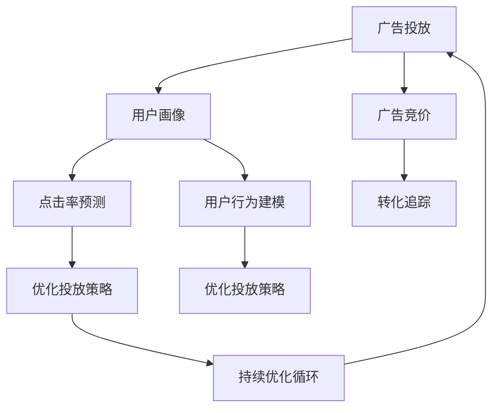

                 

## 1. 背景介绍

### 1.1 问题由来

随着互联网的迅速发展，广告投放成为各大平台获取流量和收益的重要手段。然而，传统的广告投放方式面临着诸多挑战，如广告点击率低、投入产出比不足、用户流失率高、用户行为预测困难等。这些问题直接导致了广告投放成本的增加，以及平台的用户流失率提升。为了提升广告投放效果，各大平台开始借助机器学习技术对广告进行优化，力求精准投放、提高转化率，并有效控制广告成本。

### 1.2 问题核心关键点

机器学习在广告投放优化中的应用，关键在于以下两个方面：

1. **广告点击率预测（CTR prediction）**：通过机器学习模型预测广告被点击的概率，从而对广告进行排序，将点击率高的广告优先投放。
2. **用户行为建模（User Behavior Modeling）**：分析用户的兴趣和行为特征，预测用户的后续行为，如转化、流失等，为广告投放提供依据。

广告投放优化主要分为两个阶段：首先利用机器学习模型对广告进行投放排序，然后在实际投放过程中通过反馈机制不断优化模型参数，形成持续优化循环。

### 1.3 问题研究意义

机器学习在广告投放优化中的应用，有助于实现广告投放的精准化、智能化，通过科学预测和行为分析，使得广告投放更加精准高效，降低成本、提升效果。

1. **提高广告投放效果**：通过精准预测广告点击率，优化广告投放策略，减少无效广告投放，提升广告转化率，增加平台收益。
2. **提升用户满意度**：通过理解用户行为，个性化推荐广告内容，提升用户体验，减少用户流失。
3. **优化广告投放成本**：通过机器学习模型，根据用户行为数据进行投放优化，使得广告投放更加精准，减少无效广告投放，有效控制广告成本。
4. **助力业务增长**：利用机器学习技术，提高广告投放的转化率和效果，推动业务增长，增强市场竞争力。

## 2. 核心概念与联系

### 2.1 核心概念概述

为更好地理解机器学习在广告投放优化中的应用，本节将介绍几个密切相关的核心概念：

- **广告投放**：通过特定平台投放广告，并获取广告效果。广告投放效果通常包含点击率（CTR）、转化率（Conversion Rate, CR）、成本效益比（Cost Per Acquisition, CPA）等关键指标。
- **用户画像（User Profiling）**：通过机器学习算法分析用户行为数据，建立用户兴趣、行为、特征等综合画像，为广告投放提供基础。
- **广告竞价（Ad Auction）**：平台通过机器学习算法对广告进行竞价排序，根据广告效果和用户画像，决定广告投放价格。
- **转化追踪（Conversion Tracking）**：通过用户行为数据追踪，分析广告投放效果，优化投放策略。
- **强化学习（Reinforcement Learning, RL）**：一种通过不断试错优化策略的机器学习方法，常用于广告投放优化中的反馈机制。

这些核心概念之间的逻辑关系可以通过以下Mermaid流程图来展示：



这个流程图展示了广告投放优化的核心概念及其相互关系：

1. 广告投放以用户画像为基础，通过点击率预测和用户行为建模，对广告进行竞价排序。
2. 转化追踪获取广告效果反馈，优化投放策略。
3. 优化投放策略不断迭代，形成持续优化循环。

## 3. 核心算法原理 & 具体操作步骤

### 3.1 算法原理概述

机器学习在广告投放优化中的核心算法包括线性回归、逻辑回归、决策树、随机森林、梯度提升树、深度学习等，其中深度学习特别是神经网络在广告投放中表现尤为突出。

广告投放优化的主要流程如下：

1. **数据准备**：收集广告点击数据、用户行为数据、广告特征数据等，并清洗处理，确保数据质量。
2. **特征工程**：根据广告投放需求，进行特征提取、选择和处理，构建特征向量。
3. **模型训练**：选择合适模型，利用训练数据训练模型，优化模型参数。
4. **效果评估**：利用测试数据集评估模型效果，选择最优模型。
5. **实际投放**：在广告投放系统中部署模型，实时监控广告投放效果，根据反馈数据不断优化模型。

### 3.2 算法步骤详解

#### 3.2.1 数据准备

数据准备是广告投放优化的第一步，主要包括以下几个步骤：

1. **数据收集**：从广告投放系统中收集广告点击数据、用户行为数据等。
2. **数据清洗**：去除噪音数据、缺失值、重复数据等，确保数据质量。
3. **特征提取**：从原始数据中提取有用的特征，如广告特征、用户特征、时间特征等。

#### 3.2.2 特征工程

特征工程是广告投放优化的核心，通过合理的特征提取和处理，可以有效提升模型的预测效果。主要包括以下几个步骤：

1. **特征选择**：选择对广告效果有显著影响的特征，去除不相关特征。
2. **特征处理**：对特征进行标准化、归一化、离散化等处理，提升特征质量。
3. **特征工程技巧**：如时间特征的滑动窗口、广告特征的交叉特征、用户特征的编码等。

#### 3.2.3 模型训练

模型训练是广告投放优化的关键环节，主要包括以下几个步骤：

1. **模型选择**：根据广告投放需求，选择合适的机器学习模型。
2. **模型训练**：利用训练数据集训练模型，优化模型参数。
3. **模型评估**：利用测试数据集评估模型效果，选择最优模型。

#### 3.2.4 实际投放

实际投放是将模型应用到广告投放系统中，主要包括以下几个步骤：

1. **模型部署**：在广告投放系统中部署模型，实现实时预测。
2. **广告排序**：根据广告投放效果，对广告进行排序，优先展示高点击率的广告。
3. **反馈优化**：实时收集广告投放反馈数据，不断优化模型。

### 3.3 算法优缺点

机器学习在广告投放优化中的应用，具有以下优点：

1. **精准投放**：通过机器学习模型，精确预测广告点击率和用户行为，实现广告精准投放。
2. **自动化优化**：利用机器学习算法，自动化调整广告投放策略，提升广告效果。
3. **实时监控**：通过机器学习模型实时监控广告投放效果，及时调整策略。

同时，该方法也存在一定的局限性：

1. **数据依赖**：机器学习模型对数据质量要求较高，数据量不足或数据噪音较大时，模型效果会受影响。
2. **模型复杂度**：深度学习模型通常参数较多，训练复杂度较高，需要大量计算资源。
3. **过拟合风险**：在数据量较少时，模型可能出现过拟合现象，降低模型泛化能力。
4. **可解释性差**：深度学习模型通常缺乏可解释性，难以理解其内部决策逻辑。

尽管存在这些局限性，但就目前而言，机器学习在广告投放优化中已展现出显著的优势，并逐渐成为广告投放优化的重要手段。

### 3.4 算法应用领域

机器学习在广告投放优化中的应用，不仅局限于传统广告平台，还广泛应用于各个领域的广告投放，如电商广告、视频广告、搜索引擎广告等。这些领域中，机器学习技术被广泛应用于广告点击率预测、用户行为建模、广告竞价排序等多个方面，实现了广告投放的精准化、智能化。

## 4. 数学模型和公式 & 详细讲解 & 举例说明

### 4.1 数学模型构建

广告投放优化中的主要数学模型包括线性回归模型、逻辑回归模型、深度神经网络模型等。这里以线性回归模型为例，介绍广告投放优化中的数学模型构建。

假设广告点击率为 $y$，广告特征为 $x$，则线性回归模型为：

$$
y = \theta_0 + \theta_1 x_1 + \theta_2 x_2 + \ldots + \theta_n x_n + \epsilon
$$

其中，$\theta_0, \theta_1, \theta_2, \ldots, \theta_n$ 为模型参数，$\epsilon$ 为误差项。

### 4.2 公式推导过程

线性回归模型的最小二乘法优化目标为：

$$
\min_{\theta} \sum_{i=1}^N (y_i - \hat{y_i})^2
$$

其中，$y_i$ 为第 $i$ 个样本的真实点击率，$\hat{y_i}$ 为模型预测的点击率。

根据最小二乘法，可以得到模型参数的求解公式为：

$$
\theta = (X^T X)^{-1} X^T y
$$

其中，$X$ 为样本特征矩阵，$y$ 为样本标签向量。

### 4.3 案例分析与讲解

以电商广告为例，通过机器学习模型进行广告投放优化。首先收集广告点击数据、用户行为数据、广告特征数据等，并进行数据清洗和特征工程，构建特征向量。

然后，选择线性回归模型进行训练，得到广告点击率的预测模型。最后，利用测试数据集评估模型效果，选择最优模型，并在广告投放系统中部署模型，实时监控广告投放效果，不断优化模型参数。

## 5. 项目实践：代码实例和详细解释说明

### 5.1 开发环境搭建

在进行广告投放优化实践前，我们需要准备好开发环境。以下是使用Python进行机器学习广告投放优化的环境配置流程：

1. 安装Anaconda：从官网下载并安装Anaconda，用于创建独立的Python环境。
2. 创建并激活虚拟环境：
```bash
conda create -n ad-env python=3.8 
conda activate ad-env
```

3. 安装必要的Python包：
```bash
pip install pandas numpy scikit-learn seaborn matplotlib
```

4. 安装机器学习库：
```bash
pip install scikit-learn
```

完成上述步骤后，即可在`ad-env`环境中开始广告投放优化的代码实践。

### 5.2 源代码详细实现

这里我们以线性回归模型为例，给出使用Scikit-learn进行广告投放优化的Python代码实现。

```python
from sklearn.linear_model import LinearRegression
from sklearn.metrics import mean_squared_error
from sklearn.model_selection import train_test_split
import pandas as pd
import numpy as np

# 加载数据
data = pd.read_csv('ad_data.csv')

# 特征工程
X = data[['feat1', 'feat2', 'feat3', 'feat4', 'feat5']]
y = data['label']

# 分割数据集
X_train, X_test, y_train, y_test = train_test_split(X, y, test_size=0.2, random_state=42)

# 训练模型
model = LinearRegression()
model.fit(X_train, y_train)

# 预测广告点击率
y_pred = model.predict(X_test)

# 评估模型效果
mse = mean_squared_error(y_test, y_pred)
print(f'Mean Squared Error: {mse:.3f}')
```

### 5.3 代码解读与分析

让我们再详细解读一下关键代码的实现细节：

**加载数据**：
```python
data = pd.read_csv('ad_data.csv')
```

通过Pandas库读取广告投放数据，包括广告点击率、用户行为数据、广告特征数据等，并进行清洗处理。

**特征工程**：
```python
X = data[['feat1', 'feat2', 'feat3', 'feat4', 'feat5']]
y = data['label']
```

根据广告投放需求，从原始数据中提取有用的特征，并构建特征向量。

**模型训练**：
```python
model = LinearRegression()
model.fit(X_train, y_train)
```

选择线性回归模型，利用训练数据集训练模型，优化模型参数。

**预测广告点击率**：
```python
y_pred = model.predict(X_test)
```

利用测试数据集评估模型效果，选择最优模型。

**评估模型效果**：
```python
mse = mean_squared_error(y_test, y_pred)
print(f'Mean Squared Error: {mse:.3f}')
```

使用均方误差评估模型效果，输出模型评估指标。

### 5.4 运行结果展示

广告投放优化中，通过机器学习模型训练得到的广告点击率预测模型，能够在实际投放过程中实时预测广告点击率，优化广告投放策略，提升广告效果。

## 6. 实际应用场景

### 6.1 电商广告投放

电商广告是机器学习在广告投放优化中应用最为广泛的场景之一。电商平台通过机器学习模型预测广告点击率，优化广告投放策略，提高广告效果。

具体而言，电商平台可以收集用户浏览记录、点击记录、购买记录等数据，作为广告投放的依据。通过机器学习模型对用户行为进行分析和预测，对广告进行排序，优先展示高点击率的广告。同时，通过用户行为数据进行反馈优化，不断调整广告投放策略，提升广告效果。

### 6.2 视频广告投放

视频广告是另一种常见的广告形式。视频广告平台通过机器学习模型预测广告点击率，优化广告投放策略。

视频广告平台可以收集用户观看记录、点赞记录、评论记录等数据，作为广告投放的依据。通过机器学习模型对用户行为进行分析和预测，对广告进行排序，优先展示高点击率的广告。同时，通过用户行为数据进行反馈优化，不断调整广告投放策略，提升广告效果。

### 6.3 搜索引擎广告

搜索引擎广告是另一种常见的广告形式。搜索引擎通过机器学习模型预测广告点击率，优化广告投放策略。

搜索引擎可以收集用户搜索记录、点击记录、浏览记录等数据，作为广告投放的依据。通过机器学习模型对用户行为进行分析和预测，对广告进行排序，优先展示高点击率的广告。同时，通过用户行为数据进行反馈优化，不断调整广告投放策略，提升广告效果。

## 7. 工具和资源推荐

### 7.1 学习资源推荐

为了帮助开发者系统掌握机器学习在广告投放优化中的应用，这里推荐一些优质的学习资源：

1. Coursera的《机器学习》课程：由斯坦福大学的Andrew Ng教授主讲，深入浅出地介绍了机器学习的基本概念和算法，涵盖广告投放优化的典型场景。
2. Kaggle的机器学习竞赛：通过参与Kaggle的机器学习竞赛，实战练习广告投放优化的技能。
3. 《机器学习实战》书籍：详细介绍了广告投放优化的经典算法和模型，包含大量的代码实例。
4. HuggingFace官方文档：提供了丰富的广告投放优化的预训练模型和代码实现，是学习广告投放优化的重要参考资料。
5. 《深度学习入门》书籍：介绍了深度学习在广告投放中的应用，包含广告点击率预测、用户行为建模等经典案例。

通过对这些资源的学习实践，相信你一定能够快速掌握机器学习在广告投放优化中的应用方法，并用于解决实际的广告投放问题。

### 7.2 开发工具推荐

高效的开发离不开优秀的工具支持。以下是几款用于广告投放优化开发的常用工具：

1. Jupyter Notebook：支持Python编程和数据分析，是广告投放优化实验的常用工具。
2. TensorBoard：TensorFlow配套的可视化工具，可实时监测模型训练状态，并提供丰富的图表呈现方式，是调试广告投放优化模型的得力助手。
3. WEKA：开源数据挖掘工具，包含丰富的机器学习算法和评估指标，用于广告投放优化中的特征工程和模型评估。
4. OpenCV：开源计算机视觉库，可用于视频广告的图像处理和特征提取。
5. Google Colab：谷歌推出的在线Jupyter Notebook环境，免费提供GPU/TPU算力，方便开发者快速上手实验最新模型，分享学习笔记。

合理利用这些工具，可以显著提升广告投放优化的开发效率，加快创新迭代的步伐。

### 7.3 相关论文推荐

机器学习在广告投放优化中的应用，近年来得到了广泛的研究。以下是几篇奠基性的相关论文，推荐阅读：

1. Ad Click Prediction with Deep Learning：提出深度神经网络模型，利用广告点击数据进行广告投放优化。
2. A Comprehensive Survey on Recommendation System Based on Machine Learning：对基于机器学习的推荐系统进行了全面的综述，涵盖广告投放优化的核心算法。
3. Click-Through Rate Prediction via Deep Matrix Factorization：提出深度矩阵分解方法，用于广告点击率预测。
4. User Behavior Modeling for Advertised Video Streams：通过用户行为数据，预测视频广告点击率，优化广告投放策略。
5. Predicting Ad Engagement from User Engagement via Deep Neural Networks：提出深度神经网络模型，预测广告点击率和用户参与度，优化广告投放效果。

这些论文代表了大数据和机器学习在广告投放优化中的应用趋势，推动了广告投放技术的发展。

## 8. 总结：未来发展趋势与挑战

### 8.1 总结

本文对机器学习在广告投放优化中的应用进行了全面系统的介绍。首先阐述了广告投放优化中机器学习的应用背景和意义，明确了机器学习在广告投放中的主要作用。其次，从原理到实践，详细讲解了广告投放优化的数学模型和操作步骤，给出了广告投放优化的完整代码实例。同时，本文还广泛探讨了广告投放优化在电商广告、视频广告、搜索引擎广告等多个领域的应用前景，展示了机器学习在广告投放优化中的巨大潜力。

通过本文的系统梳理，可以看到，机器学习在广告投放优化中的应用，实现了广告投放的精准化、智能化，显著提升了广告投放效果和用户满意度。未来，随着机器学习技术的不断演进，广告投放优化将更加高效、精准，为广告主带来更大的商业价值。

### 8.2 未来发展趋势

展望未来，机器学习在广告投放优化中的应用将呈现以下几个发展趋势：

1. **深度学习模型的普及**：深度神经网络模型在广告投放优化中的应用将逐渐普及，成为广告投放优化的主流算法。
2. **实时广告投放**：通过实时数据反馈，利用强化学习等算法不断调整广告投放策略，实现动态优化。
3. **跨平台广告投放**：不同平台的广告投放优化将通过统一的机器学习模型进行，实现跨平台优化。
4. **个性化广告推荐**：利用用户画像和行为数据，实现个性化广告推荐，提升用户体验。
5. **广告投放效果评估**：利用机器学习模型，实时评估广告投放效果，优化广告投放策略。

以上趋势凸显了机器学习在广告投放优化中的广泛应用和巨大潜力。这些方向的探索发展，必将进一步提升广告投放的精准度和效果，带来商业价值的最大化。

### 8.3 面临的挑战

尽管机器学习在广告投放优化中已展现出显著的优势，但在迈向更加智能化、普适化应用的过程中，它仍面临诸多挑战：

1. **数据隐私问题**：广告投放优化需要收集和分析大量的用户行为数据，如何保护用户隐私，防止数据滥用，是亟待解决的问题。
2. **模型复杂度**：深度学习模型通常参数较多，训练复杂度较高，需要大量计算资源。
3. **广告内容安全**：在广告投放过程中，如何防止恶意广告的投放，保障广告内容的安全，是广告投放优化的重要挑战。
4. **用户行为变化**：用户行为和兴趣是动态变化的，如何适应用户行为变化，持续优化广告投放策略，是广告投放优化的重要课题。
5. **模型过拟合**：在数据量较少时，模型可能出现过拟合现象，降低模型泛化能力。

### 8.4 研究展望

面对机器学习在广告投放优化所面临的种种挑战，未来的研究需要在以下几个方面寻求新的突破：

1. **数据隐私保护**：采用隐私保护技术，如差分隐私、联邦学习等，保护用户隐私，防止数据滥用。
2. **高效广告投放**：通过模型压缩、参数共享等技术，降低深度学习模型的计算复杂度，提高广告投放效率。
3. **广告内容监控**：引入图像识别、文本分类等技术，实时监控广告内容，防止恶意广告投放。
4. **用户行为预测**：利用时间序列分析、强化学习等技术，适应用户行为变化，持续优化广告投放策略。
5. **多模态广告投放**：利用图像、视频等多模态数据，提升广告投放效果。

这些研究方向的探索，必将引领机器学习在广告投放优化中迈向更高的台阶，为广告主带来更大的商业价值，同时也提升用户的广告体验。

## 9. 附录：常见问题与解答

**Q1：广告投放优化中如何选择合适的机器学习模型？**

A: 广告投放优化中，选择合适的机器学习模型需要考虑多个因素，如广告投放需求、数据特点、计算资源等。一般来说，可以遵循以下步骤：

1. **理解广告投放需求**：明确广告投放的目标和指标，如点击率预测、转化率预测等。
2. **收集和清洗数据**：收集广告点击数据、用户行为数据等，并进行清洗处理。
3. **特征工程**：进行特征提取和选择，构建特征向量。
4. **模型选择**：根据广告投放需求和数据特点，选择合适的机器学习模型。
5. **模型训练和评估**：利用训练数据集训练模型，利用测试数据集评估模型效果，选择最优模型。

**Q2：广告投放优化中如何处理广告点击数据和用户行为数据？**

A: 广告投放优化中，处理广告点击数据和用户行为数据主要包括以下几个步骤：

1. **数据收集**：从广告投放系统中收集广告点击数据、用户行为数据等。
2. **数据清洗**：去除噪音数据、缺失值、重复数据等，确保数据质量。
3. **特征提取**：从原始数据中提取有用的特征，如广告特征、用户特征、时间特征等。
4. **数据归一化**：对数据进行归一化处理，如标准化、归一化等，提升特征质量。
5. **数据平衡**：对不平衡数据进行平衡处理，如过采样、欠采样等，提升模型效果。

**Q3：广告投放优化中如何优化广告投放策略？**

A: 广告投放优化中，优化广告投放策略主要包括以下几个步骤：

1. **广告投放排序**：根据广告投放效果，对广告进行排序，优先展示高点击率的广告。
2. **反馈优化**：实时收集广告投放反馈数据，不断调整广告投放策略，优化广告效果。
3. **广告竞价优化**：根据广告效果和用户画像，优化广告竞价策略，提高广告投放效率。
4. **用户画像更新**：利用用户行为数据，更新用户画像，实现个性化广告推荐。

**Q4：广告投放优化中如何评估模型效果？**

A: 广告投放优化中，评估模型效果主要包括以下几个步骤：

1. **评估指标选择**：选择合适的评估指标，如均方误差（MSE）、平均绝对误差（MAE）、均方根误差（RMSE）等。
2. **模型验证**：利用测试数据集验证模型效果，选择最优模型。
3. **A/B测试**：通过A/B测试对比新旧模型的效果，选择最优模型。
4. **模型监控**：实时监测广告投放效果，及时调整广告投放策略。

**Q5：广告投放优化中如何防止过拟合现象？**

A: 广告投放优化中，防止过拟合现象主要包括以下几个步骤：

1. **数据扩充**：通过数据增强等方法，扩充训练集，提升模型泛化能力。
2. **正则化**：引入L1正则、L2正则等，防止模型过拟合。
3. **模型集成**：采用集成学习方法，如随机森林、AdaBoost等，提升模型泛化能力。
4. **早停机制**：利用早停机制，防止模型过拟合。

这些方法可以帮助广告投放优化中的机器学习模型避免过拟合现象，提升模型泛化能力和实际应用效果。

---

作者：禅与计算机程序设计艺术 / Zen and the Art of Computer Programming

