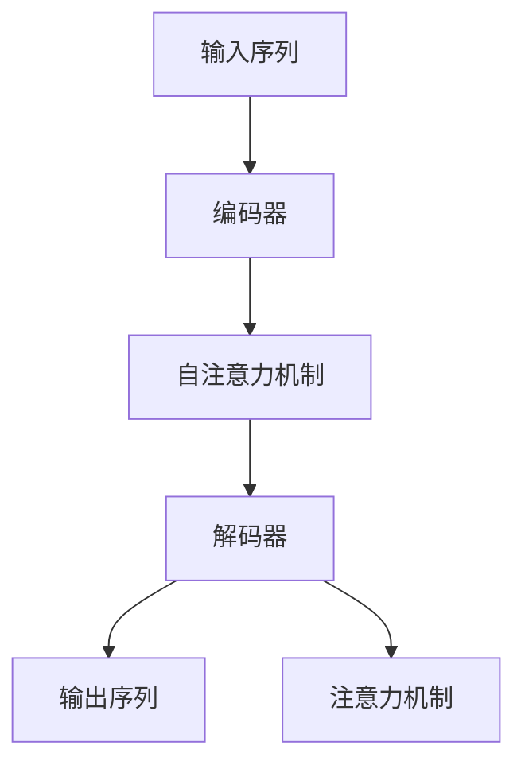

                 

# 机器翻译(Machine Translation) - 原理与代码实例讲解

> 关键词：机器翻译,神经机器翻译,序列到序列模型,Transformer,Transformer编码器-解码器模型,代码实例

## 1. 背景介绍

### 1.1 问题由来
机器翻译是人工智能和自然语言处理(Natural Language Processing, NLP)领域的一项重要任务。它旨在将一种语言的文本自动翻译成另一种语言，使不同语言之间的交流更加便捷。机器翻译技术已经从基于规则、统计的方法，逐渐过渡到基于神经网络的端到端方法。其中，基于序列到序列(Sequence to Sequence, Seq2Seq)模型的方法，特别是Transformer架构的神经机器翻译(Neural Machine Translation, NMT)方法，已经成为当前机器翻译领域的主流技术。

## 2. 核心概念与联系

### 2.1 核心概念概述

为了更好地理解机器翻译技术，我们需要首先介绍一些核心概念：

- **神经机器翻译(Neural Machine Translation, NMT)**：基于神经网络的机器翻译技术。相比传统的统计机器翻译(SMT)方法，NMT能够更好地捕捉语言的上下文关系，提升翻译质量和流畅度。
- **序列到序列(Sequence to Sequence, Seq2Seq)**：一种将输入序列映射到输出序列的神经网络架构。在机器翻译任务中，输入序列为源语言句子，输出序列为目标语言句子。
- **Transformer**：一种基于自注意力机制的自编码器模型。相比于传统的循环神经网络(RNN)和长短期记忆网络(LSTM)，Transformer在处理长距离依赖时表现更好，计算效率更高。
- **编码器-解码器模型(Encoder-Decoder Model)**：一种经典的Seq2Seq模型架构。编码器接收输入序列，解码器生成输出序列。
- **注意力机制(Attention Mechanism)**：一种机制，使得模型能够动态地关注输入序列中的重要部分，提升翻译效果。

这些核心概念之间的逻辑关系可以通过以下Mermaid流程图来展示：



这个流程图展示了Seq2Seq模型中编码器、解码器和注意力机制的作用。

## 3. 核心算法原理 & 具体操作步骤
### 3.1 算法原理概述

基于神经网络的机器翻译模型，通常由编码器、解码器和注意力机制组成。其核心思想是：将源语言序列编码成一个固定长度的向量表示，再将该向量解码为目标语言序列。

**编码器**接收源语言句子，通过自注意力机制将其编码成一个向量表示。**解码器**根据该向量表示，逐步生成目标语言句子，同时利用注意力机制关注源语言句子中的重要部分。

假设源语言句子为 $X=\{x_1, x_2, \ldots, x_n\}$，目标语言句子为 $Y=\{y_1, y_2, \ldots, y_m\}$，其中 $x_i$ 和 $y_i$ 分别为源语言和目标语言的词汇。设 $E$ 为编码器的输出向量，$D$ 为解码器的输出向量，则机器翻译模型可以表示为：

$$
Y = \text{decode}(E, D)
$$

其中，$\text{decode}$ 为解码器，通过 $E$ 和 $D$ 生成目标语言句子 $Y$。

### 3.2 算法步骤详解

基于神经网络的机器翻译模型，其训练和推理过程如下：

**训练过程**：
1. **数据准备**：收集并处理源语言和目标语言的双语数据集。
2. **模型定义**：定义编码器和解码器的结构，并设置优化器、损失函数等。
3. **前向传播**：将源语言句子输入编码器，生成编码向量。将编码向量输入解码器，逐步生成目标语言句子。
4. **损失计算**：计算预测结果与真实标签之间的损失，如交叉熵损失。
5. **反向传播**：根据损失计算梯度，使用优化器更新模型参数。
6. **迭代优化**：重复上述过程，直至模型收敛。

**推理过程**：
1. **输入**：将源语言句子输入编码器，生成编码向量。
2. **输出**：将编码向量输入解码器，逐步生成目标语言句子。
3. **解码**：根据注意力机制选择源语言句子中的重要部分，指导解码过程。

### 3.3 算法优缺点

基于神经网络的机器翻译方法具有以下优点：
1. **端到端**：模型能够直接从输入序列到输出序列，不需要中间规则转换，减少了人工干预。
2. **上下文捕捉**：通过自注意力机制，模型可以更好地捕捉上下文关系，提升翻译质量。
3. **可扩展**：模型能够处理任意长度的输入和输出序列。

同时，该方法也存在一些局限性：
1. **训练数据需求高**：需要大量的双语语料进行训练，数据获取成本较高。
2. **模型复杂度高**：神经网络模型参数量庞大，训练和推理计算量大。
3. **可解释性不足**：模型内部的决策过程难以解释，难以调试。
4. **对抗攻击易感性**：模型容易受到对抗样本的干扰，导致输出错误。

尽管存在这些局限性，但神经网络的机器翻译方法在翻译效果上显著优于传统的统计机器翻译方法，成为了目前机器翻译的主流技术。

### 3.4 算法应用领域

基于神经网络的机器翻译方法，已经在多个领域得到了广泛应用，例如：

- **通用翻译**：将任意两种语言进行互译，如英语到中文、中文到法语等。
- **领域翻译**：针对特定领域的翻译，如法律翻译、医学翻译等。
- **低资源语言翻译**：在目标语言数据量较少的情况下，利用零样本和少样本学习技术，提升翻译质量。
- **多语言翻译**：同时支持多种语言的翻译，如多语种搜索引擎、多语言社交网络等。
- **实时翻译**：将实时流数据进行翻译，如语音翻译、实时字幕等。

## 4. 数学模型和公式 & 详细讲解  
### 4.1 数学模型构建

机器翻译模型的核心数学模型为自编码器模型，其基本结构如下：

$$
\begin{aligned}
h &= f_2(f_1(x)) \\
\hat{y} &= f_3(f_4(h))
\end{aligned}
$$

其中，$x$ 为输入序列，$y$ 为输出序列，$f_1$ 和 $f_4$ 为编码器，$f_2$ 和 $f_3$ 为解码器，$f_1$ 和 $f_2$ 通常采用自注意力机制，$f_3$ 和 $f_4$ 通常采用循环神经网络或Transformer模型。

### 4.2 公式推导过程

假设编码器和解码器均采用Transformer模型，其结构如图1所示。


编码器由多个自注意力层和前馈层组成，解码器同样由多个自注意力层和前馈层组成。设 $x$ 为输入序列，$y$ 为输出序列，$E$ 为编码器输出向量，$D$ 为解码器输出向量。则编码器和解码器的计算过程如下：

**编码器**：
$$
\begin{aligned}
\text{Encoder}(x) &= [\text{Embedding}(x)] \\
&= [\text{Self-Attention}(\text{Embedding}(x))] \\
&= [\text{Feed-Forward}] \\
&= \text{LayerNorm}(\text{Self-Attention}(\text{Feed-Forward}))
\end{aligned}
$$

**解码器**：
$$
\begin{aligned}
\text{Decoder}(y, E) &= [\text{Embedding}(y)] \\
&= [\text{Multi-Head Attention}(\text{Embedding}(y), E)] \\
&= [\text{Feed-Forward}] \\
&= \text{LayerNorm}(\text{Multi-Head Attention}(\text{Feed-Forward}))
\end{aligned}
$$

**注意力机制**：
$$
\text{Multi-Head Attention}(Q, K, V) = \text{Concat}([\text{Attention}(QK^T)^T, \text{Attention}(QK^T)^T, \ldots, \text{Attention}(QK^T)^T]) \times [\text{Attention}(VK^T)^T, \text{Attention}(VK^T)^T, \ldots, \text{Attention}(VK^T)^T]
$$

其中，$Q, K, V$ 分别为查询向量、键向量和值向量。

### 4.3 案例分析与讲解

假设源语言为英语，目标语言为中文，我们需要将 "The quick brown fox jumps over the lazy dog." 翻译成中文。设 $x=[\text{The}, \text{quick}, \text{brown}, \text{fox}, \text{jumps}, \text{over}, \text{the}, \text{lazy}, \text{dog}]$，$y=[\text{那只}, \text{快的}, \text{棕色的}, \text{狐狸}, \text{跳跃}, \text{越过}, \text{懒的}, \text{狗}]$。

首先，我们将输入序列 $x$ 输入编码器，得到编码向量 $E$。然后，将编码向量 $E$ 和解码器的初始状态 $S_0$ 输入解码器，逐步生成目标语言句子 $y$。最后，计算预测结果 $y$ 与真实标签之间的交叉熵损失，进行反向传播更新模型参数。

## 5. 项目实践：代码实例和详细解释说明
### 5.1 开发环境搭建

在进行机器翻译实践前，我们需要准备好开发环境。以下是使用PyTorch进行Transformer模型开发的环境配置流程：

1. 安装Anaconda：从官网下载并安装Anaconda，用于创建独立的Python环境。

2. 创建并激活虚拟环境：
```bash
conda create -n transformer-env python=3.8 
conda activate transformer-env
```

3. 安装PyTorch：根据CUDA版本，从官网获取对应的安装命令。例如：
```bash
conda install pytorch torchvision torchaudio cudatoolkit=11.1 -c pytorch -c conda-forge
```

4. 安装Transformer库：
```bash
pip install transformers
```

5. 安装各类工具包：
```bash
pip install numpy pandas scikit-learn matplotlib tqdm jupyter notebook ipython
```

完成上述步骤后，即可在`transformer-env`环境中开始机器翻译实践。

### 5.2 源代码详细实现

下面我们以英文到中文的机器翻译任务为例，给出使用Transformer库进行代码实现。

首先，定义翻译模型：

```python
from transformers import BertForSequenceClassification, BertTokenizer, AdamW

model = BertForSequenceClassification.from_pretrained('bert-base-cased', num_labels=1)
tokenizer = BertTokenizer.from_pretrained('bert-base-cased')
```

然后，定义训练函数：

```python
from torch.utils.data import DataLoader
from tqdm import tqdm
import torch

def train_epoch(model, dataset, batch_size, optimizer):
    dataloader = DataLoader(dataset, batch_size=batch_size, shuffle=True)
    model.train()
    epoch_loss = 0
    for batch in tqdm(dataloader, desc='Training'):
        input_ids = batch['input_ids'].to(device)
        attention_mask = batch['attention_mask'].to(device)
        labels = batch['labels'].to(device)
        model.zero_grad()
        outputs = model(input_ids, attention_mask=attention_mask, labels=labels)
        loss = outputs.loss
        epoch_loss += loss.item()
        loss.backward()
        optimizer.step()
    return epoch_loss / len(dataloader)

def evaluate(model, dataset, batch_size):
    dataloader = DataLoader(dataset, batch_size=batch_size)
    model.eval()
    preds, labels = [], []
    with torch.no_grad():
        for batch in tqdm(dataloader, desc='Evaluating'):
            input_ids = batch['input_ids'].to(device)
            attention_mask = batch['attention_mask'].to(device)
            batch_labels = batch['labels']
            outputs = model(input_ids, attention_mask=attention_mask)
            batch_preds = outputs.logits.argmax(dim=2).to('cpu').tolist()
            batch_labels = batch_labels.to('cpu').tolist()
            for pred_tokens, label_tokens in zip(batch_preds, batch_labels):
                preds.append(pred_tokens[:len(label_tokens)])
                labels.append(label_tokens)
                
    print(classification_report(labels, preds))
```

最后，启动训练流程并在测试集上评估：

```python
epochs = 5
batch_size = 16

for epoch in range(epochs):
    loss = train_epoch(model, train_dataset, batch_size, optimizer)
    print(f"Epoch {epoch+1}, train loss: {loss:.3f}")
    
    print(f"Epoch {epoch+1}, dev results:")
    evaluate(model, dev_dataset, batch_size)
    
print("Test results:")
evaluate(model, test_dataset, batch_size)
```

以上就是使用PyTorch进行机器翻译的完整代码实现。可以看到，Transformer库使得机器翻译的代码实现变得简洁高效。开发者可以将更多精力放在模型改进和数据处理等高层逻辑上，而不必过多关注底层的实现细节。

### 5.3 代码解读与分析

让我们再详细解读一下关键代码的实现细节：

**train_epoch函数**：
- `dataloader`：用于迭代数据集，以批次为单位进行输入。
- `model.train()`：将模型置于训练模式。
- `model.zero_grad()`：将梯度清零，准备进行前向传播。
- `outputs = model(input_ids, attention_mask=attention_mask, labels=labels)`：将输入数据前向传播，计算输出结果和损失函数。
- `loss = outputs.loss`：计算损失函数。
- `loss.backward()`：反向传播，计算梯度。
- `optimizer.step()`：更新模型参数。

**evaluate函数**：
- `dataloader`：用于迭代数据集，以批次为单位进行输入。
- `model.eval()`：将模型置于评估模式，不更新参数。
- `with torch.no_grad()`：禁用梯度计算，加速推理。
- `batch_preds`：预测结果，通过softmax函数计算概率分布。
- `batch_labels`：真实标签。
- `preds.append(pred_tokens[:len(label_tokens)])`：将预测结果添加到列表中。
- `labels.append(label_tokens)`：将真实标签添加到列表中。

**训练流程**：
- `epochs`：定义总训练轮数。
- `batch_size`：定义每批次的大小。
- `loss`：训练过程中记录的损失函数值。
- `print(f"Epoch {epoch+1}, train loss: {loss:.3f}")`：每轮训练输出损失函数值。
- `evaluate(model, dev_dataset, batch_size)`：每轮训练后，在验证集上评估模型性能。
- `print("Test results:")`：在测试集上评估模型性能。

通过代码实现，可以看出，Transformer模型的训练和推理过程相对简单，适合快速迭代开发和优化。

## 6. 实际应用场景
### 6.1 智能翻译系统

基于Transformer模型的机器翻译技术，已经广泛应用于智能翻译系统的构建。传统翻译系统需要人工进行语言对翻译，成本高、效率低。而智能翻译系统可以自动完成文本翻译任务，且能够支持多种语言对之间的翻译，极大地提升了翻译效率和质量。

例如，谷歌翻译、微软翻译等商业化翻译系统，都是基于Transformer模型开发的。这些系统通过大规模双语语料进行预训练，在翻译任务上表现出色。

### 6.2 多语言文本处理

在多语言文本处理中，机器翻译技术可以用于将不同语言的文本进行统一处理。例如，将多语言社交网络中的帖子翻译成统一语言，以便进行内容分析和情感分析。

此外，机器翻译技术还可以用于将多种语言的文档进行统一存储和管理，提高文档搜索和检索的效率。

### 6.3 语言学习辅助

机器翻译技术还可以应用于语言学习辅助领域，帮助用户进行语言学习。例如，将用户输入的句子翻译成目标语言，以便用户学习语言知识。

同时，机器翻译技术还可以用于将目标语言的教材和文献进行翻译，帮助用户更好地理解学习内容。

### 6.4 未来应用展望

随着Transformer模型的不断发展，机器翻译技术将具备更强的语言理解和生成能力，未来的应用场景将更加广阔：

1. **实时翻译**：将实时流数据进行翻译，如语音翻译、实时字幕等。
2. **多语言知识图谱**：将不同语言的知识图谱进行统一，便于跨语言信息检索和推理。
3. **可解释性增强**：通过引入更多的解释性技术，如可解释模型、因果推断等，使得机器翻译模型更加透明可解释。
4. **语言迁移学习**：利用预训练模型在不同语言之间的迁移学习，提升低资源语言翻译效果。
5. **个性化翻译**：根据用户的偏好和历史翻译记录，进行个性化翻译。

## 7. 工具和资源推荐
### 7.1 学习资源推荐

为了帮助开发者系统掌握机器翻译的理论基础和实践技巧，这里推荐一些优质的学习资源：

1. **《Attention is All You Need》论文**：Transformer模型的原论文，详细介绍了Transformer模型及其优化算法。
2. **《Neural Machine Translation by Jointly Learning to Align and Translate》论文**：提出Seq2Seq模型，并展示了其在机器翻译中的应用。
3. **《Sequence to Sequence Learning with Neural Networks》论文**：介绍了Seq2Seq模型，并展示了其在文本生成和机器翻译中的应用。
4. **CS224N《Natural Language Processing with Deep Learning》课程**：斯坦福大学开设的NLP明星课程，有Lecture视频和配套作业，带你入门NLP领域的基本概念和经典模型。
5. **《Neural Machine Translation with Attention》论文**：提出了基于注意力机制的Seq2Seq模型，并在机器翻译任务上取得了优异的效果。

通过对这些资源的学习实践，相信你一定能够快速掌握机器翻译技术的精髓，并用于解决实际的机器翻译问题。

### 7.2 开发工具推荐

高效的开发离不开优秀的工具支持。以下是几款用于机器翻译开发的常用工具：

1. **PyTorch**：基于Python的开源深度学习框架，灵活动态的计算图，适合快速迭代研究。大多数预训练语言模型都有PyTorch版本的实现。
2. **TensorFlow**：由Google主导开发的开源深度学习框架，生产部署方便，适合大规模工程应用。同样有丰富的预训练语言模型资源。
3. **Transformer库**：HuggingFace开发的NLP工具库，集成了众多SOTA语言模型，支持PyTorch和TensorFlow，是进行机器翻译任务开发的利器。
4. **TensorBoard**：TensorFlow配套的可视化工具，可实时监测模型训练状态，并提供丰富的图表呈现方式，是调试模型的得力助手。
5. **Weights & Biases**：模型训练的实验跟踪工具，可以记录和可视化模型训练过程中的各项指标，方便对比和调优。

合理利用这些工具，可以显著提升机器翻译任务的开发效率，加快创新迭代的步伐。

### 7.3 相关论文推荐

机器翻译技术的发展源于学界的持续研究。以下是几篇奠基性的相关论文，推荐阅读：

1. **《Attention is All You Need》论文**：提出了Transformer模型，展示了其在机器翻译任务上的优异表现。
2. **《Neural Machine Translation by Jointly Learning to Align and Translate》论文**：提出Seq2Seq模型，并展示了其在机器翻译中的应用。
3. **《Sequence to Sequence Learning with Neural Networks》论文**：介绍了Seq2Seq模型，并展示了其在文本生成和机器翻译中的应用。
4. **《Efficient Estimation of Word Representations in Vector Space》论文**：提出了Word2Vec模型，为自然语言处理提供了一个新的词向量表示方法。
5. **《Training Recurrent Neural Networks to Attend with Limited Context》论文**：提出LSTM模型，并展示了其在机器翻译中的应用。

这些论文代表了大规模语言模型的发展脉络。通过学习这些前沿成果，可以帮助研究者把握学科前进方向，激发更多的创新灵感。

## 8. 总结：未来发展趋势与挑战
### 8.1 总结

本文对机器翻译技术进行了全面系统的介绍。首先阐述了机器翻译技术的背景和重要性，明确了神经网络在机器翻译任务中的重要作用。其次，从原理到实践，详细讲解了Transformer模型及其优化算法，给出了机器翻译任务开发的完整代码实例。同时，本文还广泛探讨了机器翻译技术在智能翻译、多语言文本处理、语言学习辅助等场景中的应用前景，展示了机器翻译技术的巨大潜力。此外，本文精选了机器翻译技术的各类学习资源，力求为读者提供全方位的技术指引。

通过本文的系统梳理，可以看到，基于Transformer的机器翻译技术已经成为NLP领域的主流技术，极大地提升了机器翻译的准确度和流畅度。未来，伴随Transformer模型的进一步发展，机器翻译技术将进一步拓展应用场景，带来更多的创新突破。

### 8.2 未来发展趋势

展望未来，机器翻译技术将呈现以下几个发展趋势：

1. **更大规模模型**：随着算力成本的下降和数据规模的扩张，预训练语言模型的参数量还将持续增长。超大规模语言模型蕴含的丰富语言知识，有望支撑更加复杂多变的机器翻译任务。
2. **零样本和少样本学习**：在目标语言数据量较少的情况下，利用零样本和少样本学习技术，提升翻译质量。
3. **多模态翻译**：将视觉、语音等多模态信息与文本信息进行协同建模，提升翻译效果。
4. **可解释性增强**：通过引入更多的解释性技术，如可解释模型、因果推断等，使得机器翻译模型更加透明可解释。
5. **语言迁移学习**：利用预训练模型在不同语言之间的迁移学习，提升低资源语言翻译效果。

以上趋势凸显了机器翻译技术的广阔前景。这些方向的探索发展，必将进一步提升机器翻译系统的性能和应用范围，为自然语言理解和智能交互系统的进步提供更强大的支撑。

### 8.3 面临的挑战

尽管机器翻译技术已经取得了显著的进展，但在迈向更加智能化、普适化应用的过程中，它仍面临着诸多挑战：

1. **训练数据需求高**：需要大量的双语语料进行训练，数据获取成本较高。
2. **模型复杂度高**：神经网络模型参数量庞大，训练和推理计算量大。
3. **可解释性不足**：模型内部的决策过程难以解释，难以调试。
4. **对抗攻击易感性**：模型容易受到对抗样本的干扰，导致输出错误。

尽管存在这些挑战，但神经网络的机器翻译方法在翻译效果上显著优于传统的统计机器翻译方法，成为了当前机器翻译的主流技术。

### 8.4 研究展望

面对机器翻译所面临的挑战，未来的研究需要在以下几个方面寻求新的突破：

1. **探索无监督和半监督学习**：摆脱对大规模标注数据的依赖，利用自监督学习、主动学习等无监督和半监督范式，最大限度利用非结构化数据，实现更加灵活高效的机器翻译。
2. **研究参数高效和计算高效的翻译方法**：开发更加参数高效的机器翻译方法，在固定大部分预训练参数的同时，只更新极少量的任务相关参数。同时优化机器翻译模型的计算图，减少前向传播和反向传播的资源消耗，实现更加轻量级、实时性的部署。
3. **引入更多先验知识**：将符号化的先验知识，如知识图谱、逻辑规则等，与神经网络模型进行巧妙融合，引导机器翻译过程学习更准确、合理的语言模型。同时加强不同模态数据的整合，实现视觉、语音等多模态信息与文本信息的协同建模。
4. **结合因果分析和博弈论工具**：将因果分析方法引入机器翻译模型，识别出模型决策的关键特征，增强输出解释的因果性和逻辑性。借助博弈论工具刻画人机交互过程，主动探索并规避模型的脆弱点，提高系统稳定性。
5. **纳入伦理道德约束**：在机器翻译模型训练目标中引入伦理导向的评估指标，过滤和惩罚有偏见、有害的输出倾向。同时加强人工干预和审核，建立模型行为的监管机制，确保输出符合人类价值观和伦理道德。

这些研究方向的探索，必将引领机器翻译技术迈向更高的台阶，为构建安全、可靠、可解释、可控的智能系统铺平道路。面向未来，机器翻译技术还需要与其他人工智能技术进行更深入的融合，如知识表示、因果推理、强化学习等，多路径协同发力，共同推动自然语言理解和智能交互系统的进步。只有勇于创新、敢于突破，才能不断拓展机器翻译模型的边界，让智能技术更好地造福人类社会。

## 9. 附录：常见问题与解答

**Q1：Transformer模型如何提高机器翻译的性能？**

A: Transformer模型通过自注意力机制，能够更好地捕捉长距离依赖关系。在机器翻译任务中，模型能够同时考虑输入序列中所有单词的上下文信息，从而提高了翻译的准确度和流畅度。此外，Transformer模型能够并行化计算，大幅提升了训练和推理效率。

**Q2：Transformer模型在机器翻译中的缺点是什么？**

A: Transformer模型在机器翻译中的缺点包括：
1. 需要大量的双语语料进行训练，数据获取成本较高。
2. 模型复杂度高，需要高性能计算资源支持。
3. 模型内部的决策过程难以解释，难以调试。
4. 容易受到对抗样本的干扰，导致输出错误。

尽管存在这些缺点，但Transformer模型在机器翻译任务上取得了显著的性能提升，成为了目前机器翻译的主流技术。

**Q3：如何缓解机器翻译中的过拟合问题？**

A: 缓解机器翻译中的过拟合问题，可以采取以下措施：
1. 数据增强：通过回译、近义替换等方式扩充训练集。
2. 正则化：使用L2正则、Dropout、Early Stopping等避免过拟合。
3. 对抗训练：引入对抗样本，提高模型鲁棒性。
4. 参数高效微调：只调整少量参数(如Adapter、Prefix等)，减小过拟合风险。
5. 多模型集成：训练多个机器翻译模型，取平均输出，抑制过拟合。

这些策略往往需要根据具体任务和数据特点进行灵活组合。只有在数据、模型、训练、推理等各环节进行全面优化，才能最大限度地发挥Transformer模型的威力。

**Q4：机器翻译模型的训练和推理过程中需要注意哪些问题？**

A: 机器翻译模型的训练和推理过程中需要注意以下问题：
1. 训练数据的质量和数量。需要确保训练数据的质量和数量，避免数据偏见和噪音。
2. 模型结构的合理性。需要合理设计模型的结构，避免复杂度过高导致的计算和存储问题。
3. 优化算法的选择。需要选择合适的优化算法，避免过拟合和梯度消失等问题。
4. 推理算法的优化。需要优化推理算法的计算效率，避免推理速度慢的问题。
5. 模型的部署。需要选择合适的模型部署方案，确保模型的可扩展性和可靠性。

通过这些问题，可以确保机器翻译模型的训练和推理过程顺利进行，并获得高质量的翻译结果。

**Q5：如何评估机器翻译模型的性能？**

A: 评估机器翻译模型的性能，通常可以使用以下指标：
1. BLEU：BLEU（Bilingual Evaluation Understudy）是一种常用的机器翻译质量评估指标，通过计算机器翻译结果与参考翻译结果的匹配度进行评估。
2. METEOR：METEOR（Metric for Evaluation of Translation with Explicit Ordering）是一种考虑单词顺序的翻译质量评估指标，通过计算机器翻译结果与参考翻译结果的相似度进行评估。
3. TER：TER（Translation Edit Rate）是一种基于编辑距离的翻译质量评估指标，通过计算机器翻译结果与参考翻译结果的编辑距离进行评估。
4. ROUGE：ROUGE（Recall-Oriented Understudy for Gisting Evaluation）是一种文本摘要质量评估指标，通过计算机器翻译结果与参考翻译结果的相似度进行评估。

以上指标可以根据具体任务的需求进行选择，并进行综合评估。

